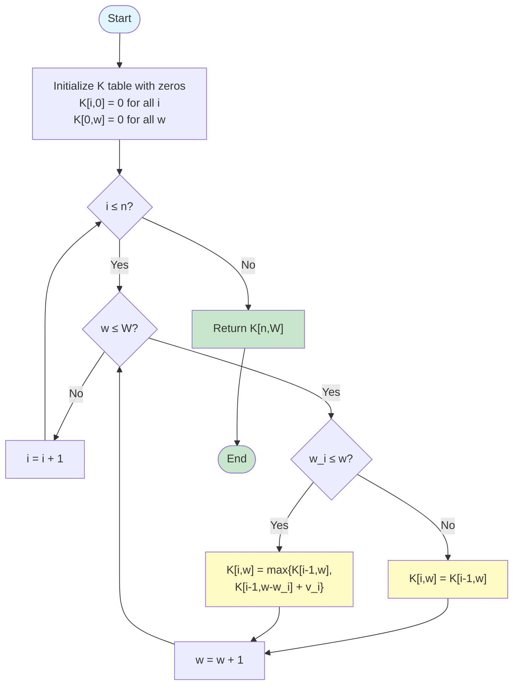

#dynamic-programming #array #matrix #brute-force #algorithm #algorithm-analysis #java #javascript #go #cpp #python

- The 0-1 knapsack problem is a classic optimization problem where items cannot be divided.
- Each item can be either included in the knapsack or excluded (binary choice: 0 or 1).
- The goal is to maximize the total value while respecting the weight capacity constraint.
# Problem
- Given:
	- $n$ distinct items
	- A knapsack with capacity $W$
	- Each item $i$ has:
		- Weight $w_i > 0$
		- Value $v_i > 0$
- Find a subset $S \subseteq \{1, 2, \ldots, n\}$ that maximizes: $$\sum_{i \in S} v_i$$
- Subject to the constraint: $$\sum_{i \in S} w_i \leq W$$

# Definitions
## Knapsack capacity
- The maximum weight $W$ that the knapsack can hold.
## Item weight and value
- Each item $i$ has weight $w_i$ and value $v_i$.
- Items are indivisible (cannot take fractional parts).
## Optimal solution
- A selection of items that maximizes total value without exceeding capacity $W$.
# Algorithm
## Optimal substructure
### Theorem
- Let $K[i, w]$ denote the maximum value achievable using items $1, 2, \ldots, i$ with knapsack capacity $w$.
- The optimal solution for $K[i, w]$ depends on whether item $i$ is included:
	1. If item $i$ is **not included**: $K[i, w] = K[i-1, w]$
	2. If item $i$ is **included**: $K[i, w] = K[i-1, w - w_i] + v_i$
		- This requires $w_i \leq w$ (item must fit)
- Therefore: $$K[i, w] = \max\{K[i-1, w], \, K[i-1, w - w_i] + v_i\}$$

### Proof
- **Case 1**: Item $i$ is not in the optimal solution
	- The optimal value is the same as the optimal value for items $1, \ldots, i-1$ with capacity $w$.
	- Therefore: $K[i, w] = K[i-1, w]$

- **Case 2**: Item $i$ is in the optimal solution
	- We must have $w_i \leq w$ (otherwise item cannot fit).
	- After including item $i$:
		- Remaining capacity: $w - w_i$
		- Value gained: $v_i$
	- The remaining capacity must be filled optimally using items $1, \ldots, i-1$.
	- Therefore: $K[i, w] = K[i-1, w - w_i] + v_i$

- Since we want to maximize value, we take the maximum of both cases.
## Recurrence relation
- Let $K[i, w]$ denote the maximum value using items $1 \ldots i$ with capacity $w$.
- The recurrence relation is: $$K[i, w] = \begin{cases}
0 & \text{if } i = 0 \text{ or } w = 0 \\
K[i-1, w] & \text{if } w_i > w \\
\max\{K[i-1, w], \, K[i-1, w - w_i] + v_i\} & \text{if } w_i \leq w
\end{cases}$$
## Dynamic programming approach
### Bottom-up computation
1. Initialize a table $K[0..n, 0..W]$ where $K[i, 0] = 0$ for all $i$ and $K[0, w] = 0$ for all $w$.
2. For $i = 1$ to $n$:
	- For $w = 1$ to $W$:
		- If $w_i > w$, then $K[i, w] = K[i-1, w]$ (item cannot fit)
		- Else $K[i, w] = \max\{K[i-1, w], \, K[i-1, w - w_i] + v_i\}$
3. Return $K[n, W]$
### Flowchart


# Example
## Input
- Number of items: $n = 4$
- Knapsack capacity: $W = 7$
- Items:

| Item $i$ | Weight $w_i$ | Value $v_i$ |
|----------|--------------|-------------|
| 1        | 1            | 1           |
| 2        | 3            | 4           |
| 3        | 4            | 5           |
| 4        | 5            | 7           |

## Computation table
$$
\begin{array}{c|c|c|c|c|c|c|c|c}
\text{Item} \backslash \text{Weight} & 0 & 1 & 2 & 3 & 4 & 5 & 6 & 7 \\
\hline
0 & 0 & 0 & 0 & 0 & 0 & 0 & 0 & 0 \\
\hline
1 \, (w=1, v=1) & 0 & 1 & 1 & 1 & 1 & 1 & 1 & 1 \\
\hline
2 \, (w=3, v=4) & 0 & 1 & 1 & 4 & 5 & 5 & 5 & 5 \\
\hline
3 \, (w=4, v=5) & 0 & 1 & 1 & 4 & 5 & 6 & 6 & 9 \\
\hline
4 \, (w=5, v=7) & 0 & 1 & 1 & 4 & 5 & 7 & 8 & 9 \\
\hline
\end{array}
$$

## Step-by-step calculation
### Row 1 (Item 1: $w_1=1, v_1=1$)
- $K[1,1] = \max\{K[0,1], K[0,0] + 1\} = \max\{0, 0+1\} = 1$
- $K[1,2] = \max\{K[0,2], K[0,1] + 1\} = \max\{0, 0+1\} = 1$
- All cells from capacity 1 onwards have value 1
### Row 2 (Item 2: $w_2=3, v_2=4$)
- $K[2,1] = K[1,1] = 1$ (item 2 doesn't fit)
- $K[2,2] = K[1,2] = 1$ (item 2 doesn't fit)
- $K[2,3] = \max\{K[1,3], K[1,0] + 4\} = \max\{1, 0+4\} = 4$
- $K[2,4] = \max\{K[1,4], K[1,1] + 4\} = \max\{1, 1+4\} = 5$
- $K[2,5] = \max\{K[1,5], K[1,2] + 4\} = \max\{1, 1+4\} = 5$
### Row 3 (Item 3: $w_3=4, v_3=5$)
- $K[3,4] = \max\{K[2,4], K[2,0] + 5\} = \max\{5, 0+5\} = 5$
- $K[3,5] = \max\{K[2,5], K[2,1] + 5\} = \max\{5, 1+5\} = 6$
- $K[3,7] = \max\{K[2,7], K[2,3] + 5\} = \max\{5, 4+5\} = 9$
### Row 4 (Item 4: $w_4=5, v_4=7$)
- $K[4,5] = \max\{K[3,5], K[3,0] + 7\} = \max\{6, 0+7\} = 7$
- $K[4,6] = \max\{K[3,6], K[3,1] + 7\} = \max\{6, 1+7\} = 8$
- $K[4,7] = \max\{K[3,7], K[3,2] + 7\} = \max\{9, 1+7\} = 9$
### Result
- Maximum value: $K[4,7] = 9$
- Selected items: Items 2 and 3 (weight $3+4=7$, value $4+5=9$)

## Tracing back the solution

```mermaid
graph TD
    Start["K&#91;4,7&#93; = 9<br/>Item 4: w=5, v=7"] --> Check1{K&#91;3,7&#93; = 9?}
    Check1 -->|Yes: item 4 not taken| Move1["K&#91;3,7&#93; = 9<br/>Item 3: w=4, v=5"]
    Move1 --> Check2{K&#91;2,7&#93; = 9?}
    Check2 -->|No: 5 ≠ 9<br/>Item 3 taken| Move2["K&#91;2,3&#93; = 4<br/>Item 2: w=3, v=4<br/>Remaining capacity: 7-4=3"]
    Move2 --> Check3{K&#91;1,3&#93; = 4?}
    Check3 -->|No: 1 ≠ 4<br/>Item 2 taken| Move3["K&#91;1,0&#93; = 0<br/>Item 1: w=1, v=1<br/>Remaining capacity: 3-3=0"]
    Move3 --> Done["K&#91;1,0&#93; = 0<br/>Done"]

    Move1 -.->|Add to knapsack| Item3[Item 3<br/>w=4, v=5]
    Move2 -.->|Add to knapsack| Item2[Item 2<br/>w=3, v=4]

    Item2 --> Item3 --> Result["Selected: Items 2, 3<br/>Total weight: 7<br/>Total value: 9"]

    style Move1 fill:#c8e6c9
    style Move2 fill:#c8e6c9
    style Result fill:#e1f5fe
```


# Implementation
## Java
### Bottom-up approach
```java title='0-1 Knapsack in Java: bottom-up approach' hl=8-9,12-18
public class Knapsack {
    public static int knapsack(int[] weights, int[] values, int W) {
        int n = weights.length;
        int[][] K = new int[n + 1][W + 1];

        // Initialize base cases
        for (int i = 0; i <= n; i++) K[i][0] = 0;
        for (int w = 0; w <= W; w++) K[0][w] = 0;

        // Fill the table
        for (int i = 1; i <= n; i++) {
            for (int w = 1; w <= W; w++) {
                if (weights[i - 1] > w) {
                    // Item cannot fit
                    K[i][w] = K[i - 1][w];
                } else {
                    // Take maximum of including or excluding item
                    K[i][w] = Math.max(K[i - 1][w],
                                      K[i - 1][w - weights[i - 1]] + values[i - 1]);
                }
            }
        }

        return K[n][W];
    }

    public static List<Integer> findItems(int[] weights, int[] values, int W) {
        int n = weights.length;
        int[][] K = new int[n + 1][W + 1];

        for (int i = 0; i <= n; i++) K[i][0] = 0;
        for (int w = 0; w <= W; w++) K[0][w] = 0;

        for (int i = 1; i <= n; i++) {
            for (int w = 1; w <= W; w++) {
                if (weights[i - 1] > w) {
                    K[i][w] = K[i - 1][w];
                } else {
                    K[i][w] = Math.max(K[i - 1][w],
                                      K[i - 1][w - weights[i - 1]] + values[i - 1]);
                }
            }
        }

        // Backtrack to find items
        List<Integer> items = new ArrayList<>();
        int i = n, w = W;
        while (i > 0 && w > 0) {
            if (K[i][w] != K[i - 1][w]) {
                // Item i was included
                items.add(i);
                w -= weights[i - 1];
            }
            i--;
        }

        Collections.reverse(items);
        return items;
    }
}
```
### Recursive approach with memoization
```java title='0-1 Knapsack in Java: recursive with memoization' hl=11-14,16-20
public class Knapsack {
    public static int knapsack(int[] weights, int[] values, int W) {
        int n = weights.length;
        int[][] memo = new int[n + 1][W + 1];
        for (int i = 0; i <= n; i++)
            for (int w = 0; w <= W; w++)
                memo[i][w] = -1;
        return knapsackHelper(weights, values, n, W, memo);
    }

    private static int knapsackHelper(int[] weights, int[] values, int i, int w, int[][] memo) {
        if (i == 0 || w == 0) return 0;
        if (memo[i][w] != -1) return memo[i][w];

        if (weights[i - 1] > w)
            memo[i][w] = knapsackHelper(weights, values, i - 1, w, memo);
        else
            memo[i][w] = Math.max(knapsackHelper(weights, values, i - 1, w, memo),
                                  knapsackHelper(weights, values, i - 1, w - weights[i - 1], memo)
                                  + values[i - 1]);

        return memo[i][w];
    }
}
```
## JavaScript
```javascript title='0-1 Knapsack in JavaScript: bottom-up approach' hl=8,11-17
function knapsack(weights, values, W) {
    const n = weights.length;
    const K = Array(n + 1).fill(null)
        .map(() => Array(W + 1).fill(0));

    // Base cases already initialized to 0

    // Fill the table
    for (let i = 1; i <= n; i++) {
        for (let w = 1; w <= W; w++) {
            if (weights[i - 1] > w) {
                K[i][w] = K[i - 1][w];
            } else {
                K[i][w] = Math.max(K[i - 1][w],
                                  K[i - 1][w - weights[i - 1]] + values[i - 1]);
            }
        }
    }

    return K[n][W];
}

function findItems(weights, values, W) {
    const n = weights.length;
    const K = Array(n + 1).fill(null)
        .map(() => Array(W + 1).fill(0));

    for (let i = 1; i <= n; i++) {
        for (let w = 1; w <= W; w++) {
            if (weights[i - 1] > w) {
                K[i][w] = K[i - 1][w];
            } else {
                K[i][w] = Math.max(K[i - 1][w],
                                  K[i - 1][w - weights[i - 1]] + values[i - 1]);
            }
        }
    }

    // Backtrack
    const items = [];
    let i = n, w = W;
    while (i > 0 && w > 0) {
        if (K[i][w] !== K[i - 1][w]) {
            items.unshift(i);
            w -= weights[i - 1];
        }
        i--;
    }

    return items;
}
```
## Python
```python title='0-1 Knapsack in Python: bottom-up approach' hl=7,10-16
def knapsack(weights: list[int], values: list[int], W: int) -> int:
    n = len(weights)
    K = [[0] * (W + 1) for _ in range(n + 1)]

    # Base cases already initialized to 0

    # Fill the table
    for i in range(1, n + 1):
        for w in range(1, W + 1):
            if weights[i - 1] > w:
                K[i][w] = K[i - 1][w]
            else:
                K[i][w] = max(K[i - 1][w],
                             K[i - 1][w - weights[i - 1]] + values[i - 1])

    return K[n][W]

def find_items(weights: list[int], values: list[int], W: int) -> list[int]:
    n = len(weights)
    K = [[0] * (W + 1) for _ in range(n + 1)]

    for i in range(1, n + 1):
        for w in range(1, W + 1):
            if weights[i - 1] > w:
                K[i][w] = K[i - 1][w]
            else:
                K[i][w] = max(K[i - 1][w],
                             K[i - 1][w - weights[i - 1]] + values[i - 1])

    # Backtrack
    items = []
    i, w = n, W
    while i > 0 and w > 0:
        if K[i][w] != K[i - 1][w]:
            items.insert(0, i)
            w -= weights[i - 1]
        i -= 1

    return items
```
## Go
```go title='0-1 Knapsack in Go: bottom-up approach' hl=8-9,12-18
package main

func knapsack(weights, values []int, W int) int {
	n := len(weights)
	K := make([][]int, n+1)
	for i := range K {
		K[i] = make([]int, W+1)
	}

	// Base cases already initialized to 0

	// Fill the table
	for i := 1; i <= n; i++ {
		for w := 1; w <= W; w++ {
			if weights[i-1] > w {
				K[i][w] = K[i-1][w]
			} else {
				K[i][w] = max(K[i-1][w],
					K[i-1][w-weights[i-1]]+values[i-1])
			}
		}
	}

	return K[n][W]
}

func findItems(weights, values []int, W int) []int {
	n := len(weights)
	K := make([][]int, n+1)
	for i := range K {
		K[i] = make([]int, W+1)
	}

	for i := 1; i <= n; i++ {
		for w := 1; w <= W; w++ {
			if weights[i-1] > w {
				K[i][w] = K[i-1][w]
			} else {
				K[i][w] = max(K[i-1][w],
					K[i-1][w-weights[i-1]]+values[i-1])
			}
		}
	}

	// Backtrack
	var items []int
	i, w := n, W
	for i > 0 && w > 0 {
		if K[i][w] != K[i-1][w] {
			items = append([]int{i}, items...)
			w -= weights[i-1]
		}
		i--
	}

	return items
}

func max(a, b int) int {
	if a > b {
		return a
	}
	return b
}
```
## C++
```cpp title='0-1 Knapsack in C++: bottom-up approach' hl=10-11,14-20
#include <vector>
#include <algorithm>

int knapsack(const std::vector<int>& weights, const std::vector<int>& values, int W) {
    int n = weights.size();
    std::vector<std::vector<int>> K(n + 1, std::vector<int>(W + 1, 0));

    // Base cases already initialized to 0

    // Fill the table
    for (int i = 1; i <= n; i++) {
        for (int w = 1; w <= W; w++) {
            if (weights[i - 1] > w) {
                K[i][w] = K[i - 1][w];
            } else {
                K[i][w] = std::max(K[i - 1][w],
                                  K[i - 1][w - weights[i - 1]] + values[i - 1]);
            }
        }
    }

    return K[n][W];
}

std::vector<int> findItems(const std::vector<int>& weights,
                          const std::vector<int>& values, int W) {
    int n = weights.size();
    std::vector<std::vector<int>> K(n + 1, std::vector<int>(W + 1, 0));

    for (int i = 1; i <= n; i++) {
        for (int w = 1; w <= W; w++) {
            if (weights[i - 1] > w) {
                K[i][w] = K[i - 1][w];
            } else {
                K[i][w] = std::max(K[i - 1][w],
                                  K[i - 1][w - weights[i - 1]] + values[i - 1]);
            }
        }
    }

    // Backtrack
    std::vector<int> items;
    int i = n, w = W;
    while (i > 0 && w > 0) {
        if (K[i][w] != K[i - 1][w]) {
            items.insert(items.begin(), i);
            w -= weights[i - 1];
        }
        i--;
    }

    return items;
}
```
# Complexity
## Time complexity
### Bottom-up approach
- The algorithm fills a table of size $(n+1) \times (W+1)$.
- Each entry requires $O(1)$ time to compute.
- Total time complexity: $$T(n, W) = \Theta(nW)$$
- **Note**: This is **pseudo-polynomial** time because $W$ is not polynomial in the input size (which is $\log W$ bits).

### Recursive  approach without memoization
- The recurrence relation is: $$T(n, W) = T(n-1, W) + T(n-1, W-w_n) + O(1)$$
- This leads to exponential time complexity: $$T(n, W) = O(2^n)$$

### Recursive approach with memoization
- Each subproblem is computed at most once.
- There are $(n+1)(W+1)$ subproblems.
- Total time complexity: $$T(n, W) = \Theta(nW)$$

## Space complexity
### Bottom-up approach
- Requires a table of size $(n+1) \times (W+1)$.
- Space complexity: $$S(n, W) = \Theta(nW)$$

### Space-optimized approach
- Only two rows of the table are needed at any time (current and previous).
- Alternatively, a single 1D array can be used with reverse iteration.
- Space complexity: $$S(n, W) = \Theta(W)$$

### Recursive approach with memoization
- Requires memoization table of size $(n+1) \times (W+1)$.
- Recursion stack depth is $O(n)$.
- Total space complexity: $$S(n, W) = \Theta(nW)$$
***
# References
1. Algorithms Analysis and Design Slides - Võ Thị Ngọc Châu.
	1. Chapter 5: Dynamic Programming and Greedy Algorithms.
2. Introduction to Algorithms - Thomas H.Cormen, Charles E.Leserson, Ronald L.Rivest, Cliffford Stein - The MIT Press - Third Edition 2009.
	1. Chapter IV. Advanced Design and Analysis Techniques.
		1. Section 15. Dynamic Programming.
3. https://cp-algorithms.com/dynamic_programming/knapsack.html
4. https://en.wikipedia.org/wiki/Knapsack_problem
