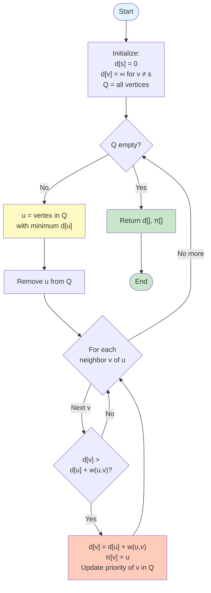
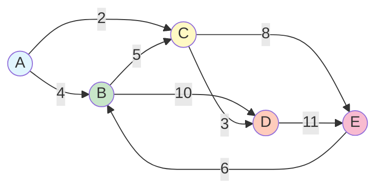
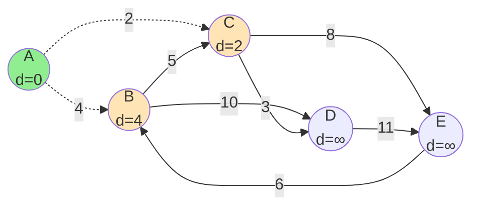
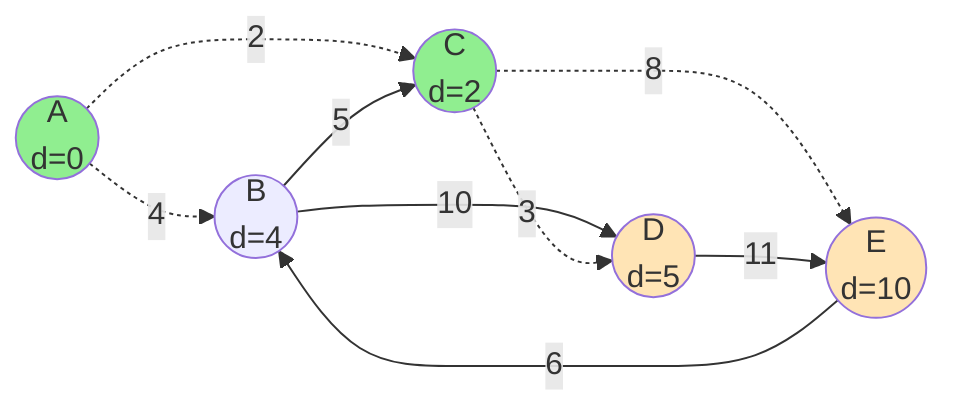
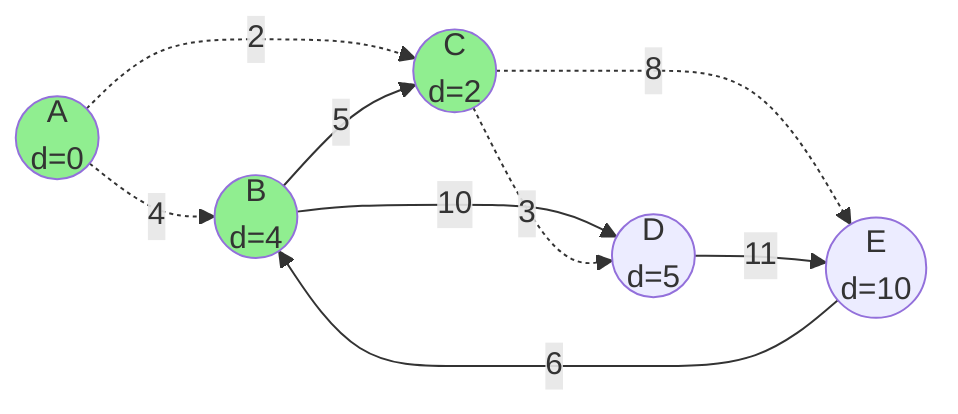
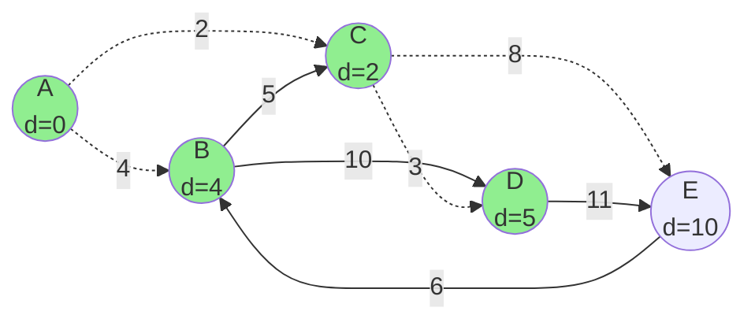
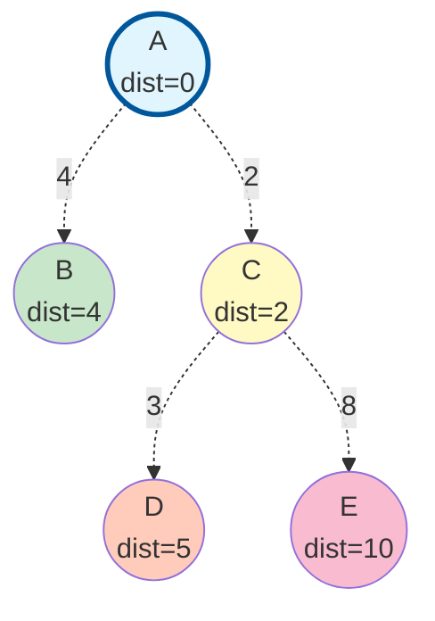
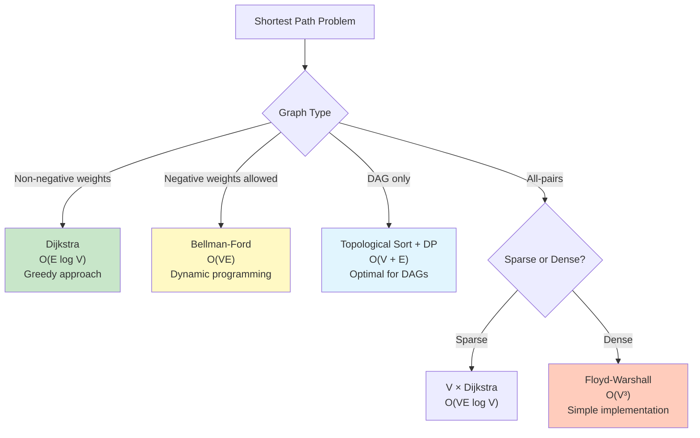

#graph-theory #algorithm #shortest-path #greedy-algorithm #priority-queue #dijkstra #routing #java #javascript #python #go #cpp

- Dijkstra's algorithm finds the shortest path from a source vertex to all other vertices in a weighted graph.
- <mark class="hltr-yellow">Uses a greedy approach with a priority queue to iteratively select the closest unvisited vertex</mark>.
- Works only for graphs with non-negative edge weights.

# Problem
- Given:
	- A weighted, directed or undirected graph $G = (V, E)$
	- A source vertex $s \in V$
	- Edge weights $w: E \rightarrow \mathbb{R}^+$ (non-negative)
- Find:
	- The shortest path distance from $s$ to every vertex $v \in V$
	- Optionally, the actual shortest path tree

# Definitions
## Shortest path
- A path $p = \langle v_0, v_1, \ldots, v_k \rangle$ from $v_0$ to $v_k$ where the sum of edge weights is minimized.
- Path weight: $$w(p) = \sum_{i=1}^{k} w(v_{i-1}, v_i)$$

## Shortest path distance
- The minimum weight of any path from $s$ to $v$: $$\delta(s, v) = \begin{cases}
\min\{w(p) : s \xrightarrow{p} v\} & \text{if path exists} \\
\infty & \text{otherwise}
\end{cases}$$

## Relaxation
- <mark class="hltr-yellow">The process of updating the shortest path estimate when a better path is found</mark>.
- For edge $(u, v)$ with weight $w(u, v)$:
	- If $d[v] > d[u] + w(u, v)$, then set $d[v] = d[u] + w(u, v)$ and $\pi[v] = u$
	- Where $d[v]$ is current distance estimate and $\pi[v]$ is predecessor

# Algorithm
## Greedy approach
- <mark class="hltr-yellow">At each step, select the unvisited vertex with the smallest distance estimate</mark>.
- Once a vertex is visited, its shortest distance is final (greedy choice property).
- Relax all edges from the selected vertex to update neighbors.

## Optimal substructure
### Theorem
- Any subpath of a shortest path is itself a shortest path.
- If $p = \langle v_0, v_1, \ldots, v_k \rangle$ is a shortest path from $v_0$ to $v_k$, then for any $0 \leq i \leq j \leq k$, the subpath $p_{ij} = \langle v_i, v_{i+1}, \ldots, v_j \rangle$ is a shortest path from $v_i$ to $v_j$.

### Proof sketch
- Suppose $p$ is shortest but $p_{ij}$ is not.
- Then there exists a shorter path $p'_{ij}$ from $v_i$ to $v_j$.
- Replacing $p_{ij}$ with $p'_{ij}$ in $p$ yields a shorter path from $v_0$ to $v_k$.
- This contradicts the assumption that $p$ is shortest.

## Dijkstra's algorithm steps
1. **Initialize**:
	- Set $d[s] = 0$ (distance to source is 0)
	- Set $d[v] = \infty$ for all $v \neq s$
	- Set $\pi[v] = \text{null}$ for all $v$ (predecessor)
	- Create priority queue $Q$ with all vertices, prioritized by $d[v]$

2. **Main loop** (while $Q$ is not empty):
	- Extract vertex $u$ with minimum $d[u]$ from $Q$
	- For each neighbor $v$ of $u$:
		- **Relax edge** $(u, v)$:
			- If $d[v] > d[u] + w(u, v)$:
				- Set $d[v] = d[u] + w(u, v)$
				- Set $\pi[v] = u$
				- Update $v$'s priority in $Q$

3. **Result**:
	- Array $d[]$ contains shortest distances from $s$ to all vertices
	- Array $\pi[]$ can be used to reconstruct shortest paths

## Pseudocode
```
DIJKSTRA(G, w, s):
    // Initialize
    for each vertex v ∈ G.V:
        d[v] = ∞
        π[v] = null
    d[s] = 0

    // Priority queue with all vertices
    Q = MAKE-PRIORITY-QUEUE(G.V, d)

    // Main loop
    while Q is not empty:
        u = EXTRACT-MIN(Q)

        for each neighbor v of u:
            // Relaxation
            if d[v] > d[u] + w(u, v):
                d[v] = d[u] + w(u, v)
                π[v] = u
                DECREASE-KEY(Q, v, d[v])

    return d, π
```

## Flowchart


# Example
## Input graph


**Adjacency representation**:
- $A$: $(B, 4), (C, 2)$
- $B$: $(C, 5), (D, 10)$
- $C$: $(D, 3), (E, 8)$
- $D$: $(E, 11)$
- $E$: $(B, 6)$

**Goal**: Find shortest paths from source $A$ to all other vertices.

## Step-by-step execution
### Initial state
| Vertex | Distance $d[v]$ | Predecessor $\pi[v]$ | In Queue $Q$ |
|--------|-----------------|----------------------|--------------|
| A      | 0               | null                 | Yes          |
| B      | ∞               | null                 | Yes          |
| C      | ∞               | null                 | Yes          |
| D      | ∞               | null                 | Yes          |
| E      | ∞               | null                 | Yes          |

### Iteration 1: Extract $A$ (distance = 0)
- **Extract**: $u = A$ (minimum distance = 0)
- **Relax edges from A**:
	- Edge $(A, B)$ with weight 4:
		- $d[B] = \infty > d[A] + 4 = 0 + 4 = 4$ ✓
		- Update: $d[B] = 4$, $\pi[B] = A$
	- Edge $(A, C)$ with weight 2:
		- $d[C] = \infty > d[A] + 2 = 0 + 2 = 2$ ✓
		- Update: $d[C] = 2$, $\pi[C] = A$



**Current state**:
| Vertex | Distance | Predecessor | In Queue |
|--------|----------|-------------|----------|
| A      | 0        | null        | **No**   |
| B      | 4        | A           | Yes      |
| C      | 2        | A           | Yes      |
| D      | ∞        | null        | Yes      |
| E      | ∞        | null        | Yes      |

### Iteration 2: Extract $C$ (distance = 2)
- **Extract**: $u = C$ (minimum distance = 2)
- **Relax edges from C**:
	- Edge $(C, D)$ with weight 3:
		- $d[D] = \infty > d[C] + 3 = 2 + 3 = 5$ ✓
		- Update: $d[D] = 5$, $\pi[D] = C$
	- Edge $(C, E)$ with weight 8:
		- $d[E] = \infty > d[C] + 8 = 2 + 8 = 10$ ✓
		- Update: $d[E] = 10$, $\pi[E] = C$



**Current state**:
| Vertex | Distance | Predecessor | In Queue |
|--------|----------|-------------|----------|
| A      | 0        | null        | No       |
| B      | 4        | A           | Yes      |
| C      | 2        | A           | **No**   |
| D      | 5        | C           | Yes      |
| E      | 10       | C           | Yes      |

### Iteration 3: Extract $B$ (distance = 4)
- **Extract**: $u = B$ (minimum distance = 4)
- **Relax edges from B**:
	- Edge $(B, C)$ with weight 5:
		- $d[C] = 2 \not> d[B] + 5 = 4 + 5 = 9$ ✗
		- No update (C already has better path)
	- Edge $(B, D)$ with weight 10:
		- $d[D] = 5 \not> d[B] + 10 = 4 + 10 = 14$ ✗
		- No update



**Current state**:
| Vertex | Distance | Predecessor | In Queue |
|--------|----------|-------------|----------|
| A      | 0        | null        | No       |
| B      | 4        | A           | **No**   |
| C      | 2        | A           | No       |
| D      | 5        | C           | Yes      |
| E      | 10       | C           | Yes      |

### Iteration 4: Extract $D$ (distance = 5)
- **Extract**: $u = D$ (minimum distance = 5)
- **Relax edges from D**:
	- Edge $(D, E)$ with weight 11:
		- $d[E] = 10 \not> d[D] + 11 = 5 + 11 = 16$ ✗
		- No update



**Current state**:
| Vertex | Distance | Predecessor | In Queue |
|--------|----------|-------------|----------|
| A      | 0        | null        | No       |
| B      | 4        | A           | No       |
| C      | 2        | A           | No       |
| D      | 5        | C           | **No**   |
| E      | 10       | C           | Yes      |

### Iteration 5: Extract $E$ (distance = 10)
- **Extract**: $u = E$ (minimum distance = 10)
- **Relax edges from E**:
	- Edge $(E, B)$ with weight 6:
		- $d[B] = 4 \not> d[E] + 6 = 10 + 6 = 16$ ✗
		- No update

**Current state**:
| Vertex | Distance | Predecessor | In Queue |
|--------|----------|-------------|----------|
| A      | 0        | null        | No       |
| B      | 4        | A           | No       |
| C      | 2        | A           | No       |
| D      | 5        | C           | No       |
| E      | 10       | C           | **No**   |

Queue is empty. **Algorithm terminates**.

## Final result
### Shortest distances from $A$
| Vertex | Shortest Distance | Path              |
|--------|-------------------|-------------------|
| A      | 0                 | $A$               |
| B      | 4                 | $A \to B$         |
| C      | 2                 | $A \to C$         |
| D      | 5                 | $A \to C \to D$   |
| E      | 10                | $A \to C \to E$   |

### Shortest path tree


The tree shows the shortest paths from $A$ to all reachable vertices.

# Implementation
## Java
### Using priority queue
```java title='Dijkstra algorithm in Java with priority queue' hl=16-17,21-36
import java.util.*;

class Dijkstra {
    static class Edge {
        int to, weight;
        Edge(int to, int weight) {
            this.to = to;
            this.weight = weight;
        }
    }

    static class Node implements Comparable<Node> {
        int vertex, distance;
        Node(int vertex, int distance) {
            this.vertex = vertex;
            this.distance = distance;
        }
        public int compareTo(Node other) {
            return Integer.compare(this.distance, other.distance);
        }
    }

    public static int[] dijkstra(List<List<Edge>> graph, int source) {
        int n = graph.size();
        int[] dist = new int[n];
        Arrays.fill(dist, Integer.MAX_VALUE);
        dist[source] = 0;

        PriorityQueue<Node> pq = new PriorityQueue<>();
        pq.offer(new Node(source, 0));

        while (!pq.isEmpty()) {
            Node current = pq.poll();
            int u = current.vertex;

            // Skip if we've already found a better path
            if (current.distance > dist[u]) continue;

            // Relax edges
            for (Edge edge : graph.get(u)) {
                int v = edge.to;
                int newDist = dist[u] + edge.weight;

                if (newDist < dist[v]) {
                    dist[v] = newDist;
                    pq.offer(new Node(v, newDist));
                }
            }
        }

        return dist;
    }

    // Variant: Return both distances and predecessors
    public static class Result {
        int[] dist;
        int[] pred;
        Result(int[] dist, int[] pred) {
            this.dist = dist;
            this.pred = pred;
        }
    }

    public static Result dijkstraWithPath(List<List<Edge>> graph, int source) {
        int n = graph.size();
        int[] dist = new int[n];
        int[] pred = new int[n];
        Arrays.fill(dist, Integer.MAX_VALUE);
        Arrays.fill(pred, -1);
        dist[source] = 0;

        PriorityQueue<Node> pq = new PriorityQueue<>();
        pq.offer(new Node(source, 0));

        while (!pq.isEmpty()) {
            Node current = pq.poll();
            int u = current.vertex;

            if (current.distance > dist[u]) continue;

            for (Edge edge : graph.get(u)) {
                int v = edge.to;
                int newDist = dist[u] + edge.weight;

                if (newDist < dist[v]) {
                    dist[v] = newDist;
                    pred[v] = u;
                    pq.offer(new Node(v, newDist));
                }
            }
        }

        return new Result(dist, pred);
    }

    // Reconstruct path from source to target
    public static List<Integer> reconstructPath(int[] pred, int target) {
        List<Integer> path = new ArrayList<>();
        for (int v = target; v != -1; v = pred[v]) {
            path.add(v);
        }
        Collections.reverse(path);
        return path;
    }
}
```

## JavaScript
```javascript title='Dijkstra algorithm in JavaScript' hl=6-7,11-27
class MinHeap {
    constructor() {
        this.heap = [];
    }

    push(node) {
        this.heap.push(node);
        this.bubbleUp(this.heap.length - 1);
    }

    pop() {
        if (this.heap.length === 0) return null;
        const min = this.heap[0];
        const last = this.heap.pop();
        if (this.heap.length > 0) {
            this.heap[0] = last;
            this.bubbleDown(0);
        }
        return min;
    }

    isEmpty() {
        return this.heap.length === 0;
    }

    bubbleUp(idx) {
        while (idx > 0) {
            const parent = Math.floor((idx - 1) / 2);
            if (this.heap[parent].distance <= this.heap[idx].distance) break;
            [this.heap[parent], this.heap[idx]] = [this.heap[idx], this.heap[parent]];
            idx = parent;
        }
    }

    bubbleDown(idx) {
        while (true) {
            const left = 2 * idx + 1;
            const right = 2 * idx + 2;
            let smallest = idx;

            if (left < this.heap.length &&
                this.heap[left].distance < this.heap[smallest].distance) {
                smallest = left;
            }
            if (right < this.heap.length &&
                this.heap[right].distance < this.heap[smallest].distance) {
                smallest = right;
            }

            if (smallest === idx) break;
            [this.heap[idx], this.heap[smallest]] = [this.heap[smallest], this.heap[idx]];
            idx = smallest;
        }
    }
}

function dijkstra(graph, source) {
    const n = graph.length;
    const dist = Array(n).fill(Infinity);
    dist[source] = 0;

    const pq = new MinHeap();
    pq.push({ vertex: source, distance: 0 });

    while (!pq.isEmpty()) {
        const { vertex: u, distance: currentDist } = pq.pop();

        if (currentDist > dist[u]) continue;

        for (const { to: v, weight } of graph[u]) {
            const newDist = dist[u] + weight;

            if (newDist < dist[v]) {
                dist[v] = newDist;
                pq.push({ vertex: v, distance: newDist });
            }
        }
    }

    return dist;
}

function dijkstraWithPath(graph, source) {
    const n = graph.length;
    const dist = Array(n).fill(Infinity);
    const pred = Array(n).fill(-1);
    dist[source] = 0;

    const pq = new MinHeap();
    pq.push({ vertex: source, distance: 0 });

    while (!pq.isEmpty()) {
        const { vertex: u, distance: currentDist } = pq.pop();

        if (currentDist > dist[u]) continue;

        for (const { to: v, weight } of graph[u]) {
            const newDist = dist[u] + weight;

            if (newDist < dist[v]) {
                dist[v] = newDist;
                pred[v] = u;
                pq.push({ vertex: v, distance: newDist });
            }
        }
    }

    return { dist, pred };
}
```

## Python
```python title='Dijkstra algorithm in Python' hl=7,10-26
import heapq
from typing import List, Tuple, Dict

def dijkstra(graph: List[List[Tuple[int, int]]], source: int) -> List[int]:
    """
    graph[u] = [(v, weight), ...] - adjacency list
    Returns shortest distances from source to all vertices
    """
    n = len(graph)
    dist = [float('inf')] * n
    dist[source] = 0

    # Priority queue: (distance, vertex)
    pq = [(0, source)]

    while pq:
        current_dist, u = heapq.heappop(pq)

        # Skip if we've found a better path
        if current_dist > dist[u]:
            continue

        # Relax edges
        for v, weight in graph[u]:
            new_dist = dist[u] + weight

            if new_dist < dist[v]:
                dist[v] = new_dist
                heapq.heappush(pq, (new_dist, v))

    return dist

def dijkstra_with_path(graph: List[List[Tuple[int, int]]], source: int) \
        -> Tuple[List[int], List[int]]:
    """
    Returns (distances, predecessors)
    """
    n = len(graph)
    dist = [float('inf')] * n
    pred = [-1] * n
    dist[source] = 0

    pq = [(0, source)]

    while pq:
        current_dist, u = heapq.heappop(pq)

        if current_dist > dist[u]:
            continue

        for v, weight in graph[u]:
            new_dist = dist[u] + weight

            if new_dist < dist[v]:
                dist[v] = new_dist
                pred[v] = u
                heapq.heappush(pq, (new_dist, v))

    return dist, pred

def reconstruct_path(pred: List[int], target: int) -> List[int]:
    """Reconstruct path from source to target using predecessor array"""
    path = []
    v = target
    while v != -1:
        path.append(v)
        v = pred[v]
    path.reverse()
    return path
```

## Go
```go title='Dijkstra algorithm in Go' hl=18-19,23-39
package main

import "container/heap"

type Edge struct {
	to, weight int
}

type Node struct {
	vertex, distance int
}

type PriorityQueue []Node

func (pq PriorityQueue) Len() int           { return len(pq) }
func (pq PriorityQueue) Less(i, j int) bool { return pq[i].distance < pq[j].distance }
func (pq PriorityQueue) Swap(i, j int)      { pq[i], pq[j] = pq[j], pq[i] }

func (pq *PriorityQueue) Push(x interface{}) {
	*pq = append(*pq, x.(Node))
}

func (pq *PriorityQueue) Pop() interface{} {
	old := *pq
	n := len(old)
	item := old[n-1]
	*pq = old[0 : n-1]
	return item
}

func dijkstra(graph [][]Edge, source int) []int {
	n := len(graph)
	dist := make([]int, n)
	for i := range dist {
		dist[i] = int(1e9) // infinity
	}
	dist[source] = 0

	pq := &PriorityQueue{}
	heap.Init(pq)
	heap.Push(pq, Node{source, 0})

	for pq.Len() > 0 {
		current := heap.Pop(pq).(Node)
		u := current.vertex

		if current.distance > dist[u] {
			continue
		}

		for _, edge := range graph[u] {
			v := edge.to
			newDist := dist[u] + edge.weight

			if newDist < dist[v] {
				dist[v] = newDist
				heap.Push(pq, Node{v, newDist})
			}
		}
	}

	return dist
}

func dijkstraWithPath(graph [][]Edge, source int) ([]int, []int) {
	n := len(graph)
	dist := make([]int, n)
	pred := make([]int, n)
	for i := range dist {
		dist[i] = int(1e9)
		pred[i] = -1
	}
	dist[source] = 0

	pq := &PriorityQueue{}
	heap.Init(pq)
	heap.Push(pq, Node{source, 0})

	for pq.Len() > 0 {
		current := heap.Pop(pq).(Node)
		u := current.vertex

		if current.distance > dist[u] {
			continue
		}

		for _, edge := range graph[u] {
			v := edge.to
			newDist := dist[u] + edge.weight

			if newDist < dist[v] {
				dist[v] = newDist
				pred[v] = u
				heap.Push(pq, Node{v, newDist})
			}
		}
	}

	return dist, pred
}
```

## C++
```cpp title='Dijkstra algorithm in C++' hl=13-14,18-35
#include <vector>
#include <queue>
#include <utility>
#include <limits>

using namespace std;

struct Edge {
    int to, weight;
};

vector<int> dijkstra(const vector<vector<Edge>>& graph, int source) {
    int n = graph.size();
    vector<int> dist(n, numeric_limits<int>::max());
    dist[source] = 0;

    // Priority queue: (distance, vertex)
    priority_queue<pair<int, int>, vector<pair<int, int>>, greater<>> pq;
    pq.push({0, source});

    while (!pq.empty()) {
        auto [current_dist, u] = pq.top();
        pq.pop();

        if (current_dist > dist[u]) continue;

        for (const auto& edge : graph[u]) {
            int v = edge.to;
            int new_dist = dist[u] + edge.weight;

            if (new_dist < dist[v]) {
                dist[v] = new_dist;
                pq.push({new_dist, v});
            }
        }
    }

    return dist;
}

struct Result {
    vector<int> dist;
    vector<int> pred;
};

Result dijkstraWithPath(const vector<vector<Edge>>& graph, int source) {
    int n = graph.size();
    vector<int> dist(n, numeric_limits<int>::max());
    vector<int> pred(n, -1);
    dist[source] = 0;

    priority_queue<pair<int, int>, vector<pair<int, int>>, greater<>> pq;
    pq.push({0, source});

    while (!pq.empty()) {
        auto [current_dist, u] = pq.top();
        pq.pop();

        if (current_dist > dist[u]) continue;

        for (const auto& edge : graph[u]) {
            int v = edge.to;
            int new_dist = dist[u] + edge.weight;

            if (new_dist < dist[v]) {
                dist[v] = new_dist;
                pred[v] = u;
                pq.push({new_dist, v});
            }
        }
    }

    return {dist, pred};
}

vector<int> reconstructPath(const vector<int>& pred, int target) {
    vector<int> path;
    for (int v = target; v != -1; v = pred[v]) {
        path.push_back(v);
    }
    reverse(path.begin(), path.end());
    return path;
}
```

# Complexity
## Time complexity
- Let $|V|$ = number of vertices, $|E|$ = number of edges.

### With binary heap (priority queue)
- Each vertex is extracted from the priority queue once: $O(|V| \log |V|)$
- Each edge is relaxed at most once, with decrease-key operation: $O(|E| \log |V|)$
- **Total time complexity**: $$T(V, E) = O((|V| + |E|) \log |V|) = O(|E| \log |V|)$$
	- For connected graphs, $|E| \geq |V| - 1$, so the complexity simplifies to $O(|E| \log |V|)$

### With Fibonacci heap
- Extract-min: $O(\log |V|)$ amortized
- Decrease-key: $O(1)$ amortized
- **Total time complexity**: $$T(V, E) = O(|V| \log |V| + |E|)$$
	- Better for dense graphs where $|E|$ is close to $|V|^2$

### With simple array (linear search)
- Extract minimum from array: $O(|V|)$
- Performed $|V|$ times: $O(|V|^2)$
- **Total time complexity**: $$T(V, E) = O(|V|^2)$$
	- Better for dense graphs where $|E| \approx |V|^2$ and priority queue overhead is significant

## Space complexity
- Distance array: $O(|V|)$
- Predecessor array: $O(|V|)$
- Priority queue: $O(|V|)$ (in worst case, all vertices in queue)
- Adjacency list representation: $O(|V| + |E|)$
- **Total space complexity**: $$S(V, E) = O(|V| + |E|)$$

# Correctness
## Invariant
- <mark class="hltr-yellow">When a vertex is extracted from the priority queue, its shortest distance is final and optimal</mark>.

## Proof sketch
- **Base case**: Source vertex $s$ has distance 0, which is optimal.
- **Inductive step**: Assume all previously extracted vertices have optimal distances.
	- Let $u$ be the next vertex extracted with distance $d[u]$.
	- Suppose for contradiction that there exists a shorter path $p$ to $u$ with weight $w(p) < d[u]$.
	- Path $p$ must leave the set of extracted vertices at some edge $(x, y)$.
	- But then $d[y] \leq d[x] + w(x, y) \leq w(p) < d[u]$.
	- This contradicts the fact that $u$ was extracted (it should have minimum distance).
	- Therefore, $d[u]$ is optimal.

# Limitations and Variations
## Non-negative weights requirement
- <mark class="hltr-yellow">Dijkstra's algorithm fails with negative edge weights</mark>.
- Negative weights can invalidate the greedy choice (a vertex's distance may decrease after being finalized).
- For graphs with negative weights, use **Bellman-Ford algorithm** instead.

## Single-source vs all-pairs
- Dijkstra finds shortest paths from **one source** to all vertices.
- For all-pairs shortest paths, run Dijkstra $|V|$ times or use **Floyd-Warshall algorithm**.

## Comparison with other algorithms


***
# References
1. Introduction to Algorithms - Thomas H. Cormen, Charles E. Leiserson, Ronald L. Rivest, Clifford Stein - The MIT Press - Third Edition 2009.
	1. Chapter 24: Single-Source Shortest Paths.
		1. Section 24.3: Dijkstra's Algorithm.
2. Algorithms - Robert Sedgewick, Kevin Wayne - Addison-Wesley - 4th Edition 2011.
	1. Chapter 4: Graphs.
		1. Section 4.4: Shortest Paths.
3. Algorithm Design - Jon Kleinberg, Éva Tardos - Pearson - 2005.
	1. Chapter 4: Greedy Algorithms.
		1. Section 4.4: Shortest Paths in a Graph.
4. https://en.wikipedia.org/wiki/Dijkstra%27s_algorithm
5. https://cp-algorithms.com/graph/dijkstra.html
