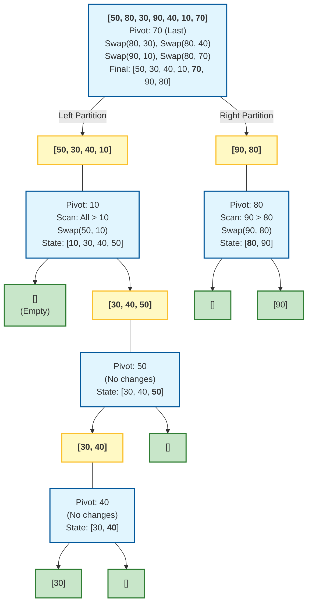
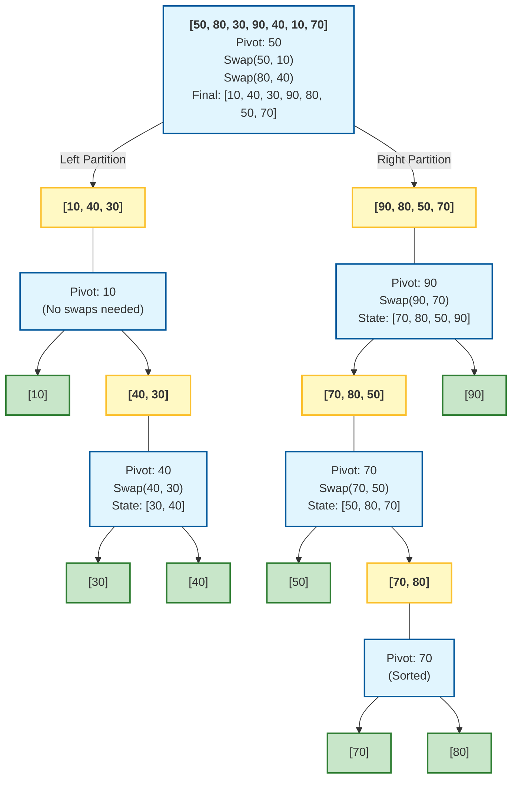
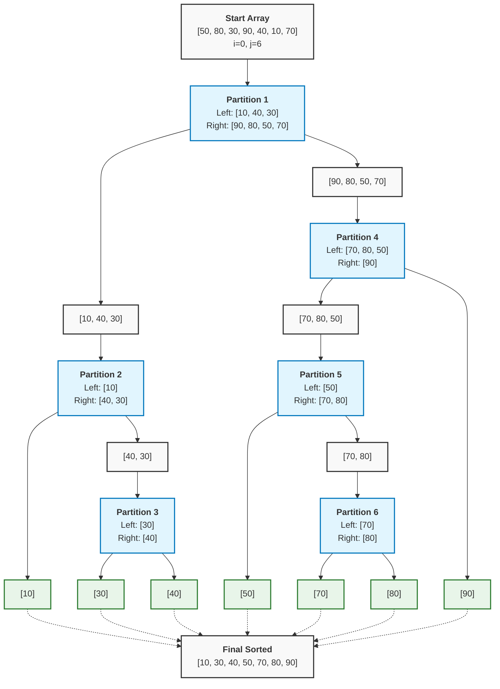

#quicksort #sorting #algorithm #java 
- Quicksort is an internal sorting algorithm.
# Algorithm
- Sort array $a$ in range $[l, r]$:
	- if $l<r$ then:
		- $k=partition(a,l,r)$ : pivot position.
		- $quicksort(a,l,k-1)$
		- $quicksort(a,k+1,r)$
## Lomuto's partition
-  The rightmost element is chosen as the initial pivot.
### Idea
- Attempts to move all elements that are less than $pivot$ to the left and all elements that are greater than $pivot$ to the right.
- Two pointer are used to perform one-way traversal.
### Method
- $pivot=a_r$
- $i=l-1$ 
- for $j=l$ to $r-1$:
	- if $a_j \leq pivot$ :
		- $i=i+1$
		- $swap(a_i,a_j)$
- $swap(a_{i+1}, a_r)$
- return $i+1$
### Characteristics
#### Three regions while looping
- 
- $l=p$ (MIT book notation).
- $a_l \to a_i \leq pivot$
- $a_{i+1} \to a_{j-1} > pivot$
#### Determine which regions a element should belong to
- 
- $i$ moves forward step by step.
- $j$ is entry for element needing to be swapped.
- $a_j < pivot$ $\implies$ move $a_j$ to the first region; otherwise, it currently stays in the right position.
### Example

## Hoare's partition
- The pivot is *not necessarily* the final position of the array.
- The pivot is *not guaranteed* to stay its correct position in the immediate sorting states.
### Idea
- Initializes two pointers at the two ends of the array. 
- The two indexes moves towards each other until an inversion where a smaller value on the left side and a larger value on the right side occurs. Then, two elements are swapped.
- The process is repeated until two pointers meet each other.
### Method
- Initialize $\text{pivot} \leftarrow a_l, \space i \leftarrow l-1, \space j \leftarrow r+1$.
- while True:
	- repeat $j \leftarrow j-1$ until $a_j \leq \text{pivot}$
	- repeat $i \leftarrow i + 1$ until $a_i \geq \text{pivot}$
	- if $i < j$ then $\text{swap}(a_i, a_j)$
	-  else then return $j$
### Characteristics
#### Two regions after each partition
- After each partition, the sorting sub-array is divided into two region:
	- The left region contains the elements that are smaller than pivot.
	- The right region contains the elements that are greater or equal to pivot. 

#### Pivot position is not guaranteed
- Hoare's partition ensures the correct split into the two regions, but not the pivot position.
#### Example


# Implementation
## Lomuto's partition
### Java
```Java title='Quicksort in Java: Lomuto partition' hl=16-17,26
public class QuickSort {
    
    public static void quickSort(int[] arr) {
        if (arr == null || arr.length == 0) {
            return;
        }
        quickSortHelper(arr, 0, arr.length - 1);
    }
    
    private static void quickSortHelper(int[] arr, int low, int high) {
        if (low < high) {
            // Partition the array and get pivot index
            int pivotIndex = partition(arr, low, high);
            
            // Recursively sort elements before and after partition
            quickSortHelper(arr, low, pivotIndex - 1);
            quickSortHelper(arr, pivotIndex + 1, high);
        }
    }
    
    /**
     * Lomuto partition scheme
     * Chooses the last element as pivot
     */
    private static int partition(int[] arr, int low, int high) {
        int pivot = arr[high];
        int i = low - 1; // Index of smaller element
        
        for (int j = low; j < high; j++) {
            // If current element is smaller than or equal to pivot
            if (arr[j] <= pivot) {
                i++;
                swap(arr, i, j);
            }
        }
        
        // Place pivot in correct position
        swap(arr, i + 1, high);
        return i + 1;
    }
    
    private static void swap(int[] arr, int i, int j) {
        int temp = arr[i];
        arr[i] = arr[j];
        arr[j] = temp;
    }
}
```
### Go

### JavaScript
## Hoare's partition
### Java
```Java title='Quicksort in Java: Hoare partition' hl=24,25,29-31,34-36,39-40,43,13-14
public class QuickSort {
    
    public static void quickSort(int[] arr) {
        if (arr == null || arr.length == 0) {
            return;
        }
        quickSortHelper(arr, 0, arr.length - 1);
    }
    
    private static void quickSortHelper(int[] arr, int low, int high) {
        if (low < high) {
            int pivotIndex = partitionHoare(arr, low, high);
            quickSortHelper(arr, low, pivotIndex);
            quickSortHelper(arr, pivotIndex + 1, high);
        }
    }
    
    /**
     * Hoare partition scheme (original QuickSort partition)
     * More efficient than Lomuto - fewer swaps on average
     */
    private static int partition(int[] arr, int low, int high) {
        int pivot = arr[low]; // Choose first element as pivot
        int i = low - 1;
        int j = high + 1;
        
        while (true) {
            // Find element on left that should be on right
            do {
                i++;
            } while (arr[i] < pivot);
            
            // Find element on right that should be on left
            do {
                j--;
            } while (arr[j] > pivot);
            
            // If pointers crossed, partition is complete
            if (i >= j) {
                return j;
            }
            
            swap(arr, i, j);
        }
    }
    
    private static void swap(int[] arr, int i, int j) {
        int temp = arr[i];
        arr[i] = arr[j];
        arr[j] = temp;
    }
}
```
### Go
### JavaScript
# Time complexity
## Mathematical analysis
### Best case
- Each partition halves the size of the array.
- Let $n$ be the size of the array, the time complexity is $$T(n)=2T\left(\frac{n}{2}\right)+\Theta(n)=\Theta(n\text{log}n)$$
### Worst case
- The given array has already been sorted in the same or reverse order; therefore, each partition only decreases the problem size by $1$.
- The time complexity is $$T(n)=T(n-1)+T(0)+\Theta(n)=\Theta(n^2)$$
- 
### Average case
- The time complexity is $$T(n)=O(n\text{log}(n))$$
## Lomuto's partition and Hoare's partition
- Hoare's partition is slightly more efficient because it performs three times fewer swaps than Lomuto's partition on average.
# Space complexity
- $O(n)$
***
# References
1. Introduction to Algorithms - Thomas H. Cormen, Charles E. Leserson, Ronald L. Rivest, Clinfford Sten - The MIT Press - Third Edition 2009.
	1. Chapter II. Sorting and Order Statistics.
		1. Section 7. Quicksort.
2. https://en.wikipedia.org/wiki/Quicksort#:~:text=Quicksort%20was%20developed%20by%20British,data%2C%20particularly%20on%20larger%20distributions.&text=Animated%20visualization%20of%20the%20quicksort%20algorithm.
3. [[Recurrence relation#Master theorem]]
4. https://www.geeksforgeeks.org/dsa/hoares-vs-lomuto-partition-scheme-quicksort/
5. 