#string #algorithm #algorithm-analysis #dynamic-programming #recursion #matrix #java #javascript #go #cpp 

- The longest common subsequence problem finds the longest subsequence common to two sequences.
- A subsequence is a sequence derived from another sequence by deleting zero or more elements without changing the order of remaining elements.
# Problem
- Given two sequences $X=\langle x_1,x_2,\ldots,x_m \rangle$ and $Y=\langle y_1,y_2,\ldots,y_n \rangle$, find a maximum-length common subsequence of $X$ and $Y$.
# Definitions
## Subsequence
- A sequence $Z=\langle z_1,z_2,\ldots,z_k \rangle$ is a subsequence of $X=\langle x_1,x_2,\ldots,x_m \rangle$ if there exists a strictly increasing sequence $\langle i_1,i_2,\ldots,i_k \rangle$ of indices of $X$ such that for all $j=1,2,\ldots,k$, we have $x_{i_j}=z_j$.
## Common subsequence
- $Z$ is a common subsequence of $X$ and $Y$ if $Z$ is a subsequence of both $X$ and $Y$.
## Longest common subsequence
- $Z$ is a longest common subsequence (LCS) of $X$ and $Y$ if $Z$ is a common subsequence of $X$ and $Y$ and there is no common subsequence of $X$ and $Y$ with length greater than the length of $Z$.
# Algorithm
## Optimal substructure
### Theorem
- Let $X=\langle x_1,x_2,\ldots,x_m \rangle$ and $Y=\langle y_1,y_2,\ldots,y_n \rangle$ be sequences, and let $Z=\langle z_1,z_2,\ldots,z_k \rangle$ be any LCS of $X$ and $Y$.
	1. If $x_m=y_n$, then $z_k=x_m=y_n$ and $Z_{k-1}$ is an LCS of $X_{m-1}$ and $Y_{n-1}$.
	2. If $x_m \neq y_n$ and $z_k \neq x_m$, then $Z$ is an LCS of $X_{m-1}$ and $Y$.
	3. If $x_m \neq y_n$ and $z_k \neq y_n$, then $Z$ is an LCS of $X$ and $Y_{n-1}$.
### Proof
#### Case 1: $x_m=y_n$
- **Claim**: $z_k=x_m=y_n$
- **Proof by contradiction**: Suppose $z_k \neq x_m$.
	- Then we can append $x_m=y_n$ to $Z$ to obtain a common subsequence of $X$ and $Y$ of length $k+1$.
	- This contradicts the assumption that $Z$ is an LCS of $X$ and $Y$.
	- Therefore, $z_k=x_m=y_n$.
- **Claim**: $Z_{k-1}$ is an LCS of $X_{m-1}$ and $Y_{n-1}$
- **Proof by contradiction**: Suppose there exists a common subsequence $W$ of $X_{m-1}$ and $Y_{n-1}$ with length greater than $k-1$.
	- Then appending $x_m=y_n$ to $W$ produces a common subsequence of $X$ and $Y$ with length greater than $k$.
	- This contradicts the assumption that $Z$ is an LCS of $X$ and $Y$.
	- Therefore, $Z_{k-1}$ is an LCS of $X_{m-1}$ and $Y_{n-1}$.
#### Case 2: $x_m \neq y_n$ and $z_k \neq x_m$
- Since $z_k \neq x_m$, the sequence $Z$ is a common subsequence of $X_{m-1}$ and $Y$.
- **Proof by contradiction**: Suppose there exists a common subsequence $W$ of $X_{m-1}$ and $Y$ with length greater than $k$.
	- Then $W$ is also a common subsequence of $X$ and $Y$.
	- This contradicts the assumption that $Z$ is an LCS of $X$ and $Y$.
	- Therefore, $Z$ is an LCS of $X_{m-1}$ and $Y$.
#### Case 3: $x_m \neq y_n$ and $z_k \neq y_n$
- By symmetric argument to Case 2, $Z$ is an LCS of $X$ and $Y_{n-1}$. $\square$
## Recurrence relation
- Let $c[i,j]$ denote the length of an LCS of $X_i$ and $Y_j$.
- The recurrence relation is: $$c[i,j]=\begin{cases}0 & \text{if }i=0\text{ or }j=0\\c[i-1,j-1]+1 & \text{if }i,j>0\text{ and }x_i=y_j\\\max\{c[i-1,j],c[i,j-1]\} & \text{if }i,j>0\text{ and }x_i \neq y_j\end{cases}$$

## Dynamic programming approach
### Bottom-up computation
1. Initialize a table $c[0..m,0..n]$ where $c[i,0]=0$ for all $i$ and $c[0,j]=0$ for all $j$.
2. For $i=1$ to $m$:
	- For $j=1$ to $n$:
		- If $x_i=y_j$, then $c[i,j]=c[i-1,j-1]+1$
		- Else $c[i,j]=\max\{c[i-1,j],c[i,j-1]\}$
3. Return $c[m,n]$
### Flowchart

```mermaid
flowchart TD
    Start([Start]) --> Init[Initialize c table with zeros<br/>c&#91;i,0&#93; = 0 for all i<br/>c&#91;0,j&#93; = 0 for all j]
    Init --> LoopI{i ≤ m?}
    LoopI -->|No| Return[Return c&#91;m,n&#93;]
    LoopI -->|Yes| LoopJ{j ≤ n?}
    LoopJ -->|No| IncI[i = i + 1]
    IncI --> LoopI
    LoopJ -->|Yes| CheckEqual{x&#91;i&#93; = y&#91;j&#93;?}
    CheckEqual -->|Yes| Match[c&#91;i,j&#93; = c&#91;i-1,j-1&#93; + 1]
    CheckEqual -->|No| NoMatch[c&#91;i,j&#93; = max&#123;c&#91;i-1,j&#93;, c&#91;i,j-1&#93;&#125;]
    Match --> IncJ[j = j + 1]
    NoMatch --> IncJ
    IncJ --> LoopJ
    Return --> End([End])

    style Start fill:#e1f5fe
    style End fill:#c8e6c9
    style Match fill:#fff9c4
    style NoMatch fill:#fff9c4
    style Return fill:#c8e6c9
```


# Example
## Input
- $X=\langle A,B,C,B,D,A,B \rangle$
- $Y=\langle B,D,C,A,B,A \rangle$

## Computation table
$$
\begin{array}{c|c|c|c|c|c|c|c}
 & \emptyset & B & D & C & A & B & A \\
\hline
\emptyset & 0 & 0 & 0 & 0 & 0 & 0 & 0 \\
\hline
A & 0 & 0 & 0 & 0 & 1 & 1 & 1 \\
\hline
B & 0 & 1 & 1 & 1 & 1 & 2 & 2 \\
\hline
C & 0 & 1 & 1 & 2 & 2 & 2 & 2 \\
\hline
B & 0 & 1 & 1 & 2 & 2 & 3 & 3 \\
\hline
D & 0 & 1 & 2 & 2 & 2 & 3 & 3 \\
\hline
A & 0 & 1 & 2 & 2 & 3 & 3 & 4 \\
\hline
B & 0 & 1 & 2 & 2 & 3 & 4 & 4 \\
\hline
\end{array}
$$

## Step-by-step calculation
### Key cells
- $c[1,4]=1$ because $x_1=A$ and $y_4=A$ match, so $c[1,4]=c[0,3]+1=0+1=1$
- $c[2,1]=1$ because $x_2=B$ and $y_1=B$ match, so $c[2,1]=c[1,0]+1=0+1=1$
- $c[3,3]=2$ because $x_3=C$ and $y_3=C$ match, so $c[3,3]=c[2,2]+1=1+1=2$
- $c[4,5]=3$ because $x_4=B$ and $y_5=B$ match, so $c[4,5]=c[3,4]+1=2+1=3$
- $c[6,4]=3$ because $x_6=A$ and $y_4=A$ match, so $c[6,4]=c[5,3]+1=2+1=3$
- $c[7,5]=4$ because $x_7=B$ and $y_5=B$ match, so $c[7,5]=c[6,4]+1=3+1=4$

### Result
- Length of LCS: $c[7,6]=4$
- One possible LCS: $\langle B,C,B,A \rangle$ or $\langle B,D,A,B \rangle$

## Tracing back the solution

```mermaid
graph TD
    Start["c&#91;7,6&#93; = 4<br/>X&#91;7&#93;=B, Y&#91;6&#93;=A<br/>B ≠ A"] --> Check1{c&#91;6,6&#93; > c&#91;7,5&#93;?}
    Check1 -->|No: 4 = 4| Move1["c&#91;7,5&#93; = 4<br/>X&#91;7&#93;=B, Y&#91;5&#93;=B<br/>Match! Add B"]
    Move1 --> Move2["c&#91;6,4&#93; = 3<br/>X&#91;6&#93;=A, Y&#91;4&#93;=A<br/>Match! Add A"]
    Move2 --> Move3["c&#91;5,3&#93; = 2<br/>X&#91;5&#93;=D, Y&#91;3&#93;=C<br/>D ≠ C"]
    Move3 --> Check2{c&#91;4,3&#93; > c&#91;5,2&#93;?}
    Check2 -->|Yes: 2 > 1| Move4["c&#91;4,3&#93; = 2<br/>X&#91;4&#93;=B, Y&#91;3&#93;=C<br/>B ≠ C"]
    Move4 --> Check3{c&#91;3,3&#93; > c&#91;4,2&#93;?}
    Check3 -->|Yes: 2 > 1| Move5["c&#91;3,3&#93; = 2<br/>X&#91;3&#93;=C, Y&#91;3&#93;=C<br/>Match! Add C"]
    Move5 --> Move6["c&#91;2,2&#93; = 1<br/>X&#91;2&#93;=B, Y&#91;2&#93;=D<br/>B ≠ D"]
    Move6 --> Check4{c&#91;1,2&#93; > c&#91;2,1&#93;?}
    Check4 -->|No: 0 < 1| Move7["c&#91;2,1&#93; = 1<br/>X&#91;2&#93;=B, Y&#91;1&#93;=B<br/>Match! Add B"]
    Move7 --> Done["c&#91;1,0&#93; = 0<br/>Done"]

    Move1 -.->|Add to LCS| B1[B]
    Move2 -.->|Add to LCS| A1[A]
    Move5 -.->|Add to LCS| C1[C]
    Move7 -.->|Add to LCS| B2[B]

    B2 --> C1 --> A1 --> B1 --> Result[LCS: BCAB]

    style Move1 fill:#c8e6c9
    style Move2 fill:#c8e6c9
    style Move5 fill:#c8e6c9
    style Move7 fill:#c8e6c9
    style Result fill:#e1f5fe
```


# Implementation
## Java
### Bottom-up approach
```java title='Longest common subsequence in Java: bottom-up approach' hl=8-9,12-17
public class LCS {
    public static int lcsLength(String x, String y) {
        int m = x.length();
        int n = y.length();
        int[][] c = new int[m + 1][n + 1];

        // Initialize base cases
        for (int i = 0; i <= m; i++) c[i][0] = 0;
        for (int j = 0; j <= n; j++) c[0][j] = 0;

        // Fill the table
        for (int i = 1; i <= m; i++) {
            for (int j = 1; j <= n; j++) {
                if (x.charAt(i - 1) == y.charAt(j - 1))
                    c[i][j] = c[i - 1][j - 1] + 1;
                else
                    c[i][j] = Math.max(c[i - 1][j], c[i][j - 1]);
            }
        }

        return c[m][n];
    }

    public static String lcsString(String x, String y) {
        int m = x.length();
        int n = y.length();
        int[][] c = new int[m + 1][n + 1];

        for (int i = 0; i <= m; i++) c[i][0] = 0;
        for (int j = 0; j <= n; j++) c[0][j] = 0;

        for (int i = 1; i <= m; i++) {
            for (int j = 1; j <= n; j++) {
                if (x.charAt(i - 1) == y.charAt(j - 1))
                    c[i][j] = c[i - 1][j - 1] + 1;
                else
                    c[i][j] = Math.max(c[i - 1][j], c[i][j - 1]);
            }
        }

        // Backtrack to find the LCS string
        StringBuilder lcs = new StringBuilder();
        int i = m, j = n;
        while (i > 0 && j > 0) {
            if (x.charAt(i - 1) == y.charAt(j - 1)) {
                lcs.insert(0, x.charAt(i - 1));
                i--;
                j--;
            } else if (c[i - 1][j] > c[i][j - 1]) {
                i--;
            } else {
                j--;
            }
        }

        return lcs.toString();
    }
}
```

### Recursive approach with memoization
```java title='Longest common subsequence in Java: recursive with memoization' hl=11-14,16-17
public class LCS {
    public static int lcsLength(String x, String y) {
        int m = x.length();
        int n = y.length();
        int[][] memo = new int[m + 1][n + 1];
        for (int i = 0; i <= m; i++)
            for (int j = 0; j <= n; j++)
                memo[i][j] = -1;
        return lcsHelper(x, y, m, n, memo);
    }

    private static int lcsHelper(String x, String y, int i, int j, int[][] memo) {
        if (i == 0 || j == 0) return 0;
        if (memo[i][j] != -1) return memo[i][j];

        if (x.charAt(i - 1) == y.charAt(j - 1))
            memo[i][j] = lcsHelper(x, y, i - 1, j - 1, memo) + 1;
        else
            memo[i][j] = Math.max(lcsHelper(x, y, i - 1, j, memo),
                                  lcsHelper(x, y, i, j - 1, memo));

        return memo[i][j];
    }
}
```
## JavaScript
```javascript title='Longest common subsequence in JavaScript: bottom-up approach' hl=8-9,12-17
function lcsLength(x, y) {
    const m = x.length;
    const n = y.length;
    const c = Array(m + 1).fill(null)
        .map(() => Array(n + 1).fill(0));

    // Base cases already initialized to 0

    // Fill the table
    for (let i = 1; i <= m; i++) {
        for (let j = 1; j <= n; j++) {
            if (x[i - 1] === y[j - 1])
                c[i][j] = c[i - 1][j - 1] + 1;
            else
                c[i][j] = Math.max(c[i - 1][j], c[i][j - 1]);
        }
    }

    return c[m][n];
}

function lcsString(x, y) {
    const m = x.length;
    const n = y.length;
    const c = Array(m + 1).fill(null)
        .map(() => Array(n + 1).fill(0));

    for (let i = 1; i <= m; i++) {
        for (let j = 1; j <= n; j++) {
            if (x[i - 1] === y[j - 1])
                c[i][j] = c[i - 1][j - 1] + 1;
            else
                c[i][j] = Math.max(c[i - 1][j], c[i][j - 1]);
        }
    }

    // Backtrack
    let lcs = '';
    let i = m, j = n;
    while (i > 0 && j > 0) {
        if (x[i - 1] === y[j - 1]) {
            lcs = x[i - 1] + lcs;
            i--;
            j--;
        } else if (c[i - 1][j] > c[i][j - 1]) {
            i--;
        } else {
            j--;
        }
    }

    return lcs;
}
```
## Python
```python title='Longest common subsequence in Python: bottom-up approach' hl=8,11-16
def lcs_length(x: str, y: str) -> int:
    m = len(x)
    n = len(y)
    c = [[0] * (n + 1) for _ in range(m + 1)]

    # Base cases already initialized to 0

    # Fill the table
    for i in range(1, m + 1):
        for j in range(1, n + 1):
            if x[i - 1] == y[j - 1]:
                c[i][j] = c[i - 1][j - 1] + 1
            else:
                c[i][j] = max(c[i - 1][j], c[i][j - 1])

    return c[m][n]

def lcs_string(x: str, y: str) -> str:
    m = len(x)
    n = len(y)
    c = [[0] * (n + 1) for _ in range(m + 1)]

    for i in range(1, m + 1):
        for j in range(1, n + 1):
            if x[i - 1] == y[j - 1]:
                c[i][j] = c[i - 1][j - 1] + 1
            else:
                c[i][j] = max(c[i - 1][j], c[i][j - 1])

    # Backtrack
    lcs = []
    i, j = m, n
    while i > 0 and j > 0:
        if x[i - 1] == y[j - 1]:
            lcs.insert(0, x[i - 1])
            i -= 1
            j -= 1
        elif c[i - 1][j] > c[i][j - 1]:
            i -= 1
        else:
            j -= 1

    return ''.join(lcs)
```

## Go
```go title='Longest common subsequence in Go: bottom-up approach' hl=8-9,12-17
package main

func lcsLength(x, y string) int {
	m := len(x)
	n := len(y)
	c := make([][]int, m+1)
	for i := range c {
		c[i] = make([]int, n+1)
	}

	// Base cases already initialized to 0

	// Fill the table
	for i := 1; i <= m; i++ {
		for j := 1; j <= n; j++ {
			if x[i-1] == y[j-1] {
				c[i][j] = c[i-1][j-1] + 1
			} else {
				c[i][j] = max(c[i-1][j], c[i][j-1])
			}
		}
	}

	return c[m][n]
}

func lcsString(x, y string) string {
	m := len(x)
	n := len(y)
	c := make([][]int, m+1)
	for i := range c {
		c[i] = make([]int, n+1)
	}

	for i := 1; i <= m; i++ {
		for j := 1; j <= n; j++ {
			if x[i-1] == y[j-1] {
				c[i][j] = c[i-1][j-1] + 1
			} else {
				c[i][j] = max(c[i-1][j], c[i][j-1])
			}
		}
	}

	// Backtrack
	var lcs []byte
	i, j := m, n
	for i > 0 && j > 0 {
		if x[i-1] == y[j-1] {
			lcs = append([]byte{x[i-1]}, lcs...)
			i--
			j--
		} else if c[i-1][j] > c[i][j-1] {
			i--
		} else {
			j--
		}
	}

	return string(lcs)
}

func max(a, b int) int {
	if a > b {
		return a
	}
	return b
}
```

# Complexity
## Time complexity
### Bottom-up approach
- The algorithm fills a table of size $(m+1) \times (n+1)$.
- Each entry requires $O(1)$ time to compute.
- Total time complexity: $$T(m,n)=\Theta(mn)$$

### Recursive approach without memoization
- The recurrence relation is: $$T(m,n)=T(m-1,n)+T(m,n-1)+O(1)$$
- This leads to exponential time complexity: $$T(m,n)=O(2^{\min(m,n)})$$

### Recursive approach with memoization
- Each subproblem is computed at most once.
- There are $(m+1)(n+1)$ subproblems.
- Total time complexity: $$T(m,n)=\Theta(mn)$$

## Space complexity
### Bottom-up approach
- Requires a table of size $(m+1) \times (n+1)$.
- Space complexity: $$S(m,n)=\Theta(mn)$$

### Space-optimized approach
- Only two rows of the table are needed at any time.
- Space complexity: $$S(m,n)=\Theta(\min(m,n))$$

### Recursive approach with memoization
- Requires memoization table of size $(m+1) \times (n+1)$.
- Recursion stack depth is $O(m+n)$.
- Total space complexity: $$S(m,n)=\Theta(mn)$$

***
# References
1. Algorithms Analysis and Design Slides - Võ Thị Ngọc Châu.
	1. Chapter 5: Dynamic Programming and Greedy Algorithms.
2. Introduction to Algorithms - Thomas H.Cormen, Charles E.Leserson, Ronald L.Rivest, Clinfford Sten - The MIT Press - Third Edition 2009.
	1. Chapter IV. Advanced Design and Analysis Techniques.
		1. Section 15. Dynamic Programming.
			1. Subsection 15.4. Longest common subsequence.
3. https://en.wikipedia.org/wiki/Longest_common_subsequence_problem
