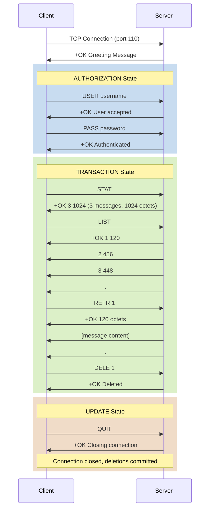

#email #computer-network #application-layer #protocol #client-server #pop3 #tcp #authentication
## Overview
- Post Office Protocol version 3 (POP3) is an application-layer protocol used by email clients to retrieve email messages from a mail server. 
- POP3 is one of the oldest and simplest email retrieval protocols, designed for ==offline email access==.

**Key Characteristics:**
- **Download-and-delete model**: Emails are downloaded to the client and typically deleted from the server
- **Simple command-response protocol**: Text-based protocol with straightforward commands
- **Stateful protocol**: Maintains session state across transaction phases
- **TCP-based**: Operates over ==TCP port 110== (unencrypted) or ==TCP port 995== (SSL/TLS encrypted)
- **Client-server architecture**: Email client initiates connection to mail server

**Protocol Version:**
- POP3 (current version, defined in RFC 1939 - 1996)
- Previous versions: POP2 (obsolete), POP1 (obsolete)

**Purpose and Use Cases:**
- Retrieve emails from remote mail server to local client
- Offline email reading (no continuous server connection required)
- Simple email access for single-device users
- Minimal server storage requirements (emails removed after download)
- Suitable for dial-up or intermittent connections

**Historical Context:**

POP3 was designed in the 1980s when network connectivity was expensive and unreliable. The download-and-delete model conserved server storage and allowed users to read emails offline. Modern alternatives like IMAP provide more features but require continuous connectivity.

## POP3 Architecture

### Protocol Flow



### POP3 States

POP3 sessions progress through three distinct states:

**1. AUTHORIZATION State**
- Initial state after connection establishment
- Server sends greeting message
- Client authenticates using USER and PASS commands
- Successful authentication transitions to TRANSACTION state
- Failed authentication terminates connection

**2. TRANSACTION State**
- Main operational state for email retrieval
- Client can query mailbox status and retrieve messages
- Messages can be marked for deletion (DELE command)
- No permanent changes made until UPDATE state
- Available commands: STAT, LIST, RETR, DELE, NOOP, RSET, TOP, UIDL

**3. UPDATE State**
- Entered when client issues QUIT command
- Server commits all pending deletions
- Server releases exclusive mailbox lock
- Connection terminated
- If connection drops before QUIT, no deletions occur (rolled back)

## POP3 Commands

### Authorization Commands

**USER**

Specifies the ==username== for authentication.

```Text title='USER command'
C: USER alice
S: +OK User accepted

C: USER nonexistent
S: -ERR User not found
```

**PASS**

Provides the ==password== for authentication.

```Text title='PASS command'
C: USER alice
S: +OK
C: PASS secret123
S: +OK Maildrop has 2 messages (320 octets)

C: PASS wrongpassword
S: -ERR Authentication failed
```

**APOP (optional)**

Provides ==secure authentication== using MD5 hash to avoid sending plaintext passwords.

```Text title='APOP command'
S: +OK POP3 server ready <1896.697170952@mail.example.com>
C: APOP alice c4c9334bac560ecc979e58001b3e22fb
S: +OK Maildrop has 2 messages
```

MD5 hash calculation: `MD5(timestamp + password)`

### Transaction Commands

**STAT**

Returns ==mailbox statistics==: number of messages and total size.

```Text title='STAT command'
C: STAT
S: +OK 3 1024

Format: +OK <message_count> <total_size_in_octets>
```

**LIST [msg]**

Lists ==message numbers and sizes==. Optional message number parameter.

```Text title='LIST command - all messages'
C: LIST
S: +OK 3 messages (1024 octets)
S: 1 120
S: 2 456
S: 3 448
S: .

Format: <message_number> <size_in_octets>
```

```Text title='LIST command - specific message'
C: LIST 2
S: +OK 2 456
```

**RETR msg**

==Retrieves== the full content of a specific message.

```Text title='RETR command'
C: RETR 1
S: +OK 120 octets
S: From: sender@example.com
S: To: alice@example.com
S: Subject: Test Message
S:
S: This is the message body.
S: .

Message content terminated by line containing only "."
```

**DELE msg**

==Marks message for deletion==. Deletion committed in UPDATE state.

```Text title='DELE command'
C: DELE 1
S: +OK Message 1 deleted

C: DELE 1
S: -ERR Message 1 already deleted

C: DELE 999
S: -ERR No such message
```

**NOOP**

==No operation==. Keeps connection alive, server responds with success.

```Text title='NOOP command'
C: NOOP
S: +OK
```

**RSET**

==Resets== session state. Unmarks all messages marked for deletion.

```Text title='RSET command'
C: DELE 1
S: +OK
C: DELE 2
S: +OK
C: RSET
S: +OK Maildrop has 2 messages (576 octets)

All deletion marks removed
```

**TOP msg n**

Retrieves message ==headers plus first n lines== of body. Useful for previewing messages.

```Text title='TOP command'
C: TOP 1 5
S: +OK
S: From: sender@example.com
S: To: alice@example.com
S: Subject: Test Message
S: Date: Mon, 14 Jan 2026 10:00:00 +0000
S:
S: Line 1 of message body
S: Line 2 of message body
S: Line 3 of message body
S: Line 4 of message body
S: Line 5 of message body
S: .
```

**UIDL [msg]**

Returns ==unique identifier== for messages. Identifier persists across sessions.

```Text title='UIDL command'
C: UIDL
S: +OK
S: 1 whqtswO00WBw418f9t5JxYwZ
S: 2 QhdPYR:00WBw1Ph7x7
S: 3 QhdPYR:00WBw1Ph7x8
S: .

C: UIDL 2
S: +OK 2 QhdPYR:00WBw1Ph7x7
```

**UIDL Usage:**
- Track which messages have been downloaded
- Avoid re-downloading same messages
- Implement "leave messages on server" feature

**QUIT**

Terminates session and enters ==UPDATE state==. Commits deletions.

```Text title='QUIT command'
C: QUIT
S: +OK POP3 server signing off (2 messages deleted)

Connection closed, deletions committed
```

### POP3 Response Format

All POP3 responses start with either `+OK` (success) or `-ERR` (error):

**Success Response:**
```Text
+OK [optional message]
```

**Error Response:**
```Text
-ERR [error description]
```

**Multi-line Response:**
```Text
+OK
data line 1
data line 2
.
```

Multi-line responses terminated by single period (`.`) on a line by itself.

## POP3 Command Summary

| Command | Parameters | State | Description |
|---------|-----------|-------|-------------|
| **USER** | username | AUTHORIZATION | Specify username |
| **PASS** | password | AUTHORIZATION | Provide password |
| **APOP** | name digest | AUTHORIZATION | Secure authentication |
| **STAT** | - | TRANSACTION | Get mailbox statistics |
| **LIST** | [msg] | TRANSACTION | List message sizes |
| **RETR** | msg | TRANSACTION | Retrieve message |
| **DELE** | msg | TRANSACTION | Mark message for deletion |
| **NOOP** | - | TRANSACTION | No operation |
| **RSET** | - | TRANSACTION | Reset deletion marks |
| **TOP** | msg n | TRANSACTION | Get headers + n body lines |
| **UIDL** | [msg] | TRANSACTION | Get unique message ID |
| **QUIT** | - | TRANSACTION/UPDATE | End session, commit changes |

## Practical POP3 Examples

### Manual POP3 Session with Telnet

```Shell title='Connect to POP3 server with telnet'
$ telnet mail.example.com 110

Trying 192.0.2.1...
Connected to mail.example.com.
Escape character is '^]'.
+OK POP3 server ready

USER alice
+OK User accepted

PASS secret123
+OK Maildrop has 2 messages (576 octets)

STAT
+OK 2 576

LIST
+OK 2 messages (576 octets)
1 120
2 456
.

TOP 1 0
+OK
From: bob@example.com
To: alice@example.com
Subject: Hello
Date: Mon, 14 Jan 2026 10:00:00 +0000

.

RETR 1
+OK 120 octets
From: bob@example.com
To: alice@example.com
Subject: Hello
Date: Mon, 14 Jan 2026 10:00:00 +0000

Hi Alice, this is a test message.
.

DELE 1
+OK Message 1 deleted

QUIT
+OK POP3 server signing off (1 message deleted)
Connection closed by foreign host.
```

### Python POP3 Client

```Python title='POP3 client with Python poplib'
import poplib
from email import parser
from email.policy import default

def retrieve_emails_pop3():
    """Retrieve emails using POP3 protocol"""

    # Connect to POP3 server
    server = 'mail.example.com'
    username = 'alice@example.com'
    password = 'secret123'

    # Establish connection (POP3 or POP3_SSL)
    try:
        # Secure connection (port 995)
        pop_conn = poplib.POP3_SSL(server, 995)

        # Or unsecure connection (port 110)
        # pop_conn = poplib.POP3(server, 110)

        print(f"Connected to {server}")
        print(pop_conn.getwelcome().decode('utf-8'))

        # Authentication
        pop_conn.user(username)
        pop_conn.pass_(password)

        # Get mailbox statistics
        num_messages, mailbox_size = pop_conn.stat()
        print(f"\nMailbox: {num_messages} messages, {mailbox_size} octets")

        # List all messages
        print("\nMessage list:")
        response, msg_list, octets = pop_conn.list()
        for msg_info in msg_list:
            print(f"  {msg_info.decode('utf-8')}")

        # Get unique IDs
        print("\nUnique IDs:")
        response, uidl_list, octets = pop_conn.uidl()
        for uidl_info in uidl_list:
            print(f"  {uidl_info.decode('utf-8')}")

        # Retrieve and parse each message
        for i in range(1, num_messages + 1):
            print(f"\n--- Message {i} ---")

            # Get message headers (TOP command)
            response, headers, octets = pop_conn.top(i, 0)
            print("Headers preview:")
            for line in headers[:5]:
                print(f"  {line.decode('utf-8')}")

            # Retrieve full message
            response, lines, octets = pop_conn.retr(i)

            # Join lines and parse
            msg_content = b'\n'.join(lines)
            msg = parser.BytesParser(policy=default).parsebytes(msg_content)

            print(f"From: {msg['From']}")
            print(f"To: {msg['To']}")
            print(f"Subject: {msg['Subject']}")
            print(f"Date: {msg['Date']}")

            # Get message body
            if msg.is_multipart():
                for part in msg.walk():
                    if part.get_content_type() == 'text/plain':
                        body = part.get_payload(decode=True).decode('utf-8')
                        print(f"Body: {body[:100]}...")
                        break
            else:
                body = msg.get_payload(decode=True).decode('utf-8')
                print(f"Body: {body[:100]}...")

            # Optional: Mark message for deletion
            # pop_conn.dele(i)
            # print(f"Message {i} marked for deletion")

        # Reset deletion marks (undo DELE commands)
        # pop_conn.rset()

        # Close connection (commits deletions)
        pop_conn.quit()
        print("\nConnection closed")

    except poplib.error_proto as e:
        print(f"POP3 protocol error: {e}")
    except Exception as e:
        print(f"Error: {e}")

retrieve_emails_pop3()
```

**Download and Save Attachments:**

```Python title='Extract attachments from POP3 emails'
import poplib
from email import parser
from email.policy import default
import os

def download_attachments():
    """Download emails and save attachments"""

    pop_conn = poplib.POP3_SSL('mail.example.com', 995)
    pop_conn.user('alice@example.com')
    pop_conn.pass_('secret123')

    num_messages, _ = pop_conn.stat()

    for i in range(1, num_messages + 1):
        # Retrieve message
        response, lines, octets = pop_conn.retr(i)
        msg_content = b'\n'.join(lines)
        msg = parser.BytesParser(policy=default).parsebytes(msg_content)

        print(f"Processing: {msg['Subject']}")

        # Walk through message parts
        for part in msg.walk():
            # Check if part is attachment
            if part.get_content_disposition() == 'attachment':
                filename = part.get_filename()
                if filename:
                    # Save attachment
                    filepath = os.path.join('attachments', filename)
                    os.makedirs('attachments', exist_ok=True)

                    with open(filepath, 'wb') as f:
                        f.write(part.get_payload(decode=True))

                    print(f"  Saved: {filename}")

    pop_conn.quit()

download_attachments()
```

**Leave Messages on Server:**

```Python title='POP3 with UIDL tracking'
import poplib
import pickle
import os

def sync_emails_with_uidl():
    """Download new emails only using UIDL tracking"""

    uidl_file = 'downloaded_uidls.pkl'

    # Load previously downloaded UIDLs
    if os.path.exists(uidl_file):
        with open(uidl_file, 'rb') as f:
            downloaded_uidls = pickle.load(f)
    else:
        downloaded_uidls = set()

    pop_conn = poplib.POP3_SSL('mail.example.com', 995)
    pop_conn.user('alice@example.com')
    pop_conn.pass_('secret123')

    # Get UIDL list
    response, uidl_list, octets = pop_conn.uidl()

    new_messages = []
    for uidl_info in uidl_list:
        # Parse: "message_num uidl"
        msg_num, uidl = uidl_info.decode('utf-8').split()
        msg_num = int(msg_num)

        if uidl not in downloaded_uidls:
            new_messages.append((msg_num, uidl))

    print(f"Found {len(new_messages)} new messages")

    # Download new messages
    for msg_num, uidl in new_messages:
        print(f"Downloading message {msg_num}...")

        response, lines, octets = pop_conn.retr(msg_num)
        msg_content = b'\n'.join(lines)

        # Process message (save, parse, etc.)
        # ...

        # Mark as downloaded
        downloaded_uidls.add(uidl)

        # Do NOT delete message (leave on server)

    # Save updated UIDL list
    with open(uidl_file, 'wb') as f:
        pickle.dump(downloaded_uidls, f)

    pop_conn.quit()
    print("Sync complete")

sync_emails_with_uidl()
```

### Node.js POP3 Client

```JavaScript title='POP3 client with Node.js'
const { POP3Client } = require('node-pop3');

async function retrieveEmailsPOP3() {
    const client = new POP3Client({
        host: 'mail.example.com',
        port: 995,  // SSL port
        tls: true,  // Use TLS/SSL
        username: 'alice@example.com',
        password: 'secret123'
    });

    try {
        // Connect and authenticate
        await client.connect();
        console.log('Connected and authenticated');

        // Get message count
        const count = await client.count();
        console.log(`Mailbox has ${count} messages`);

        // List all messages
        const list = await client.list();
        console.log('Messages:', list);

        // Retrieve each message
        for (let i = 1; i <= count; i++) {
            console.log(`\n--- Message ${i} ---`);

            // Get message
            const message = await client.retrieve(i);
            console.log(`Size: ${message.length} bytes`);

            // Parse message (using mailparser)
            const { simpleParser } = require('mailparser');
            const parsed = await simpleParser(message);

            console.log(`From: ${parsed.from.text}`);
            console.log(`To: ${parsed.to.text}`);
            console.log(`Subject: ${parsed.subject}`);
            console.log(`Date: ${parsed.date}`);

            if (parsed.text) {
                console.log(`Body: ${parsed.text.substring(0, 100)}...`);
            }

            // Optional: Delete message
            // await client.delete(i);
        }

        // Quit and close connection
        await client.quit();
        console.log('\nConnection closed');

    } catch (error) {
        console.error('Error:', error);
    }
}

retrieveEmailsPOP3();
```

**Alternative: Using poplib Library:**

```JavaScript title='POP3 with poplib in Node.js'
const POP3Client = require('poplib');

const client = new POP3Client(995, 'mail.example.com', {
    enabletls: true
});

client.on('error', (err) => {
    console.error('Error:', err);
});

client.on('connect', () => {
    console.log('Connected');
    client.login('alice@example.com', 'secret123');
});

client.on('login', (status, rawdata) => {
    if (status) {
        console.log('Authenticated');
        client.list();
    } else {
        console.error('Authentication failed');
        client.quit();
    }
});

client.on('list', (status, msgcount, msgnumber, data, rawdata) => {
    if (status) {
        console.log(`${msgcount} messages`);

        if (msgcount > 0) {
            // Retrieve first message
            client.retr(1);
        } else {
            client.quit();
        }
    }
});

client.on('retr', (status, msgnumber, data, rawdata) => {
    if (status) {
        console.log(`Message ${msgnumber}:`);
        console.log(data);
        client.quit();
    }
});

client.on('quit', (status, rawdata) => {
    console.log('Connection closed');
});

// Start connection
client.connect();
```

### Java POP3 Client

```Java title='POP3 client with JavaMail'
import javax.mail.*;
import java.util.Properties;

public class POP3Client {

    public static void retrieveEmails() {
        String host = "mail.example.com";
        String username = "alice@example.com";
        String password = "secret123";

        try {
            // Configure POP3 properties
            Properties props = new Properties();
            props.setProperty("mail.store.protocol", "pop3s");
            props.setProperty("mail.pop3s.host", host);
            props.setProperty("mail.pop3s.port", "995");
            props.setProperty("mail.pop3s.ssl.enable", "true");

            // Or for non-SSL:
            // props.setProperty("mail.store.protocol", "pop3");
            // props.setProperty("mail.pop3.host", host);
            // props.setProperty("mail.pop3.port", "110");

            // Create session and connect
            Session session = Session.getInstance(props);
            Store store = session.getStore("pop3s");
            store.connect(host, username, password);

            System.out.println("Connected to mail server");

            // Open INBOX folder
            Folder inbox = store.getFolder("INBOX");
            inbox.open(Folder.READ_ONLY);

            // Get message count
            int messageCount = inbox.getMessageCount();
            System.out.println("Total messages: " + messageCount);

            // Retrieve all messages
            Message[] messages = inbox.getMessages();

            for (int i = 0; i < messages.length; i++) {
                Message msg = messages[i];

                System.out.println("\n--- Message " + (i + 1) + " ---");
                System.out.println("From: " + msg.getFrom()[0]);
                System.out.println("To: " + msg.getRecipients(Message.RecipientType.TO)[0]);
                System.out.println("Subject: " + msg.getSubject());
                System.out.println("Date: " + msg.getSentDate());
                System.out.println("Size: " + msg.getSize() + " bytes");

                // Get content
                Object content = msg.getContent();
                if (content instanceof String) {
                    String body = (String) content;
                    System.out.println("Body: " + body.substring(0, Math.min(100, body.length())) + "...");
                } else if (content instanceof Multipart) {
                    Multipart multipart = (Multipart) content;
                    System.out.println("Parts: " + multipart.getCount());

                    // Get text part
                    for (int j = 0; j < multipart.getCount(); j++) {
                        BodyPart bodyPart = multipart.getBodyPart(j);
                        if (bodyPart.isMimeType("text/plain")) {
                            String text = (String) bodyPart.getContent();
                            System.out.println("Body: " + text.substring(0, Math.min(100, text.length())) + "...");
                            break;
                        }
                    }
                }

                // Optional: Mark for deletion
                // msg.setFlag(Flags.Flag.DELETED, true);
            }

            // Close folder (commits deletions if DELETED flag set)
            inbox.close(false);  // false = don't expunge (delete) messages
            // inbox.close(true);   // true = expunge messages

            // Close store
            store.close();
            System.out.println("\nConnection closed");

        } catch (Exception e) {
            e.printStackTrace();
        }
    }

    public static void main(String[] args) {
        retrieveEmails();
    }
}
```

**Download with UIDL Tracking:**

```Java title='POP3 with UIDL in Java'
import com.sun.mail.pop3.POP3Folder;
import javax.mail.*;
import java.util.*;
import java.io.*;

public class POP3UIDLClient {

    private static final String UIDL_FILE = "downloaded_uidls.txt";

    public static void syncEmails() {
        try {
            // Load downloaded UIDLs
            Set<String> downloadedUidls = loadDownloadedUidls();

            // Connect to POP3 server
            Properties props = new Properties();
            props.setProperty("mail.store.protocol", "pop3s");
            props.setProperty("mail.pop3s.host", "mail.example.com");
            props.setProperty("mail.pop3s.port", "995");

            Session session = Session.getInstance(props);
            Store store = session.getStore("pop3s");
            store.connect("mail.example.com", "alice@example.com", "secret123");

            // Open folder
            POP3Folder inbox = (POP3Folder) store.getFolder("INBOX");
            inbox.open(Folder.READ_ONLY);

            // Get messages
            Message[] messages = inbox.getMessages();
            System.out.println("Total messages: " + messages.length);

            // Check UIDLs
            for (int i = 0; i < messages.length; i++) {
                String uidl = inbox.getUID(messages[i]);

                if (!downloadedUidls.contains(uidl)) {
                    System.out.println("Downloading new message: " + uidl);

                    Message msg = messages[i];
                    System.out.println("Subject: " + msg.getSubject());

                    // Process message
                    // ...

                    // Mark as downloaded
                    downloadedUidls.add(uidl);

                    // Do NOT delete (leave on server)
                }
            }

            // Save updated UIDLs
            saveDownloadedUidls(downloadedUidls);

            inbox.close(false);
            store.close();
            System.out.println("Sync complete");

        } catch (Exception e) {
            e.printStackTrace();
        }
    }

    private static Set<String> loadDownloadedUidls() {
        Set<String> uidls = new HashSet<>();
        File file = new File(UIDL_FILE);

        if (file.exists()) {
            try (BufferedReader reader = new BufferedReader(new FileReader(file))) {
                String line;
                while ((line = reader.readLine()) != null) {
                    uidls.add(line.trim());
                }
            } catch (IOException e) {
                e.printStackTrace();
            }
        }

        return uidls;
    }

    private static void saveDownloadedUidls(Set<String> uidls) {
        try (BufferedWriter writer = new BufferedWriter(new FileWriter(UIDL_FILE))) {
            for (String uidl : uidls) {
                writer.write(uidl);
                writer.newLine();
            }
        } catch (IOException e) {
            e.printStackTrace();
        }
    }

    public static void main(String[] args) {
        syncEmails();
    }
}
```

## POP3 Security

### POP3S (POP3 over SSL/TLS)

Standard POP3 transmits credentials and email content in ==plaintext==, making it vulnerable to eavesdropping. ==POP3S== encrypts the entire session using SSL/TLS.

**POP3S Characteristics:**
- Uses ==TCP port 995== (instead of 110)
- Entire session encrypted with TLS/SSL
- Protects credentials and email content
- Certificate validation for server authentication
- Mandatory for modern email systems

**Connection Methods:**

**1. Implicit SSL/TLS (POP3S)**
- Direct SSL/TLS connection on port 995
- No plaintext communication
- Preferred method

```Python title='POP3S connection in Python'
import poplib

# Secure connection (port 995)
pop_conn = poplib.POP3_SSL('mail.example.com', 995)

# Verify certificate
import ssl
context = ssl.create_default_context()
pop_conn = poplib.POP3_SSL('mail.example.com', 995, context=context)
```

**2. STARTTLS (Explicit TLS)**
- Initial connection on port 110 (plaintext)
- Upgrade to TLS using STLS command
- Fallback to plaintext if TLS fails

```Python title='STARTTLS in Python'
import poplib
import ssl

pop_conn = poplib.POP3('mail.example.com', 110)

# Upgrade to TLS
context = ssl.create_default_context()
pop_conn.stls(context=context)

# Now continue with authentication
pop_conn.user('alice@example.com')
pop_conn.pass_('secret123')
```

### Authentication Security

**Problems with USER/PASS:**
- Passwords sent in plaintext (if not using SSL/TLS)
- Vulnerable to packet sniffing
- Replay attacks possible

**APOP Authentication:**

==APOP== avoids sending plaintext passwords by using MD5 hash.

```Text title='APOP authentication flow'
S: +OK POP3 server ready <1896.697170952@mail.example.com>
C: APOP alice c4c9334bac560ecc979e58001b3e22fb
S: +OK Maildrop locked and ready
```

**APOP Calculation:**
```Python
import hashlib

timestamp = "<1896.697170952@mail.example.com>"
password = "secret123"
digest = hashlib.md5((timestamp + password).encode()).hexdigest()
# Result: c4c9334bac560ecc979e58001b3e22fb
```

**Limitations:**
- MD5 is cryptographically weak (not collision-resistant)
- Not widely supported
- POP3S with USER/PASS is more common

### Security Best Practices

- **Always use POP3S** (port 995) or STARTTLS
- **Disable plaintext POP3** (port 110) on servers
- **Use strong passwords** or OAuth2 authentication
- **Enable two-factor authentication** where available
- **Validate SSL certificates** in client implementations
- **Limit login attempts** to prevent brute-force attacks
- **Monitor for unusual access patterns**

## POP3 vs IMAP

POP3 and IMAP are both email retrieval protocols but serve different use cases.

| Feature | POP3 | IMAP |
|---------|------|------|
| **Model** | Download-and-delete | Synchronized mailbox |
| **Default port** | 110 (995 SSL) | 143 (993 SSL) |
| **Server storage** | Minimal (emails deleted) | Emails remain on server |
| **Folder support** | Single INBOX only | Multiple folders supported |
| **Message flags** | No flags | Read, flagged, deleted, etc. |
| **Partial retrieval** | TOP command only | FETCH body parts |
| **Search capability** | Client-side only | Server-side SEARCH |
| **Multi-device** | Poor (first device downloads) | Excellent (synchronized) |
| **Offline access** | Excellent | Requires sync |
| **Server load** | Low | Higher |
| **Bandwidth** | High (full downloads) | Lower (selective fetch) |
| **Complexity** | Simple | Complex |
| **Best for** | Single device, offline access | Multiple devices, online access |

**When to Use POP3:**
- Single device email access
- Limited server storage
- Offline email reading required
- Simple email setup
- Unreliable internet connectivity

**When to Use IMAP:**
- Multiple devices (phone, laptop, tablet)
- Need folder organization
- Server-side search capabilities
- Synchronized email across devices
- Reliable internet connection

## POP3 Server Implementation

### Simple POP3 Server in Python

```Python title='Basic POP3 server implementation'
import socket
import threading
import hashlib

class SimplePOP3Server:
    def __init__(self, host='0.0.0.0', port=1110):
        self.host = host
        self.port = port
        self.users = {
            'alice': {
                'password': 'secret123',
                'emails': [
                    {
                        'from': 'bob@example.com',
                        'to': 'alice@example.com',
                        'subject': 'Test Message 1',
                        'body': 'This is the first test message.',
                        'uidl': 'msg001'
                    },
                    {
                        'from': 'charlie@example.com',
                        'to': 'alice@example.com',
                        'subject': 'Test Message 2',
                        'body': 'This is the second test message.',
                        'uidl': 'msg002'
                    }
                ]
            }
        }

    def start(self):
        """Start POP3 server"""
        server_socket = socket.socket(socket.AF_INET, socket.SOCK_STREAM)
        server_socket.setsockopt(socket.SOL_SOCKET, socket.SO_REUSEADDR, 1)
        server_socket.bind((self.host, self.port))
        server_socket.listen(5)

        print(f"POP3 server listening on {self.host}:{self.port}")

        while True:
            client_socket, address = server_socket.accept()
            print(f"Connection from {address}")
            client_thread = threading.Thread(
                target=self.handle_client,
                args=(client_socket,)
            )
            client_thread.start()

    def handle_client(self, client_socket):
        """Handle POP3 client connection"""
        try:
            # Send greeting
            self.send_response(client_socket, "+OK POP3 server ready")

            authenticated = False
            username = None
            deleted_messages = set()

            while True:
                # Receive command
                data = client_socket.recv(1024).decode('utf-8').strip()
                if not data:
                    break

                print(f"Received: {data}")
                parts = data.split(' ', 1)
                command = parts[0].upper()
                args = parts[1] if len(parts) > 1 else ''

                # Authorization state
                if not authenticated:
                    if command == 'USER':
                        username = args
                        if username in self.users:
                            self.send_response(client_socket, "+OK User accepted")
                        else:
                            self.send_response(client_socket, "-ERR User not found")
                            username = None

                    elif command == 'PASS':
                        if username and args == self.users[username]['password']:
                            authenticated = True
                            num_msgs = len(self.users[username]['emails'])
                            total_size = sum(len(e['body']) for e in self.users[username]['emails'])
                            self.send_response(
                                client_socket,
                                f"+OK Maildrop has {num_msgs} messages ({total_size} octets)"
                            )
                        else:
                            self.send_response(client_socket, "-ERR Authentication failed")

                    elif command == 'QUIT':
                        self.send_response(client_socket, "+OK Goodbye")
                        break

                    else:
                        self.send_response(client_socket, "-ERR Not authenticated")

                # Transaction state
                else:
                    emails = self.users[username]['emails']

                    if command == 'STAT':
                        active_msgs = [i for i in range(len(emails)) if i not in deleted_messages]
                        total_size = sum(len(emails[i]['body']) for i in active_msgs)
                        self.send_response(
                            client_socket,
                            f"+OK {len(active_msgs)} {total_size}"
                        )

                    elif command == 'LIST':
                        if args:
                            msg_num = int(args) - 1
                            if msg_num in deleted_messages:
                                self.send_response(client_socket, "-ERR Message deleted")
                            elif 0 <= msg_num < len(emails):
                                size = len(emails[msg_num]['body'])
                                self.send_response(client_socket, f"+OK {msg_num + 1} {size}")
                            else:
                                self.send_response(client_socket, "-ERR No such message")
                        else:
                            active_msgs = [i for i in range(len(emails)) if i not in deleted_messages]
                            total_size = sum(len(emails[i]['body']) for i in active_msgs)
                            response = f"+OK {len(active_msgs)} messages ({total_size} octets)\r\n"
                            for i in active_msgs:
                                size = len(emails[i]['body'])
                                response += f"{i + 1} {size}\r\n"
                            response += "."
                            self.send_response(client_socket, response)

                    elif command == 'RETR':
                        msg_num = int(args) - 1
                        if msg_num in deleted_messages:
                            self.send_response(client_socket, "-ERR Message deleted")
                        elif 0 <= msg_num < len(emails):
                            email = emails[msg_num]
                            message = (
                                f"From: {email['from']}\r\n"
                                f"To: {email['to']}\r\n"
                                f"Subject: {email['subject']}\r\n"
                                f"\r\n"
                                f"{email['body']}"
                            )
                            size = len(message)
                            response = f"+OK {size} octets\r\n{message}\r\n."
                            self.send_response(client_socket, response)
                        else:
                            self.send_response(client_socket, "-ERR No such message")

                    elif command == 'DELE':
                        msg_num = int(args) - 1
                        if msg_num in deleted_messages:
                            self.send_response(client_socket, "-ERR Message already deleted")
                        elif 0 <= msg_num < len(emails):
                            deleted_messages.add(msg_num)
                            self.send_response(client_socket, f"+OK Message {msg_num + 1} deleted")
                        else:
                            self.send_response(client_socket, "-ERR No such message")

                    elif command == 'RSET':
                        deleted_messages.clear()
                        num_msgs = len(emails)
                        total_size = sum(len(e['body']) for e in emails)
                        self.send_response(
                            client_socket,
                            f"+OK Maildrop has {num_msgs} messages ({total_size} octets)"
                        )

                    elif command == 'NOOP':
                        self.send_response(client_socket, "+OK")

                    elif command == 'UIDL':
                        if args:
                            msg_num = int(args) - 1
                            if msg_num in deleted_messages:
                                self.send_response(client_socket, "-ERR Message deleted")
                            elif 0 <= msg_num < len(emails):
                                uidl = emails[msg_num]['uidl']
                                self.send_response(client_socket, f"+OK {msg_num + 1} {uidl}")
                            else:
                                self.send_response(client_socket, "-ERR No such message")
                        else:
                            response = "+OK\r\n"
                            for i, email in enumerate(emails):
                                if i not in deleted_messages:
                                    response += f"{i + 1} {email['uidl']}\r\n"
                            response += "."
                            self.send_response(client_socket, response)

                    elif command == 'QUIT':
                        # Commit deletions
                        for i in sorted(deleted_messages, reverse=True):
                            del emails[i]
                        self.send_response(
                            client_socket,
                            f"+OK POP3 server signing off ({len(deleted_messages)} messages deleted)"
                        )
                        break

                    else:
                        self.send_response(client_socket, "-ERR Unknown command")

        except Exception as e:
            print(f"Error: {e}")
        finally:
            client_socket.close()
            print("Connection closed")

    def send_response(self, client_socket, response):
        """Send response to client"""
        client_socket.send(f"{response}\r\n".encode('utf-8'))

if __name__ == '__main__':
    server = SimplePOP3Server()
    server.start()
```

## Troubleshooting POP3

### Common Issues

**1. Authentication Failures**

```Text
-ERR Authentication failed
-ERR [AUTH] Username and password not accepted
```

**Solutions:**
- Verify username and password
- Check if account is enabled
- Ensure POP3 access is enabled (some providers disable by default)
- Check for two-factor authentication requirements
- Use app-specific passwords if required

**2. Connection Timeouts**

```Text
Connection timeout
Unable to connect to mail.example.com:110
```

**Solutions:**
- Verify server address and port
- Check firewall rules
- Ensure POP3 service is running
- Test with telnet: `telnet mail.example.com 110`

**3. SSL/TLS Certificate Errors**

```Text
SSL certificate verification failed
Certificate hostname mismatch
```

**Solutions:**
- Update root certificates
- Verify server hostname matches certificate
- Check certificate expiration date
- Disable certificate verification (testing only)

**4. Messages Not Downloading**

```Text
Mailbox appears empty
```

**Solutions:**
- Check if messages already downloaded and deleted
- Verify correct username/mailbox
- Check server-side filters or rules
- Ensure sufficient permissions

### Debug POP3 Connection

```Python title='POP3 debugging script'
import poplib
import sys

def debug_pop3_connection(server, username, password, use_ssl=True):
    """Debug POP3 connection with detailed output"""

    try:
        print(f"Connecting to {server}...")

        if use_ssl:
            print(f"Using SSL on port 995")
            pop_conn = poplib.POP3_SSL(server, 995)
        else:
            print(f"Using plain connection on port 110")
            pop_conn = poplib.POP3(server, 110)

        print(f"Connected!")
        print(f"Server greeting: {pop_conn.getwelcome().decode('utf-8')}")

        # Enable debug output
        pop_conn.set_debuglevel(2)

        print(f"\nAuthenticating as {username}...")
        pop_conn.user(username)
        pop_conn.pass_(password)
        print("Authenticated successfully!")

        # Get mailbox stats
        num_msgs, mailbox_size = pop_conn.stat()
        print(f"\nMailbox statistics:")
        print(f"  Messages: {num_msgs}")
        print(f"  Total size: {mailbox_size} octets")

        # List messages
        response, msg_list, octets = pop_conn.list()
        print(f"\nMessage list:")
        for msg_info in msg_list:
            print(f"  {msg_info.decode('utf-8')}")

        # Check UIDL support
        try:
            response, uidl_list, octets = pop_conn.uidl()
            print(f"\nUIDL support: Yes")
            print(f"Sample UIDLs:")
            for uidl_info in uidl_list[:3]:
                print(f"  {uidl_info.decode('utf-8')}")
        except:
            print(f"\nUIDL support: No")

        # Check TOP support
        if num_msgs > 0:
            try:
                response, headers, octets = pop_conn.top(1, 0)
                print(f"\nTOP support: Yes")
            except:
                print(f"\nTOP support: No")

        pop_conn.quit()
        print("\nConnection closed successfully")
        return True

    except poplib.error_proto as e:
        print(f"\nPOP3 Protocol Error: {e}")
        return False
    except Exception as e:
        print(f"\nConnection Error: {e}")
        return False

# Usage
if __name__ == '__main__':
    debug_pop3_connection(
        server='mail.example.com',
        username='alice@example.com',
        password='secret123',
        use_ssl=True
    )
```

***
# References
1. RFC 1939 - Post Office Protocol - Version 3 (1996)
	1. https://www.rfc-editor.org/rfc/rfc1939 for POP3 specification
2. RFC 1734 - POP3 AUTHentication command
	1. https://www.rfc-editor.org/rfc/rfc1734 for AUTH command
3. RFC 2449 - POP3 Extension Mechanism
	1. https://www.rfc-editor.org/rfc/rfc2449 for CAPA and extensions
4. RFC 2595 - Using TLS with IMAP, POP3 and ACAP
	1. https://www.rfc-editor.org/rfc/rfc2595 for STARTTLS specification
5. RFC 1957 - Some Observations on Implementations of the Post Office Protocol (POP3)
	1. https://www.rfc-editor.org/rfc/rfc1957 for implementation notes
6. Computer Networking: A Top-Down Approach, Global Edition, 8th Edition - James F. Kurose, Keith W. Ross - Pearson (2021)
	1. Chapter 2: Application Layer
		1. Section 2.3: Electronic Mail in the Internet
7. https://docs.python.org/3/library/poplib.html for Python poplib documentation
8. https://www.npmjs.com/package/node-pop3 for Node.js POP3 client
9. https://javaee.github.io/javamail/ for JavaMail API documentation
10. https://www.iana.org/assignments/pop3-extension-mechanism/ for POP3 extensions registry