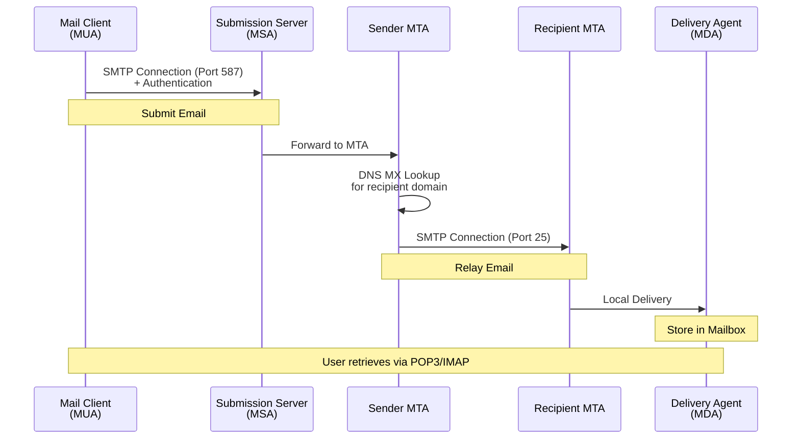
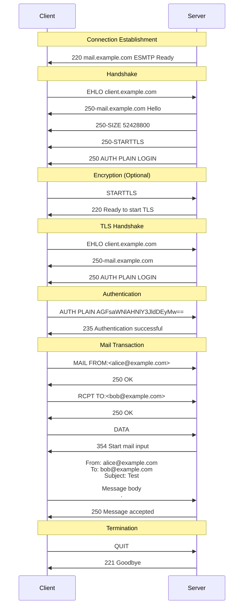
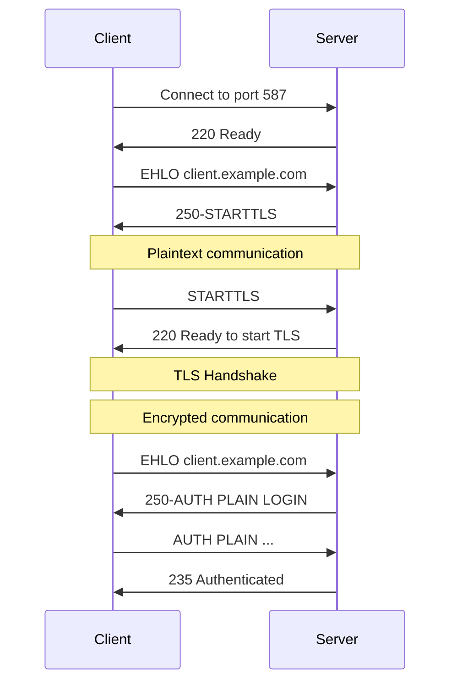
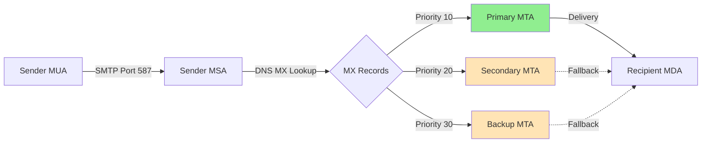

#email #application-layer #client-server #protocol #computer-network #smtp #tcp #push-protocol
## Overview
- ==Simple Mail Transfer Protocol (SMTP)== is an Internet standard communication protocol for electronic mail transmission. 
- SMTP is a ==push protocol== used to send emails from a client to a server or between mail servers, operating over ==TCP port 25== (unencrypted), ==port 587== (submission with STARTTLS), or ==port 465== (implicit SSL/TLS).

**Key Characteristics:**
- **Push protocol**: Sender initiates connection and pushes messages without explicit requests from receiver
- **Text-based protocol**: Human-readable commands and responses
- **Connection-oriented**: Uses TCP for reliable delivery
- **Store-and-forward model**: Mail servers relay messages through intermediate servers
- **Stateful protocol**: Maintains session state during mail transaction
- **One-to-many delivery**: Single message can be sent to multiple recipients

**Protocol Evolution:**
- **SMTP** (RFC 821, 1982): Original specification
- **Extended SMTP (ESMTP)** (RFC 1869, 1995): Added extensions mechanism
- **Current SMTP** (RFC 5321, 2008): Modern specification with security enhancements

**Purpose and Use Cases:**
- Send emails from mail clients to mail servers (Mail Submission)
- Transfer emails between mail servers (Mail Relay)
- Deliver emails to destination mail servers (Mail Delivery)
- Support mailing lists and bulk email distribution
- Enable automated email notifications from applications

**SMTP vs Retrieval Protocols:**
- **SMTP**: ==Sending/forwarding== emails (push)
- **POP3/IMAP**: ==Retrieving/reading== emails (pull)
- SMTP handles outbound mail, POP3/IMAP handle inbound mail

## SMTP Architecture

### Mail System Components


**Component Descriptions:**

**1. Mail User Agent (MUA)**
- Email client software (Outlook, Thunderbird, Gmail web interface)
- Composes and reads emails
- Submits outgoing mail to MSA via SMTP
- Retrieves incoming mail via POP3/IMAP

**2. Mail Submission Agent (MSA)**
- Accepts email from authenticated MUAs
- Performs initial message validation
- Enforces submission policies
- Typically listens on ==port 587== with authentication required

**3. Mail Transfer Agent (MTA)**
- Routes and relays email between mail servers
- Performs DNS MX lookups to find destination servers
- Implements store-and-forward mechanism
- Handles retry logic for failed deliveries
- Communicates on ==port 25==

**4. Mail Delivery Agent (MDA)**
- Delivers email to local mailboxes
- Applies filtering rules and spam detection
- Stores messages in user mailboxes
- May invoke server-side rules (vacation replies, forwarding)

### SMTP Communication Model



## SMTP Commands

SMTP uses simple text commands for communication. Commands are case-insensitive but traditionally uppercase.

### Basic SMTP Commands

**HELO / EHLO**

Initiates SMTP session. ==EHLO== (Extended HELLO) indicates ESMTP support and requests server capabilities.

```Text title='HELO command'
C: HELO client.example.com
S: 250 mail.example.com Hello client.example.com

C: EHLO client.example.com
S: 250-mail.example.com Hello client.example.com
S: 250-SIZE 52428800
S: 250-8BITMIME
S: 250-STARTTLS
S: 250-AUTH PLAIN LOGIN
S: 250 HELP
```

**MAIL FROM**

Specifies the ==sender== email address. Initiates new mail transaction.

```Text title='MAIL FROM command'
C: MAIL FROM:<alice@example.com>
S: 250 OK

C: MAIL FROM:<alice@example.com> SIZE=1024
S: 250 OK

C: MAIL FROM:<invalid@>
S: 501 Syntax error in parameters
```

**RCPT TO**

Specifies ==recipient== email address. Can be issued multiple times for multiple recipients.

```Text title='RCPT TO command'
C: RCPT TO:<bob@example.com>
S: 250 OK

C: RCPT TO:<charlie@example.com>
S: 250 OK

C: RCPT TO:<unknown@nonexistent.com>
S: 550 No such user here
```

**DATA**

Begins message content transmission. Message terminated by line containing only `.` (period).

```Text title='DATA command'
C: DATA
S: 354 Start mail input; end with <CRLF>.<CRLF>
C: From: Alice <alice@example.com>
C: To: Bob <bob@example.com>
C: Subject: Test Message
C:
C: This is the message body.
C: It can span multiple lines.
C: .
S: 250 OK Message accepted for delivery
```

**Message Content Format:**
- Headers followed by blank line, then body
- Lines starting with `.` must be escaped as `..`
- Maximum line length: 998 characters (excluding CRLF)
- Terminated by `<CRLF>.<CRLF>` (line containing only period)

**RSET**

==Resets== current mail transaction. Clears sender, recipients, and message data.

```Text title='RSET command'
C: MAIL FROM:<alice@example.com>
S: 250 OK
C: RCPT TO:<bob@example.com>
S: 250 OK
C: RSET
S: 250 OK
```

**VRFY**

==Verifies== if a mailbox exists. Often disabled for security reasons.

```Text title='VRFY command'
C: VRFY bob
S: 250 Bob Smith <bob@example.com>

C: VRFY unknown
S: 550 User unknown

C: VRFY alice
S: 252 Cannot VRFY user, but will accept message
```

**EXPN**

==Expands== mailing list to show members. Usually disabled to prevent information disclosure.

```Text title='EXPN command'
C: EXPN staff
S: 250-alice@example.com
S: 250-bob@example.com
S: 250 charlie@example.com

C: EXPN team
S: 502 EXPN command not implemented
```

**NOOP**

==No operation==. Tests connection, keeps session alive.

```Text title='NOOP command'
C: NOOP
S: 250 OK
```

**QUIT**

Terminates SMTP session.

```Text title='QUIT command'
C: QUIT
S: 221 mail.example.com Service closing transmission channel
```

### Extended SMTP (ESMTP) Commands

**AUTH**

Performs ==authentication== using SASL mechanisms.

```Text title='AUTH PLAIN'
C: AUTH PLAIN
S: 334
C: AGFsaWNlAHNlY3JldDEyMw==
S: 235 Authentication successful

Base64 decodes to: \0alice\0secret123
```

```Text title='AUTH LOGIN'
C: AUTH LOGIN
S: 334 VXNlcm5hbWU6
C: YWxpY2U=
S: 334 UGFzc3dvcmQ6
C: c2VjcmV0MTIz
S: 235 Authentication successful

VXNlcm5hbWU6 = "Username:" in Base64
YWxpY2U= = "alice" in Base64
UGFzc3dvcmQ6 = "Password:" in Base64
c2VjcmV0MTIz = "secret123" in Base64
```

**STARTTLS**

Upgrades connection to ==encrypted TLS==.

```Text title='STARTTLS command'
C: EHLO client.example.com
S: 250-mail.example.com
S: 250 STARTTLS
C: STARTTLS
S: 220 Ready to start TLS
[TLS negotiation occurs]
C: EHLO client.example.com
S: 250-mail.example.com
S: 250 AUTH PLAIN LOGIN
```

### SMTP Command Summary

| Command | Parameters | Description | RFC |
|---------|-----------|-------------|-----|
| **HELO** | domain | Identify client (basic) | RFC 5321 |
| **EHLO** | domain | Identify client (extended) | RFC 5321 |
| **MAIL FROM** | `<address>` | Specify sender | RFC 5321 |
| **RCPT TO** | `<address>` | Specify recipient | RFC 5321 |
| **DATA** | - | Begin message content | RFC 5321 |
| **RSET** | - | Reset transaction | RFC 5321 |
| **VRFY** | string | Verify mailbox | RFC 5321 |
| **EXPN** | string | Expand mailing list | RFC 5321 |
| **HELP** | [string] | Get help text | RFC 5321 |
| **NOOP** | - | No operation | RFC 5321 |
| **QUIT** | - | Close connection | RFC 5321 |
| **AUTH** | mechanism | Authenticate | RFC 4954 |
| **STARTTLS** | - | Start TLS encryption | RFC 3220 |

## SMTP Response Codes

SMTP servers respond with three-digit numeric codes followed by optional text. First digit indicates category.

### Response Code Categories

**2xx - Success**

| Code | Message | Meaning |
|------|---------|---------|
| 200 | System status | Help message |
| 211 | System status | Status information |
| 214 | Help message | Help text |
| 220 | Service ready | Server ready |
| 221 | Closing channel | Goodbye message |
| 235 | Authentication successful | AUTH success |
| 250 | OK | Command successful |
| 251 | User not local | Will forward |
| 252 | Cannot verify | Will attempt delivery |

**3xx - Intermediate**

| Code | Message | Meaning |
|------|---------|---------|
| 334 | Auth continue | AUTH challenge |
| 354 | Start input | Ready for message data |

**4xx - Transient Failure**

| Code | Message | Meaning |
|------|---------|---------|
| 421 | Service not available | Server shutting down |
| 450 | Mailbox unavailable | Mailbox busy |
| 451 | Error in processing | Aborted due to server error |
| 452 | Insufficient storage | Out of disk space |
| 454 | TLS not available | Temporary auth failure |

**5xx - Permanent Failure**

| Code | Message | Meaning |
|------|---------|---------|
| 500 | Syntax error | Command not recognized |
| 501 | Syntax error | Parameter error |
| 502 | Not implemented | Command not supported |
| 503 | Bad sequence | Commands out of order |
| 504 | Parameter not implemented | Parameter not supported |
| 521 | Domain does not accept mail | Server doesn't accept mail |
| 530 | Authentication required | Must authenticate first |
| 550 | Mailbox unavailable | User doesn't exist |
| 551 | User not local | Try different address |
| 552 | Storage exceeded | Mailbox full |
| 553 | Mailbox name invalid | Invalid address syntax |
| 554 | Transaction failed | Permanent failure |

### Enhanced Status Codes

ESMTP supports ==enhanced status codes== with format `X.Y.Z`:

**Structure:**
- **X**: Class (2=success, 4=transient, 5=permanent)
- **Y**: Subject (0=undefined, 1=addressing, 2=mailbox, 3=mail system, 4=network, 5=protocol, 7=security)
- **Z**: Detail (specific error)

```Text title='Enhanced status code example'
550 5.1.1 <user@example.com> User unknown
    |   |
    |   +-- Enhanced code: 5.1.1 (permanent, addressing, bad destination mailbox)
    +------ Basic code: 550 (permanent failure)
```

**Common Enhanced Codes:**

| Code | Description |
|------|-------------|
| 2.1.5 | Destination address valid |
| 4.2.2 | Mailbox full (temporary) |
| 5.1.1 | Bad destination mailbox address |
| 5.1.2 | Bad destination system address |
| 5.2.1 | Mailbox disabled |
| 5.2.2 | Mailbox full (permanent) |
| 5.5.0 | Protocol error |
| 5.7.1 | Delivery not authorized |

## Complete SMTP Session

### Successful Email Delivery



### Manual SMTP Session with Telnet

```Shell title='Send email via telnet'
$ telnet mail.example.com 25

Trying 192.0.2.1...
Connected to mail.example.com.
Escape character is '^]'.
220 mail.example.com ESMTP Postfix

EHLO client.example.com
250-mail.example.com
250-PIPELINING
250-SIZE 10240000
250-VRFY
250-ETRN
250-STARTTLS
250-AUTH PLAIN LOGIN
250-ENHANCEDSTATUSCODES
250-8BITMIME
250 DSN

MAIL FROM:<alice@example.com>
250 2.1.0 Ok

RCPT TO:<bob@example.com>
250 2.1.5 Ok

DATA
354 End data with <CR><LF>.<CR><LF>
From: Alice <alice@example.com>
To: Bob <bob@example.com>
Subject: Test Message
Date: Mon, 14 Jan 2026 10:00:00 +0000

This is a test message sent via telnet.
.
250 2.0.0 Ok: queued as 12345ABC

QUIT
221 2.0.0 Bye
Connection closed by foreign host.
```

## Practical SMTP Examples

### Python SMTP Client

```Python title='Send email with Python smtplib'
import smtplib
from email.mime.text import MIMEText
from email.mime.multipart import MIMEMultipart

def send_email_smtp():
    """Send email using SMTP"""

    # Server configuration
    smtp_server = 'smtp.example.com'
    smtp_port = 587  # Submission port with STARTTLS
    username = 'alice@example.com'
    password = 'secret123'

    # Create message
    msg = MIMEMultipart()
    msg['From'] = 'alice@example.com'
    msg['To'] = 'bob@example.com'
    msg['Subject'] = 'Test Email from Python'

    body = 'This is a test email sent using Python smtplib.'
    msg.attach(MIMEText(body, 'plain'))

    try:
        # Connect to server
        server = smtplib.SMTP(smtp_server, smtp_port)
        server.set_debuglevel(1)  # Show SMTP conversation

        # Identify to server
        server.ehlo()

        # Upgrade to TLS
        if server.has_extn('STARTTLS'):
            server.starttls()
            server.ehlo()  # Re-identify after STARTTLS

        # Authenticate
        server.login(username, password)

        # Send email
        server.send_message(msg)
        print('Email sent successfully!')

        # Close connection
        server.quit()

    except smtplib.SMTPException as e:
        print(f'SMTP error: {e}')
    except Exception as e:
        print(f'Error: {e}')

send_email_smtp()
```

**Send to Multiple Recipients:**

```Python title='Send email to multiple recipients'
import smtplib
from email.mime.text import MIMEText

def send_bulk_email():
    """Send email to multiple recipients"""

    smtp_server = 'smtp.example.com'
    smtp_port = 587
    username = 'alice@example.com'
    password = 'secret123'

    recipients = [
        'bob@example.com',
        'charlie@example.com',
        'dave@example.com'
    ]

    msg = MIMEText('This is a bulk email message.')
    msg['From'] = 'alice@example.com'
    msg['To'] = ', '.join(recipients)  # Display all recipients
    msg['Subject'] = 'Bulk Email'

    with smtplib.SMTP(smtp_server, smtp_port) as server:
        server.starttls()
        server.login(username, password)

        # Send to multiple recipients
        server.send_message(msg, to_addrs=recipients)

        print(f'Email sent to {len(recipients)} recipients')

send_bulk_email()
```

**Handle SMTP Errors:**

```Python title='SMTP error handling'
import smtplib
from email.mime.text import MIMEText

def send_email_with_error_handling():
    """Send email with comprehensive error handling"""

    msg = MIMEText('Test message')
    msg['From'] = 'alice@example.com'
    msg['To'] = 'bob@example.com'
    msg['Subject'] = 'Test'

    try:
        with smtplib.SMTP('smtp.example.com', 587, timeout=10) as server:
            server.starttls()
            server.login('alice@example.com', 'secret123')

            # send_message returns a dictionary of failed recipients
            failed = server.send_message(msg)

            if failed:
                print(f'Failed recipients: {failed}')
            else:
                print('Email sent successfully!')

    except smtplib.SMTPAuthenticationError:
        print('Authentication failed. Check username and password.')
    except smtplib.SMTPRecipientsRefused:
        print('All recipients were refused.')
    except smtplib.SMTPSenderRefused:
        print('Sender address was refused.')
    except smtplib.SMTPDataError:
        print('Server refused to accept message data.')
    except smtplib.SMTPConnectError:
        print('Error connecting to SMTP server.')
    except smtplib.SMTPHeloError:
        print('Server refused HELO message.')
    except smtplib.SMTPNotSupportedError:
        print('Command or option not supported by server.')
    except Exception as e:
        print(f'Unexpected error: {e}')

send_email_with_error_handling()
```

**SMTP with SSL (Port 465):**

```Python title='SMTP with implicit SSL'
import smtplib
from email.mime.text import MIMEText

def send_email_ssl():
    """Send email using SMTP_SSL (port 465)"""

    msg = MIMEText('Test message via SSL')
    msg['From'] = 'alice@example.com'
    msg['To'] = 'bob@example.com'
    msg['Subject'] = 'Test via SSL'

    # Use SMTP_SSL for implicit SSL on port 465
    with smtplib.SMTP_SSL('smtp.example.com', 465) as server:
        server.login('alice@example.com', 'secret123')
        server.send_message(msg)
        print('Email sent via SSL')

send_email_ssl()
```

### Node.js SMTP Client

```JavaScript title='Send email with Nodemailer'
const nodemailer = require('nodemailer');

async function sendEmailSMTP() {
    // Create transporter
    const transporter = nodemailer.createTransport({
        host: 'smtp.example.com',
        port: 587,
        secure: false, // true for 465, false for other ports
        auth: {
            user: 'alice@example.com',
            pass: 'secret123'
        },
        // Debug output
        logger: true,
        debug: true
    });

    // Verify connection
    try {
        await transporter.verify();
        console.log('Server is ready to send emails');
    } catch (error) {
        console.error('Server connection failed:', error);
        return;
    }

    // Email options
    const mailOptions = {
        from: 'Alice <alice@example.com>',
        to: 'bob@example.com',
        subject: 'Test Email from Node.js',
        text: 'This is a plain text message',
        html: '<p>This is an <strong>HTML</strong> message</p>'
    };

    // Send email
    try {
        const info = await transporter.sendMail(mailOptions);
        console.log('Email sent:', info.messageId);
        console.log('Response:', info.response);
    } catch (error) {
        console.error('Error sending email:', error);
    }
}

sendEmailSMTP();
```

**Multiple Recipients and CC/BCC:**

```JavaScript title='Email with CC and BCC'
const nodemailer = require('nodemailer');

async function sendEmailWithCopies() {
    const transporter = nodemailer.createTransport({
        host: 'smtp.example.com',
        port: 587,
        auth: {
            user: 'alice@example.com',
            pass: 'secret123'
        }
    });

    const mailOptions = {
        from: 'alice@example.com',
        to: ['bob@example.com', 'charlie@example.com'],
        cc: 'manager@example.com',
        bcc: ['archive@example.com', 'audit@example.com'],
        subject: 'Meeting Notification',
        text: 'Meeting scheduled for tomorrow at 10 AM'
    };

    try {
        const info = await transporter.sendMail(mailOptions);
        console.log('Email sent to:', mailOptions.to.length, 'recipients');
        console.log('CC:', mailOptions.cc);
        console.log('BCC: (hidden)');
    } catch (error) {
        console.error('Error:', error);
    }
}

sendEmailWithCopies();
```

**Gmail SMTP Example:**

```JavaScript title='Send email via Gmail'
const nodemailer = require('nodemailer');

async function sendViaGmail() {
    // For Gmail, use app-specific password
    const transporter = nodemailer.createTransport({
        service: 'gmail',
        auth: {
            user: 'your-email@gmail.com',
            pass: 'your-app-specific-password'
        }
    });

    const mailOptions = {
        from: 'your-email@gmail.com',
        to: 'recipient@example.com',
        subject: 'Email via Gmail SMTP',
        text: 'This email was sent using Gmail SMTP server'
    };

    try {
        const info = await transporter.sendMail(mailOptions);
        console.log('Email sent via Gmail:', info.messageId);
    } catch (error) {
        console.error('Gmail error:', error);
    }
}

sendViaGmail();
```

### Java SMTP Client

```Java title='Send email with JavaMail'
import javax.mail.*;
import javax.mail.internet.*;
import java.util.Properties;

public class SMTPClient {

    public static void sendEmail() {
        // SMTP server configuration
        String host = "smtp.example.com";
        String port = "587";
        String username = "alice@example.com";
        String password = "secret123";

        // Setup mail server properties
        Properties props = new Properties();
        props.put("mail.smtp.host", host);
        props.put("mail.smtp.port", port);
        props.put("mail.smtp.auth", "true");
        props.put("mail.smtp.starttls.enable", "true");

        // Debug mode
        props.put("mail.debug", "true");

        // Create session with authentication
        Session session = Session.getInstance(props, new Authenticator() {
            @Override
            protected PasswordAuthentication getPasswordAuthentication() {
                return new PasswordAuthentication(username, password);
            }
        });

        try {
            // Create message
            Message message = new MimeMessage(session);
            message.setFrom(new InternetAddress("alice@example.com"));
            message.setRecipients(
                Message.RecipientType.TO,
                InternetAddress.parse("bob@example.com")
            );
            message.setSubject("Test Email from Java");
            message.setText("This is a test email sent using JavaMail.");

            // Send email
            Transport.send(message);
            System.out.println("Email sent successfully!");

        } catch (MessagingException e) {
            e.printStackTrace();
        }
    }

    public static void main(String[] args) {
        sendEmail();
    }
}
```

**HTML Email with Attachments:**

```Java title='Send HTML email with attachment'
import javax.mail.*;
import javax.mail.internet.*;
import javax.activation.*;
import java.util.Properties;

public class HTMLEmailSender {

    public static void sendHTMLEmail() {
        String host = "smtp.example.com";
        String username = "alice@example.com";
        String password = "secret123";

        Properties props = new Properties();
        props.put("mail.smtp.host", host);
        props.put("mail.smtp.port", "587");
        props.put("mail.smtp.auth", "true");
        props.put("mail.smtp.starttls.enable", "true");

        Session session = Session.getInstance(props, new Authenticator() {
            protected PasswordAuthentication getPasswordAuthentication() {
                return new PasswordAuthentication(username, password);
            }
        });

        try {
            Message message = new MimeMessage(session);
            message.setFrom(new InternetAddress("alice@example.com"));
            message.setRecipients(Message.RecipientType.TO,
                InternetAddress.parse("bob@example.com"));
            message.setSubject("HTML Email with Attachment");

            // Create multipart message
            Multipart multipart = new MimeMultipart();

            // HTML part
            MimeBodyPart htmlPart = new MimeBodyPart();
            String htmlContent = """
                <html>
                    <body>
                        <h1>HTML Email</h1>
                        <p>This is an <strong>HTML email</strong> with attachment.</p>
                    </body>
                </html>
            """;
            htmlPart.setContent(htmlContent, "text/html; charset=utf-8");
            multipart.addBodyPart(htmlPart);

            // Attachment part
            MimeBodyPart attachmentPart = new MimeBodyPart();
            DataSource source = new FileDataSource("document.pdf");
            attachmentPart.setDataHandler(new DataHandler(source));
            attachmentPart.setFileName("document.pdf");
            multipart.addBodyPart(attachmentPart);

            // Set content
            message.setContent(multipart);

            // Send
            Transport.send(message);
            System.out.println("HTML email with attachment sent!");

        } catch (Exception e) {
            e.printStackTrace();
        }
    }

    public static void main(String[] args) {
        sendHTMLEmail();
    }
}
```

## SMTP Extensions (ESMTP)

Extended SMTP adds functionality through service extensions announced via EHLO.

### Common ESMTP Extensions

**SIZE**

Declares maximum message size accepted by server.

```Text
250-SIZE 52428800

Maximum message size: 50 MB (52,428,800 bytes)
```

Client can declare size in MAIL FROM:
```Text
MAIL FROM:<alice@example.com> SIZE=1048576
```

**8BITMIME**

Allows 8-bit data in message body without encoding.

```Text
250-8BITMIME

Supports extended ASCII characters
```

**PIPELINING**

Allows sending multiple commands without waiting for responses.

```Text
250-PIPELINING

Client can send: MAIL FROM + RCPT TO + DATA in one batch
```

**DSN (Delivery Status Notification)**

Requests delivery/failure notifications.

```Text
250-DSN

MAIL FROM:<alice@example.com> RET=FULL
RCPT TO:<bob@example.com> NOTIFY=SUCCESS,FAILURE
```

**CHUNKING / BDAT**

Transmits message in chunks without DATA command.

```Text
250-CHUNKING

BDAT 1024 LAST
[1024 bytes of data]
```

**SMTPUTF8**

Supports international email addresses with UTF-8.

```Text
250-SMTPUTF8

MAIL FROM:<用户@例え.jp> SMTPUTF8
```

### ESMTP Capability Query

```Python title='Query SMTP server capabilities'
import smtplib

def query_smtp_capabilities(server, port=25):
    """Query SMTP server for supported extensions"""

    try:
        with smtplib.SMTP(server, port, timeout=10) as smtp:
            # Get server greeting
            code, msg = smtp.connect(server, port)
            print(f"Server: {msg.decode('utf-8')}\n")

            # Send EHLO to get capabilities
            code, response = smtp.ehlo()

            print("ESMTP Capabilities:")
            print(response.decode('utf-8'))

            # Check specific features
            if smtp.has_extn('STARTTLS'):
                print("\n✓ STARTTLS supported")

            if smtp.has_extn('AUTH'):
                auth_methods = smtp.esmtp_features.get('auth', '')
                print(f"✓ AUTH supported: {auth_methods}")

            if smtp.has_extn('SIZE'):
                max_size = smtp.esmtp_features.get('size', 'Unknown')
                print(f"✓ SIZE limit: {max_size} bytes")

            if smtp.has_extn('8BITMIME'):
                print("✓ 8BITMIME supported")

            if smtp.has_extn('PIPELINING'):
                print("✓ PIPELINING supported")

    except Exception as e:
        print(f"Error: {e}")

query_smtp_capabilities('smtp.gmail.com', 587)
```

## SMTP Security

### Transport Layer Security

**Port Usage:**
- **Port 25**: Plain SMTP (legacy, often blocked by ISPs)
- **Port 587**: Mail submission with STARTTLS (recommended)
- **Port 465**: SMTPS with implicit SSL/TLS (legacy but still used)

**STARTTLS (Explicit TLS):**



**Implicit SSL/TLS:**

```Text
Direct TLS connection on port 465
No plaintext communication at all
```

### Authentication Methods

**PLAIN**

Base64-encoded username and password (requires TLS).

```Python title='AUTH PLAIN in Python'
import base64

username = 'alice'
password = 'secret123'

# Format: \0username\0password
auth_string = f'\0{username}\0{password}'
encoded = base64.b64encode(auth_string.encode()).decode()
print(encoded)
# Output: AGFsaWNlAHNlY3JldDEyMw==
```

**LOGIN**

Base64-encoded username and password in separate steps.

```Python title='AUTH LOGIN encoding'
import base64

username = base64.b64encode('alice'.encode()).decode()
password = base64.b64encode('secret123'.encode()).decode()

print(f"Username: {username}")  # YWxpY2U=
print(f"Password: {password}")  # c2VjcmV0MTIz
```

**CRAM-MD5**

Challenge-response authentication without sending password.

```Text
S: 334 PDE4OTYuNjk3MTcwOTUyQHBvc3RvZmZpY2UucmVzdG9uLm1jaS5uZXQ+
C: [response: username + HMAC-MD5(challenge, password)]
S: 235 Authentication successful
```

**OAuth2**

Modern authentication using access tokens (Gmail, Office 365).

```Python title='SMTP with OAuth2'
import smtplib
from email.mime.text import MIMEText

def send_with_oauth2(access_token):
    """Send email using OAuth2 authentication"""

    msg = MIMEText('Test message')
    msg['From'] = 'alice@gmail.com'
    msg['To'] = 'bob@example.com'
    msg['Subject'] = 'OAuth2 Test'

    with smtplib.SMTP('smtp.gmail.com', 587) as server:
        server.starttls()

        # OAuth2 authentication
        auth_string = f"user=alice@gmail.com\1auth=Bearer {access_token}\1\1"
        server.docmd('AUTH', 'XOAUTH2 ' +
                     base64.b64encode(auth_string.encode()).decode())

        server.send_message(msg)
        print('Email sent with OAuth2')
```

### Security Best Practices

- **Always use TLS/SSL** (STARTTLS on port 587 or SSL on port 465)
- **Require authentication** for mail submission
- **Use strong passwords** or OAuth2
- **Implement rate limiting** to prevent spam
- **Enable SPF, DKIM, DMARC** for sender authentication
- **Validate recipient addresses** before accepting
- **Implement greylisting** for spam reduction
- **Monitor for unusual activity** (mass mailings, authentication failures)

## SMTP Relay and Routing

### DNS MX Records

SMTP uses ==MX (Mail Exchange)== DNS records to route email.

```Shell title='Query MX records'
$ dig example.com MX +short
10 mail1.example.com.
20 mail2.example.com.
30 mail3.example.com.

Lower preference number = higher priority
```

**MX Resolution Process:**

```Python title='Resolve MX records in Python'
import dns.resolver

def get_mx_records(domain):
    """Get MX records for a domain"""
    try:
        mx_records = dns.resolver.resolve(domain, 'MX')

        # Sort by preference (priority)
        sorted_mx = sorted(mx_records, key=lambda x: x.preference)

        print(f"MX records for {domain}:")
        for mx in sorted_mx:
            print(f"  {mx.preference} {mx.exchange}")

        return sorted_mx
    except dns.resolver.NXDOMAIN:
        print(f"Domain {domain} does not exist")
    except dns.resolver.NoAnswer:
        print(f"No MX records found for {domain}")
    except Exception as e:
        print(f"Error: {e}")

get_mx_records('gmail.com')
```

### SMTP Relay Chains



### Open Relay Prevention

An ==open relay== accepts and forwards mail from anyone to any destination (major spam vector).

**Check for Open Relay:**

```Shell title='Test for open relay'
$ telnet mail.example.com 25
220 mail.example.com ESMTP
HELO test.com
250 mail.example.com
MAIL FROM:<spammer@external.com>
250 OK
RCPT TO:<victim@anotherdomain.com>
550 Relay access denied

Properly configured: Relay denied ✓
```

**Relay Protection Mechanisms:**
- Require authentication for external senders
- Only accept mail for local domains (without auth)
- Implement sender verification
- Use RBL (Realtime Blackhole Lists)
- Configure SPF, DKIM, DMARC

## Troubleshooting SMTP

### Common Issues

**1. Connection Refused**

```Text
Connection refused to smtp.example.com:25
```

**Solutions:**
- Check if SMTP service is running
- Verify firewall rules allow traffic
- ISP may block port 25 (use port 587 instead)
- Test with: `telnet smtp.example.com 25`

**2. Authentication Failed**

```Text
535 Authentication failed
535 5.7.8 Username and Password not accepted
```

**Solutions:**
- Verify username and password
- Check if account requires app-specific password
- Ensure authentication method supported by server
- Verify TLS/SSL connection established before AUTH

**3. Relay Access Denied**

```Text
554 Relay access denied
550 5.7.1 Unable to relay
```

**Solutions:**
- Authenticate before sending
- Check sender/recipient addresses
- Verify server accepts mail for domain
- Ensure not using unauthorized relay

**4. Mailbox Full**

```Text
552 5.2.2 Mailbox full
452 4.2.2 Mailbox full
```

**Solutions:**
- Recipient must delete old emails
- Contact recipient via alternate method
- Try again later (if 4xx code)

**5. Message Size Exceeded**

```Text
552 5.3.4 Message size exceeds limit
```

**Solutions:**
- Reduce message size
- Compress attachments
- Use file-sharing service for large files
- Check server SIZE limit via EHLO

### SMTP Debugging Script

```Python title='Comprehensive SMTP diagnostic tool'
import smtplib
import socket
import dns.resolver
from email.mime.text import MIMEText

def diagnose_smtp(server, port=587, use_tls=True, username=None, password=None):
    """Comprehensive SMTP diagnostics"""

    print(f"=== SMTP Diagnostics for {server}:{port} ===\n")

    # 1. DNS Resolution
    print("1. DNS Resolution:")
    try:
        ip = socket.gethostbyname(server)
        print(f"   ✓ {server} resolves to {ip}")
    except socket.gaierror:
        print(f"   ✗ Cannot resolve {server}")
        return

    # 2. Port Connectivity
    print(f"\n2. Port Connectivity:")
    try:
        sock = socket.create_connection((server, port), timeout=10)
        sock.close()
        print(f"   ✓ Port {port} is reachable")
    except socket.timeout:
        print(f"   ✗ Connection timeout on port {port}")
        return
    except ConnectionRefusedError:
        print(f"   ✗ Connection refused on port {port}")
        return

    # 3. SMTP Connection
    print(f"\n3. SMTP Connection:")
    try:
        smtp = smtplib.SMTP(server, port, timeout=10)
        smtp.set_debuglevel(1)

        greeting = smtp.getwelcome()
        print(f"   ✓ Server greeting: {greeting.decode('utf-8')}")

        # 4. EHLO/Capabilities
        print(f"\n4. Server Capabilities:")
        code, response = smtp.ehlo()
        print(f"   Response code: {code}")

        if smtp.has_extn('STARTTLS'):
            print("   ✓ STARTTLS supported")
            if use_tls:
                print("   Upgrading to TLS...")
                smtp.starttls()
                smtp.ehlo()
                print("   ✓ TLS connection established")
        else:
            print("   ✗ STARTTLS not supported")

        if smtp.has_extn('AUTH'):
            auth_methods = smtp.esmtp_features.get('auth', '')
            print(f"   ✓ AUTH supported: {auth_methods}")
        else:
            print("   ✗ AUTH not supported")

        if smtp.has_extn('SIZE'):
            max_size = smtp.esmtp_features.get('size', 'Unknown')
            max_mb = int(max_size) / (1024 * 1024) if max_size.isdigit() else 0
            print(f"   ✓ SIZE limit: {max_size} bytes ({max_mb:.1f} MB)")

        # 5. Authentication
        if username and password:
            print(f"\n5. Authentication Test:")
            try:
                smtp.login(username, password)
                print("   ✓ Authentication successful")
            except smtplib.SMTPAuthenticationError as e:
                print(f"   ✗ Authentication failed: {e}")

        # 6. Test Email
        print(f"\n6. Test Email Capability:")
        print("   Attempting to send test email...")

        msg = MIMEText('SMTP diagnostic test message')
        msg['From'] = username or 'test@example.com'
        msg['To'] = username or 'test@example.com'
        msg['Subject'] = 'SMTP Diagnostic Test'

        try:
            if username:
                smtp.send_message(msg)
                print("   ✓ Test email accepted by server")
        except Exception as e:
            print(f"   ⚠ Could not send test: {e}")

        smtp.quit()
        print("\n=== Diagnostics Complete ===")

    except smtplib.SMTPException as e:
        print(f"   ✗ SMTP Error: {e}")
    except Exception as e:
        print(f"   ✗ Error: {e}")

# Usage
diagnose_smtp(
    server='smtp.gmail.com',
    port=587,
    use_tls=True,
    username='your-email@gmail.com',
    password='your-app-password'
)
```

### Check MX Records and SMTP Servers

```Python title='Verify email delivery path'
import dns.resolver
import smtplib

def check_email_deliverability(email_address):
    """Check if email can be delivered to address"""

    domain = email_address.split('@')[1]
    print(f"Checking deliverability for {email_address}\n")

    # Get MX records
    try:
        mx_records = dns.resolver.resolve(domain, 'MX')
        mx_list = sorted(mx_records, key=lambda x: x.preference)

        print("MX Records:")
        for mx in mx_list:
            print(f"  {mx.preference} {mx.exchange}")

        # Test connection to primary MX
        primary_mx = str(mx_list[0].exchange)
        print(f"\nTesting connection to primary MX: {primary_mx}")

        with smtplib.SMTP(primary_mx, 25, timeout=10) as smtp:
            smtp.ehlo()
            print(f"✓ Connected to {primary_mx}")

            # Verify recipient
            code, msg = smtp.verify(email_address)
            if code == 250:
                print(f"✓ Email address verified: {email_address}")
            elif code == 252:
                print(f"⚠ Cannot verify, but will attempt delivery")
            else:
                print(f"✗ Verification failed: {msg.decode()}")

    except dns.resolver.NXDOMAIN:
        print(f"✗ Domain {domain} does not exist")
    except dns.resolver.NoAnswer:
        print(f"✗ No MX records found for {domain}")
    except Exception as e:
        print(f"✗ Error: {e}")

check_email_deliverability('user@example.com')
```

***
# References
1. RFC 5321 - Simple Mail Transfer Protocol (2008)
	1. https://www.rfc-editor.org/rfc/rfc5321 for SMTP specification
2. RFC 5322 - Internet Message Format (2008)
	1. https://www.rfc-editor.org/rfc/rfc5322 for email message format
3. RFC 4954 - SMTP Service Extension for Authentication (2007)
	1. https://www.rfc-editor.org/rfc/rfc4954 for SMTP AUTH
4. RFC 3207 - SMTP Service Extension for Secure SMTP over TLS (2002)
	1. https://www.rfc-editor.org/rfc/rfc3207 for STARTTLS
5. RFC 1869 - SMTP Service Extensions (1995)
	1. https://www.rfc-editor.org/rfc/rfc1869 for ESMTP
6. RFC 2821 - Simple Mail Transfer Protocol (2001)
	1. https://www.rfc-editor.org/rfc/rfc2821 for previous SMTP version
7. RFC 1870 - SMTP Service Extension for Message Size Declaration (1995)
	1. https://www.rfc-editor.org/rfc/rfc1870 for SIZE extension
8. RFC 3030 - SMTP Service Extensions for Transmission of Large and Binary MIME Messages (2000)
	1. https://www.rfc-editor.org/rfc/rfc3030 for CHUNKING/BDAT
9. RFC 6531 - SMTP Extension for Internationalized Email (2012)
	1. https://www.rfc-editor.org/rfc/rfc6531 for SMTPUTF8
10. Computer Networking: A Top-Down Approach, Global Edition, 8th Edition - James F. Kurose, Keith W. Ross - Pearson (2021)
	1. Chapter 2: Application Layer
		1. Section 2.3: Electronic Mail in the Internet
11. https://docs.python.org/3/library/smtplib.html for Python smtplib documentation
12. https://nodemailer.com/about/ for Nodemailer documentation
13. https://javaee.github.io/javamail/ for JavaMail API documentation
14. https://www.iana.org/assignments/mail-parameters/ for SMTP parameters registry
15. https://mxtoolbox.com/ for SMTP testing and diagnostics tools