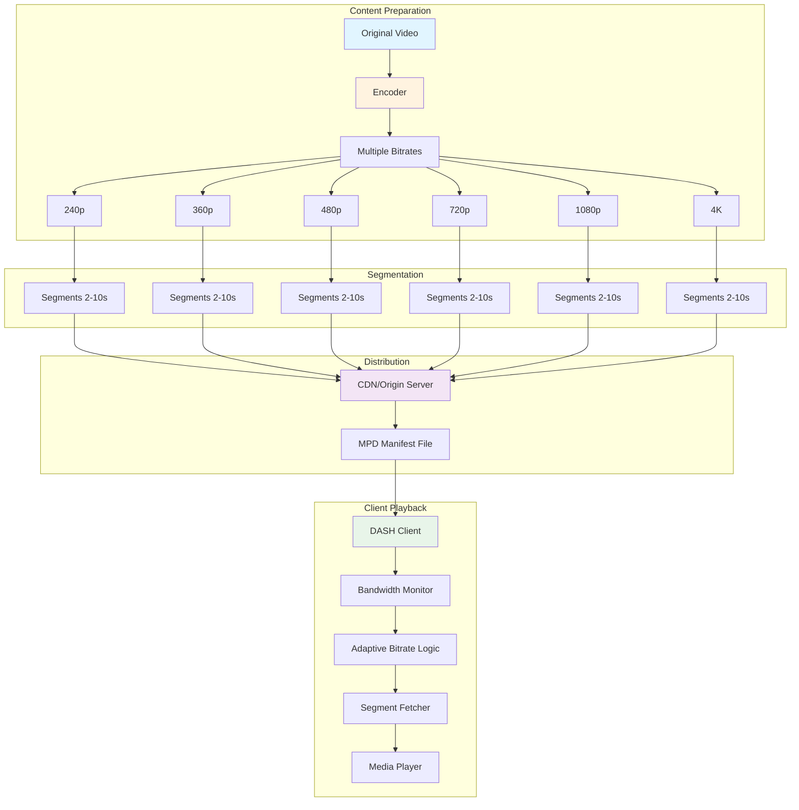
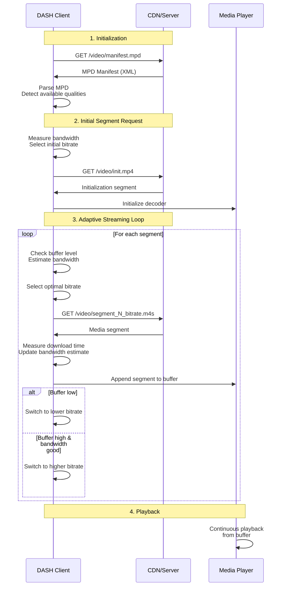

#application-layer #computer-network #dash #streaming #http #adaptive-bitrate #video #mpeg-dash
## Overview

==Dynamic Adaptive Streaming over HTTP (DASH)==, also known as ==MPEG-DASH==, is an adaptive bitrate streaming technique that enables high-quality streaming of media content over the Internet delivered from conventional HTTP web servers. DASH is the first adaptive bit-rate HTTP-based streaming solution that is an international standard (ISO/IEC 23009-1:2012).

**Key Characteristics:**
- **Adaptive bitrate streaming**: Automatically adjusts video quality based on network conditions
- **HTTP-based**: Uses standard HTTP/HTTPS protocol and existing CDN infrastructure
- **Codec-agnostic**: Works with any video codec (H.264, H.265, VP9, AV1)
- **Client-driven**: Client controls bitrate adaptation logic
- **Segment-based**: Video divided into small segments (2-10 seconds)
- **CDN-friendly**: Leverages HTTP caching and CDN distribution

**Advantages:**
- Uses existing HTTP infrastructure (no specialized streaming servers)
- Passes through firewalls and NAT devices
- Scalable through CDN distribution
- Adaptive to network fluctuations
- Reduces buffering and startup time
- Optimizes bandwidth usage

**Historical Context:**

Before DASH, proprietary streaming protocols dominated (Apple HLS, Microsoft Smooth Streaming, Adobe HDS). MPEG-DASH standardized adaptive streaming, enabling interoperability across platforms and devices. Released in 2012, DASH has become the foundation for modern streaming services like YouTube, Netflix, and Hulu.

## DASH Architecture

### System Components



### Server-Side Components

**1. Content Encoder**
- Encodes source video into multiple representations (bitrates/resolutions)
- Generates segments of fixed duration (typically 2-10 seconds)
- Creates initialization segments containing codec information
- Produces MPD (Media Presentation Description) manifest file

**2. Origin Server / CDN**
- Stores video segments and manifest files
- Serves segments via standard HTTP
- Handles byte-range requests
- Implements HTTP caching headers
- Distributes content globally through CDN nodes

**3. MPD Manifest File**
- XML-based descriptor of available representations
- Lists all video qualities, bitrates, resolutions
- Provides segment URLs or URL templates
- Specifies segment duration and timeline
- May include multiple periods for ads or alternate content

### Client-Side Components

**1. DASH Client / Player**
- Parses MPD manifest file
- Selects appropriate representation based on bandwidth
- Fetches video segments sequentially
- Maintains playback buffer
- Implements adaptive bitrate algorithm

**2. Bandwidth Estimator**
- Monitors download speed for each segment
- Estimates available network throughput
- Predicts future bandwidth conditions
- Triggers quality switches when needed

**3. Adaptation Logic**
- Decides which bitrate to request for next segment
- Balances quality vs buffer stability
- Implements switching algorithms (conservative, aggressive, hybrid)
- Prevents excessive quality oscillations

**4. Media Player**
- Decodes and renders video segments
- Manages playback buffer
- Handles seamless quality transitions
- Synchronizes audio and video tracks

## DASH Workflow

### Complete Streaming Process



### Adaptive Bitrate Selection

**Bandwidth Estimation:**

```Text title='Bandwidth calculation'
Bandwidth (bps) = Segment Size (bytes) × 8 / Download Time (seconds)

Exponentially Weighted Moving Average (EWMA):
Estimated BW = α × Current BW + (1 - α) × Previous Estimated BW

Where α = smoothing factor (typically 0.2 - 0.5)
```

**Bitrate Selection Strategies:**

**1. Conservative (Buffer-based)**
- Prioritizes buffer stability
- Switches up slowly, switches down quickly
- Used when buffer < threshold (typically 10-15 seconds)

**2. Aggressive (Throughput-based)**
- Maximizes video quality
- Quickly adapts to available bandwidth
- Used when buffer > threshold

**3. Hybrid (Combined)**
- Balances quality and stability
- Considers both buffer level and bandwidth
- Most common in production systems

**Decision Logic:**

```Python title='Simplified ABR algorithm'
def select_bitrate(available_bitrates, estimated_bandwidth, buffer_level):
    """Select optimal bitrate based on network and buffer conditions"""

    # Safety factor to prevent rebuffering
    safety_factor = 0.8
    usable_bandwidth = estimated_bandwidth * safety_factor

    # Filter bitrates within usable bandwidth
    feasible_bitrates = [br for br in available_bitrates if br <= usable_bandwidth]

    if not feasible_bitrates:
        # Network too slow, use lowest bitrate
        return available_bitrates[0]

    # Buffer-based adjustment
    if buffer_level < 10:  # seconds
        # Low buffer: be conservative
        return feasible_bitrates[0]  # Lowest feasible
    elif buffer_level > 30:  # seconds
        # High buffer: can be aggressive
        return feasible_bitrates[-1]  # Highest feasible
    else:
        # Medium buffer: balanced approach
        mid_index = len(feasible_bitrates) // 2
        return feasible_bitrates[mid_index]
```

## MPD Manifest File

The ==Media Presentation Description (MPD)== is an XML file describing the video structure and available representations.

### MPD Structure

```xml title='Example MPD manifest file'
<?xml version="1.0" encoding="UTF-8"?>
<MPD xmlns="urn:mpeg:dash:schema:mpd:2011"
     type="static"
     mediaPresentationDuration="PT0H9M56.46S"
     minBufferTime="PT1.5S"
     profiles="urn:mpeg:dash:profile:isoff-live:2011">

    <!-- Period: Temporal section of content -->
    <Period id="0" start="PT0S">

        <!-- AdaptationSet: Group of interchangeable representations -->
        <AdaptationSet id="1"
                       mimeType="video/mp4"
                       codecs="avc1.4d401f"
                       width="1920"
                       height="1080"
                       frameRate="30"
                       segmentAlignment="true"
                       startWithSAP="1">

            <!-- Representation: Specific bitrate/quality -->
            <Representation id="240p"
                           bandwidth="300000"
                           width="426"
                           height="240">
                <SegmentTemplate timescale="1000"
                                 duration="4000"
                                 initialization="init-$RepresentationID$.mp4"
                                 media="chunk-$RepresentationID$-$Number%05d$.m4s"
                                 startNumber="1"/>
            </Representation>

            <Representation id="360p"
                           bandwidth="600000"
                           width="640"
                           height="360">
                <SegmentTemplate timescale="1000"
                                 duration="4000"
                                 initialization="init-$RepresentationID$.mp4"
                                 media="chunk-$RepresentationID$-$Number%05d$.m4s"
                                 startNumber="1"/>
            </Representation>

            <Representation id="480p"
                           bandwidth="1000000"
                           width="854"
                           height="480">
                <SegmentTemplate timescale="1000"
                                 duration="4000"
                                 initialization="init-$RepresentationID$.mp4"
                                 media="chunk-$RepresentationID$-$Number%05d$.m4s"
                                 startNumber="1"/>
            </Representation>

            <Representation id="720p"
                           bandwidth="2000000"
                           width="1280"
                           height="720">
                <SegmentTemplate timescale="1000"
                                 duration="4000"
                                 initialization="init-$RepresentationID$.mp4"
                                 media="chunk-$RepresentationID$-$Number%05d$.m4s"
                                 startNumber="1"/>
            </Representation>

            <Representation id="1080p"
                           bandwidth="4000000"
                           width="1920"
                           height="1080">
                <SegmentTemplate timescale="1000"
                                 duration="4000"
                                 initialization="init-$RepresentationID$.mp4"
                                 media="chunk-$RepresentationID$-$Number%05d$.m4s"
                                 startNumber="1"/>
            </Representation>
        </AdaptationSet>

        <!-- Audio AdaptationSet -->
        <AdaptationSet id="2"
                       mimeType="audio/mp4"
                       codecs="mp4a.40.2"
                       lang="en"
                       segmentAlignment="true"
                       startWithSAP="1">
            <Representation id="audio"
                           bandwidth="128000"
                           audioSamplingRate="48000">
                <AudioChannelConfiguration
                    schemeIdUri="urn:mpeg:dash:23003:3:audio_channel_configuration:2011"
                    value="2"/>
                <SegmentTemplate timescale="1000"
                                 duration="4000"
                                 initialization="init-audio.mp4"
                                 media="chunk-audio-$Number%05d$.m4s"
                                 startNumber="1"/>
            </Representation>
        </AdaptationSet>
    </Period>
</MPD>
```

### MPD Key Elements

**MPD Root:**
- `type`: "static" (VOD) or "dynamic" (live)
- `mediaPresentationDuration`: Total content duration
- `minBufferTime`: Minimum buffer to maintain
- `profiles`: DASH profile (live, on-demand, main)

**Period:**
- Temporal section of content
- Multiple periods for ads or alternate content
- Each period has independent AdaptationSets

**AdaptationSet:**
- Group of interchangeable representations
- Separate sets for video, audio, subtitles
- Shares common properties (codec, language)

**Representation:**
- Specific quality level (bitrate, resolution)
- `bandwidth`: Bitrate in bits per second
- `width`, `height`: Video dimensions
- Contains segment information

**SegmentTemplate:**
- URL pattern for segments
- `initialization`: Init segment URL
- `media`: Media segment URL pattern
- `duration`: Segment duration (in timescale units)
- `startNumber`: First segment number

### Segment Addressing Methods

**1. SegmentTemplate (Most common)**

```xml
<SegmentTemplate timescale="1000"
                 duration="4000"
                 initialization="init-$RepresentationID$.mp4"
                 media="chunk-$RepresentationID$-$Number%05d$.m4s"
                 startNumber="1"/>

Generated URLs:
init-720p.mp4
chunk-720p-00001.m4s
chunk-720p-00002.m4s
chunk-720p-00003.m4s
```

**2. SegmentList (Explicit listing)**

```xml
<SegmentList duration="4000">
    <Initialization sourceURL="init.mp4"/>
    <SegmentURL media="seg1.m4s"/>
    <SegmentURL media="seg2.m4s"/>
    <SegmentURL media="seg3.m4s"/>
</SegmentList>
```

**3. SegmentBase (Single file with byte ranges)**

```xml
<SegmentBase indexRange="0-1000">
    <Initialization range="0-500"/>
</SegmentBase>
```

## Practical DASH Implementation

### Encoding Video for DASH

**Using FFmpeg and MP4Box:**

```Shell title='Encode video in multiple bitrates with FFmpeg'
#!/bin/bash

INPUT="source.mp4"
OUTPUT_DIR="dash_output"
mkdir -p "$OUTPUT_DIR"

# Encode multiple representations
# 240p - 300 kbps
ffmpeg -i "$INPUT" -c:v libx264 -b:v 300k -s 426x240 -profile:v baseline \
  -c:a aac -b:a 64k -ar 48000 -ac 2 \
  -f mp4 -movflags +faststart "$OUTPUT_DIR/240p.mp4"

# 360p - 600 kbps
ffmpeg -i "$INPUT" -c:v libx264 -b:v 600k -s 640x360 -profile:v main \
  -c:a aac -b:a 96k -ar 48000 -ac 2 \
  -f mp4 -movflags +faststart "$OUTPUT_DIR/360p.mp4"

# 480p - 1000 kbps
ffmpeg -i "$INPUT" -c:v libx264 -b:v 1000k -s 854x480 -profile:v main \
  -c:a aac -b:a 128k -ar 48000 -ac 2 \
  -f mp4 -movflags +faststart "$OUTPUT_DIR/480p.mp4"

# 720p - 2000 kbps
ffmpeg -i "$INPUT" -c:v libx264 -b:v 2000k -s 1280x720 -profile:v high \
  -c:a aac -b:a 128k -ar 48000 -ac 2 \
  -f mp4 -movflags +faststart "$OUTPUT_DIR/720p.mp4"

# 1080p - 4000 kbps
ffmpeg -i "$INPUT" -c:v libx264 -b:v 4000k -s 1920x1080 -profile:v high \
  -c:a aac -b:a 192k -ar 48000 -ac 2 \
  -f mp4 -movflags +faststart "$OUTPUT_DIR/1080p.mp4"

echo "Encoding complete!"
```

**Segment and Generate MPD:**

```Shell title='Create DASH segments with MP4Box'
#!/bin/bash

OUTPUT_DIR="dash_output"
cd "$OUTPUT_DIR"

# Create DASH segments with MP4Box
MP4Box -dash 4000 -frag 4000 -rap -segment-name segment_ \
  -out manifest.mpd \
  240p.mp4:id=240p \
  360p.mp4:id=360p \
  480p.mp4:id=480p \
  720p.mp4:id=720p \
  1080p.mp4:id=1080p

echo "DASH packaging complete!"
echo "Manifest: $OUTPUT_DIR/manifest.mpd"
```

**Alternative: Using Shaka Packager:**

```Shell title='Create DASH content with Shaka Packager'
#!/bin/bash

packager \
  in=240p.mp4,stream=video,output=240p.mp4,playlist_name=240p.mpd \
  in=360p.mp4,stream=video,output=360p.mp4,playlist_name=360p.mpd \
  in=480p.mp4,stream=video,output=480p.mp4,playlist_name=480p.mpd \
  in=720p.mp4,stream=video,output=720p.mp4,playlist_name=720p.mpd \
  in=1080p.mp4,stream=video,output=1080p.mp4,playlist_name=1080p.mpd \
  in=source.mp4,stream=audio,output=audio.mp4,playlist_name=audio.mpd \
  --segment_duration 4 \
  --mpd_output manifest.mpd

echo "Shaka packaging complete!"
```

### Python DASH Client

```Python title='Basic DASH client implementation'
import requests
import xml.etree.ElementTree as ET
from time import time

class SimpleDASHClient:
    def __init__(self, mpd_url):
        self.mpd_url = mpd_url
        self.representations = []
        self.buffer = []
        self.buffer_duration = 0
        self.bandwidth_estimate = 0

    def fetch_mpd(self):
        """Download and parse MPD manifest"""
        response = requests.get(self.mpd_url)
        root = ET.fromstring(response.content)

        # Parse namespace
        ns = {'mpd': 'urn:mpeg:dash:schema:mpd:2011'}

        # Extract base URL
        self.base_url = self.mpd_url.rsplit('/', 1)[0] + '/'

        # Parse representations
        for adapt_set in root.findall('.//mpd:AdaptationSet', ns):
            mime_type = adapt_set.get('mimeType')

            if mime_type.startswith('video'):
                for rep in adapt_set.findall('.//mpd:Representation', ns):
                    rep_info = {
                        'id': rep.get('id'),
                        'bandwidth': int(rep.get('bandwidth')),
                        'width': rep.get('width'),
                        'height': rep.get('height'),
                        'init_url': None,
                        'media_template': None
                    }

                    # Parse segment template
                    seg_template = rep.find('.//mpd:SegmentTemplate', ns)
                    if seg_template is not None:
                        init_template = seg_template.get('initialization')
                        media_template = seg_template.get('media')

                        rep_info['init_url'] = init_template.replace('$RepresentationID$', rep_info['id'])
                        rep_info['media_template'] = media_template
                        rep_info['duration'] = int(seg_template.get('duration'))
                        rep_info['timescale'] = int(seg_template.get('timescale', 1))

                    self.representations.append(rep_info)

        # Sort by bandwidth
        self.representations.sort(key=lambda x: x['bandwidth'])

        print(f"Found {len(self.representations)} video representations:")
        for rep in self.representations:
            print(f"  {rep['id']}: {rep['bandwidth']/1000:.0f} kbps ({rep['width']}x{rep['height']})")

    def select_representation(self):
        """Select appropriate representation based on bandwidth"""
        if self.bandwidth_estimate == 0:
            # First segment: start with lowest quality
            return self.representations[0]

        # Safety factor to prevent rebuffering
        usable_bandwidth = self.bandwidth_estimate * 0.8

        # Find highest quality within bandwidth
        selected = self.representations[0]
        for rep in self.representations:
            if rep['bandwidth'] <= usable_bandwidth:
                selected = rep
            else:
                break

        return selected

    def download_segment(self, url):
        """Download segment and measure bandwidth"""
        start_time = time()
        response = requests.get(url)
        download_time = time() - start_time

        segment_size = len(response.content)

        # Calculate bandwidth (bytes per second)
        bandwidth_bps = (segment_size * 8) / download_time

        # Update bandwidth estimate with EWMA
        alpha = 0.3
        if self.bandwidth_estimate == 0:
            self.bandwidth_estimate = bandwidth_bps
        else:
            self.bandwidth_estimate = (alpha * bandwidth_bps +
                                      (1 - alpha) * self.bandwidth_estimate)

        return response.content, download_time

    def stream_video(self, num_segments=20):
        """Stream video segments with adaptive bitrate"""
        self.fetch_mpd()

        # Download initialization segment
        init_rep = self.representations[0]
        init_url = self.base_url + init_rep['init_url']
        print(f"\nDownloading initialization segment: {init_url}")
        init_data, _ = self.download_segment(init_url)

        # Stream segments
        for seg_num in range(1, num_segments + 1):
            # Select representation
            selected_rep = self.select_representation()

            # Build segment URL
            media_url = selected_rep['media_template']
            media_url = media_url.replace('$RepresentationID$', selected_rep['id'])
            media_url = media_url.replace('$Number%05d$', f'{seg_num:05d}')
            media_url = media_url.replace('$Number$', str(seg_num))
            full_url = self.base_url + media_url

            # Download segment
            print(f"\nSegment {seg_num}:")
            print(f"  Selected: {selected_rep['id']} ({selected_rep['bandwidth']/1000:.0f} kbps)")
            print(f"  URL: {full_url}")

            segment_data, download_time = self.download_segment(full_url)

            print(f"  Downloaded: {len(segment_data)/1024:.1f} KB in {download_time:.2f}s")
            print(f"  Bandwidth estimate: {self.bandwidth_estimate/1_000_000:.2f} Mbps")

            # Simulate playback
            segment_duration = selected_rep['duration'] / selected_rep['timescale']
            self.buffer_duration += segment_duration
            print(f"  Buffer duration: {self.buffer_duration:.1f}s")

# Usage
client = SimpleDASHClient('https://example.com/video/manifest.mpd')
client.stream_video(num_segments=10)
```

### JavaScript DASH Player

```JavaScript title='DASH player with dash.js'
<!DOCTYPE html>
<html>
<head>
    <title>DASH Video Player</title>
    <script src="https://cdn.dashjs.org/latest/dash.all.min.js"></script>
    <style>
        body {
            font-family: Arial, sans-serif;
            max-width: 1200px;
            margin: 0 auto;
            padding: 20px;
        }
        #videoContainer {
            position: relative;
            width: 100%;
            max-width: 960px;
        }
        video {
            width: 100%;
            height: auto;
        }
        #stats {
            margin-top: 20px;
            padding: 10px;
            background: #f0f0f0;
            border-radius: 5px;
        }
        .stat-row {
            display: flex;
            justify-content: space-between;
            padding: 5px 0;
        }
        .stat-label {
            font-weight: bold;
        }
    </style>
</head>
<body>
    <h1>DASH Video Player</h1>

    <div id="videoContainer">
        <video id="videoPlayer" controls></video>
    </div>

    <div id="stats">
        <h3>Streaming Statistics</h3>
        <div class="stat-row">
            <span class="stat-label">Current Quality:</span>
            <span id="currentQuality">-</span>
        </div>
        <div class="stat-row">
            <span class="stat-label">Bitrate:</span>
            <span id="currentBitrate">-</span>
        </div>
        <div class="stat-row">
            <span class="stat-label">Buffer Length:</span>
            <span id="bufferLength">-</span>
        </div>
        <div class="stat-row">
            <span class="stat-label">Bandwidth:</span>
            <span id="bandwidth">-</span>
        </div>
        <div class="stat-row">
            <span class="stat-label">Dropped Frames:</span>
            <span id="droppedFrames">-</span>
        </div>
    </div>

    <script>
        // Initialize DASH player
        const url = 'https://dash.akamaized.net/envivio/EnvivioDash3/manifest.mpd';
        const video = document.getElementById('videoPlayer');
        const player = dashjs.MediaPlayer().create();

        // Configure player
        player.initialize(video, url, true);

        // Set initial bitrate (optional)
        player.setInitialBitrateFor('video', 1000); // 1 Mbps

        // Enable ABR (Adaptive Bitrate)
        player.updateSettings({
            streaming: {
                abr: {
                    autoSwitchBitrate: {
                        video: true,
                        audio: true
                    },
                    initialBitrate: {
                        video: 1000
                    },
                    maxBitrate: {
                        video: 5000
                    },
                    minBitrate: {
                        video: 300
                    }
                },
                buffer: {
                    bufferTimeDefault: 20,
                    bufferTimeMax: 40,
                    stableBufferTime: 12
                }
            }
        });

        // Update statistics
        setInterval(() => {
            if (player) {
                const dashMetrics = player.getDashMetrics();
                const bitrateInfo = player.getBitrateInfoListFor('video');
                const currentBitrateInfo = bitrateInfo[player.getQualityFor('video')];

                // Current quality
                const quality = player.getQualityFor('video');
                document.getElementById('currentQuality').textContent =
                    `${currentBitrateInfo.width}x${currentBitrateInfo.height}`;

                // Current bitrate
                const bitrate = currentBitrateInfo.bitrate / 1000;
                document.getElementById('currentBitrate').textContent =
                    `${bitrate.toFixed(0)} kbps`;

                // Buffer length
                const bufferLength = player.getBufferLength('video');
                document.getElementById('bufferLength').textContent =
                    `${bufferLength ? bufferLength.toFixed(1) : 0}s`;

                // Bandwidth estimate
                const throughputHistory = dashMetrics.getCurrentHttpRequest('video');
                if (throughputHistory) {
                    const bw = throughputHistory.trace.reduce((acc, trace) =>
                        acc + trace.b[0], 0) * 8 / throughputHistory.trace.reduce((acc, trace) =>
                        acc + trace.d, 0) / 1000000;
                    document.getElementById('bandwidth').textContent =
                        `${bw.toFixed(2)} Mbps`;
                }

                // Dropped frames
                if (video.webkitDroppedFrameCount !== undefined) {
                    document.getElementById('droppedFrames').textContent =
                        video.webkitDroppedFrameCount;
                } else if (video.getVideoPlaybackQuality) {
                    document.getElementById('droppedFrames').textContent =
                        video.getVideoPlaybackQuality().droppedVideoFrames;
                }
            }
        }, 1000);

        // Event listeners
        player.on(dashjs.MediaPlayer.events.STREAM_INITIALIZED, () => {
            console.log('Stream initialized');
        });

        player.on(dashjs.MediaPlayer.events.QUALITY_CHANGE_REQUESTED, (e) => {
            console.log(`Quality change requested: ${e.newQuality}`);
        });

        player.on(dashjs.MediaPlayer.events.QUALITY_CHANGE_RENDERED, (e) => {
            console.log(`Quality change rendered: ${e.newQuality}`);
        });

        player.on(dashjs.MediaPlayer.events.PLAYBACK_STALLED, () => {
            console.log('Playback stalled (rebuffering)');
        });

        player.on(dashjs.MediaPlayer.events.ERROR, (e) => {
            console.error('DASH error:', e);
        });
    </script>
</body>
</html>
```

### React DASH Player Component

```JavaScript title='DASH player React component'
import React, { useEffect, useRef, useState } from 'react';
import dashjs from 'dashjs';

const DASHPlayer = ({ url, autoPlay = true }) => {
    const videoRef = useRef(null);
    const playerRef = useRef(null);
    const [stats, setStats] = useState({
        quality: '-',
        bitrate: '-',
        buffer: '-',
        bandwidth: '-'
    });

    useEffect(() => {
        if (!videoRef.current) return;

        // Initialize player
        const player = dashjs.MediaPlayer().create();
        player.initialize(videoRef.current, url, autoPlay);
        playerRef.current = player;

        // Configure ABR settings
        player.updateSettings({
            streaming: {
                abr: {
                    autoSwitchBitrate: { video: true, audio: true },
                    initialBitrate: { video: 1000 },
                    maxBitrate: { video: 5000 },
                    minBitrate: { video: 300 }
                },
                buffer: {
                    bufferTimeDefault: 20,
                    bufferTimeMax: 40,
                    stableBufferTime: 12
                }
            }
        });

        // Event handlers
        player.on(dashjs.MediaPlayer.events.QUALITY_CHANGE_RENDERED, (e) => {
            console.log('Quality changed to:', e.newQuality);
        });

        // Stats update interval
        const statsInterval = setInterval(() => {
            const bitrateInfo = player.getBitrateInfoListFor('video');
            const currentQuality = player.getQualityFor('video');
            const currentBitrateInfo = bitrateInfo[currentQuality];

            if (currentBitrateInfo) {
                setStats({
                    quality: `${currentBitrateInfo.width}x${currentBitrateInfo.height}`,
                    bitrate: `${(currentBitrateInfo.bitrate / 1000).toFixed(0)} kbps`,
                    buffer: `${(player.getBufferLength('video') || 0).toFixed(1)}s`,
                    bandwidth: `${(currentBitrateInfo.bitrate / 1000000).toFixed(2)} Mbps`
                });
            }
        }, 1000);

        // Cleanup
        return () => {
            clearInterval(statsInterval);
            if (playerRef.current) {
                playerRef.current.destroy();
            }
        };
    }, [url, autoPlay]);

    return (
        <div className="dash-player">
            <video
                ref={videoRef}
                controls
                style={{ width: '100%', maxWidth: '960px' }}
            />
            <div className="stats" style={{ marginTop: '20px' }}>
                <h3>Streaming Stats</h3>
                <p>Quality: {stats.quality}</p>
                <p>Bitrate: {stats.bitrate}</p>
                <p>Buffer: {stats.buffer}</p>
                <p>Bandwidth: {stats.bandwidth}</p>
            </div>
        </div>
    );
};

export default DASHPlayer;

// Usage:
// <DASHPlayer url="https://example.com/manifest.mpd" autoPlay={true} />
```

## DASH vs Other Streaming Protocols

| Feature | DASH | HLS | RTMP | WebRTC |
|---------|------|-----|------|--------|
| **Standard** | MPEG (ISO) | Apple proprietary | Adobe proprietary | W3C/IETF |
| **Transport** | HTTP/HTTPS | HTTP/HTTPS | TCP (RTMP) | UDP/TCP |
| **Latency** | 10-30 seconds | 10-30 seconds | 3-5 seconds | < 1 second |
| **Adaptive** | Yes | Yes | No | Limited |
| **CDN Support** | Excellent | Excellent | Poor | Good |
| **Browser Support** | Via MSE | Native (Safari), MSE | Flash only | Native |
| **Codec Agnostic** | Yes | No (H.264/H.265) | Limited | Yes |
| **Live Streaming** | Yes | Yes | Yes | Yes |
| **VOD** | Yes | Yes | Yes | No |
| **DRM Support** | Yes | Yes (FairPlay) | Limited | No |

**When to Use DASH:**
- Need codec flexibility (VP9, AV1, H.265)
- Multi-platform support required
- Standards-based solution preferred
- High-quality VOD delivery
- Live streaming with adaptive bitrate

**When to Use HLS:**
- iOS/Safari primary target
- Simplicity prioritized
- Apple ecosystem integration
- Already using Apple infrastructure

**When to Use WebRTC:**
- Ultra-low latency required (< 1 second)
- Real-time communication (video conferencing)
- Interactive applications
- Peer-to-peer streaming

## DASH Performance Optimization

### Encoding Best Practices

**Bitrate Ladder:**

```Text title='Recommended bitrate ladder for DASH'
Resolution | Bitrate (Video) | Bitrate (Total) | Use Case
-----------|-----------------|-----------------|----------
3840x2160  | 13-18 Mbps     | 13.5-18.5 Mbps | 4K UHD
2560x1440  | 6-9 Mbps       | 6.5-9.5 Mbps   | 1440p
1920x1080  | 3-5 Mbps       | 3.5-5.5 Mbps   | 1080p Full HD
1280x720   | 1.5-3 Mbps     | 2-3.5 Mbps     | 720p HD
854x480    | 0.8-1.2 Mbps   | 1-1.5 Mbps     | 480p SD
640x360    | 0.4-0.8 Mbps   | 0.5-1 Mbps     | 360p
426x240    | 0.2-0.4 Mbps   | 0.3-0.5 Mbps   | 240p

Audio: 64-192 kbps AAC
```

**Segment Duration:**
- **VOD**: 4-6 seconds (balance quality switching vs overhead)
- **Live**: 2-4 seconds (lower latency, more responsive)
- **Ultra-Low Latency**: 1-2 seconds (chunked CMAF)

**Keyframe Interval:**
- Set to segment duration for instant switching
- GOP (Group of Pictures) = segment duration
- Example: 4-second segments = 120 frames @ 30fps

### Client-Side Optimization

```Python title='Advanced ABR algorithm'
class AdvancedABRAlgorithm:
    def __init__(self, representations):
        self.representations = sorted(representations, key=lambda x: x['bitrate'])
        self.bandwidth_samples = []
        self.buffer_history = []

    def estimate_bandwidth(self, download_size, download_time):
        """Estimate bandwidth with multiple samples"""
        bandwidth = (download_size * 8) / download_time
        self.bandwidth_samples.append(bandwidth)

        # Keep last 5 samples
        if len(self.bandwidth_samples) > 5:
            self.bandwidth_samples.pop(0)

        # Harmonic mean (more conservative than arithmetic mean)
        harmonic_mean = len(self.bandwidth_samples) / sum(1/b for b in self.bandwidth_samples)
        return harmonic_mean

    def select_bitrate(self, estimated_bandwidth, buffer_level, current_bitrate):
        """Select optimal bitrate using buffer-based + throughput-based hybrid"""

        # Parameters
        RESERVOIR = 5  # seconds
        CUSHION = 15   # seconds
        MAX_BUFFER = 30  # seconds

        # Calculate buffer state
        if buffer_level <= RESERVOIR:
            buffer_factor = 0.2  # Very conservative
        elif buffer_level <= CUSHION:
            buffer_factor = 0.4 + 0.3 * ((buffer_level - RESERVOIR) / (CUSHION - RESERVOIR))
        else:
            buffer_factor = 0.7 + 0.3 * min((buffer_level - CUSHION) / (MAX_BUFFER - CUSHION), 1.0)

        # Adjust bandwidth estimate based on buffer
        safe_bandwidth = estimated_bandwidth * buffer_factor

        # Find highest bitrate within safe bandwidth
        selected_bitrate = self.representations[0]['bitrate']
        for rep in self.representations:
            if rep['bitrate'] <= safe_bandwidth:
                selected_bitrate = rep['bitrate']
            else:
                break

        # Prevent oscillation: require significant improvement to switch up
        if selected_bitrate > current_bitrate:
            min_improvement = 1.2  # Require 20% improvement
            if selected_bitrate / current_bitrate < min_improvement:
                selected_bitrate = current_bitrate

        return selected_bitrate
```

### Server-Side Optimization

**HTTP Caching Headers:**

```nginx title='Nginx configuration for DASH'
location /dash/ {
    # Enable CORS
    add_header Access-Control-Allow-Origin *;
    add_header Access-Control-Allow-Methods 'GET, HEAD, OPTIONS';
    add_header Access-Control-Allow-Headers 'Range';

    # MPD manifest: short cache (for live) or long cache (for VOD)
    location ~ \.mpd$ {
        add_header Cache-Control "max-age=2, must-revalidate"; # Live
        # add_header Cache-Control "max-age=31536000, immutable"; # VOD
    }

    # Segments: long cache (immutable)
    location ~ \.(m4s|mp4)$ {
        add_header Cache-Control "max-age=31536000, immutable";
    }

    # Enable byte-range requests
    add_header Accept-Ranges bytes;
}
```

**CDN Configuration:**

```Text title='CDN optimization checklist'
✓ Enable HTTP/2 for multiplexing
✓ Configure segment pre-fetching
✓ Set appropriate cache TTLs
✓ Enable compression for MPD (gzip/brotli)
✓ Configure geographic distribution
✓ Enable logging for analytics
✓ Set up origin shield for protection
✓ Configure rate limiting per client
```

## DASH Tools and Players

### Content Creation Tools

**FFmpeg**
- Open-source video encoder
- Supports all codecs and formats
- Command-line interface
- Highly configurable

**MP4Box (GPAC)**
- DASH packaging tool
- Creates MPD and segments
- Free and open-source

**Shaka Packager**
- Google's packaging tool
- Supports DASH and HLS
- Production-ready
- Command-line and library

**Bento4**
- MP4 manipulation toolkit
- DASH and HLS support
- Open-source

### Player Libraries

**dash.js**
- Reference DASH player
- JavaScript implementation
- Supports MSE and EME
- Production-ready

**Shaka Player**
- Google's player library
- Supports DASH and HLS
- DRM support (Widevine, PlayReady, FairPlay)
- Excellent documentation

**Video.js with DASH plugin**
- Popular HTML5 player
- Plugin architecture
- Extensive customization

**hls.js (with DASH support)**
- Originally HLS, now supports DASH
- MSE-based playback
- Wide browser support

### Testing and Debugging Tools

```Python title='DASH manifest validator'
import requests
import xml.etree.ElementTree as ET

def validate_dash_manifest(mpd_url):
    """Validate DASH MPD manifest"""

    print(f"Validating: {mpd_url}\n")

    try:
        # Fetch MPD
        response = requests.get(mpd_url, timeout=10)
        if response.status_code != 200:
            print(f"✗ HTTP {response.status_code}")
            return False

        print("✓ MPD downloaded successfully")

        # Parse XML
        try:
            root = ET.fromstring(response.content)
            print("✓ Valid XML structure")
        except ET.ParseError as e:
            print(f"✗ XML parsing error: {e}")
            return False

        # Check namespace
        ns = {'mpd': 'urn:mpeg:dash:schema:mpd:2011'}
        if not root.tag.endswith('MPD'):
            print("✗ Root element is not MPD")
            return False
        print("✓ Valid MPD root element")

        # Check required attributes
        required_attrs = ['type', 'profiles']
        for attr in required_attrs:
            if attr not in root.attrib:
                print(f"✗ Missing required attribute: {attr}")
                return False
        print(f"✓ Required attributes present")

        # Check periods
        periods = root.findall('.//mpd:Period', ns)
        if not periods:
            print("✗ No periods found")
            return False
        print(f"✓ Found {len(periods)} period(s)")

        # Check adaptation sets
        adapt_sets = root.findall('.//mpd:AdaptationSet', ns)
        if not adapt_sets:
            print("✗ No adaptation sets found")
            return False
        print(f"✓ Found {len(adapt_sets)} adaptation set(s)")

        # Check representations
        representations = root.findall('.//mpd:Representation', ns)
        if not representations:
            print("✗ No representations found")
            return False
        print(f"✓ Found {len(representations)} representation(s)")

        # Validate each representation
        for i, rep in enumerate(representations):
            rep_id = rep.get('id', f'rep_{i}')
            bandwidth = rep.get('bandwidth')

            if not bandwidth:
                print(f"✗ Representation {rep_id}: missing bandwidth")
                return False

            # Check segment info
            has_segments = (
                rep.find('.//mpd:SegmentTemplate', ns) is not None or
                rep.find('.//mpd:SegmentList', ns) is not None or
                rep.find('.//mpd:SegmentBase', ns) is not None
            )

            if not has_segments:
                print(f"✗ Representation {rep_id}: no segment information")
                return False

            print(f"✓ Representation {rep_id}: valid ({int(bandwidth)/1000:.0f} kbps)")

        print("\n✓ MPD validation passed!")
        return True

    except requests.RequestException as e:
        print(f"✗ Network error: {e}")
        return False

# Usage
validate_dash_manifest('https://dash.akamaized.net/envivio/EnvivioDash3/manifest.mpd')
```

## Troubleshooting DASH

### Common Issues

**1. Playback Fails to Start**

```Text
Symptoms: Video player shows loading but never plays
```

**Solutions:**
- Check MPD URL is accessible (CORS enabled)
- Verify video format supported by browser
- Check browser console for JavaScript errors
- Validate MPD structure with validator
- Ensure segments are properly generated

**2. Frequent Rebuffering**

```Text
Symptoms: Video constantly pauses to buffer
```

**Solutions:**
- Check network bandwidth vs video bitrate
- Reduce initial bitrate selection
- Increase buffer size settings
- Verify CDN performance
- Check segment availability

**3. Quality Not Adapting**

```Text
Symptoms: Video stays at one quality level
```

**Solutions:**
- Enable ABR in player settings
- Check bandwidth estimation logic
- Verify multiple representations exist in MPD
- Review ABR algorithm parameters
- Check player logs for switching decisions

**4. Audio/Video Sync Issues**

```Text
Symptoms: Audio and video out of sync
```

**Solutions:**
- Verify segment durations match between audio/video
- Check timescale consistency in MPD
- Ensure keyframe alignment
- Validate segment timestamps
- Use initialization segments properly

**5. Seeking Not Working**

```Text
Symptoms: Cannot seek to different positions
```

**Solutions:**
- Ensure segments have proper indexing
- Check SegmentTemplate startNumber
- Verify byte-range support on server
- Enable range requests in CDN
- Check initialization segments

### Debug Script

```JavaScript title='DASH debugging helper'
function debugDASHPlayer(player) {
    console.log('=== DASH Player Debug Info ===\n');

    // Check if player is initialized
    if (!player) {
        console.error('Player not initialized');
        return;
    }

    // Get video element
    const video = player.getVideoElement();
    console.log('Video Element:');
    console.log(`  readyState: ${video.readyState}`);
    console.log(`  networkState: ${video.networkState}`);
    console.log(`  currentTime: ${video.currentTime.toFixed(2)}s`);
    console.log(`  duration: ${video.duration.toFixed(2)}s`);
    console.log(`  buffered ranges: ${video.buffered.length}`);

    // Buffer info
    for (let i = 0; i < video.buffered.length; i++) {
        console.log(`    Range ${i}: ${video.buffered.start(i).toFixed(2)}s - ${video.buffered.end(i).toFixed(2)}s`);
    }

    // Quality info
    console.log('\nQuality Info:');
    const videoQualities = player.getBitrateInfoListFor('video');
    const currentQuality = player.getQualityFor('video');

    videoQualities.forEach((q, index) => {
        const current = index === currentQuality ? ' [CURRENT]' : '';
        console.log(`  ${index}: ${q.width}x${q.height} @ ${(q.bitrate/1000).toFixed(0)} kbps${current}`);
    });

    // ABR settings
    console.log('\nABR Settings:');
    const settings = player.getSettings();
    console.log(`  Auto switch: ${settings.streaming.abr.autoSwitchBitrate.video}`);
    console.log(`  Initial bitrate: ${settings.streaming.abr.initialBitrate.video} kbps`);

    // Metrics
    console.log('\nMetrics:');
    const dashMetrics = player.getDashMetrics();
    const httpRequests = dashMetrics.getHttpRequests('video');

    if (httpRequests.length > 0) {
        const lastRequest = httpRequests[httpRequests.length - 1];
        console.log(`  Last request: ${lastRequest.url}`);
        console.log(`  Response code: ${lastRequest.status}`);
        console.log(`  Download time: ${lastRequest.requestEndDate - lastRequest.requestStartDate}ms`);
    }

    // Events
    console.log('\nRecent Events:');
    const eventHistory = player.getEventHistory();
    if (eventHistory) {
        eventHistory.slice(-5).forEach(event => {
            console.log(`  ${event.type}: ${JSON.stringify(event)}`);
        });
    }
}

// Usage: debugDASHPlayer(player);
```


***
# References
1. ISO/IEC 23009-1:2012 - Information technology — Dynamic adaptive streaming over HTTP (DASH)
	1. https://www.iso.org/standard/57623.html for MPEG-DASH standard
2. Computer Networking: A Top-Down Approach, Global Edition, 8th Edition - James F. Kurose, Keith W. Ross - Pearson (2021)
	1. Chapter 2: Application Layer
		1. Section 2.6: Video Streaming and Content Distribution Networks
3. https://dashif.org/ for DASH Industry Forum specifications and guidelines
4. https://github.com/Dash-Industry-Forum/dash.js for dash.js reference player
5. https://github.com/shaka-project/shaka-player for Shaka Player library
6. https://github.com/shaka-project/shaka-packager for Shaka Packager tool
7. https://gpac.wp.imt.fr/mp4box/ for MP4Box DASH packaging tool
8. https://ffmpeg.org/documentation.html for FFmpeg video encoding documentation
9. https://www.w3.org/TR/media-source/ for W3C Media Source Extensions (MSE) specification
10. https://www.w3.org/TR/encrypted-media/ for W3C Encrypted Media Extensions (EME) specification
11. DASH-IF Implementation Guidelines
	1. https://dashif.org/guidelines/ for industry best practices
12. https://bitmovin.com/docs/encoding/tutorials/dash for DASH encoding tutorials
13. https://developer.mozilla.org/en-US/docs/Web/API/Media_Source_Extensions_API for MSE API documentation