#computer-network #transport-layer #protocol #udp #http #quic #http3 #multiplexing #encryption #tls 
#zero-rtt #connection-migration #congestion-control #reliable-transport

# Formal Definition
- QUIC (Quick UDP Internet Connection) is a <mark class="hltr-yellow">modern transport layer protocol</mark> developed by Google (initially) and standardized by IETF as RFC 9000.
- QUIC is built on top of <mark class="hltr-yellow">UDP</mark> but provides <mark class="hltr-yellow">TCP-like reliability</mark> with significant performance improvements.
- QUIC incorporates <mark class="hltr-yellow">TLS 1.3 encryption by default</mark> - security is mandatory, not optional.
- QUIC is the foundation of <mark class="hltr-yellow">HTTP/3</mark>, the latest version of the HTTP protocol.
- Key innovations:
  1. **0-RTT Connection Establishment** - Fastest possible connection setup with cached credentials
  2. **Built-in Encryption** - TLS 1.3 integrated into the protocol, not layered on top
  3. **Stream Multiplexing** - Multiple independent streams without head-of-line blocking
  4. **Connection Migration** - Connections survive network changes (Wi-Fi → cellular)
  5. **Improved Congestion Control** - Modern algorithms designed for mobile networks

# Protocol Stack Comparison


```mermaid title='Traditional HTTPS vs HTTP/3 with QUIC'
graph TB
    subgraph "Traditional HTTPS (HTTP/1.1, HTTP/2)"
        T1[Application Layer]
        T2[HTTP/1.1 or HTTP/2]
        T3[TLS 1.2/1.3]
        T4[TCP]
        T5[IP]
        T6[Network Hardware]

        T1 --> T2 --> T3 --> T4 --> T5 --> T6
    end

    subgraph "Modern HTTP/3"
        M1[Application Layer]
        M2[HTTP/3]
        M3[QUIC TLS 1.3 integrated]
        M4[UDP]
        M5[IP]
        M6[Network Hardware]

        M1 --> M2 --> M3 --> M4 --> M5 --> M6
    end

    style T4 fill:#FFB6C1
    style M3 fill:#90EE90
```

**Key Difference:** QUIC combines transport layer (like TCP) and security layer (like TLS) into a single protocol over UDP.

# Why QUIC Was Created - Problems with TCP + TLS

## Problem 1: TCP Head-of-Line Blocking

### HTTP/2 over TCP Limitation

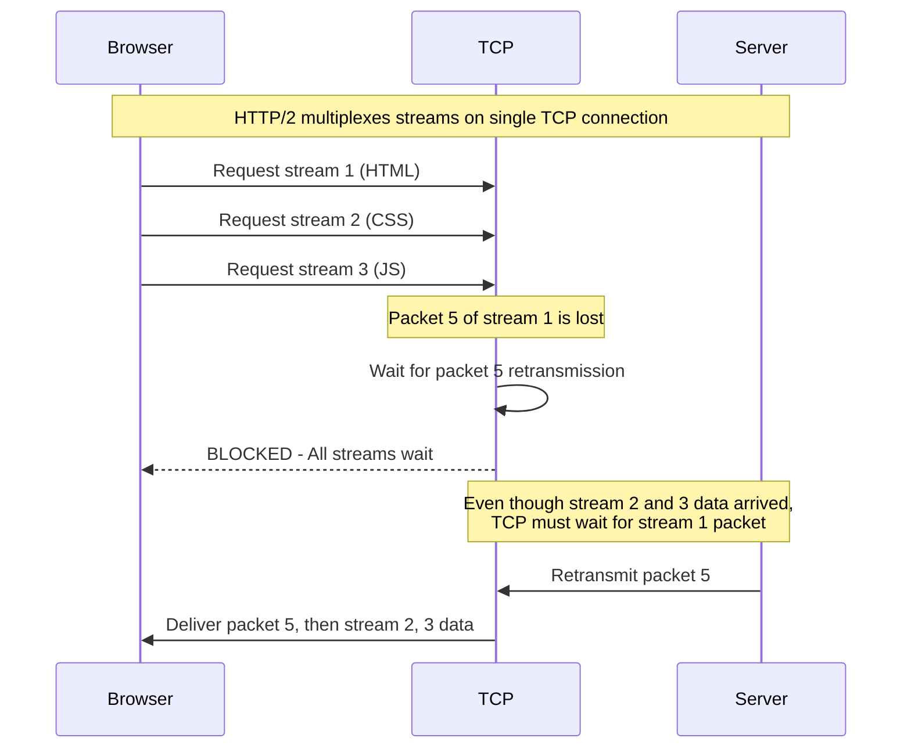
```mermaid
sequenceDiagram
    participant Browser
    participant TCP
    participant Server

    Note over Browser,Server: HTTP/2 multiplexes streams on single TCP connection

    Browser->>TCP: Request stream 1 (HTML)
    Browser->>TCP: Request stream 2 (CSS)
    Browser->>TCP: Request stream 3 (JS)

    Note over TCP: Packet 5 of stream 1 is lost

    TCP->>TCP: Wait for packet 5 retransmission
    TCP-->>Browser: BLOCKED - All streams wait

    Note over TCP,Server: Even though stream 2 and 3 data arrived,<br/>TCP must wait for stream 1 packet

    Server->>TCP: Retransmit packet 5
    TCP->>Browser: Deliver packet 5, then stream 2, 3 data
```

**Problem:** TCP sees bytes as a single ordered stream. One lost packet blocks all HTTP/2 streams.

### QUIC Solution - Independent Streams

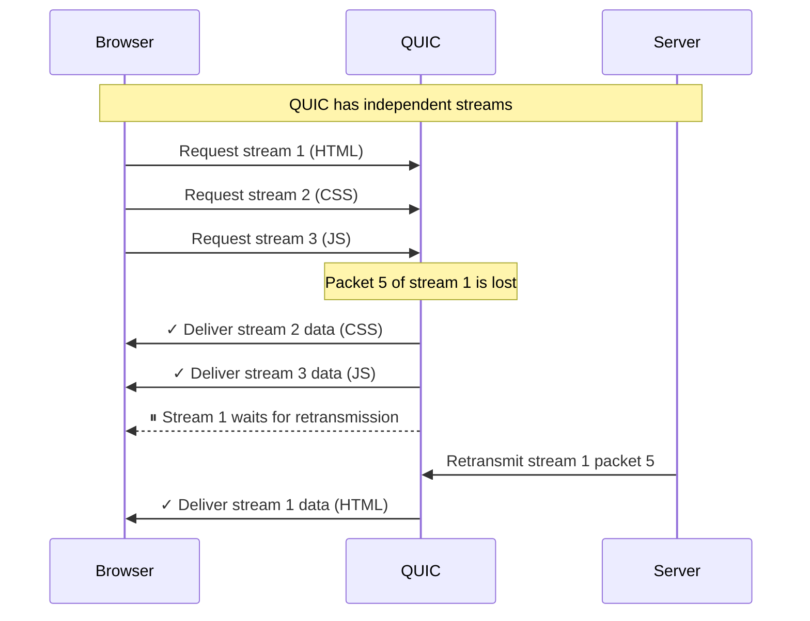
```mermaid
sequenceDiagram
    participant Browser
    participant QUIC
    participant Server

    Note over Browser,Server: QUIC has independent streams

    Browser->>QUIC: Request stream 1 (HTML)
    Browser->>QUIC: Request stream 2 (CSS)
    Browser->>QUIC: Request stream 3 (JS)

    Note over QUIC: Packet 5 of stream 1 is lost

    QUIC->>Browser: ✓ Deliver stream 2 data (CSS)
    QUIC->>Browser: ✓ Deliver stream 3 data (JS)
    QUIC-->>Browser: ⏸ Stream 1 waits for retransmission

    Server->>QUIC: Retransmit stream 1 packet 5
    QUIC->>Browser: ✓ Deliver stream 1 data (HTML)
```

**Solution:** Each QUIC stream is independent. Lost packets only affect their own stream.

## Problem 2: Slow Connection Establishment

### TCP + TLS 1.2 Handshake (3-RTT)

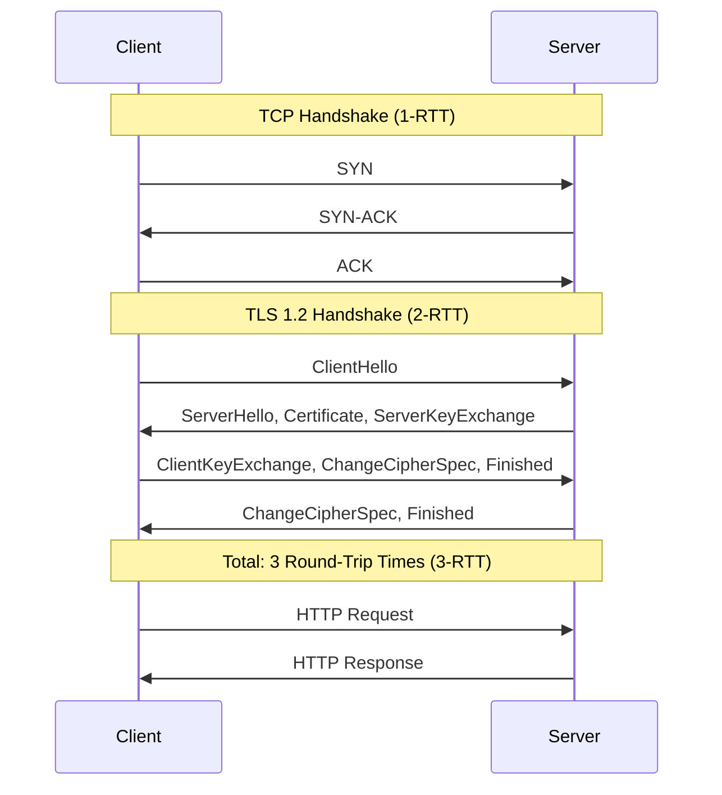
```mermaid
sequenceDiagram
    participant Client
    participant Server

    Note over Client,Server: TCP Handshake (1-RTT)
    Client->>Server: SYN
    Server->>Client: SYN-ACK
    Client->>Server: ACK

    Note over Client,Server: TLS 1.2 Handshake (2-RTT)
    Client->>Server: ClientHello
    Server->>Client: ServerHello, Certificate, ServerKeyExchange
    Client->>Server: ClientKeyExchange, ChangeCipherSpec, Finished
    Server->>Client: ChangeCipherSpec, Finished

    Note over Client,Server: Total: 3 Round-Trip Times (3-RTT)

    Client->>Server: HTTP Request
    Server->>Client: HTTP Response
```

**Total Time:** 3 RTT before first HTTP request
**Example:** 150ms RTT = 450ms before first byte

### TCP + TLS 1.3 Handshake (2-RTT)

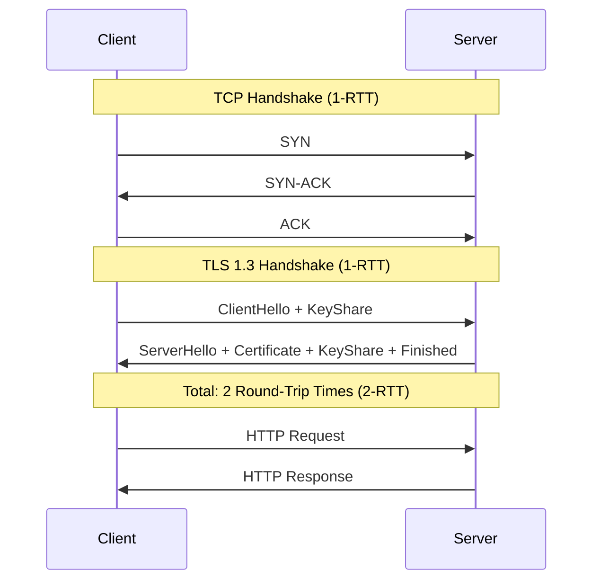
```mermaid
sequenceDiagram
    participant Client
    participant Server

    Note over Client,Server: TCP Handshake (1-RTT)
    Client->>Server: SYN
    Server->>Client: SYN-ACK
    Client->>Server: ACK

    Note over Client,Server: TLS 1.3 Handshake (1-RTT)
    Client->>Server: ClientHello + KeyShare
    Server->>Client: ServerHello + Certificate + KeyShare + Finished

    Note over Client,Server: Total: 2 Round-Trip Times (2-RTT)

    Client->>Server: HTTP Request
    Server->>Client: HTTP Response
```

**Total Time:** 2 RTT before first HTTP request
**Example:** 150ms RTT = 300ms before first byte

### QUIC 1-RTT Handshake (First Connection)

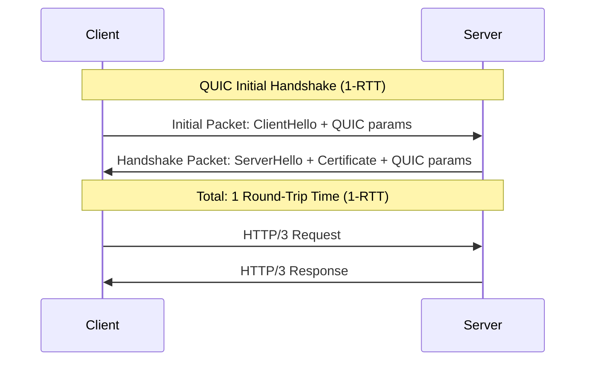
```mermaid
sequenceDiagram
    participant Client
    participant Server

    Note over Client,Server: QUIC Initial Handshake (1-RTT)
    Client->>Server: Initial Packet: ClientHello + QUIC params
    Server->>Client: Handshake Packet: ServerHello + Certificate + QUIC params

    Note over Client,Server: Total: 1 Round-Trip Time (1-RTT)

    Client->>Server: HTTP/3 Request
    Server->>Client: HTTP/3 Response
```

**Total Time:** 1 RTT before first HTTP request
**Example:** 150ms RTT = 150ms before first byte
**Improvement:** 50% faster than TLS 1.3, 67% faster than TLS 1.2

### QUIC 0-RTT Handshake (Resumed Connection)

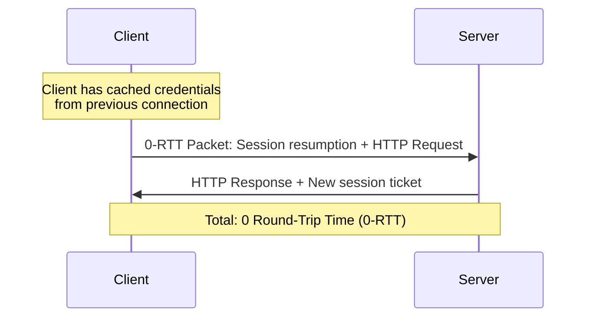
```mermaid
sequenceDiagram
    participant Client
    participant Server

    Note over Client: Client has cached credentials<br/>from previous connection

    Client->>Server: 0-RTT Packet: Session resumption + HTTP Request
    Server->>Client: HTTP Response + New session ticket

    Note over Client,Server: Total: 0 Round-Trip Time (0-RTT)
```

**Total Time:** 0 RTT - HTTP request sent immediately
**Example:** 0ms wait - data sent in first packet
**Improvement:** Instant connection resumption

## Problem 3: Connection Migration Issues with TCP

### TCP Connection Breaks on Network Change

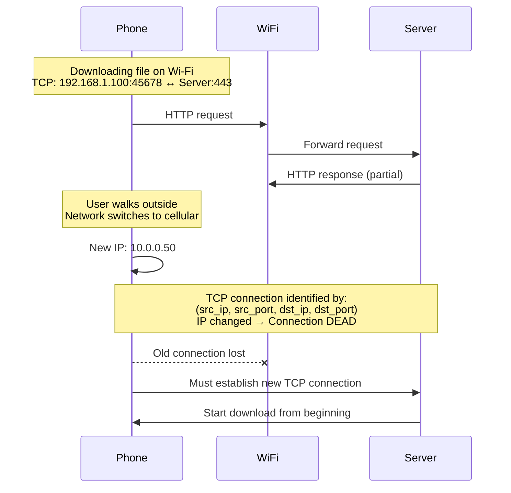
```mermaid
sequenceDiagram
    participant Phone
    participant WiFi
    participant Server

    Note over Phone: Downloading file on Wi-Fi<br/>TCP: 192.168.1.100:45678 ↔ Server:443

    Phone->>WiFi: HTTP request
    WiFi->>Server: Forward request
    Server->>WiFi: HTTP response (partial)

    Note over Phone: User walks outside<br/>Network switches to cellular

    Phone->>Phone: New IP: 10.0.0.50
    Note over Phone,Server: TCP connection identified by:<br/>(src_ip, src_port, dst_ip, dst_port)<br/>IP changed → Connection DEAD

    Phone--xWiFi: Old connection lost
    Phone->>Server: Must establish new TCP connection
    Server->>Phone: Start download from beginning
```

**Problem:** TCP connection = (IP, port) tuple. Network change = new connection = restart download.

### QUIC Connection Survives Network Changes

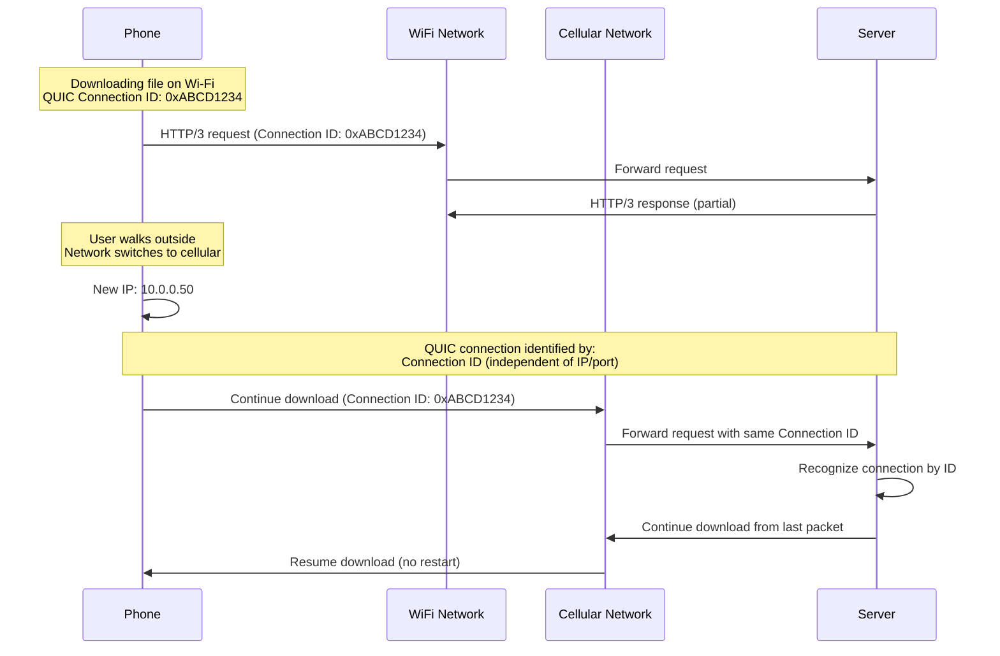
```mermaid
sequenceDiagram
    participant Phone
    participant WiFi as WiFi Network
    participant Cell as Cellular Network
    participant Server

    Note over Phone: Downloading file on Wi-Fi<br/>QUIC Connection ID: 0xABCD1234

    Phone->>WiFi: HTTP/3 request (Connection ID: 0xABCD1234)
    WiFi->>Server: Forward request
    Server->>WiFi: HTTP/3 response (partial)

    Note over Phone: User walks outside<br/>Network switches to cellular

    Phone->>Phone: New IP: 10.0.0.50
    Note over Phone,Server: QUIC connection identified by:<br/>Connection ID (independent of IP/port)

    Phone->>Cell: Continue download (Connection ID: 0xABCD1234)
    Cell->>Server: Forward request with same Connection ID
    Server->>Server: Recognize connection by ID
    Server->>Cell: Continue download from last packet
    Cell->>Phone: Resume download (no restart)
```

**Solution:** QUIC uses Connection ID independent of IP address/port. Connection survives network changes.

# QUIC Architecture

## QUIC Packet Structure

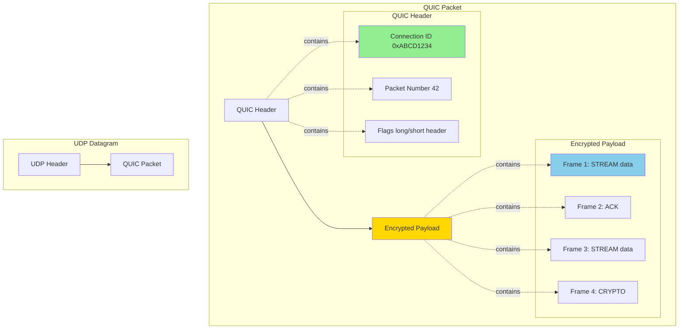
```mermaid
graph TB
    subgraph "QUIC Packet"
        P1[QUIC Header]
        P2[Encrypted Payload]

        subgraph "QUIC Header"
            H1[Connection ID 0xABCD1234]
            H2[Packet Number 42]
            H3[Flags long/short header]
        end

        subgraph "Encrypted Payload"
            F1[Frame 1: STREAM data]
            F2[Frame 2: ACK]
            F3[Frame 3: STREAM data]
            F4[Frame 4: CRYPTO]
        end

        P1 --> P2
        P1 -.contains.-> H1
        P1 -.contains.-> H2
        P1 -.contains.-> H3
        P2 -.contains.-> F1
        P2 -.contains.-> F2
        P2 -.contains.-> F3
        P2 -.contains.-> F4
    end

    subgraph "UDP Datagram"
        U1[UDP Header]
        U2[QUIC Packet]
        U1 --> U2
    end

    style H1 fill:#90EE90
    style F1 fill:#87CEEB
    style P2 fill:#FFD700
```

### QUIC Header Fields

**Long Header (initial handshake):**
```
0                   1                   2                   3
0 1 2 3 4 5 6 7 8 9 0 1 2 3 4 5 6 7 8 9 0 1 2 3 4 5 6 7 8 9 0 1
+-+-+-+-+-+-+-+-+
|1|1|T T|X X X X|
+-+-+-+-+-+-+-+-+-+-+-+-+-+-+-+-+-+-+-+-+-+-+-+-+-+-+-+-+-+-+-+-+
|                         Version (32)                          |
+-+-+-+-+-+-+-+-+-+-+-+-+-+-+-+-+-+-+-+-+-+-+-+-+-+-+-+-+-+-+-+-+
| DCID Len (8)  |
+-+-+-+-+-+-+-+-+-+-+-+-+-+-+-+-+-+-+-+-+-+-+-+-+-+-+-+-+-+-+-+-+
|               Destination Connection ID (0..160)            ...
+-+-+-+-+-+-+-+-+-+-+-+-+-+-+-+-+-+-+-+-+-+-+-+-+-+-+-+-+-+-+-+-+
| SCID Len (8)  |
+-+-+-+-+-+-+-+-+-+-+-+-+-+-+-+-+-+-+-+-+-+-+-+-+-+-+-+-+-+-+-+-+
|                 Source Connection ID (0..160)               ...
+-+-+-+-+-+-+-+-+-+-+-+-+-+-+-+-+-+-+-+-+-+-+-+-+-+-+-+-+-+-+-+-+
|                       Packet Number (...)                     |
+-+-+-+-+-+-+-+-+-+-+-+-+-+-+-+-+-+-+-+-+-+-+-+-+-+-+-+-+-+-+-+-+
```

**Short Header (data packets):**
```
0                   1                   2                   3
0 1 2 3 4 5 6 7 8 9 0 1 2 3 4 5 6 7 8 9 0 1 2 3 4 5 6 7 8 9 0 1
+-+-+-+-+-+-+-+-+
|0|1|S|R|R|K|P P|
+-+-+-+-+-+-+-+-+-+-+-+-+-+-+-+-+-+-+-+-+-+-+-+-+-+-+-+-+-+-+-+-+
|               Destination Connection ID (*)                 ...
+-+-+-+-+-+-+-+-+-+-+-+-+-+-+-+-+-+-+-+-+-+-+-+-+-+-+-+-+-+-+-+-+
|                       Packet Number (...)                     |
+-+-+-+-+-+-+-+-+-+-+-+-+-+-+-+-+-+-+-+-+-+-+-+-+-+-+-+-+-+-+-+-+
```

**Key Fields:**
- **Connection ID**: Identifies connection (survives IP changes)
- **Packet Number**: Monotonically increasing number for loss detection
- **Flags**: Packet type, key phase, spin bit

## QUIC Frames

QUIC packets contain multiple frames:

| Frame Type        | Purpose                                    | Example Use Case                       |
| ----------------- | ------------------------------------------ | -------------------------------------- |
| **STREAM**        | Carry application data                     | HTTP/3 request/response                |
| **ACK**           | Acknowledge received packets               | Confirm packet 1-10 received           |
| **CRYPTO**        | TLS handshake messages                     | Certificate exchange                   |
| **PADDING**       | Increase packet size                       | PMTU discovery                         |
| **PING**          | Keep connection alive                      | Prevent NAT timeout                    |
| **CONNECTION_CLOSE** | Terminate connection                    | Graceful shutdown                      |
| **MAX_DATA**      | Flow control (connection-level)            | Allow 1 MB total data                  |
| **MAX_STREAM_DATA** | Flow control (stream-level)              | Allow 100 KB on stream 4               |
| **NEW_CONNECTION_ID** | Provide new connection ID               | Connection migration preparation       |
| **PATH_CHALLENGE** | Validate new network path                 | Network change verification            |

# QUIC Connection Establishment

## 1-RTT Handshake (First Connection)

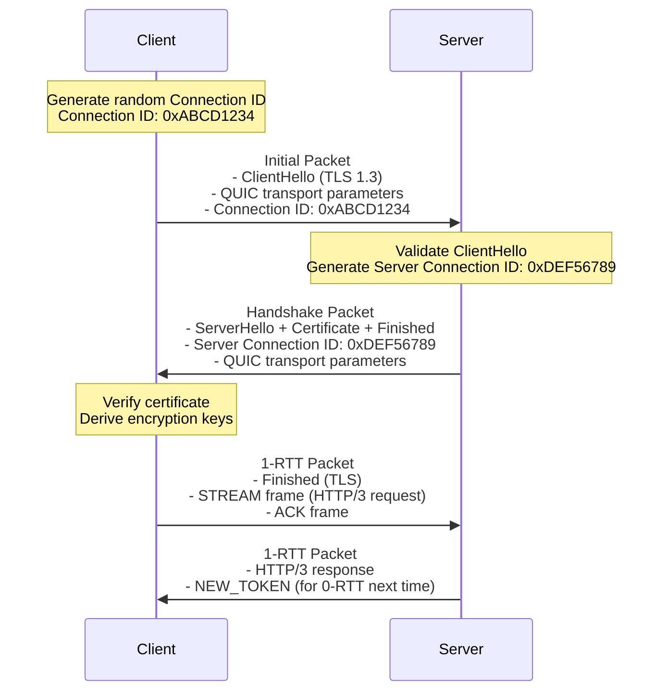
```mermaid
sequenceDiagram
    participant Client
    participant Server

    Note over Client: Generate random Connection ID<br/>Connection ID: 0xABCD1234

    Client->>Server: Initial Packet<br/>- ClientHello (TLS 1.3)<br/>- QUIC transport parameters<br/>- Connection ID: 0xABCD1234

    Note over Server: Validate ClientHello<br/>Generate Server Connection ID: 0xDEF56789

    Server->>Client: Handshake Packet<br/>- ServerHello + Certificate + Finished<br/>- Server Connection ID: 0xDEF56789<br/>- QUIC transport parameters

    Note over Client: Verify certificate<br/>Derive encryption keys

    Client->>Server: 1-RTT Packet<br/>- Finished (TLS)<br/>- STREAM frame (HTTP/3 request)<br/>- ACK frame

    Server->>Client: 1-RTT Packet<br/>- HTTP/3 response<br/>- NEW_TOKEN (for 0-RTT next time)
```

**Timeline:**
- **t=0ms**: Client sends Initial packet
- **t=150ms** (1 RTT): Server responds with Handshake
- **t=150ms**: Client immediately sends HTTP request (can pipeline)
- **t=300ms** (2 RTT): Client receives HTTP response

**Total:** 1-RTT for handshake, HTTP data can be sent immediately after.

## 0-RTT Handshake (Resumed Connection)

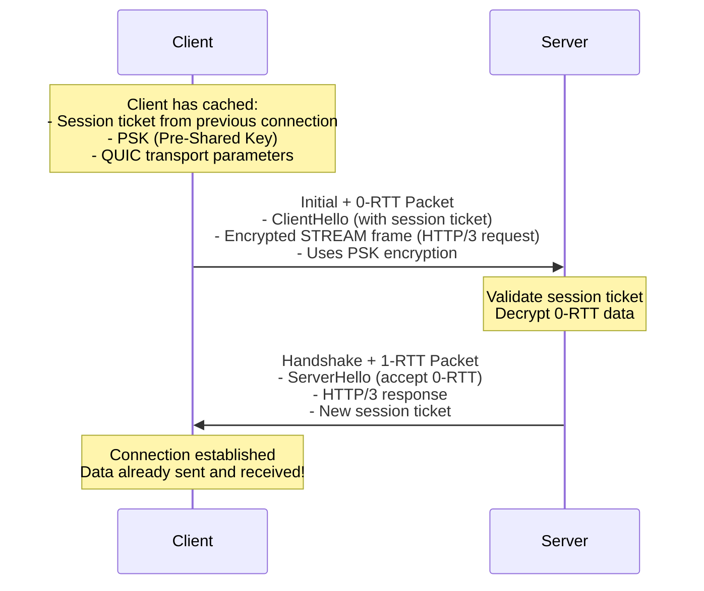
```mermaid
sequenceDiagram
    participant Client
    participant Server

    Note over Client: Client has cached:<br/>- Session ticket from previous connection<br/>- PSK (Pre-Shared Key)<br/>- QUIC transport parameters

    Client->>Server: Initial + 0-RTT Packet<br/>- ClientHello (with session ticket)<br/>- Encrypted STREAM frame (HTTP/3 request)<br/>- Uses PSK encryption

    Note over Server: Validate session ticket<br/>Decrypt 0-RTT data

    Server->>Client: Handshake + 1-RTT Packet<br/>- ServerHello (accept 0-RTT)<br/>- HTTP/3 response<br/>- New session ticket

    Note over Client: Connection established<br/>Data already sent and received!
```

**Timeline:**
- **t=0ms**: Client sends Initial + 0-RTT packet with HTTP request
- **t=150ms** (1 RTT): Server responds with HTTP response
- **Total:** 0-RTT - no wait time for handshake

**0-RTT Security Consideration:**
- 0-RTT data is NOT forward-secret
- 0-RTT data can be replayed (idempotency required)
- Safe for GET requests, unsafe for POST/PUT/DELETE

# QUIC Stream Multiplexing

## Stream Types

QUIC supports multiple independent bidirectional streams:

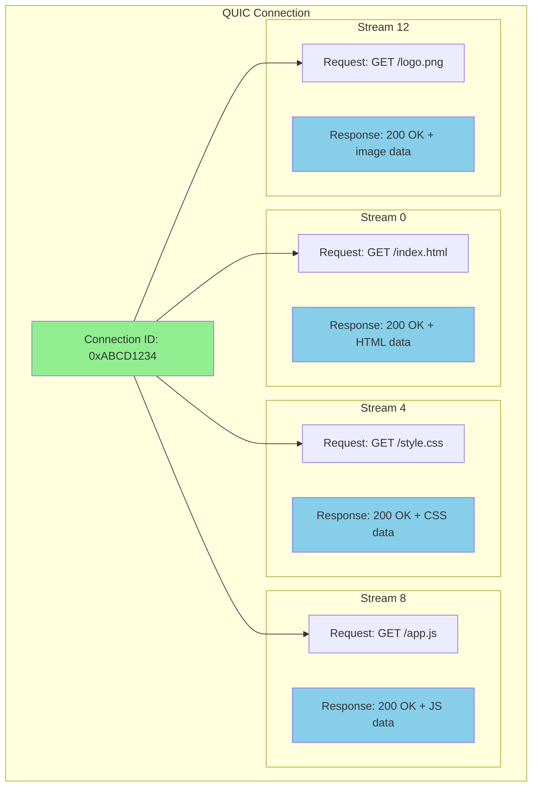
```mermaid
graph TB
    subgraph "QUIC Connection"
        C[Connection ID: 0xABCD1234]

        subgraph "Stream 0"
            S0_1[Request: GET /index.html]
            S0_2[Response: 200 OK + HTML data]
        end

        subgraph "Stream 4"
            S1_1[Request: GET /style.css]
            S1_2[Response: 200 OK + CSS data]
        end

        subgraph "Stream 8"
            S2_1[Request: GET /app.js]
            S2_2[Response: 200 OK + JS data]
        end

        subgraph "Stream 12"
            S3_1[Request: GET /logo.png]
            S3_2[Response: 200 OK + image data]
        end

        C --> S0_1
        C --> S1_1
        C --> S2_1
        C --> S3_1
    end

    style C fill:#90EE90
    style S0_2 fill:#87CEEB
    style S1_2 fill:#87CEEB
    style S2_2 fill:#87CEEB
    style S3_2 fill:#87CEEB
```

**Stream ID Encoding:**
- Client-initiated bidirectional: 0, 4, 8, 12, ... (4n)
- Server-initiated bidirectional: 1, 5, 9, 13, ... (4n+1)
- Client-initiated unidirectional: 2, 6, 10, 14, ... (4n+2)
- Server-initiated unidirectional: 3, 7, 11, 15, ... (4n+3)

## Stream Independence - No Head-of-Line Blocking

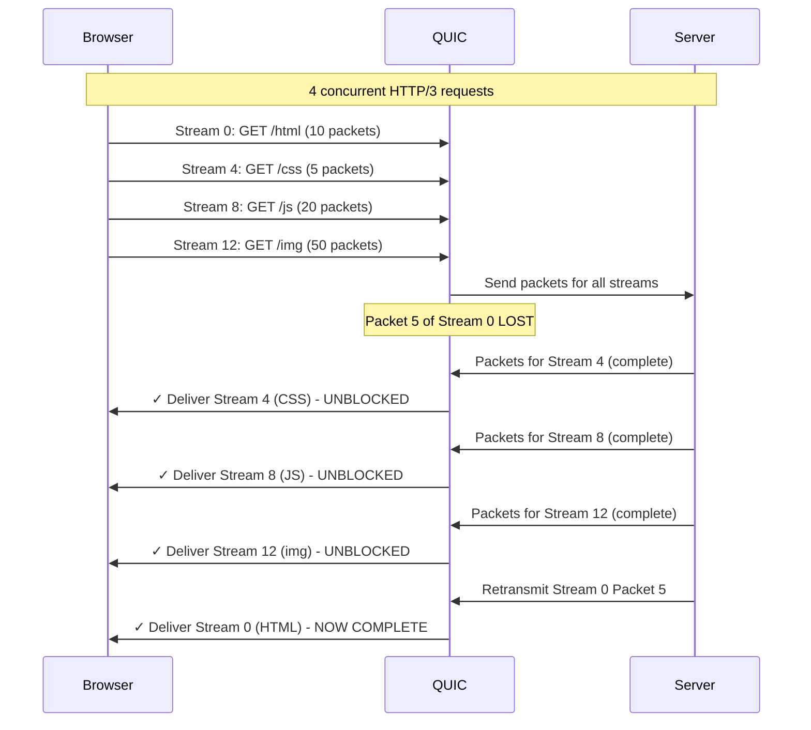
```mermaid
sequenceDiagram
    participant Browser
    participant QUIC
    participant Server

    Note over Browser,Server: 4 concurrent HTTP/3 requests

    Browser->>QUIC: Stream 0: GET /html (10 packets)
    Browser->>QUIC: Stream 4: GET /css (5 packets)
    Browser->>QUIC: Stream 8: GET /js (20 packets)
    Browser->>QUIC: Stream 12: GET /img (50 packets)

    QUIC->>Server: Send packets for all streams

    Note over QUIC: Packet 5 of Stream 0 LOST

    Server->>QUIC: Packets for Stream 4 (complete)
    QUIC->>Browser: ✓ Deliver Stream 4 (CSS) - UNBLOCKED

    Server->>QUIC: Packets for Stream 8 (complete)
    QUIC->>Browser: ✓ Deliver Stream 8 (JS) - UNBLOCKED

    Server->>QUIC: Packets for Stream 12 (complete)
    QUIC->>Browser: ✓ Deliver Stream 12 (img) - UNBLOCKED

    Server->>QUIC: Retransmit Stream 0 Packet 5
    QUIC->>Browser: ✓ Deliver Stream 0 (HTML) - NOW COMPLETE
```

**Key Benefit:** Lost packets only affect their own stream. Other streams continue unaffected.

# QUIC Security - Built-in TLS 1.3

## Encryption by Default

QUIC integrates TLS 1.3 into the protocol:

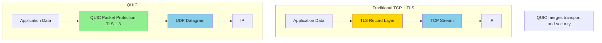
```mermaid
graph TB
    subgraph "Traditional TCP + TLS"
        T1[Application Data]
        T2[TLS Record Layer]
        T3[TCP Stream]
        T4[IP]

        T1 --> T2
        T2 --> T3
        T3 --> T4

        style T2 fill:#FFD700
        style T3 fill:#87CEEB
    end

    subgraph "QUIC"
        Q1[Application Data]
        Q2[QUIC Packet Protection TLS 1.3]
        Q3[UDP Datagram]
        Q4[IP]

        Q1 --> Q2
        Q2 --> Q3
        Q3 --> Q4

        style Q2 fill:#90EE90
        style Q3 fill:#87CEEB
    end

    Note[QUIC merges transport and security]
```

**Key Differences:**
1. **TLS integrated**: TLS messages sent as QUIC CRYPTO frames
2. **Packet-level encryption**: Each QUIC packet encrypted independently
3. **Connection ID encrypted**: Prevents connection tracking
4. **Mandatory encryption**: No plaintext mode exists

## Encryption Levels

QUIC uses different encryption keys for different stages:

| Encryption Level | Used For                        | Key Derivation                   |
| ---------------- | ------------------------------- | -------------------------------- |
| **Initial**      | First ClientHello/ServerHello   | Derived from Connection ID       |
| **0-RTT**        | Early data (resumed connections) | Pre-shared key from session ticket |
| **Handshake**    | TLS handshake messages          | TLS handshake traffic keys       |
| **1-RTT**        | Application data                | TLS application traffic keys     |

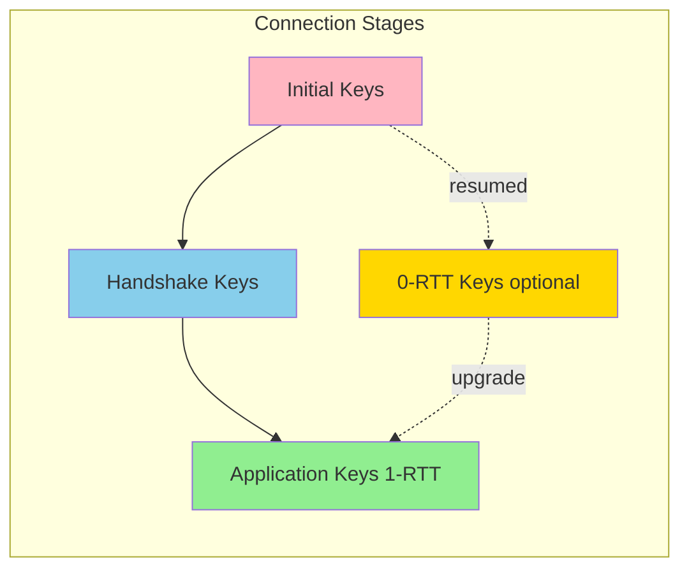
```mermaid
graph LR
    subgraph "Connection Stages"
        I[Initial Keys]
        H[Handshake Keys]
        A[Application Keys 1-RTT]
        Z[0-RTT Keys optional]

        I --> H
        H --> A
        I -.resumed.-> Z
        Z -.upgrade.-> A
    end

    style I fill:#FFB6C1
    style Z fill:#FFD700
    style H fill:#87CEEB
    style A fill:#90EE90
```

## Header Protection

QUIC encrypts packet headers to prevent ossification and tracking:

```
Unprotected Packet:
┌─────────────────────────────────────────┐
│ Header (readable)                       │
│ - Connection ID: 0xABCD1234             │
│ - Packet Number: 42                     │
│ - Flags                                 │
├─────────────────────────────────────────┤
│ Payload (encrypted)                     │
└─────────────────────────────────────────┘

Protected Packet (sent over network):
┌─────────────────────────────────────────┐
│ Header (partially encrypted)            │
│ - Connection ID: 0xABCD1234 (readable)  │
│ - Packet Number: ??? (encrypted)        │
│ - Flags: ??? (encrypted)                │
├─────────────────────────────────────────┤
│ Payload (encrypted)                     │
└─────────────────────────────────────────┘
```

**Protected Fields:**
- Packet number
- Key phase bit
- Parts of the first byte (flags)

**Unprotected Fields:**
- Connection ID (needed for routing)
- Version
- Packet type

# QUIC Reliability and Congestion Control

## Loss Detection and Recovery

QUIC uses ACK frames for reliable delivery:

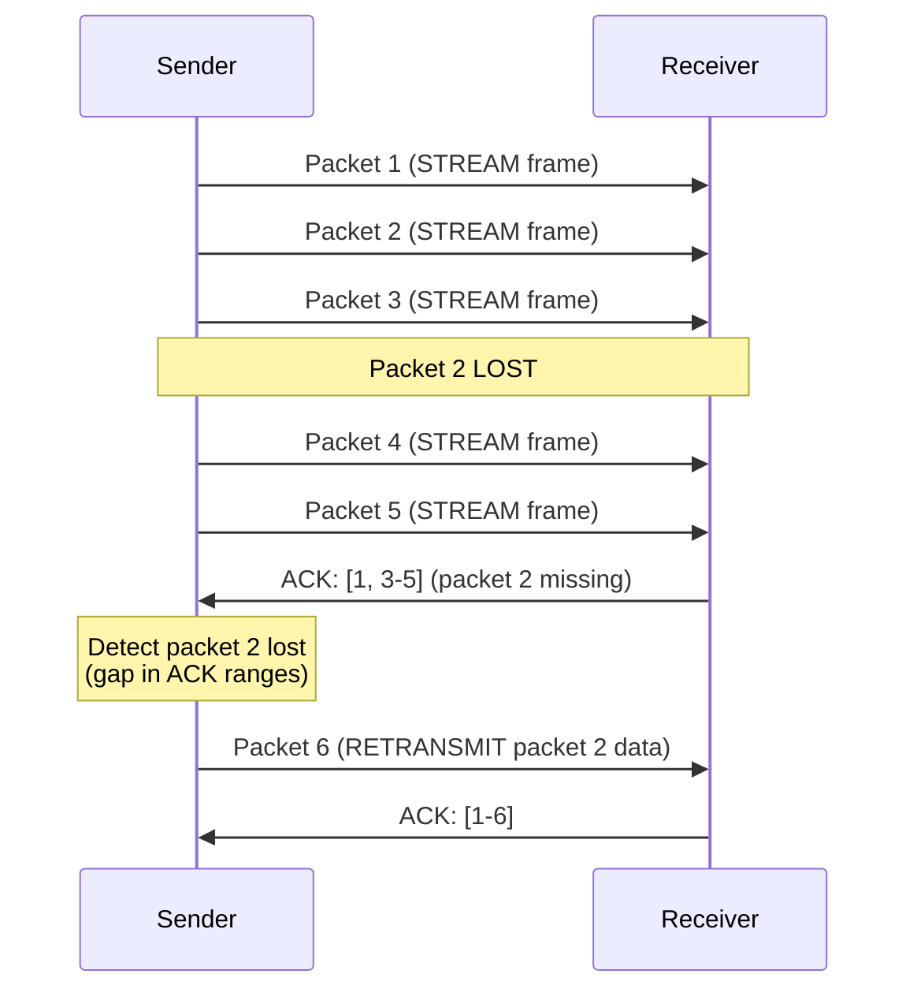
```mermaid
sequenceDiagram
    participant Sender
    participant Receiver

    Sender->>Receiver: Packet 1 (STREAM frame)
    Sender->>Receiver: Packet 2 (STREAM frame)
    Sender->>Receiver: Packet 3 (STREAM frame)
    Note over Sender,Receiver: Packet 2 LOST

    Sender->>Receiver: Packet 4 (STREAM frame)
    Sender->>Receiver: Packet 5 (STREAM frame)

    Receiver->>Sender: ACK: [1, 3-5] (packet 2 missing)

    Note over Sender: Detect packet 2 lost<br/>(gap in ACK ranges)

    Sender->>Receiver: Packet 6 (RETRANSMIT packet 2 data)

    Receiver->>Sender: ACK: [1-6]
```

### ACK Frame Format

```
ACK Frame:
- Largest Acknowledged: 5
- ACK Delay: 12ms
- ACK Ranges:
  - [1-1]   (packet 1)
  - [3-5]   (packets 3, 4, 5)
- Implicitly: Packet 2 is missing
```

**QUIC vs TCP ACK:**
- **TCP**: Cumulative ACK (e.g., "received up to byte 1000")
- **QUIC**: Range-based ACK (e.g., "received packets 1, 3-5, 7-10")
- **Benefit**: QUIC can ACK out-of-order packets more efficiently

## Congestion Control Algorithms

QUIC supports pluggable congestion control:

| Algorithm     | Description                                | Best For                        |
| ------------- | ------------------------------------------ | ------------------------------- |
| **NewReno**   | Classic TCP-style congestion control       | General purpose                 |
| **CUBIC**     | High bandwidth, high latency networks      | Long-distance connections       |
| **BBR**       | Bottleneck Bandwidth and RTT estimation    | Modern networks, mobile         |

### Congestion Window Example

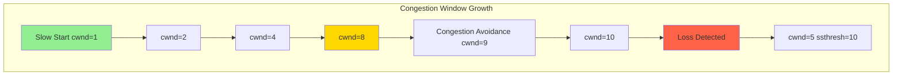
```mermaid
graph TB
    subgraph "Congestion Window Growth"
        C1[Slow Start cwnd=1]
        C2[cwnd=2]
        C3[cwnd=4]
        C4[cwnd=8]
        C5[Congestion Avoidance cwnd=9]
        C6[cwnd=10]
        C7[Loss Detected]
        C8[cwnd=5 ssthresh=10]

        C1 --> C2 --> C3 --> C4 --> C5 --> C6 --> C7 --> C8
    end

    style C1 fill:#90EE90
    style C4 fill:#FFD700
    style C7 fill:#FF6347
```

**Congestion Control Flow:**
1. **Slow Start**: Exponential growth (cwnd doubles each RTT)
2. **Congestion Avoidance**: Linear growth (cwnd += 1 per RTT)
3. **Loss Detected**: Reduce cwnd (e.g., cwnd = cwnd / 2)
4. **Recovery**: Return to congestion avoidance

# Connection Migration

QUIC connections survive network changes:

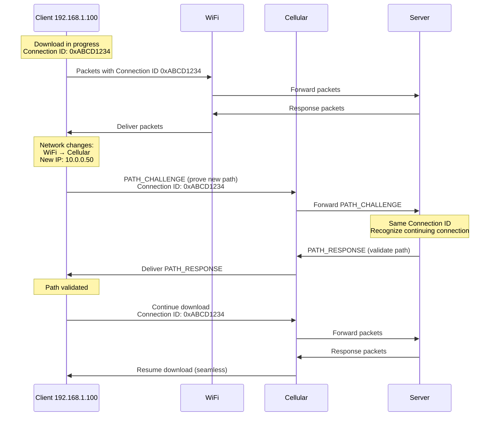
```mermaid
sequenceDiagram
    participant Client as Client 192.168.1.100
    participant WiFi
    participant Cellular
    participant Server

    Note over Client: Download in progress<br/>Connection ID: 0xABCD1234

    Client->>WiFi: Packets with Connection ID 0xABCD1234
    WiFi->>Server: Forward packets
    Server->>WiFi: Response packets
    WiFi->>Client: Deliver packets

    Note over Client: Network changes:<br/>WiFi → Cellular<br/>New IP: 10.0.0.50

    Client->>Cellular: PATH_CHALLENGE (prove new path)<br/>Connection ID: 0xABCD1234
    Cellular->>Server: Forward PATH_CHALLENGE

    Note over Server: Same Connection ID<br/>Recognize continuing connection

    Server->>Cellular: PATH_RESPONSE (validate path)
    Cellular->>Client: Deliver PATH_RESPONSE

    Note over Client: Path validated

    Client->>Cellular: Continue download<br/>Connection ID: 0xABCD1234
    Cellular->>Server: Forward packets
    Server->>Cellular: Response packets
    Cellular->>Client: Resume download (seamless)
```

**Connection Migration Process:**
1. **Network Change Detected**: Client gets new IP address
2. **PATH_CHALLENGE**: Client sends probe on new path with same Connection ID
3. **PATH_RESPONSE**: Server validates new path
4. **Migration Complete**: Traffic continues on new path without interruption

**Real-World Example:**
- User watching YouTube on phone while on home Wi-Fi
- User walks outside, phone switches to cellular network
- **With TCP**: Video stops, reconnects, buffers from beginning
- **With QUIC**: Video continues seamlessly without interruption

# HTTP/3 and QUIC Integration

## HTTP/3 Protocol Stack

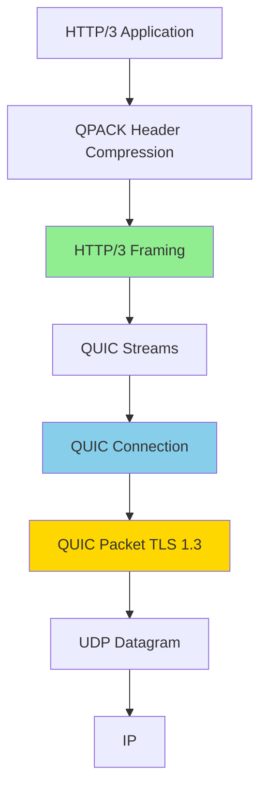
```mermaid
graph TB
    A[HTTP/3 Application]
    B[QPACK Header Compression]
    C[HTTP/3 Framing]
    D[QUIC Streams]
    E[QUIC Connection]
    F[QUIC Packet TLS 1.3]
    G[UDP Datagram]
    H[IP]

    A --> B --> C --> D --> E --> F --> G --> H

    style C fill:#90EE90
    style E fill:#87CEEB
    style F fill:#FFD700
```

## HTTP/3 Stream Types

HTTP/3 uses different QUIC streams for different purposes:

```mermaid
graph TB
    subgraph "HTTP/3 over QUIC Streams"
        C[QUIC Connection]

        S0[Control Stream unidirectional<br/>Settings, priorities]
        S1[Request Stream bidirectional<br/>Request + Response]
        S2[Request Stream bidirectional<br/>Request + Response]
        S3[Push Stream unidirectional<br/>Server push]
        S4[QPACK Encoder Stream unidirectional<br/>Dynamic table updates]
        S5[QPACK Decoder Stream unidirectional<br/>Header acknowledgments]

        C --> S0
        C --> S1
        C --> S2
        C --> S3
        C --> S4
        C --> S5
    end

    style C fill:#90EE90
    style S1 fill:#87CEEB
    style S2 fill:#87CEEB
```

### Stream Usage

**Control Stream (unidirectional):**
```
Client → Server:
SETTINGS frame:
- MAX_FIELD_SECTION_SIZE: 16384
- QPACK_MAX_TABLE_CAPACITY: 4096
```

**Request Stream (bidirectional):**
```
Client → Server (Stream 0):
HEADERS frame:
:method = GET
:scheme = https
:authority = example.com
:path = /index.html
accept = text/html

Server → Client (Stream 0):
HEADERS frame:
:status = 200
content-type = text/html
content-length = 1234

DATA frame:
<!DOCTYPE html>
<html>...
```

## QPACK Header Compression

HTTP/3 uses QPACK instead of HPACK (HTTP/2):

**Why not HPACK?**
- HPACK has head-of-line blocking: blocked stream blocks header table updates
- QPACK: Decouples header compression from request streams

```mermaid
sequenceDiagram
    participant Client
    participant Encoder as QPACK Encoder Stream
    participant Request as Request Stream
    participant Decoder as QPACK Decoder Stream
    participant Server

    Note over Client: Want to send request with<br/>new header: x-custom = value

    Client->>Encoder: Dynamic table insert:<br/>x-custom = value
    Client->>Request: HEADERS (reference to dynamic table)

    Encoder->>Server: Insert x-custom = value

    Request->>Server: HEADERS (wait for dynamic table update)

    Note over Server: Dynamic table updated

    Server->>Decoder: ACK dynamic table insert
    Server->>Client: HEADERS response

    Decoder->>Client: Confirm table synchronized
```

**Key QPACK Features:**
1. **Dynamic Table**: Shared between encoder and decoder streams
2. **Static Table**: Predefined common headers
3. **Blocked Streams**: Requests can wait for dynamic table updates
4. **Acknowledgments**: Decoder stream confirms table updates

# Real-World QUIC Usage

## Major Deployments

**Google Services (2013-present):**
- Gmail, YouTube, Google Search
- ~30% of Google traffic uses QUIC
- Later evolved into IETF QUIC standard

**Facebook/Meta (2020-present):**
- 75% of Facebook traffic uses HTTP/3/QUIC
- Significant improvement in mobile app performance

**Cloudflare (2019-present):**
- HTTP/3 enabled for all customers
- Reports 30% faster page loads on lossy networks

**CDN Providers:**
- Fastly, Akamai, AWS CloudFront support HTTP/3

## Browser Support (2024)

| Browser          | HTTP/3 Support | Default | Notes                      |
| ---------------- | -------------- | ------- | -------------------------- |
| Chrome 87+       | ✅              | ✅       | Since 2020                 |
| Edge 87+         | ✅              | ✅       | Chromium-based             |
| Firefox 88+      | ✅              | ✅       | Since 2021                 |
| Safari 14+       | ✅              | ✅       | iOS 14+, macOS Big Sur+    |
| Opera 73+        | ✅              | ✅       | Chromium-based             |

**Check HTTP/3 support:**
```bash
curl -I --http3 https://cloudflare.com

HTTP/3 200
alt-svc: h3=":443"; ma=86400
```

## Performance Improvements

**Real-World Measurements:**

**Mobile Networks (high latency, packet loss):**
- **Page Load Time**: 30-40% faster with QUIC
- **Video Startup Time**: 50% faster
- **Rebuffering**: 30% reduction

**Example: YouTube on 3G Network**
```
HTTP/2 over TCP:
- Connection: 450ms (3 RTT)
- Video start: 1200ms
- Rebuffer events: 3

HTTP/3 over QUIC:
- Connection: 150ms (1 RTT, or 0 RTT if resumed)
- Video start: 600ms
- Rebuffer events: 1
```

**Desktop/WiFi Networks (low latency, low loss):**
- **Page Load Time**: 5-10% faster with QUIC
- **Connection Resumption**: 100% faster (0-RTT)

# QUIC vs TCP Comparison

| Feature                    | TCP + TLS 1.3                   | QUIC                                  |
| -------------------------- | ------------------------------- | ------------------------------------- |
| **Handshake Time**         | 2-RTT (first time)              | 1-RTT (first), 0-RTT (resumed)        |
| **Head-of-Line Blocking**  | ✅ Blocks all HTTP/2 streams     | ❌ Independent streams                 |
| **Connection Migration**   | ❌ Breaks on IP change           | ✅ Survives network changes            |
| **Encryption**             | Optional (TLS layered)          | ✅ Mandatory (TLS 1.3 integrated)      |
| **Stream Multiplexing**    | ❌ Single byte stream            | ✅ Multiple independent streams        |
| **Congestion Control**     | Fixed in kernel                 | ✅ Pluggable, application-space        |
| **Packet Loss Detection**  | Cumulative ACK                  | ✅ Range-based ACK                     |
| **NAT Binding**            | Timeout issues                  | ✅ PING frames keep alive              |
| **Ossification Resistance** | ❌ Middleboxes interfere         | ✅ Encrypted headers                   |
| **Deployment**             | Kernel update required          | ✅ Userspace implementation            |

## When to Use QUIC vs TCP

**Use QUIC When:**
- Building web applications (HTTP/3)
- Mobile applications (frequent network changes)
- Video streaming (low latency, loss recovery)
- Gaming (real-time data, connection migration)
- API services (0-RTT for fast repeated requests)

**Stick with TCP When:**
- Legacy systems without QUIC support
- Bandwidth-constrained environments (QUIC has ~3-5% overhead)
- Firewall restrictions block UDP traffic
- Simple file transfers without multiplexing needs

# Wireshark Packet Analysis

## Capturing QUIC Traffic

```bash
# Capture QUIC traffic (UDP port 443)
tshark -i eth0 -f "udp port 443" -w quic-capture.pcap

# Decrypt QUIC in Wireshark
# Edit → Preferences → Protocols → TLS
# (Pre)-Master-Secret log filename: /path/to/sslkeylog.txt

# Export SSLKEYLOG environment variable before running browser
export SSLKEYLOGFILE=/tmp/sslkeylog.txt
chromium --user-data-dir=/tmp/chrome-quic
```

## Sample QUIC Packet Dissection

```
Frame 42: 1252 bytes on wire
Internet Protocol Version 4
User Datagram Protocol, Src Port: 443, Dst Port: 54321

QUIC
  Long Header
    ├─ Header Form: Long Header (1)
    ├─ Fixed Bit: True
    ├─ Packet Type: Initial (0)
    ├─ Version: 1 (0x00000001)
    ├─ DCID Length: 8
    ├─ Destination Connection ID: 0xabcdef1234567890
    ├─ SCID Length: 8
    ├─ Source Connection ID: 0x1122334455667788
    ├─ Token Length: 0
    ├─ Packet Number: 0
    └─ Payload (encrypted): 1200 bytes

  Decrypted Payload
    ├─ CRYPTO Frame
    │   ├─ Type: 0x06
    │   ├─ Offset: 0
    │   ├─ Length: 512
    │   └─ Crypto Data: [TLS ClientHello]
    │       ├─ Handshake Type: Client Hello (1)
    │       ├─ Version: TLS 1.3
    │       ├─ Cipher Suites: TLS_AES_128_GCM_SHA256
    │       └─ Extensions:
    │           ├─ server_name: example.com
    │           ├─ supported_versions: TLS 1.3
    │           └─ quic_transport_parameters
    │               ├─ max_idle_timeout: 30000ms
    │               ├─ initial_max_data: 1048576
    │               ├─ initial_max_stream_data_bidi: 262144
    │               └─ initial_max_streams_bidi: 100
    └─ PADDING Frame (fill to 1200 bytes)
```

## QUIC Display Filters in Wireshark

```
# Show only QUIC packets
quic

# Show Initial packets (connection establishment)
quic.long.packet_type == 0

# Show 0-RTT packets
quic.long.packet_type == 1

# Show Handshake packets
quic.long.packet_type == 2

# Show STREAM frames
quic.frame_type == 0x08

# Show ACK frames
quic.frame_type == 0x02

# Show specific connection
quic.dcid == ab:cd:ef:12:34:56:78:90

# Show retransmissions
quic.stream.retransmission
```

# Implementation and Libraries

## Server-Side Implementations

**Popular QUIC Libraries:**

**1. quiche (Rust - Cloudflare)**
```bash
# Install quiche
cargo add quiche
```

```rust
use quiche;

// Create QUIC config
let mut config = quiche::Config::new(quiche::PROTOCOL_VERSION).unwrap();
config.set_application_protos(&[b"h3"]).unwrap();
config.set_max_idle_timeout(30_000);
config.set_max_recv_udp_payload_size(1200);
config.set_initial_max_data(10_000_000);
config.set_initial_max_stream_data_bidi_local(1_000_000);
config.set_initial_max_streams_bidi(100);

// TLS certificate and key
config.load_cert_chain_from_pem_file("cert.pem").unwrap();
config.load_priv_key_from_pem_file("key.pem").unwrap();

// Create connection
let conn = quiche::accept(&scid, None, local_addr, peer_addr, &mut config).unwrap();
```

**2. quinn (Rust - Tokio)**
```rust
use quinn::{Endpoint, ServerConfig};

#[tokio::main]
async fn main() {
    let cert = rcgen::generate_simple_self_signed(vec!["localhost".into()]).unwrap();
    let key = rustls::PrivateKey(cert.serialize_private_key_der());
    let cert = rustls::Certificate(cert.serialize_der().unwrap());

    let server_config = ServerConfig::with_single_cert(vec![cert], key).unwrap();

    let endpoint = Endpoint::server(server_config, "[::]:4433".parse().unwrap()).unwrap();

    while let Some(conn) = endpoint.accept().await {
        let connection = conn.await.unwrap();
        println!("New connection from {}", connection.remote_address());

        // Handle streams
        tokio::spawn(async move {
            loop {
                let stream = connection.accept_bi().await;
                // Handle bidirectional stream
            }
        });
    }
}
```

**3. msquic (C - Microsoft)**
```c
#include <msquic.h>

const QUIC_API_TABLE* MsQuic;
HQUIC Registration;
HQUIC Configuration;

// Initialize
MsQuicOpen2(&MsQuic);
MsQuic->RegistrationOpen(&RegConfig, &Registration);

// Create configuration
MsQuic->ConfigurationOpen(Registration, &Alpn, 1, &Settings, sizeof(Settings), NULL, &Configuration);

// Load certificate
MsQuic->ConfigurationLoadCredential(Configuration, &CredConfig);

// Create listener
HQUIC Listener;
MsQuic->ListenerOpen(Registration, ListenerCallback, NULL, &Listener);
MsQuic->ListenerStart(Listener, &Address, 1, NULL);
```

## Client-Side Implementation

**Python with aioquic:**
```python
import asyncio
from aioquic.asyncio import connect
from aioquic.quic.configuration import QuicConfiguration

async def main():
    configuration = QuicConfiguration(
        alpn_protocols=["h3"],
        is_client=True
    )

    async with connect(
        "example.com",
        443,
        configuration=configuration
    ) as client:
        # Send HTTP/3 request
        stream_id = client._quic.get_next_available_stream_id()

        # Send HEADERS
        headers = [
            (b":method", b"GET"),
            (b":scheme", b"https"),
            (b":authority", b"example.com"),
            (b":path", b"/"),
        ]

        client._http.send_headers(stream_id, headers)

        # Receive response
        for event in await client.wait_for_data(stream_id):
            if isinstance(event, HeadersReceived):
                print("Headers:", event.headers)
            if isinstance(event, DataReceived):
                print("Body:", event.data)

asyncio.run(main())
```

**Node.js with node-quic:**
```javascript
const { createQuicSocket } = require('net')

const server = createQuicSocket({ endpoint: { port: 4433 } })

server.listen({
  key: readFileSync('key.pem'),
  cert: readFileSync('cert.pem'),
  alpn: 'h3'
})

server.on('session', (session) => {
  console.log('New QUIC session')

  session.on('stream', (stream) => {
    console.log('New stream')

    stream.on('data', (data) => {
      console.log('Received:', data.toString())
      stream.write('HTTP/3 response')
      stream.end()
    })
  })
})
```

# Troubleshooting and Debugging

## Common QUIC Issues

### 1. UDP Port Blocked
**Symptom:** Connection falls back to HTTP/2 over TCP

**Debug:**
```bash
# Test UDP port 443
nc -u example.com 443
echo "test" | nc -u example.com 443

# Check firewall rules
sudo iptables -L -n | grep 443
sudo ufw status
```

**Solution:**
```bash
# Allow UDP port 443
sudo ufw allow 443/udp
sudo iptables -A INPUT -p udp --dport 443 -j ACCEPT
```

### 2. Large Packets Fragmented
**Symptom:** Slow connection, packet loss

**Debug:**
```bash
# Check MTU
ip link show | grep mtu

# Test PMTU
ping -M do -s 1472 example.com  # 1500 - 28 (IP+UDP headers)
```

**Solution:**
```rust
// Reduce max UDP payload size
config.set_max_recv_udp_payload_size(1200);  // Safe default
```

### 3. 0-RTT Replay Attack
**Symptom:** Security concern with 0-RTT data

**Solution:**
```javascript
// Only use 0-RTT for idempotent operations
if (request.method === 'GET' || request.method === 'HEAD') {
  // Safe for 0-RTT
  client.send_0rtt_data(request)
} else {
  // POST/PUT/DELETE: Wait for 1-RTT
  await client.wait_1rtt()
  client.send_data(request)
}
```

### 4. Connection ID Collision
**Symptom:** Connection confusion, packet misdelivery

**Solution:**
```rust
// Use cryptographically random Connection IDs
use rand::Rng;

let mut rng = rand::thread_rng();
let mut scid = [0u8; 16];
rng.fill(&mut scid);
```

## Performance Tuning

**Server Configuration:**
```rust
// Optimize for high-throughput server
let mut config = quiche::Config::new(quiche::PROTOCOL_VERSION).unwrap();

// Increase buffer sizes
config.set_initial_max_data(10_000_000);           // 10 MB connection window
config.set_initial_max_stream_data_bidi_local(1_000_000);  // 1 MB per stream
config.set_initial_max_streams_bidi(1000);          // 1000 concurrent streams

// Tune congestion control
config.set_cc_algorithm(quiche::CongestionControlAlgorithm::BBR);

// Enable early data
config.enable_early_data();

// Disable migration if not needed
config.set_disable_active_migration(true);
```

**Client Configuration:**
```rust
// Optimize for mobile client
let mut config = quiche::Config::new(quiche::PROTOCOL_VERSION).unwrap();

// Keep-alive for NAT traversal
config.set_max_idle_timeout(30_000);  // 30 seconds

// Enable connection migration
config.set_disable_active_migration(false);

// Smaller buffers for mobile
config.set_initial_max_data(1_000_000);  // 1 MB
```

---

# References
1. RFC 9000: QUIC: A UDP-Based Multiplexed and Secure Transport - https://www.rfc-editor.org/rfc/rfc9000.html
2. RFC 9001: Using TLS to Secure QUIC - https://www.rfc-editor.org/rfc/rfc9001.html
3. RFC 9002: QUIC Loss Detection and Congestion Control - https://www.rfc-editor.org/rfc/rfc9002.html
4. RFC 9114: HTTP/3 - https://www.rfc-editor.org/rfc/rfc9114.html
5. RFC 9204: QPACK: Field Compression for HTTP/3 - https://www.rfc-editor.org/rfc/rfc9204.html
6. Computer Networking: A Top-Down Approach, Global Edition, 8th Edition - James F. Kurose, Keith W. Ross - Chapter 3: Transport Layer
7. Cloudflare QUIC Blog - https://blog.cloudflare.com/http-3-quic/
8. Google QUIC Documentation - https://www.chromium.org/quic/
9. quiche (Cloudflare QUIC implementation) - https://github.com/cloudflare/quiche
10. quinn (Rust QUIC implementation) - https://github.com/quinn-rs/quinn
11. HTTP/3 Explained - Daniel Stenberg - https://http3-explained.haxx.se/
12. [[HTTP Version#HTTP 3]] for HTTP/3 integration
13. [[computer-network/transport-layer/tcp/Transmission Control Protocol (TCP)]] for TCP comparison
14. [[User Datagram Protocol (UDP)]] for UDP fundamentals
