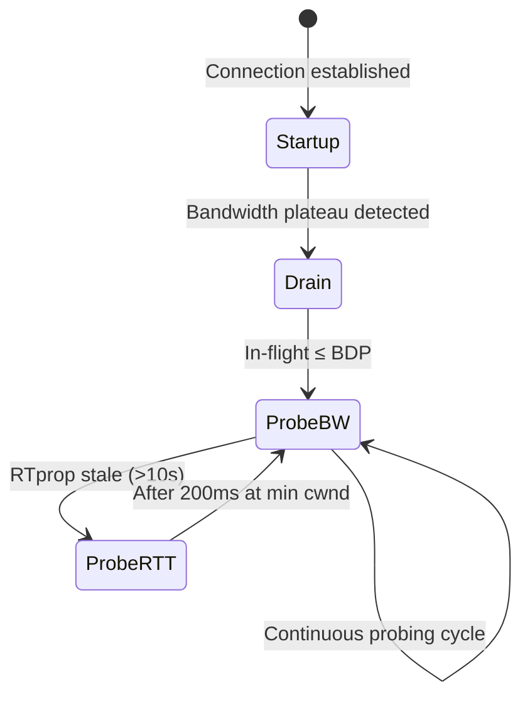

#tcp #computer-network #transport-layer #congestion-control #protocol #delay-based #model-based
# Overview
- TCP BBR (Bottleneck Bandwidth and Round-trip propagation time) is a ==modern congestion control algorithm==.
- Developed by Google in $2016$.
- Uses ==explicit model== of network path rather than implicit signals.
- Achieves ==high throughput with low latency==.
- Part of [TCP Congestion Control](TCP%20Congestion%20Control.md).
- Addresses limitations of [TCP Cubic](TCP%20Cubic.md) and [TCP Vegas](TCP%20Vegas.md).
# Motivation
## Bufferbloat Problem
### Definition
- Modern networks have ==excessive buffering== in routers and switches.
- Buffer sizes often set to bandwidth-delay product or larger.
- Causes ==high latency== even without packet loss.
### Impact
- Loss-based algorithms ([TCP Reno](TCP%20Reno.md), [TCP Cubic](TCP%20Cubic.md)) fill buffers before detecting congestion.
- Queue lengths reach hundreds of milliseconds.
- Interactive applications suffer from high latency.
- Video streaming experiences quality degradation.
## Existing Algorithm Limitations
### Loss-Based Algorithms
- Maintain large standing queues.
- React to congestion after it occurs.
- Throughput-latency trade-off.
### TCP Vegas
- Better latency than loss-based.
- Poor fairness with loss-based flows.
- Limited deployment due to competition issues.
## BBR Goals
1. Achieve ==Kleinrock's optimal operating point==:
	- Full utilization of bottleneck bandwidth.
	- Minimal queuing delay.
2. ==Model-based approach==: explicitly measure and track bottleneck properties.
3. ==Practical deployment==: coexist with existing algorithms.
# Core Principles
## Network Path Model
### Bottleneck Bandwidth (BtlBw)
- ==Maximum sustainable data rate== of bottleneck link.
- Denoted as $BtlBw$.
- Determined by slowest link in path.
- Measured in bits per second or packets per second.
### Round-Trip Propagation Time (RTprop)
- ==Minimum RTT== excluding queuing delays.
- Denoted as $RTprop$.
- Represents physical propagation delay plus minimal processing.
- Measured in time units (milliseconds).
### Bandwidth-Delay Product (BDP)
- Optimal amount of in-flight data:
$$BDP = BtlBw \times RTprop$$
- Represents pipe capacity.
- Sending at BDP achieves full utilization without queuing.
## Operating Regions
### Below BDP (Underutilization)
- Sending rate $< BtlBw$.
- In-flight data $< BDP$.
- Link underutilized.
- No queuing delay but suboptimal throughput.
### At BDP (Optimal Point)
- Sending rate $= BtlBw$.
- In-flight data $= BDP$.
- ==Kleinrock's optimal operating point==.
- Full utilization with minimal queuing.
### Above BDP (Congestion)
- Sending rate $> BtlBw$ (impossible sustained).
- In-flight data $> BDP$.
- Excess data queues in buffers.
- Increased latency without throughput gain.
# BBR Algorithm Design
## State Machine
BBR operates in four states:
1. ==Startup==: find available bandwidth.
2. ==Drain==: drain excess queue created during startup.
3. ==ProbeBW==: cyclically probe for bandwidth changes.
4. ==ProbeRTT==: periodically probe for RTT changes.
## Measurement Windows
### BtlBw Measurement
- Tracks ==maximum delivery rate== over recent window.
- Windowed maximum filter over $10$ RTTs.
- Updates when higher rate observed.
- Assumes bottleneck bandwidth doesn't decrease suddenly.
### RTprop Measurement
- Tracks ==minimum RTT== over longer window.
- Windowed minimum filter over $10$ seconds.
- Updates when lower RTT observed.
- Longer window tolerates transient queuing.
## Pacing Rate
- BBR sets explicit ==pacing rate== instead of just congestion window.
- Pacing rate:
$$pacing\_rate = pacing\_gain \times BtlBw$$
- Smooths out bursty transmission.
- Prevents micro-bursts that cause queuing.
## Congestion Window
- Sets $cwnd$ to limit in-flight data:
$$cwnd = cwnd\_gain \times BDP$$
- Different from loss-based algorithms.
- Window primarily for flow control, not congestion control.
# Four States in Detail
## State 1: Startup
### Purpose
- Quickly find available bandwidth.
- Similar to slow start but more aggressive.
### Mechanism
1. Initialize $pacing\_gain = 2.885$ (derived from bandwidth doubling).
2. Exponentially increase sending rate.
3. Measure delivered bandwidth each RTT.
4. Track maximum observed $BtlBw$.
### Exit Condition
- Bandwidth stops increasing for $3$ consecutive RTTs.
- Indicates bottleneck reached.
- Formula: if $BtlBw$ increases $< 25\%$ in $3$ RTTs.
### Transition
- Transition to ==Drain== state.
- Excess data likely queued during aggressive startup.
### Gain Value
- $pacing\_gain = 2.885 \approx 2 \ln 2$:
	- Allows doubling of in-flight data.
	- Matches traditional slow start aggressiveness.
	- Mathematical derivation based on optimal probing.
## State 2: Drain
### Purpose
- Remove excess queue built during startup.
- Return to optimal operating point (BDP).
### Mechanism
1. Set $pacing\_gain = \frac{1}{2.885} \approx 0.347$.
2. Send slower than $BtlBw$.
3. Drain excess in-flight data.
4. Monitor in-flight data approaching BDP.
### Exit Condition
- In-flight data $\leq BDP$.
- Queue drained to minimal level.
### Transition
- Transition to ==ProbeBW== state.
- Begin bandwidth probing cycle.
### Duration
- Typically one RTT.
- Symmetric to startup excess.
## State 3: ProbeBW
### Purpose
- Main operating state.
- Continuously probe for bandwidth changes.
- Adapt to network conditions.
### Mechanism
- Cycles through $8$ phases, each lasting $\approx 1$ RTT.
- Phases use different $pacing\_gain$ values:
	- Phase 0: $pacing\_gain = 1.25$ (probe up).
	- Phase 1-6: $pacing\_gain = 1.0$ (cruise).
	- Phase 7: $pacing\_gain = 0.75$ (probe down).
### Probe Up (Phase 0)
- Increase sending rate $25\%$ above $BtlBw$.
- Test if more bandwidth available.
- Create small queue to measure $BtlBw$.
- Update $BtlBw$ if higher delivery rate observed.
### Cruise (Phases 1-6)
- Send at estimated $BtlBw$.
- Maintain steady state.
- Monitor for bandwidth changes.
- Longest duration of cycle.
### Probe Down (Phase 7)
- Decrease sending rate $25\%$ below $BtlBw$.
- Drain any accumulated queue.
- Allow other flows to probe.
- Measure true $RTprop$.
### Cycle Duration
- Total cycle: $8$ RTTs.
- Randomized entry phase for fairness.
- Prevents synchronization with other BBR flows.
### Exit Condition
- Remain in ProbeBW indefinitely unless:
	- $RTprop$ not updated for $> 10$ seconds → enter ProbeRTT.
	- Severe congestion detected → adjust parameters.
## State 4: ProbeRTT
### Purpose
- Periodically measure true propagation delay.
- Prevent stale $RTprop$ estimates.
- Drain persistent queues.
### Trigger
- $RTprop$ not updated for $10$ seconds.
- Indicates persistent queuing or stale measurement.
### Mechanism
1. Reduce $cwnd$ to $4$ packets (minimal window).
2. Maintain for at least $200$ ms.
3. Measure minimum RTT during this period.
4. Update $RTprop$ if lower RTT observed.
### Exit Condition
- After $200$ ms at reduced window.
- Resume previous state (typically ProbeBW).
### Frequency
- Triggered every $\geq 10$ seconds.
- Ensures fresh $RTprop$ measurements.
### Trade-off
- Brief throughput reduction.
- Necessary for accurate model maintenance.
- Prevents long-term queue buildup.
# State Transition Diagram

# Performance Characteristics
## Advantages
### High Throughput
- Achieves $2-25\times$ higher throughput than Cubic in lossy networks.
- Maintains high throughput even with moderate packet loss.
- Efficient bandwidth utilization.
### Low Latency
- Reduces latency by $10-100\times$ compared to loss-based algorithms.
- Minimal queuing delay.
- Benefits interactive applications.
### Convergence
- Fast convergence to fair bandwidth allocation.
- Adapts quickly to changing network conditions.
- Better than Cubic in dynamic environments.
### Loss Resilience
- Performance not significantly affected by random losses.
- Distinguishes congestion from random errors.
- Suitable for wireless networks.
### Fairness
- Good fairness among BBR flows.
- Reasonable coexistence with Cubic flows.
- Better inter-protocol fairness than Vegas.
## Disadvantages
### Complexity
- More complex than traditional algorithms.
- Requires accurate rate and RTT measurements.
- State machine implementation overhead.
### Deployment Challenges
- Requires kernel support for precise pacing.
- Not available in all operating systems.
- Tuning parameters for optimal performance.
### Potential Unfairness
- Can be aggressive in some scenarios.
- May dominate shared bottleneck over Cubic.
- Ongoing research and tuning.
### Shallow Buffers
- Assumes sufficient buffering for BDP.
- Very shallow buffers may cause issues.
- Some routers have buffers $< BDP$.
### ProbeRTT Overhead
- Periodic throughput reduction.
- Brief disruption every $10$ seconds.
- Trade-off for measurement accuracy.
# Algorithm Pseudocode
```Text
# Initialization
BtlBw = 0
RTprop = infinity
state = Startup
pacing_gain = 2.885
cwnd_gain = 2.885

# On ACK Received
delivered_bandwidth = calculate_delivered_rate()
current_RTT = measure_RTT()

# Update BtlBw (windowed maximum over 10 RTTs)
if delivered_bandwidth > BtlBw:
    BtlBw = delivered_bandwidth

# Update RTprop (windowed minimum over 10 seconds)
if current_RTT < RTprop:
    RTprop = current_RTT
    last_RTprop_update = now

# Calculate BDP
BDP = BtlBw * RTprop

# Set pacing rate
pacing_rate = pacing_gain * BtlBw

# Set cwnd
cwnd = cwnd_gain * BDP

# State Machine
if state == Startup:
    if bandwidth_plateau_detected():
        state = Drain
        pacing_gain = 1 / 2.885
        cwnd_gain = 1 / 2.885

else if state == Drain:
    if inflight <= BDP:
        state = ProbeBW
        cycle_phase = random(0, 7)
        update_probe_bw_gains()

else if state == ProbeBW:
    if now - last_RTprop_update > 10 seconds:
        state = ProbeRTT
        cwnd = 4 packets
        ProbeRTT_start = now
    else:
        cycle_through_probe_bw_phases()

else if state == ProbeRTT:
    if now - ProbeRTT_start >= 200 ms and inflight <= 4:
        state = ProbeBW
        cycle_phase = 0
```
# Real-World Deployment
## Google Infrastructure
- Deployed across Google's infrastructure since $2016$.
- Powers YouTube, Google Search, Google Cloud.
- Significant performance improvements reported.
## Operating System Support
- ==Linux==: available since kernel $4.9$ ($2016$).
- ==QUIC==: default congestion control in QUIC protocol.
- Limited support in other operating systems.
## Adoption
- Growing adoption in content delivery networks.
- Used by some cloud providers.
- Research networks experimenting with BBR.
# BBR Versions
## BBRv1 (2016)
- Original version.
- Basic model-based approach.
- Proven performance gains.
- Some fairness issues identified.
## BBRv2 (2019)
- Enhanced fairness with other flows.
- Improved ProbeRTT behavior.
- Better ECN support.
- More conservative ProbeRTT reduces disruption.
## BBRv3 (Ongoing)
- Research and development continuing.
- Further refinements to fairness.
- Enhanced performance in diverse scenarios.
- Active area of research.
# Comparison with Other Algorithms
| Metric | TCP BBR | TCP Cubic | TCP Vegas | TCP Reno |
|--------|---------|-----------|-----------|----------|
| Throughput | High | High | Moderate | Moderate |
| Latency | Low | High | Low | High |
| Loss resilience | Excellent | Poor | Poor | Poor |
| Complexity | High | Moderate | Moderate | Low |
| Deployment | Growing | Widespread | Limited | Legacy |
| Fairness (intra) | Good | Good | Excellent | Good |
| Fairness (inter) | Varies | N/A | Poor | N/A |
| Bufferbloat | Resists | Contributes | Resists | Contributes |
# Mathematical Foundation
## Kleinrock's Optimal Point
- Optimal power (throughput/delay ratio):
$$Power = \frac{Throughput}{Delay} = \frac{BtlBw}{RTprop + Queue}$$
- Maximized when $Queue = 0$.
- Achieves full utilization with minimal delay.
## BBR's Target
- Maintain in-flight data at BDP:
$$inflight = BtlBw \times RTprop$$
- Sending rate equals bottleneck bandwidth.
- No persistent queue buildup.
# Use Cases
## Ideal Scenarios
- High bandwidth-delay product networks.
- Networks with moderate packet loss.
- Bufferbloat-prone networks.
- Long-distance connections.
- Mobile networks with variable conditions.
## Challenging Scenarios
- Very shallow buffers ($< 0.5 \times BDP$).
- Highly dynamic bandwidth (rapid changes).
- Networks requiring TCP-friendliness guarantees.
- Scenarios with many BBR flows competing.
***
# References
1. Neal Cardwell, Yuchung Cheng, C. Stephen Gunn, Soheil Hassas Yeganeh, Van Jacobson. BBR: Congestion-Based Congestion Control. ACM Queue, 2016.
	1. https://queue.acm.org/detail.cfm?id=3022184
	2. Original BBR paper.
2. Neal Cardwell, Yuchung Cheng, C. Stephen Gunn, Soheil Hassas Yeganeh, Van Jacobson. BBR Congestion Control. IETF Draft, 2018.
	1. https://datatracker.ietf.org/doc/html/draft-cardwell-iccrg-bbr-congestion-control
3. Computer Networking: A Top-Down Approach, Global Edition, 8th Edition - James F. Kurose, Keith W. Ross.
	1. Chapter 3: Transport Layer.
4. Google. TCP BBR v2: A Model-based Congestion Control.
	1. https://github.com/google/bbr
5. HCMUT Computer Network Slides - Nguyễn Phương Duy.
	1. Chapter 3: Transport Layer.
6. Kathleen Nichols, Van Jacobson. Controlling Queue Delay. ACM Queue, 2012.
	1. Bufferbloat problem discussion.
7. Linux Kernel Documentation - TCP BBR.
	1. https://www.kernel.org/doc/Documentation/networking/bbr.txt
