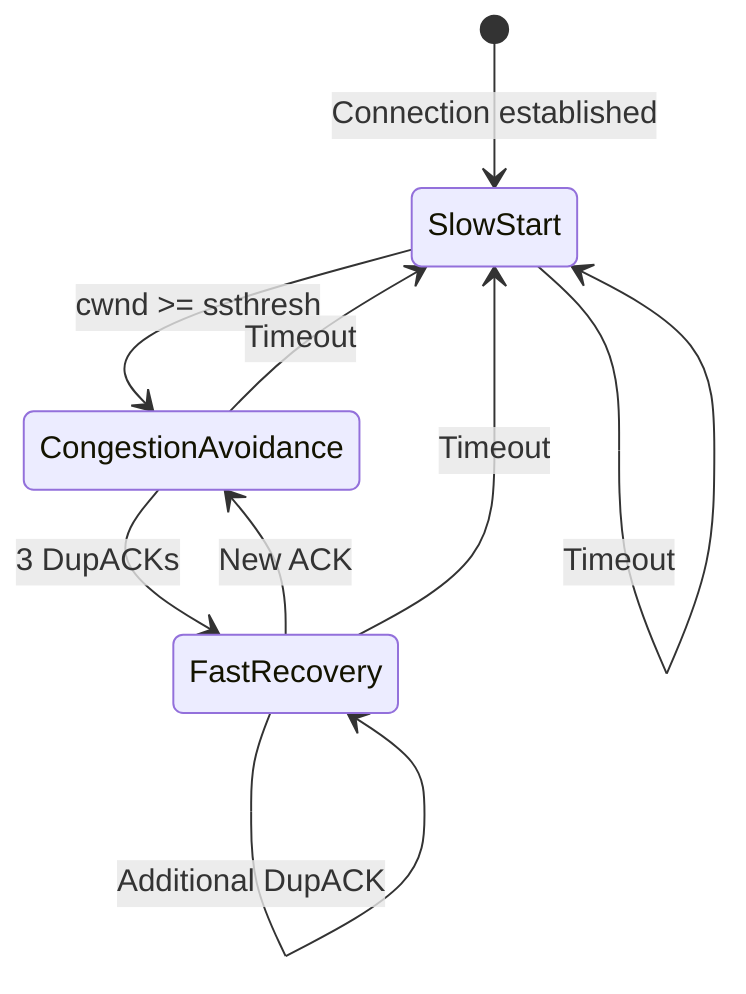

#tcp #computer-network #transport-layer #congestion-control #protocol #loss-based
# Overview
- TCP Reno is a ==loss-based congestion control algorithm==.
- Introduced in $1990$ as enhancement to [TCP Tahoe](TCP%20Tahoe.md).
- Implements ==AIMD== (Additive Increase, Multiplicative Decrease).
- Most widely deployed congestion control algorithm historically.
- Part of [TCP Congestion Control](TCP%20Congestion%20Control.md).
- Default algorithm in many operating systems until replaced by [TCP Cubic](TCP%20Cubic.md).
# Key Innovation
## Fast Recovery
- Major improvement over TCP Tahoe.
- Avoids slow start after detecting packet loss via ==duplicate ACKs==.
- Maintains higher throughput during congestion.
- Distinguishes between:
	- ==Mild congestion==: detected by duplicate ACKs (3 DupACKs).
	- ==Severe congestion==: detected by timeout.
# Congestion Window Dynamics
## Variables
- ==Congestion window (cwnd)==: limits unacknowledged data.
- ==Slow-start threshold (ssthresh)==: transition point between phases.
- ==Maximum Segment Size (MSS)==: typical value $1460$ bytes.
## Initial Values
- Initial $cwnd = 1$ MSS (historical).
- Modern implementations: $cwnd = 10$ MSS (RFC 6928).
- Initial $ssthresh = 64$ KB or advertised window.
## Effective Sending Rate
$$Rate \approx \frac{cwnd}{RTT}$$
- Higher $cwnd$ → higher throughput.
- $RTT$ variation affects instantaneous rate.
# Three Phases of TCP Reno
## Phase 1: Slow Start
### Purpose
- Quickly probe for available bandwidth after connection establishment or timeout.
- ==Exponential growth== to reach operating region rapidly.
### Mechanism
- Start with $cwnd = 1$ MSS (or $10$ MSS).
- For each ACK received: $cwnd = cwnd + MSS$.
- Effective result: $cwnd$ doubles every $RTT$.
### Growth Formula
- After $n$ RTTs:
$$cwnd = cwnd_{initial} \times 2^n$$
- Example: starting from $1$ MSS:
	- RTT $0$: $cwnd = 1$ MSS.
	- RTT $1$: $cwnd = 2$ MSS.
	- RTT $2$: $cwnd = 4$ MSS.
	- RTT $3$: $cwnd = 8$ MSS.
### Transition Condition
- Transition to congestion avoidance when $cwnd \geq ssthresh$.
- Slow start ends when:
	- Reaching threshold: switch to congestion avoidance.
	- Timeout occurs: restart slow start with reduced $ssthresh$.
	- $3$ duplicate ACKs: switch to fast recovery.
### Visualization

- Exponential curve shows rapid growth.
- Steep incline until reaching $ssthresh$.
## Phase 2: Congestion Avoidance
### Purpose
- Cautiously probe for additional bandwidth.
- ==Linear growth== to avoid triggering congestion.
- Maintain network stability.
### Mechanism
- Increase $cwnd$ by $1$ MSS per $RTT$.
- Per-ACK increment:
$$cwnd = cwnd + \frac{MSS \times MSS}{cwnd}$$
- Slower, additive increase compared to slow start.
### Example
- $cwnd = 8$ MSS, $MSS = 1$ KB:
- Per-ACK increase: $\frac{1 \times 1}{8} = 0.125$ KB.
- After $8$ ACKs (one RTT): $cwnd = 9$ MSS.
### Transition Conditions
#### On 3 Duplicate ACKs
- Indicates single packet loss (mild congestion).
- Update threshold:
$$ssthresh = \frac{cwnd}{2}$$
- Update congestion window:
$$cwnd = ssthresh + 3 \times MSS$$
- $3 \times MSS$ accounts for $3$ packets that triggered duplicate ACKs.
- Transition to ==fast recovery==.
#### On Timeout
- Indicates severe congestion or multiple packet losses.
- Update threshold:
$$ssthresh = \frac{cwnd}{2}$$
- Reset congestion window:
$$cwnd = 1 \text{ MSS}$$
- Transition to ==slow start==.
## Phase 3: Fast Recovery
### Purpose
- Quick recovery from single packet loss.
- Maintain higher throughput than restarting slow start.
- Key innovation distinguishing Reno from Tahoe.
### Entry Condition
- Triggered by ==3 duplicate ACKs==.
- Indicates one packet lost but subsequent packets received.
- Network can still deliver data (partial congestion).
### Mechanism
1. Set $ssthresh = \frac{cwnd}{2}$ (halve threshold).
2. Set $cwnd = ssthresh + 3 \times MSS$ (deflate window plus buffered packets).
3. Retransmit missing packet (fast retransmit).
4. For each additional duplicate ACK:
$$cwnd = cwnd + MSS$$
5. Transmit new packet if allowed by $cwnd$.
### Inflation Phase
- Temporary increase in $cwnd$ to account for packets in flight.
- Each duplicate ACK indicates packet left network.
- Allows continued transmission during recovery.
### Exit Conditions
#### On New ACK (Partial or Full)
- Lost packet successfully retransmitted.
- Deflate window:
$$cwnd = ssthresh$$
- Transition to ==congestion avoidance==.
#### On Timeout
- Fast recovery failed (more severe congestion).
- Update threshold:
$$ssthresh = \frac{cwnd}{2}$$
- Reset window:
$$cwnd = 1 \text{ MSS}$$
- Transition to ==slow start==.
### Visualization

- Sharp drop at packet loss.
- Quick recovery to half previous window.
- Resume linear growth.
# State Transition Diagram

# Algorithm Pseudocode
## Slow Start Phase
```Text
while (cwnd < ssthresh) {
    on ACK received:
        cwnd = cwnd + MSS
        if (cwnd >= ssthresh)
            transition to Congestion Avoidance

    on 3 DupACKs:
        ssthresh = cwnd / 2
        cwnd = ssthresh + 3 * MSS
        retransmit missing segment
        transition to Fast Recovery

    on Timeout:
        ssthresh = cwnd / 2
        cwnd = 1 MSS
        retransmit missing segment
        restart Slow Start
}
```
## Congestion Avoidance Phase
```Text
while (cwnd >= ssthresh) {
    on ACK received:
        cwnd = cwnd + (MSS * MSS) / cwnd

    on 3 DupACKs:
        ssthresh = cwnd / 2
        cwnd = ssthresh + 3 * MSS
        retransmit missing segment
        transition to Fast Recovery

    on Timeout:
        ssthresh = cwnd / 2
        cwnd = 1 MSS
        retransmit missing segment
        transition to Slow Start
}
```
## Fast Recovery Phase
```Text
on entry from Congestion Avoidance {
    ssthresh = cwnd / 2
    cwnd = ssthresh + 3 * MSS
    retransmit missing segment
}

while (in Fast Recovery) {
    on additional DupACK:
        cwnd = cwnd + MSS
        transmit new segment if allowed

    on New ACK (recovery complete):
        cwnd = ssthresh
        transition to Congestion Avoidance

    on Timeout:
        ssthresh = cwnd / 2
        cwnd = 1 MSS
        retransmit missing segment
        transition to Slow Start
}
```
# Performance Characteristics
## Advantages
- ==Fast recovery== improves throughput compared to Tahoe.
- Effective in networks with ==low to moderate packet loss==.
- Simple implementation, widely supported.
- Good performance for bulk transfers.
- Stable and predictable behavior.
## Disadvantages
### Multiple Packet Loss
- Fast recovery assumes ==single packet loss== per window.
- Multiple losses in same window cause:
	- Premature exit from fast recovery.
	- Additional timeouts.
	- Severe throughput degradation.
### High Bandwidth-Delay Product (BDP)
- Linear increase limits throughput in high-BDP networks.
- Takes long time to fully utilize available bandwidth.
- Example: $10$ Gbps link with $100$ ms RTT:
	- $BDP = 125$ MB.
	- $cwnd$ increases by $1$ MSS per RTT.
	- Takes $\approx 86,000$ RTTs ($143$ minutes) to reach full utilization.
### RTT Unfairness
- Flows with shorter RTT increase $cwnd$ faster.
- Geographically closer connections receive more bandwidth.
- Not RTT-fair: $\frac{cwnd}{RTT}$ advantage for low-latency flows.
### Wireless Networks
- Packet loss due to channel errors misinterpreted as congestion.
- Unnecessary rate reduction degrades performance.
- Requires link-layer retransmission or cross-layer optimization.
## Throughput Model
### Mathis Formula
- Average throughput for bulk transfer:
$$Throughput \approx \frac{MSS}{RTT \sqrt{p}}$$
- $MSS$: Maximum Segment Size.
- $RTT$: Round-Trip Time.
- $p$: Packet loss probability.
- Derived from AIMD sawtooth pattern analysis.
### Example Calculation
- $MSS = 1500$ bytes, $RTT = 100$ ms, $p = 1\%$:
$$Throughput \approx \frac{1500}{0.1 \times \sqrt{0.01}} = \frac{1500}{0.01} = 150,000 \text{ bytes/s} = 1.2 \text{ Mbps}$$
- Shows strong sensitivity to packet loss rate.
# Comparison with TCP Tahoe
| Feature | TCP Tahoe | TCP Reno |
|---------|-----------|----------|
| Slow start | Yes | Yes |
| Congestion avoidance | Yes | Yes |
| Fast recovery | ==No== | ==Yes== |
| Response to 3 DupACKs | Slow start ($cwnd = 1$ MSS) | Fast recovery ($cwnd = ssthresh$) |
| Response to timeout | Slow start | Slow start |
| Throughput | Lower | Higher |
| Recovery speed | Slower | Faster |
| Complexity | Simpler | More complex |
## Throughput Comparison

- Tahoe: deep drops on packet loss.
- Reno: shallower drops, faster recovery.
- Reno maintains higher average throughput.
# TCP NewReno Enhancement
## Motivation
- TCP Reno struggles with multiple packet losses.
- ==Partial ACK== problem: new ACK during fast recovery may not cover all lost packets.
## Improvements
- Remains in fast recovery until all data outstanding at time of loss is acknowledged.
- ==Partial ACK== triggers retransmission without exiting fast recovery.
- Better handling of multiple packet losses per window.
## Modified Fast Recovery
```Text
on Partial ACK (acknowledges some but not all outstanding data):
    retransmit next unacknowledged segment
    deflate cwnd by amount of data newly acknowledged
    remain in Fast Recovery

on Full ACK (acknowledges all outstanding data):
    cwnd = ssthresh
    transition to Congestion Avoidance
```
# Real-World Deployment
## Operating System Support
- Linux: default until kernel $2.6.19$ (replaced by Cubic).
- FreeBSD: available as option.
- Windows: used in Windows NT through Windows 7.
- macOS: transitioned to Cubic.
## Internet Impact
- Dominant algorithm from $1990$ to mid-$2000$s.
- Prevented congestion collapse during Internet growth.
- Foundation for subsequent algorithms.
## Legacy
- AIMD principle remains fundamental.
- Fast retransmit and fast recovery concepts widely adopted.
- Baseline for comparing new algorithms.
# Parameter Tuning
## Initial Window (IW)
- RFC 3390 (2002): $IW \leq 4$ MSS.
- RFC 6928 (2013): $IW = 10$ MSS.
- Improves performance for short flows.
- Trade-off: potential for increased congestion.
## Retransmission Timeout (RTO)
- Calculated from RTT measurements:
$$RTO = RTT_{estimated} + 4 \times RTT_{deviate}$$
- Minimum RTO: $200$ ms (Linux default).
- Maximum RTO: typically $60$ s.
## Duplicate ACK Threshold
- Standard: $3$ duplicate ACKs trigger fast retransmit.
- Lower threshold: faster detection, more false positives.
- Higher threshold: delayed detection, lower false positives.
***
# References
1. Computer Networking: A Top-Down Approach, Global Edition, 8th Edition - James F. Kurose, Keith W. Ross.
	1. Chapter 3: Transport Layer.
		1. Section 3.7: TCP Congestion Control.
2. RFC 5681 - TCP Congestion Control.
	1. https://www.rfc-editor.org/rfc/rfc5681
3. RFC 2582 - The NewReno Modification to TCP's Fast Recovery Algorithm.
	1. https://www.rfc-editor.org/rfc/rfc2582
4. RFC 6928 - Increasing TCP's Initial Window.
	1. https://www.rfc-editor.org/rfc/rfc6928
5. Van Jacobson. Congestion Avoidance and Control. SIGCOMM 1988.
	1. https://dl.acm.org/doi/10.1145/52324.52356
6. M. Mathis, J. Semke, J. Mahdavi, T. Ott. The Macroscopic Behavior of the TCP Congestion Avoidance Algorithm. ACM SIGCOMM Computer Communication Review, 1997.
	1. Mathis formula derivation.
7. HCMUT Computer Network Slides - Nguyễn Phương Duy.
	1. Chapter 3: Transport Layer.
