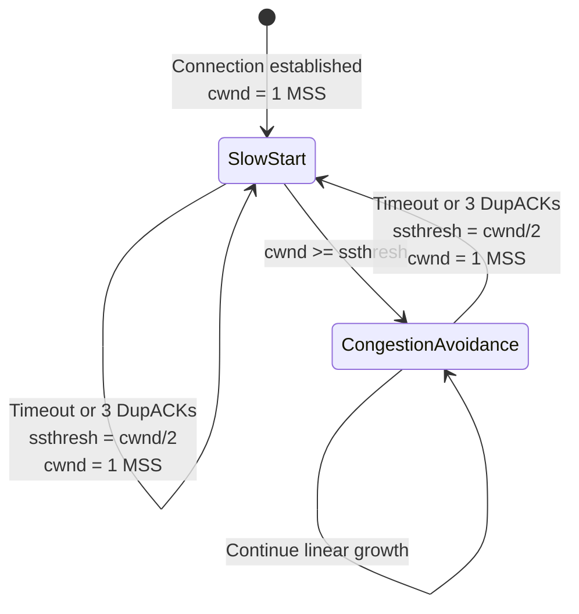

#tcp #computer-network #transport-layer #congestion-control #protocol #loss-based
# Overview
- TCP Tahoe is the ==first modern congestion control algorithm==.
- Introduced by Van Jacobson in $1988$.
- Pioneered ==AIMD== (Additive Increase, Multiplicative Decrease).
- Prevented ==congestion collapse== in early Internet.
- Part of [TCP Congestion Control](TCP%20Congestion%20Control.md).
- Predecessor to [TCP Reno](TCP%20Reno.md).
# Historical Context
## Internet Congestion Crisis (1986)
- Internet experienced severe congestion collapse.
- Throughput dropped from $32$ kbps to $40$ bps (factor of $1000$).
- Network became essentially unusable.
- Caused by lack of congestion control mechanisms.
## Van Jacobson's Solution
- Introduced congestion avoidance and control mechanisms.
- Published in SIGCOMM $1988$ paper.
- Implemented in BSD UNIX $4.3$ Tahoe release.
- Named after Lake Tahoe in California.
# Key Concepts
## Congestion Window (cwnd)
- Sender maintains ==congestion window== limiting unacknowledged data.
- Dynamically adjusted based on network conditions.
- Measured in bytes or MSS units.
## Slow-Start Threshold (ssthresh)
- Threshold separating slow start from congestion avoidance.
- Initially set to large value (e.g., $64$ KB).
- Reduced on congestion detection.
## Loss Detection
- ==Timeout==: ACK not received within expected time.
- ==Duplicate ACKs==: receiver signals missing packet.
- Both events treated as congestion signals.
# Two Phases of TCP Tahoe
## Phase 1: Slow Start
### Purpose
- Quickly discover available bandwidth.
- "Slow" compared to sending at maximum rate immediately.
- Actually ==exponential growth==.
### Mechanism
- Initialize $cwnd = 1$ MSS.
- For each ACK received: $cwnd = cwnd + MSS$.
- Effective result: $cwnd$ doubles every RTT.
### Growth Pattern
- RTT $0$: $cwnd = 1$ MSS, send $1$ packet.
- RTT $1$: receive $1$ ACK, $cwnd = 2$ MSS, send $2$ packets.
- RTT $2$: receive $2$ ACKs, $cwnd = 4$ MSS, send $4$ packets.
- RTT $3$: receive $4$ ACKs, $cwnd = 8$ MSS, send $8$ packets.
- RTT $n$: $cwnd = 2^n$ MSS.
### Exponential Formula
$$cwnd(t) = cwnd_0 \times 2^{\lfloor t / RTT \rfloor}$$
- $cwnd_0$: initial congestion window.
- $t$: elapsed time.
- $RTT$: round-trip time.
### Transition Condition
- Continue slow start while $cwnd < ssthresh$.
- Transition to congestion avoidance when $cwnd \geq ssthresh$.
### Visualization

- Steep exponential curve.
- Rapid growth until reaching threshold.
## Phase 2: Congestion Avoidance
### Purpose
- Cautiously probe for additional bandwidth.
- Linear growth prevents triggering congestion.
- Maintain stable network operation.
### Mechanism
- Increase $cwnd$ by $1$ MSS per RTT.
- Per-ACK increment:
$$cwnd = cwnd + \frac{MSS}{cwnd}$$
- Additive increase creates linear growth.
### Growth Pattern
- Much slower than slow start.
- Gradual exploration of available capacity.
- Trade-off between utilization and stability.
### Transition Condition
- Continue congestion avoidance until loss detected.
- Loss triggers return to slow start.
# Congestion Detection and Response
## Detection Mechanisms
### Timeout Event
- Retransmission timer expires.
- Indicates severe congestion or packet loss.
- Most conservative congestion signal.
### Duplicate ACKs
- Receiver sends duplicate ACK when packet arrives out of order.
- Multiple duplicate ACKs indicate packet loss.
- Tahoe treats this same as timeout.
## Response to Congestion
### On Timeout or 3 Duplicate ACKs
1. Update slow-start threshold:
$$ssthresh = \frac{cwnd}{2}$$
2. Reset congestion window:
$$cwnd = 1 \text{ MSS}$$
3. Retransmit lost packet.
4. Return to ==slow start== phase.
### Multiplicative Decrease
- Halving $ssthresh$ implements multiplicative decrease.
- Conservative response to prevent further congestion.
- Allows network queues to drain.
# AIMD Behavior
## Additive Increase
- During congestion avoidance: $cwnd = cwnd + \frac{MSS}{cwnd}$ per ACK.
- Linear growth by $1$ MSS per RTT.
- Probes for additional bandwidth.
## Multiplicative Decrease
- On congestion: $ssthresh = \frac{cwnd}{2}$.
- Exponential backoff via reset to $cwnd = 1$ MSS.
- Aggressive decrease prevents congestion escalation.
## Sawtooth Pattern
- Creates characteristic ==sawtooth throughput pattern==.
- Linear increase followed by sharp decrease.
- Oscillates around optimal operating point.
# Algorithm Pseudocode
```Text
# Initialization
cwnd = 1 MSS
ssthresh = 64 KB  # or advertised window

# On ACK Received
if (cwnd < ssthresh) {
    # Slow Start
    cwnd = cwnd + MSS
} else {
    # Congestion Avoidance
    cwnd = cwnd + MSS / cwnd
}

# On Timeout or 3 Duplicate ACKs
ssthresh = cwnd / 2
cwnd = 1 MSS
retransmit lost segment
# Return to Slow Start
```
# State Transition Diagram

# Performance Characteristics
## Advantages
### Simplicity
- Only two phases: slow start and congestion avoidance.
- Easy to implement and understand.
- Minimal state maintenance.
### Stability
- Conservative response to congestion.
- Prevents network instability.
- Guaranteed convergence to stable state.
### Fairness
- AIMD naturally achieves fair bandwidth allocation.
- Multiple competing flows converge to equal shares.
- Mathematically proven fairness properties.
### Historical Impact
- Prevented Internet congestion collapse.
- Established foundation for modern congestion control.
- Influenced all subsequent TCP variants.
## Disadvantages
### Slow Recovery
- Always returns to slow start on packet loss.
- Even mild congestion causes severe throughput drop.
- No distinction between timeout and duplicate ACKs.

- Deep valleys in throughput graph.
- Long recovery time to previous bandwidth.
### Poor Performance with Packet Loss
- Single packet loss severely impacts throughput.
- Unnecessary rate reduction for mild congestion.
- Retransmission timeout exacerbates delay.
### Inefficient for High-BDP Networks
- Linear increase too slow for high bandwidth-delay product.
- Takes excessive time to utilize available capacity.
- Example: $10$ Gbps link with $100$ ms RTT:
	- $BDP = 125$ MB.
	- Slow start limited by $ssthresh$.
	- Linear increase after threshold very slow.
### RTT Unfairness
- Flows with shorter RTT increase $cwnd$ faster.
- Geographic proximity advantages.
- Not RTT-fair.
## Throughput Analysis
### Average Throughput
- During congestion avoidance, $cwnd$ ranges from $\frac{W}{2}$ to $W$.
- Average $cwnd = \frac{3W}{4}$.
- Average throughput:
$$Throughput_{avg} = \frac{3W}{4 \times RTT}$$
- $W$: window size at packet loss.
### Cycle Duration
- Time from window size $\frac{W}{2}$ to $W$:
$$T_{cycle} = \frac{W}{2} \times RTT$$
- Linear increase by $1$ MSS per RTT.
### Loss Sensitivity
- Throughput highly sensitive to loss rate.
- Higher loss rate → lower average window → lower throughput.
- Feedback loop can cause instability.
# Comparison with TCP Reno
| Feature | TCP Tahoe | TCP Reno |
|---------|-----------|----------|
| Slow start | Yes | Yes |
| Congestion avoidance | Yes | Yes |
| Fast retransmit | No | Yes |
| Fast recovery | ==No== | ==Yes== |
| Response to 3 DupACKs | Reset to $cwnd = 1$ MSS | Enter fast recovery |
| Response to timeout | Reset to $cwnd = 1$ MSS | Reset to $cwnd = 1$ MSS |
| Throughput | Lower | Higher |
| Recovery speed | Slower | Faster |
| Implementation complexity | Simpler | More complex |
## Throughput Comparison
- Tahoe: severe drops on any packet loss.
- Reno: moderate drops on duplicate ACKs, fast recovery.
- Reno achieves $20-40\%$ higher throughput in typical scenarios.
# Practical Considerations
## When Tahoe Performs Well
- Low packet loss networks.
- Short-lived connections (complete during slow start).
- Networks with severe congestion requiring conservative behavior.
## When Tahoe Performs Poorly
- Networks with moderate packet loss.
- Long-lived bulk transfers.
- High bandwidth-delay product environments.
- Wireless networks with channel errors.
## Modern Usage
- Largely replaced by TCP Reno and later variants.
- Primarily of historical and educational interest.
- Some embedded systems still use simplified Tahoe-like algorithms.
# Parameter Configuration
## Initial Congestion Window
- Original Tahoe: $cwnd = 1$ MSS.
- Limits initial throughput.
- Modern standards allow larger initial window.
## Initial Slow-Start Threshold
- Typical value: $64$ KB.
- Some implementations use advertised receiver window.
- Trade-off between fast startup and potential congestion.
## Retransmission Timeout
- Calculated from RTT samples:
$$RTO = RTT_{smooth} + 4 \times RTT_{variation}$$
- Minimum RTO prevents premature timeouts.
- Maximum RTO prevents indefinite waiting.
# Legacy and Influence
## Foundational Contributions
- Introduced congestion window concept.
- Established AIMD principle.
- Pioneered slow start mechanism.
- Demonstrated effectiveness of end-to-end congestion control.
## Influence on Subsequent Algorithms
- [TCP Reno](TCP%20Reno.md): added fast recovery.
- [TCP Cubic](TCP%20Cubic.md): modified growth function but retains AIMD spirit.
- [TCP Vegas](TCP%20Vegas.md): different detection but similar response.
- All modern algorithms build on Tahoe's foundation.
## Educational Value
- Simple yet effective algorithm.
- Clear demonstration of congestion control principles.
- Frequently used in networking courses.
- Benchmark for comparing new algorithms.
***
# References
1. Van Jacobson. Congestion Avoidance and Control. SIGCOMM 1988.
	1. https://dl.acm.org/doi/10.1145/52324.52356
	2. Original TCP Tahoe paper.
2. Computer Networking: A Top-Down Approach, Global Edition, 8th Edition - James F. Kurose, Keith W. Ross.
	1. Chapter 3: Transport Layer.
		1. Section 3.7: TCP Congestion Control.
3. RFC 5681 - TCP Congestion Control.
	1. https://www.rfc-editor.org/rfc/rfc5681
4. W. Richard Stevens. TCP/IP Illustrated, Volume 1: The Protocols.
	1. Chapter 21: TCP Timeout and Retransmission.
5. HCMUT Computer Network Slides - Nguyễn Phương Duy.
	1. Chapter 3: Transport Layer.
6. Sally Floyd, Tom Henderson. The NewReno Modification to TCP's Fast Recovery Algorithm. RFC 2582, 1999.
	1. Discusses improvements over Tahoe.
