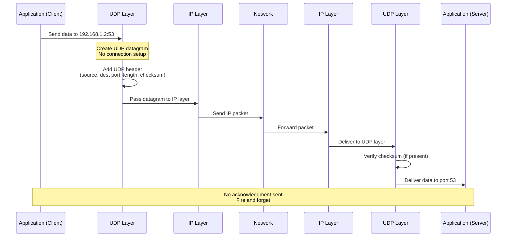

#udp #protocol #transport-layer #computer-network #connectionless #unreliable #best-effort #datagram
#dns #streaming #voip #gaming #multicast

# Formal Definition
- UDP (User Datagram Protocol) is a <mark class="hltr-yellow">simple, connectionless transport layer protocol</mark> defined in RFC 768.
- UDP provides <mark class="hltr-yellow">best-effort delivery</mark> - no guarantees about packet delivery, ordering, or duplicate detection.
- UDP is <mark class="hltr-yellow">message-oriented</mark> - preserves message boundaries (unlike TCP's byte stream).
- Key characteristics:
  1. **Connectionless** - No handshake before sending data
  2. **Unreliable** - No delivery guarantees, no retransmission
  3. **No Congestion Control** - Sends at any rate desired by application
  4. **Lightweight** - Minimal protocol overhead (8-byte header)
  5. **Fast** - No connection setup, acknowledgments, or flow control delays

# UDP vs TCP Comparison

| Feature                | UDP                          | TCP                           |
| ---------------------- | ---------------------------- | ----------------------------- |
| **Connection**         | Connectionless               | Connection-oriented           |
| **Reliability**        | Unreliable (best-effort)     | Reliable (guaranteed delivery) |
| **Ordering**           | No ordering guarantees       | In-order delivery             |
| **Flow Control**       | None                         | Sliding window                |
| **Congestion Control** | None                         | AIMD, slow start, etc.        |
| **Header Size**        | 8 bytes (fixed)              | 20-60 bytes (variable)        |
| **Speed**              | ⚡ Fast                       | Slower (overhead)             |
| **Use Cases**          | Streaming, gaming, DNS, VoIP | HTTP, FTP, email, file transfer |

# UDP Segment Structure

```
UDP Datagram:
 0                   1                   2                   3
 0 1 2 3 4 5 6 7 8 9 0 1 2 3 4 5 6 7 8 9 0 1 2 3 4 5 6 7 8 9 0 1
+-+-+-+-+-+-+-+-+-+-+-+-+-+-+-+-+-+-+-+-+-+-+-+-+-+-+-+-+-+-+-+-+
|          Source Port          |       Destination Port        |
+-+-+-+-+-+-+-+-+-+-+-+-+-+-+-+-+-+-+-+-+-+-+-+-+-+-+-+-+-+-+-+-+
|            Length             |           Checksum            |
+-+-+-+-+-+-+-+-+-+-+-+-+-+-+-+-+-+-+-+-+-+-+-+-+-+-+-+-+-+-+-+-+
|                                                               |
|                          Data (Payload)                       |
|                                                               |
+-+-+-+-+-+-+-+-+-+-+-+-+-+-+-+-+-+-+-+-+-+-+-+-+-+-+-+-+-+-+-+-+
```

## UDP Header Fields

**Header Size:** 8 bytes (fixed)

| Field               | Size     | Description                                    |
| ------------------- | -------- | ---------------------------------------------- |
| **Source Port**     | 2 bytes  | Port number of sending application (optional)  |
| **Destination Port** | 2 bytes | Port number of receiving application           |
| **Length**          | 2 bytes  | Length of UDP header + data (minimum 8 bytes)  |
| **Checksum**        | 2 bytes  | Error detection (optional in IPv4, mandatory in IPv6) |

### Field Details

**Source Port (16 bits):**
- Port number of the sender
- Optional - can be set to 0 if not needed
- Used by receiver to send replies

**Destination Port (16 bits):**
- Port number of the receiver
- Mandatory - identifies the receiving application
- Range: 0-65535
  - Well-known ports: 0-1023 (e.g., DNS: 53, DHCP: 67/68)
  - Registered ports: 1024-49151
  - Dynamic/private ports: 49152-65535

**Length (16 bits):**
- Total length of UDP datagram (header + data)
- Minimum: 8 bytes (header only, no data)
- Maximum: 65,535 bytes (theoretical)
- Practical limit: MTU (Maximum Transmission Unit)
  - Ethernet MTU: 1500 bytes
  - IPv4 header: 20 bytes
  - UDP header: 8 bytes
  - **Max UDP payload over Ethernet: 1472 bytes**

**Checksum (16 bits):**
- Error detection mechanism
- Computed over:
  1. Pseudo-header (source IP, dest IP, protocol, UDP length)
  2. UDP header
  3. UDP data
- **IPv4**: Optional (can be 0)
- **IPv6**: Mandatory (must be computed)

## UDP Checksum Calculation

### Pseudo-Header for IPv4
```
Pseudo-Header (12 bytes):
+-+-+-+-+-+-+-+-+-+-+-+-+-+-+-+-+-+-+-+-+-+-+-+-+-+-+-+-+-+-+-+-+
|                       Source IP Address                       |
+-+-+-+-+-+-+-+-+-+-+-+-+-+-+-+-+-+-+-+-+-+-+-+-+-+-+-+-+-+-+-+-+
|                    Destination IP Address                     |
+-+-+-+-+-+-+-+-+-+-+-+-+-+-+-+-+-+-+-+-+-+-+-+-+-+-+-+-+-+-+-+-+
|     Zero      |    Protocol   |        UDP Length             |
+-+-+-+-+-+-+-+-+-+-+-+-+-+-+-+-+-+-+-+-+-+-+-+-+-+-+-+-+-+-+-+-+
```

**Protocol:** 17 (UDP)

### Checksum Algorithm

```python title='UDP checksum calculation'
def calculate_udp_checksum(data):
    # 1. Add pseudo-header, UDP header, and data
    # 2. Divide into 16-bit words
    # 3. Sum all 16-bit words (with carry wraparound)
    # 4. Take one's complement

    checksum = 0

    # Process data in 16-bit chunks
    for i in range(0, len(data), 2):
        if i + 1 < len(data):
            word = (data[i] << 8) + data[i + 1]
        else:
            word = data[i] << 8  # Padding if odd length

        checksum += word

        # Carry wraparound
        if checksum > 0xFFFF:
            checksum = (checksum & 0xFFFF) + (checksum >> 16)

    # One's complement
    checksum = ~checksum & 0xFFFF

    return checksum
```

**Example:**
```
Data: "AB" (ASCII)
Hex: 0x41 0x42

Pseudo-header + UDP header + data:
192.168.1.1   → 0xC0A80101
192.168.1.2   → 0xC0A80102
Zero + Proto  → 0x0011 (17)
Length        → 0x000A (10 bytes)
Source Port   → 0x1F90 (8080)
Dest Port     → 0x0035 (53, DNS)
Length        → 0x000A
Checksum      → 0x0000 (zero during calculation)
Data          → 0x4142

Sum: 0xC0A8 + 0x0101 + 0xC0A8 + 0x0102 + 0x0011 + 0x000A +
     0x1F90 + 0x0035 + 0x000A + 0x4142 = 0x2843B

Wraparound: 0x843B + 0x0002 = 0x843D
One's complement: ~0x843D = 0x7BC2

Checksum: 0x7BC2
```

# UDP Communication Flow



**Key Observations:**
1. **No handshake** - Data sent immediately
2. **No acknowledgment** - Sender doesn't know if data arrived
3. **No retransmission** - Lost packets are gone forever
4. **No ordering** - Packets can arrive out of order

# Why Use UDP? (Advantages)

## 1. Low Latency
**No connection setup delay:**
```
TCP:
SYN → SYN-ACK → ACK (1.5 RTT minimum before data transfer)

UDP:
Send data immediately (0 RTT)
```

**Real-world impact:**
- **DNS query**: UDP response in 10-50ms
- **TCP equivalent**: Would add 50-100ms (RTT) for handshake

## 2. Simple Protocol
**Minimal overhead:**
```
UDP header: 8 bytes
TCP header: 20-60 bytes (7.5x larger)
```

**No state maintenance:**
- No connection table
- No sequence numbers
- No timers
- No retransmission queues

## 3. No Congestion Control
**Advantage for real-time apps:**
- Send at constant rate regardless of network conditions
- Application controls sending rate
- Predictable bandwidth usage

**Example: Video streaming**
```
Required bitrate: 5 Mbps for 1080p video

UDP: Consistently send at 5 Mbps
TCP: Variable rate (1 Mbps when congested, 10 Mbps when clear)
      → causes buffering, quality drops
```

## 4. Broadcast and Multicast Support
**UDP supports one-to-many:**
- Broadcast: Send to all hosts on network (255.255.255.255)
- Multicast: Send to group of hosts (224.0.0.0 - 239.255.255.255)

**TCP limitation:** Only unicast (one-to-one)

**Use case: IPTV**
```
One server broadcasts video stream to 1000s of clients simultaneously
TCP would require 1000s of separate connections
```

# UDP Use Cases

## 1. Domain Name System (DNS)
**Why UDP?**
- Small request/response (typically < 512 bytes)
- Low latency critical
- Application handles retransmission if needed

**DNS Query Example:**
```
Client → DNS Server (UDP port 53)
Query: What is the IP of example.com?

DNS Server → Client
Response: 93.184.216.34

Time: ~20ms (UDP)
vs ~70ms if TCP (handshake + data)
```

**DNS Fallback:**
- If response > 512 bytes, fallback to TCP
- Zone transfers use TCP

## 2. Streaming Media (Video/Audio)

**Why UDP?**
- Real-time delivery more important than reliability
- Lost packet = minor glitch, acceptable
- Retransmission would cause delays (worse than loss)

**Video Streaming:**
```
Required bitrate: 5 Mbps
Packet loss: 0.1% acceptable

UDP:
- Send frames continuously at 5 Mbps
- Lost frame = 1/30 second glitch (33ms)
- User barely notices

TCP:
- Lost packet triggers retransmission
- Delay = RTT (50-200ms)
- Video pauses/buffers
```

**Protocols using UDP:**
- **RTP** (Real-time Transport Protocol): Video/audio streaming
- **RTSP** (Real-Time Streaming Protocol): Control for streaming
- **WebRTC**: Browser-based video calls

## 3. Online Gaming

**Why UDP?**
- Ultra-low latency critical (competitive games: <50ms)
- Position updates sent frequently (60/sec)
- Old position data useless (don't retransmit)

**Game Update Example:**
```
Client sends player position every 16ms (60 FPS)

Packet 1: Player at (100, 200) - LOST
Packet 2: Player at (105, 205) - RECEIVED
Packet 3: Player at (110, 210) - RECEIVED

Result: Minor teleport from (100, 200) to (105, 205)
Better than waiting 100ms for retransmission
```

**Games using UDP:**
- FPS games (CS:GO, Valorant, Call of Duty)
- MOBAs (League of Legends, Dota 2)
- Racing games

## 4. Voice over IP (VoIP)

**Why UDP?**
- Real-time voice communication
- Slight quality loss better than delay
- Continuous stream of audio packets

**VoIP Example:**
```
Audio codec: G.711 (64 kbps)
Packet rate: 50 packets/sec (20ms audio per packet)

Packet loss < 5%: Acceptable
Delay > 150ms: Unacceptable (echo, awkward pauses)

UDP: Immediate delivery, acceptable quality
TCP: Retransmission causes choppy audio
```

**VoIP Protocols:**
- **SIP** (Session Initiation Protocol): Signaling
- **RTP**: Audio/video transport

## 5. Network Management

**SNMP (Simple Network Management Protocol):**
```
Network administrator queries router statistics
- Small request/response
- Hundreds of devices polled
- UDP reduces overhead
```

**Syslog:**
```
Server logs sent to centralized server
- Fire-and-forget logging
- Lost log entry acceptable
- High volume traffic
```

## 6. DHCP (Dynamic Host Configuration Protocol)

**Why UDP?**
- Client doesn't have IP yet (can't establish TCP)
- Broadcast discovery
- Simple request/response

**DHCP Process:**
```
Client: DHCP Discover (broadcast to 255.255.255.255:67)
Server: DHCP Offer (192.168.1.100)
Client: DHCP Request (I want 192.168.1.100)
Server: DHCP ACK (OK, it's yours)

All over UDP (no TCP possible - client has no IP!)
```

## 7. TFTP (Trivial File Transfer Protocol)

**Why UDP?**
- Simpler than FTP
- Used for bootloading, firmware updates
- Application-layer reliability

**TFTP Reliability:**
```
UDP provides transport
TFTP adds:
- Block numbers (sequencing)
- Acknowledgments
- Timeouts and retransmission

Result: Reliable file transfer over UDP
```

## 8. QUIC (Modern HTTP/3)

**QUIC = UDP + TCP-like reliability + TLS:**
- Built on UDP for flexibility
- Implements reliability in user-space
- See [[Quick UDP Internet Connection (QUIC)]] for details

# UDP Limitations

## 1. No Reliability

**Problem:**
- Packets can be lost
- No automatic retransmission
- Application must handle losses

**Mitigation:**
```python
# Application-layer reliability
def reliable_udp_send(sock, data, addr, max_retries=3):
    for attempt in range(max_retries):
        sock.sendto(data, addr)

        # Wait for acknowledgment
        sock.settimeout(1.0)
        try:
            ack, _ = sock.recvfrom(1024)
            if ack == b'ACK':
                return True
        except socket.timeout:
            continue

    return False  # Failed after retries
```

## 2. No Flow Control

**Problem:**
- Sender can overwhelm receiver
- Receiver buffer overflow
- Packet loss

**Mitigation:**
```python
# Application-layer flow control
SEND_RATE = 100  # packets/sec
PACKET_SIZE = 1400

while True:
    sock.sendto(data, addr)
    time.sleep(1.0 / SEND_RATE)  # Rate limiting
```

## 3. No Congestion Control

**Problem:**
- UDP can cause network congestion
- Doesn't back off when network congested
- Can starve TCP connections

**Impact:**
```
Network capacity: 100 Mbps

TCP connections: Back off during congestion
UDP stream at 80 Mbps: Doesn't back off

Result: TCP gets only 20 Mbps
        UDP unfairly consumes bandwidth
```

**Mitigation:**
- DCCP (Datagram Congestion Control Protocol)
- Application-layer congestion control
- QUIC implements congestion control

## 4. Fragmentation

**Problem:**
```
UDP payload > MTU → IP fragmentation

Example:
UDP payload: 3000 bytes
MTU: 1500 bytes
Result: Split into 3 IP fragments

If any fragment lost → entire datagram lost
```

**Mitigation:**
```python
# Keep UDP payload ≤ MTU
MTU = 1500
IP_HEADER = 20
UDP_HEADER = 8
MAX_UDP_PAYLOAD = MTU - IP_HEADER - UDP_HEADER  # 1472 bytes

data = b'x' * 1400  # Safe
sock.sendto(data, addr)
```

## 5. No Ordering Guarantee

**Problem:**
```
Sender sends: Packet 1, Packet 2, Packet 3
Receiver gets: Packet 2, Packet 1, Packet 3
```

**Mitigation:**
```python
# Application-layer sequencing
seq_num = 0

def send_ordered(sock, data, addr):
    global seq_num
    packet = struct.pack('!I', seq_num) + data  # Add sequence number
    sock.sendto(packet, addr)
    seq_num += 1

# Receiver reorders
recv_buffer = {}

def receive_ordered(sock):
    data, addr = sock.recvfrom(1500)
    seq = struct.unpack('!I', data[:4])[0]
    payload = data[4:]

    recv_buffer[seq] = payload

    # Deliver in-order packets
    while next_seq in recv_buffer:
        yield recv_buffer.pop(next_seq)
        next_seq += 1
```

# UDP Performance Characteristics

## Throughput

**UDP throughput = Application sending rate (no throttling)**

```python title='UDP throughput test'
import socket
import time

sock = socket.socket(socket.AF_INET, socket.SOCK_DGRAM)

data = b'x' * 1400  # 1400 bytes
count = 10000
start = time.time()

for i in range(count):
    sock.sendto(data, ('192.168.1.100', 5000))

elapsed = time.time() - start
throughput = (count * len(data) * 8) / elapsed / 1_000_000

print(f'Throughput: {throughput:.2f} Mbps')
# Output: Throughput: 850 Mbps (limited by NIC, not protocol)
```

## Latency

**UDP one-way latency:**
```
Latency = Propagation delay + Transmission delay
        = Distance / Speed of light + Packet size / Bandwidth

No queuing delay from retransmissions, flow control, etc.

Example:
Distance: 1000 km
Bandwidth: 1 Gbps
Packet: 1500 bytes

Propagation: 1000 km / 200,000 km/s = 5 ms
Transmission: 1500 bytes * 8 / 1 Gbps = 0.012 ms

Total: ~5 ms (one-way)
Round-trip: ~10 ms
```

## Packet Loss

**UDP doesn't hide packet loss:**
```python title='Measure UDP packet loss'
# Sender
for i in range(1000):
    sock.sendto(f'{i}'.encode(), addr)

# Receiver
received = set()
for i in range(1000):
    data, _ = sock.recvfrom(1024)
    received.add(int(data.decode()))

loss = 1000 - len(received)
loss_rate = loss / 1000 * 100

print(f'Packet loss: {loss_rate:.2f}%')
# Output: Packet loss: 0.5% (depends on network conditions)
```

# UDP Programming Examples

## Python UDP Server

```python title='udp_server.py'
import socket

# Create UDP socket
sock = socket.socket(socket.AF_INET, socket.SOCK_DGRAM)

# Bind to address and port
server_address = ('0.0.0.0', 5000)
sock.bind(server_address)

print(f'UDP server listening on {server_address}')

while True:
    # Receive data
    data, client_address = sock.recvfrom(4096)

    print(f'Received {len(data)} bytes from {client_address}')
    print(f'Data: {data.decode()}')

    # Send response
    response = f'Echo: {data.decode()}'
    sock.sendto(response.encode(), client_address)
```

## Python UDP Client

```python title='udp_client.py'
import socket

# Create UDP socket
sock = socket.socket(socket.AF_INET, socket.SOCK_DGRAM)

# Server address
server_address = ('192.168.1.100', 5000)

try:
    # Send data
    message = 'Hello, UDP server!'
    sock.sendto(message.encode(), server_address)

    # Receive response (with timeout)
    sock.settimeout(2.0)
    data, server = sock.recvfrom(4096)

    print(f'Received: {data.decode()}')

except socket.timeout:
    print('Request timed out')

finally:
    sock.close()
```

## C UDP Example

```c title='udp_server.c'
#include <stdio.h>
#include <stdlib.h>
#include <string.h>
#include <sys/socket.h>
#include <netinet/in.h>
#include <arpa/inet.h>

int main() {
    int sock = socket(AF_INET, SOCK_DGRAM, 0);

    struct sockaddr_in server_addr;
    server_addr.sin_family = AF_INET;
    server_addr.sin_port = htons(5000);
    server_addr.sin_addr.s_addr = INADDR_ANY;

    bind(sock, (struct sockaddr*)&server_addr, sizeof(server_addr));

    char buffer[4096];
    struct sockaddr_in client_addr;
    socklen_t client_len = sizeof(client_addr);

    while (1) {
        int n = recvfrom(sock, buffer, sizeof(buffer), 0,
                        (struct sockaddr*)&client_addr, &client_len);

        buffer[n] = '\0';
        printf("Received: %s\n", buffer);

        // Echo back
        sendto(sock, buffer, n, 0,
              (struct sockaddr*)&client_addr, client_len);
    }

    return 0;
}
```

# UDP Security Considerations

## Vulnerabilities

### 1. UDP Flood Attack (DDoS)
**Attack:**
```
Attacker sends massive UDP traffic to victim

Example: 1 million packets/sec to port 80
Result: Server overwhelmed, legitimate traffic dropped
```

**Mitigation:**
- Rate limiting
- Firewall rules
- DDoS protection services

### 2. UDP Amplification Attack
**Attack:**
```
Attacker spoofs victim's IP
Sends small UDP request to amplifier (DNS, NTP)
Amplifier sends large response to victim

Example:
64-byte DNS query → 4000-byte response
Amplification factor: 62x
```

**Mitigation:**
- Disable open resolvers
- Rate limiting
- Source IP verification (BCP 38)

### 3. No Authentication
**Problem:**
- No built-in authentication
- Easy to spoof source IP
- Man-in-the-middle attacks

**Mitigation:**
```python
# Application-layer authentication
import hmac
import hashlib

SECRET_KEY = b'shared-secret-key'

def sign_message(msg):
    signature = hmac.new(SECRET_KEY, msg, hashlib.sha256).digest()
    return signature + msg

def verify_message(data):
    signature = data[:32]
    msg = data[32:]
    expected = hmac.new(SECRET_KEY, msg, hashlib.sha256).digest()
    return hmac.compare_digest(signature, expected)
```

# UDP Enhancements

## Reliable UDP Protocols

**1. RUDP (Reliable UDP)**
- Adds: Acknowledgments, retransmission, ordering
- Use case: Games, VoIP with reliability

**2. UDT (UDP-based Data Transfer)**
- Congestion control + reliability
- Use case: High-speed data transfer

**3. QUIC**
- UDP + TLS 1.3 + TCP-like reliability
- Use case: HTTP/3, modern web

## UDP Lite (RFC 3828)
**Partial checksum coverage:**
```
UDP: Checksum covers entire datagram
UDP-Lite: Checksum covers header + partial payload

Use case: Video streaming
- Header must be correct (routing info)
- Payload can have errors (minor video glitches OK)
- Saves CPU, accepts some corruption
```

---

# References
1. RFC 768: User Datagram Protocol - https://www.rfc-editor.org/rfc/rfc768.html
2. Computer Networking: A Top-Down Approach, Global Edition, 8th Edition - James F. Kurose, Keith W. Ross - Chapter 3: Transport Layer
3. RFC 2460: Internet Protocol, Version 6 (IPv6) Specification - https://www.rfc-editor.org/rfc/rfc2460.html
4. RFC 3828: The Lightweight User Datagram Protocol (UDP-Lite) - https://www.rfc-editor.org/rfc/rfc3828.html
5. [[Quick UDP Internet Connection (QUIC)]] for QUIC protocol built on UDP
6. [[Transmission Control Protocol (TCP)]] for TCP comparison
