#cybersecurity #asymmetric-cipher #cryptography #rsa #number-theory #encryption #digital-signature #public-key
# Mathematical Foundations
## Prime Numbers and Factorization
- RSA security relies on the <mark class="hltr-yellow">integer factorization problem</mark>: given a large number $n = p \times q$, it is computationally infeasible to determine $p$ and $q$ when they are large primes.
# RSA Algorithm
## Key Generation
1. Select two large prime numbers $p$ and $q$
    - Use probabilistic primality tests (Miller-Rabin)
    - $p$ and $q$ should be of similar bit length
    - $p \neq q$ (must be distinct)
2. Compute $n = p \times q$
    - $n$ is called the **modulus**
    - Bit length of $n$ determines security level (2048-4096 bits)
3. Compute Euler's totient $\phi(n) = (p-1)(q-1)$
    - Number of integers coprime to $n$
    - Keep $\phi(n)$ secret
4. Select public exponent $e$
    - Choose $e$ such that $1 < e < \phi(n)$ and $\gcd(e, \phi(n)) = 1$
    - Common choices: $e = 3, 17, 65537 = 2^{16}+1$ (Fermat primes)
    - $e = 65537$ is standard (good security/performance balance)
5. Compute private exponent $d$
    - Find $d$ such that $e \cdot d \equiv 1 \pmod{\phi(n)}$
    - Use Extended Euclidean Algorithm
    - $d$ is the *multiplicative inverse* of $e$ modulo $\phi(n)$
6. Publish public key and keep private key secret
    - Public Key: $(e, n)$ - can be shared openly
    - Private Key: $(d, n)$ or $(d, p, q)$ - must remain secret
### Example
- Given $p = 61$, $q = 53$ (small primes for demonstration)
- Compute:
1. $n = 61 \times 53 = 3233$
2. $\phi(n) = (61-1)(53-1) = 60 \times 52 = 3120$
3. Select $e = 17$ (coprime to 3120)
4. Compute $d$ using Extended Euclidean Algorithm:
   - Find $d$ such that $17d \equiv 1 \pmod{3120}$
   - $d = 2753$ (since $17 \times 2753 = 46801 = 15 \times 3120 + 1$)
- Keys
    - Public Key: $(e=17, n=3233)$
    - Private Key: $(d=2753, n=3233)$
## Encryption
Given:
- **Public Key:** $(e, n)$
- **Message:** $M$ where $0 \leq M < n$

**Encryption:**
$$C = M^e \bmod n$$


### Encryption Example

Using keys from above: $(e=17, n=3233)$

**Encrypt message $M = 123$:**
```
C = 123^17 mod 3233

Using modular exponentiation:
123^17 mod 3233 = 855
```

**Result:** Ciphertext $C = 855$

## Decryption

Given:
- **Private Key:** $(d, n)$
- **Ciphertext:** $C$

**Decryption:**
$$M = C^d \bmod n$$


### Decryption Example

Using private key $(d=2753, n=3233)$ and ciphertext $C = 855$:

```
M = 855^2753 mod 3233

Using modular exponentiation:
855^2753 mod 3233 = 123
```

**Result:** Original message $M = 123$ recovered

## Mathematical Proof
### Goal

* Show that $M^{ed} \equiv M \pmod{n}$
### Proof
1. By key generation: $ed \equiv 1 \pmod{\phi(n)}$
2. Therefore: $ed = k\phi(n) + 1$ for some integer $k$
3. Thus:
   $$M^{ed} = M^{k\phi(n) + 1} = M \cdot (M^{\phi(n)})^k$$

4. By Euler's Theorem: If $\gcd(M, n) = 1$, then $M^{\phi(n)} \equiv 1 \pmod{n}$
5. Therefore:
   $$M^{ed} = M \cdot 1^k = M \pmod{n}$$

**Complete Encryption-Decryption Cycle:**


## Modular Exponentiation - Fast Computation

- Direct computation of $M^e \bmod n$ is impractical for large exponents. We use <mark class="hltr-yellow">fast modular exponentiation</mark> (square-and-multiply algorithm).

### Algorithm: Fast Modular Exponentiation

```
function modular_exp(base, exponent, modulus):
    result = 1
    base = base mod modulus
    while exponent > 0:
        if exponent is odd:
            result = (result * base) mod modulus
        exponent = exponent >> 1  // divide by 2
        base = (base * base) mod modulus
    return result
```

### Example: Compute $123^{17} \bmod 3233$

```
17 in binary: 10001

Step 1: result=1, base=123, exp=10001
  exp is odd → result = (1 × 123) mod 3233 = 123
  base = (123 × 123) mod 3233 = 15129 mod 3233 = 2430
  exp = 1000

Step 2: result=123, base=2430, exp=1000
  exp is even
  base = (2430 × 2430) mod 3233 = 5904900 mod 3233 = 2824
  exp = 100

Step 3: result=123, base=2824, exp=100
  exp is even
  base = (2824 × 2824) mod 3233 = 7975776 mod 3233 = 2296
  exp = 10

Step 4: result=123, base=2296, exp=10
  exp is even
  base = (2296 × 2296) mod 3233 = 5271616 mod 3233 = 256
  exp = 1

Step 5: result=123, base=256, exp=1
  exp is odd → result = (123 × 256) mod 3233 = 31488 mod 3233 = 855

Result: 123^17 mod 3233 = 855
```

# RSA Security

## Key Size Recommendations

| Key Size | Security Level | Factoring Difficulty | Recommended Use |
|----------|----------------|---------------------|-----------------|
| **512 bits** | ❌ Broken | Days with modern hardware | Never use |
| **1024 bits** | ⚠️ Weak | Possible with nation-state resources | Deprecated |
| **2048 bits** | ✅ Secure | Infeasible with current technology | Minimum standard (2030) |
| **3072 bits** | ✅ Very Secure | Extremely difficult | High-security applications |
| **4096 bits** | ✅ Maximum | Practically impossible | Long-term security (50+ years) |

**NIST Recommendations (2023):**
- Minimum: 2048 bits
- Recommended: 3072 bits for sensitive data
- Long-term: 4096 bits
## Padding Schemes
- Raw RSA is insecure! Without padding, RSA is vulnerable to multiple attacks.
### PKCS#1 v1.5 Padding
#### Structure
```
00 || 02 || PS || 00 || M

Where:
- 00: initial byte
- 02: block type (0x02 for encryption)
- PS: random non-zero padding string
- 00: separator
- M: message
```
#### Example
```
00 02 [random 200+ bytes] 00 [message]
```

- PKCS#1 v1.5 vulnerable to padding oracle attacks (Bleichenbacher attack)

### OAEP (Optimal Asymmetric Encryption Padding)
- **<mark class="hltr-yellow">OAEP (RSA-OAEP)</mark>** is the modern recommended padding scheme.
#### Structure
```
00 || maskedSeed || maskedDB

Where:
- maskedSeed = seed ⊕ MGF(maskedDB)
- maskedDB = (lHash || PS || 01 || M) ⊕ MGF(seed)
- MGF: Mask Generation Function (typically MGF1 with SHA-256)
- lHash: hash of optional label
- PS: zero padding
```

## Common Attacks on RSA

### Factorization Attacks

**Attack:** Factor $n$ to recover $p$ and $q$, then compute $\phi(n)$ and $d$

**Best Known Algorithms:**
- **General Number Field Sieve (GNFS)** - most efficient for large numbers
- Complexity: $O(e^{(1.9)(\ln n)^{1/3}(\ln \ln n)^{2/3}})$

**Mitigation:**
- Use sufficiently large key sizes (2048+ bits)
- Use primes of similar magnitude

### Small Exponent Attack

**Attack:** If $e$ is small (e.g., $e=3$) and message $M$ is small, then $C = M^3$ may be less than $n$

**Example:**
```
If M^3 < n, then C = M^3 (no modular reduction)
Attacker can compute M = ∛C (simple cube root)
```

**Mitigation:**
- Use proper padding (OAEP)
- Ensure $M^e > n$ after padding

### 3. Common Modulus Attack

**Attack:** Same message $M$ encrypted with same modulus $n$ but different public exponents $e_1$ and $e_2$

If $\gcd(e_1, e_2) = 1$, attacker can recover $M$ without private key using Bézout's identity.

**Mitigation:**
- Never reuse modulus with different key pairs
- Generate independent $(n, e, d)$ for each entity

### 4. Timing Attacks

**Attack:** Measure time taken for decryption operations to leak information about private key $d$

**Mitigation:**
- Use constant-time implementations
- Blind the ciphertext before decryption
- Use Chinese Remainder Theorem (CRT) carefully

### 5. Chosen Ciphertext Attack (CCA)

**Attack:** Manipulate ciphertexts and observe decryption results

**Example - PKCS#1 v1.5 Oracle:**
- Attacker sends modified ciphertexts
- Server responds differently for valid/invalid padding
- Information leaks allow message recovery

**Mitigation:**
- Use RSA-OAEP (resistant to CCA)
- Never reveal padding validation results
- Implement timing-constant padding checks

### 6. Low Private Exponent Attack (Wiener's Attack)

**Attack:** If $d < n^{0.25}$, Wiener's attack can recover $d$ efficiently

**Mitigation:**
- Ensure $d$ is sufficiently large (> $n^{0.5}$)
- Properly generate keys (standard implementations do this)

### 7. Coppersmith's Attack

**Attack:** Exploit when part of the message or private key is known

**Mitigation:**
- Use proper padding to randomize messages
- Never encrypt predictable messages without padding

## RSA vs Quantum Computers

**Shor's Algorithm (1994):**
- Quantum algorithm that factors integers in polynomial time
- With sufficient qubits, can break RSA in minutes
- Complexity: $O((\log n)^3)$ on quantum computer

**Current Status (2024):**
- Largest number factored by quantum computer: ~21 bits
- RSA-2048 requires ~4000 stable qubits (not yet available)
- Estimated timeline: 10-30 years for practical attack

**Post-Quantum Migration:**
- NIST selected post-quantum algorithms (2022)
- Recommended transition: CRYSTALS-Kyber (lattice-based)
- Organizations should plan migration strategy now

# Implementation

## OpenSSL Command Line

### Generate RSA Key Pair

```bash
# Generate 2048-bit private key
openssl genrsa -out private_key.pem 2048

# Generate 4096-bit private key with AES-256 encryption
openssl genrsa -aes256 -out private_key_encrypted.pem 4096

# Extract public key from private key
openssl rsa -in private_key.pem -pubout -out public_key.pem

# View private key details
openssl rsa -in private_key.pem -text -noout

# View public key details
openssl rsa -pubin -in public_key.pem -text -noout
```

### Encrypt and Decrypt with RSA

```bash
# Encrypt a file using public key (OAEP padding)
openssl pkeyutl -encrypt -pubin -inkey public_key.pem \
    -in plaintext.txt -out ciphertext.bin \
    -pkeyopt rsa_padding_mode:oaep \
    -pkeyopt rsa_oaep_md:sha256

# Decrypt using private key
openssl pkeyutl -decrypt -inkey private_key.pem \
    -in ciphertext.bin -out decrypted.txt \
    -pkeyopt rsa_padding_mode:oaep \
    -pkeyopt rsa_oaep_md:sha256

# Encrypt with PKCS#1 v1.5 padding (legacy)
openssl rsautl -encrypt -pubin -inkey public_key.pem \
    -in plaintext.txt -out ciphertext.bin

# Decrypt with PKCS#1 v1.5 padding
openssl rsautl -decrypt -inkey private_key.pem \
    -in ciphertext.bin -out decrypted.txt
```

## Python
### Using cryptography Library
```python
from cryptography.hazmat.primitives.asymmetric import rsa, padding
from cryptography.hazmat.primitives import hashes, serialization

# Generate RSA key pair
private_key = rsa.generate_private_key(
    public_exponent=65537,
    key_size=2048
)

public_key = private_key.public_key()

# Serialize keys
private_pem = private_key.private_bytes(
    encoding=serialization.Encoding.PEM,
    format=serialization.PrivateFormat.PKCS8,
    encryption_algorithm=serialization.NoEncryption()
)

public_pem = public_key.public_bytes(
    encoding=serialization.Encoding.PEM,
    format=serialization.PublicFormat.SubjectPublicKeyInfo
)

# Encrypt with RSA-OAEP
message = b"Secret message to encrypt"
ciphertext = public_key.encrypt(
    message,
    padding.OAEP(
        mgf=padding.MGF1(algorithm=hashes.SHA256()),
        algorithm=hashes.SHA256(),
        label=None
    )
)

# Decrypt
plaintext = private_key.decrypt(
    ciphertext,
    padding.OAEP(
        mgf=padding.MGF1(algorithm=hashes.SHA256()),
        algorithm=hashes.SHA256(),
        label=None
    )
)

print(f"Original: {message}")
print(f"Decrypted: {plaintext}")
```
### Pure Python RSA
```python
import random

def gcd(a, b):
    """Compute greatest common divisor"""
    while b:
        a, b = b, a % b
    return a

def extended_gcd(a, b):
    """Extended Euclidean Algorithm"""
    if a == 0:
        return b, 0, 1
    gcd_val, x1, y1 = extended_gcd(b % a, a)
    x = y1 - (b // a) * x1
    y = x1
    return gcd_val, x, y

def mod_inverse(e, phi):
    """Compute modular multiplicative inverse"""
    gcd_val, x, _ = extended_gcd(e, phi)
    if gcd_val != 1:
        raise ValueError("Modular inverse does not exist")
    return (x % phi + phi) % phi

def is_prime(n, k=5):
    """Miller-Rabin primality test"""
    if n < 2:
        return False
    if n == 2 or n == 3:
        return True
    if n % 2 == 0:
        return False

    # Write n-1 as 2^r * d
    r, d = 0, n - 1
    while d % 2 == 0:
        r += 1
        d //= 2

    # Witness loop
    for _ in range(k):
        a = random.randrange(2, n - 1)
        x = pow(a, d, n)

        if x == 1 or x == n - 1:
            continue

        for _ in range(r - 1):
            x = pow(x, 2, n)
            if x == n - 1:
                break
        else:
            return False

    return True

def generate_prime(bits):
    """Generate a random prime of specified bit length"""
    while True:
        n = random.getrandbits(bits)
        n |= (1 << bits - 1) | 1  # Set MSB and LSB to ensure odd number
        if is_prime(n):
            return n

def generate_keypair(bits=2048):
    """Generate RSA key pair"""
    # Generate two distinct primes
    p = generate_prime(bits // 2)
    q = generate_prime(bits // 2)
    while p == q:
        q = generate_prime(bits // 2)

    # Compute n and phi(n)
    n = p * q
    phi = (p - 1) * (q - 1)

    # Choose e (commonly 65537)
    e = 65537
    if gcd(e, phi) != 1:
        # Fallback if 65537 doesn't work (rare)
        e = 3
        while gcd(e, phi) != 1:
            e += 2

    # Compute d
    d = mod_inverse(e, phi)

    return ((e, n), (d, n), (p, q))

def encrypt(message, public_key):
    """Encrypt message with public key"""
    e, n = public_key
    return pow(message, e, n)

def decrypt(ciphertext, private_key):
    """Decrypt ciphertext with private key"""
    d, n = private_key
    return pow(ciphertext, d, n)

# Example usage
if __name__ == "__main__":
    # Generate keys (use small keys for demonstration)
    public, private, (p, q) = generate_keypair(bits=512)
    e, n = public
    d, _ = private

    print(f"p = {p}")
    print(f"q = {q}")
    print(f"n = {n}")
    print(f"Public key (e, n) = ({e}, {n})")
    print(f"Private key (d, n) = ({d}, {n})")

    # Encrypt and decrypt
    message = 42
    print(f"\nOriginal message: {message}")

    ciphertext = encrypt(message, public)
    print(f"Encrypted: {ciphertext}")

    decrypted = decrypt(ciphertext, private)
    print(f"Decrypted: {decrypted}")

    assert message == decrypted, "Decryption failed!"
    print("✓ Encryption and decryption successful!")
```
## Java
```java
import java.security.*;
import javax.crypto.Cipher;
import java.util.Base64;

public class RSAExample {
    public static KeyPair generateKeyPair(int keySize) throws NoSuchAlgorithmException {
        KeyPairGenerator keyGen = KeyPairGenerator.getInstance("RSA");
        keyGen.initialize(keySize);
        return keyGen.generateKeyPair();
    }

    public static byte[] encrypt(byte[] plaintext, PublicKey publicKey)
            throws Exception {
        Cipher cipher = Cipher.getInstance("RSA/ECB/OAEPWithSHA-256AndMGF1Padding");
        cipher.init(Cipher.ENCRYPT_MODE, publicKey);
        return cipher.doFinal(plaintext);
    }

    public static byte[] decrypt(byte[] ciphertext, PrivateKey privateKey)
            throws Exception {
        Cipher cipher = Cipher.getInstance("RSA/ECB/OAEPWithSHA-256AndMGF1Padding");
        cipher.init(Cipher.DECRYPT_MODE, privateKey);
        return cipher.doFinal(ciphertext);
    }

    public static void main(String[] args) throws Exception {
        // Generate 2048-bit RSA key pair
        KeyPair keyPair = generateKeyPair(2048);
        PublicKey publicKey = keyPair.getPublic();
        PrivateKey privateKey = keyPair.getPrivate();

        // Original message
        String message = "Hello, RSA!";
        byte[] plaintext = message.getBytes("UTF-8");

        // Encrypt
        byte[] ciphertext = encrypt(plaintext, publicKey);
        System.out.println("Ciphertext (Base64): " +
            Base64.getEncoder().encodeToString(ciphertext));

        // Decrypt
        byte[] decrypted = decrypt(ciphertext, privateKey);
        String decryptedMessage = new String(decrypted, "UTF-8");

        System.out.println("Original: " + message);
        System.out.println("Decrypted: " + decryptedMessage);
        System.out.println("Match: " + message.equals(decryptedMessage));
    }
}
```
## Go
```go
package main

import (
    "crypto/rand"
    "crypto/rsa"
    "crypto/sha256"
    "crypto/x509"
    "encoding/pem"
    "fmt"
    "os"
)

func generateKeyPair(bits int) (*rsa.PrivateKey, error) {
    privateKey, err := rsa.GenerateKey(rand.Reader, bits)
    if err != nil {
        return nil, err
    }
    return privateKey, nil
}

func encryptOAEP(message []byte, publicKey *rsa.PublicKey) ([]byte, error) {
    hash := sha256.New()
    ciphertext, err := rsa.EncryptOAEP(hash, rand.Reader, publicKey, message, nil)
    if err != nil {
        return nil, err
    }
    return ciphertext, nil
}

func decryptOAEP(ciphertext []byte, privateKey *rsa.PrivateKey) ([]byte, error) {
    hash := sha256.New()
    plaintext, err := rsa.DecryptOAEP(hash, rand.Reader, privateKey, ciphertext, nil)
    if err != nil {
        return nil, err
    }
    return plaintext, nil
}

func savePrivateKeyPEM(filename string, key *rsa.PrivateKey) error {
    file, err := os.Create(filename)
    if err != nil {
        return err
    }
    defer file.Close()

    privateKeyBytes := x509.MarshalPKCS1PrivateKey(key)
    privateKeyPEM := &pem.Block{
        Type:  "RSA PRIVATE KEY",
        Bytes: privateKeyBytes,
    }

    return pem.Encode(file, privateKeyPEM)
}

func savePublicKeyPEM(filename string, key *rsa.PublicKey) error {
    file, err := os.Create(filename)
    if err != nil {
        return err
    }
    defer file.Close()

    publicKeyBytes, err := x509.MarshalPKIXPublicKey(key)
    if err != nil {
        return err
    }

    publicKeyPEM := &pem.Block{
        Type:  "PUBLIC KEY",
        Bytes: publicKeyBytes,
    }

    return pem.Encode(file, publicKeyPEM)
}

func main() {
    // Generate 2048-bit RSA key pair
    privateKey, err := generateKeyPair(2048)
    if err != nil {
        fmt.Println("Error generating key pair:", err)
        return
    }
    publicKey := &privateKey.PublicKey

    // Save keys to files
    savePrivateKeyPEM("private_key.pem", privateKey)
    savePublicKeyPEM("public_key.pem", publicKey)

    // Original message
    message := []byte("Hello, RSA from Go!")
    fmt.Printf("Original message: %s\n", message)

    // Encrypt with public key
    ciphertext, err := encryptOAEP(message, publicKey)
    if err != nil {
        fmt.Println("Encryption error:", err)
        return
    }
    fmt.Printf("Ciphertext length: %d bytes\n", len(ciphertext))

    // Decrypt with private key
    plaintext, err := decryptOAEP(ciphertext, privateKey)
    if err != nil {
        fmt.Println("Decryption error:", err)
        return
    }
    fmt.Printf("Decrypted message: %s\n", plaintext)

    // Verify
    if string(message) == string(plaintext) {
        fmt.Println("✓ Encryption and decryption successful!")
    }
}
```

# Optimizations

## Chinese Remainder Theorem (CRT)
- For faster decryption, RSA can use the <mark class="hltr-yellow">**Chinese Remainder Theorem (CRT)**</mark> to reduce computational cost by approximately 4x.

**Standard Decryption:**
$$M = C^d \bmod n$$

**CRT-based Decryption:**
1. Compute:
   - $d_p = d \bmod (p-1)$
   - $d_q = d \bmod (q-1)$
   - $q_{inv} = q^{-1} \bmod p$

2. Compute:
   - $M_p = C^{d_p} \bmod p$
   - $M_q = C^{d_q} \bmod q$

3. Combine using CRT:
   - $M = (M_p + p \cdot [(M_q - M_p) \cdot q_{inv} \bmod p]) \bmod n$

**Performance Gain:**
- Standard: ~1x speed
- CRT: ~4x speed (exponentiation with smaller numbers)

**Security Note:** CRT optimization requires careful implementation to avoid timing attacks

## Multi-Prime RSA

Instead of $n = pq$, use $n = p_1 \cdot p_2 \cdot p_3 \cdots p_k$ (typically $k=3$ or $k=4$)

**Benefits:**
- Faster key generation (smaller primes)
- Faster CRT-based decryption
- Same security level with smaller individual primes

**Drawbacks:**
- More complex implementation
- Larger private key storage
- Not widely supported

# RSA Applications

## 1. Data Encryption

RSA is typically used for <mark class="hltr-yellow">**hybrid encryption**</mark>:


**Why Hybrid Encryption?**
- RSA is slow and limited by key size
- AES is fast and can encrypt large data
- RSA encrypts AES key (small, typically 256 bits)
- AES encrypts actual data

## 2. Digital Signatures

```mermaid
sequenceDiagram
    participant A as Alice (Sender)
    participant B as Bob (Receiver)

    Note over A: Create message M
    A->>A: Compute hash H = hash(M)
    A->>A: Sign hash with private key<br/>S = H^d mod n

    A->>B: Send (M, S)

    B->>B: Compute hash H' = hash(M)
    B->>B: Verify signature<br/>H'' = S^e mod n

    alt H' = H''
        Note over B: ✓ Signature valid<br/>Message authentic
    else H' ≠ H''
        Note over B: ✗ Signature invalid<br/>Message tampered
    end
```

RSA enables <mark class="hltr-yellow">**digital signatures**</mark> for authentication and non-repudiation.



### RSA Signature Scheme (RSA-PSS)

**Sign Message:**
1. Compute hash: $h = \text{Hash}(M)$
2. Apply padding (PSS padding with salt)
3. Sign: $S = \text{Padded}(h)^d \bmod n$

**Verify Signature:**
1. Recover padded hash: $h' = S^e \bmod n$
2. Extract hash from padding
3. Compute hash of message: $h = \text{Hash}(M)$
4. Compare: $h \stackrel{?}{=} h'$

**RSA-PSS vs PKCS#1 v1.5 Signatures:**
- RSA-PSS: Modern, provably secure, uses random salt
- PKCS#1 v1.5: Legacy, deterministic, less secure

## 3. Key Exchange

RSA can be used for secure key exchange in protocols like TLS.

### RSA Key Exchange in TLS 1.2


**Note:** TLS 1.3 deprecated RSA key exchange in favor of Diffie-Hellman (for perfect forward secrecy)

# Performance Considerations

## Operation Speeds

Relative performance (2048-bit RSA on modern CPU):

| Operation | Speed | Notes |
|-----------|-------|-------|
| **RSA Key Generation** | ~100 ms | Expensive (prime generation) |
| **RSA Encryption** | ~0.5 ms | Fast (small public exponent) |
| **RSA Decryption** | ~5 ms | Slow (large private exponent) |
| **RSA Signature** | ~5 ms | Same as decryption |
| **RSA Verification** | ~0.5 ms | Same as encryption |
| **AES-256 Encryption** | ~0.005 ms/MB | 1000x faster than RSA |

## Throughput Comparison

For 1 MB of data:

```
AES-256:           ~5 µs (200 MB/s)
RSA-2048 encrypt:  ~500 ms (2 KB/s) - 100,000x slower!
```

**Conclusion:** Always use hybrid encryption (RSA for key, AES for data)

## Key Size vs Security Level

| RSA Key Size | Symmetric Equivalent | Security Level | Recommended Until |
|--------------|---------------------|----------------|-------------------|
| 1024 bits | 80 bits | ⚠️ Weak | Deprecated |
| 2048 bits | 112 bits | ✅ Secure | 2030 |
| 3072 bits | 128 bits | ✅ Strong | 2040+ |
| 4096 bits | 140+ bits | ✅ Very Strong | Long-term |
| 15360 bits | 256 bits | 🔐 Post-Quantum | Future-proof |

# RSA Variants and Related Algorithms

## RSA-OAEP

Full name: **RSA with Optimal Asymmetric Encryption Padding**

- Modern standard for RSA encryption
- Provably secure in random oracle model
- Resistant to chosen-ciphertext attacks
- Standardized in PKCS#1 v2.0+

## RSA-PSS

Full name: **RSA Probabilistic Signature Scheme**

- Modern standard for RSA signatures
- Uses random salt (non-deterministic)
- Provably secure
- Recommended over PKCS#1 v1.5 signatures

## RSA-KEM

Full name: **RSA Key Encapsulation Mechanism**

- Hybrid encryption scheme
- Separates key encapsulation from data encryption
- More efficient than RSA-OAEP for key transport
- Used in modern cryptographic protocols

## Comparison with Other Public-Key Algorithms

| Algorithm | Key Size | Speed | Security Basis | Quantum Resistant |
|-----------|----------|-------|----------------|-------------------|
| **RSA** | 2048-4096 bits | Moderate | Integer factorization | ❌ No |
| **ECC (ECDSA)** | 256-521 bits | Fast | Discrete logarithm (elliptic curves) | ❌ No |
| **DSA** | 2048-3072 bits | Moderate | Discrete logarithm (finite fields) | ❌ No |
| **Ed25519** | 256 bits | Very Fast | Twisted Edwards curves | ❌ No |
| **CRYSTALS-Kyber** | ~1568 bytes | Fast | Lattice problems | ✅ Yes |
| **CRYSTALS-Dilithium** | ~2592 bytes | Fast | Lattice problems | ✅ Yes |

### RSA vs ECC

| Aspect | RSA | ECC (e.g., ECDSA, Ed25519) |
|--------|-----|---------------------------|
| **Key Size** | 2048-4096 bits | 256-521 bits (much smaller) |
| **Performance** | Slower | Faster |
| **Security per bit** | Lower | Higher |
| **Maturity** | Very mature (45+ years) | Mature (25+ years) |
| **Patent Status** | Public domain | Some curves patented |
| **Implementation** | Simpler | More complex |
| **Use Cases** | Legacy systems, wide support | Modern systems, constrained devices |

**Trend:** Industry moving from RSA to ECC for new deployments

# Best Practices

## Key Management

1. **Generate Keys Securely**
   - Use cryptographically secure random number generator (CSPRNG)
   - Generate keys on secure, trusted systems
   - Never reuse keys across different contexts

2. **Key Storage**
   - Encrypt private keys at rest (password-protected)
   - Use hardware security modules (HSMs) for high-security applications
   - Implement proper access controls

3. **Key Lifecycle**
   - Rotate keys periodically (every 1-2 years)
   - Revoke compromised keys immediately
   - Archive old keys securely for decryption of old data

***

# References

1. Rivest, R. L., Shamir, A., & Adleman, L. (1978). **A method for obtaining digital signatures and public-key cryptosystems**. *Communications of the ACM*, 21(2), 120-126.
2. Stallings, W. (2022). **Cryptography and Network Security: Principles and Practice (8th ed.)**. Pearson Global Edition.
3. Katz, J., & Lindell, Y. (2020). **Introduction to Modern Cryptography (3rd ed.)**. CRC Press.
4. NIST. (2023). **Digital Signature Standard (DSS) - FIPS 186-5**. National Institute of Standards and Technology.
5. RSA Laboratories. (2012). **PKCS #1: RSA Cryptography Standard Version 2.2 (RFC 8017)**. https://tools.ietf.org/html/rfc8017
6. Boneh, D. (1999). **Twenty Years of Attacks on the RSA Cryptosystem**. *Notices of the American Mathematical Society*, 46(2), 203-213.
7. Bellare, M., & Rogaway, P. (1994). **Optimal Asymmetric Encryption - How to Encrypt with RSA**. *Advances in Cryptology - EUROCRYPT '94*.
8. Wiener, M. J. (1990). **Cryptanalysis of Short RSA Secret Exponents**. *IEEE Transactions on Information Theory*, 36(3), 553-558.
9. Coppersmith, D. (1996). **Finding a Small Root of a Univariate Modular Equation**. *Advances in Cryptology - EUROCRYPT '96*.
10. Shor, P. W. (1997). **Polynomial-Time Algorithms for Prime Factorization and Discrete Logarithms on a Quantum Computer**. *SIAM Journal on Computing*, 26(5), 1484-1509.
11. NIST. (2022). **Selected Algorithms 2022 - Post-Quantum Cryptography Standardization**. https://csrc.nist.gov/Projects/post-quantum-cryptography
12. Bernstein, D. J., et al. (2008). **Introduction to Post-Quantum Cryptography**. In *Post-Quantum Cryptography*. Springer.
13. [Public-key cryptosystem](../../Public-key%20cryptosystem.md) - Overview of asymmetric cryptography
14. [Euler Phi function](../../../number-theory/Euler%20Phi%20function.md) - Mathematical foundation
15. [Diffie-Hellman key exchange](../../key-exchange/Diffie-Hellman%20key%20exchange.md) - Alternative key exchange
16. [Digital Signature Algorithm (DSA)](../dsa/DSA.md) - Alternative signature scheme
17. [Elliptic Curve Cryptography (ECC)](../ecc/ECC.md) - Modern alternative to RSA
18. [Hash Functions](../../hash-functions/Hash%20Functions.md) - Used with RSA for signatures
