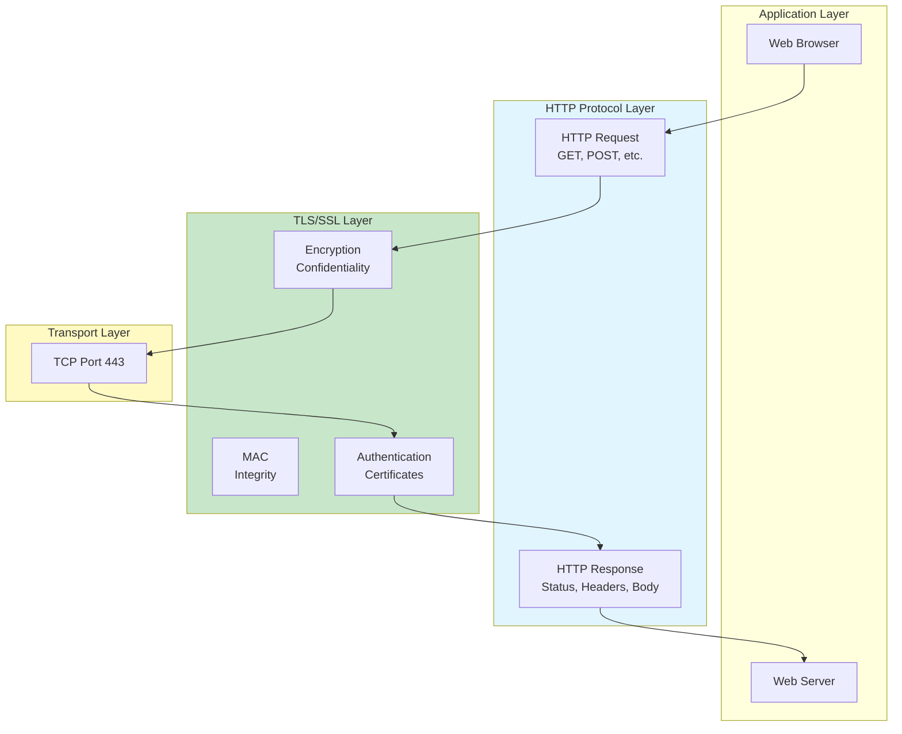
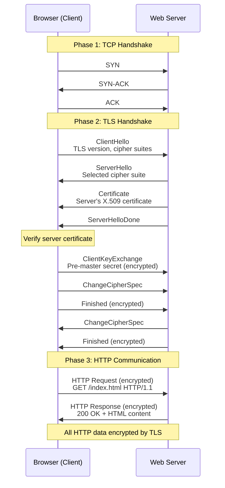
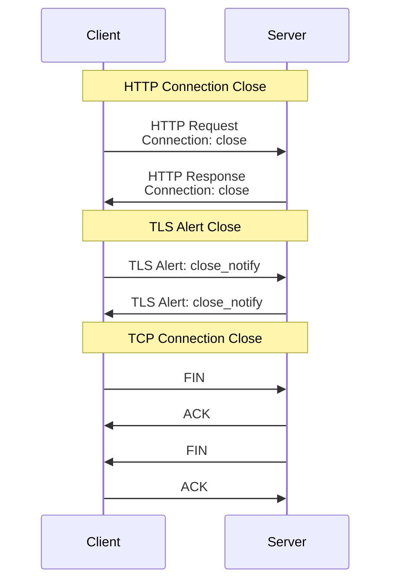
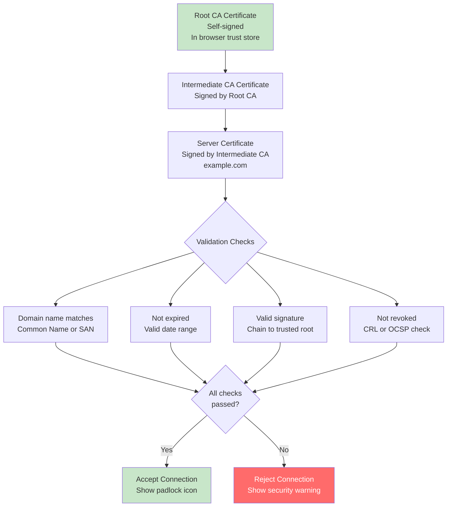
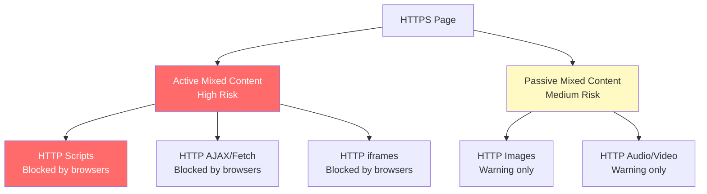
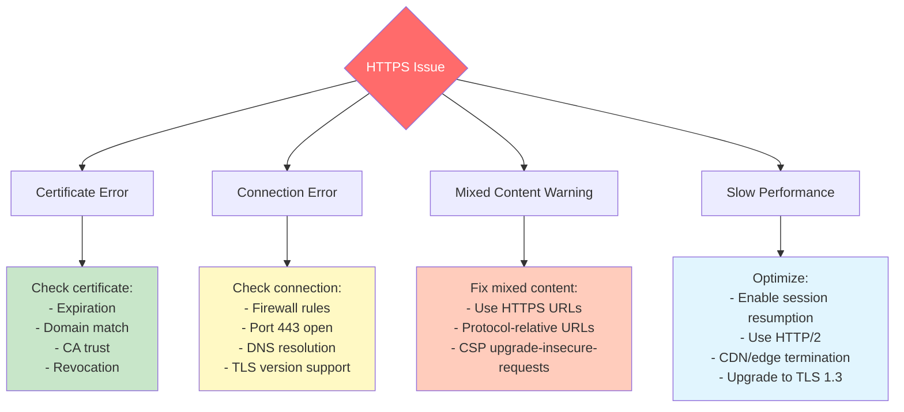

#application-layer #computer-network #cybersecurity #web #web-security #http #https #protocol #client-server #tls #ssl

- HTTPS (HTTP Secure) is HTTP protocol over TLS/SSL encryption.
- <mark class="hltr-yellow">Provides secure communication by encrypting HTTP traffic using TLS protocol</mark>.
- Default port 443 (vs HTTP port 80).

# Overview

## HTTPS Architecture


## Security Properties
HTTPS provides three fundamental security properties:

### 1. Confidentiality
- <mark class="hltr-yellow">HTTP messages encrypted using symmetric encryption (AES, ChaCha20)</mark>.
- Prevents eavesdropping on sensitive data (passwords, cookies, personal information).
- Only client and server can read message contents.

### 2. Integrity
- Message Authentication Code (MAC) ensures data not tampered.
- Detects any modification during transmission.
- Uses HMAC-SHA256 or authenticated encryption (GCM, Poly1305).

### 3. Authentication
- Server proves identity using X.509 certificate.
- Certificate signed by trusted Certificate Authority (CA).
- Client verifies server's identity before sending sensitive data.
- Optional client certificate authentication.

# HTTPS Connection Establishment

## Full Connection Flow


## Step-by-Step Process

### Step 1: DNS Resolution
```bash
# Client resolves domain to IP address
nslookup example.com
# Returns: 93.184.216.34
```

### Step 2: TCP Connection
```
Client connects to server:443
- Three-way TCP handshake
- Establishes reliable connection
```

### Step 3: TLS Handshake
1. **ClientHello**: Client sends supported TLS versions and cipher suites
2. **ServerHello**: Server selects TLS version and cipher suite
3. **Certificate**: Server sends X.509 certificate
4. **Certificate Verification**: Client validates certificate
   - Check CA signature
   - Verify domain name matches
   - Check expiration date
   - Check revocation status (CRL/OCSP)
5. **Key Exchange**: Establish shared secret
6. **ChangeCipherSpec**: Switch to encrypted communication
7. **Finished**: Verify handshake integrity

### Step 4: HTTP Communication
```
All HTTP messages encrypted and authenticated:
- HTTP requests (GET, POST, PUT, DELETE)
- HTTP responses (status codes, headers, body)
- Cookies, authentication tokens
- Form data, API calls
```

# HTTP Over TLS Behavior

## Opening HTTPS Connection
- User agent acts as both HTTP client and TLS client.
- <mark class="hltr-yellow">Client initiates TLS handshake before sending any HTTP data</mark>.
- HTTP requests/responses treated as application data by TLS.
- All standard HTTP behavior preserved.

### URL Scheme
```
HTTP:  http://example.com/page
       - Port 80 (default)
       - Unencrypted

HTTPS: https://example.com/page
       - Port 443 (default)
       - TLS encrypted
```

## Closing HTTPS Connection

### Proper Closure


### Connection Header
- `Connection: close` in HTTP header signals intent to close.
- <mark class="hltr-yellow">Both sides send TLS `close_notify` alert before TCP close</mark>.
- Ensures graceful shutdown and data integrity.

### Incomplete Close
- **Incomplete close**: TCP connection closed without `close_notify`
- May indicate:
  - Network error
  - Premature termination
  - Potential truncation attack
- Browsers may show warning or refuse partial content

## Persistent Connections (Keep-Alive)
```
HTTP/1.1 default: Keep-Alive
- Multiple HTTP requests over single TLS connection
- Reduces TLS handshake overhead
- Faster subsequent requests

Connection: keep-alive (default in HTTP/1.1)
Keep-Alive: timeout=5, max=100
```

# Certificate Validation

## Certificate Chain


## Certificate Validation Errors

### Common Certificate Errors
```
Error                           | Meaning
--------------------------------|------------------------------------
ERR_CERT_AUTHORITY_INVALID      | CA not trusted
ERR_CERT_COMMON_NAME_INVALID    | Domain name mismatch
ERR_CERT_DATE_INVALID           | Certificate expired or not yet valid
ERR_CERT_REVOKED                | Certificate revoked by CA
ERR_CERT_WEAK_SIGNATURE         | Weak signature algorithm (SHA-1)
ERR_SSL_PROTOCOL_ERROR          | TLS handshake failed
ERR_SSL_VERSION_OR_CIPHER_MISMATCH | Incompatible TLS version/cipher
```

### Certificate Revocation
**Two methods to check if certificate is revoked**:

**1. CRL (Certificate Revocation List)**:
```
- CA publishes list of revoked certificates
- Client downloads and checks CRL
- Drawback: Large files, frequent updates needed
```

**2. OCSP (Online Certificate Status Protocol)**:
```
- Client queries CA's OCSP responder
- Real-time revocation status check
- Faster and more efficient than CRL
```

**OCSP Stapling**:
```
- Server fetches OCSP response and caches it
- Server "staples" response to certificate during handshake
- Reduces client-side OCSP queries
- Better privacy (CA doesn't see client requests)
```

# HTTPS Security Features

## HTTP Strict Transport Security (HSTS)
- <mark class="hltr-yellow">Forces browsers to use HTTPS for all connections to domain</mark>.
- Prevents protocol downgrade attacks.
- Sent via HTTP header.

### HSTS Header
```http
Strict-Transport-Security: max-age=31536000; includeSubDomains; preload

Parameters:
- max-age: Duration (seconds) to remember HTTPS-only policy
- includeSubDomains: Apply to all subdomains
- preload: Include in browser preload list
```

### HSTS Preload List
```
- Hard-coded list in browsers (Chrome, Firefox, Safari)
- Domain enforced as HTTPS-only from first visit
- Submit domain to: hstspreload.org
- Requires:
  - Valid HTTPS certificate
  - Redirect HTTP to HTTPS
  - HSTS header on base domain
  - max-age ≥ 31536000 (1 year)
```

## HTTP Public Key Pinning (HPKP) - Deprecated
**Note**: HPKP deprecated in favor of Certificate Transparency and Expect-CT.

- Allowed website to specify which CA public keys are valid.
- Too risky if configured incorrectly (permanent lockout).
- Replaced by Expect-CT and Certificate Transparency logs.

## Certificate Transparency (CT)
- Public log of all issued certificates.
- Detects misissued or fraudulent certificates.
- CAs must log certificates to CT logs.
- Browsers require CT compliance for EV certificates.

```
CT Log Process:
1. CA issues certificate
2. CA submits certificate to CT log
3. CT log returns Signed Certificate Timestamp (SCT)
4. Server presents SCT during TLS handshake
5. Browser verifies SCT
```

# Mixed Content

## Mixed Content Types


### Active Mixed Content
**Blocked by modern browsers**:
- `<script src="http://...">`
- `<link href="http://..." rel="stylesheet">`
- `<iframe src="http://...">`
- `XMLHttpRequest` to HTTP URL
- `fetch()` to HTTP URL
- CSS `@import url("http://...")`

**Danger**: Can compromise entire page security.

### Passive Mixed Content
**Warned but allowed** (gradually being blocked):
- ``
- `<audio src="http://...">`
- `<video src="http://...">`

**Recommendation**: Use HTTPS for all resources or protocol-relative URLs.

### Content Security Policy (CSP)
```http
Content-Security-Policy: upgrade-insecure-requests

Automatically upgrades HTTP requests to HTTPS:
- http://example.com/image.jpg → https://example.com/image.jpg
```

# Performance Considerations

## TLS Handshake Overhead
```
Full TLS 1.2 Handshake:
- 2 round trips (4 network latencies)
- Public key cryptography (expensive)
- Certificate validation

Typical timing:
- DNS lookup: 20-120ms
- TCP handshake: 1 RTT (50-200ms)
- TLS handshake: 2 RTT (100-400ms)
- HTTP request/response: 1 RTT (50-200ms)

Total: 3-4 RTTs for first request
```

## Optimization Techniques

### 1. TLS Session Resumption
```
Session ID Resumption (TLS 1.2):
- Reduces handshake to 1 RTT
- Reuses master secret from previous session
- Saves ~100-200ms per connection

Session Tickets (RFC 5077):
- Server sends encrypted session state
- Client presents ticket to resume
- No server-side storage required
```

### 2. TLS 1.3 Improvements
```
TLS 1.3 advantages:
- 1-RTT handshake (vs 2-RTT in TLS 1.2)
- 0-RTT resumption for returning clients
- Simpler, more secure cipher suites
- Faster connection establishment

0-RTT (Zero Round Trip):
- Client sends encrypted data in first flight
- No handshake delay for resumed connections
- Caveat: 0-RTT data not replay-protected
```

### 3. HTTP/2 over HTTPS
```
HTTP/2 benefits:
- Multiplexing: Multiple requests over single connection
- Header compression (HPACK)
- Server push
- Binary protocol (more efficient)

Requires TLS (de facto standard)
```

### 4. CDN and Edge Termination
```
TLS termination at edge:
- CDN terminates TLS close to user
- Reduces latency for TLS handshake
- Origin connection can use HTTP (if trusted network)

Example: CloudFlare, Akamai, Fastly
```

## Performance Monitoring
```bash
# Measure HTTPS connection time with curl
curl -w "
    DNS lookup:        %{time_namelookup}s
    TCP handshake:     %{time_connect}s
    TLS handshake:     %{time_appconnect}s
    TTFB:              %{time_starttransfer}s
    Total time:        %{time_total}s
" -o /dev/null -s https://example.com

# Example output:
#     DNS lookup:        0.012s
#     TCP handshake:     0.085s (includes DNS)
#     TLS handshake:     0.223s (includes TCP)
#     TTFB:              0.350s
#     Total time:        0.452s
```

# Practical Configuration

## Web Server Configuration

### Nginx
```nginx
server {
    listen 443 ssl http2;
    server_name example.com;

    # Certificates
    ssl_certificate /path/to/fullchain.pem;
    ssl_certificate_key /path/to/privkey.pem;

    # TLS versions
    ssl_protocols TLSv1.2 TLSv1.3;

    # Cipher suites
    ssl_ciphers 'ECDHE-ECDSA-AES256-GCM-SHA384:ECDHE-RSA-AES256-GCM-SHA384:ECDHE-ECDSA-CHACHA20-POLY1305:ECDHE-RSA-CHACHA20-POLY1305';
    ssl_prefer_server_ciphers on;

    # Session resumption
    ssl_session_cache shared:SSL:10m;
    ssl_session_timeout 10m;
    ssl_session_tickets off;

    # OCSP Stapling
    ssl_stapling on;
    ssl_stapling_verify on;
    ssl_trusted_certificate /path/to/chain.pem;

    # HSTS
    add_header Strict-Transport-Security "max-age=31536000; includeSubDomains; preload" always;

    # Security headers
    add_header X-Frame-Options "SAMEORIGIN" always;
    add_header X-Content-Type-Options "nosniff" always;
    add_header X-XSS-Protection "1; mode=block" always;

    location / {
        root /var/www/html;
        index index.html;
    }
}

# HTTP to HTTPS redirect
server {
    listen 80;
    server_name example.com;
    return 301 https://$server_name$request_uri;
}
```

### Apache
```apache
<VirtualHost *:443>
    ServerName example.com

    # TLS configuration
    SSLEngine on
    SSLCertificateFile /path/to/cert.pem
    SSLCertificateKeyFile /path/to/privkey.pem
    SSLCertificateChainFile /path/to/chain.pem

    # TLS versions
    SSLProtocol all -SSLv3 -TLSv1 -TLSv1.1
    SSLCipherSuite ECDHE-ECDSA-AES256-GCM-SHA384:ECDHE-RSA-AES256-GCM-SHA384
    SSLHonorCipherOrder on

    # Session cache
    SSLSessionCache "shmcb:/var/cache/mod_ssl/scache(512000)"
    SSLSessionCacheTimeout 300

    # OCSP Stapling
    SSLUseStapling on
    SSLStaplingCache "shmcb:/var/run/ocsp(128000)"

    # HSTS
    Header always set Strict-Transport-Security "max-age=31536000; includeSubDomains; preload"

    DocumentRoot /var/www/html
</VirtualHost>
```

## Testing HTTPS Configuration
```bash
# Test with SSL Labs (online)
# Visit: https://www.ssllabs.com/ssltest/analyze.html?d=example.com

# Test with testssl.sh (command-line)
./testssl.sh https://example.com

# Check certificate details
openssl s_client -connect example.com:443 -servername example.com < /dev/null

# Verify HSTS header
curl -I https://example.com | grep -i strict

# Check mixed content
# Use browser DevTools Console
# Mixed content warnings appear in console
```

# Common HTTPS Issues

## Troubleshooting Guide


***
# References
1. Cryptography and Network Security - William Stallings - 8th Edition - Pearson - 2019.
	1. Chapter 17: Transport-Level Security.
		1. Section 17.3: HTTPS.
2. HTTP Over TLS - RFC 2818 - IETF - 2000.
	1. https://tools.ietf.org/html/rfc2818
3. HTTP/1.1 - RFC 7230-7235 - IETF - 2014.
	1. https://tools.ietf.org/html/rfc7230
4. HTTP Strict Transport Security (HSTS) - RFC 6797 - IETF - 2012.
	1. https://tools.ietf.org/html/rfc6797
5. HTTPS Everywhere - EFF - 2024.
	1. https://www.eff.org/https-everywhere
6. Mozilla Web Security Guidelines.
	1. https://infosec.mozilla.org/guidelines/web_security
7. [Secure Socket Layer (SSL) - Transport Layer Security (TLS)](../transport-layer/Secure%20Socket%20Layer%20(SSL)%20-%20Transport%20Layer%20Security%20(TLS).md) for underlying TLS protocol details.
8. [Hyper Text Transfer Protocol (HTTP)](../../computer-network/application-layer/http/Hyper%20Text%20Transfer%20Protocol%20(HTTP).md) for HTTP protocol fundamentals.
