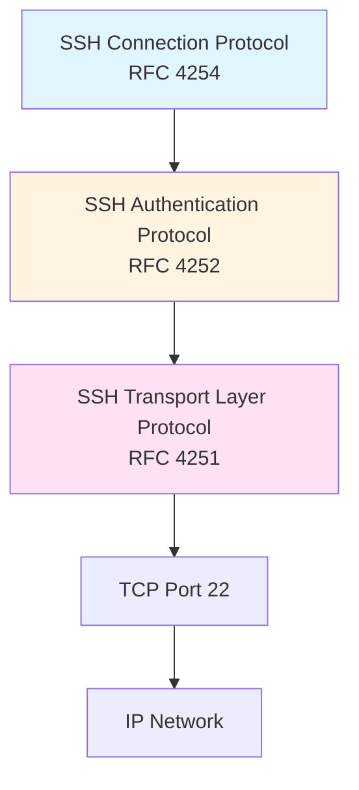
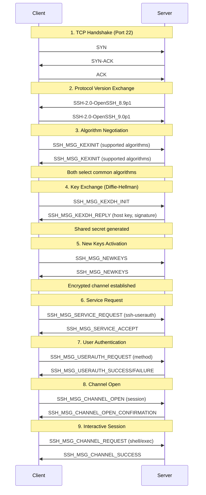
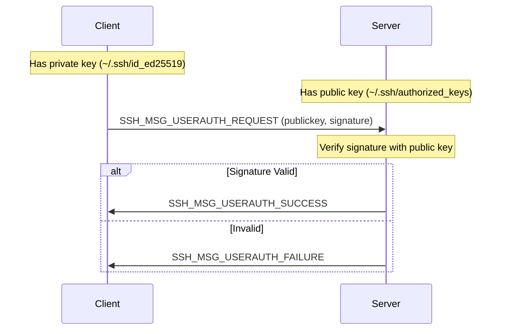
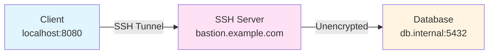
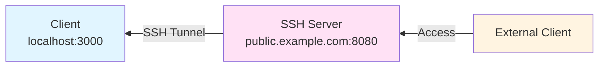

#ssh #cybersecurity #application-layer #computer-network #protocol #client-server #transport-layer #mac #tcp #encryption #authentication
# Overview
- ==Cryptographic network protocol== for secure remote system administration and file transfer
- Operates over ==TCP port 22== (default)
- Provides strong authentication, encrypted communication, and data integrity
- Critical for remote server management, secure file transfer, tunneling, and bastion host access
# Architecture
- SSH protocol stack consists of three ==layered protocols==:


### Layer Responsibilities

| Layer | Purpose | Key Features |
|-------|---------|--------------|
| **Transport Layer** | Secure channel establishment | Encryption, integrity, compression, host authentication |
| **Authentication Layer** | Client authentication | Public key, password, keyboard-interactive methods |
| **Connection Layer** | Multiplexed channels | Interactive sessions, port forwarding, X11 forwarding |

## SSH Transport Layer Protocol (RFC 4253)
### Host Keys
- Each SSH server has unique ==host key pair== (public/private)
- Host keys managed by:
	- ==Local database== (`~/.ssh/known_hosts` on client)
	- ==Certificate Authorities== (CA): DigiCert, Cloudflare for enterprise PKI
- **Purpose**: Authenticate server identity, prevent man-in-the-middle attacks
- **Algorithm options**: RSA, ECDSA, Ed25519 (recommended for modern systems)
### SSH Packet Format

```
 0                   1                   2                   3
 0 1 2 3 4 5 6 7 8 9 0 1 2 3 4 5 6 7 8 9 0 1 2 3 4 5 6 7 8 9 0 1
+-+-+-+-+-+-+-+-+-+-+-+-+-+-+-+-+-+-+-+-+-+-+-+-+-+-+-+-+-+-+-+-+
|                     Packet Length (uint32)                    |
+-+-+-+-+-+-+-+-+-+-+-+-+-+-+-+-+-+-+-+-+-+-+-+-+-+-+-+-+-+-+-+-+
|  Padding Len  |                                               |
+-+-+-+-+-+-+-+-+                                               +
|                         Payload Data                          |
+                                                               +
|                          (variable)                           |
+-+-+-+-+-+-+-+-+-+-+-+-+-+-+-+-+-+-+-+-+-+-+-+-+-+-+-+-+-+-+-+-+
|                      Random Padding                           |
+-+-+-+-+-+-+-+-+-+-+-+-+-+-+-+-+-+-+-+-+-+-+-+-+-+-+-+-+-+-+-+-+
|                      MAC (Message Authentication Code)        |
+-+-+-+-+-+-+-+-+-+-+-+-+-+-+-+-+-+-+-+-+-+-+-+-+-+-+-+-+-+-+-+-+
```

**Field descriptions:**
- **Packet Length**: Total packet size (excluding MAC and length field itself)
- **Padding Length**: Size of random padding (4-255 bytes)
- **Payload**: Actual SSH message data
- **Random Padding**: Prevents traffic analysis attacks
- **MAC**: HMAC for integrity verification (e.g., HMAC-SHA256)

### SSH Connection Establishment



### Algorithm Negotiation

During `SSH_MSG_KEXINIT`, client and server exchange supported algorithms:

| Algorithm Type | Purpose | Common Choices |
|----------------|---------|----------------|
| **KEX** (Key Exchange) | Generate shared secret | `curve25519-sha256`, `diffie-hellman-group14-sha256` |
| **Host Key** | Server authentication | `ssh-ed25519`, `ecdsa-sha2-nistp256`, `rsa-sha2-512` |
| **Encryption** | Symmetric cipher | `chacha20-poly1305@openssh.com`, `aes256-gcm@openssh.com` |
| **MAC** | Message integrity | `hmac-sha2-256`, `hmac-sha2-512` |
| **Compression** | Reduce bandwidth | `none`, `zlib@openssh.com` |

**Example negotiation:**
```
Client offers: curve25519-sha256, diffie-hellman-group14-sha256
Server offers: curve25519-sha256, ecdh-sha2-nistp256
Result: curve25519-sha256 (first common algorithm)
```

### Key Exchange Methods
#### Diffie-Hellman Group Exchange
- Generates ==ephemeral session keys== (forward secrecy)
- Server cannot decrypt past sessions even if host key compromised
- **Process**:
	1. Client sends random value (e)
	2. Server responds with f, server host key, signature
	3. Both compute shared secret K = g^(e*f) mod p
	4. Derive encryption/MAC keys from K using hash function
#### Elliptic Curve Diffie-Hellman (ECDH)
- Modern alternative using ==elliptic curve cryptography==
- Faster, smaller keys than traditional DH
- **Recommended**: `curve25519-sha256` (high security, performance)
## SSH Authentication Protocol (RFC 4252)
### Authentication Methods

#### Public Key Authentication

**Workflow:**


**Key generation:**
```bash
# Generate Ed25519 key pair (recommended)
ssh-keygen -t ed25519 -C "user@example.com"

# Output:
# ~/.ssh/id_ed25519 (private key - keep secret)
# ~/.ssh/id_ed25519.pub (public key - copy to server)

# Alternative: RSA 4096-bit
ssh-keygen -t rsa -b 4096 -C "user@example.com"

# Copy public key to server
ssh-copy-id user@server.example.com
# Or manually:
cat ~/.ssh/id_ed25519.pub | ssh user@server 'cat >> ~/.ssh/authorized_keys'
```
#### Password Authentication
- User provides password over ==encrypted channel==
- Less secure than public key (vulnerable to brute force)
- Often disabled in production: `PasswordAuthentication no` in `sshd_config`
#### Keyboard-Interactive Authentication
- Supports multi-factor authentication (MFA)
- Server sends ==challenge prompts== (e.g., OTP codes)
- Flexible for integration with PAM, RADIUS, LDAP
#### Host-Based Authentication
- Authenticates based on ==source hostname==
- Requires `/etc/ssh/shosts.equiv` or `~/.shosts`
- Rarely used (deprecated due to IP spoofing risks)
### Multi-Factor Authentication (MFA)
```Shell title='MFA for SSH'
# Install Google Authenticator PAM module
sudo apt install libpam-google-authenticator

# Configure PAM
echo "auth required pam_google_authenticator.so" | \
  sudo tee -a /etc/pam.d/sshd

# Enable in SSH config
sudo sed -i 's/ChallengeResponseAuthentication no/ChallengeResponseAuthentication yes/' \
  /etc/ssh/sshd_config

# Restart SSH daemon
sudo systemctl restart sshd

# Setup MFA for user
google-authenticator
# Scan QR code with authenticator app (Google Authenticator, Authy)
```
## SSH Connection Protocol (RFC 4254)
### Channel Types
- The Connection Protocol multiplexes multiple ==logical channels== over single SSH connection:

| Channel Type | Purpose | Use Case |
|--------------|---------|----------|
| **session** | Remote command execution | Interactive shell, `ssh user@host command` |
| **x11** | X Window System forwarding | GUI applications over SSH |
| **forwarded-tcpip** | Remote port forwarding | Expose local service to remote network |
| **direct-tcpip** | Local port forwarding | Access remote service through SSH tunnel |
### Channel Open Request
```
Client → Server: SSH_MSG_CHANNEL_OPEN
{
  channel_type: "session"
  sender_channel: 0 (client channel ID)
  initial_window_size: 65536 (flow control)
  maximum_packet_size: 32768
}

Server → Client: SSH_MSG_CHANNEL_OPEN_CONFIRMATION
{
  recipient_channel: 0
  sender_channel: 100 (server channel ID)
  initial_window_size: 65536
  maximum_packet_size: 32768
}
```
### Port Forwarding (SSH Tunneling)
#### Local Port Forwarding
- Forward connections from ==local machine port== to remote destination through SSH server:


```Shell
# Forward local port 8080 to remote database
ssh -L 8080:db.internal:5432 user@bastion.example.com

# Access database through tunnel
psql -h localhost -p 8080 -U dbuser database_name

# Common use cases:
# - Access internal services from outside network
# - Bypass firewall restrictions
# - Encrypt unencrypted protocols (HTTP, MySQL, PostgreSQL)
```
#### Remote Port Forwarding
- Forward connections from ==remote server port== back to local machine:


```Shell
# Expose local web server (port 3000) on remote server port 8080
ssh -R 8080:localhost:3000 user@public.example.com

# External users access: http://public.example.com:8080
# Traffic tunneled to localhost:3000

# Common use cases:
# - Expose local development server for testing
# - Provide temporary external access to internal service
# - Webhook testing (GitHub webhooks to local dev environment)
```
#### Dynamic Port Forwarding (SOCKS Proxy)
- Create ==SOCKS proxy== for routing arbitrary TCP connections:
```Shell
# Create SOCKS5 proxy on port 1080
ssh -D 1080 user@proxy.example.com

# Configure browser to use SOCKS proxy:
# Host: localhost, Port: 1080

# Or use with curl
curl --socks5 localhost:1080 https://internal.example.com

# Use case: Route all browser traffic through SSH tunnel
```

### X11 Forwarding
- Run GUI applications on remote server, display on local machine:
```bash
# Enable X11 forwarding (server-side: /etc/ssh/sshd_config)
# X11Forwarding yes

# Connect with X11 forwarding
ssh -X user@server.example.com

# Or with trusted X11 forwarding (less secure, faster)
ssh -Y user@server.example.com

# Run GUI application
firefox &
gimp &
xclock &  # Test X11 forwarding

# How it works:
# 1. SSH sets DISPLAY environment variable (e.g., localhost:10.0)
# 2. X11 requests forwarded through SSH tunnel to local X server
# 3. Local X server renders GUI
```
***
# References
1. [RFC 4251 - SSH Protocol Architecture](https://tools.ietf.org/html/rfc4251)
2. [RFC 4252 - SSH Authentication Protocol](https://tools.ietf.org/html/rfc4252)
3. [RFC 4253 - SSH Transport Layer Protocol](https://tools.ietf.org/html/rfc4253)
4. [RFC 4254 - SSH Connection Protocol](https://tools.ietf.org/html/rfc4254)
5. [OpenSSH Official Documentation](https://www.openssh.com/manual.html)
6. SSH: The Secure Shell - The Definitive Guide, 2nd Edition - Daniel J. Barrett, Richard E. Silverman, Robert G. Byrnes
7. [Mozilla SSH Security Guidelines](https://infosec.mozilla.org/guidelines/openssh)
8. [AWS EC2 Instance Connect Documentation](https://docs.aws.amazon.com/AWSEC2/latest/UserGuide/Connect-using-EC2-Instance-Connect.html)
9. [GCP OS Login Documentation](https://cloud.google.com/compute/docs/oslogin)
10. [Azure Bastion Documentation](https://docs.microsoft.com/en-us/azure/bastion/bastion-overview)
11. [SSH Keygen OpenSSL](../../operating-system/cryptography/Generate%20secret%20key%20openSSL.md) for key generation reference
