#ip #protocol #network-layer #computer-network #cybersecurity #ipsec #ike #vpn #encryption #authentication

# Introduction

**<mark class="hltr-yellow">IP Security (IPsec)</mark>** is a protocol suite for securing Internet Protocol (IP) communications by authenticating and encrypting each IP packet in a communication session. IPsec operates at the network layer (Layer 3) of the OSI model, providing security services for all protocols running above IP.

## Why IPsec?

The original IP protocol was designed without security in mind:
- No confidentiality - packets transmitted in plaintext
- No authentication - packets could be forged
- No integrity - packets could be modified in transit
- No replay protection - packets could be captured and retransmitted

IPsec addresses these vulnerabilities by providing:
1. **Access control** - Only authorized entities can communicate
2. **Connectionless integrity** - Detect packet modification
3. **Data origin authentication** - Verify packet sender identity
4. **Rejection of replayed packets** - Prevent replay attacks
5. **Confidentiality** - Encrypt packet contents
6. **Limited traffic flow confidentiality** - Hide communication patterns

## IPsec Timeline

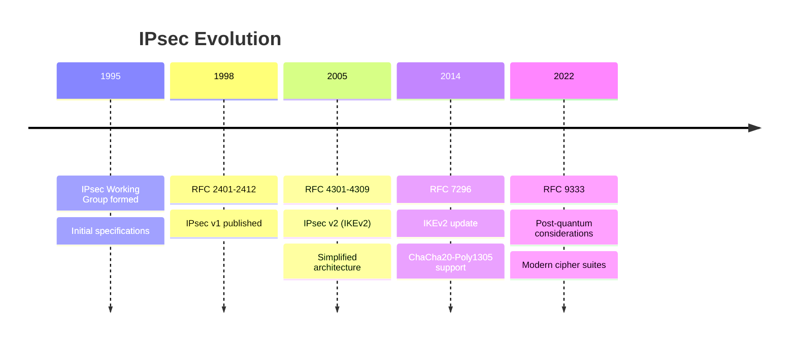

# IPsec Architecture

## Protocol Stack

IPsec consists of three main components:

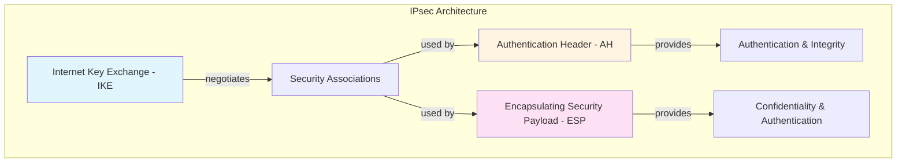

### Component Overview

| Component | Protocol | Port | Function |
|-----------|----------|------|----------|
| **IKE** | UDP | 500, 4500 | Key negotiation and SA management |
| **AH** | IP Protocol 51 | N/A | Authentication and integrity only |
| **ESP** | IP Protocol 50 | N/A | Encryption, authentication, and integrity |

## IPsec Database Architecture

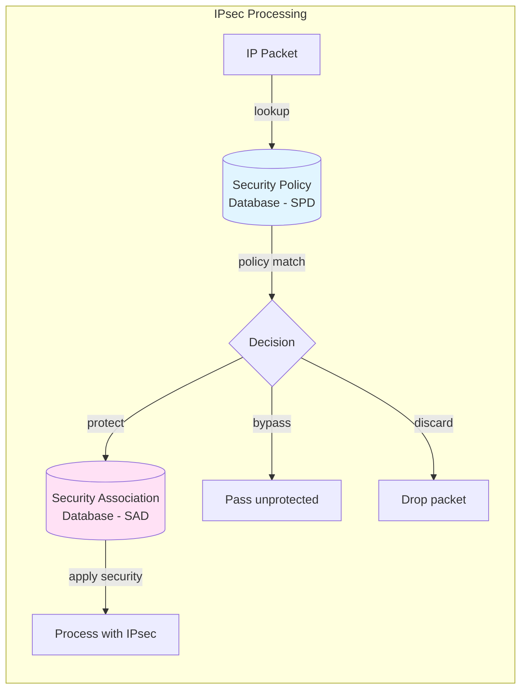

# Security Associations (SA)

## Overview

A <mark class="hltr-yellow">**Security Association (SA)**</mark> is a <mark class="hltr-yellow">**one-way logical connection**</mark> between a sender and receiver that defines security services for traffic passing through it. For bidirectional communication, two SAs are required (one for each direction).

## SA Identification

Each SA is uniquely identified by three parameters:

1. **Security Parameter Index (SPI)** - 32-bit value chosen by the destination
2. **IP Destination Address** - Unicast, broadcast, or multicast
3. **Security Protocol Identifier** - AH or ESP

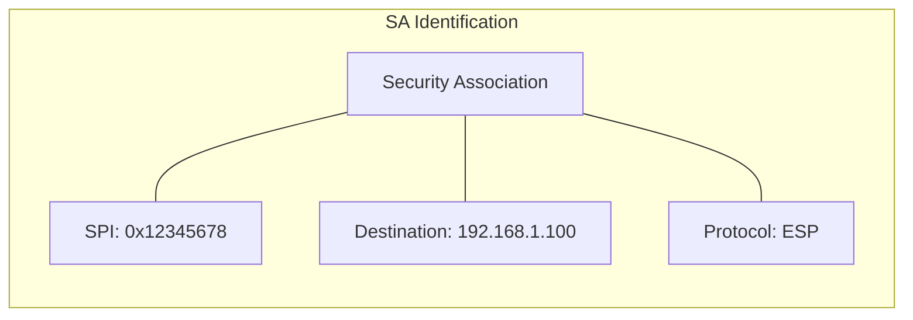

**Example SA Triplet:**
```
SA = (SPI=0x12345678, Destination=192.168.1.100, Protocol=ESP)
```

## Security Association Database (SAD)

The <mark class="hltr-yellow">**Security Association Database (SAD)**</mark> contains parameters for each active SA. Each SAD entry includes:

| Field | Description |
|-------|-------------|
| **SPI** | Security Parameter Index |
| **Sequence Number Counter** | Current outbound sequence number |
| **Sequence Counter Overflow** | Flag indicating overflow |
| **Anti-replay Window** | Used to detect duplicate packets |
| **AH Information** | Authentication algorithm, keys, key lifetimes |
| **ESP Information** | Encryption and authentication algorithms, keys, IVs |
| **Lifetime** | Time or byte count until SA expires |
| **IPsec Protocol Mode** | Transport, tunnel, or wildcard |
| **Path MTU** | Maximum transmission unit for this SA |

### SAD Entry Example

```
SAD Entry:
  SPI: 0x12345678
  Destination: 192.168.1.100
  Protocol: ESP
  Mode: Tunnel
  Encryption Algorithm: AES-256-GCM
  Encryption Key: [256-bit key]
  Authentication Algorithm: HMAC-SHA256
  Authentication Key: [256-bit key]
  Sequence Number: 12534
  Lifetime: 3600 seconds or 100 MB
  Anti-replay Window Size: 64
```

## Security Policy Database (SPD)

The <mark class="hltr-yellow">**Security Policy Database (SPD)**</mark> specifies security policies that determine how to handle IP traffic. The SPD is consulted for each outbound and inbound packet to determine:
- **BYPASS** - Forward without IPsec processing
- **PROTECT** - Apply IPsec protection using specified SA
- **DISCARD** - Drop the packet

### SPD Selector Fields

Each SPD entry contains selector fields to match packets:

| Selector | Description |
|----------|-------------|
| **Remote IP Address** | Source (inbound) or destination (outbound) address/range |
| **Local IP Address** | Destination (inbound) or source (outbound) address/range |
| **Next Layer Protocol** | TCP, UDP, ICMP, etc. |
| **Local Port** | Source/destination port for local system |
| **Remote Port** | Source/destination port for remote system |
| **User ID** | Local user identifier |

### SPD Entry Example

```
SPD Entry #1:
  Source Address: 10.0.1.0/24
  Destination Address: 10.0.2.0/24
  Protocol: TCP
  Destination Port: 443
  Action: PROTECT
  SA Parameters:
    - Protocol: ESP
    - Mode: Tunnel
    - Encryption: AES-256-GCM
    - Authentication: HMAC-SHA256

SPD Entry #2:
  Source Address: 10.0.1.0/24
  Destination Address: 8.8.8.8
  Protocol: UDP
  Destination Port: 53
  Action: BYPASS

SPD Entry #3:
  Source Address: 0.0.0.0/0
  Destination Address: 192.168.100.0/24
  Protocol: Any
  Action: DISCARD
```

# IPsec Protocols

## Authentication Header (AH)

<mark class="hltr-yellow">**Authentication Header (AH)**</mark> provides:
- Data origin authentication
- Connectionless integrity
- Anti-replay protection

**AH does NOT provide confidentiality** - packet contents remain visible.

### AH Packet Format

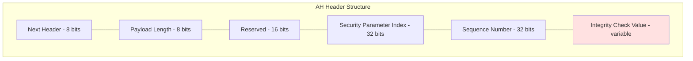

| Field | Size | Description |
|-------|------|-------------|
| **Next Header** | 8 bits | Identifies next header (TCP, UDP, etc.) |
| **Payload Length** | 8 bits | AH length in 4-byte units, minus 2 |
| **Reserved** | 16 bits | Reserved for future use (set to 0) |
| **SPI** | 32 bits | Security Parameter Index |
| **Sequence Number** | 32 bits | Monotonically increasing counter |
| **ICV** | Variable | Integrity Check Value (authentication data) |

### AH Authentication Coverage

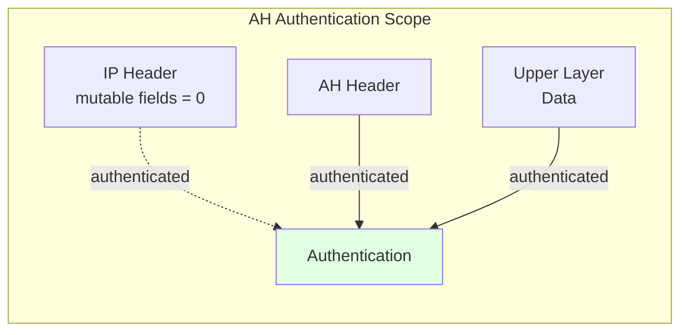

**AH authenticates:**
- Entire IP header (with mutable fields set to zero)
- AH header itself
- Upper layer protocol data

**Mutable fields excluded from authentication:**
- TOS/DSCP (can change en route)
- Flags and Fragment Offset (fragmentation)
- TTL/Hop Limit (decremented by routers)
- Header Checksum (recalculated at each hop)

## Encapsulating Security Payload (ESP)

<mark class="hltr-yellow">**Encapsulating Security Payload (ESP)**</mark> provides:
- Confidentiality (encryption)
- Data origin authentication
- Connectionless integrity
- Anti-replay protection
- Limited traffic flow confidentiality

### ESP Packet Format

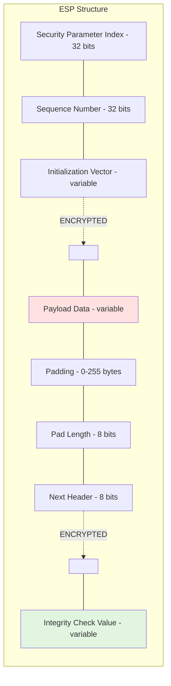

| Field | Encrypted | Authenticated | Description |
|-------|-----------|---------------|-------------|
| **SPI** | ❌ | ✅ | Security Parameter Index |
| **Sequence Number** | ❌ | ✅ | Anti-replay counter |
| **IV** | ❌ | ✅ | Initialization Vector (if required by cipher) |
| **Payload Data** | ✅ | ✅ | Protected data (IP packet or upper layer) |
| **Padding** | ✅ | ✅ | Required by cipher or for alignment |
| **Pad Length** | ✅ | ✅ | Number of padding bytes |
| **Next Header** | ✅ | ✅ | Identifies protected data type |
| **ICV** | ❌ | N/A | Integrity Check Value |

### ESP Processing Order

<mark class="hltr-yellow">**The ICV is calculated AFTER encryption**</mark> to:
1. Prevent computational DoS attacks (decrypt only authenticated packets)
2. Align with authenticated encryption modes (AES-GCM, ChaCha20-Poly1305)

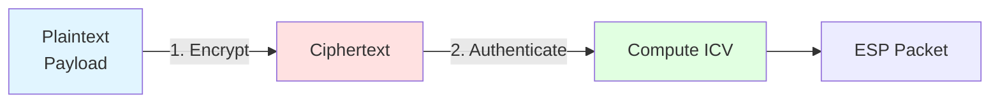

### ESP Padding

Padding is added for three reasons:

1. **Cipher Requirements** - Block ciphers require data to be multiple of block size
2. **Alignment** - Ensure correct byte alignment (typically 4-byte boundary)
3. **Traffic Flow Confidentiality** - Hide actual payload size

```
Padding Format:
┌──────────────────────────────────┐
│ 0x01 0x02 0x03 ... 0x0N │ 0x0N │
│      Padding Bytes       │ Len  │
└──────────────────────────────────┘
```

**Example with AES-128-CBC (16-byte block size):**
```
Payload: 45 bytes
Required padding: 16 - (45 + 2) % 16 = 3 bytes
Padding: 0x01 0x02 0x03
Pad Length: 0x03
Total encrypted size: 45 + 3 + 2 = 50 bytes (rounded up to 64)
```

## AH vs ESP Comparison

| Feature | AH | ESP |
|---------|----|----|
| **Confidentiality** | ❌ No | ✅ Yes |
| **Authentication** | ✅ Yes | ✅ Yes (optional) |
| **Integrity** | ✅ Yes | ✅ Yes (optional) |
| **Anti-replay** | ✅ Yes | ✅ Yes |
| **IP Header Protection** | ✅ Yes (immutable fields) | ❌ No |
| **NAT Traversal** | ❌ Difficult | ✅ Supported (NAT-T) |
| **Protocol Number** | 51 | 50 |
| **Typical Use Case** | Authentication only | Most modern deployments |

**Recommendation:** <mark class="hltr-yellow">Use ESP with authentication instead of AH</mark> because:
- ESP provides all AH features plus encryption
- ESP supports NAT traversal (AH breaks with NAT)
- AH is deprecated in many modern implementations

# IPsec Modes

IPsec operates in two modes that define what parts of the original IP packet are protected.

## Transport Mode

<mark class="hltr-yellow">**Transport Mode**</mark> protects only the upper-layer protocol (TCP, UDP, etc.) while keeping the original IP header intact.

### Transport Mode Packet Structure

**Original IP Packet:**
```
┌────────────┬──────────────────┐
│ IP Header  │    TCP/UDP Data  │
└────────────┴──────────────────┘
```

**ESP Transport Mode:**
```
┌────────────┬────────────┬─────────────────────────────┬─────┐
│ Original   │ ESP Header │ Encrypted TCP/UDP Data      │ ESP │
│ IP Header  │ (SPI, Seq) │ (Payload + Pad + Pad Len + NH)│ ICV │
└────────────┴────────────┴─────────────────────────────┴─────┘
             └────────────── Authenticated ───────────────┘
                            └─── Encrypted ────┘
```

**AH Transport Mode:**
```
┌────────────┬────────────┬──────────────────┐
│ Original   │ AH Header  │   TCP/UDP Data   │
│ IP Header  │ (authenticated)│                │
└────────────┴────────────┴──────────────────┘
└────────── All Authenticated ───────────────┘
```

### Transport Mode Characteristics

| Aspect | Details |
|--------|---------|
| **Protected** | Upper-layer protocol only |
| **IP Header** | Original header preserved |
| **Routing** | No impact on routing |
| **Overhead** | Minimal (only IPsec headers) |
| **Use Case** | End-to-end communication between two hosts |
| **Visibility** | Routers can see source/destination IPs |

### Transport Mode Example

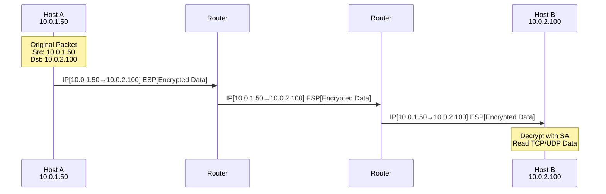

**Security Considerations:**
- ✅ End-to-end encryption between communicating hosts
- ✅ Intermediate routers cannot read payload
- ✅ Lower overhead than tunnel mode
- ❌ Vulnerable to traffic analysis (IP addresses visible)
- ❌ Cannot protect multiple devices behind gateway

## Tunnel Mode

<mark class="hltr-yellow">**Tunnel Mode**</mark> protects the entire original IP packet by encapsulating it within a new IP packet with a new IP header.

### Tunnel Mode Packet Structure

**Original IP Packet:**
```
┌────────────┬──────────────────┐
│ Inner IP   │    TCP/UDP Data  │
│ Header     │                  │
└────────────┴──────────────────┘
```

**ESP Tunnel Mode:**
```
┌────────────┬────────────┬──────────────────────────────────────┬─────┐
│   New IP   │ ESP Header │ Encrypted Inner IP + TCP/UDP Data    │ ESP │
│   Header   │ (SPI, Seq) │ (Original Packet + Pad + PadLen + NH)│ ICV │
└────────────┴────────────┴──────────────────────────────────────┴─────┘
             └────────────────── Authenticated ──────────────────┘
                            └────────── Encrypted ────────────┘
```

**AH Tunnel Mode:**
```
┌────────────┬────────────┬────────────┬──────────────────┐
│   New IP   │ AH Header  │ Inner IP   │   TCP/UDP Data   │
│   Header   │            │ Header     │                  │
└────────────┴────────────┴────────────┴──────────────────┘
└─────────────── All Authenticated ──────────────────────┘
```

### Tunnel Mode Characteristics

| Aspect | Details |
|--------|---------|
| **Protected** | Entire original IP packet |
| **IP Header** | New outer IP header added |
| **Routing** | Based on new outer IP header |
| **Overhead** | Higher (additional IP header + IPsec headers) |
| **Use Case** | VPN gateways, site-to-site VPNs |
| **Visibility** | Original source/destination hidden from routers |

### Tunnel Mode Example - VPN

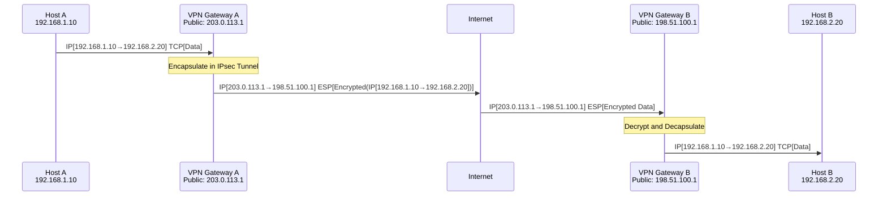

**Security Benefits:**
- ✅ Hides original source and destination addresses
- ✅ Protects entire IP packet including headers
- ✅ Enables site-to-site VPN connectivity
- ✅ Protects traffic flow patterns
- ✅ Allows routing through untrusted networks
- ❌ Higher bandwidth overhead
- ❌ More complex configuration

## Mode Comparison Summary

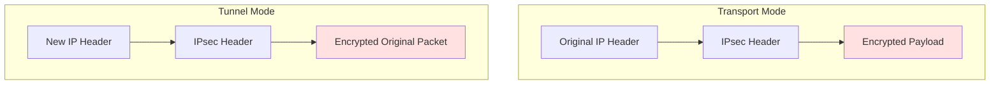

| Criterion | Transport Mode | Tunnel Mode |
|-----------|----------------|-------------|
| **Overhead** | ~50 bytes | ~70 bytes (additional IP header) |
| **Performance** | Better | Slightly worse |
| **Compatibility** | Limited (requires IPsec on both endpoints) | Universal (works with any host) |
| **NAT Traversal** | Possible with NAT-T | Easier with NAT-T |
| **Traffic Analysis** | Vulnerable | Protected |
| **Use Case** | Host-to-host | VPN gateways, site-to-site |

# Anti-Replay Protection

IPsec provides <mark class="hltr-yellow">**anti-replay protection**</mark> using sequence numbers and a sliding window mechanism to detect and reject duplicate or out-of-order packets.

## Sequence Number Mechanism

Each IPsec SA maintains:
- **Sequence Number Counter** - Incremented for each packet sent
- **Sequence Number Range** - 32-bit (0 to 2³² - 1) or 64-bit Extended Sequence Numbers (ESN)
- **Anti-Replay Window** - Bitmap tracking recently received sequence numbers

### Sequence Number Rules

1. **Sender:**
   - Initialize sequence number to 0 when SA is established
   - Increment by 1 for each packet sent
   - If counter reaches maximum (2³² - 1), **must** establish new SA

2. **Receiver:**
   - Verify sequence number falls within anti-replay window
   - Check if sequence number was already received (duplicate detection)
   - Reject packets that fail checks

## Sliding Window Mechanism

The receiver maintains a sliding window (default size W=64) to track recently received packets:

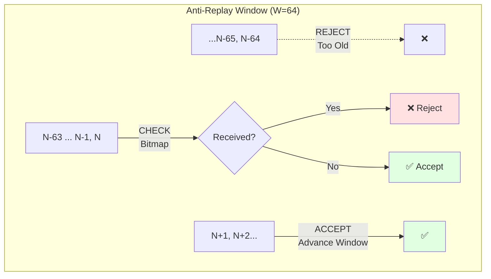

### Window Algorithm

Given:
- **N** = Highest sequence number received so far
- **W** = Window size (typically 64)
- **Bitmap** = Bit array tracking received packets in range [N-W+1, N]

For incoming packet with sequence number **S**:

```
if S > N:
    # New packet advances window
    Accept packet
    Advance window: N = S
    Update bitmap

elif S >= N - W + 1:
    # Within current window
    if bitmap[S] == 1:
        Reject packet (duplicate)
    else:
        Accept packet
        Set bitmap[S] = 1

else:
    # S < N - W + 1 (too old)
    Reject packet
```

### Window Example

Current state: N=100, W=64, valid range = [37, 100]

```
┌─────────────────────────────────────────────────┐
│  Bitmap (64 bits)                               │
│  [37][38][39]...[98][99][100]                   │
│   1   0   1  ...  1   1   1                     │
└─────────────────────────────────────────────────┘
         └── Window ──┘
```

**Incoming packet with S=101:**
- S > N → Accept, advance window to N=101, shift bitmap left
- New valid range: [38, 101]

**Incoming packet with S=95:**
- 95 ≥ 37 (N-W+1) → Within window
- Check bitmap[95]: If 0, accept and set to 1; if 1, reject as duplicate

**Incoming packet with S=30:**
- 30 < 37 → Too old, reject

## Extended Sequence Numbers (ESN)

For high-speed links, 32-bit sequence numbers can wrap quickly:
- At 10 Gbps, sequence numbers exhaust in ~3.4 seconds
- Frequent SA rekeying degrades performance

<mark class="hltr-yellow">**Extended Sequence Numbers (ESN)**</mark> use 64-bit sequence numbers:
- Lower 32 bits transmitted in packet
- Upper 32 bits maintained implicitly by sender/receiver
- Prevents exhaustion: at 10 Gbps, wraps after ~58 years

```
Full ESN = [High 32 bits (implicit)] [Low 32 bits (in packet)]
```

# Internet Key Exchange (IKE)

<mark class="hltr-yellow">**Internet Key Exchange (IKE)**</mark> is the protocol used to establish Security Associations and cryptographic keys for IPsec. IKE operates over UDP port 500 (and port 4500 for NAT traversal).

## IKE Evolution

| Version | RFC | Year | Key Features |
|---------|-----|------|--------------|
| **IKEv1** | RFC 2408/2409 | 1998 | ISAKMP/Oakley, complex state machine, multiple modes |
| **IKEv2** | RFC 4306/7296 | 2005/2014 | Simplified, built-in NAT-T, reduced round trips |

## IKE Architecture

IKE operates in two phases:

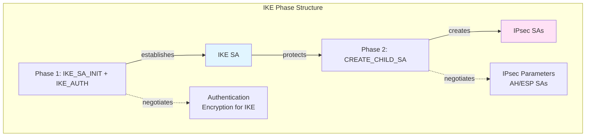

### Phase 1: IKE SA Establishment

**Purpose:** Establish secure IKE channel for Phase 2 negotiation

**IKEv2 Exchange (4 messages, 2 round trips):**

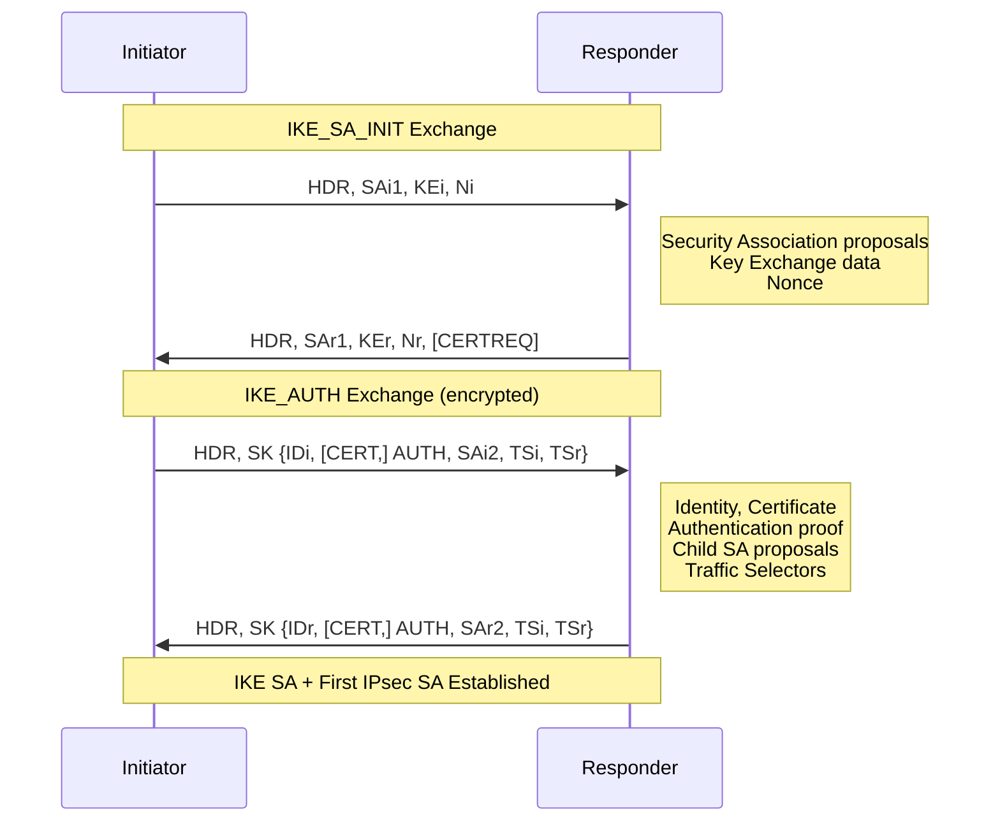

**Negotiated Parameters:**
- Encryption algorithm (AES-128/256, ChaCha20)
- Integrity algorithm (HMAC-SHA256, HMAC-SHA512)
- Diffie-Hellman group (Group 14/19/20/21)
- Authentication method (PSK, RSA, ECDSA)

### Phase 2: IPsec SA Establishment

**Purpose:** Create IPsec SAs for protecting data traffic

**CREATE_CHILD_SA Exchange:**

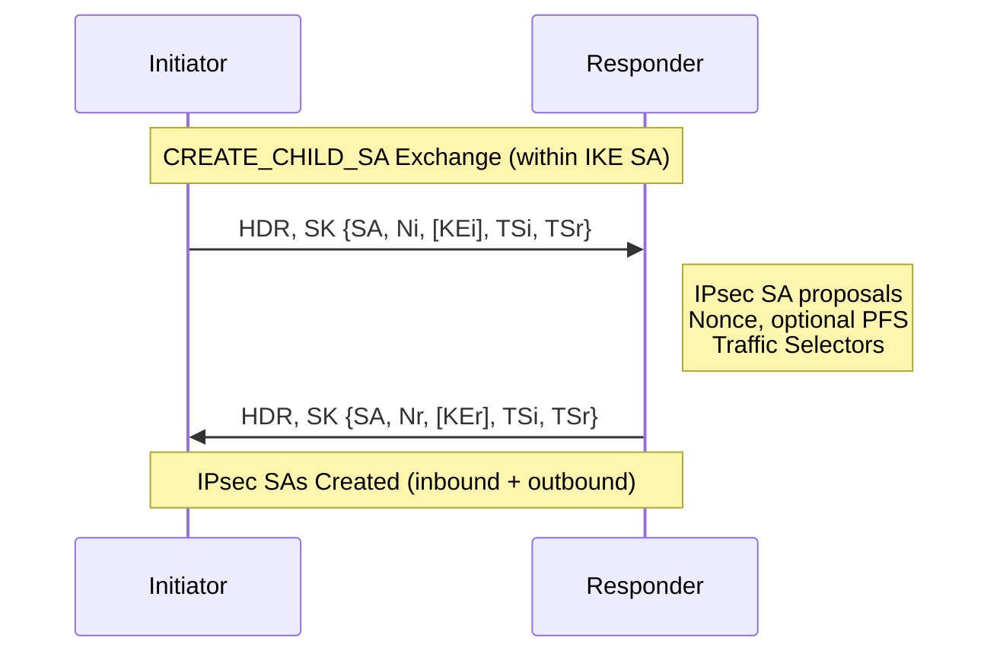

**Negotiated Parameters:**
- IPsec protocol (ESP or AH)
- IPsec mode (transport or tunnel)
- Encryption algorithm for ESP
- Integrity algorithm for ESP/AH
- Lifetime (time and/or byte count)
- Perfect Forward Secrecy (PFS) - optional new DH exchange

## IKE Authentication Methods

| Method | Description | Security Level |
|--------|-------------|----------------|
| **Pre-Shared Key (PSK)** | Shared secret configured on both sides | Medium (vulnerable to dictionary attacks) |
| **RSA Signatures** | Digital signatures using RSA certificates | High |
| **ECDSA Signatures** | Digital signatures using ECC certificates | High (better performance) |
| **EAP** | Extensible Authentication Protocol | Variable (depends on EAP method) |

## IKE Key Derivation

IKE derives cryptographic keys using Pseudo-Random Functions (PRF):

```
SKEYSEED = prf(Ni | Nr, g^ir)
           where g^ir is Diffie-Hellman shared secret

{SK_d | SK_ai | SK_ar | SK_ei | SK_er | SK_pi | SK_pr}
    = prf+ (SKEYSEED, Ni | Nr | SPIi | SPIr)
```

Where:
- **SK_d** - Used for deriving IPsec keys
- **SK_ai, SK_ar** - IKE authentication keys (initiator/responder)
- **SK_ei, SK_er** - IKE encryption keys (initiator/responder)
- **SK_pi, SK_pr** - IKE authentication payload keys

**IPsec Key Derivation:**
```
KEYMAT = prf+ (SK_d, Ni | Nr)

ESP/AH keys extracted from KEYMAT based on algorithm requirements
```

## NAT Traversal (NAT-T)

IPsec ESP authentication includes ports in the hash, which breaks with NAT. IKE includes NAT Traversal:

1. **NAT Detection** - Peers exchange hashed IP addresses to detect NAT
2. **Port Change** - Switch from UDP 500 to UDP 4500
3. **ESP Encapsulation** - Encapsulate ESP in UDP packets

```
Without NAT-T:  [IP Header][ESP Header][Encrypted Data]
With NAT-T:     [IP Header][UDP Header][ESP Header][Encrypted Data]
                             Port 4500
```

For detailed IKE protocol mechanics, see [IKE](IKE.md).

# IPsec Traffic Processing

## Outbound Processing

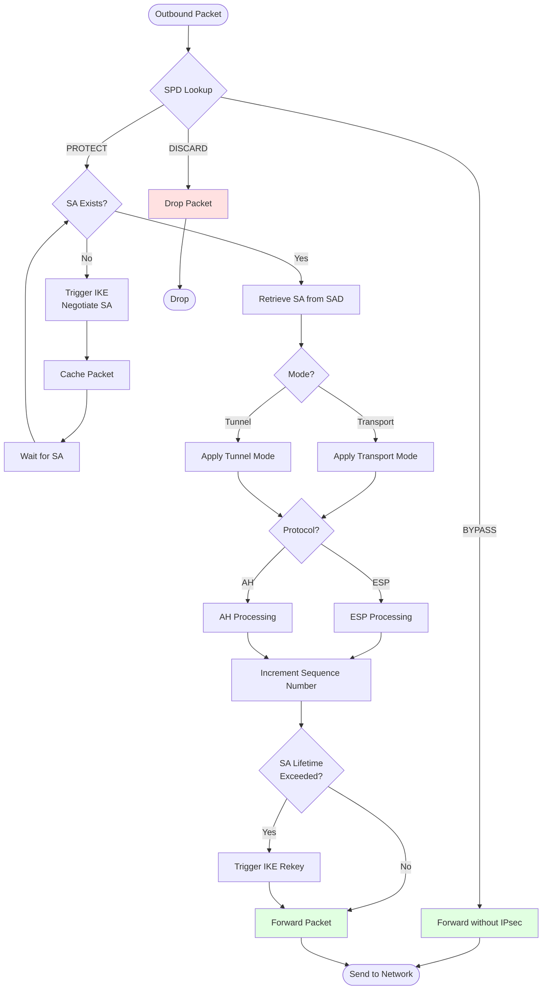

### Outbound Processing Steps

1. **SPD Lookup**
   - Match packet against SPD selectors (src, dst, port, protocol)
   - Determine policy: BYPASS, DISCARD, or PROTECT

2. **SA Lookup**
   - If PROTECT policy, find matching SA in SAD
   - If no SA exists, trigger IKE to create one

3. **IPsec Processing**
   - Apply transport or tunnel mode encapsulation
   - Perform ESP encryption/authentication or AH authentication
   - Increment sequence number
   - Add IPsec headers

4. **Lifetime Check**
   - Check if SA approaching expiration (soft lifetime)
   - Trigger IKE rekeying if needed (before hard lifetime)

5. **Forward Packet**
   - Send protected packet to network

## Inbound Processing

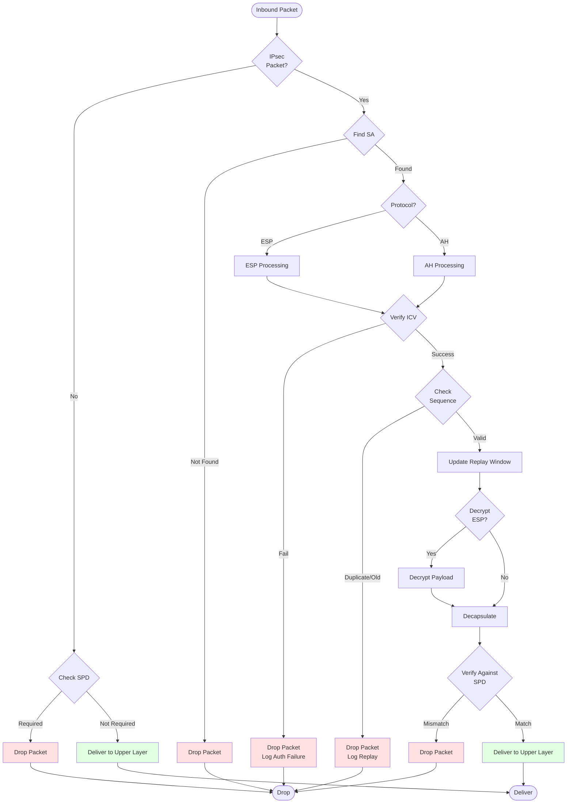

### Inbound Processing Steps

1. **IPsec Detection**
   - Check if packet contains AH or ESP header
   - If no IPsec, verify against SPD (may require IPsec)

2. **SA Lookup**
   - Use (SPI, Destination IP, Protocol) to find SA in SAD
   - Drop if no matching SA found

3. **Integrity Verification**
   - Verify ICV (Integrity Check Value)
   - Drop packet immediately if verification fails

4. **Anti-Replay Check**
   - Verify sequence number within valid window
   - Check if sequence number already received
   - Update replay window if valid

5. **Decryption** (ESP only)
   - Decrypt payload using algorithm and keys from SA
   - Verify padding if present

6. **Decapsulation**
   - Remove IPsec headers
   - Extract original packet (tunnel mode) or payload (transport mode)

7. **SPD Verification**
   - Verify decrypted packet matches SPD policy
   - Ensures packet came through correct SA

8. **Deliver to Upper Layer**
   - Pass original packet/payload to TCP/UDP/application

# Cryptographic Algorithms

## Encryption Algorithms

| Algorithm | Key Size | Block Size | Mode | Security | Performance |
|-----------|----------|------------|------|----------|-------------|
| **DES** | 56 bits | 64 bits | CBC | ⚠️ Deprecated | Fast |
| **3DES** | 168 bits | 64 bits | CBC | ⚠️ Weak | Slow |
| **AES-128** | 128 bits | 128 bits | CBC, CTR, GCM | ✅ Secure | Fast |
| **AES-256** | 256 bits | 128 bits | CBC, CTR, GCM | ✅ Secure | Fast |
| **ChaCha20** | 256 bits | Stream | Poly1305 | ✅ Secure | Very Fast (software) |

**Recommendations:**
- ✅ **AES-256-GCM** - Best balance, hardware acceleration on modern CPUs
- ✅ **ChaCha20-Poly1305** - Excellent for software-only implementations
- ❌ **DES, 3DES** - Deprecated, avoid in new deployments

## Authentication Algorithms

| Algorithm | Output Size | Security | Performance |
|-----------|-------------|----------|-------------|
| **HMAC-MD5** | 128 bits | ⚠️ Weak | Fast |
| **HMAC-SHA1** | 160 bits | ⚠️ Deprecated | Fast |
| **HMAC-SHA256** | 256 bits | ✅ Secure | Moderate |
| **HMAC-SHA384** | 384 bits | ✅ Secure | Moderate |
| **HMAC-SHA512** | 512 bits | ✅ Secure | Slower |
| **AES-XCBC** | 96 bits | ✅ Secure | Fast (with AES-NI) |

**Recommendations:**
- ✅ **HMAC-SHA256** - Good balance of security and performance
- ✅ **HMAC-SHA384/512** - For high-security requirements
- ❌ **HMAC-MD5, HMAC-SHA1** - Avoid in new deployments

## Authenticated Encryption (AEAD)

<mark class="hltr-yellow">**Authenticated Encryption with Associated Data (AEAD)**</mark> combines encryption and authentication in a single operation:

| Algorithm | Key Size | Security | Performance | Notes |
|-----------|----------|----------|-------------|-------|
| **AES-128-GCM** | 128 bits | ✅ Secure | Excellent | Hardware accelerated |
| **AES-256-GCM** | 256 bits | ✅ Secure | Excellent | Recommended |
| **ChaCha20-Poly1305** | 256 bits | ✅ Secure | Excellent | Software optimized |
| **AES-CCM** | 128/256 bits | ✅ Secure | Good | Less common |

**Benefits of AEAD:**
- Single pass for encryption + authentication (better performance)
- Simpler implementation (fewer algorithm choices)
- Stronger security guarantees

## Diffie-Hellman Groups

| Group | Type | Key Size | Security | Performance |
|-------|------|----------|----------|-------------|
| **Group 1** | MODP | 768 bits | ❌ Broken | Fast |
| **Group 2** | MODP | 1024 bits | ⚠️ Weak | Fast |
| **Group 14** | MODP | 2048 bits | ✅ Acceptable | Moderate |
| **Group 15** | MODP | 3072 bits | ✅ Secure | Slow |
| **Group 19** | ECP | 256 bits | ✅ Secure | Fast |
| **Group 20** | ECP | 384 bits | ✅ Secure | Fast |
| **Group 21** | ECP | 521 bits | ✅ Secure | Moderate |

**Recommendations:**
- ✅ **Group 19 (ECP-256)** - Best balance for most deployments
- ✅ **Group 20 (ECP-384)** - High security with good performance
- ✅ **Group 14 (2048-bit MODP)** - Legacy compatibility
- ❌ **Group 1, 2** - Vulnerable to cryptanalysis

# Combining Security Associations

Multiple SAs can be combined to provide different security services or to accommodate different network topologies.

## SA Combinations

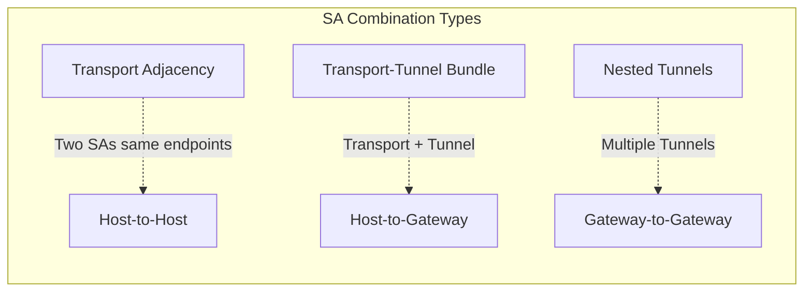

### 1. Transport Adjacency

Two transport mode SAs applied in sequence:

**ESP with Authentication Option 1:**
```
[IP][ESP][Encrypted Payload][ESP ICV]
```

**ESP with Authentication Option 2:**
```
[IP][AH][ESP][Encrypted Payload][ESP Auth]
```
- Inner SA: ESP without authentication (encryption only)
- Outer SA: AH (authentication)
- Result: Authentication after encryption

### 2. Transport-Tunnel Bundle

Transport mode SA nested inside tunnel mode SA:

```
[New IP][ESP Tunnel Header][Original IP][AH Transport][Original Payload][ESP Auth]
```
- Inner SA: AH transport mode (authenticates original packet)
- Outer SA: ESP tunnel mode (encrypts and encapsulates everything)
- Result: Authentication before encryption

### 3. Nested Tunnels

Multiple tunnel mode SAs:

```
[IP3][ESP][IP2][ESP][IP1][Original Payload][ESP Auth2][ESP Auth3]
```

Used for:
- Multiple security gateways in path
- Layered VPN architectures
- Multi-hop secure routing

## Deployment Scenarios

### Scenario 1: End-to-End Security

**Requirement:** All end systems support IPsec

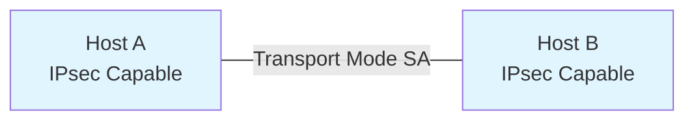

**SA Combinations:**
- Transport AH
- Transport ESP
- Transport AH + Transport ESP (nested)
- Above inside Tunnel AH/ESP (optional)

**Use Case:** Secure communication between two hosts that both support IPsec

### Scenario 2: VPN Gateway

**Requirement:** Only security gateways support IPsec

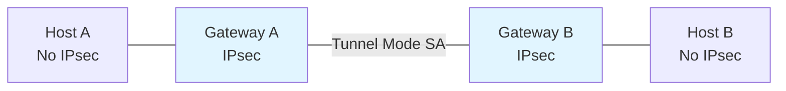

**SA Requirements:**
- Single tunnel SA between gateways
- Nested tunnels optional

**SA Options:**
- Tunnel AH
- Tunnel ESP
- Tunnel ESP with authentication

**Use Case:** Site-to-site VPN connecting two private networks

### Scenario 3: Combined Gateway and Host Security

**Requirement:** Both gateways and end systems support IPsec

```mermaid
graph LR
    H1[Host A<br/>IPsec] --- GW1[Gateway A<br/>IPsec]
    GW1 ---|Tunnel SA| GW2[Gateway B<br/>IPsec]
    GW2 --- H2[Host B<br/>IPsec]
    H1 -.-|Transport SA| H2

    style H1 fill:#e1f5ff
    style H2 fill:#e1f5ff
    style GW1 fill:#fff4e1
    style GW2 fill:#fff4e1
```

**SA Requirements:**
- Tunnel mode between gateways (required)
- Optional transport mode between hosts (additional security)

**Benefits:**
- Defense in depth (multiple security layers)
- Gateway protects site-to-site traffic
- Hosts add end-to-end encryption

**Most Popular Deployment:** Provides flexibility and layered security

### Scenario 4: Remote Access

**Requirement:** Support remote access to servers behind firewalls

```mermaid
graph LR
    H1[Remote Host<br/>IPsec Client] ---|Tunnel Mode SA| FW[Firewall/<br/>VPN Gateway]
    FW --- SRV[Internal Server]

    style H1 fill:#e1f5ff
    style FW fill:#fff4e1
```

**SA Requirements:**
- Tunnel mode between host and firewall (required)
- Can be nested with additional SAs

**Use Cases:**
- Road warrior VPN (remote employees)
- Mobile device access
- Home office connectivity

# IPsec VPN Implementation

## Site-to-Site VPN Architecture

```mermaid
graph TB
    subgraph "Site A: 10.0.1.0/24"
        HA1[Host 10.0.1.10]
        HA2[Host 10.0.1.20]
        GWA[VPN Gateway A<br/>Public: 203.0.113.1<br/>Private: 10.0.1.1]

        HA1 --- GWA
        HA2 --- GWA
    end

    subgraph "Internet"
        NET[Untrusted Network]
    end

    subgraph "Site B: 10.0.2.0/24"
        HB1[Host 10.0.2.10]
        HB2[Host 10.0.2.20]
        GWB[VPN Gateway B<br/>Public: 198.51.100.1<br/>Private: 10.0.2.1]

        HB1 --- GWB
        HB2 --- GWB
    end

    GWA ---|IPsec Tunnel| NET
    NET ---|IPsec Tunnel| GWB

    style GWA fill:#e1f5ff
    style GWB fill:#e1f5ff
    style NET fill:#ffe1e1
```

### Traffic Flow Example

**Packet from Host A (10.0.1.10) to Host B (10.0.2.10):**

1. **Original Packet:**
   ```
   [IP: 10.0.1.10 → 10.0.2.10][TCP][Data]
   ```

2. **After IPsec at Gateway A:**
   ```
   [IP: 203.0.113.1 → 198.51.100.1][ESP][Encrypted(IP: 10.0.1.10 → 10.0.2.10)][ESP ICV]
   ```

3. **After Decryption at Gateway B:**
   ```
   [IP: 10.0.1.10 → 10.0.2.10][TCP][Data]
   ```

## Remote Access VPN Architecture

```mermaid
sequenceDiagram
    participant C as Remote Client
    participant I as Internet
    participant V as VPN Gateway
    participant S as Internal Server

    Note over C: Connect to VPN
    C->>V: IKE Phase 1 (Authenticate)
    V->>C: Authentication Response
    C->>V: IKE Phase 2 (Create IPsec SA)
    V->>C: IPsec SA Established

    Note over C: Assign Virtual IP
    Note over C: Virtual IP: 10.0.100.50

    C->>V: ESP[10.0.100.50 → 10.0.1.10]
    V->>S: IP[10.0.100.50 → 10.0.1.10]
    S->>V: IP[10.0.1.10 → 10.0.100.50]
    V->>C: ESP[10.0.1.10 → 10.0.100.50]
```

### Split Tunneling vs Full Tunneling

**Full Tunneling:**
```
All traffic → VPN Gateway → Destination
```
- All client traffic routes through VPN
- Corporate policies applied to all traffic
- Higher bandwidth usage on VPN gateway

**Split Tunneling:**
```
Corporate traffic → VPN Gateway → Corporate Network
Internet traffic → Direct → Internet
```
- Only corporate traffic goes through VPN
- Reduced load on VPN gateway
- Potential security risk (less control)

# Practical Configuration

## Linux strongSwan Configuration

**Installation:**
```bash
# Ubuntu/Debian
sudo apt-get install strongswan strongswan-pki

# RHEL/CentOS
sudo yum install strongswan
```

### Site-to-Site VPN Example

**/etc/ipsec.conf** (Gateway A):
```conf
# Basic configuration
config setup
    charondebug="ike 2, knl 2, cfg 2"
    uniqueids=yes

# Site-to-Site connection
conn site-to-site
    # IKE parameters
    keyexchange=ikev2
    ike=aes256-sha256-modp2048!
    ikelifetime=28800s

    # IPsec parameters
    esp=aes256-sha256-modp2048!
    lifetime=3600s
    rekeymargin=9m
    keyingtries=%forever

    # Authentication
    authby=secret

    # Left side (Gateway A)
    left=203.0.113.1
    leftsubnet=10.0.1.0/24
    leftid=@gateway-a.example.com
    leftfirewall=yes

    # Right side (Gateway B)
    right=198.51.100.1
    rightsubnet=10.0.2.0/24
    rightid=@gateway-b.example.com

    # Connection settings
    auto=start
    dpdaction=restart
    dpddelay=30s
    type=tunnel
```

**/etc/ipsec.secrets**:
```
# PSK authentication
203.0.113.1 198.51.100.1 : PSK "YourStrongPreSharedKeyHere123!"
```

**Start and verify:**
```bash
# Start IPsec
sudo ipsec start

# Check status
sudo ipsec status

# Show Security Associations
sudo ipsec statusall

# Test connectivity
ping 10.0.2.10
```

### Remote Access VPN Example

**/etc/ipsec.conf** (VPN Gateway):
```conf
config setup
    uniqueids=never

conn remote-access
    keyexchange=ikev2
    ike=aes256-sha256-ecp384!
    esp=aes256-sha256-ecp384!

    # Server side
    left=%any
    leftsubnet=0.0.0.0/0
    leftcert=server-cert.pem
    leftsendcert=always

    # Client side
    right=%any
    rightsourceip=10.0.100.0/24
    rightdns=10.0.1.53

    # Authentication
    authby=pubkey
    eap_identity=%any

    # Settings
    auto=add
    rekey=no
    fragmentation=yes
    type=tunnel
```

**/etc/ipsec.d/client.conf** (Client):
```conf
conn remote-vpn
    keyexchange=ikev2
    ike=aes256-sha256-ecp384!
    esp=aes256-sha256-ecp384!

    # Server
    right=vpn.example.com
    rightsubnet=0.0.0.0/0
    rightid=%any

    # Client
    left=%defaultroute
    leftcert=client-cert.pem
    leftid=user@example.com

    # Authentication
    authby=pubkey

    auto=start
    type=tunnel
```

## Cisco IOS Configuration

### Site-to-Site VPN

```cisco
! IKE Phase 1 policy
crypto isakmp policy 10
 encryption aes 256
 hash sha256
 authentication pre-share
 group 14
 lifetime 28800

! Pre-shared key
crypto isakmp key YourStrongKey address 198.51.100.1

! IPsec transform set (Phase 2)
crypto ipsec transform-set STRONG-ENCRYPTION esp-aes 256 esp-sha256-hmac
 mode tunnel

! Access list for interesting traffic
access-list 100 permit ip 10.0.1.0 0.0.0.255 10.0.2.0 0.0.0.255

! Crypto map
crypto map VPN-MAP 10 ipsec-isakmp
 set peer 198.51.100.1
 set transform-set STRONG-ENCRYPTION
 set pfs group14
 match address 100

! Apply to interface
interface GigabitEthernet0/0
 ip address 203.0.113.1 255.255.255.0
 crypto map VPN-MAP

! Verification commands
show crypto isakmp sa
show crypto ipsec sa
show crypto session
```

## OpenBSD iked Configuration

**/etc/iked.conf**:
```conf
# Site-to-Site VPN
ikev2 "site-b" passive esp \
    from 10.0.1.0/24 to 10.0.2.0/24 \
    local 203.0.113.1 peer 198.51.100.1 \
    psk "YourStrongPreSharedKeyHere123!" \
    enc aes-256 \
    auth hmac-sha2-256 \
    group modp2048 \
    lifetime 3600
```

**Start and verify:**
```bash
# Start iked
rcctl enable iked
rcctl start iked

# Check status
ipsecctl -sa
```

## Configuration Best Practices

1. **Use Strong Cryptography:**
   - AES-256 for encryption
   - SHA-256 or better for integrity
   - DH Group 14 minimum (prefer Group 19/20)

2. **Enable Perfect Forward Secrecy (PFS):**
   - Perform new DH exchange for each Child SA
   - Compromised key doesn't expose past sessions

3. **Set Appropriate Lifetimes:**
   - IKE SA: 8-24 hours
   - IPsec SA: 1-8 hours
   - Balance security vs. performance

4. **Use Certificate Authentication:**
   - More secure than PSK
   - Easier key management at scale
   - Enables user-based authentication

5. **Enable Dead Peer Detection (DPD):**
   - Detect failed peers quickly
   - Automatic reconnection

6. **Configure NAT Traversal:**
   - Enable for remote access scenarios
   - UDP encapsulation for ESP

# Security Considerations

## Cryptographic Attacks

### 1. Weak Algorithms

**Vulnerability:** DES, 3DES, MD5, SHA1 are cryptographically weak

**Mitigation:**
- Use AES-256 for encryption
- Use SHA-256 or better for integrity
- Disable weak cipher suites in IKE/IPsec configuration

### 2. Brute Force on Pre-Shared Keys

**Vulnerability:** Short or weak PSKs vulnerable to dictionary attacks

**Mitigation:**
- Use long random PSKs (minimum 20 characters)
- Prefer certificate-based authentication
- Consider IKEv2 EAP for user authentication

### 3. Diffie-Hellman Downgrade

**Vulnerability:** Attacker forces use of weak DH groups (Logjam attack)

**Mitigation:**
- Disable DH Group 1 (768-bit) and Group 2 (1024-bit)
- Require Group 14 (2048-bit) minimum
- Prefer ECP groups (Group 19/20)

## Implementation Attacks

### 4. Anti-Replay Window Attacks

**Vulnerability:** Large window size or disabled anti-replay increases risk

**Mitigation:**
- Keep window size at default (64)
- Never disable anti-replay protection
- Monitor for replay attack attempts

### 5. Traffic Analysis

**Vulnerability:** Packet size and timing reveal information even with encryption

**Mitigation:**
- Use tunnel mode to hide original IP headers
- Enable padding in ESP for traffic flow confidentiality
- Consider constant-rate padding for high-security scenarios

### 6. Man-in-the-Middle Attacks

**Vulnerability:** IKE negotiation vulnerable without proper authentication

**Mitigation:**
- Use certificate-based authentication with proper CA validation
- Verify peer identity (certificates, PSK)
- Implement certificate revocation checking (CRL/OCSP)

## Operational Security

### 7. Key Management

**Best Practices:**
- Rotate keys regularly (automatic with IKE rekeying)
- Use separate keys for different SAs
- Securely store and distribute PSKs or certificates
- Implement proper key lifecycle management

### 8. Access Control

**Best Practices:**
- Implement strict SPD policies
- Follow principle of least privilege
- Regularly audit SPD/SAD entries
- Monitor for policy violations

### 9. Logging and Monitoring

**Essential Logs:**
- IKE negotiation failures
- Authentication failures
- Anti-replay violations
- SA establishment and teardown
- Policy violations (SPD mismatches)

**Example strongSwan logging:**
```bash
# Enable detailed logging
sudo ipsec statusall

# View logs
sudo journalctl -u strongswan -f

# Monitor authentication failures
sudo grep "authentication failed" /var/log/syslog
```

### 10. Patch Management

**Critical:**
- Keep IPsec implementation up to date
- Monitor security advisories for your IPsec stack
- Test updates in non-production environment first

## Notable IPsec Vulnerabilities

| Vulnerability | Year | Impact | Mitigation |
|---------------|------|--------|------------|
| **Weak DH Groups** | Ongoing | Key compromise | Use Group 14+ or ECP groups |
| **PSK Dictionary Attacks** | Ongoing | SA compromise | Use strong PSKs or certificates |
| **Implementation Bugs** | Various | RCE, DoS | Regular patching |
| **IKEv1 Aggressive Mode** | 2002 | PSK disclosure | Use IKEv2 or IKEv1 Main Mode |
| **NAT-T DoS** | 2016 | Denial of service | Rate limiting, firewall rules |

# Performance Considerations

## Overhead Analysis

### Bandwidth Overhead

**Transport Mode:**
```
Original:        [IP: 20][TCP: 20][Data: 1460] = 1500 bytes
ESP Transport:   [IP: 20][ESP: 8][IV: 16][TCP: 20][Data: 1460][Pad: 10][ICV: 16] = 1550 bytes
Overhead:        50 bytes (3.3%)
```

**Tunnel Mode:**
```
Original:        [IP: 20][TCP: 20][Data: 1460] = 1500 bytes
ESP Tunnel:      [New IP: 20][ESP: 8][IV: 16][IP: 20][TCP: 20][Data: 1460][Pad: 10][ICV: 16] = 1570 bytes
Overhead:        70 bytes (4.7%)
```

### MTU Considerations

IPsec adds overhead, which can cause fragmentation:

**Optimal MTU Calculation:**
```
IPsec MTU = Interface MTU - IPsec Overhead

For tunnel mode with AES-GCM:
IPsec MTU = 1500 - 70 = 1430 bytes
```

**Configuration:**
```bash
# Linux: Set MTU on tunnel interface
ip link set dev tun0 mtu 1430

# strongSwan: Automatic MSS clamping
iptables -t mangle -A FORWARD -p tcp --tcp-flags SYN,RST SYN -j TCPMSS --clamp-mss-to-pmtu
```

## Throughput Optimization

### Hardware Acceleration

Modern CPUs provide hardware acceleration for cryptographic operations:

| Feature | Benefit |
|---------|---------|
| **AES-NI** | 4-8x faster AES encryption/decryption |
| **PCLMULQDQ** | Accelerated GCM mode |
| **AVX/AVX2** | Parallel cryptographic operations |

**Verify hardware support (Linux):**
```bash
# Check for AES-NI
grep -o 'aes' /proc/cpuinfo

# Check CPU flags
lscpu | grep -i aes
```

### Performance Tuning

**1. Choose Efficient Algorithms:**
- AES-256-GCM: Best with hardware acceleration
- ChaCha20-Poly1305: Best for software-only
- Avoid: 3DES (very slow), AES-CBC (slower than GCM)

**2. Adjust IKE/IPsec Parameters:**
```conf
# Increase lifetime to reduce rekeying overhead
lifetime=86400s  # 24 hours

# Disable PFS for performance (security trade-off)
# Only if security policy allows
pfs=no
```

**3. Tune Networking Stack (Linux):**
```bash
# Increase buffer sizes
sysctl -w net.core.rmem_max=134217728
sysctl -w net.core.wmem_max=134217728

# Enable TCP window scaling
sysctl -w net.ipv4.tcp_window_scaling=1

# Enable TCP timestamps
sysctl -w net.ipv4.tcp_timestamps=1
```

### Benchmark Tools

**iperf3 - Throughput testing:**
```bash
# Server
iperf3 -s

# Client (test VPN throughput)
iperf3 -c 10.0.2.10 -t 60 -P 4
```

**IPsec Performance Metrics:**
```bash
# strongSwan: Show SA statistics
sudo ipsec statusall | grep -A 10 "bytes_i\|bytes_o"

# Packet counters
sudo ip -s xfrm state
```

## Scalability

### Connection Limits

| Implementation | Max SAs | Max Peers | Throughput |
|----------------|---------|-----------|------------|
| **strongSwan** | ~50,000 | ~10,000 | 10+ Gbps (with hardware) |
| **Cisco ASA 5516** | 10,000 | 750 | 1.5 Gbps |
| **pfSense (AES-NI)** | Unlimited | ~1,000 | 5+ Gbps |

### Horizontal Scaling

For large deployments:
1. **Load Balancing** - Distribute clients across multiple VPN gateways
2. **Geographic Distribution** - Deploy regional VPN concentrators
3. **Clustering** - Use active-active or active-standby clusters

# Comparison with Other VPN Technologies

| Feature | IPsec | SSL/TLS VPN | WireGuard |
|---------|-------|-------------|-----------|
| **Layer** | Network (Layer 3) | Transport (Layer 4) | Network (Layer 3) |
| **Encryption** | ESP (AES, ChaCha20) | TLS 1.2/1.3 | ChaCha20-Poly1305 |
| **Key Exchange** | IKE (DH) | TLS Handshake | Noise Protocol |
| **Client** | Native or IPsec client | Web browser or client | Kernel module |
| **NAT Traversal** | NAT-T (UDP 4500) | Native (TCP/UDP 443) | Native (UDP) |
| **Performance** | Good | Moderate | Excellent |
| **Complexity** | High | Moderate | Low |
| **Use Case** | Site-to-site, enterprise | Remote access, web | Modern VPN alternative |

**When to use each:**
- **IPsec:** Site-to-site VPNs, network-level encryption, legacy interoperability
- **SSL/TLS VPN:** Clientless access, firewall-friendly, web applications
- **WireGuard:** Modern deployments, performance-critical, simple configuration

# IPsec in Practice

## Common Use Cases

### 1. Site-to-Site VPN
- Connect branch offices to headquarters
- Secure communication between data centers
- Hybrid cloud connectivity (on-prem to AWS/Azure)

### 2. Remote Access VPN
- Remote employee access to corporate network
- Mobile device access
- Secure access from untrusted networks

### 3. Secure Overlay Networks
- Software-defined WAN (SD-WAN)
- Multi-cloud networking
- IoT device communication

### 4. Defense in Depth
- Encrypt sensitive traffic within trusted networks
- Compliance requirements (PCI-DSS, HIPAA)
- Zero-trust network architecture

## Troubleshooting Guide

### IKE Phase 1 Failure

**Symptoms:** IKE SA not established

**Common Causes:**
- Mismatched proposals (encryption, hash, DH group)
- Authentication failure (wrong PSK or certificate)
- Connectivity issues (firewall blocking UDP 500)

**Debugging:**
```bash
# strongSwan: Enable IKE debugging
sudo ipsec start --nofork --debug-ike 3

# Check IKE proposals
sudo ipsec statusall | grep -A 5 "proposal"

# Verify connectivity
sudo tcpdump -i eth0 udp port 500
```

### IKE Phase 2 Failure

**Symptoms:** IKE SA established but no IPsec SAs

**Common Causes:**
- Mismatched IPsec proposals
- Traffic selector mismatch
- PFS group mismatch

**Debugging:**
```bash
# Check Child SA status
sudo ipsec statusall | grep "CHILD_SA"

# Verify traffic selectors
sudo ipsec statusall | grep "==="
```

### Traffic Not Flowing

**Symptoms:** SAs established but no traffic passing

**Common Causes:**
- SPD policy mismatch
- Routing issues
- Firewall blocking ESP/AH

**Debugging:**
```bash
# Verify SAD entries
sudo ip xfrm state

# Verify SPD policies
sudo ip xfrm policy

# Check if ESP packets are flowing
sudo tcpdump -i eth0 esp

# Trace IPsec policy lookup
sudo tcpdump -i eth0 -n host 10.0.2.10
```

### Packet Loss or Fragmentation

**Symptoms:** Slow performance or connection drops

**Causes:**
- MTU issues
- Fragmentation

**Solutions:**
```bash
# Test MTU
ping -M do -s 1400 10.0.2.10

# Enable MSS clamping
iptables -t mangle -A FORWARD -p tcp --tcp-flags SYN,RST SYN -j TCPMSS --clamp-mss-to-pmtu

# Adjust MTU on tunnel interface
ip link set dev tun0 mtu 1400
```

# Related Topics

- [IKE](IKE.md) - Internet Key Exchange protocol details
- [Diffie-Hellman key exchange](../../../cryptography/key-exchange/Diffie-Hellman%20key%20exchange.md) - Key agreement algorithm
- [Secure Socket Layer (SSL) - Transport Layer Security (TLS)](../transport-layer/Secure%20Socket%20Layer%20(SSL)%20-%20Transport%20Layer%20Security%20(TLS).md) - Transport layer security
- [HTTP Over SSL (HTTPS)](../application-layer/HTTP%20Over%20SSL%20(HTTPS).md) - Application layer security
- [Virtual Private Network (VPN)](VPN.md) - VPN technologies and implementations

***

# References

1. Kent, S., & Seo, K. (2005). **Security Architecture for the Internet Protocol (RFC 4301)**. IETF. https://tools.ietf.org/html/rfc4301
2. Kent, S. (2005). **IP Encapsulating Security Payload (ESP) (RFC 4303)**. IETF. https://tools.ietf.org/html/rfc4303
3. Kent, S. (2005). **IP Authentication Header (AH) (RFC 4302)**. IETF. https://tools.ietf.org/html/rfc4302
4. Kaufman, C., et al. (2014). **Internet Key Exchange Protocol Version 2 (IKEv2) (RFC 7296)**. IETF. https://tools.ietf.org/html/rfc7296
5. Huttunen, A., et al. (2005). **UDP Encapsulation of IPsec ESP Packets (RFC 3948)**. IETF. https://tools.ietf.org/html/rfc3948
6. Ferguson, P., & Huston, G. (1998). **What is a VPN?** Cisco Systems White Paper.
7. Frankel, S., et al. (2005). **Guide to IPsec VPNs (NIST SP 800-77)**. National Institute of Standards and Technology.
8. strongSwan Documentation. (2024). **strongSwan IPsec VPN**. https://www.strongswan.org/
9. Doraswamy, N., & Harkins, D. (2003). **IPSec: The New Security Standard for the Internet, Intranets, and Virtual Private Networks (2nd ed.)**. Prentice Hall.
10. Kaufman, C., Perlman, R., & Speciner, M. (2002). **Network Security: Private Communication in a Public World (2nd ed.)**. Prentice Hall.
