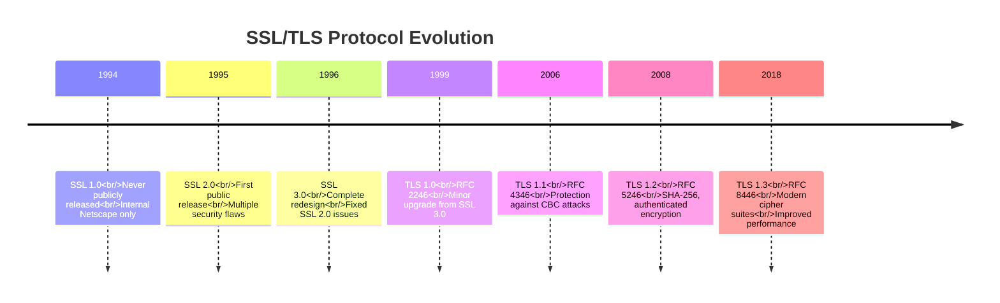
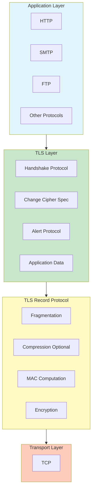
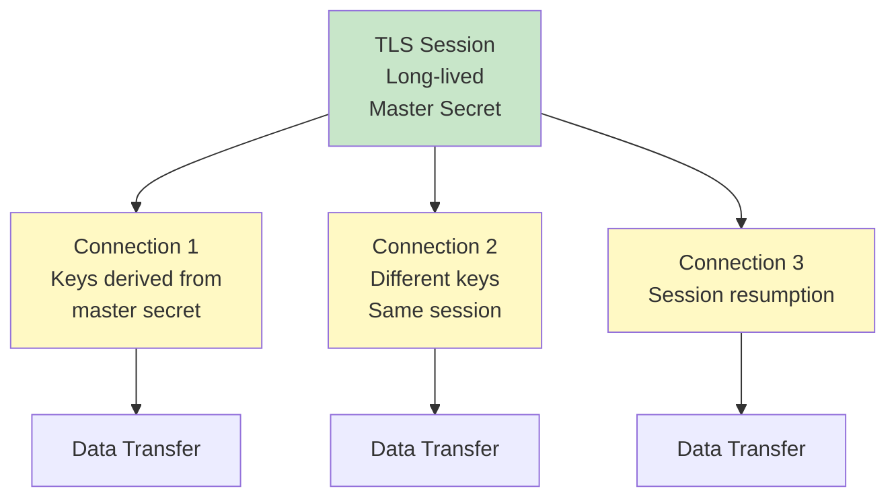
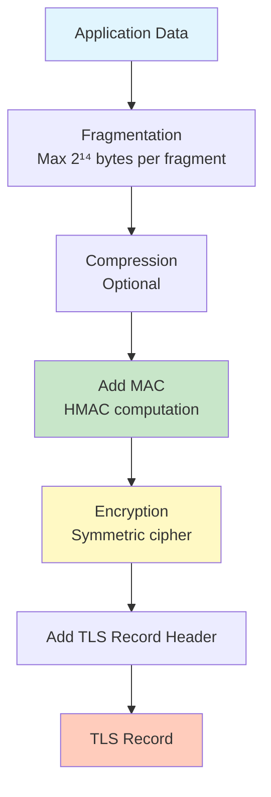
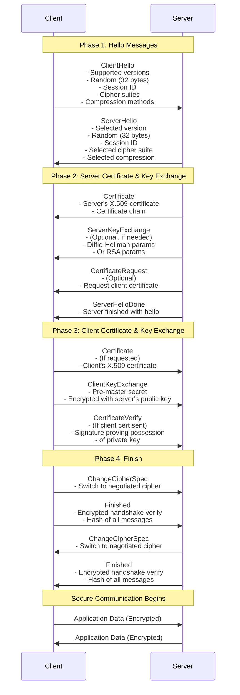
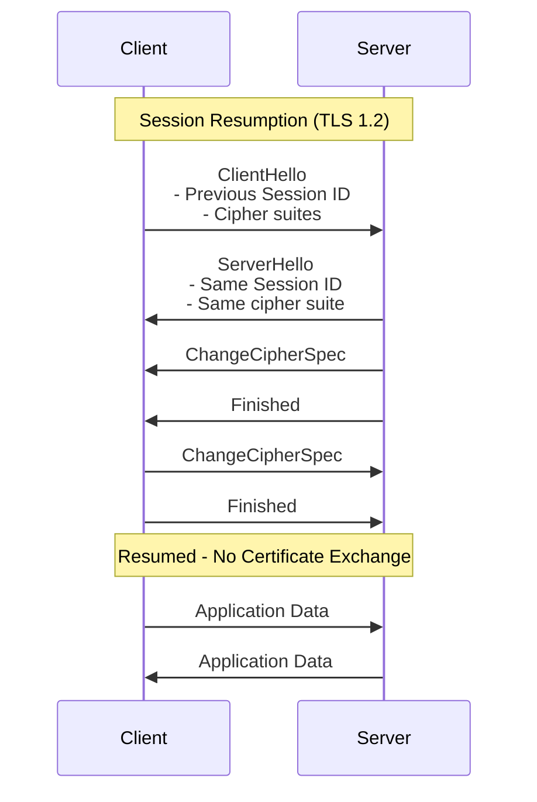
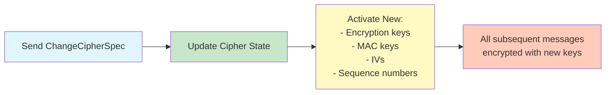
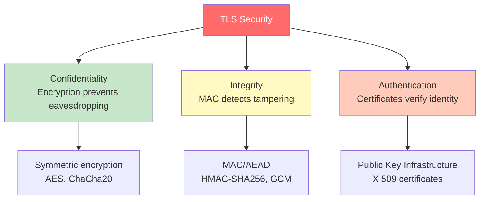
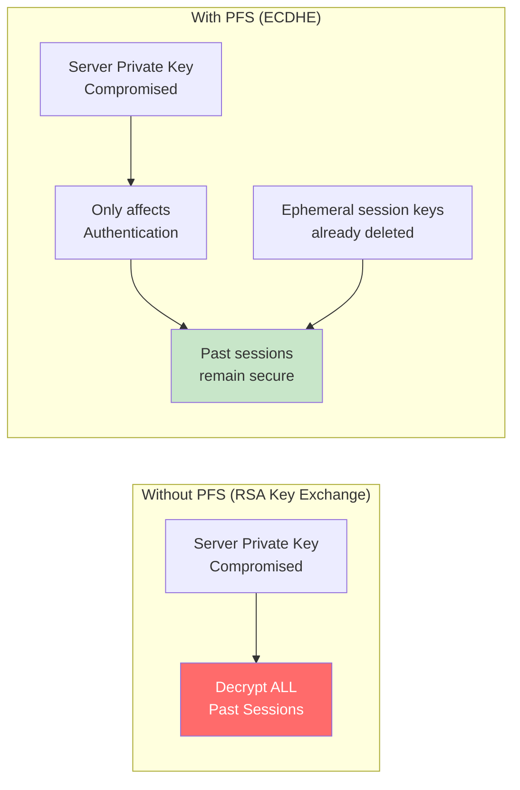
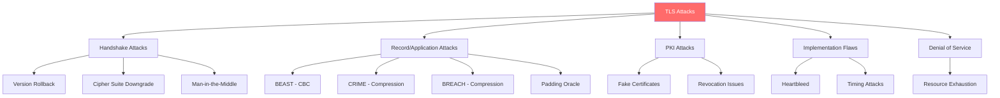

#cybersecurity #web-security #transport-layer #protocol #ssl #tls #encryption #authentication #computer-network #cryptography

- SSL (Secure Sockets Layer) and TLS (Transport Layer Security) provide secure communication over computer networks.
- <mark class="hltr-yellow">TLS ensures confidentiality, integrity, and authentication between client and server applications</mark>.
- Operates between transport layer (TCP) and application layer, transparent to applications.

# Protocol Evolution
## Version History


## Deprecated Versions
- **SSL 2.0**: Deprecated in 2011 (RFC 6176) - multiple vulnerabilities
- **SSL 3.0**: Deprecated in 2015 (RFC 7568) - POODLE attack
- **TLS 1.0**: Deprecated in 2020 (RFC 8996) - weak cipher suites
- **TLS 1.1**: Deprecated in 2020 (RFC 8996) - superseded by TLS 1.2/1.3
- **Current**: TLS 1.2 and TLS 1.3 are recommended

# TLS Architecture

## Protocol Stack


## TLS Components
### TLS Session
- <mark class="hltr-yellow">Persistent association between client and server created by Handshake Protocol</mark>.
- Avoids expensive negotiation for each connection.

**Session State Components**:
- **Session Identifier**: Arbitrary byte sequence chosen by server
- **Peer Certificate**: X.509v3 certificate of peer (optional)
- **Compression Method**: Algorithm to compress data (typically null in TLS 1.2+)
- **Cipher Spec**: Encryption and MAC algorithms
- **Master Secret**: 48-byte shared secret between client and server
- **Is Resumable**: Flag indicating if session can be resumed

### TLS Connection
- <mark class="hltr-yellow">Transient peer-to-peer communication link associated with a session</mark>.
- Multiple connections can share a single session.

**Connection State Components**:
- **Server Random**: 32-byte random value chosen by server
- **Client Random**: 32-byte random value chosen by client
- **Server Write MAC Secret**: Secret key for server's MAC operations
- **Client Write MAC Secret**: Secret key for client's MAC operations
- **Server Write Key**: Encryption key for data sent by server
- **Client Write Key**: Encryption key for data sent by client
- **Initialization Vectors**: For CBC mode encryption
- **Sequence Numbers**: 64-bit counters for replay protection

## Session vs Connection


# TLS Record Protocol

## Record Protocol Operation
- <mark class="hltr-yellow">Provides confidentiality and message integrity for higher-layer protocols</mark>.
- Fragments, compresses, authenticates, and encrypts data.

### Processing Steps


### Detailed Algorithm
1. **Fragmentation**:
   - Application data divided into blocks ≤ $2^{14}$ bytes (16,384 bytes)
   - Each fragment processed independently

2. **Compression** (deprecated in TLS 1.2+):
   - Lossless compression algorithm
   - Compressed length ≤ original length + 1,024 bytes
   - **Security note**: Compression disabled due to CRIME attack

3. **MAC Computation**:
   - HMAC applied for message authentication
   - Formula: $$\text{HMAC}(MAC_{secret}, seq\_num \,||\, type \,||\, version \,||\, length \,||\, fragment)$$
   - Prevents tampering and replay attacks

4. **Encryption**:
   - Symmetric encryption of compressed data + MAC
   - Encrypted length ≤ compressed length + MAC length + padding
   - Padding added for block ciphers to align with block size

### Supported Cipher Suites
```
Cipher Suite Format: TLS_[KeyExchange]_WITH_[Cipher]_[MAC]

Examples:
TLS_RSA_WITH_AES_128_CBC_SHA256
TLS_ECDHE_RSA_WITH_AES_256_GCM_SHA384
TLS_ECDHE_ECDSA_WITH_CHACHA20_POLY1305_SHA256
```

**TLS 1.2 Recommended Cipher Suites**:
- `TLS_ECDHE_ECDSA_WITH_AES_256_GCM_SHA384`
- `TLS_ECDHE_RSA_WITH_AES_256_GCM_SHA384`
- `TLS_ECDHE_ECDSA_WITH_AES_128_GCM_SHA256`
- `TLS_ECDHE_RSA_WITH_AES_128_GCM_SHA256`

**TLS 1.3 Cipher Suites** (simplified):
- `TLS_AES_256_GCM_SHA384`
- `TLS_CHACHA20_POLY1305_SHA256`
- `TLS_AES_128_GCM_SHA256`

## Record Format
```
TLS Record Structure (TLS 1.2):
+------------------+------------------+
| Content Type (1) | Version (2)     |
+------------------+------------------+
| Length (2)       | Fragment (var)   |
+------------------+------------------+

Total Header: 5 bytes
```

### Field Descriptions
- **Content Type** (1 byte): Protocol using this record
  - `20`: ChangeCipherSpec
  - `21`: Alert
  - `22`: Handshake
  - `23`: Application Data

- **Version** (2 bytes): TLS protocol version
  - TLS 1.2: `0x0303` (major=3, minor=3)
  - TLS 1.3: `0x0303` (for compatibility)

- **Length** (2 bytes): Fragment length (≤ $2^{14}$ + 2,048 bytes)

- **Fragment** (variable): Encrypted and authenticated payload

# TLS Handshake Protocol

## Handshake Overview
- <mark class="hltr-yellow">Establishes shared secret and negotiates cryptographic parameters before secure communication</mark>.
- Authenticates server and optionally client.
- Prevents tampering and eavesdropping.

## Full Handshake (TLS 1.2)


## Handshake Messages

### Phase 1: Establish Security Capabilities
#### ClientHello
- **Version**: Highest TLS version supported by client
- **Random**: 32-byte random value
  - 4 bytes: Current timestamp (Unix time)
  - 28 bytes: Random nonce
  - Prevents replay attacks
- **Session ID**:
  - Non-zero: Resume previous session
  - Zero: Establish new session
- **Cipher Suites**: List of supported cipher suites (preference order)
- **Compression Methods**: Supported compression algorithms (typically only null)
- **Extensions**: Additional capabilities (SNI, ALPN, supported groups, etc.)

#### ServerHello
- **Version**: Selected TLS version (min of client and server)
- **Random**: 32-byte server-generated random value
- **Session ID**:
  - Same as ClientHello if resuming
  - New ID for new session
- **Cipher Suite**: Single selected cipher suite from client's list
- **Compression Method**: Selected compression (typically null)
- **Extensions**: Server's response to client extensions

### Phase 2: Server Authentication and Key Exchange

#### Certificate
- Server's X.509v3 certificate chain
- Must be signed by trusted Certificate Authority (CA)
- Contains server's public key
- Subject name must match server's DNS name
- Not sent for anonymous key exchange

#### ServerKeyExchange
**Sent only when**:
- Using Diffie-Hellman key exchange (ephemeral or anonymous)
- Using RSA with export restrictions (obsolete)
- Server certificate doesn't contain sufficient key exchange info

**Content varies by key exchange method**:

**1. RSA Key Exchange**:
- Client generates pre-master secret
- Encrypts with server's public key from certificate
- No ServerKeyExchange needed

**2. Ephemeral Diffie-Hellman (DHE)**:
```
ServerKeyExchange contains:
- DH parameters: p (prime), g (generator)
- Server's DH public value: g^a mod p
- Signature over parameters + randoms
- Provides Perfect Forward Secrecy (PFS)
```

**3. Ephemeral Elliptic Curve Diffie-Hellman (ECDHE)**:
```
ServerKeyExchange contains:
- EC curve parameters (e.g., secp256r1)
- Server's EC public point
- Signature over parameters + randoms
- Preferred for modern TLS (efficient + PFS)
```

**4. Anonymous Diffie-Hellman** (NOT recommended):
```
ServerKeyExchange contains:
- DH parameters: p, g
- Server's DH public value
- NO signature (vulnerable to MITM)
```

#### CertificateRequest (optional)
**Sent when server requires client authentication**.

Contains:
- **Certificate Types**:
  - `rsa_sign`: RSA certificate for signing
  - `dss_sign`: DSS certificate for signing
  - `rsa_fixed_dh`: RSA certificate with fixed DH parameters
  - `dss_fixed_dh`: DSS certificate with fixed DH parameters
  - `ecdsa_sign`: ECDSA certificate for signing

- **Supported Signature Algorithms**:
  - SHA256 with RSA
  - SHA384 with ECDSA
  - etc.

- **Certificate Authorities**: List of acceptable CAs

#### ServerHelloDone
- Indicates server finished its part of key exchange
- No content, just a marker message

### Phase 3: Client Authentication and Key Exchange

#### Certificate (from client)
- Sent only if server requested client authentication
- Contains client's X.509v3 certificate
- If client has no certificate, sends `no_certificate` alert

#### ClientKeyExchange
**Content depends on negotiated key exchange**:

**RSA Key Exchange**:
```
1. Client generates 48-byte pre-master secret (random)
2. Encrypts with server's public key (from certificate)
3. Sends encrypted pre-master secret

Pre-master secret format:
- 2 bytes: Client version
- 46 bytes: Random data
```

**Diffie-Hellman** (Ephemeral or Anonymous):
```
Client sends:
- Client's DH public value: g^b mod p

Both sides compute shared secret:
- Client: (server_public)^b mod p = g^(ab) mod p
- Server: (client_public)^a mod p = g^(ab) mod p
```

**ECDHE** (Elliptic Curve):
```
Client sends:
- Client's EC public point

Both sides compute shared secret using ECDH
```

**Fixed Diffie-Hellman**:
```
No ClientKeyExchange sent
DH public value already in client's certificate
```

#### CertificateVerify
**Sent only if client sent certificate**.

Purpose: Prove client possesses private key corresponding to certificate.

Content:
```
Signature over:
- All previous handshake messages
- Using client's private key

Verification:
Server verifies signature using client's public key from certificate
```

### Phase 4: Finish Handshake

#### ChangeCipherSpec
- Not technically part of Handshake Protocol (separate protocol)
- Single byte with value 1
- Indicates sender will start using negotiated cipher suite
- All subsequent messages encrypted and authenticated

#### Finished
**First encrypted message in the connection**.

Content:
```
verify_data = PRF(master_secret, "client finished" or "server finished",
                  Hash(all_handshake_messages))

Length: 12 bytes (TLS 1.2)
```

Purpose:
- Verify all handshake messages were not tampered with
- Confirm both sides computed same keys
- Any modification to handshake will cause verification failure

## Key Derivation

### Master Secret Generation
```
Pre-master secret (48 bytes)
    ↓
master_secret = PRF(pre_master_secret, "master secret",
                    ClientHello.random + ServerHello.random)[0..47]
    ↓
Master secret (48 bytes)
```

### Key Material Generation
```
key_block = PRF(master_secret, "key expansion",
                ServerHello.random + ClientHello.random)

From key_block, extract:
1. client_write_MAC_secret
2. server_write_MAC_secret
3. client_write_key
4. server_write_key
5. client_write_IV (if block cipher)
6. server_write_IV (if block cipher)
```

### Pseudorandom Function (PRF)
**TLS 1.2 PRF**:
```
PRF(secret, label, seed) = P_<hash>(secret, label + seed)

P_<hash> uses HMAC with specified hash algorithm
- SHA-256 for most cipher suites
- SHA-384 for SHA-384-based cipher suites
```

## Session Resumption

### Session ID Resumption


Benefits:
- Skips expensive public key operations
- Faster connection establishment
- Reuses master secret from previous session

### Session Tickets (RFC 5077)
Alternative to server-side session cache:
```
1. Server sends encrypted session state to client in NewSessionTicket
2. Client stores ticket
3. Client includes ticket in SessionTicket extension of ClientHello
4. Server decrypts and validates ticket
5. Resume session without server-side storage
```

# TLS Alert Protocol

## Alert Messages
- <mark class="hltr-yellow">Indicates errors or warning conditions during TLS communication</mark>.
- Compressed and encrypted like other TLS records.

## Alert Format
```
Alert Message (2 bytes):
+---------------+---------------+
| Level (1)     | Description (1)|
+---------------+---------------+
```

### Alert Levels
- **Warning (1)**: Connection can continue
  - `close_notify`: Clean connection closure
  - `no_certificate`: Client has no certificate (deprecated, use certificate_required)

- **Fatal (2)**: Immediate connection termination
  - All other alerts are typically fatal
  - No further data transmitted after fatal alert

### Common Alert Descriptions

**Handshake Failures**:
- `handshake_failure` (40): Generic handshake failure
- `certificate_unknown` (46): Certificate received but could not be validated
- `certificate_expired` (45): Certificate expired
- `certificate_revoked` (44): Certificate revoked by CA
- `bad_certificate` (42): Certificate corrupt or invalid signature
- `unsupported_certificate` (43): Certificate type not supported
- `unknown_ca` (48): Certificate chain includes unknown CA

**Protocol Errors**:
- `unexpected_message` (10): Inappropriate message received
- `bad_record_mac` (20): MAC verification failed (possible tampering)
- `record_overflow` (22): TLS record exceeded maximum size
- `decompression_failure` (30): Decompression failed (TLS 1.2)
- `decode_error` (50): Message could not be decoded

**Cryptographic Failures**:
- `decrypt_error` (51): Decryption failed
- `illegal_parameter` (47): Field in handshake out of range or inconsistent
- `insufficient_security` (71): Negotiated parameters not secure enough
- `protocol_version` (70): TLS version not supported

**Connection Issues**:
- `close_notify` (0): Clean shutdown notification
- `internal_error` (80): Internal error in TLS implementation
- `user_canceled` (90): User canceled operation

## Alert Usage Example
```
Scenario: Certificate Validation Failure

Client receives server certificate
    ↓
Client validates certificate against trusted CAs
    ↓
Validation fails (unknown CA)
    ↓
Client sends Alert:
  Level: fatal (2)
  Description: unknown_ca (48)
    ↓
Client closes connection immediately
```

# Change Cipher Spec Protocol

## Purpose
- <mark class="hltr-yellow">Signals transition to newly negotiated cipher suite and keys</mark>.
- Simplest TLS protocol (single message).

## Message Format
```
ChangeCipherSpec Message (1 byte):
+-------+
| 0x01  |
+-------+
```

## Processing


## Key Points
- Sent by both client and server during handshake
- Follows key exchange phase
- Immediately precedes Finished message
- Resets sequence number to 0
- Not part of Handshake Protocol (separate content type)

# Heartbeat Protocol (RFC 6520)

## Purpose
- Keep-alive mechanism for TLS connections
- Verify peer still responsive without sending application data
- Useful for long-lived connections

## Heartbeat Messages
### HeartbeatRequest
```
HeartbeatRequest:
- Type: heartbeat_request (1)
- Payload_length: Length of payload (uint16)
- Payload: Random data
- Padding: Random padding (≥16 bytes)
```

### HeartbeatResponse
```
HeartbeatResponse:
- Type: heartbeat_response (2)
- Payload_length: Same as request
- Payload: Exact copy of request payload
- Padding: Random padding
```

## Heartbleed Vulnerability (CVE-2014-0160)
**Critical bug in OpenSSL (2012-2014)**:

```
Vulnerability:
1. Attacker sends HeartbeatRequest with payload_length = 65535
2. But actual payload only 1 byte
3. Vulnerable OpenSSL reads 65535 bytes from memory
4. Returns memory contents in HeartbeatResponse
5. Leaks sensitive data: keys, passwords, session tokens
```

**Impact**:
- Private keys stolen
- Session cookies compromised
- Passwords exposed
- Affected ~17% of secure web servers

**Mitigation**:
- Update OpenSSL to patched version
- Revoke and reissue certificates
- Change passwords and secrets
- Many organizations disabled Heartbeat extension entirely

# TLS Security Analysis

## Security Goals


## Cryptographic Strength

### Key Sizes (Recommended as of 2024)
```
Symmetric Encryption:
- AES-128: 128-bit keys (sufficient)
- AES-256: 256-bit keys (preferred for high security)
- ChaCha20: 256-bit keys

Asymmetric Encryption:
- RSA: ≥2048 bits (3072+ preferred)
- ECDH/ECDSA: ≥256 bits (P-256, P-384)
- Ed25519: 256 bits (Edwards curve)

Hash Functions:
- SHA-256: Minimum
- SHA-384: Preferred
- SHA-1: DEPRECATED (broken)
- MD5: DEPRECATED (completely broken)
```

## Perfect Forward Secrecy (PFS)
- <mark class="hltr-yellow">Compromise of long-term private key does not compromise past session keys</mark>.
- Achieved using ephemeral key exchange (DHE, ECDHE).



# TLS Attacks and Vulnerabilities

## Attack Categories


## Notable Attacks

### 1. BEAST (Browser Exploit Against SSL/TLS)
**Target**: TLS 1.0 CBC mode encryption

**Vulnerability**:
- Predictable IV in CBC mode
- Attacker can decrypt HTTPS cookies

**Attack**:
```
1. Attacker runs JavaScript in victim's browser
2. JavaScript makes many requests with known plaintext
3. Observes ciphertext patterns
4. Uses chosen-plaintext attack to decrypt session cookie
```

**Mitigation**:
- Use TLS 1.1+ (randomized IV)
- Use RC4 (temporary workaround, RC4 now deprecated)
- Implement 1/n-1 record splitting

### 2. CRIME (Compression Ratio Info-leak Made Easy)
**Target**: TLS compression

**Vulnerability**:
- Compression reveals information about plaintext
- Compressed size varies based on repetition

**Attack**:
```
1. Attacker controls part of plaintext (headers)
2. Tries different values for secret (cookie)
3. Monitors compressed size
4. Correct guess compresses better (smaller)
5. Leaks secret byte-by-byte
```

**Mitigation**:
- Disable TLS compression (standard in TLS 1.2+)
- BREACH extends attack to HTTP compression

### 3. POODLE (Padding Oracle On Downgraded Legacy Encryption)
**Target**: SSL 3.0 CBC padding

**Vulnerability**:
- SSL 3.0 doesn't verify padding contents
- Only checks padding length

**Attack**:
```
1. Attacker downgrades connection to SSL 3.0
2. Manipulates padding in CBC blocks
3. Observes MAC errors vs. padding errors
4. Extracts plaintext byte-by-byte
```

**Mitigation**:
- Disable SSL 3.0 entirely
- Use TLS 1.2+ only
- Implement TLS_FALLBACK_SCSV

### 4. Heartbleed (CVE-2014-0160)
**Target**: OpenSSL Heartbeat implementation

**Vulnerability**:
- Missing bounds check on payload_length
- Reads arbitrary memory

**Impact**:
- Private keys leaked
- Session tokens exposed
- Passwords compromised

**Mitigation**:
- Update OpenSSL
- Revoke and reissue certificates
- Disable Heartbeat extension

### 5. FREAK (Factoring RSA Export Keys)
**Target**: Export-grade RSA cipher suites

**Vulnerability**:
- 512-bit RSA keys can be factored
- Man-in-the-middle forces downgrade

**Attack**:
```
1. MITM forces client to use export RSA (512-bit)
2. Factors weak RSA key
3. Impersonates server
4. Decrypts traffic
```

**Mitigation**:
- Disable export cipher suites
- Use strong RSA keys (≥2048 bits)

### 6. Logjam
**Target**: Export-grade Diffie-Hellman (DHE_EXPORT)

**Similar to FREAK**:
- 512-bit DH parameters can be broken
- Precomputation attacks possible

**Mitigation**:
- Disable export DH
- Use strong DH groups (≥2048 bits)
- Prefer ECDHE over DHE

### 7. Sweet32 (Birthday Attacks on 64-bit Block Ciphers)
**Target**: 3DES, Blowfish (64-bit block ciphers)

**Vulnerability**:
- Birthday paradox on 64-bit blocks
- Collision after ~$2^{32}$ blocks

**Mitigation**:
- Disable 64-bit block ciphers
- Use AES (128-bit blocks)

### 8. ROBOT (Return Of Bleichenbacher's Oracle Threat)
**Target**: RSA PKCS#1 v1.5 padding oracle

**Vulnerability**:
- Timing differences in RSA decryption
- Bleichenbacher's attack (1998) still relevant

**Mitigation**:
- Use RSA-OAEP padding
- Constant-time implementations
- Prefer ECDHE over RSA key exchange

## Attack Prevention Summary
```
Best Practices:
✓ Use TLS 1.2 or TLS 1.3 only
✓ Disable SSL 3.0, TLS 1.0, TLS 1.1
✓ Prefer ECDHE key exchange (PFS)
✓ Use AEAD ciphers (GCM, ChaCha20-Poly1305)
✓ Strong keys: RSA ≥2048, ECDH ≥256
✓ Disable compression
✓ Implement HSTS (HTTP Strict Transport Security)
✓ Certificate pinning for critical applications
✓ Regular security updates
✓ Monitor for certificate revocations
```

# Practical Configuration

## Recommended Cipher Suites (TLS 1.2)
```nginx
# Modern configuration (Firefox 63, Chrome 70+, Safari 12.1+)
ssl_protocols TLSv1.2 TLSv1.3;
ssl_ciphers 'ECDHE-ECDSA-AES256-GCM-SHA384:ECDHE-RSA-AES256-GCM-SHA384:ECDHE-ECDSA-CHACHA20-POLY1305:ECDHE-RSA-CHACHA20-POLY1305:ECDHE-ECDSA-AES128-GCM-SHA256:ECDHE-RSA-AES128-GCM-SHA256';
ssl_prefer_server_ciphers on;
```

## OpenSSL Commands
```bash
# Generate RSA private key
openssl genrsa -out server.key 2048

# Generate self-signed certificate
openssl req -new -x509 -key server.key -out server.crt -days 365

# View certificate details
openssl x509 -in server.crt -text -noout

# Test TLS connection
openssl s_client -connect example.com:443 -tls1_2

# Check supported cipher suites
openssl ciphers -v 'ECDHE:!aNULL:!MD5:!3DES'

# Verify certificate chain
openssl s_client -connect example.com:443 -showcerts

# Test specific cipher suite
openssl s_client -connect example.com:443 -cipher ECDHE-RSA-AES256-GCM-SHA384

# Extract public key from certificate
openssl x509 -in server.crt -pubkey -noout
```

## Testing TLS Security
```bash
# Online tools:
# - SSL Labs (ssllabs.com/ssltest)
# - testssl.sh (command-line tool)

# Install testssl.sh
git clone https://github.com/drwetter/testssl.sh.git
cd testssl.sh

# Run comprehensive test
./testssl.sh https://example.com

# Check for specific vulnerabilities
./testssl.sh --vulnerable https://example.com

# Test cipher suites
./testssl.sh --ciphers https://example.com
```

***
# References
1. Cryptography and Network Security: Principles and Practice - William Stallings - 8th Edition - Pearson - 2019.
	1. Chapter 17: Transport-Level Security.
		1. Section 17.1: Web Security Considerations.
		2. Section 17.2: Transport Layer Security (TLS).
		3. Section 17.3: HTTPS.
2. The Transport Layer Security (TLS) Protocol Version 1.2 - RFC 5246 - IETF - 2008.
	1. https://tools.ietf.org/html/rfc5246
3. The Transport Layer Security (TLS) Protocol Version 1.3 - RFC 8446 - IETF - 2018.
	1. https://tools.ietf.org/html/rfc8446
4. Deprecating TLSv1.0 and TLSv1.1 - RFC 8996 - IETF - 2021.
	1. https://tools.ietf.org/html/rfc8996
5. Transport Layer Security (TLS) Session Resumption without Server-Side State - RFC 5077 - IETF - 2008.
	1. https://tools.ietf.org/html/rfc5077
6. Transport Layer Security (TLS) Heartbeat Extension - RFC 6520 - IETF - 2012.
	1. https://tools.ietf.org/html/rfc6520
7. SSL/TLS Deployment Best Practices - Qualys SSL Labs - 2024.
	1. https://github.com/ssllabs/research/wiki/SSL-and-TLS-Deployment-Best-Practices
8. [Hash-based Message Authentication Code (HMAC)](../../../mac/HMAC.md) for MAC computation details.
9. [RSA](../../../../cryptography/asymetric-cipher/rsa/RSA.md) for RSA key exchange algorithm.
10. [Diffie-Hellman Key Exchange](../../../../cryptography/asymetric-cipher/rsa/Diffie-Hellman%20key%20exchange..md) for DH/ECDHE details.
11. [HTTP Over SSL (HTTPS)](../application-layer/HTTP%20Over%20SSL%20(HTTPS).md) for HTTPS implementation.
