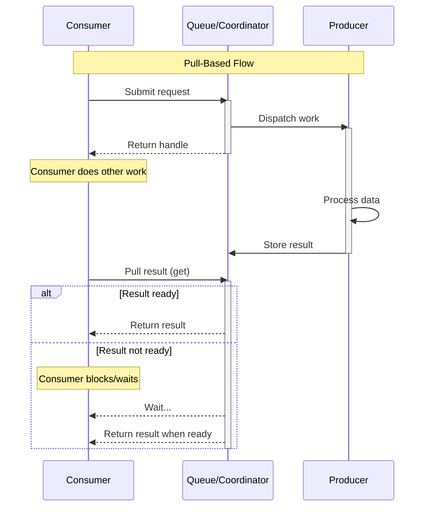
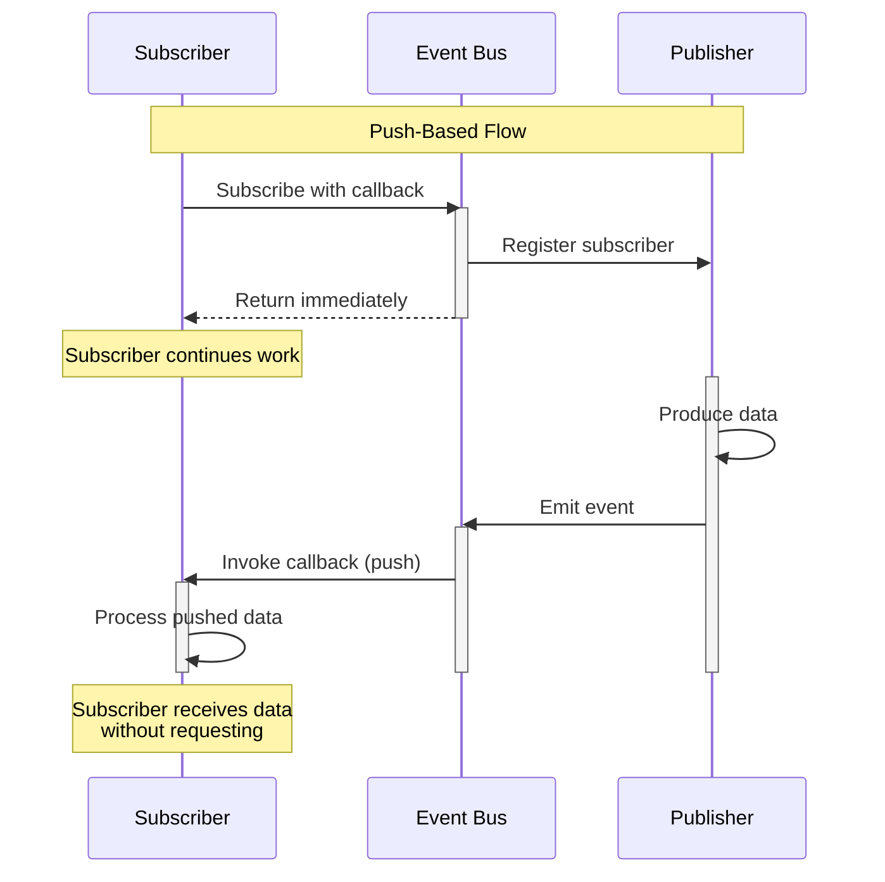
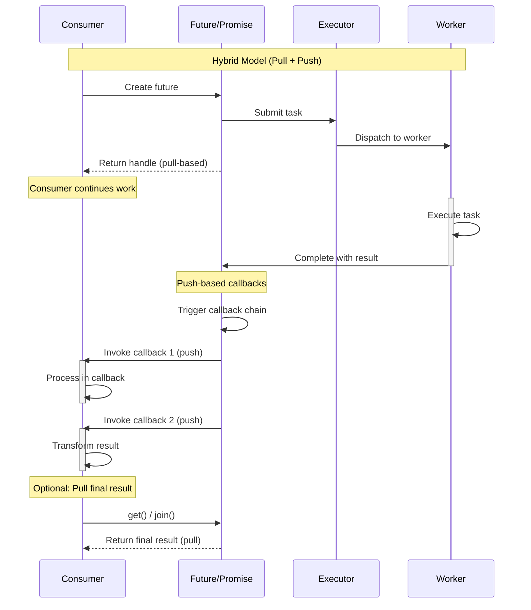

#operating-system #process-synchronization #parallel-programming #reactive-programming
#event-driven-programming 
# Polling - Pull-based model

# Interrupts - Push-based model

# I/O Multiplexing - Hybrid model

***
# References
1. 