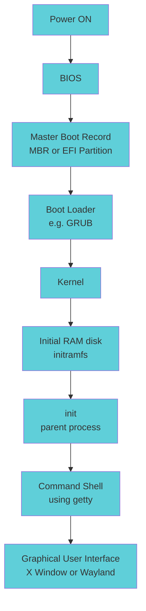

#linux #operating-system #fedora #ubuntu #debian #rhel #centos-stream 

# Basic Input/Output System (BIOS)
- When the computer is powered on, the Basic Input/Output System (BIOS) initializes the hardware, including the screen and keyboard, and tests the main memory. This process is also called Power On Self Test (POST).
- The BIOS software is stored on a read-only memory (ROM) chip on the motherboard. After this, the remainder of the boot process is controlled by the operating system (OS).
# Boot loader
- Once the POST is completed, system control passes from the BIOS to the **boot loader**. 
- There are multiple types of boot loaders
    - GRUB (for GRand Unified Boot loader).
    - ISOLINUX (for booting from removable media).
    - DAS U-Boot (for booting on embedded devices/appliances). Most Linux boot loaders can present a user interface for choosing alternative options for booting Linux and even other operating systems that might be installed.
- The boot loader is responsible for *loading the kernel image* and the initial RAM *disk* or *critical filesystem* into memory.
### Basic Input/Output System - Master Boot Record (BIOS/MBR)
- The boot loader resides at the first sector of the hard disk. The size of the MBR is just 512 bytes. 
- In this stage, the boot loader examines the partition table and finds a bootable partition and loads it into RAM.
### (Unified) Extensible Firmware Interface (EFI/UEFI)
- UEFI firmware reads its Boot Manager data to determine which and where UEFI application. The firmware then launches the UEFI application.
- The second stage boot loader resides under /boot. A splash screen is displayed, which allows user to choose which operating system (OS) and/or kernel to boot. 
- Kernels are uncompressed and it will check and analyze the system hardware and initialize any hardware device drivers.
# The initial RAM Disk
- The initramfs filesystem image contains programs and binary files that perform all actions needed to mount the root filesystem.
- After the root filesystem has been found, it is checked for errors and mounted.
- The mount program instructs the operating system that a filesystem is ready for use and binds it with the *mount point*. If this is successful, the initramfs is cleared from RAM, and the `init` program on the root filesystem (`/sbin/init`) is executed.
- `/sbin/init` handles the mounting and pivoting over to the *final real root filesystem*. If special hardware drivers are needed before the mass storage can be accessed, they must be in the initramfs image.
- ![[assets/Pasted image 20251224203339.png]]
- Near the end of the boot process, **init** optionally starts a number of text-mode login prompts.
***
# References
1. 
