#operating-system #shell #ubuntu #linux #software-architecture #file-system 

# Filesystem architecture
- The parent directory is `/`

```mermaid
graph TD
    Root["/"]
    
    Root --> bin["/bin<br/>Commands: ls, cat, bash"]
    Root --> sbin["/sbin<br/>Admin: fdisk, reboot"]
    Root --> etc["/etc<br/>Config files"]
    Root --> dev["/dev<br/>Hardware devices"]
    Root --> proc["/proc<br/>Process info (virtual)"]
    Root --> var["/var<br/>Logs, cache"]
    Root --> tmp["/tmp<br/>Temp files"]
    Root --> usr["/usr<br/>User programs"]
    Root --> home["/home<br/>User directories"]
    Root --> boot["/boot<br/>Kernel, bootloader"]
    Root --> lib["/lib<br/>Shared libraries"]
    Root --> opt["/opt<br/>3rd party apps"]
    Root --> mnt["/mnt<br/>Manual mounts"]
    Root --> media["/media<br/>USB, CD-ROM"]
    Root --> srv["/srv<br/>Service data"]
    
    style Root fill:#FFD700
    style bin fill:#90EE90
    style sbin fill:#87CEEB
    style etc fill:#FFB6C1
    style dev fill:#DDA0DD
    style proc fill:#F0E68C
    style var fill:#FFA07A
    style tmp fill:#FF6347
    style usr fill:#98FB98
    style home fill:#87CEFA
    style boot fill:#FFE4B5
    style lib fill:#D8BFD8
    style opt fill:#FFDAB9
    style mnt fill:#E0FFFF
    style media fill:#F5DEB3
    style srv fill:#FAFAD2
```

## Boot loader
- The directory `/boot`
- Contains the file used by the boot loader `grub.cfg`
- 
## System devices
- The directory `/dev`
- 
- Contains information about terminal devices, usb, or any device attached to the system.
## Root directory
- The directory `/root`
- Every single file and directory starts from the root directory.
- Privileged.
- Different from `/` directory.
## Configuration files
- The directory `/etc`
- Contains configuration files required by all programs: ==startup and shutdown shell scripts== used to start/stop individual programs.
- 
## User binaries
- The `/bin` directory.
- Contains binary executables and shared linux commands. (e.g: ps, ping, ls, cp,...)
- 
## System binaries
- The `sbin` directory.
- Contain binary executables and commands ==for system aministrator== and for system maintenance purpose (e.g: iptables, reboot, fdisk, ifconfig, swapon).
- 
## Process
- The `/proc` directory.
- Virtual filesystem containing information about the running processes.
- 
- 
## Variable files
- The `var` directory.
- Contains content of the files that are ==expected to grow==:
	- system log files (/var/log); 
	- packages and database files (/var/lib); emails (/var/mail); 
	- print queues (/var/spool); lock files (/var/lock); 
	- temp files needed across reboots (/var/tmp);
- 
## Temporary files
- The `tmp` directory.
- Contains temporary files created by system or users and deleted when system is rebooted.
- 
## User programs
- The `usr` directory.
- Contains binaries, libraries, documentation, and source-code for second level programs.
## User binaries
### User binary programs
- The directory `usr/bin`
### Super user binary programs
- The directory `usr/sbin`
### Installed from source
- The directory `usr/local`
- Contains user programs installed from sources.
## Home directory
- The directory `/home`
- The directory for all users' personal file.
- 
## Optional add-on applications
- The directory `/opt`
- Contains add-on programs from vendors.
## Mount directory
- The directory `/mnt`
- Temporary mount directory where sysadmins can mount filesystems.
## Removable media devices
- The directory `/media`
- Temporary mount directory for removable devices. 
	- `/media/cdrom` for CD-ROM; 
	- `/media/floppy` for floppy drives; 
	- `/media/cdrecorder` for CD writer
## Service data
- The directory `srv`.
- Contains the service-related data.
***
# References
1. 