#operating-system #io-management #interrupt #polling #event-notification #linux
- Event notification mechanisms are fundamental techniques for detecting and responding to I/O events in operating systems. The two primary approaches are ==polling== (programmed I/O) and ==interrupts== (interrupt-driven I/O).
# Event notification
- When an I/O operation is initiated, the CPU needs a way to know when the device has completed the operation or requires attention. There are two fundamental approaches:
    - **Polling**: CPU repeatedly checks device status registers to detect events.
    - **Interrupts**: Device signals the CPU when an event occurs.
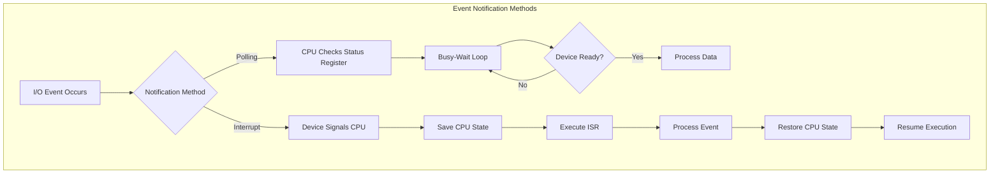
# Polling
- Polling (or programmed I/O) is a technique where the CPU continuously checks the status of an I/O device by reading status registers in a loop until the device is ready.
## Components
- **Status Register**: Hardware register indicating device state (ready, busy, error)
- **Data Register**: Register containing data to be read/written
- **Control Register**: Register for sending commands to the device
- **Polling Loop**: Software loop that checks status register repeatedly
## Execution Flow

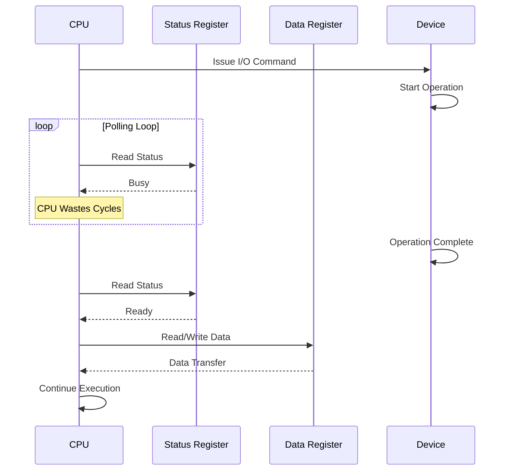

## Detailed State Diagram

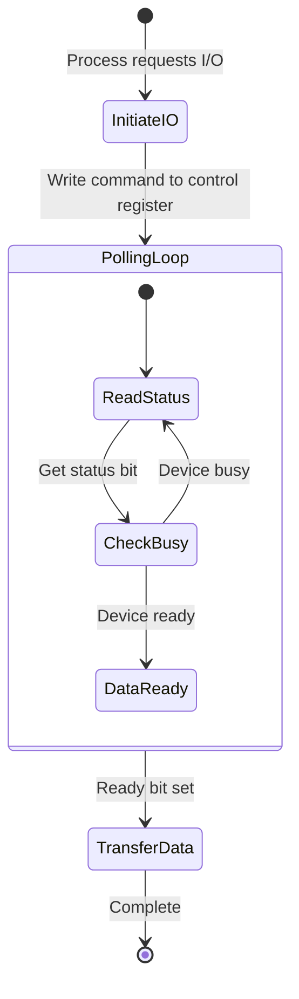
## Implementation Example
```c title='Polling implementation in C'
#include <stdint.h>
#include <stdbool.h>

// Device registers (memory-mapped I/O)
#define DEVICE_STATUS   ((volatile uint32_t*)0x40000000)
#define DEVICE_DATA     ((volatile uint32_t*)0x40000004)
#define DEVICE_CONTROL  ((volatile uint32_t*)0x40000008)

// Status register bits
#define STATUS_READY    (1 << 0)
#define STATUS_ERROR    (1 << 1)

// Control commands
#define CMD_READ        0x01
#define CMD_WRITE       0x02

/**
 * Poll device until ready or error
 * Returns: true if ready, false if error
 */
bool poll_device_ready(void) {
    while (1) {
        uint32_t status = *DEVICE_STATUS;

        if (status & STATUS_ERROR) {
            return false;  // Error occurred
        }

        if (status & STATUS_READY) {
            return true;   // Device ready
        }

        // CPU wastes cycles here in busy-wait
    }
}

/**
 * Read data from device using polling
 */
int read_device_polling(uint32_t *buffer, size_t count) {
    for (size_t i = 0; i < count; i++) {
        // Issue read command
        *DEVICE_CONTROL = CMD_READ;

        // Poll until ready
        if (!poll_device_ready()) {
            return -1;  // Error
        }

        // Read data
        buffer[i] = *DEVICE_DATA;
    }

    return count;
}
```
## Advantage
- Simple to implement
- Predictable timing
- No interrupt overhead
- Suitable for fast devices
- Good for real-time systems with strict timing
## Disadvantage
- Wastes CPU cycles during waiting
- Inefficient for slow devices
- Cannot perform other tasks while polling
- High CPU utilization
- Poor scalability with multiple devices
## Use case
- Embedded systems with simple, fast devices
- Real-time systems requiring deterministic behavior
- Situations where interrupt latency is unacceptable
- Devices with very short response times
# Interrupt
- ==Interrupts== are hardware signals sent by devices to the CPU to indicate that an event requires attention. The CPU suspends current execution, handles the event, and resumes.
## Components
- **Interrupt Request (IRQ) Line**: Hardware signal line from device to CPU
- **Interrupt Controller**: Hardware that manages multiple interrupt sources (e.g., PIC, APIC)
- **Interrupt Vector Table (IVT)**: Table mapping interrupt numbers to handler addresses
- **Interrupt Service Routine (ISR)**: Software function that handles the interrupt
- **Interrupt Mask Register**: Controls which interrupts are enabled/disabled
- **CPU Interrupt Flag**: CPU flag enabling/disabling interrupt processing
## Interrupt Controller Architecture

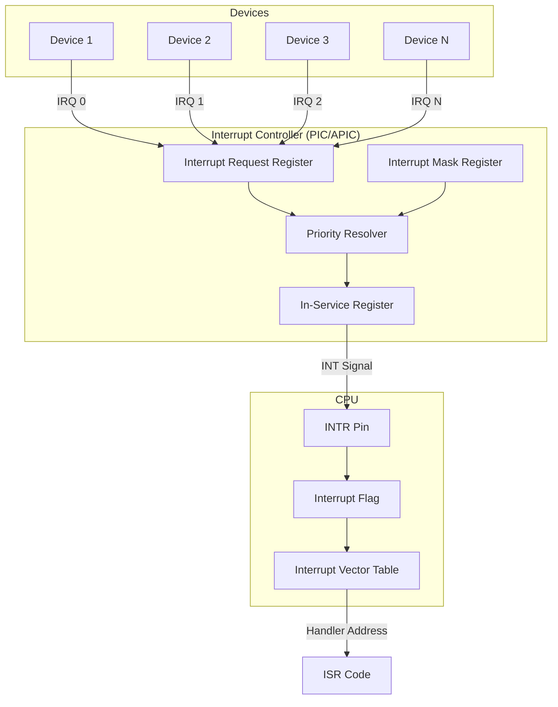

## Execution Flow
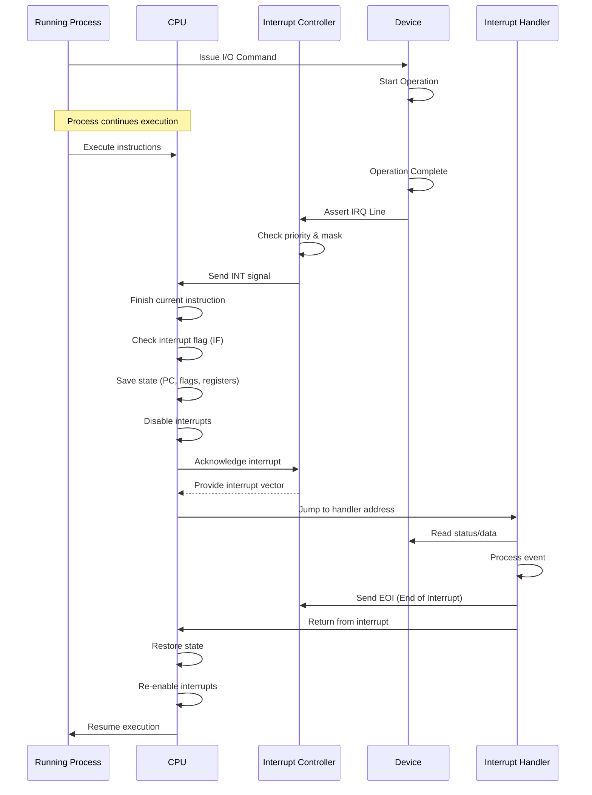

## Detailed Interrupt Handling Flow

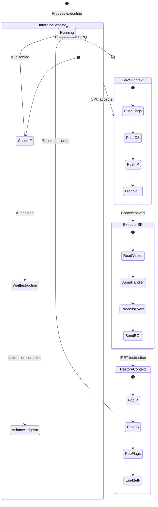
## Implementation Example
```c title='Interrupt-based I/O in Linux kernel module'
#include <linux/module.h>
#include <linux/kernel.h>
#include <linux/interrupt.h>
#include <linux/io.h>

#define DEVICE_IRQ      11
#define DEVICE_STATUS   0x40000000
#define DEVICE_DATA     0x40000004

static void __iomem *device_base;
static volatile uint32_t *data_buffer;
static size_t buffer_index = 0;

/**
 * Interrupt Service Routine (ISR)
 * Called when device asserts IRQ line
 */
static irqreturn_t device_interrupt_handler(int irq, void *dev_id) {
    uint32_t status;

    // Read status register
    status = ioread32(device_base + DEVICE_STATUS);

    // Check if this device caused interrupt
    if (!(status & STATUS_READY)) {
        return IRQ_NONE;  // Not our interrupt
    }

    // Read data from device
    data_buffer[buffer_index++] = ioread32(device_base + DEVICE_DATA);

    // Clear interrupt flag (device-specific)
    iowrite32(0, device_base + DEVICE_STATUS);

    return IRQ_HANDLED;
}

/**
 * Initialize device and register interrupt handler
 */
static int __init device_init(void) {
    int ret;

    // Map device registers
    device_base = ioremap(DEVICE_STATUS, 0x1000);
    if (!device_base) {
        return -ENOMEM;
    }

    // Allocate buffer
    data_buffer = kmalloc(4096 * sizeof(uint32_t), GFP_KERNEL);
    if (!data_buffer) {
        iounmap(device_base);
        return -ENOMEM;
    }

    // Register interrupt handler
    ret = request_irq(
        DEVICE_IRQ,                    // IRQ number
        device_interrupt_handler,       // Handler function
        IRQF_SHARED,                   // Flags (shared IRQ)
        "mydevice",                    // Device name
        (void *)device_interrupt_handler  // Device ID
    );

    if (ret) {
        printk(KERN_ERR "Failed to register IRQ %d\n", DEVICE_IRQ);
        kfree(data_buffer);
        iounmap(device_base);
        return ret;
    }

    printk(KERN_INFO "Device initialized with IRQ %d\n", DEVICE_IRQ);
    return 0;
}

/**
 * Cleanup: unregister interrupt and free resources
 */
static void __exit device_exit(void) {
    // Free IRQ
    free_irq(DEVICE_IRQ, (void *)device_interrupt_handler);

    // Free resources
    kfree(data_buffer);
    iounmap(device_base);

    printk(KERN_INFO "Device removed\n");
}

module_init(device_init);
module_exit(device_exit);

MODULE_LICENSE("GPL");
MODULE_AUTHOR("System Engineer");
MODULE_DESCRIPTION("Interrupt-driven device driver example");
```
## Interrupt Priority and Nesting


## Advantages
- CPU can perform other tasks while waiting
- Efficient for slow devices
- Lower CPU utilization
- Scales well with multiple devices
- Better system responsiveness
## Disadvantages
- More complex implementation
- Interrupt overhead (context switching)
- Non-deterministic timing
- Potential for race conditions
- Interrupt storms can degrade performance
## Use case
- General-purpose operating systems
- Systems with multiple I/O devices
- Slow devices (disk, network, user input)
- Multitasking environments
- When CPU efficiency is important
# Comparison

| Aspect | Polling | Interrupts |
|--------|---------|-----------|
| **CPU Utilization** | High (busy-wait) | Low (event-driven) |
| **Response Time** | Predictable | Variable |
| **Complexity** | Simple | Complex |
| **Overhead** | Minimal per check | Context switch overhead |
| **Scalability** | Poor (multiple devices) | Good |
| **Best For** | Fast devices | Slow devices |
| **Power Consumption** | High | Lower |
| **Real-time** | Better determinism | Less predictable |

## Performance Analysis

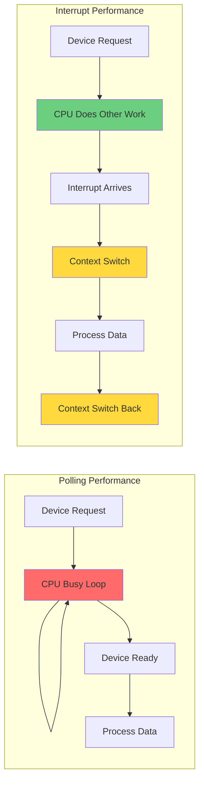

### Time cost analysis
#### Polling
- The total time required for a processor to service an I/O device via polling is $$T_\text{polling} = T_\text{busy wait} + T_\text{data transfer}$$
    - $T_\text{busy wait}$ is the cumulative time the processor spends *polling* he device's status register, waiting for it to signal that it is ready, which introduces *pure overhead*.
    - $T_\text{data transfer}$ is is the time required to perform the actual *useful work*: moving data between the device and memory such as reading a byte from a port, writing a block to a buffer.
    - Polling is efficient when $T_\text{busy wait} \ll T_\text{data transfer}$
## Interrupts
- For a *single I/O event*, the time the CPU spends on servicing an interrupt is $$T_\text{interrupt}=T_\text{productive work} + 2\times T_\text{context switch}+T_\text{ISR}$$
    - $T_\text{productive work}$ is the time during which the CPU executes useful tasks *unrelated to the I/O* operation while the device prepares itself.
    - $2\times T_\text{context switch}$ is the fixed overhead:
        - *Suspend* the currently running process (save its state to the PCB) and *enter kernel mode* to execute the Interrupt Service Routine (ISR).
        - *Exit* the ISR, restore the saved process state (or schedule a new one), and *return to user mode.*
    - $T_\text{ISR}$ is the execution time of the Interrupt Service Routine itself, which performs the minimal, time-critical actions such as reading a byte from a port, acknowledging the interrupt, triggering the next operation.
## Hybrid Approaches
- Modern systems often combine polling and interrupts for optimal performance.
### Interrupt Coalescing

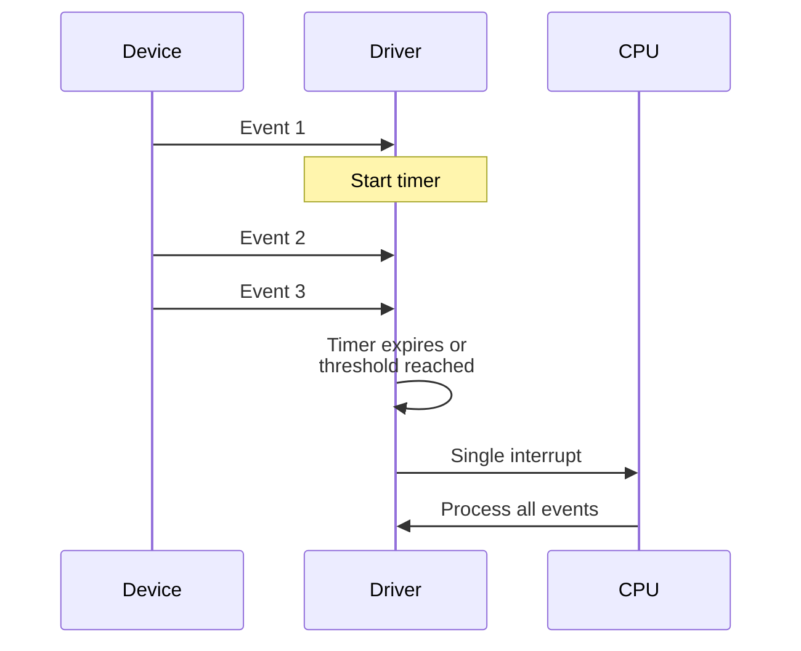

**Description**: Combine multiple events into a single interrupt to reduce overhead. Used in high-throughput network cards.

### Polling Mode (NAPI in Linux)

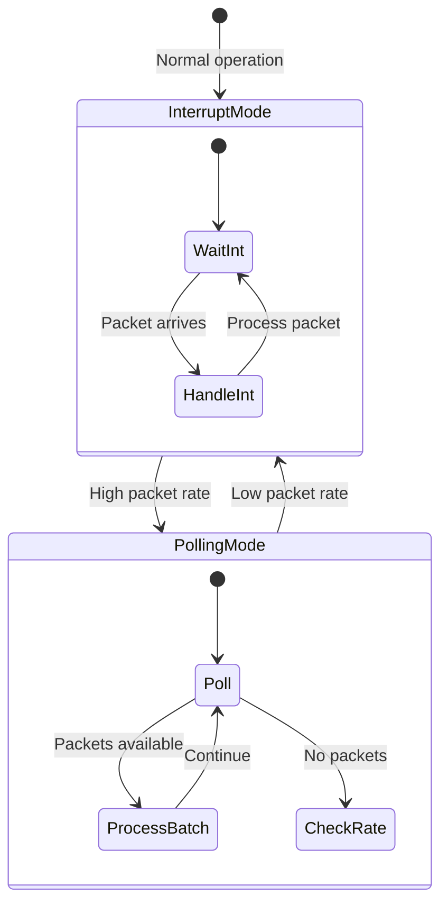

**Description**: Start with interrupts, switch to polling under high load to avoid interrupt storm.

```c title='NAPI polling example (simplified Linux concept)'
// Traditional interrupt mode
static irqreturn_t eth_interrupt(int irq, void *dev_id) {
    struct net_device *dev = dev_id;

    // Disable device interrupts
    disable_device_irq(dev);

    // Schedule NAPI polling
    napi_schedule(&dev->napi);

    return IRQ_HANDLED;
}

// NAPI poll function
static int eth_poll(struct napi_struct *napi, int budget) {
    int work_done = 0;

    // Poll for packets (no interrupts)
    while (work_done < budget) {
        struct sk_buff *skb = receive_packet();
        if (!skb)
            break;

        netif_receive_skb(skb);
        work_done++;
    }

    // If we processed fewer than budget, re-enable interrupts
    if (work_done < budget) {
        napi_complete(napi);
        enable_device_irq(dev);
    }

    return work_done;
}
```

### Adaptive Polling

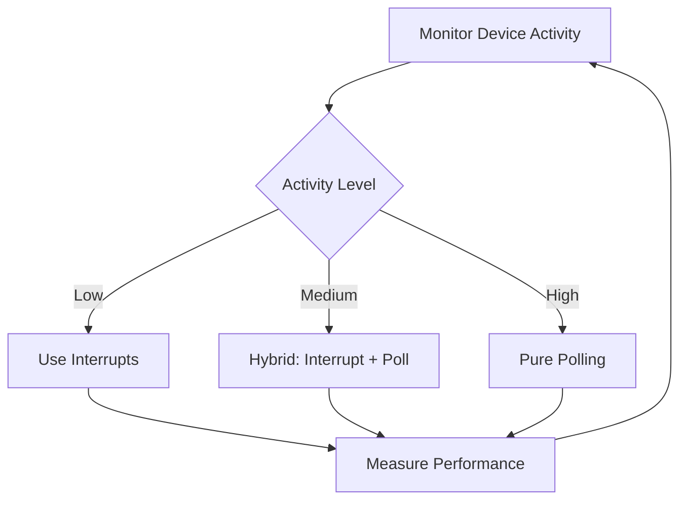

**Description**: Dynamically switch between polling and interrupts based on device activity and system load.

## Linux-Specific Implementations

### Interrupt Handling Layers

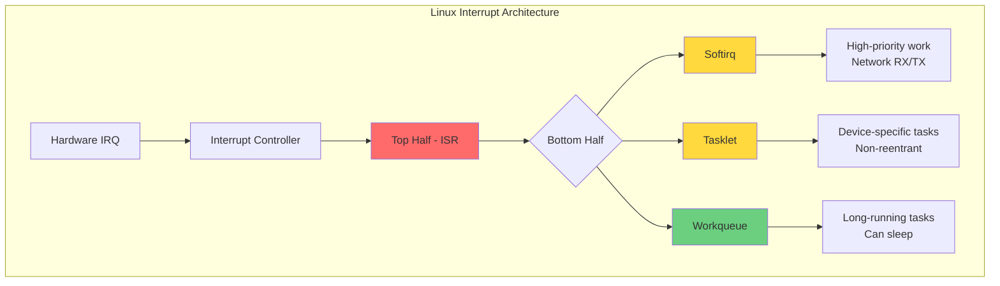

**Top Half (Hard IRQ Context):**
- Runs with interrupts disabled
- Must be fast and non-blocking
- Cannot sleep or call blocking functions
- Minimal work: acknowledge device, schedule bottom half

**Bottom Half (Deferred Work):**
- Runs with interrupts enabled
- More time to process
- Three mechanisms: softirq, tasklet, workqueue

### `/proc/interrupts` Example

```text
           CPU0       CPU1       CPU2       CPU3
  0:        142          0          0          0   IO-APIC   2-edge      timer
  1:          9          0          0          0   IO-APIC   1-edge      i8042
  8:          0          0          0          0   IO-APIC   8-edge      rtc0
  9:          0          0          0          0   IO-APIC   9-fasteoi   acpi
 14:          0          0          0          0   IO-APIC  14-edge      ata_piix
 15:      26342          0          0          0   IO-APIC  15-edge      ata_piix
 24:          0          0          0          0   PCI-MSI 512000-edge      ahci[0000:00:1f.2]
 25:      45231      12453       8732       6421   PCI-MSI 513024-edge      eth0
 26:       2341          0          0          0   PCI-MSI 442368-edge      snd_hda_intel
```
### Interrupt Affinity
```Shell
# Check interrupt affinity (which CPUs handle which interrupts)
cat /proc/irq/25/smp_affinity

# Set interrupt 25 to CPU 0 only
echo 1 > /proc/irq/25/smp_affinity

# Set interrupt 25 to CPUs 0 and 1
echo 3 > /proc/irq/25/smp_affinity  # 3 = 0011 binary = CPU 0,1
```

### Modern I/O Event Notification APIs
**epoll (Linux):** Event notification for file descriptors using hybrid polling
```c
int epfd = epoll_create1(0);
struct epoll_event event;
event.events = EPOLLIN;  // Monitor for input
event.data.fd = sockfd;
epoll_ctl(epfd, EPOLL_CTL_ADD, sockfd, &event);

// Wait for events (blocks until event or timeout)
struct epoll_event events[10];
int nfds = epoll_wait(epfd, events, 10, -1);
```

**io_uring (Modern Linux):** Asynchronous I/O with minimal syscall overhead
```c
struct io_uring ring;
io_uring_queue_init(QUEUE_DEPTH, &ring, 0);

// Submit read operation
struct io_uring_sqe *sqe = io_uring_get_sqe(&ring);
io_uring_prep_read(sqe, fd, buffer, size, offset);
io_uring_submit(&ring);

// Poll for completion
struct io_uring_cqe *cqe;
io_uring_wait_cqe(&ring, &cqe);  // Blocks until completion
```

## Performance Considerations

### When to Use Polling

- Device response time < 10 microseconds
- Embedded systems with dedicated CPU cores
- Real-time systems requiring deterministic latency
- CPU can afford to busy-wait (single-purpose system)

### When to Use Interrupts

- Device response time > 1 millisecond
- Multitasking operating systems
- Multiple I/O devices
- CPU time is valuable for other tasks

### Optimization Strategies

**Interrupt Mitigation:**
- Interrupt coalescing (batch multiple events)
- Adaptive interrupt moderation (adjust rate dynamically)
- Interrupt affinity (bind to specific CPU cores)

**Polling Optimization:**
- Backoff algorithms (increase polling interval if no activity)
- Busy-poll timeout (poll for limited time, then sleep)
- Lock-free polling loops for low latency
***
# References
1. Operating System Concepts - Abraham Silberschatz, Peter B. Galvin, Greg Gagne - 10th Edition
   2. Chapter 13: I/O Systems
   3. Section 13.2: I/O Hardware
   4. Section 13.3: Application I/O Interface
5. Linux Kernel Development - Robert Love - 3rd Edition
   6. Chapter 7: Interrupts and Interrupt Handlers
   7. Chapter 8: Bottom Halves and Deferring Work
8. Understanding the Linux Kernel - Daniel P. Bovet, Marco Cesati - 3rd Edition
   9. Chapter 4: Interrupts and Exceptions
10. https://www.kernel.org/doc/html/latest/core-api/index.html
11. https://lwn.net/Articles/520198/ - NAPI documentation
12. https://man7.org/linux/man-pages/man7/epoll.7.html
13. https://kernel.dk/io_uring.pdf - Efficient I/O with io_uring
