#linux #operating-system #memory-management #memory-management #unix #fedora #ubuntu #debian #rhel #centos-stream
- Memory management is a critical function of the operating system that manages primary memory.
- <mark class="hltr-yellow">Provides each process with its own address space while protecting processes from each other</mark>.
- Coordinates allocation and deallocation of memory for processes.
- Implements virtual memory to provide illusion of larger memory than physically available.
# Memory Management Objectives
## Primary Goals
1. **Relocation**
	- Allow programs to be loaded at different memory addresses.
	- Support moving processes in memory during execution.
2. **Protection**
	- <mark class="hltr-yellow">Prevent processes from accessing memory belonging to other processes</mark>.
	- Protect operating system memory from user processes.
3. **Sharing**
	- Allow controlled sharing of memory between processes.
	- Share code libraries and data segments efficiently.
4. **Logical Organization**
	- Provide abstraction from physical memory layout.
	- Support modular programming with separate segments.
5. **Physical Organization**
	- Manage movement between main memory and secondary storage.
	- Optimize memory utilization and performance.
# Address Concepts
## Logical Address (Virtual Address)
- <mark class="hltr-yellow">Address generated by the CPU during program execution</mark>.
- Used by the program and visible to the programmer.
- Independent of physical memory location.
- Also called virtual address.
## Physical Address
- <mark class="hltr-yellow">Actual address in physical memory (RAM)</mark>.
- Hardware-level address used by memory unit.
- Not directly visible to user programs.
## Address Space
- **Logical Address Space**: Range of all logical addresses generated by a program.
- **Physical Address Space**: Range of all physical addresses available in main memory.
## Address Binding
- <mark class="hltr-yellow">Mapping logical addresses to physical addresses</mark>.
- Can occur at different stages of program execution.
### Address Binding Stages
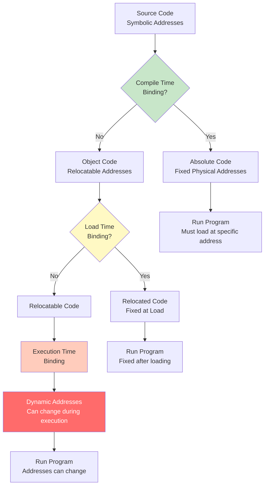
### Binding Types
#### Compile-Time Binding
- Addresses fixed at compilation.
- Generates absolute code.
- Must recompile if starting location changes.
- Rarely used in modern systems.
#### Load-Time Binding
- Addresses fixed when program is loaded.
- Generates relocatable code.
- Requires relocation if process moves.
- Used by some embedded systems.
#### Execution-Time Binding
- <mark class="hltr-yellow">Addresses can change during execution</mark>.
- Requires hardware support (MMU).
- Most flexible approach.
- Standard in modern operating systems.
# Memory Management Unit (MMU)
- <mark class="hltr-yellow">Hardware device that translates logical addresses to physical addresses</mark>.
- Performs address translation at runtime.
- Provides memory protection and access control.
## Basic MMU Operation
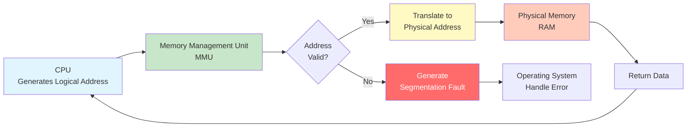
## Relocation Register (Base Register)
- Contains starting physical address of process.
- Added to every logical address generated by process.
- Simple form of address translation.
### Base and Limit Registers
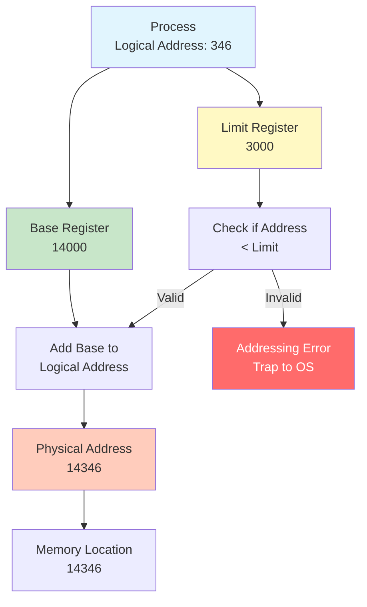
### Address Translation with Base Register
```
Logical Address: 346
Base Register: 14000
Physical Address = Base + Logical = 14000 + 346 = 14346

If Logical Address >= Limit Register:
    Generate trap (addressing error)
```
# Memory Allocation
## Contiguous Memory Allocation
- <mark class="hltr-yellow">Each process occupies a single contiguous section of memory</mark>.
- Memory divided into fixed or variable partitions.
- Simple to implement but can waste memory.
### Fixed Partitioning
- Memory divided into fixed-size partitions.
- One process per partition.
- Internal fragmentation occurs.
#### Fixed Partition Example
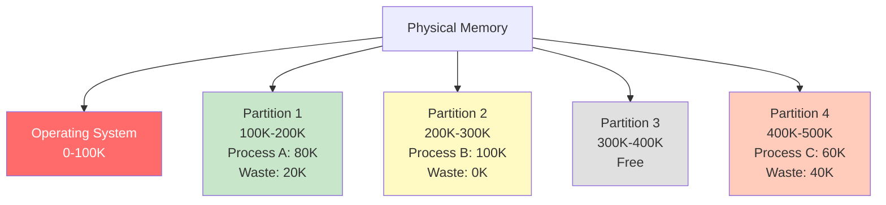
### Variable Partitioning (Dynamic Partitioning)
- Partitions created dynamically based on process size.
- More flexible than fixed partitioning.
- External fragmentation occurs over time.
#### Dynamic Allocation Example
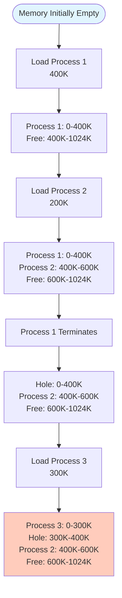
## Allocation Strategies
### First Fit
- <mark class="hltr-yellow">Allocate first hole large enough to hold process</mark>.
- Fast allocation.
- May leave small unusable holes at beginning.
### Best Fit
- Allocate smallest hole large enough.
- Minimizes wasted space.
- Slower than first fit (must search all holes).
- Creates many small holes.
### Worst Fit
- Allocate largest available hole.
- Leaves larger remaining holes.
- Also requires searching all holes.
- Performance generally poor.
### Allocation Strategy Comparison
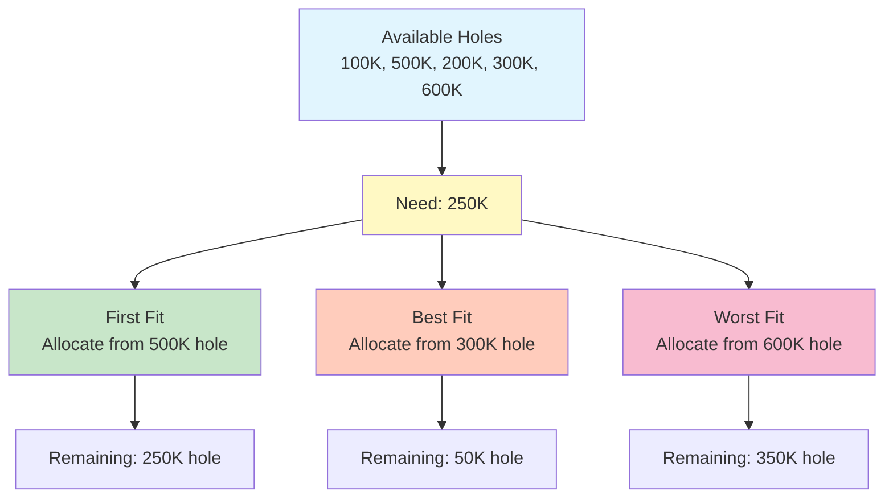
# Fragmentation
## Internal Fragmentation
- <mark class="hltr-yellow">Wasted memory within allocated partition</mark>.
- Occurs with fixed-size partitions.
- Process allocated more memory than needed.
### Internal Fragmentation Example
```
Partition Size: 100K
Process Size: 80K
Internal Fragmentation: 20K (wasted)

Total Internal Fragmentation = Sum of waste in all partitions
```
## External Fragmentation
- <mark class="hltr-yellow">Free memory scattered in small non-contiguous blocks</mark>.
- Enough total free memory exists but not contiguous.
- Occurs with variable partitioning.
### External Fragmentation Example
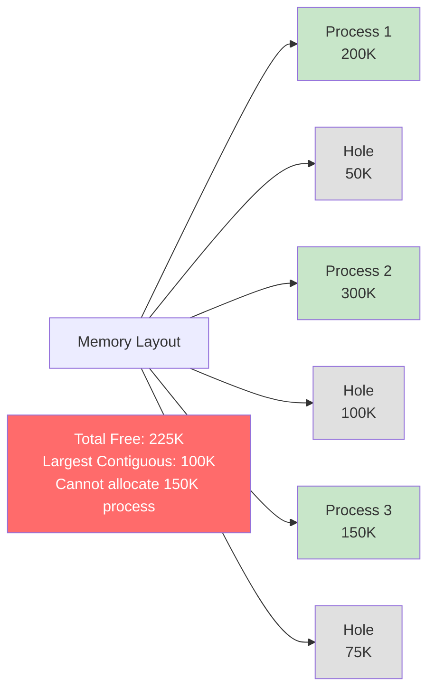
### Fifty-Percent Rule
- Statistical analysis shows that on average:
- <mark class="hltr-yellow">One-third of memory may be unusable due to fragmentation</mark>.
- If N allocated blocks exist, approximately N/2 holes exist.
## Compaction
- Shuffle processes to combine free holes.
- <mark class="hltr-yellow">Eliminates external fragmentation by creating one large free block</mark>.
- Only possible with execution-time address binding.
- Expensive operation (requires moving processes).
### Compaction Process
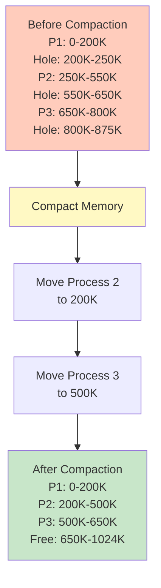
# Memory Protection
## Hardware Support
### Protection Bits
- Each memory block has protection bits.
- Define allowed operations: read, write, execute.
- Enforced by MMU during address translation.
### Protection Mechanism
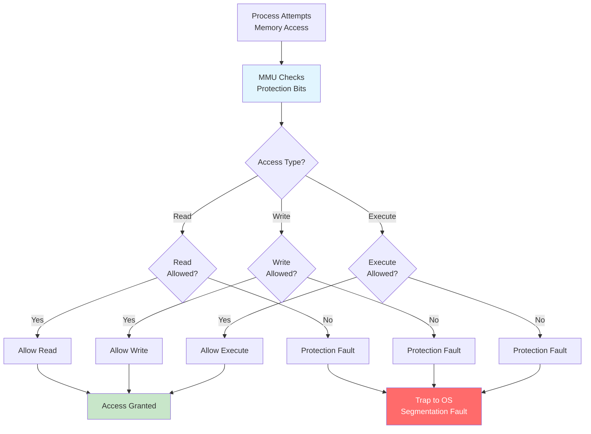
## Kernel vs User Mode
### CPU Modes
- **Kernel Mode (Supervisor Mode)**
	- <mark class="hltr-yellow">Full access to all hardware and memory</mark>.
	- Can execute privileged instructions.
	- Operating system runs in this mode.
- **User Mode**
	- Restricted access to memory and instructions.
	- Cannot directly access hardware.
	- User processes run in this mode.
### Mode Bit
- Hardware maintains mode bit.
- 0 = Kernel mode, 1 = User mode.
- System calls switch from user to kernel mode.
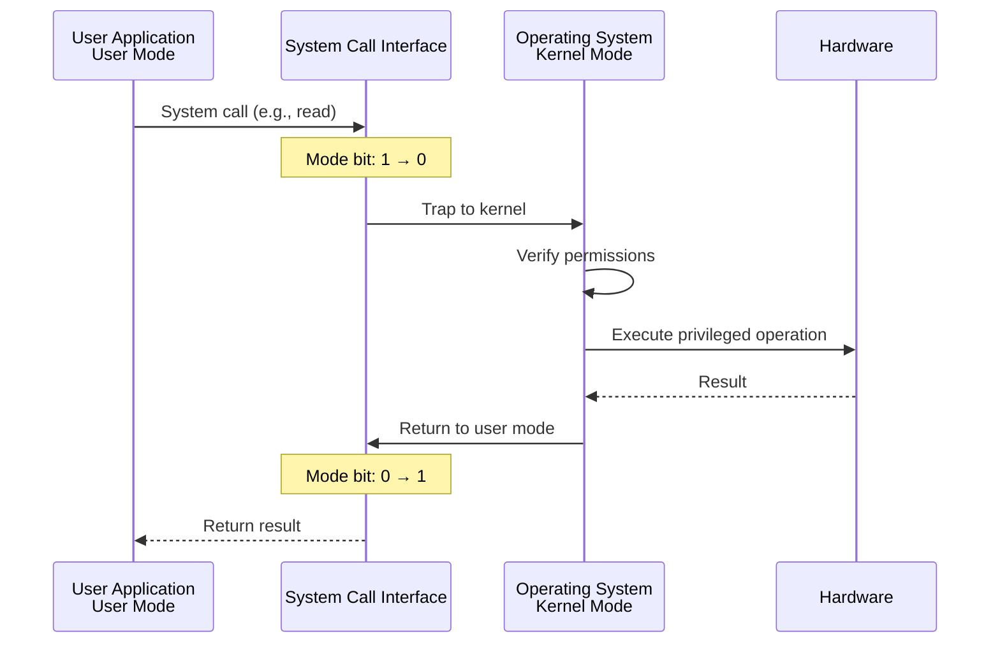
# Linux Memory Management
## Memory Layout
### Process Memory Layout
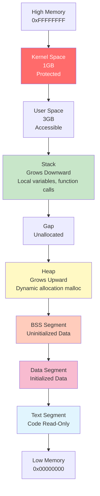
### Memory Segments
#### Text Segment
- Contains executable code.
- Read-only and sharable.
- Multiple processes can share same text segment.
#### Data Segment
- **Initialized Data**: Global and static variables with initial values.
- **BSS (Block Started by Symbol)**: Uninitialized global and static variables.
- Read-write access.
#### Heap
- <mark class="hltr-yellow">Dynamically allocated memory during runtime</mark>.
- Grows upward toward higher addresses.
- Managed by `malloc()`, `calloc()`, `free()`.
#### Stack
- <mark class="hltr-yellow">Stores local variables and function call information</mark>.
- Grows downward toward lower addresses.
- Automatically managed by compiler.
- Contains stack frames for function calls.
## Viewing Process Memory
```Shell title='View process memory layout'
# View memory map of running process
cat /proc/self/maps

# View memory map of specific process
cat /proc/<PID>/maps

# Example output:
# 00400000-00401000 r-xp 00000000 08:01 1234  /usr/bin/program  (text)
# 00601000-00602000 r--p 00001000 08:01 1234  /usr/bin/program  (data)
# 00602000-00603000 rw-p 00002000 08:01 1234  /usr/bin/program  (data)
# 7ffd12345000-7ffd12366000 rw-p 00000000 00:00 0  [stack]
# 7f1234567000-7f1234589000 rw-p 00000000 00:00 0  [heap]

# View detailed memory information
pmap <PID>

# View memory statistics
cat /proc/meminfo
```
### Memory Map Fields
```
Address Range     Permissions  Offset   Device  Inode  Path
00400000-00401000 r-xp        00000000 08:01   1234   /usr/bin/program
│                 │           │        │       │      │
│                 │           │        │       │      └─ File path
│                 │           │        │       └──────── Inode number
│                 │           │        └──────────────── Device (major:minor)
│                 │           └───────────────────────── Offset in file
│                 └───────────────────────────────────── Permissions (r/w/x/p)
└─────────────────────────────────────────────────────── Virtual address range

Permissions:
  r = readable
  w = writable
  x = executable
  p = private (copy-on-write)
  s = shared
```
## Memory Information Commands
```Shell title='Check system memory'
# Display memory usage
free -h

# Detailed memory information
cat /proc/meminfo

# Per-process memory usage
ps aux --sort=-%mem | head -10

# Virtual memory statistics
vmstat 1

# Detailed process memory
smaps /proc/<PID>/smaps

# Memory usage by process
top -o %MEM
```
# Practical Examples
## Example 1: View Process Memory Map
```Shell title='Examine process memory layout'
# Start a simple program
sleep 1000 &
PID=$!

# View memory regions
cat /proc/$PID/maps

# Output shows:
# 55e123400000-55e123401000 r--p  [text segment]
# 55e123401000-55e123402000 r-xp  [executable code]
# 55e123602000-55e123603000 r--p  [read-only data]
# 55e123603000-55e123604000 rw-p  [read-write data]
# 7ffc98765000-7ffc98786000 rw-p  [stack]
# 7f9876543000-7f9876544000 rw-p  [heap]

# View detailed memory map with sizes
pmap -x $PID

# Cleanup
kill $PID
```
## Example 2: Monitor Memory Usage
```Shell title='Monitor system memory'
# Watch memory usage in real-time
watch -n 1 'free -h'

# View memory statistics every second
vmstat 1 10

# Output shows:
# procs -----------memory---------- ---swap-- -----io---- -system-- ------cpu-----
#  r  b   swpd   free   buff  cache   si   so    bi    bo   in   cs us sy id wa st
#  0  0      0 2048M   256M  1024M    0    0     0     0  100  200  5  2 93  0  0

# Check which processes use most memory
ps aux --sort=-%mem | head -10
```
## Example 3: Analyze Memory Fragmentation
```Shell title='Check memory fragmentation'
# View buddy allocator information
cat /proc/buddyinfo

# Output shows free blocks at each order:
# Node 0, zone DMA      10  5  3  2  1  1  0  0  0  0  0
# Node 0, zone DMA32   100 80 60 40 20 10  5  2  1  0  0

# View fragmentation index
cat /proc/sys/vm/extfrag_threshold

# View memory zones
cat /proc/zoneinfo
```
## Example 4: Understand Address Space
```C title='Demonstrate address spaces'
#include <stdio.h>
#include <stdlib.h>
#include <unistd.h>

int global_init = 42;        // Initialized data segment
int global_uninit;           // BSS segment
const int global_const = 10; // Read-only data segment

void function() {
    int local = 5;           // Stack
    printf("Local variable (stack): %p\n", &local);
}

int main() {
    int *heap = malloc(sizeof(int)); // Heap
    static int static_var = 0;        // Data segment

    printf("Code segment (text): %p\n", &main);
    printf("Initialized data: %p\n", &global_init);
    printf("Uninitialized data (BSS): %p\n", &global_uninit);
    printf("Read-only data: %p\n", &global_const);
    printf("Static variable: %p\n", &static_var);
    printf("Heap allocation: %p\n", heap);

    function();

    free(heap);
    return 0;
}
```
```Shell title='Compile and run'
gcc -o memtest memtest.c
./memtest

# Output shows different memory regions:
# Code segment (text): 0x55e123401149
# Initialized data: 0x55e123604010
# Uninitialized data (BSS): 0x55e123604014
# Read-only data: 0x55e123402004
# Static variable: 0x55e123604018
# Heap allocation: 0x55e1236052a0
# Local variable (stack): 0x7ffc98765abc

# View process memory map
cat /proc/$(pgrep memtest)/maps
```
## Example 5: Memory Allocation Strategies
```C title='Simulate allocation strategies'
#include <stdio.h>
#include <stdlib.h>

#define NUM_HOLES 5
#define NUM_PROCESSES 3

typedef struct {
    int size;
    int allocated;
    int process_id;
} Hole;

void first_fit(Hole holes[], int num_holes, int process_size, int pid) {
    for (int i = 0; i < num_holes; i++) {
        if (!holes[i].allocated && holes[i].size >= process_size) {
            holes[i].allocated = 1;
            holes[i].process_id = pid;
            printf("First Fit: Allocated process %d (%dK) to hole %d (%dK)\n",
                   pid, process_size, i, holes[i].size);
            return;
        }
    }
    printf("First Fit: Cannot allocate process %d (%dK)\n", pid, process_size);
}

void best_fit(Hole holes[], int num_holes, int process_size, int pid) {
    int best_idx = -1;
    int min_diff = __INT_MAX__;

    for (int i = 0; i < num_holes; i++) {
        if (!holes[i].allocated && holes[i].size >= process_size) {
            int diff = holes[i].size - process_size;
            if (diff < min_diff) {
                min_diff = diff;
                best_idx = i;
            }
        }
    }

    if (best_idx != -1) {
        holes[best_idx].allocated = 1;
        holes[best_idx].process_id = pid;
        printf("Best Fit: Allocated process %d (%dK) to hole %d (%dK), waste: %dK\n",
               pid, process_size, best_idx, holes[best_idx].size, min_diff);
    } else {
        printf("Best Fit: Cannot allocate process %d (%dK)\n", pid, process_size);
    }
}

int main() {
    Hole holes[] = {{100, 0, -1}, {500, 0, -1}, {200, 0, -1}, {300, 0, -1}, {600, 0, -1}};
    int process_sizes[] = {212, 417, 112};

    printf("Available holes: 100K, 500K, 200K, 300K, 600K\n\n");

    // First Fit demonstration
    printf("=== First Fit Strategy ===\n");
    Hole ff_holes[NUM_HOLES];
    for (int i = 0; i < NUM_HOLES; i++) ff_holes[i] = holes[i];

    for (int i = 0; i < NUM_PROCESSES; i++) {
        first_fit(ff_holes, NUM_HOLES, process_sizes[i], i+1);
    }

    printf("\n=== Best Fit Strategy ===\n");
    Hole bf_holes[NUM_HOLES];
    for (int i = 0; i < NUM_HOLES; i++) bf_holes[i] = holes[i];

    for (int i = 0; i < NUM_PROCESSES; i++) {
        best_fit(bf_holes, NUM_HOLES, process_sizes[i], i+1);
    }

    return 0;
}
```
## Example 6: Detect Memory Leaks
```Shell title='Use valgrind to detect memory leaks'
# Install valgrind
sudo apt install valgrind  # Ubuntu/Debian
sudo dnf install valgrind  # Fedora

# Create program with memory leak
cat > leak.c << 'EOF'
#include <stdlib.h>
int main() {
    int *ptr = malloc(100 * sizeof(int));
    // Forgot to free(ptr);
    return 0;
}
EOF

gcc -g -o leak leak.c

# Run with valgrind
valgrind --leak-check=full ./leak

# Output shows:
# ==12345== HEAP SUMMARY:
# ==12345==     in use at exit: 400 bytes in 1 blocks
# ==12345==   total heap usage: 1 allocs, 0 frees, 400 bytes allocated
# ==12345==
# ==12345== 400 bytes in 1 blocks are definitely lost
# ==12345==    at 0x4C2BBAD: malloc (vg_replace_malloc.c:299)
# ==12345==    by 0x40052E: main (leak.c:3)
```
***
# References
1. Operating System Concepts - Abraham Silberschatz - 10th - 2018 - Pearson Publisher.
	1. Chapter 9: Main Memory.
		1. Section 9.1: Background.
		2. Section 9.2: Contiguous Memory Allocation.
		3. Section 9.3: Paging.
2. Modern Operating Systems - Andrew Tanenbaum - 4th Edition - 2014 - Pearson.
	1. Chapter 3: Memory Management.
3. Operating Systems: Three Easy Pieces - Remzi Arpaci-Dusseau - 2018.
	1. Chapter 13: Address Spaces.
	2. Chapter 15: Address Translation.
4. `man proc`, `man malloc`, `man mmap`, `man pmap`
5. https://www.kernel.org/doc/html/latest/admin-guide/mm/
6. https://www.kernel.org/doc/gorman/html/understand/
7. https://access.redhat.com/documentation/en-us/red_hat_enterprise_linux/8/html/monitoring_and_managing_system_status_and_performance/memory_8
