#linux #operating-system #memory-management #paging #memory-management #unix #fedora #ubuntu #debian #rhel #centos-stream
- Paging is a memory management scheme that eliminates the need for contiguous allocation.
- <mark class="hltr-yellow">Divides physical memory into fixed-size blocks called frames and logical memory into same-size blocks called pages</mark>.
- Eliminates external fragmentation and reduces internal fragmentation.
- Fundamental technique for implementing virtual memory.
# Paging Concepts
## Basic Definitions
### Page
- <mark class="hltr-yellow">Fixed-size block of logical memory</mark>.
- Typical sizes: 4 KB, 8 KB, 16 KB, or larger.
- Logical address space divided into pages.
### Frame (Page Frame)
- <mark class="hltr-yellow">Fixed-size block of physical memory</mark>.
- Same size as a page.
- Physical memory divided into frames.
### Page Table
- <mark class="hltr-yellow">Data structure that maps pages to frames</mark>.
- Maintained by operating system for each process.
- Used by MMU for address translation.
## Paging Architecture
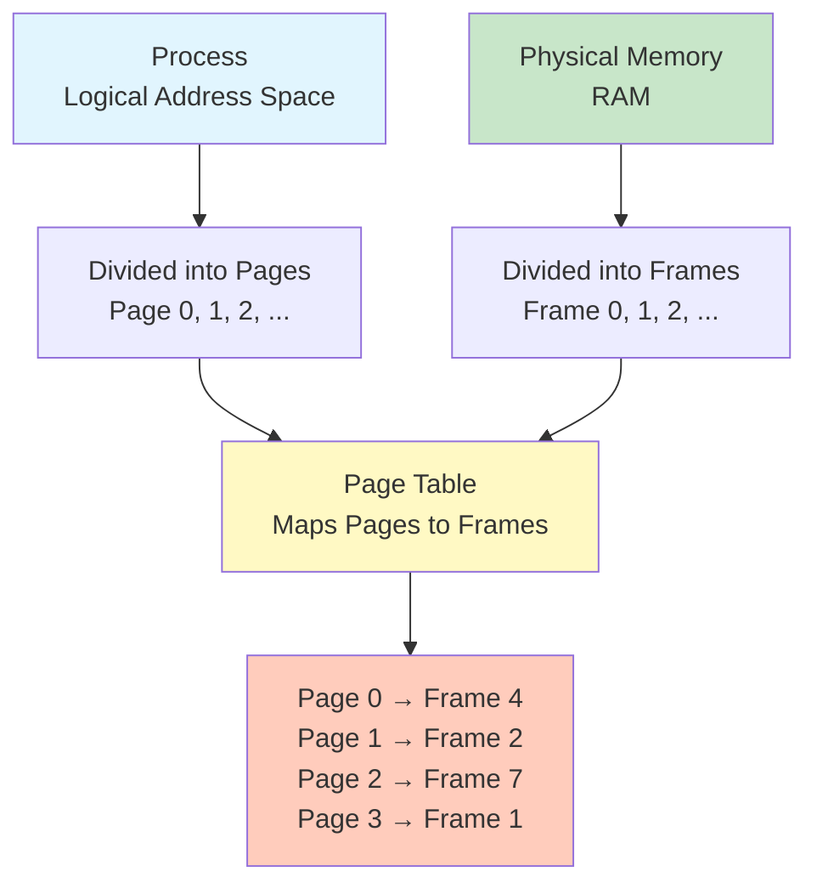
## Address Translation
### Logical Address Structure
```
Logical Address = Page Number + Page Offset

|  Page Number  |  Page Offset  |
|---------------|---------------|
|   p bits      |   d bits      |

Address Space Size = 2^(p+d) bytes
Page Size = 2^d bytes
Number of Pages = 2^p
```
### Physical Address Structure
```
Physical Address = Frame Number + Page Offset

|  Frame Number |  Page Offset  |
|---------------|---------------|
|   f bits      |   d bits      |

Physical Memory Size = 2^(f+d) bytes
Frame Size = 2^d bytes
Number of Frames = 2^f
```
### Translation Process
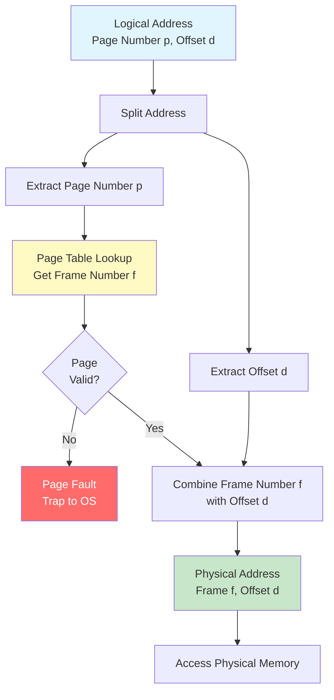
## Paging Example
### Example Parameters
```
Logical Address Space: 64 bytes (2^6)
Physical Memory: 128 bytes (2^7)
Page Size: 16 bytes (2^4)

Number of Pages: 64 / 16 = 4 pages (pages 0-3)
Number of Frames: 128 / 16 = 8 frames (frames 0-7)

Logical Address: 6 bits (2 bits page number + 4 bits offset)
Physical Address: 7 bits (3 bits frame number + 4 bits offset)
```
### Address Translation Example
```
Logical Address: 20 (decimal) = 010100 (binary)

Split into:
  Page Number: 01 (binary) = 1 (decimal)
  Offset: 0100 (binary) = 4 (decimal)

Page Table Lookup:
  Page 1 → Frame 6

Physical Address:
  Frame Number: 110 (binary) = 6 (decimal)
  Offset: 0100 (binary) = 4 (decimal)
  Physical Address: 1100100 (binary) = 100 (decimal)
```
### Visual Example
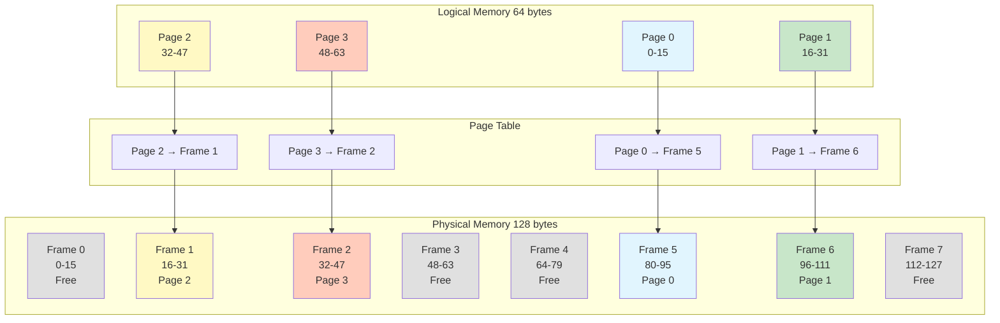
# Page Table Structure
## Page Table Entry (PTE)
- <mark class="hltr-yellow">Each entry in page table contains frame number and control bits</mark>.
### Common PTE Fields
```
|   Frame Number   | Protection | Valid | Referenced | Modified | Caching |
|------------------|------------|-------|------------|----------|---------|
|    f bits        |  3 bits    | 1 bit |   1 bit    |  1 bit   | 2 bits  |
```
### Control Bits
| Bit | Name | Purpose |
|-----|------|---------|
| Valid (V) | Valid/Invalid bit | 1 = page is in memory, 0 = not in memory |
| Protection | Read/Write/Execute | Controls access permissions |
| Referenced (R) | Reference bit | 1 = page has been accessed |
| Modified (M) | Dirty bit | 1 = page has been modified |
| Caching | Cache control | Controls caching behavior |
| Present (P) | Present bit | 1 = page is in physical memory |
## Page Table Organization
### Single-Level Page Table
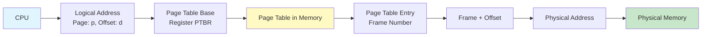
### Memory Access Cost
- <mark class="hltr-yellow">Each memory access requires two memory accesses: one for page table, one for data</mark>.
- Slow performance without optimization.
- Solution: Translation Lookaside Buffer (TLB).
# Translation Lookaside Buffer (TLB)
- <mark class="hltr-yellow">Special fast-lookup hardware cache for page table entries</mark>.
- Associative memory that searches all entries in parallel.
- Drastically reduces address translation time.
## TLB Structure
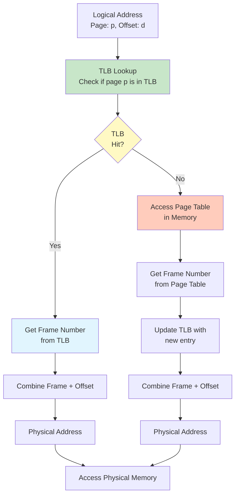
## TLB Performance
### Effective Access Time (EAT)
```
Hit Ratio (α): Percentage of times page found in TLB
TLB Access Time: 10 ns (typical)
Memory Access Time: 100 ns (typical)

Effective Access Time (EAT) = α × (TLB + Memory) + (1-α) × (TLB + Memory + Memory)
                             = α × 110 ns + (1-α) × 210 ns

Example with 80% hit ratio:
EAT = 0.8 × 110 + 0.2 × 210 = 88 + 42 = 130 ns

Example with 99% hit ratio:
EAT = 0.99 × 110 + 0.01 × 210 = 108.9 + 2.1 = 111 ns
```
### TLB Performance Factors
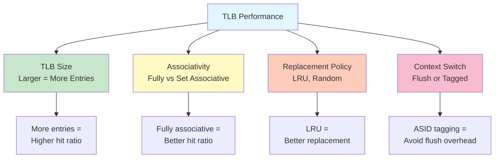
## Address Space Identifier (ASID)
- Tags TLB entries with process identifier.
- <mark class="hltr-yellow">Avoids flushing TLB on context switch</mark>.
- Allows multiple processes' pages in TLB simultaneously.
```
TLB Entry Format with ASID:
| ASID | Page Number | Frame Number | Protection | Valid |
|------|-------------|--------------|------------|-------|
| 8bit |   20 bit    |    20 bit    |   3 bit    | 1 bit |
```
# Hierarchical Paging
- <mark class="hltr-yellow">Multi-level page tables to reduce memory overhead</mark>.
- Page table itself is paged.
- Common in 32-bit and 64-bit systems.
## Two-Level Paging
### Logical Address Structure
```
|  Outer Page  |  Inner Page  |  Offset  |
|--------------|--------------|----------|
|    p1 bits   |    p2 bits   |  d bits  |
```
### Two-Level Translation
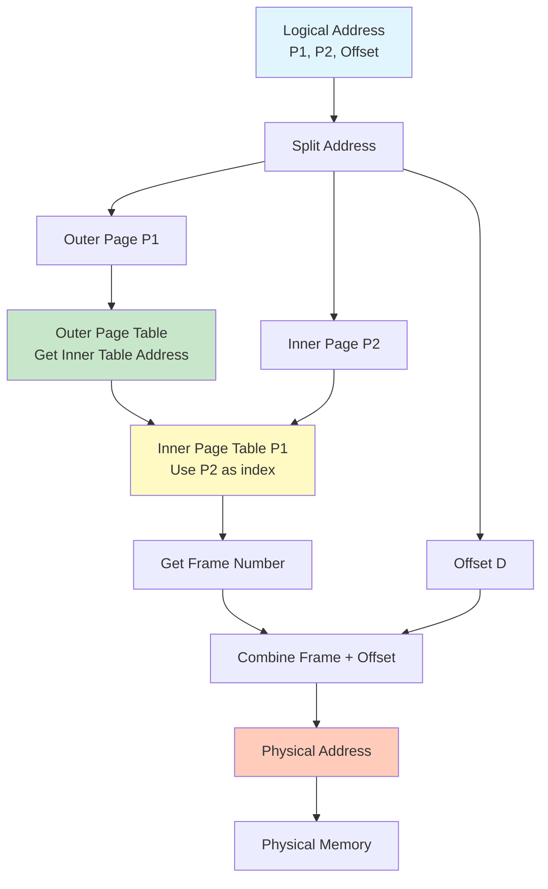
### Two-Level Example (32-bit system)
```
Logical Address: 32 bits
Page Size: 4 KB = 2^12 bytes
Offset: 12 bits

Remaining: 32 - 12 = 20 bits for page number
Split as: 10 bits (P1) + 10 bits (P2)

Outer Page Table: 2^10 = 1024 entries
Inner Page Tables: 2^10 = 1024 entries each
Total Pages: 2^20 = 1,048,576 pages

Benefits:
- Only need to allocate outer table and active inner tables
- Sparse address spaces save memory
```
## Multi-Level Paging
### Three-Level Paging (x86-64 without PAE)
```
Logical Address (48 bits used):
| P1 (9 bits) | P2 (9 bits) | P3 (9 bits) | P4 (9 bits) | Offset (12 bits) |
```
### Four-Level Paging (x86-64 current)
```
Logical Address (48 bits used):
| PML4 (9) | Directory Pointer (9) | Directory (9) | Table (9) | Offset (12) |

Levels:
1. Page Map Level 4 (PML4)
2. Page Directory Pointer Table (PDPT)
3. Page Directory (PD)
4. Page Table (PT)
```
## Hierarchical Paging Advantages
- **Memory Efficiency**: Only allocate page tables for used address space.
- **Scalability**: Supports large address spaces efficiently.
- **Flexibility**: Easy to implement sparse address spaces.
## Hierarchical Paging Disadvantages
- **Multiple Memory Accesses**: Each level requires memory access.
- **Complexity**: More complex address translation.
- **TLB Dependency**: Performance heavily depends on TLB hit ratio.
# Hashed Page Tables
- <mark class="hltr-yellow">Uses hash table to map virtual page numbers to physical frames</mark>.
- Efficient for sparse address spaces.
- Common in systems with > 32-bit address spaces.
## Hashed Page Table Structure
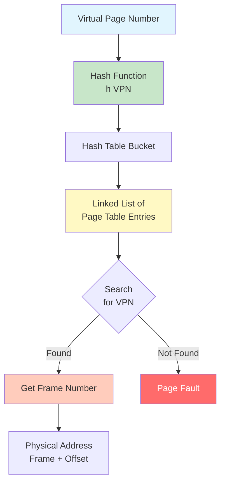
## Clustered Page Tables
- Variation of hashed page tables.
- Each entry maps multiple pages (cluster).
- Reduces hash table size.
- Useful for contiguous page allocations.
# Inverted Page Tables
- <mark class="hltr-yellow">One page table entry per frame instead of per page</mark>.
- Reduces memory overhead for large address spaces.
- Complicates address translation (requires search).
## Inverted Page Table Structure
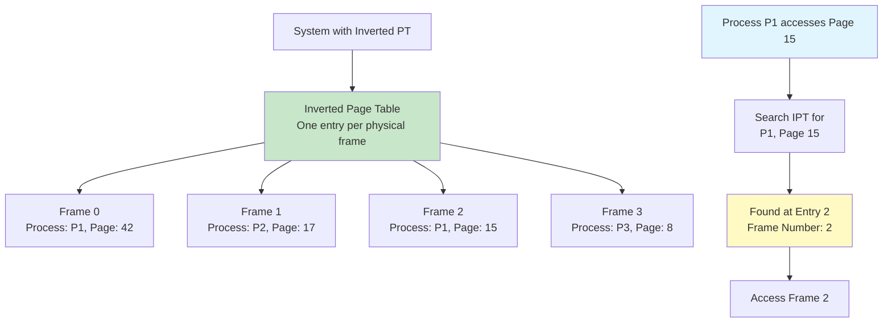
## Inverted Page Table Entry
```
| Process ID (PID) | Page Number | Frame Number | Protection | Valid |
|------------------|-------------|--------------|------------|-------|
|      8 bits      |   20 bits   |   20 bits    |   3 bits   | 1 bit |
```
## Advantages and Disadvantages
### Advantages
- **Memory Efficiency**: Only one entry per frame, not per page.
- **Scalability**: Memory overhead independent of virtual address space size.
- **Sharing**: Easier to track shared pages.
### Disadvantages
- **Search Time**: Linear search expensive (needs hashing or TLB).
- **Shared Memory**: Difficult to implement shared pages.
- **Complexity**: More complex implementation.
# Linux Paging Implementation
## Page Size
```Shell title='Check page size'
# View system page size
getconf PAGE_SIZE
# Output: 4096 (4 KB)

# View from /proc
cat /proc/meminfo | grep Pagesize
# Output: Pagesize:       4 kB

# Check huge page sizes
cat /proc/meminfo | grep Hugepagesize
# Output: Hugepagesize:   2048 kB
```
## Multi-Level Page Tables
### x86-64 Four-Level Paging
- Linux uses four-level page tables on x86-64.
- Supports 48-bit virtual addresses (256 TB).
- Five-level paging (57-bit) available in newer kernels.
```
Page Table Levels (x86-64):
1. PGD (Page Global Directory) - Level 4
2. PUD (Page Upper Directory) - Level 3
3. PMD (Page Middle Directory) - Level 2
4. PTE (Page Table Entry) - Level 1
```
### Page Table Hierarchy
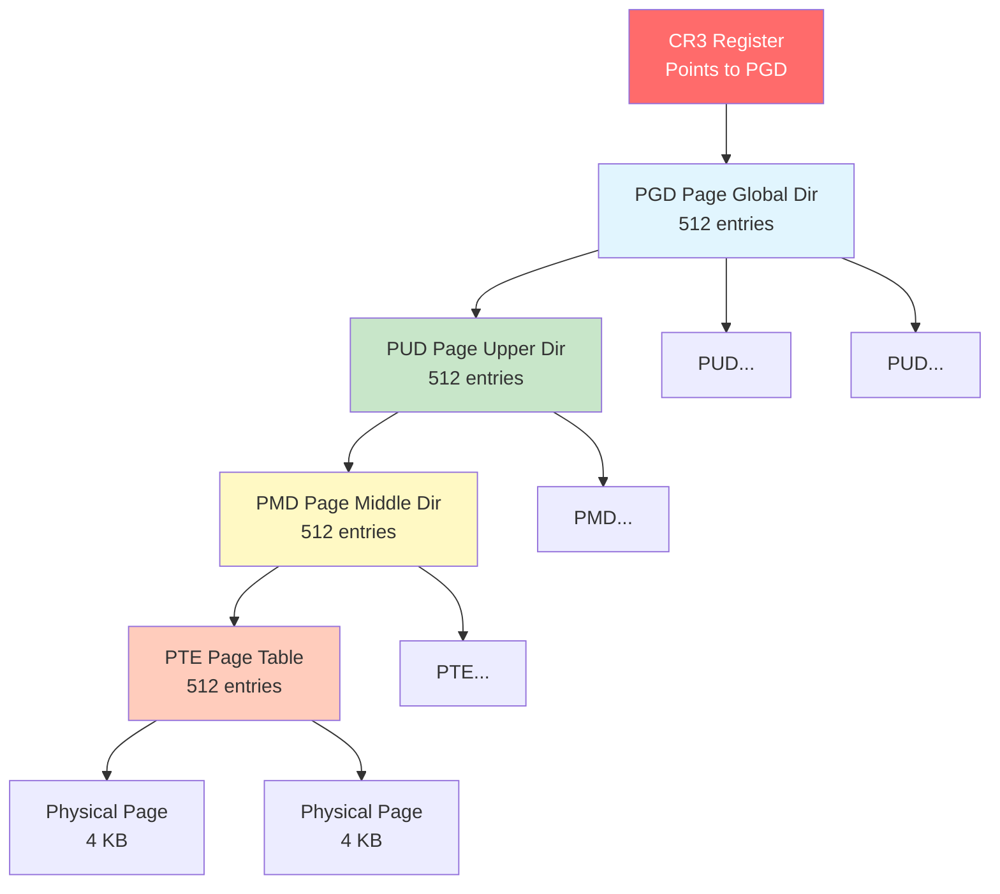
## Page Table Flags
### x86-64 Page Table Entry Flags
```
Bit  | Flag | Description
-----|------|-------------
  0  | P    | Present (page is in memory)
  1  | R/W  | Read/Write (0=read-only, 1=read-write)
  2  | U/S  | User/Supervisor (0=kernel, 1=user)
  3  | PWT  | Page-level Write-Through
  4  | PCD  | Page-level Cache Disable
  5  | A    | Accessed (page has been read/written)
  6  | D    | Dirty (page has been written)
  7  | PAT  | Page Attribute Table
  8  | G    | Global (page not flushed from TLB)
  9-11| AVL  | Available for OS use
12-51| Addr | Physical frame address
52-62| AVL  | Available for OS use
 63  | XD   | Execute Disable (NX bit)
```
## Viewing Page Tables
```Shell title='View process page table information'
# View page map of process
cat /proc/self/pagemap | od -A x -t x8 | head

# View page flags
cat /proc/kpageflags | od -A x -t x8 | head

# View TLB statistics (if available)
cat /proc/cpuinfo | grep -i tlb

# View page table statistics
cat /proc/vmstat | grep -i pgtable

# View memory map with page info
pmap -X $$

# Check huge pages
cat /proc/meminfo | grep -i huge
```
# Huge Pages
- <mark class="hltr-yellow">Larger page sizes to reduce TLB misses and page table overhead</mark>.
- Common sizes: 2 MB, 1 GB.
- Reduces number of page table entries.
## Huge Page Benefits
1. **Reduced TLB Misses**: Fewer TLB entries needed.
2. **Less Page Table Overhead**: Fewer page table levels traversed.
3. **Better Performance**: Especially for large memory workloads.
4. **Reduced Page Faults**: Fewer pages to manage.
## Huge Page Types
### HugeTLBFS (Static Huge Pages)
```Shell title='Configure static huge pages'
# Check current huge page configuration
cat /proc/meminfo | grep Huge

# Reserve huge pages at boot
# Add to /etc/sysctl.conf:
# vm.nr_hugepages = 1024

# Set at runtime
echo 1024 | sudo tee /proc/sys/vm/nr_hugepages

# Create mount point
sudo mkdir /mnt/huge

# Mount hugetlbfs
sudo mount -t hugetlbfs none /mnt/huge

# Verify
mount | grep huge
```
### Transparent Huge Pages (THP)
- <mark class="hltr-yellow">Kernel automatically manages huge pages</mark>.
- No application changes required.
- Enabled by default in most distributions.
```Shell title='Configure Transparent Huge Pages'
# Check THP status
cat /sys/kernel/mm/transparent_hugepage/enabled
# Output: [always] madvise never

# Disable THP
echo never | sudo tee /sys/kernel/mm/transparent_hugepage/enabled

# Enable THP
echo always | sudo tee /sys/kernel/mm/transparent_hugepage/enabled

# Enable THP only for madvise
echo madvise | sudo tee /sys/kernel/mm/transparent_hugepage/enabled

# Check THP statistics
cat /proc/vmstat | grep thp
```
### Huge Page Comparison
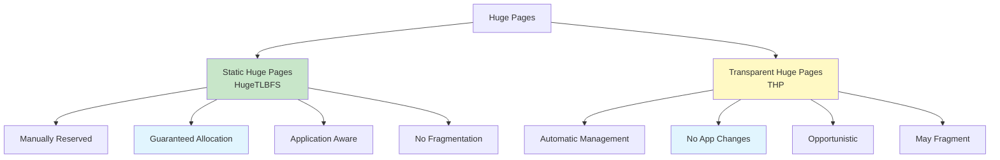
# Practical Examples
## Example 1: Calculate Page Table Size
```Shell title='Calculate page table memory overhead'
# Given:
# Virtual address space: 48 bits
# Page size: 4 KB = 2^12 bytes
# PTE size: 8 bytes

# Calculate:
# Offset bits: 12
# Page number bits: 48 - 12 = 36 bits
# Number of pages: 2^36 = 68,719,476,736 pages

# Single-level page table size:
# 2^36 entries × 8 bytes = 512 GB (impossibly large!)

# Four-level paging (9+9+9+9+12):
# Only need to allocate active page table pages
# Typical process uses << 1% of address space
# Actual overhead: Few MB instead of 512 GB
```
## Example 2: Measure TLB Performance
```C title='TLB performance test'
#include <stdio.h>
#include <stdlib.h>
#include <time.h>

#define PAGE_SIZE 4096
#define NUM_PAGES 1024

int main() {
    int *pages[NUM_PAGES];
    clock_t start, end;

    // Allocate pages
    for (int i = 0; i < NUM_PAGES; i++) {
        pages[i] = malloc(PAGE_SIZE);
    }

    // Sequential access (good TLB performance)
    start = clock();
    for (int j = 0; j < 10000; j++) {
        for (int i = 0; i < NUM_PAGES; i++) {
            pages[i][0] = i;
        }
    }
    end = clock();
    printf("Sequential access: %.2f ms\n",
           (double)(end - start) * 1000 / CLOCKS_PER_SEC);

    // Random access (poor TLB performance)
    start = clock();
    for (int j = 0; j < 10000; j++) {
        for (int i = 0; i < NUM_PAGES; i++) {
            int idx = rand() % NUM_PAGES;
            pages[idx][0] = idx;
        }
    }
    end = clock();
    printf("Random access: %.2f ms\n",
           (double)(end - start) * 1000 / CLOCKS_PER_SEC);

    // Cleanup
    for (int i = 0; i < NUM_PAGES; i++) {
        free(pages[i]);
    }

    return 0;
}
```

```Shell title='Compile and run'
gcc -o tlbtest tlbtest.c
./tlbtest

# Output shows sequential access is faster due to better TLB hit ratio
# Sequential access: 45.20 ms
# Random access: 89.50 ms
```
## Example 3: Monitor Page Faults
```Shell title='Track page faults'
# View page fault statistics for process
cat /proc/self/stat | awk '{print "Minor faults: " $10 "\nMajor faults: " $12}'

# Monitor page faults in real-time
watch -n 1 'cat /proc/self/stat | awk "{print \"Minor: \" \$10 \" Major: \" \$12}"'

# View system-wide page fault rate
vmstat 1

# Use perf to monitor page faults
perf stat -e page-faults,minor-faults,major-faults sleep 10

# Check page fault types
cat /proc/vmstat | grep pgfault
```
## Example 4: Huge Pages Example
```C title='Use huge pages with mmap'
#define _GNU_SOURCE
#include <sys/mman.h>
#include <stdio.h>
#include <string.h>

#define SIZE (2 * 1024 * 1024)  // 2 MB

int main() {
    // Allocate with huge pages
    void *addr = mmap(NULL, SIZE,
                     PROT_READ | PROT_WRITE,
                     MAP_PRIVATE | MAP_ANONYMOUS | MAP_HUGETLB,
                     -1, 0);

    if (addr == MAP_FAILED) {
        perror("mmap with huge pages failed");

        // Fallback to regular pages
        addr = mmap(NULL, SIZE,
                   PROT_READ | PROT_WRITE,
                   MAP_PRIVATE | MAP_ANONYMOUS,
                   -1, 0);

        if (addr == MAP_FAILED) {
            perror("mmap failed");
            return 1;
        }
        printf("Using regular pages\n");
    } else {
        printf("Using huge pages\n");
    }

    // Use the memory
    memset(addr, 0, SIZE);

    // Check page size from /proc
    char cmd[256];
    snprintf(cmd, sizeof(cmd), "cat /proc/%d/smaps | grep -A 15 'anon' | grep KernelPageSize", getpid());
    system(cmd);

    munmap(addr, SIZE);
    return 0;
}
```
```Shell title='Compile and test'
# Compile
gcc -o hugepage hugepage.c

# Ensure huge pages are available
echo 10 | sudo tee /proc/sys/vm/nr_hugepages

# Run
./hugepage

# Check if huge pages were used
cat /proc/meminfo | grep Huge
```
## Example 5: Page Table Walking
```Shell title='Examine page table hierarchy'
# Install pagemap tools
sudo apt install linux-tools-common linux-tools-$(uname -r)

# View page table for address
sudo ./page-types -p $$ -a 0x400000 -l 1

# Check page flags
sudo ./page-types -p $$ | head -20

# View memory map with page info
sudo pmap -XX $$

# For detailed analysis, write custom program
cat > pagewalk.c << 'EOF'
#include <stdio.h>
#include <stdint.h>
#include <stdlib.h>
#include <unistd.h>
#include <fcntl.h>

void read_pagemap(pid_t pid, void *addr) {
    char path[256];
    uint64_t offset, entry;
    int fd;

    snprintf(path, sizeof(path), "/proc/%d/pagemap", pid);
    fd = open(path, O_RDONLY);

    if (fd < 0) {
        perror("open pagemap");
        return;
    }

    offset = ((uint64_t)addr / getpagesize()) * sizeof(uint64_t);
    lseek(fd, offset, SEEK_SET);
    read(fd, &entry, sizeof(entry));

    printf("Virtual address: %p\n", addr);
    printf("Page frame number: %llu\n", entry & ((1ULL << 55) - 1));
    printf("Present: %s\n", (entry & (1ULL << 63)) ? "yes" : "no");
    printf("Swapped: %s\n", (entry & (1ULL << 62)) ? "yes" : "no");

    close(fd);
}

int main() {
    int *ptr = malloc(sizeof(int));
    *ptr = 42;

    read_pagemap(getpid(), ptr);

    free(ptr);
    return 0;
}
EOF

gcc -o pagewalk pagewalk.c
sudo ./pagewalk
```
***
# References
1. Operating System Concepts - Abraham Silberschatz - 10th - 2018 - Pearson Publisher.
	1. Chapter 9: Main Memory.
		1. Section 9.3: Paging.
		2. Section 9.4: Structure of the Page Table.
2. Modern Operating Systems - Andrew Tanenbaum - 4th Edition - 2014 - Pearson.
	1. Chapter 3: Memory Management.
		1. Section 3.3: Virtual Memory.
3. Operating Systems: Three Easy Pieces - Remzi Arpaci-Dusseau - 2018.
	1. Chapter 18: Paging: Introduction.
	2. Chapter 19: Paging: Faster Translations (TLBs).
	3. Chapter 20: Paging: Smaller Tables.
4. Understanding the Linux Kernel - Daniel Bovet - 3rd Edition - 2005 - O'Reilly.
	1. Chapter 2: Memory Addressing.
5. `man proc`, `man mmap`, `man getconf`
6. https://www.kernel.org/doc/html/latest/admin-guide/mm/hugetlbpage.html
7. https://www.kernel.org/doc/html/latest/admin-guide/mm/transhuge.html
8. Intel 64 and IA-32 Architectures Software Developer's Manual - Volume 3A: System Programming Guide
