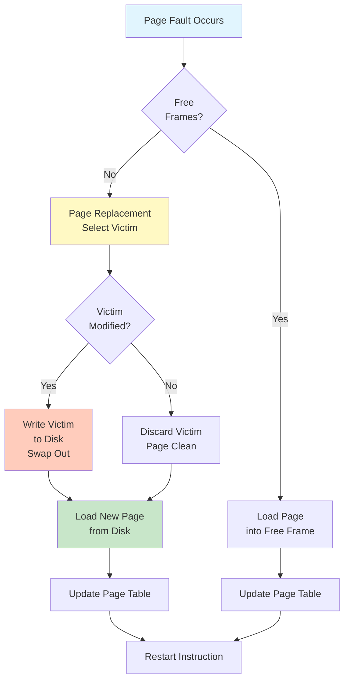
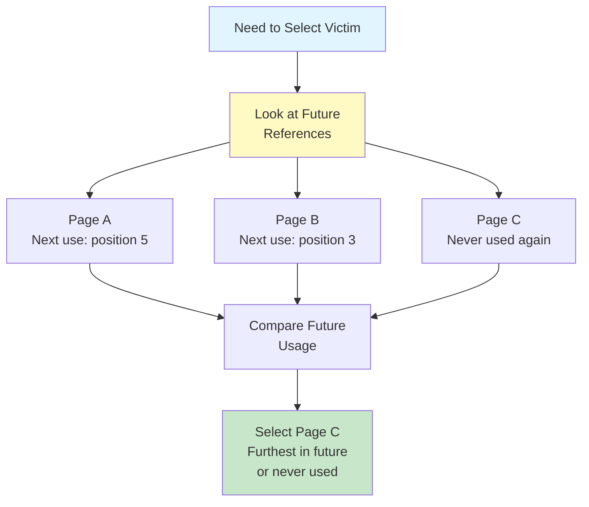
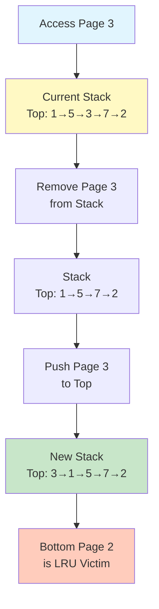
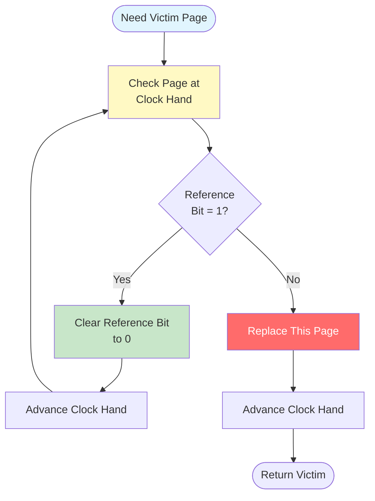
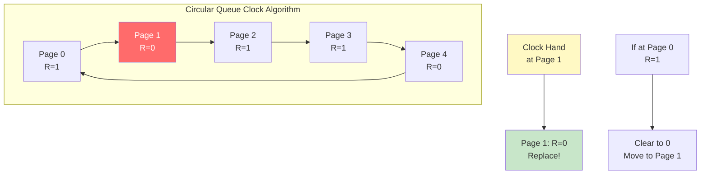
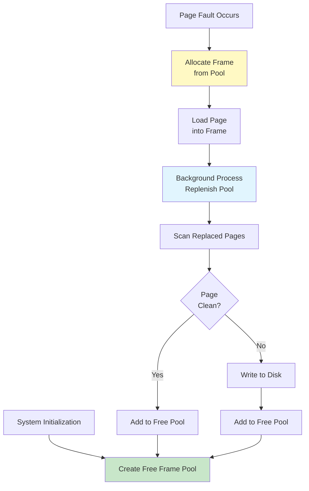
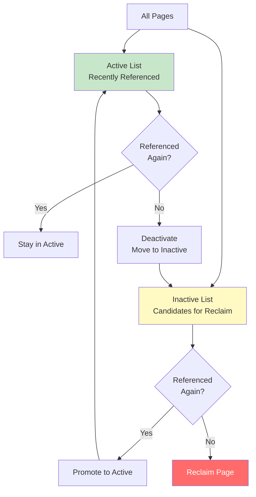

#linux #operating-system #memory #paging #page-replacement #virtual-memory #algorithms #unix #fedora #ubuntu #debian #rhel #centos-stream
- Page replacement is essential when all physical frames are allocated and a page fault occurs.
- <mark class="hltr-yellow">Selects victim page to be removed from memory to make room for new page</mark>.
- Goal is to minimize page fault rate and improve system performance.
- Choice of algorithm significantly impacts virtual memory performance.
# Page Replacement Overview
## When Replacement Needed

## Frame Allocation
### Reference String
- Sequence of memory references made by process.
- Used to evaluate page replacement algorithms.
- Example: `7, 0, 1, 2, 0, 3, 0, 4, 2, 3, 0, 3, 2`
### Performance Metrics
```
Page Fault Rate = Number of Page Faults / Number of Memory Accesses

Example:
Reference string: 1, 2, 3, 4, 1, 2, 5, 1, 2, 3, 4, 5 (12 references)
Page faults: 7
Page fault rate: 7/12 = 58.3%
```
# Page Replacement Algorithms
## Optimal Page Replacement (OPT)
- <mark class="hltr-yellow">Replace page that will not be used for longest time in future</mark>.
- Theoretically optimal (lowest page fault rate).
- Cannot be implemented (requires future knowledge).
- Used as benchmark to evaluate other algorithms.
### Optimal Algorithm Example
```
Reference string: 7, 0, 1, 2, 0, 3, 0, 4, 2, 3, 0, 3, 2
Number of frames: 3

Time | Ref | Frame 1 | Frame 2 | Frame 3 | Fault?
-----|-----|---------|---------|---------|-------
  1  |  7  |    7    |    -    |    -    |  Yes
  2  |  0  |    7    |    0    |    -    |  Yes
  3  |  1  |    7    |    0    |    1    |  Yes
  4  |  2  |    2    |    0    |    1    |  Yes (replace 7, used furthest)
  5  |  0  |    2    |    0    |    1    |  No
  6  |  3  |    2    |    0    |    3    |  Yes (replace 1)
  7  |  0  |    2    |    0    |    3    |  No
  8  |  4  |    2    |    4    |    3    |  Yes (replace 0, furthest)
  9  |  2  |    2    |    4    |    3    |  No
 10  |  3  |    2    |    4    |    3    |  No
 11  |  0  |    2    |    0    |    3    |  Yes (replace 4)
 12  |  3  |    2    |    0    |    3    |  No
 13  |  2  |    2    |    0    |    3    |  No

Total page faults: 7
Page fault rate: 7/13 = 53.8%
```
### Optimal Algorithm Visualization

## First-In-First-Out (FIFO)
- <mark class="hltr-yellow">Replace oldest page in memory</mark>.
- Simple to implement using queue.
- Poor performance (may remove frequently used pages).
- Suffers from Belady's Anomaly.
### FIFO Algorithm Example
```
Reference string: 7, 0, 1, 2, 0, 3, 0, 4, 2, 3, 0, 3, 2
Number of frames: 3

Time | Ref | Frame 1 | Frame 2 | Frame 3 | Fault? | Queue
-----|-----|---------|---------|---------|--------|-------
  1  |  7  |    7    |    -    |    -    |  Yes   | 7
  2  |  0  |    7    |    0    |    -    |  Yes   | 7→0
  3  |  1  |    7    |    0    |    1    |  Yes   | 7→0→1
  4  |  2  |    2    |    0    |    1    |  Yes   | 0→1→2
  5  |  0  |    2    |    0    |    1    |  No    | 0→1→2
  6  |  3  |    2    |    3    |    1    |  Yes   | 1→2→3
  7  |  0  |    2    |    3    |    0    |  Yes   | 2→3→0
  8  |  4  |    4    |    3    |    0    |  Yes   | 3→0→4
  9  |  2  |    4    |    2    |    0    |  Yes   | 0→4→2
 10  |  3  |    4    |    2    |    3    |  Yes   | 4→2→3
 11  |  0  |    0    |    2    |    3    |  Yes   | 2→3→0
 12  |  3  |    0    |    2    |    3    |  No    | 2→3→0
 13  |  2  |    0    |    2    |    3    |  No    | 2→3→0

Total page faults: 10
Page fault rate: 10/13 = 76.9%
```
### Belady's Anomaly
- <mark class="hltr-yellow">Increasing number of frames can increase page faults with FIFO</mark>.
- Counterintuitive behavior.
- Occurs with some reference strings.
```
Reference string: 1, 2, 3, 4, 1, 2, 5, 1, 2, 3, 4, 5

With 3 frames: 9 page faults
With 4 frames: 10 page faults (more faults!)
```
## Least Recently Used (LRU)
- <mark class="hltr-yellow">Replace page not used for longest time</mark>.
- Based on principle of temporal locality.
- Good approximation of optimal algorithm.
- Requires tracking access time for each page.
### LRU Algorithm Example
```
Reference string: 7, 0, 1, 2, 0, 3, 0, 4, 2, 3, 0, 3, 2
Number of frames: 3

Time | Ref | Frame 1 | Frame 2 | Frame 3 | Fault? | LRU Order
-----|-----|---------|---------|---------|--------|----------
  1  |  7  |    7    |    -    |    -    |  Yes   | 7
  2  |  0  |    7    |    0    |    -    |  Yes   | 7→0
  3  |  1  |    7    |    0    |    1    |  Yes   | 7→0→1
  4  |  2  |    2    |    0    |    1    |  Yes   | 2→0→1
  5  |  0  |    2    |    0    |    1    |  No    | 2→1→0
  6  |  3  |    2    |    3    |    0    |  Yes   | 2→3→0
  7  |  0  |    2    |    3    |    0    |  No    | 2→3→0
  8  |  4  |    4    |    3    |    0    |  Yes   | 4→3→0
  9  |  2  |    4    |    3    |    2    |  Yes   | 4→3→2
 10  |  3  |    4    |    3    |    2    |  No    | 4→2→3
 11  |  0  |    0    |    3    |    2    |  Yes   | 0→3→2
 12  |  3  |    0    |    3    |    2    |  No    | 0→2→3
 13  |  2  |    0    |    3    |    2    |  No    | 0→3→2

Total page faults: 8
Page fault rate: 8/13 = 61.5%
```
### LRU Implementation
#### Counter-Based
- Each page entry has counter (timestamp).
- Update counter on each access.
- Replace page with smallest counter value.
- Requires searching all counters.
#### Stack-Based
- Maintain stack of page numbers.
- On reference, move page to top.
- Bottom page is LRU victim.
- Expensive to maintain.

## LRU Approximation Algorithms
- True LRU expensive to implement.
- <mark class="hltr-yellow">Use hardware reference bit to approximate LRU</mark>.
- Trade accuracy for performance.
### Second-Chance (Clock) Algorithm
- FIFO with reference bit check.
- If page's reference bit = 1, give second chance.
- Clear reference bit and check next page.
- If reference bit = 0, replace page.
#### Second-Chance Algorithm Steps

#### Second-Chance Visualization

### Enhanced Second-Chance (NRU)
- Uses reference bit (R) and modify bit (M).
- <mark class="hltr-yellow">Four classes based on (R,M) bits</mark>.
- Replace page from lowest class.
#### Page Classes
| Class | R Bit | M Bit | Description | Action |
|-------|-------|-------|-------------|--------|
| 0 | 0 | 0 | Not referenced, not modified | Best to replace |
| 1 | 0 | 1 | Not referenced, modified | Requires write |
| 2 | 1 | 0 | Referenced, not modified | Likely needed soon |
| 3 | 1 | 1 | Referenced, modified | Worst to replace |
### LRU-K Algorithm
- Track last K references for each page.
- Replace page with oldest Kth reference.
- K=2 (LRU-2) common choice.
- Better than standard LRU for sequential scans.
## Counting-Based Algorithms
### Least Frequently Used (LFU)
- <mark class="hltr-yellow">Replace page with smallest reference count</mark>.
- Requires counter for each page.
- Problem: Page heavily used early remains in memory.
### Most Frequently Used (MFU)
- Replace page with largest count.
- Reasoning: Page with small count probably just brought in.
- Not commonly used in practice.
# Page Buffering
- Maintain pool of free frames.
- <mark class="hltr-yellow">When page fault occurs, quickly allocate from free pool</mark>.
- Write replaced pages to disk in background.
- Reduces page fault service time.
## Page Buffering Strategy

# Linux Page Replacement
## Page Frame Reclaiming (PFRA)
- Linux uses multiple algorithms for page replacement.
- <mark class="hltr-yellow">Approximate LRU using active and inactive lists</mark>.
- Balances between file cache and anonymous pages.
### Two-List Strategy

## kswapd Daemon
- <mark class="hltr-yellow">Kernel thread that performs page reclamation</mark>.
- Runs when free memory falls below threshold.
- Scans pages and moves to appropriate lists.
```Shell title='Monitor kswapd activity'
# View kswapd statistics
cat /proc/vmstat | grep kswapd

# Check kswapd process
ps aux | grep kswapd

# Monitor page reclaim events
cat /proc/vmstat | grep -E 'pgsteal|pgscan'
```
## Page Reclaim Watermarks
```
Watermark Levels:

High ─┐
      │ kswapd sleeps
      │
Low  ─┤
      │ kswapd wakes up (background reclaim)
      │
Min  ─┤
      │ Direct reclaim (blocking)
      │
     ─┘
```
```Shell title='View memory watermarks'
# Check watermark values
cat /proc/zoneinfo | grep -A 5 pages

# View min/low/high watermarks
grep -E 'min|low|high' /proc/zoneinfo
```
## Page Replacement Tuning
```Shell title='Configure page reclaim behavior'
# View swappiness (tendency to swap vs drop cache)
cat /proc/sys/vm/swappiness
# Default: 60
# 0 = avoid swapping
# 100 = aggressive swapping

# Set swappiness
echo 10 | sudo tee /proc/sys/vm/swappiness

# View cache pressure
cat /proc/sys/vm/vfs_cache_pressure
# Default: 100
# Higher = reclaim caches more aggressively

# Set cache pressure
echo 50 | sudo tee /proc/sys/vm/vfs_cache_pressure

# View min free kbytes
cat /proc/sys/vm/min_free_kbytes
# Minimum free memory to maintain

# Set min free kbytes
echo 65536 | sudo tee /proc/sys/vm/min_free_kbytes
```
# Practical Examples
## Example 1: Simulate Page Replacement Algorithms
```Python title='Page replacement simulator'
def fifo(pages, frames):
    memory = []
    faults = 0
    queue = []

    for page in pages:
        if page not in memory:
            faults += 1
            if len(memory) < frames:
                memory.append(page)
                queue.append(page)
            else:
                victim = queue.pop(0)
                memory.remove(victim)
                memory.append(page)
                queue.append(page)
        print(f"Page {page}: {memory} - {'Fault' if page not in memory else 'Hit'}")

    return faults

def lru(pages, frames):
    memory = []
    faults = 0

    for page in pages:
        if page not in memory:
            faults += 1
            if len(memory) < frames:
                memory.append(page)
            else:
                memory.pop(0)  # Remove LRU (front of list)
                memory.append(page)
        else:
            # Move to end (most recently used)
            memory.remove(page)
            memory.append(page)
        print(f"Page {page}: {memory} - {'Fault' if faults else 'Hit'}")

    return faults

def optimal(pages, frames):
    memory = []
    faults = 0

    for i, page in enumerate(pages):
        if page not in memory:
            faults += 1
            if len(memory) < frames:
                memory.append(page)
            else:
                # Find page used furthest in future
                future_use = {}
                for p in memory:
                    try:
                        future_use[p] = pages[i+1:].index(p)
                    except ValueError:
                        future_use[p] = float('inf')

                victim = max(future_use, key=future_use.get)
                memory.remove(victim)
                memory.append(page)
        print(f"Page {page}: {memory} - {'Fault' if page not in memory else 'Hit'}")

    return faults

# Test
reference_string = [7, 0, 1, 2, 0, 3, 0, 4, 2, 3, 0, 3, 2]
num_frames = 3

print("=== FIFO ===")
fifo_faults = fifo(reference_string, num_frames)
print(f"Total faults: {fifo_faults}\n")

print("=== LRU ===")
lru_faults = lru(reference_string, num_frames)
print(f"Total faults: {lru_faults}\n")

print("=== Optimal ===")
opt_faults = optimal(reference_string, num_frames)
print(f"Total faults: {opt_faults}")
```
## Example 2: Demonstrate Belady's Anomaly
```Python title='Belady anomaly demonstration'
def fifo_faults(pages, frames):
    memory = []
    queue = []
    faults = 0

    for page in pages:
        if page not in memory:
            faults += 1
            if len(memory) < frames:
                memory.append(page)
                queue.append(page)
            else:
                victim = queue.pop(0)
                memory.remove(victim)
                memory.append(page)
                queue.append(page)

    return faults

# Reference string that exhibits Belady's anomaly
reference_string = [1, 2, 3, 4, 1, 2, 5, 1, 2, 3, 4, 5]

print("Belady's Anomaly Demonstration")
print(f"Reference string: {reference_string}\n")

for frames in range(1, 6):
    faults = fifo_faults(reference_string, frames)
    print(f"Frames: {frames}, Faults: {faults}")

# Output shows increasing frames can increase faults
# Frames: 1, Faults: 12
# Frames: 2, Faults: 11
# Frames: 3, Faults: 9
# Frames: 4, Faults: 10  <-- More faults than 3 frames!
# Frames: 5, Faults: 5
```
## Example 3: Monitor Page Reclaim Activity
```Shell title='Track page replacement activity'
# Create monitoring script
cat > page_reclaim_monitor.sh << 'EOF'
#!/bin/bash

echo "Time,PgScan_Direct,PgScan_Kswapd,PgSteal_Direct,PgSteal_Kswapd,Compact_Stall"

PREV_PGSCAN_DIRECT=$(grep pgscan_direct /proc/vmstat | awk '{sum=0; for(i=2;i<=NF;i++) sum+=$i; print sum}')
PREV_PGSCAN_KSWAPD=$(grep pgscan_kswapd /proc/vmstat | awk '{sum=0; for(i=2;i<=NF;i++) sum+=$i; print sum}')
PREV_PGSTEAL_DIRECT=$(grep pgsteal_direct /proc/vmstat | awk '{sum=0; for(i=2;i<=NF;i++) sum+=$i; print sum}')
PREV_PGSTEAL_KSWAPD=$(grep pgsteal_kswapd /proc/vmstat | awk '{sum=0; for(i=2;i<=NF;i++) sum+=$i; print sum}')
PREV_COMPACT_STALL=$(grep compact_stall /proc/vmstat | awk '{print $2}')

while true; do
    sleep 1

    CURR_PGSCAN_DIRECT=$(grep pgscan_direct /proc/vmstat | awk '{sum=0; for(i=2;i<=NF;i++) sum+=$i; print sum}')
    CURR_PGSCAN_KSWAPD=$(grep pgscan_kswapd /proc/vmstat | awk '{sum=0; for(i=2;i<=NF;i++) sum+=$i; print sum}')
    CURR_PGSTEAL_DIRECT=$(grep pgsteal_direct /proc/vmstat | awk '{sum=0; for(i=2;i<=NF;i++) sum+=$i; print sum}')
    CURR_PGSTEAL_KSWAPD=$(grep pgsteal_kswapd /proc/vmstat | awk '{sum=0; for(i=2;i<=NF;i++) sum+=$i; print sum}')
    CURR_COMPACT_STALL=$(grep compact_stall /proc/vmstat | awk '{print $2}')

    SCAN_DIRECT=$((CURR_PGSCAN_DIRECT - PREV_PGSCAN_DIRECT))
    SCAN_KSWAPD=$((CURR_PGSCAN_KSWAPD - PREV_PGSCAN_KSWAPD))
    STEAL_DIRECT=$((CURR_PGSTEAL_DIRECT - PREV_PGSTEAL_DIRECT))
    STEAL_KSWAPD=$((CURR_PGSTEAL_KSWAPD - PREV_PGSTEAL_KSWAPD))
    STALL=$((CURR_COMPACT_STALL - PREV_COMPACT_STALL))

    echo "$(date +%T),$SCAN_DIRECT,$SCAN_KSWAPD,$STEAL_DIRECT,$STEAL_KSWAPD,$STALL"

    PREV_PGSCAN_DIRECT=$CURR_PGSCAN_DIRECT
    PREV_PGSCAN_KSWAPD=$CURR_PGSCAN_KSWAPD
    PREV_PGSTEAL_DIRECT=$CURR_PGSTEAL_DIRECT
    PREV_PGSTEAL_KSWAPD=$CURR_PGSTEAL_KSWAPD
    PREV_COMPACT_STALL=$CURR_COMPACT_STALL
done
EOF

chmod +x page_reclaim_monitor.sh
./page_reclaim_monitor.sh
```
## Example 4: Test Different Swappiness Values
```Shell title='Compare swappiness settings'
# Save current swappiness
ORIG_SWAPPINESS=$(cat /proc/sys/vm/swappiness)

# Test with low swappiness (prefer keeping in RAM)
echo 10 | sudo tee /proc/sys/vm/swappiness

# Create memory pressure
stress-ng --vm 4 --vm-bytes 80% --timeout 60s &
STRESS_PID=$!

# Monitor swap usage
watch -n 1 'free -h | grep -E "Mem|Swap"'

# Wait for test to complete
wait $STRESS_PID

# Save results
echo "Low swappiness (10) swap used: $(free | grep Swap | awk '{print $3}')"

# Test with high swappiness (aggressive swapping)
echo 100 | sudo tee /proc/sys/vm/swappiness

stress-ng --vm 4 --vm-bytes 80% --timeout 60s &
STRESS_PID=$!
wait $STRESS_PID

echo "High swappiness (100) swap used: $(free | grep Swap | awk '{print $3}')"

# Restore original swappiness
echo $ORIG_SWAPPINESS | sudo tee /proc/sys/vm/swappiness
```
## Example 5: Visualize Active/Inactive Lists
```Shell title='Monitor active/inactive page lists'
# Check current list sizes
cat > page_lists.sh << 'EOF'
#!/bin/bash

echo "Monitoring Active/Inactive Page Lists"
echo "Time,Active_Anon_MB,Inactive_Anon_MB,Active_File_MB,Inactive_File_MB"

while true; do
    ACTIVE_ANON=$(grep "^Active(anon)" /proc/meminfo | awk '{print $2/1024}')
    INACTIVE_ANON=$(grep "^Inactive(anon)" /proc/meminfo | awk '{print $2/1024}')
    ACTIVE_FILE=$(grep "^Active(file)" /proc/meminfo | awk '{print $2/1024}')
    INACTIVE_FILE=$(grep "^Inactive(file)" /proc/meminfo | awk '{print $2/1024}')

    printf "%s,%.1f,%.1f,%.1f,%.1f\n" \
        "$(date +%T)" "$ACTIVE_ANON" "$INACTIVE_ANON" "$ACTIVE_FILE" "$INACTIVE_FILE"

    sleep 1
done
EOF

chmod +x page_lists.sh
./page_lists.sh > page_lists.csv

# Visualize with gnuplot (if available)
cat > plot.gp << 'EOF'
set terminal png size 1200,600
set output 'page_lists.png'
set datafile separator ','
set xdata time
set timefmt "%H:%M:%S"
set format x "%H:%M"
set ylabel "Memory (MB)"
set xlabel "Time"
set title "Active vs Inactive Page Lists"
set grid
plot 'page_lists.csv' using 1:2 with lines title "Active Anon", \
     '' using 1:3 with lines title "Inactive Anon", \
     '' using 1:4 with lines title "Active File", \
     '' using 1:5 with lines title "Inactive File"
EOF

gnuplot plot.gp
```
***
# References
1. Operating System Concepts - Abraham Silberschatz - 10th - 2018 - Pearson Publisher.
	1. Chapter 10: Virtual Memory.
		1. Section 10.4: Page Replacement.
2. Modern Operating Systems - Andrew Tanenbaum - 4th Edition - 2014 - Pearson.
	1. Chapter 3: Memory Management.
		1. Section 3.4: Page Replacement Algorithms.
3. Operating Systems: Three Easy Pieces - Remzi Arpaci-Dusseau - 2018.
	1. Chapter 22: Beyond Physical Memory: Policies.
4. Understanding the Linux Virtual Memory Manager - Mel Gorman - 2004.
	1. Chapter 10: Page Frame Reclamation.
5. `man vmstat`, `man proc`, `man sysctl`
6. https://www.kernel.org/doc/html/latest/admin-guide/sysctl/vm.html
7. https://www.kernel.org/doc/gorman/html/understand/understand013.html
