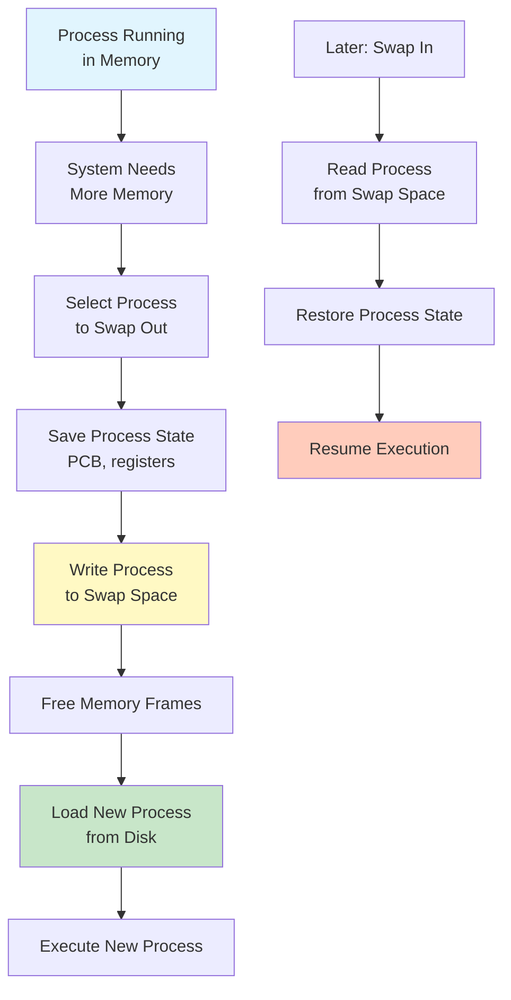
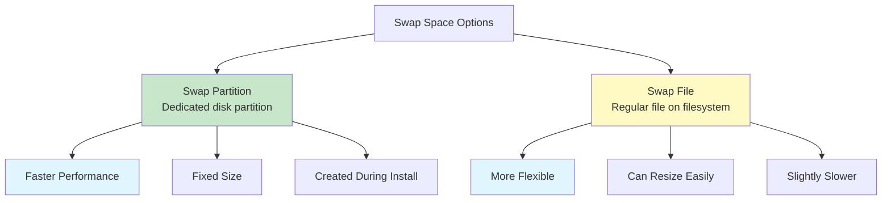
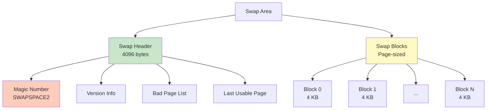
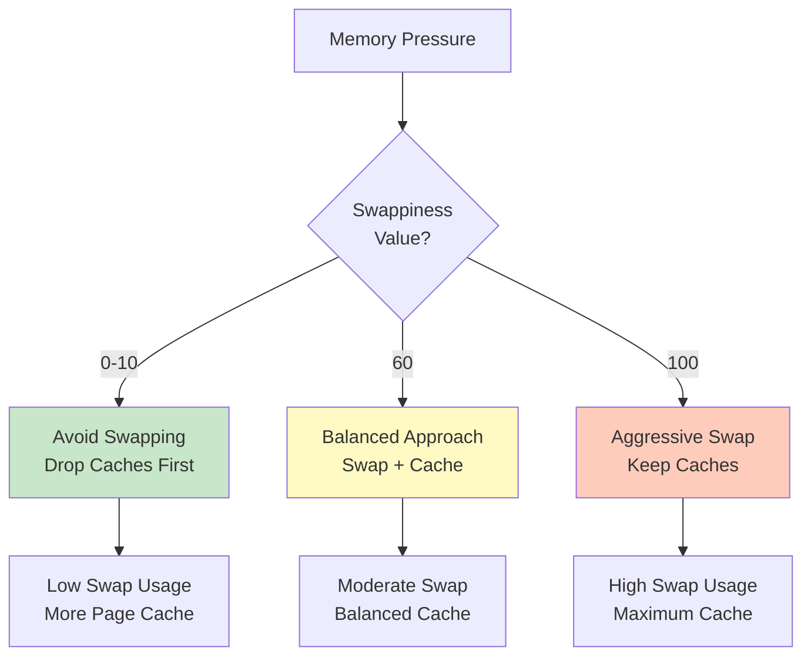
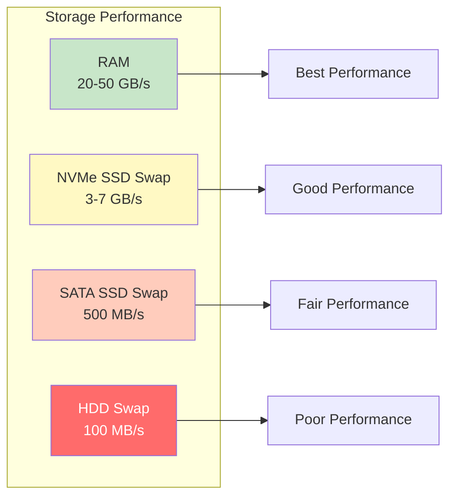
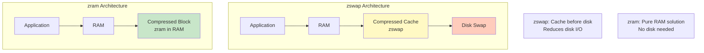

#linux #operating-system #memory-management #swapping #virtual-memory #swap-space #unix #fedora #ubuntu #debian #rhel #centos-stream
- Swapping is a memory management technique that moves entire processes between main memory and secondary storage.
- <mark class="hltr-yellow">Extends available memory by using disk space as overflow storage for RAM</mark>.
- Enables system to handle more processes than can fit in physical memory.
- Critical component of virtual memory systems but impacts performance.
# Swapping Concepts
## Process Swapping
- <mark class="hltr-yellow">Entire process moved between memory and disk</mark>.
- Used when system needs to free memory quickly.
- Process swapped out is blocked until swapped back in.
### Standard Swapping

## Page Swapping (Paging)
- Modern approach: swap individual pages, not entire process.
- More efficient than process swapping.
- Allows partial residence of process in memory.
- See [[Virtual memory.md]] and [[Page replacement.md]] for details.
## Swap Space
- <mark class="hltr-yellow">Dedicated area on disk for swapping</mark>.
- Can be partition or file.
- Faster access than regular file system.
- Size affects maximum virtual memory available.
### Swap Space Types

# Linux Swap Management
## Swap Organization
### Swap Priority
- Linux supports multiple swap areas.
- Each area has priority (higher value = higher priority).
- Areas with same priority used in round-robin.
```Shell title='View swap areas and priorities'
cat /proc/swaps

# Output:
# Filename        Type        Size      Used   Priority
# /dev/sda2       partition   8388604   0      -2
# /swapfile       file        2097148   0      -3
```
### Swap Area Structure

## Creating Swap Space
### Swap Partition
```Shell title='Create and enable swap partition'
# List available partitions
lsblk

# Create swap filesystem on partition (e.g., /dev/sdb1)
# WARNING: This destroys all data on the partition!
sudo mkswap /dev/sdb1

# Output:
# Setting up swapspace version 1, size = 8 GiB
# no label, UUID=abc123def-456...

# Enable swap partition
sudo swapon /dev/sdb1

# Verify
cat /proc/swaps
swapon --show

# Make permanent (add to /etc/fstab)
echo '/dev/sdb1 none swap sw 0 0' | sudo tee -a /etc/fstab

# Or use UUID
UUID=$(sudo blkid /dev/sdb1 | grep -oP 'UUID="\K[^"]+')
echo "UUID=$UUID none swap sw 0 0" | sudo tee -a /etc/fstab
```
### Swap File
```Shell title='Create and enable swap file'
# Create swap file (8 GB)
sudo fallocate -l 8G /swapfile

# Or use dd (slower)
# sudo dd if=/dev/zero of=/swapfile bs=1M count=8192

# Set correct permissions (security)
sudo chmod 600 /swapfile

# Set up swap area
sudo mkswap /swapfile

# Enable swap file
sudo swapon /swapfile

# Verify
swapon --show

# Make permanent (add to /etc/fstab)
echo '/swapfile none swap sw 0 0' | sudo tee -a /etc/fstab
```
## Managing Swap Space
### Enable/Disable Swap
```Shell title='Swap management commands'
# Enable all swap areas in /etc/fstab
sudo swapon -a

# Enable specific swap
sudo swapon /swapfile

# Disable all swap
sudo swapoff -a

# Disable specific swap
sudo swapoff /swapfile

# Enable with specific priority
sudo swapon --priority 10 /swapfile
```
### Resize Swap
```Shell title='Resize swap file'
# Disable swap
sudo swapoff /swapfile

# Resize file (increase to 16 GB)
sudo fallocate -l 16G /swapfile

# Or create new file
# sudo dd if=/dev/zero of=/swapfile bs=1M count=16384

# Recreate swap area
sudo mkswap /swapfile

# Enable swap
sudo swapon /swapfile

# Verify new size
free -h
```
### Remove Swap
```Shell title='Remove swap space'
# Disable swap
sudo swapoff /swapfile

# Remove from /etc/fstab
sudo sed -i '/\/swapfile/d' /etc/fstab

# Delete swap file
sudo rm /swapfile

# For partition, remove from fstab
sudo sed -i '/\/dev\/sdb1.*swap/d' /etc/fstab
```
## Swap Usage Monitoring
```Shell title='Monitor swap usage'
# Check swap summary
free -h
# Output:
#               total        used        free      shared  buff/cache   available
# Mem:           15Gi       2.0Gi        10Gi       100Mi        3.0Gi        13Gi
# Swap:          8.0Gi       0.0Gi       8.0Gi

# Detailed swap information
swapon --show
# Output:
# NAME      TYPE SIZE USED PRIO
# /swapfile file 8.0G 0B   -2

# Check swap from /proc
cat /proc/meminfo | grep -i swap

# Monitor swap usage in real-time
watch -n 1 'free -h && echo && swapon --show'

# View per-process swap usage
for pid in $(pgrep -u $USER); do
    swap=$(grep VmSwap /proc/$pid/status 2>/dev/null | awk '{print $2}')
    if [ "$swap" != "0" ] 2>/dev/null; then
        name=$(ps -p $pid -o comm=)
        echo "$name (PID $pid): $swap kB"
    fi
done | sort -k3 -n -r | head -10
```
# Swappiness
- <mark class="hltr-yellow">Kernel parameter controlling swap tendency versus page cache reclaim</mark>.
- Value range: 0-100.
- Default: 60.
## Swappiness Values
| Value | Behavior |
|-------|----------|
| 0 | Avoid swapping except to prevent OOM |
| 1-10 | Minimal swapping, prefer keeping processes in RAM |
| 60 | Default balance between swap and cache |
| 100 | Aggressive swapping, prefer swapping to dropping cache |
## Configure Swappiness
```Shell title='Adjust swappiness'
# Check current swappiness
cat /proc/sys/vm/swappiness
# Output: 60

# Set swappiness temporarily
echo 10 | sudo tee /proc/sys/vm/swappiness

# Set swappiness permanently
echo 'vm.swappiness=10' | sudo tee -a /etc/sysctl.conf

# Apply sysctl changes
sudo sysctl -p

# Verify
sysctl vm.swappiness
```
### Swappiness Impact

## Swappiness Recommendations
### Desktop/Laptop
```Shell
# Lower swappiness for better interactivity
# Prefer keeping applications in RAM
vm.swappiness=10
```
### Server (File Server)
```Shell
# Higher swappiness to maximize file cache
vm.swappiness=60  # or higher
```
### Database Server
```Shell
# Very low swappiness
# Database should manage its own memory
vm.swappiness=1
```
### Containerized Environments
```Shell
# Minimal swapping
# Containers should have defined memory limits
vm.swappiness=0  # or 1
```
# Swap Performance
## Performance Impact
### Swap vs RAM Speed
```
RAM Access Time:    ~100 ns
SSD Swap:           ~100 µs (1000× slower)
HDD Swap:           ~10 ms (100,000× slower)

Performance degradation when swapping is significant!
```
### Swap Throughput

## Optimizing Swap Performance
### Use SSD for Swap
```Shell title='Create swap on SSD'
# Identify SSD
lsblk -d -o name,rota
# ROTA=0 indicates SSD

# Create swap on SSD partition
sudo mkswap /dev/nvme0n1p3
sudo swapon /dev/nvme0n1p3
```
### Configure I/O Scheduler
```Shell title='Optimize I/O scheduler for swap'
# Check current scheduler
cat /sys/block/sda/queue/scheduler

# For SSD with swap, use none or mq-deadline
echo mq-deadline | sudo tee /sys/block/nvme0n1/queue/scheduler

# Make permanent in /etc/udev/rules.d/60-scheduler.rules
echo 'ACTION=="add|change", KERNEL=="nvme[0-9]n[0-9]", ATTR{queue/scheduler}="none"' | \
    sudo tee /etc/udev/rules.d/60-scheduler.rules
```
### zswap and zram
#### zswap (Compressed Swap Cache)
- <mark class="hltr-yellow">Compressed cache between memory and disk swap</mark>.
- Reduces swap I/O by compressing pages.
```Shell title='Enable zswap'
# Check if zswap enabled
cat /sys/module/zswap/parameters/enabled
# Output: Y or N

# Enable zswap (add to kernel parameters)
# Edit /etc/default/grub
# GRUB_CMDLINE_LINUX="... zswap.enabled=1"

# Update GRUB
sudo update-grub  # or grub2-mkconfig

# Configure zswap
echo lz4 | sudo tee /sys/module/zswap/parameters/compressor
echo z3fold | sudo tee /sys/module/zswap/parameters/zpool

# Check zswap statistics
cat /sys/kernel/debug/zswap/*
```
#### zram (Compressed RAM Block Device)
- <mark class="hltr-yellow">Creates compressed block device in RAM for swap</mark>.
- No disk I/O, all in memory.
- Good for systems without disk swap or with slow storage.
```Shell title='Configure zram'
# Load zram module
sudo modprobe zram

# Set compression algorithm
echo lz4 | sudo tee /sys/block/zram0/comp_algorithm

# Set size (e.g., 2 GB)
echo 2G | sudo tee /sys/block/zram0/disksize

# Create swap on zram
sudo mkswap /dev/zram0
sudo swapon /dev/zram0 -p 10  # Higher priority than disk swap

# Verify
zramctl
swapon --show

# Check compression ratio
cat /sys/block/zram0/mm_stat
```
### zswap vs zram

## Swap I/O Patterns
### Sequential vs Random
```Shell title='Monitor swap I/O patterns'
# Monitor I/O statistics
iostat -x 1

# Watch swap I/O
iotop -o -b -n 10 | grep swap

# Detailed I/O analysis
blktrace /dev/sda &
TRACE_PID=$!

# Generate swap activity
stress-ng --vm 2 --vm-bytes 90% --timeout 30s

# Stop tracing
kill $TRACE_PID

# Analyze trace
blkparse sda > trace_analysis.txt
```
# Swap Encryption
- <mark class="hltr-yellow">Encrypt swap to protect sensitive data</mark>.
- Prevents data leakage through swap space.
- Uses dm-crypt with LUKS or plain encryption.
## Encrypted Swap Setup
```Shell title='Create encrypted swap'
# Using crypttab with random key (recreated on each boot)

# Disable existing swap
sudo swapoff -a

# Edit /etc/crypttab
echo 'swap /dev/sdb1 /dev/urandom swap,cipher=aes-xts-plain64,size=256' | \
    sudo tee -a /etc/crypttab

# Edit /etc/fstab (use mapper device)
echo '/dev/mapper/swap none swap sw 0 0' | sudo tee -a /etc/fstab

# Activate encrypted swap
sudo /sbin/cryptdisks_start swap

# Enable swap
sudo swapon /dev/mapper/swap

# Verify
swapon --show
```
# Practical Examples
## Example 1: Optimal Swap Size Calculation
```Shell title='Calculate recommended swap size'
#!/bin/bash

# Get total RAM in GB
RAM_GB=$(free -g | awk '/^Mem:/{print $2}')

echo "System RAM: ${RAM_GB} GB"
echo ""
echo "Swap Size Recommendations:"
echo ""

# Hibernation support
HIBERNATE=$((RAM_GB + 2))
echo "For hibernation support: ${HIBERNATE} GB"
echo "  (RAM + 2GB for safety)"
echo ""

# Without hibernation
if [ $RAM_GB -le 2 ]; then
    SWAP=$((RAM_GB * 2))
    echo "For systems with ≤2GB RAM: ${SWAP} GB"
    echo "  (2× RAM)"
elif [ $RAM_GB -le 8 ]; then
    SWAP=$RAM_GB
    echo "For systems with 2-8GB RAM: ${SWAP} GB"
    echo "  (Equal to RAM)"
elif [ $RAM_GB -le 64 ]; then
    SWAP=$((RAM_GB / 2))
    echo "For systems with 8-64GB RAM: ${SWAP} GB"
    echo "  (0.5× RAM)"
else
    SWAP=4
    echo "For systems with >64GB RAM: ${SWAP} GB minimum"
    echo "  (4GB minimum)"
fi
```
## Example 2: Monitor Swap Activity
```Shell title='Track swap in/out activity'
#!/bin/bash

cat > swap_monitor.sh << 'EOF'
#!/bin/bash

echo "Time,SwapIn_KB/s,SwapOut_KB/s,SwapUsed_MB,SwapFree_MB"

PREV_IN=$(grep pswpin /proc/vmstat | awk '{print $2}')
PREV_OUT=$(grep pswpout /proc/vmstat | awk '{print $2}')

while true; do
    sleep 1

    CURR_IN=$(grep pswpin /proc/vmstat | awk '{print $2}')
    CURR_OUT=$(grep pswpout /proc/vmstat | awk '{print $2}')

    # Calculate pages per second (multiply by 4 for KB)
    SWAPIN=$(( (CURR_IN - PREV_IN) * 4 ))
    SWAPOUT=$(( (CURR_OUT - PREV_OUT) * 4 ))

    # Get current swap usage
    SWAP_INFO=$(free -m | grep Swap)
    SWAP_USED=$(echo $SWAP_INFO | awk '{print $3}')
    SWAP_FREE=$(echo $SWAP_INFO | awk '{print $4}')

    echo "$(date +%T),$SWAPIN,$SWAPOUT,$SWAP_USED,$SWAP_FREE"

    PREV_IN=$CURR_IN
    PREV_OUT=$CURR_OUT
done
EOF

chmod +x swap_monitor.sh
./swap_monitor.sh | tee swap_activity.csv
```
## Example 3: Swap Performance Test
```C title='Test swap performance'
#include <stdio.h>
#include <stdlib.h>
#include <string.h>
#include <time.h>
#include <unistd.h>

#define GB (1024 * 1024 * 1024)

double get_time() {
    struct timespec ts;
    clock_gettime(CLOCK_MONOTONIC, &ts);
    return ts.tv_sec + ts.tv_nsec / 1e9;
}

int main(int argc, char *argv[]) {
    size_t size = (argc > 1) ? atoll(argv[1]) * GB : 2 * GB;
    char *mem;
    double start, end;

    printf("Allocating %zu GB of memory...\n", size / GB);

    start = get_time();
    mem = malloc(size);
    if (!mem) {
        perror("malloc failed");
        return 1;
    }
    end = get_time();
    printf("Allocation time: %.3f seconds\n", end - start);

    // Fill memory (will cause swapping)
    printf("Filling memory...\n");
    start = get_time();
    memset(mem, 'A', size);
    end = get_time();
    printf("Fill time: %.3f seconds\n", end - start);
    printf("Throughput: %.2f MB/s\n", (size / (1024.0 * 1024.0)) / (end - start));

    // Random access (worst case for swap)
    printf("Random access test...\n");
    start = get_time();
    for (size_t i = 0; i < 1000000; i++) {
        size_t offset = (rand() % (size / sizeof(int))) * sizeof(int);
        volatile int val = *(int *)(mem + offset);
    }
    end = get_time();
    printf("Random access time: %.3f seconds\n", end - start);

    free(mem);
    return 0;
}
```
```Shell title='Run swap performance test'
# Compile
gcc -o swaptest swaptest.c

# Run with memory larger than RAM (will swap)
./swaptest 8  # 8 GB

# Monitor swap during test
watch -n 1 'free -h && echo && swapon --show'
```
## Example 4: Emergency Swap File
```Shell title='Quickly add temporary swap'
#!/bin/bash
# emergency_swap.sh - Add temporary swap file

SIZE_GB=${1:-4}
SWAPFILE="/tmp/emergency_swap"

echo "Creating ${SIZE_GB}GB emergency swap file..."

# Create swap file
sudo fallocate -l ${SIZE_GB}G $SWAPFILE

# Set permissions
sudo chmod 600 $SWAPFILE

# Setup swap
sudo mkswap $SWAPFILE

# Enable with high priority
sudo swapon --priority 10 $SWAPFILE

echo "Emergency swap enabled!"
swapon --show

# To disable and remove later:
# sudo swapoff $SWAPFILE
# sudo rm $SWAPFILE
```
## Example 5: Swap Health Check
```Shell title='Check swap health and optimization'
#!/bin/bash

echo "=== Swap Health Check ==="
echo ""

# Check if swap exists
SWAP_TOTAL=$(free | grep Swap | awk '{print $2}')
if [ "$SWAP_TOTAL" -eq 0 ]; then
    echo "⚠️  WARNING: No swap space configured!"
    echo "   Consider adding swap for system stability."
else
    echo "✓ Swap configured: $(free -h | grep Swap | awk '{print $2}')"
fi
echo ""

# Check swap usage
SWAP_USED_PCT=$(free | grep Swap | awk '{printf "%.1f", ($3/$2)*100}')
echo "Swap usage: ${SWAP_USED_PCT}%"

if (( $(echo "$SWAP_USED_PCT > 80" | bc -l) )); then
    echo "⚠️  WARNING: Swap heavily used (${SWAP_USED_PCT}%)"
    echo "   System may be thrashing. Consider:"
    echo "   - Adding more RAM"
    echo "   - Adding more swap space"
    echo "   - Reducing workload"
elif (( $(echo "$SWAP_USED_PCT > 50" | bc -l) )); then
    echo "⚠️  NOTICE: Moderate swap usage (${SWAP_USED_PCT}%)"
    echo "   Monitor for performance issues"
else
    echo "✓ Swap usage healthy"
fi
echo ""

# Check swappiness
SWAPPINESS=$(cat /proc/sys/vm/swappiness)
echo "Swappiness: $SWAPPINESS"

RAM_GB=$(free -g | awk '/^Mem:/{print $2}')
if [ $RAM_GB -ge 8 ] && [ $SWAPPINESS -gt 10 ]; then
    echo "ℹ️  INFO: With ${RAM_GB}GB RAM, consider lower swappiness (10)"
fi
echo ""

# Check for zswap/zram
if [ -e /sys/module/zswap/parameters/enabled ]; then
    ZSWAP=$(cat /sys/module/zswap/parameters/enabled)
    echo "zswap: $ZSWAP"
fi

if lsmod | grep -q zram; then
    echo "✓ zram enabled"
    zramctl
fi
echo ""

# Check swap I/O
echo "Recent swap I/O:"
vmstat 1 2 | tail -1 | awk '{print "  Swap In:  " $7 " KB/s\n  Swap Out: " $8 " KB/s"}'
```
***
# References
1. Operating System Concepts - Abraham Silberschatz - 10th - 2018 - Pearson Publisher.
	1. Chapter 9: Main Memory.
		1. Section 9.6: Swapping.
	2. Chapter 10: Virtual Memory.
		1. Section 10.8: Operating-System Examples.
2. Modern Operating Systems - Andrew Tanenbaum - 4th Edition - 2014 - Pearson.
	1. Chapter 3: Memory Management.
		1. Section 3.2: Swapping.
3. Understanding the Linux Virtual Memory Manager - Mel Gorman - 2004.
	1. Chapter 11: Swap Management.
4. `man mkswap`, `man swapon`, `man swapoff`, `man swapon`
5. https://www.kernel.org/doc/html/latest/admin-guide/mm/zswap.html
6. https://www.kernel.org/doc/html/latest/admin-guide/blockdev/zram.html
7. https://access.redhat.com/documentation/en-us/red_hat_enterprise_linux/8/html/managing_storage_devices/getting-started-with-swap_managing-storage-devices
