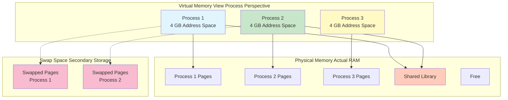
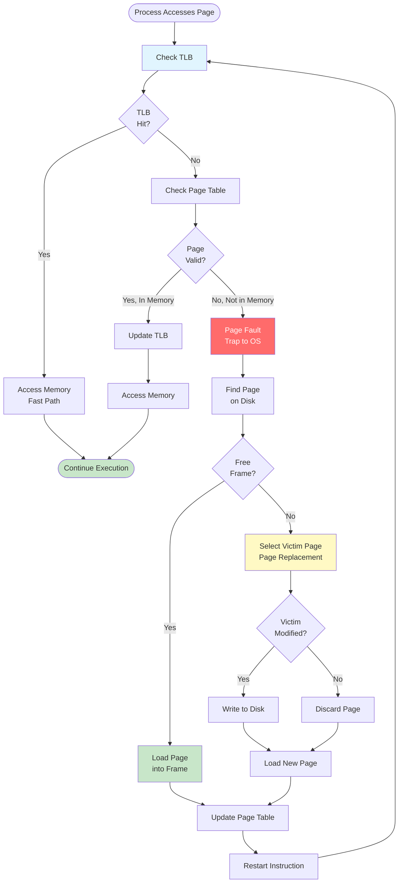
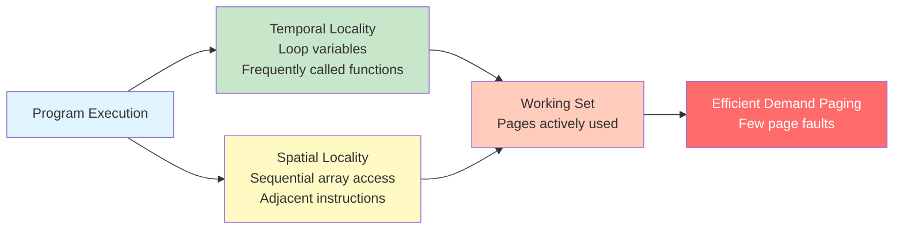
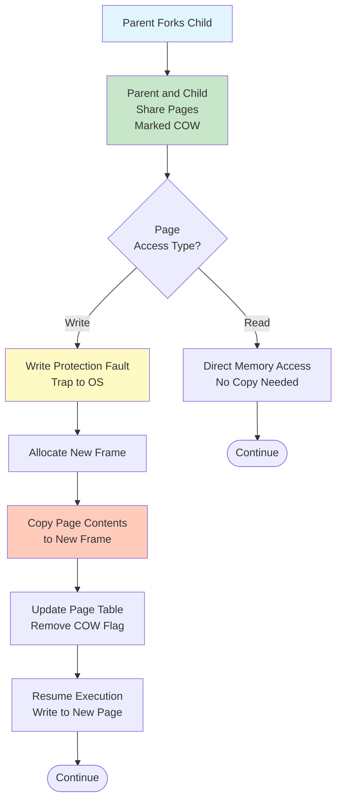
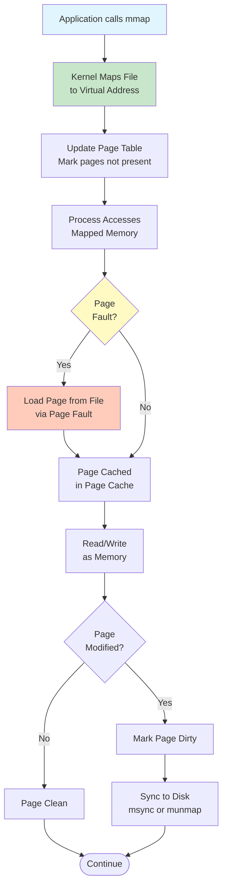
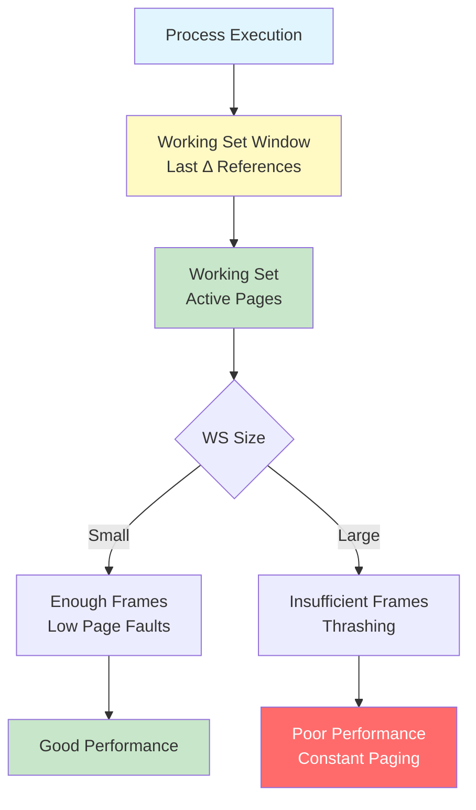
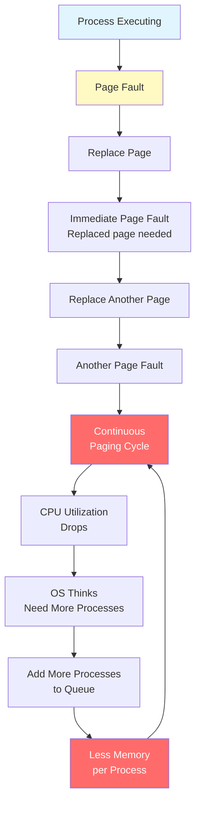
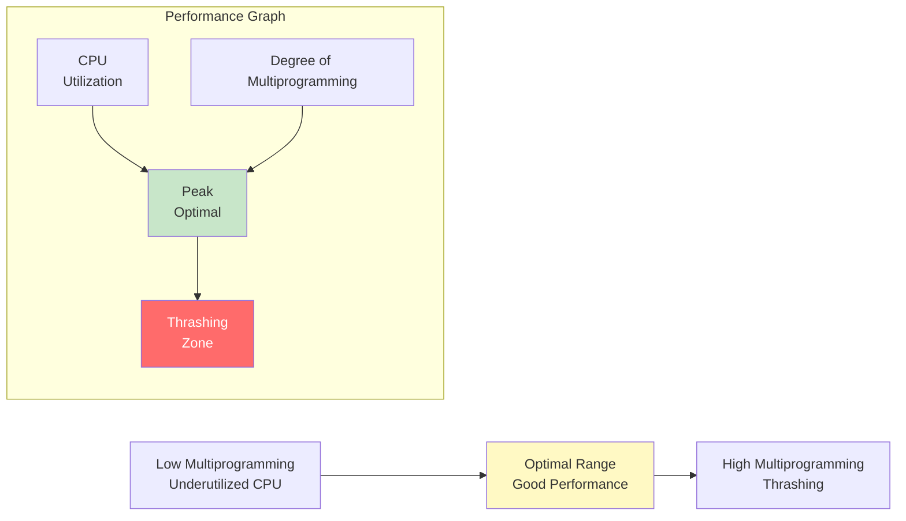
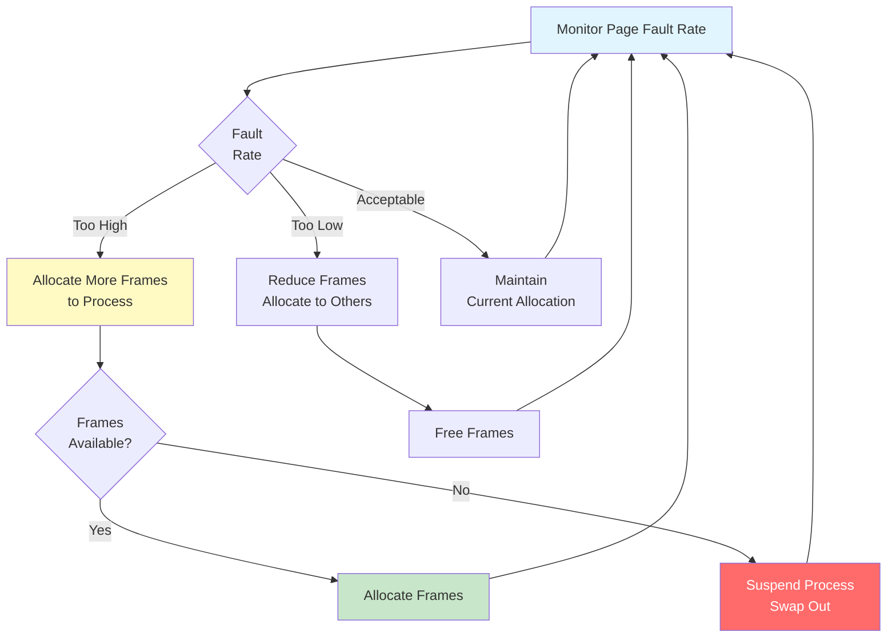
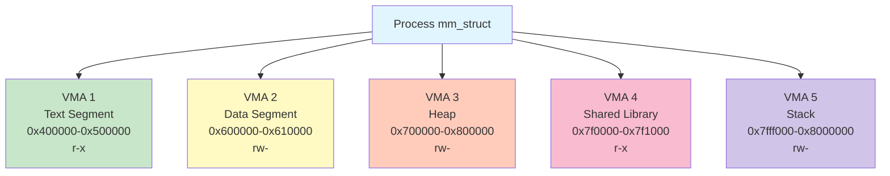

#linux #operating-system #memory #virtual-memory #paging #memory-management #unix #fedora #ubuntu #debian #rhel #centos-stream
- Virtual memory is a memory management technique that provides an abstraction of storage resources.
- <mark class="hltr-yellow">Allows execution of processes that are not completely in physical memory</mark>.
- Separates logical memory from physical memory, enabling larger programs than physical RAM.
- Enables memory protection, sharing, and efficient use of physical memory.
# Virtual Memory Concepts
## Key Benefits
### Large Address Space
- <mark class="hltr-yellow">Programs can use more memory than physically available</mark>.
- Logical address space can be much larger than physical memory.
- Portions of program loaded as needed (demand paging).
### Memory Protection
- Each process has isolated address space.
- Cannot access another process's memory.
- Hardware enforces protection through page tables.
### Memory Sharing
- Multiple processes can share code and data.
- Shared libraries loaded once in physical memory.
- Copy-on-write for efficient process creation.
### Efficient Process Creation
- Fork operation uses copy-on-write.
- Parent and child initially share pages.
- Copy only when modified.
## Virtual vs Physical Memory

# Demand Paging
- <mark class="hltr-yellow">Load pages into memory only when needed during execution</mark>.
- Lazy swapper: Never swap page into memory unless required.
- Most common virtual memory implementation.
## Demand Paging Process

## Page Fault Handling
### Page Fault Steps
1. **Trap to operating system**
	- Hardware generates page fault exception.
	- Save process state.
2. **Determine page location**
	- Check internal table for page address.
	- Verify valid access (protection check).
3. **Find free frame**
	- Allocate from free frame list.
	- If no free frames, run page replacement algorithm.
4. **Read page from disk**
	- Issue disk I/O to read page.
	- Process blocked (waiting state).
5. **Update page table**
	- Set valid bit.
	- Update frame number.
	- Clear modify/reference bits.
6. **Restart instruction**
	- Resume execution at faulting instruction.
	- Instruction re-executed successfully.
### Page Fault Performance
```
Effective Access Time (EAT) with page faults:

EAT = (1 - p) × Memory Access Time + p × Page Fault Time

Where:
  p = page fault rate (0 ≤ p ≤ 1)
  Memory Access Time = 100 ns (typical)
  Page Fault Time = 8 ms (typical, includes disk I/O)

Example with p = 0.001 (1 page fault per 1000 accesses):
EAT = 0.999 × 100 ns + 0.001 × 8,000,000 ns
    = 99.9 ns + 8,000 ns
    = 8,099.9 ns

Performance degradation: 80× slower!

To keep degradation < 10%:
  100 × 1.1 = (1 - p) × 100 + p × 8,000,000
  110 = 100 + p × 7,999,900
  p < 0.00000125 (1 page fault per 800,000 accesses)
```
## Pure Demand Paging
- <mark class="hltr-yellow">Start process with no pages in memory</mark>.
- First instruction causes page fault.
- Pages loaded only as referenced.
### Locality of Reference
- Programs tend to access small portion of address space at any time.
- **Temporal Locality**: Recently accessed items likely to be accessed again.
- **Spatial Locality**: Items near recently accessed items likely to be accessed.
- Makes demand paging efficient.

# Copy-on-Write (COW)
- <mark class="hltr-yellow">Optimization for process creation using fork</mark>.
- Parent and child initially share same physical pages.
- Pages marked as read-only copy-on-write.
- Copy made only when either process modifies page.
## Copy-on-Write Process

## COW Benefits
1. **Fast Process Creation**: Fork returns immediately.
2. **Memory Efficiency**: No unnecessary copying.
3. **Delayed Allocation**: Allocate only when needed.
### COW Example
```
Before fork:
Parent Process: Pages 0-9 in frames 10-19

After fork (before any writes):
Parent Process: Pages 0-9 → Frames 10-19 (COW)
Child Process:  Pages 0-9 → Frames 10-19 (COW)

After child writes to page 2:
Parent Process: Pages 0-9 → Frames 10-19 (pages 0,1,3-9 COW)
Child Process:  Page 2 → Frame 50 (new copy)
                Pages 0,1,3-9 → Frames 10,11,13-19 (COW)
```
# Memory-Mapped Files
- <mark class="hltr-yellow">Map file contents directly into process address space</mark>.
- File I/O treated as memory access.
- Simplifies file access, improves performance.
- Enables file sharing between processes.
## Memory Mapping Process

## mmap System Call
```C title='Memory-mapped file example'
#include <sys/mman.h>
#include <sys/stat.h>
#include <fcntl.h>
#include <stdio.h>
#include <stdlib.h>
#include <unistd.h>
#include <string.h>

int main() {
    int fd;
    char *map;
    struct stat sb;

    // Open file
    fd = open("testfile.txt", O_RDWR | O_CREAT, 0644);
    if (fd == -1) {
        perror("open");
        return 1;
    }

    // Write some initial data
    const char *text = "Hello, Memory-Mapped File!\n";
    write(fd, text, strlen(text));

    // Get file size
    fstat(fd, &sb);

    // Memory map the file
    map = mmap(NULL, sb.st_size, PROT_READ | PROT_WRITE, MAP_SHARED, fd, 0);
    if (map == MAP_FAILED) {
        perror("mmap");
        close(fd);
        return 1;
    }

    // Can close fd, mapping remains valid
    close(fd);

    // Access file as memory
    printf("File contents: %s", map);

    // Modify file through memory
    map[0] = 'h';

    // Sync changes to disk
    msync(map, sb.st_size, MS_SYNC);

    // Unmap
    munmap(map, sb.st_size);

    return 0;
}
```
### mmap Parameters
```C
void *mmap(void *addr, size_t length, int prot, int flags, int fd, off_t offset);

addr:   Suggested address (usually NULL for kernel to choose)
length: Number of bytes to map
prot:   Protection flags
        PROT_READ    - Pages may be read
        PROT_WRITE   - Pages may be written
        PROT_EXEC    - Pages may be executed
        PROT_NONE    - Pages may not be accessed
flags:  Mapping flags
        MAP_SHARED   - Share with other processes
        MAP_PRIVATE  - Private copy-on-write mapping
        MAP_ANONYMOUS - Not backed by file
fd:     File descriptor
offset: File offset to start mapping
```
## Memory-Mapped File Benefits
1. **Simplified I/O**: No read/write system calls needed.
2. **Performance**: Avoid copying between kernel and user space.
3. **Sharing**: Multiple processes can map same file.
4. **Efficiency**: Lazy loading via demand paging.
# Page Replacement Algorithms
- When all frames are allocated, must select victim page to replace.
- Goal: Minimize page fault rate.
- <mark class="hltr-yellow">Critical for virtual memory performance</mark>.
- Covered in detail in [[Page replacement.md]].
# Working Set Model
- <mark class="hltr-yellow">Set of pages actively used by process during execution window</mark>.
- Based on principle of locality.
- Used to determine memory requirements.
## Working Set Definition
```
Working Set (WS) = Set of pages referenced in last Δ page references

Δ = working set window size
If page referenced within last Δ references, it's in working set
```
### Working Set Example
```
Page reference string: 1 2 3 4 1 2 5 1 2 3 4 5

Window size Δ = 4:

Time | References     | Working Set
-----|----------------|-------------
  1  | 1              | {1}
  2  | 1 2            | {1,2}
  3  | 1 2 3          | {1,2,3}
  4  | 1 2 3 4        | {1,2,3,4}
  5  | 2 3 4 1        | {1,2,3,4}
  6  | 3 4 1 2        | {1,2,3,4}
  7  | 4 1 2 5        | {1,2,4,5}
  8  | 1 2 5 1        | {1,2,5}
  9  | 2 5 1 2        | {1,2,5}
 10  | 5 1 2 3        | {1,2,3,5}
```
### Working Set Visualization

# Thrashing
- <mark class="hltr-yellow">Condition where process spends more time paging than executing</mark>.
- Occurs when process doesn't have enough frames for working set.
- System performance degrades severely.
## Causes of Thrashing
1. **Insufficient Memory**: Too many processes for available RAM.
2. **Poor Locality**: Process has large working set.
3. **Inappropriate Page Replacement**: Algorithm selects pages still needed.
## Thrashing Behavior

### CPU Utilization vs Degree of Multiprogramming

## Preventing Thrashing
### Local vs Global Replacement
- **Local Replacement**: Process replaces only its own pages.
- **Global Replacement**: Process can replace any page in system.
- Local replacement limits thrashing propagation.
### Working Set Strategy
- <mark class="hltr-yellow">Allocate frames based on working set size</mark>.
- If working set doesn't fit, suspend process.
- Prevents thrashing at cost of multiprogramming.
### Page Fault Frequency (PFF)
- Monitor page fault rate per process.
- If rate too high: allocate more frames.
- If rate too low: reduce frames.

# Linux Virtual Memory
## Address Space Layout
```Shell title='View virtual memory layout'
# View process memory map
cat /proc/self/maps

# Detailed mapping information
pmap -x $$

# Memory statistics
cat /proc/self/status | grep -i vm

# Show virtual memory areas
cat /proc/self/smaps
```
### Process Virtual Memory Areas (VMAs)

## vm_area_struct
- Linux represents each memory region as VMA.
- Contains start/end addresses, permissions, backing file.
```C
struct vm_area_struct {
    unsigned long vm_start;        /* Start address */
    unsigned long vm_end;          /* End address */
    unsigned long vm_flags;        /* Permissions */
    struct file *vm_file;          /* Backing file */
    unsigned long vm_pgoff;        /* Offset in file */
    struct vm_area_struct *vm_next; /* Next VMA */
    /* ... */
};
```
## Overcommit Memory
- <mark class="hltr-yellow">Linux allows processes to allocate more memory than physically available</mark>.
- Assumption: Not all allocated memory will be used.
- Can lead to OOM (Out of Memory) killer invocation.
### Overcommit Modes
```Shell title='Configure memory overcommit'
# Check current overcommit setting
cat /proc/sys/vm/overcommit_memory
# 0 = Heuristic (default)
# 1 = Always overcommit
# 2 = Never overcommit

# Set overcommit mode
echo 2 | sudo tee /proc/sys/vm/overcommit_memory

# Check overcommit ratio
cat /proc/sys/vm/overcommit_ratio
# Default: 50 (50% of physical RAM)

# Set overcommit ratio
echo 80 | sudo tee /proc/sys/vm/overcommit_ratio
```
### Overcommit Behavior
| Mode | Description |
|------|-------------|
| 0 (Heuristic) | Kernel estimates if request reasonable |
| 1 (Always) | All allocations succeed (may OOM later) |
| 2 (Never) | Strict accounting, reject if exceeds limit |
## Out of Memory (OOM) Killer
- Invoked when system runs out of memory.
- <mark class="hltr-yellow">Selects and kills process to free memory</mark>.
- Based on badness score.
### OOM Score
```Shell title='Check OOM scores'
# View OOM scores for all processes
ps -eo pid,comm,oom_score | sort -k3 -n -r | head -10

# View OOM adjustment for process
cat /proc/$$/oom_score_adj

# Set OOM adjustment (-1000 to 1000)
# -1000 = never kill
# 0 = default
# 1000 = always kill first
echo -500 | sudo tee /proc/$$/oom_score_adj
```
# Practical Examples
## Example 1: Demonstrate Demand Paging
```C title='Observe demand paging behavior'
#include <stdio.h>
#include <stdlib.h>
#include <unistd.h>
#include <sys/time.h>
#include <sys/resource.h>

#define SIZE (100 * 1024 * 1024)  // 100 MB

void print_page_faults() {
    struct rusage usage;
    getrusage(RUSAGE_SELF, &usage);
    printf("Page faults: minor=%ld, major=%ld\n",
           usage.ru_minflt, usage.ru_majflt);
}

int main() {
    char *mem;

    printf("Before allocation:\n");
    print_page_faults();

    // Allocate memory
    mem = malloc(SIZE);
    printf("\nAfter malloc (no page faults yet):\n");
    print_page_faults();

    // Access first page
    mem[0] = 'A';
    printf("\nAfter accessing first page:\n");
    print_page_faults();

    // Access all pages
    for (int i = 0; i < SIZE; i += 4096) {
        mem[i] = 'A';
    }
    printf("\nAfter accessing all pages:\n");
    print_page_faults();

    free(mem);
    return 0;
}
```
```Shell title='Compile and run'
gcc -o pagefault pagefault.c
./pagefault

# Output shows page faults occur only when pages actually accessed
# Before allocation:
# Page faults: minor=150, major=0
#
# After malloc (no page faults yet):
# Page faults: minor=150, major=0
#
# After accessing first page:
# Page faults: minor=151, major=0
#
# After accessing all pages:
# Page faults: minor=25751, major=0
```
## Example 2: Memory-Mapped File Performance
```C title='Compare mmap vs read/write'
#include <stdio.h>
#include <stdlib.h>
#include <fcntl.h>
#include <unistd.h>
#include <sys/mman.h>
#include <sys/stat.h>
#include <time.h>
#include <string.h>

#define SIZE (100 * 1024 * 1024)  // 100 MB

double get_time() {
    struct timespec ts;
    clock_gettime(CLOCK_MONOTONIC, &ts);
    return ts.tv_sec + ts.tv_nsec / 1e9;
}

void test_read_write() {
    int fd = open("testfile", O_RDWR | O_CREAT, 0644);
    char *buf = malloc(SIZE);
    double start, end;

    // Write
    start = get_time();
    write(fd, buf, SIZE);
    end = get_time();
    printf("write() time: %.3f seconds\n", end - start);

    // Read
    lseek(fd, 0, SEEK_SET);
    start = get_time();
    read(fd, buf, SIZE);
    end = get_time();
    printf("read() time: %.3f seconds\n", end - start);

    free(buf);
    close(fd);
}

void test_mmap() {
    int fd = open("testfile", O_RDWR);
    char *map;
    double start, end;

    // Map file
    start = get_time();
    map = mmap(NULL, SIZE, PROT_READ | PROT_WRITE, MAP_SHARED, fd, 0);
    end = get_time();
    printf("mmap() time: %.6f seconds\n", end - start);

    // Access (triggers page faults)
    start = get_time();
    for (int i = 0; i < SIZE; i += 4096) {
        map[i] = 'A';
    }
    end = get_time();
    printf("mmap access time: %.3f seconds\n", end - start);

    munmap(map, SIZE);
    close(fd);
}

int main() {
    printf("=== Testing read/write ===\n");
    test_read_write();

    printf("\n=== Testing mmap ===\n");
    test_mmap();

    unlink("testfile");
    return 0;
}
```
## Example 3: Copy-on-Write Demonstration
```C title='Observe COW behavior'
#include <stdio.h>
#include <stdlib.h>
#include <unistd.h>
#include <sys/wait.h>
#include <string.h>

void print_memory_info(char *label) {
    char cmd[256];
    snprintf(cmd, sizeof(cmd),
             "grep -E 'VmSize|VmRSS' /proc/%d/status | awk '{print \"%s \" $1 \" \" $2}'",
             getpid(), label);
    system(cmd);
}

int main() {
    size_t size = 100 * 1024 * 1024;  // 100 MB
    char *mem = malloc(size);
    pid_t pid;

    // Initialize memory
    memset(mem, 'A', size);

    printf("Parent before fork:\n");
    print_memory_info("Parent");

    pid = fork();

    if (pid == 0) {
        // Child process
        sleep(1);
        printf("\nChild after fork (shared pages):\n");
        print_memory_info("Child");

        // Modify memory (triggers COW)
        printf("\nChild modifying memory...\n");
        for (size_t i = 0; i < size; i += 4096) {
            mem[i] = 'B';
        }

        printf("\nChild after modification (COW triggered):\n");
        print_memory_info("Child");

        exit(0);
    } else {
        // Parent process
        sleep(1);
        printf("\nParent after fork (shared pages):\n");
        print_memory_info("Parent");

        wait(NULL);
        printf("\nParent after child exit:\n");
        print_memory_info("Parent");
    }

    free(mem);
    return 0;
}
```
## Example 4: Working Set Analysis
```Shell title='Monitor working set size'
# Create script to track working set
cat > workingset.sh << 'EOF'
#!/bin/bash
PID=$1
INTERVAL=${2:-1}

echo "Monitoring working set for PID $PID"
echo "Time,WSS_MB,RSS_MB,PSS_MB"

while kill -0 $PID 2>/dev/null; do
    # Get working set size (referenced pages)
    WSS=$(grep -E "^Referenced:" /proc/$PID/smaps | \
          awk '{sum += $2} END {print sum/1024}')

    # Get resident set size
    RSS=$(grep "^VmRSS:" /proc/$PID/status | awk '{print $2/1024}')

    # Get proportional set size
    PSS=$(grep -E "^Pss:" /proc/$PID/smaps | \
          awk '{sum += $2} END {print sum/1024}')

    echo "$(date +%s),$WSS,$RSS,$PSS"
    sleep $INTERVAL
done
EOF

chmod +x workingset.sh

# Run monitoring
./workingset.sh <PID> 1 > workingset.csv
```
## Example 5: Thrashing Detection
```Shell title='Detect thrashing conditions'
# Monitor page fault rate
cat > detect_thrashing.sh << 'EOF'
#!/bin/bash

echo "Monitoring for thrashing conditions..."
echo "Time,Major_Faults/s,Swap_In/s,Swap_Out/s"

PREV_PGMAJFAULT=$(grep pgmajfault /proc/vmstat | awk '{print $2}')
PREV_PSWPIN=$(grep pswpin /proc/vmstat | awk '{print $2}')
PREV_PSWPOUT=$(grep pswpout /proc/vmstat | awk '{print $2}')

while true; do
    sleep 1

    CURR_PGMAJFAULT=$(grep pgmajfault /proc/vmstat | awk '{print $2}')
    CURR_PSWPIN=$(grep pswpin /proc/vmstat | awk '{print $2}')
    CURR_PSWPOUT=$(grep pswpout /proc/vmstat | awk '{print $2}')

    PGMAJFAULT_RATE=$((CURR_PGMAJFAULT - PREV_PGMAJFAULT))
    PSWPIN_RATE=$((CURR_PSWPIN - PREV_PSWPIN))
    PSWPOUT_RATE=$((CURR_PSWPOUT - PREV_PSWPOUT))

    # Thrashing if high page fault rate and swapping
    if [ $PGMAJFAULT_RATE -gt 100 ] && [ $PSWPIN_RATE -gt 50 ]; then
        echo "$(date +%T),${PGMAJFAULT_RATE},${PSWPIN_RATE},${PSWPOUT_RATE} <-- THRASHING!"
    else
        echo "$(date +%T),${PGMAJFAULT_RATE},${PSWPIN_RATE},${PSWPOUT_RATE}"
    fi

    PREV_PGMAJFAULT=$CURR_PGMAJFAULT
    PREV_PSWPIN=$CURR_PSWPIN
    PREV_PSWPOUT=$CURR_PSWPOUT
done
EOF

chmod +x detect_thrashing.sh
./detect_thrashing.sh
```
***
# References
1. Operating System Concepts - Abraham Silberschatz - 10th - 2018 - Pearson Publisher.
	1. Chapter 10: Virtual Memory.
		1. Section 10.1: Background.
		2. Section 10.2: Demand Paging.
		3. Section 10.3: Copy-on-Write.
		4. Section 10.4: Page Replacement.
		5. Section 10.5: Allocation of Frames.
		6. Section 10.6: Thrashing.
2. Modern Operating Systems - Andrew Tanenbaum - 4th Edition - 2014 - Pearson.
	1. Chapter 3: Memory Management.
		1. Section 3.3: Virtual Memory.
		2. Section 3.4: Page Replacement Algorithms.
3. Operating Systems: Three Easy Pieces - Remzi Arpaci-Dusseau - 2018.
	1. Chapter 21: Beyond Physical Memory: Mechanisms.
	2. Chapter 22: Beyond Physical Memory: Policies.
4. Understanding the Linux Virtual Memory Manager - Mel Gorman - 2004.
5. `man mmap`, `man munmap`, `man msync`, `man mlock`
6. https://www.kernel.org/doc/html/latest/admin-guide/mm/concepts.html
7. https://www.kernel.org/doc/gorman/html/understand/understand011.html
