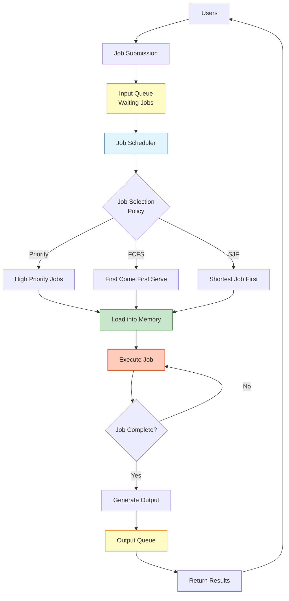
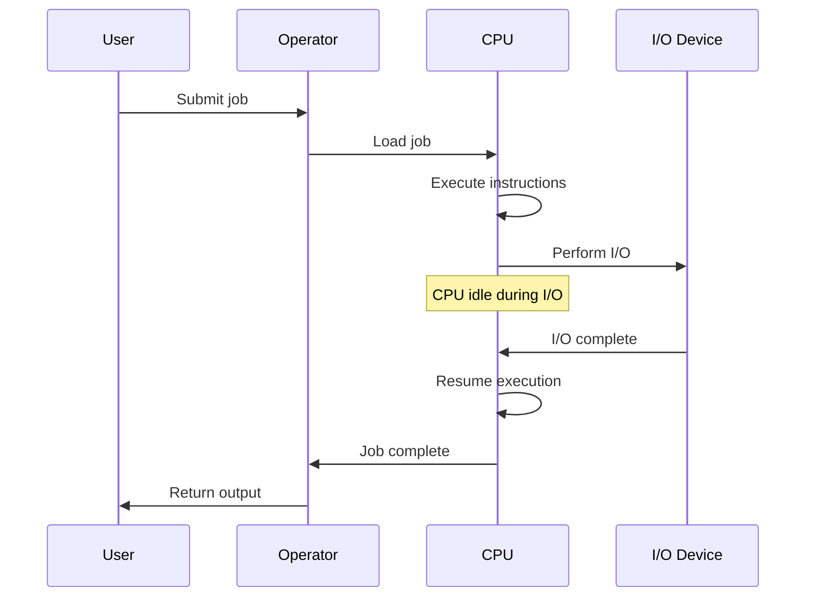
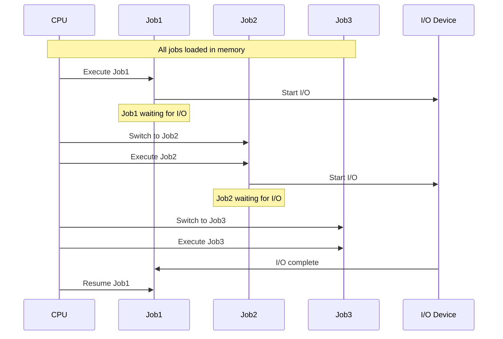
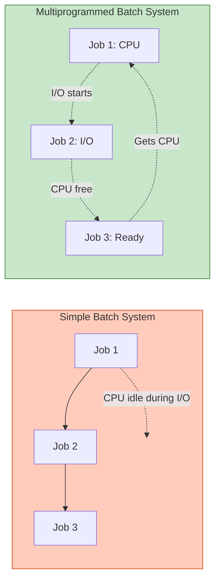
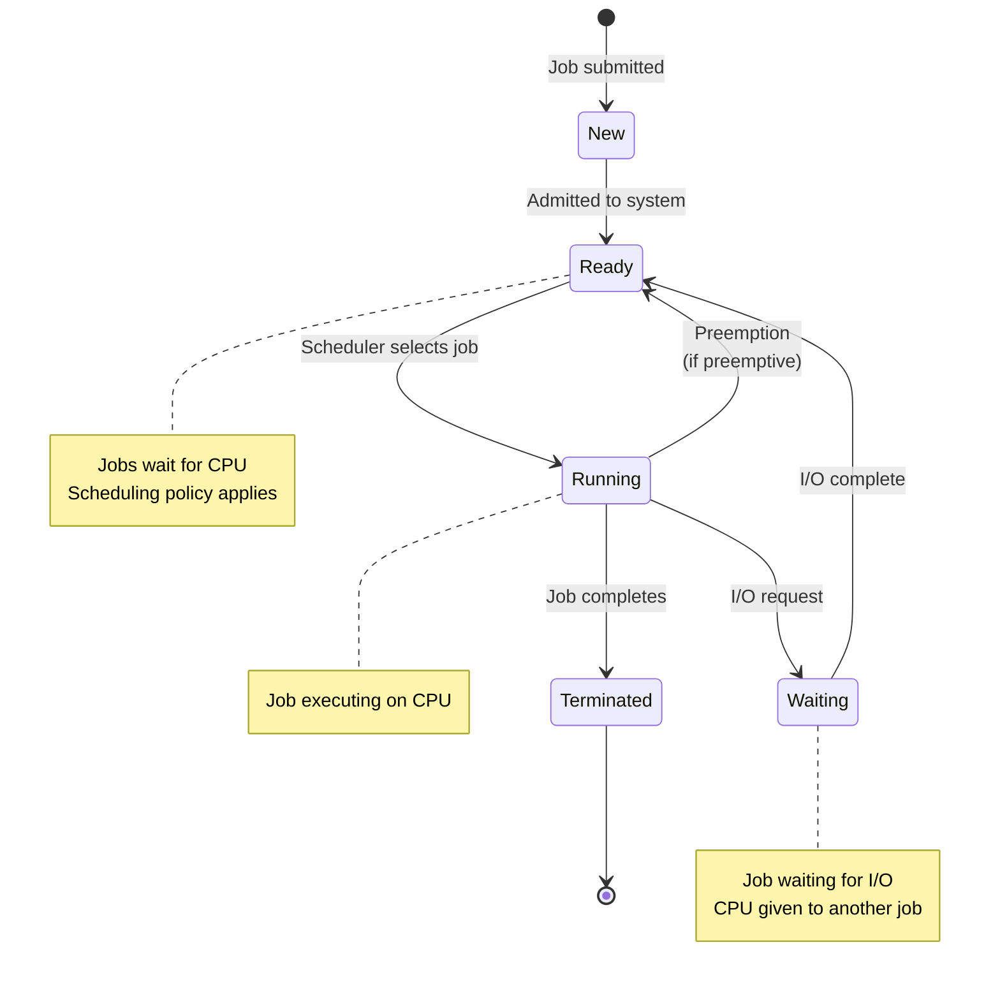
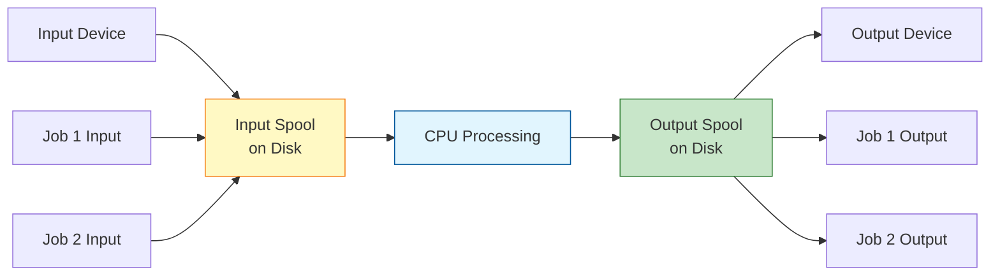
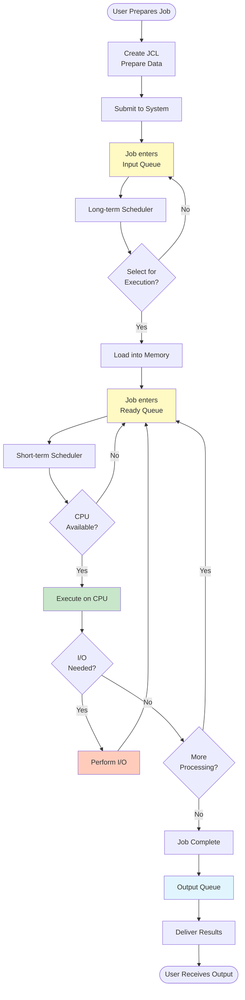
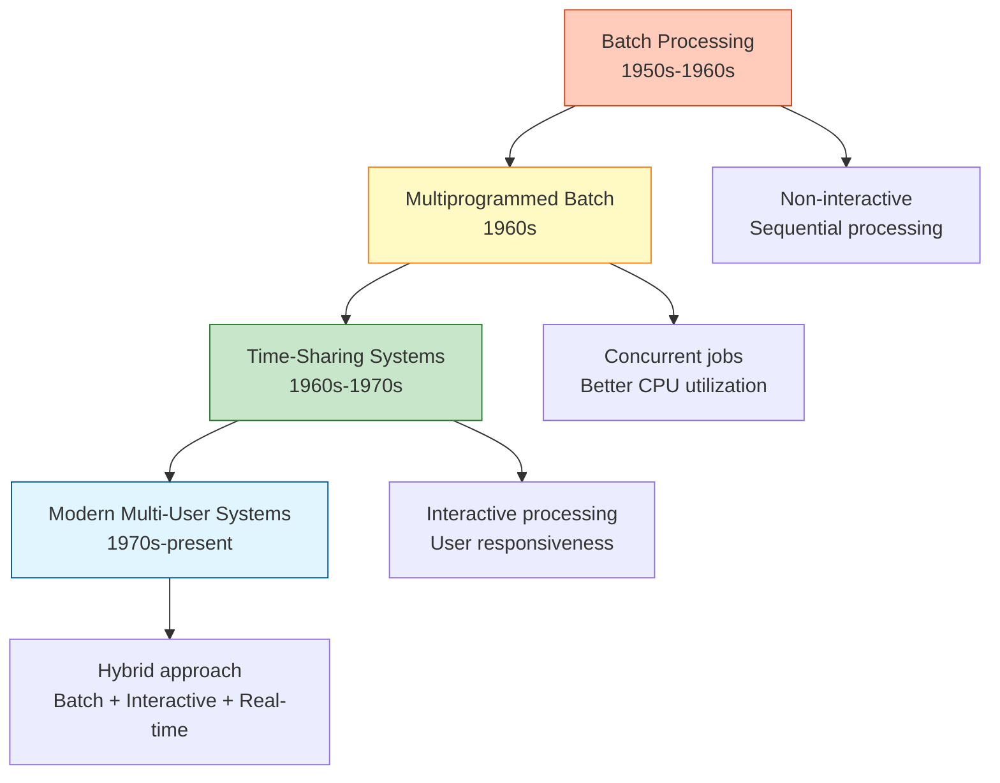

#operating-system #process-scheduling #batch-processing #job-scheduling #multiprogramming
#linux #unix

- Batch processing is a method where jobs are collected and executed without user interaction.
- <mark class="hltr-yellow">Jobs are grouped into batches and processed sequentially or concurrently</mark>.
- Users submit jobs and receive results after completion, with no interactive control during execution.
# Batch Processing Characteristics

## Non-Interactive Execution
- <mark class="hltr-yellow">No user interaction during job execution</mark>.
- Jobs are submitted with all necessary instructions and data.
- Results are provided after job completion.
- Users cannot modify or control jobs once submitted.

## Job Queuing
- Jobs wait in a queue before execution.
- Scheduler selects jobs from queue based on policy.
- Multiple queues may exist for different job types.

## Batch Organization
- Similar jobs grouped together for efficiency.
- Common setup requirements shared among batch jobs.
- Reduces system overhead from context switching.

## Resource Utilization
- <mark class="hltr-yellow">Maximizes CPU utilization through continuous job execution</mark>.
- Automatic job sequencing minimizes idle time.
- Efficient use of peripheral devices.
## Batch System Architecture


# Types of Batch Processing Systems

## Simple Batch System
- <mark class="hltr-yellow">Single job executed at a time</mark>.
- CPU remains idle during I/O operations.
- No multiprogramming support.
- Minimal memory requirements.
### Simple Batch Operation


### Characteristics
- One job in memory at a time.
- CPU utilization: Low (idle during I/O).
- Throughput: Low (sequential processing).
- Turnaround time: High (waiting for previous jobs).

## Multiprogrammed Batch System
- <mark class="hltr-yellow">Multiple jobs loaded in memory simultaneously</mark>.
- CPU switches to another job during I/O wait.
- Increases CPU utilization and throughput.
- Requires memory management and protection.
### Multiprogramming Operation


### Characteristics
- Multiple jobs in memory.
- CPU utilization: High (context switching during I/O).
- Throughput: High (concurrent job execution).
- Requires: Memory protection, scheduling algorithm.

## Comparison


# Job Scheduling in Batch Systems

## Scheduling Objectives
- Maximize CPU utilization.
- Maximize throughput (jobs per unit time).
- Minimize turnaround time (submission to completion).
- Minimize waiting time (time in ready queue).
- Ensure fairness among jobs.

## Scheduling Algorithms

### First-Come, First-Served (FCFS)
- <mark class="hltr-yellow">Jobs executed in order of arrival</mark>.
- Simple implementation using FIFO queue.
- Non-preemptive scheduling.
- May cause convoy effect (short jobs wait for long jobs).

#### FCFS Example
```
Jobs:
Job A: Arrival=0, Burst=8
Job B: Arrival=1, Burst=4
Job C: Arrival=2, Burst=2

Execution Order: A → B → C
Turnaround Times: A=8, B=11, C=12
Average Turnaround: (8+11+12)/3 = 10.33
```

### Shortest Job First (SJF)
- <mark class="hltr-yellow">Executes job with shortest burst time first</mark>.
- Minimizes average waiting time.
- Requires knowledge of job execution time.
- May cause starvation of long jobs.

#### SJF Example
```
Jobs (same as above):
Job A: Arrival=0, Burst=8
Job B: Arrival=1, Burst=4
Job C: Arrival=2, Burst=2

Execution Order: A → C → B
Turnaround Times: A=8, B=12, C=8
Average Turnaround: (8+12+8)/3 = 9.33
```

### Priority Scheduling
- <mark class="hltr-yellow">Jobs assigned priority values</mark>.
- Highest priority job executed first.
- Can be preemptive or non-preemptive.
- May cause starvation of low-priority jobs.
- Solution: Aging (gradually increase priority).

## Scheduling Flow


# Job Control Language (JCL)

## Purpose
- <mark class="hltr-yellow">Specification language for batch job requirements</mark>.
- Describes job steps, data sets, and resource needs.
- Provides instructions to operating system.

## JCL Components

### Job Card
- Identifies the job to the system.
- Specifies job name, user information, accounting.
- Sets job-level parameters.

### Exec Card
- Specifies program or procedure to execute.
- Defines execution parameters.
- May reference program library.

### DD (Data Definition) Card
- Defines data sets used by job.
- Specifies input/output files.
- Describes data set characteristics.

## Example JCL Structure
```jcl
//JOBNAME  JOB  (ACCOUNT),'USER NAME',CLASS=A,MSGCLASS=X
//STEP1    EXEC PGM=PROGRAM1
//INPUT    DD   DSN=INPUT.DATA,DISP=SHR
//OUTPUT   DD   DSN=OUTPUT.DATA,DISP=(NEW,CATLG,DELETE)
//SYSIN    DD   *
  Input data goes here
/*
```

# Batch Processing Components

## Spooling (Simultaneous Peripheral Operations On-Line)
- <mark class="hltr-yellow">Overlaps I/O of one job with computation of another</mark>.
- Uses disk as buffer between I/O devices and CPU.
- Improves system performance.

### Spooling Operation


### Spooling Advantages
- Concurrent I/O and CPU operations.
- Multiple jobs can use I/O devices.
- Reduces CPU idle time.
- Improves job throughput.

## Job Pool
- Collection of jobs waiting for execution.
- Stored on disk (spool area).
- Scheduler selects jobs from pool.
- Allows long-term scheduling decisions.

## Resident Monitor
- <mark class="hltr-yellow">Operating system component always in memory</mark>.
- Controls job execution sequence.
- Loads jobs into memory.
- Transfers control between jobs.
- Provides system services.

# Batch Processing Workflow


# Advantages of Batch Processing

## Efficiency
- <mark class="hltr-yellow">High resource utilization through continuous job execution</mark>.
- Minimal CPU idle time with multiprogramming.
- Automatic job sequencing reduces overhead.
- Optimal for large volumes of similar jobs.

## Cost Effectiveness
- Lower operational costs (no interactive overhead).
- Efficient use of expensive computer time.
- Can schedule jobs during off-peak hours.
- Batch jobs can use cheaper resources.

## Predictability
- Known job execution sequence.
- Predictable resource requirements.
- Scheduled completion times.
- Consistent processing environment.

## Throughput
- Process large volumes of data efficiently.
- Concurrent job execution increases throughput.
- Minimal setup time between similar jobs.

# Disadvantages of Batch Processing

## Lack of Interaction
- <mark class="hltr-yellow">No user control during execution</mark>.
- Cannot modify job once submitted.
- Debugging is difficult (no interactive feedback).
- Errors discovered only after completion.

## Long Turnaround Time
- Delay between submission and results.
- Wait time includes queuing and execution.
- Not suitable for urgent tasks.
- Users cannot get immediate feedback.

## Job Failures
- Entire batch may fail due to single error.
- Failed jobs waste resources.
- Requires job resubmission.
- Error detection delayed until completion.

## Inflexibility
- Jobs must be fully specified at submission.
- Cannot adapt to changing conditions.
- Difficult to handle exceptional cases.
- Priority changes require intervention.

# Batch Processing vs Other Systems

## Comparison Table
| Aspect | Batch Processing | Time-Sharing | Real-Time |
|--------|------------------|--------------|-----------|
| User Interaction | None during execution | Interactive throughout | Limited/none |
| Response Time | Hours to days | Seconds | Milliseconds to seconds |
| Job Type | Large computational tasks | Interactive programs | Time-critical tasks |
| CPU Utilization | Very high | Moderate | Varies |
| Throughput | Very high | Moderate | Low to moderate |
| Priority | Based on job characteristics | Equal time slices | Deadline-based |
| Example Use | Payroll, billing, reports | Text editors, compilers | Process control, aviation |

## System Evolution


# Modern Batch Processing

## Contemporary Applications
- Data warehousing and ETL (Extract, Transform, Load).
- Report generation and analytics.
- Database maintenance and backups.
- Financial transaction processing (end-of-day).
- Scientific simulations and computations.
- Video/audio encoding and transcoding.
- Machine learning model training.

## Modern Batch Frameworks

### Unix/Linux Cron
- Time-based job scheduler.
- Executes periodic batch jobs.
- User-level and system-level cron jobs.

```bash title='Cron job example'
# Run backup script daily at 2:00 AM
0 2 * * * /usr/local/bin/backup.sh

# Process reports every Monday at 9:00 AM
0 9 * * 1 /usr/local/bin/generate-reports.sh
```

### Apache Hadoop MapReduce
- Distributed batch processing framework.
- Processes large datasets across clusters.
- Fault-tolerant and scalable.

### Spring Batch
- Java framework for batch processing.
- Transaction management and job restart.
- Chunk-oriented processing.

## Cloud Batch Processing
- AWS Batch: Managed batch computing service.
- Azure Batch: Cloud-scale job scheduling.
- Google Cloud Dataflow: Batch and stream processing.
- Kubernetes Jobs: Container-based batch execution.

# Batch Processing Performance Metrics

## Turnaround Time
- <mark class="hltr-yellow">Total time from job submission to completion</mark>.
- Includes waiting time, execution time, I/O time.
- Formula: `Turnaround Time = Completion Time - Arrival Time`

## Throughput
- <mark class="hltr-yellow">Number of jobs completed per unit time</mark>.
- Higher throughput indicates better system performance.
- Formula: `Throughput = Number of Jobs / Total Time`

## CPU Utilization
- Percentage of time CPU is actively executing jobs.
- Formula: `CPU Utilization = (Total CPU Time / Total Elapsed Time) × 100%`

## Waiting Time
- Time job spends in ready queue.
- Lower waiting time improves user satisfaction.
- Affected by scheduling algorithm.

## Response Ratio
- Used in Highest Response Ratio Next (HRRN) scheduling.
- Formula: `Response Ratio = (Waiting Time + Burst Time) / Burst Time`
- Higher ratio gets higher priority.

## Example Performance Calculation
```
Jobs:
Job A: Arrival=0, Burst=6
Job B: Arrival=2, Burst=3
Job C: Arrival=4, Burst=1

FCFS Scheduling:
Job A: 0 to 6   → Turnaround = 6-0 = 6
Job B: 6 to 9   → Turnaround = 9-2 = 7
Job C: 9 to 10  → Turnaround = 10-4 = 6

Average Turnaround Time = (6+7+6)/3 = 6.33
Throughput = 3 jobs / 10 time units = 0.3 jobs/time
CPU Utilization = 10/10 = 100%
```

# Batch Processing Best Practices

## Job Design
- Keep jobs independent when possible.
- Minimize inter-job dependencies.
- Design for restartability and recovery.
- Implement checkpointing for long jobs.

## Resource Management
- Estimate resource requirements accurately.
- Avoid resource contention.
- Use appropriate priority levels.
- Monitor resource usage.

## Error Handling
- Implement comprehensive error checking.
- Provide detailed error messages.
- Design fallback and recovery procedures.
- Log all significant events.

## Scheduling
- Group similar jobs for efficiency.
- Schedule resource-intensive jobs during off-peak hours.
- Balance load across available resources.
- Use appropriate scheduling algorithm for workload.

## Monitoring
- Track job execution status.
- Monitor system resource utilization.
- Identify bottlenecks and failures.
- Maintain execution history for analysis.

***
# References
1. Operating System Concepts - Abraham Silberschatz - 10th - 2018 - Pearson Publisher.
	1. Chapter 1: Introduction.
		1. Section 1.2: Computer-System Organization.
		2. Section 1.5: Operating-System Operations.
	2. Chapter 5: CPU Scheduling.
2. Modern Operating Systems - Andrew S. Tanenbaum - 4th - 2014 - Pearson.
	1. Chapter 1: Introduction.
		1. Section 1.2: History of Operating Systems.
3. Operating Systems: Internals and Design Principles - William Stallings - 9th - 2018 - Pearson.
	1. Chapter 2: Operating System Overview.
		1. Section 2.1: Operating System Objectives and Functions.
4. Operating Systems: Three Easy Pieces - Remzi H. Arpaci-Dusseau - 1st - 2018 - Arpaci-Dusseau Books.
	1. Chapter 7: Scheduling: Introduction.
5. https://en.wikipedia.org/wiki/Batch_processing
6. https://www.ibm.com/docs/en/zos-basic-skills
