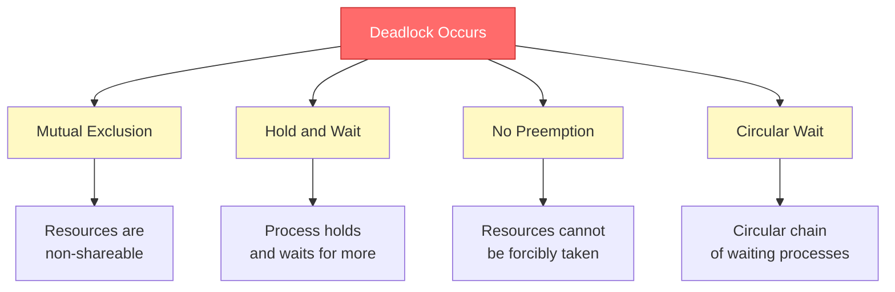
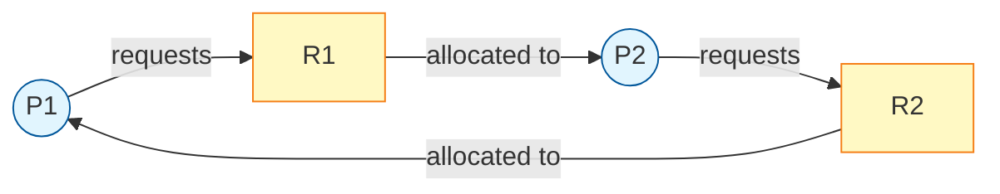
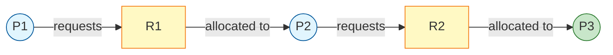
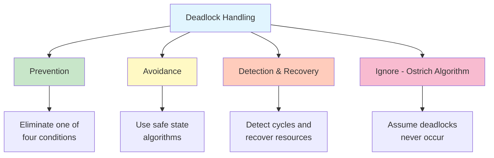
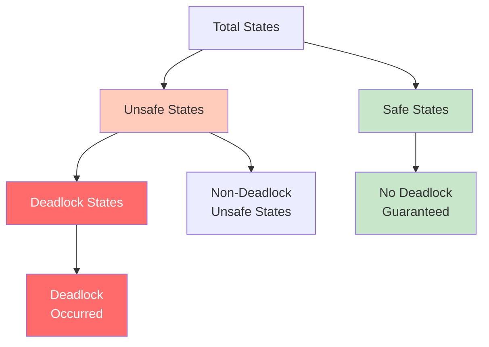
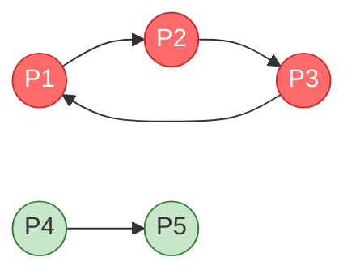

#operating-system #process #parallel-programming #thread #deadlock #resource-allocation

- A deadlock is a situation where a set of processes are blocked because each process is holding a resource and waiting for another resource acquired by another process.
- <mark class="hltr-yellow">No process in the deadlock can proceed</mark> - all processes wait indefinitely.

# Definition
- A set of processes $\{P_1, P_2, \ldots, P_n\}$ is in a deadlock state when <mark class="hltr-yellow">every process in the set is waiting for an event that can only be caused by another process in the set</mark>.
- The event is typically resource release.
- Processes cannot make progress, cannot release resources, and cannot be awakened.

# Necessary Conditions
- Deadlock can arise if and only if all four conditions hold simultaneously.
- Known as the <mark class="hltr-yellow">Coffman conditions</mark>.

## Mutual Exclusion
- At least one resource must be held in a non-shareable mode.
- <mark class="hltr-yellow">Only one process can use the resource at a time</mark>.
- If another process requests the resource, it must wait until the resource is released.

## Hold and Wait
- A process must be holding at least one resource.
- The process is waiting to acquire additional resources held by other processes.
- <mark class="hltr-yellow">Processes hold resources while waiting for others</mark>.

## No Preemption
- Resources cannot be forcibly taken from a process.
- <mark class="hltr-yellow">A resource can only be released voluntarily by the process holding it</mark>.
- The process must release the resource after completing its task.

## Circular Wait
- A circular chain of processes exists.
- Each process in the chain is waiting for a resource held by the next process.
- Formally: $P_0 \to P_1 \to P_2 \to \cdots \to P_n \to P_0$
- <mark class="hltr-yellow">The waiting chain forms a cycle</mark>.

## Deadlock Conditions Visualization


# Resource Allocation Graph
- Directed graph representing the state of resource allocation.
- Used to detect deadlocks in systems.

## Components
### Vertices
- **Process vertices** $P = \{P_1, P_2, \ldots, P_n\}$ - Set of all processes in the system.
- **Resource vertices** $R = \{R_1, R_2, \ldots, R_m\}$ - Set of all resource types in the system.

### Edges
- **Request edge** $P_i \to R_j$ - Process $P_i$ has requested resource $R_j$ and is waiting.
- **Assignment edge** $R_j \to P_i$ - Resource $R_j$ is currently allocated to process $P_i$.

## Resource Allocation Graph Examples
### Deadlock Example


**Analysis**: Circular wait exists: $P_1 \to R_1 \to P_2 \to R_2 \to P_1$. System is deadlocked.

### No Deadlock Example


**Analysis**: No cycle exists. Process $P_3$ can complete and release $R_2$, allowing $P_2$ to proceed.

## Cycle Detection
- **If graph contains no cycles** $\implies$ no deadlock.
- **If graph contains a cycle**:
	- If only one instance of each resource type $\implies$ deadlock exists.
	- If multiple instances $\implies$ deadlock may exist (further analysis required).

# Deadlock Handling Strategies
## Strategy Overview


## Deadlock Prevention
- Ensure at least one of the four necessary conditions cannot hold.
- <mark class="hltr-yellow">Prevent deadlock by design</mark>.

### Break Mutual Exclusion
- Make resources shareable when possible.
- Not feasible for inherently non-shareable resources (e.g., printers, mutex locks).

### Break Hold and Wait
- **Protocol 1**: Process must request all resources before execution.
	- Allocate all resources at once or none.
	- Low resource utilization - resources held but not used.
- **Protocol 2**: Process releases all held resources before requesting new ones.
	- May lead to starvation.

### Break No Preemption
- If a process requests an unavailable resource:
	- Preempt resources currently held by the process.
	- Add preempted resources to the list of resources the process is waiting for.
	- Restart the process only when it can regain old and new resources.
- Applicable to resources whose state can be saved and restored (CPU registers, memory).
- Not applicable to mutex locks and semaphores.

### Break Circular Wait
- Impose total ordering on resource types.
- Each resource type assigned a unique integer: $R_1, R_2, \ldots, R_m$ with order $<$.
- <mark class="hltr-yellow">Process must request resources in increasing order</mark>.
- Formally: If process holds $R_i$, it can only request $R_j$ where $j > i$.

## Deadlock Avoidance
- System has additional information about resource requests.
- <mark class="hltr-yellow">Dynamically examine resource allocation state to ensure circular wait cannot occur</mark>.
- Uses **safe state** algorithm.

### Safe State
- A state is safe if the system can allocate resources to each process in some order and avoid deadlock.
- Formally: A sequence $\langle P_1, P_2, \ldots, P_n \rangle$ is safe if for each $P_i$:
	- Resources that $P_i$ can still request can be satisfied by currently available resources plus resources held by all $P_j$ where $j < i$.

### Unsafe State
- Not all unsafe states are deadlocks.
- Deadlock is a subset of unsafe states.
- <mark class="hltr-yellow">Safe state guarantees no deadlock; unsafe state may lead to deadlock</mark>.



### Banker's Algorithm
- Deadlock avoidance algorithm for multiple resource instances.
- When a process requests resources, system determines if allocation leaves system in safe state.
- <mark class="hltr-yellow">Request granted only if resulting state is safe</mark>.

#### Data Structures
Let $n$ = number of processes, $m$ = number of resource types.

- **Available**: Vector of length $m$.
	- $\text{Available}[j] = k$ means $k$ instances of resource $R_j$ are available.
- **Max**: $n \times m$ matrix.
	- $\text{Max}[i][j] = k$ means process $P_i$ may request at most $k$ instances of resource $R_j$.
- **Allocation**: $n \times m$ matrix.
	- $\text{Allocation}[i][j] = k$ means process $P_i$ currently holds $k$ instances of resource $R_j$.
- **Need**: $n \times m$ matrix.
	- $\text{Need}[i][j] = k$ means process $P_i$ may need $k$ more instances of resource $R_j$.
	- $\text{Need}[i][j] = \text{Max}[i][j] - \text{Allocation}[i][j]$

#### Safety Algorithm
```
1. Let Work = Available and Finish[i] = false for all i
2. Find an index i such that:
   - Finish[i] = false
   - Need[i] ≤ Work
   If no such i exists, go to step 4
3. Work = Work + Allocation[i]
   Finish[i] = true
   Go to step 2
4. If Finish[i] = true for all i, the system is in a safe state
```

#### Resource Request Algorithm
For process $P_i$ with request $\text{Request}_i$:

```
1. If Request[i] ≤ Need[i], go to step 2; else error
2. If Request[i] ≤ Available, go to step 3; else P[i] waits
3. Pretend to allocate:
   Available = Available - Request[i]
   Allocation[i] = Allocation[i] + Request[i]
   Need[i] = Need[i] - Request[i]
4. Run Safety Algorithm:
   - If safe, grant request
   - If unsafe, restore old state and P[i] waits
```

## Deadlock Detection
- System allows deadlocks to occur.
- Detection algorithm periodically invoked to examine system state.
- <mark class="hltr-yellow">Detect cycles in resource allocation graph</mark>.

### Single Instance Detection
- Use wait-for graph (variant of resource allocation graph).
- Remove resource nodes; draw edge $P_i \to P_j$ if $P_i$ is waiting for resource held by $P_j$.
- Deadlock exists if and only if wait-for graph contains a cycle.

### Wait-For Graph Example


**Analysis**: Cycle $P_1 \to P_2 \to P_3 \to P_1$ exists. Processes $P_1, P_2, P_3$ are deadlocked.
## Deadlock Recovery
- Once deadlock detected, system must recover.
### Process Termination
#### Abort All Deadlocked Processes
- Breaks deadlock cycle.
- <mark class="hltr-yellow">High cost</mark> - discards partial computations.
#### Abort One Process at a Time
- Invoke detection algorithm after each abortion.
- Significant overhead.
- Choose victim based on:
	- Process priority
	- Computation time and remaining time
	- Resources held and needed
	- Number of processes to terminate
### Resource Preemption
1. **Selecting a victim**: Minimize cost.
2. **Rollback**: Return process to safe state, restart from that state.
3. **Starvation**: Ensure same process not always picked as victim.
# Implementation Examples
## Deadlock Scenario in C
```c title='Deadlock example with two mutexes'
#include <pthread.h>
#include <stdio.h>
#include <unistd.h>

pthread_mutex_t mutex1 = PTHREAD_MUTEX_INITIALIZER;
pthread_mutex_t mutex2 = PTHREAD_MUTEX_INITIALIZER;

/* Thread 1 locks mutex1 then mutex2 */
void* thread1_func(void* arg) {
    pthread_mutex_lock(&mutex1);
    printf("Thread 1: Locked mutex1\n");
    sleep(1);  // Simulate work

    printf("Thread 1: Waiting for mutex2\n");
    pthread_mutex_lock(&mutex2);  // Deadlock occurs here
    printf("Thread 1: Locked mutex2\n");

    pthread_mutex_unlock(&mutex2);
    pthread_mutex_unlock(&mutex1);
    return NULL;
}

/* Thread 2 locks mutex2 then mutex1 */
void* thread2_func(void* arg) {
    pthread_mutex_lock(&mutex2);
    printf("Thread 2: Locked mutex2\n");
    sleep(1);  // Simulate work

    printf("Thread 2: Waiting for mutex1\n");
    pthread_mutex_lock(&mutex1);  // Deadlock occurs here
    printf("Thread 2: Locked mutex1\n");

    pthread_mutex_unlock(&mutex1);
    pthread_mutex_unlock(&mutex2);
    return NULL;
}
```

**Analysis**: Thread 1 holds `mutex1` and waits for `mutex2`. Thread 2 holds `mutex2` and waits for `mutex1`. Circular wait creates deadlock.

## Deadlock Prevention - Resource Ordering
```c title='Deadlock prevention using resource ordering' hl=10-11,22-23
#include <pthread.h>
#include <stdio.h>
#include <unistd.h>

pthread_mutex_t mutex1 = PTHREAD_MUTEX_INITIALIZER;
pthread_mutex_t mutex2 = PTHREAD_MUTEX_INITIALIZER;

/* Thread 1 locks in order: mutex1, mutex2 */
void* thread1_func(void* arg) {
    // Always lock mutex1 before mutex2
    pthread_mutex_lock(&mutex1);
    printf("Thread 1: Locked mutex1\n");
    sleep(1);

    pthread_mutex_lock(&mutex2);
    printf("Thread 1: Locked mutex2\n");

    pthread_mutex_unlock(&mutex2);
    pthread_mutex_unlock(&mutex1);
    return NULL;
}

/* Thread 2 locks in SAME order: mutex1, mutex2 */
void* thread2_func(void* arg) {
    // Same locking order prevents circular wait
    pthread_mutex_lock(&mutex1);
    printf("Thread 2: Locked mutex1\n");
    sleep(1);

    pthread_mutex_lock(&mutex2);
    printf("Thread 2: Locked mutex2\n");

    pthread_mutex_unlock(&mutex2);
    pthread_mutex_unlock(&mutex1);
    return NULL;
}
```

**Prevention**: Both threads acquire locks in the same order. Breaks circular wait condition.

## Deadlock Avoidance - Try Lock
```c title='Deadlock avoidance using try-lock' hl=14-19
#include <pthread.h>
#include <stdio.h>
#include <unistd.h>

pthread_mutex_t mutex1 = PTHREAD_MUTEX_INITIALIZER;
pthread_mutex_t mutex2 = PTHREAD_MUTEX_INITIALIZER;

void* thread_func(void* arg) {
    int retry = 0;

    while (1) {
        pthread_mutex_lock(&mutex1);

        // Try to acquire mutex2; if fails, release mutex1
        if (pthread_mutex_trylock(&mutex2) != 0) {
            pthread_mutex_unlock(&mutex1);
            printf("Thread: Failed to acquire mutex2, retrying...\n");
            usleep(100 * (++retry));  // Backoff
            continue;
        }

        // Successfully acquired both locks
        printf("Thread: Acquired both locks\n");

        pthread_mutex_unlock(&mutex2);
        pthread_mutex_unlock(&mutex1);
        break;
    }
    return NULL;
}
```

**Avoidance**: Uses `pthread_mutex_trylock()` to avoid blocking. If second lock unavailable, release first lock and retry.

# Related Concepts
## Livelock
- Processes actively change states but make no progress.
- Similar to deadlock but <mark class="hltr-yellow">processes are not blocked - they continuously respond to each other</mark>.
- Example: Two people meeting in a narrow hallway; both step aside in the same direction repeatedly.

### Livelock vs Deadlock
| Aspect | Deadlock | Livelock |
|--------|----------|----------|
| State | Blocked, waiting | Active, changing states |
| Progress | No progress | No progress despite activity |
| Resource Usage | Hold and wait | Repeated acquire/release |
| CPU Usage | Minimal | High - busy waiting |

## Starvation
- A process waits indefinitely for resources.
- <mark class="hltr-yellow">Resources continuously allocated to other processes</mark>.
- Differs from deadlock: not part of circular wait.
- Solution: Aging - increase priority of waiting processes over time.

## Priority Inversion
- Low-priority process holds resource needed by high-priority process.
- Medium-priority processes preempt low-priority process.
- <mark class="hltr-yellow">High-priority process blocked by medium-priority processes</mark>.
- Solution: Priority inheritance protocol.

# Practical Considerations
## Real-World Approaches
- **Linux**: Primarily ignores deadlocks; relies on careful programming.
- **Databases**: Use deadlock detection; abort one transaction in deadlock.
- **Java**: Provides no deadlock prevention; programmer responsibility.
- **Real-time systems**: Often use deadlock prevention through resource ordering.

## Detection Frequency
- Trade-off between overhead and deadlock duration.
- **Frequent detection**: Low deadlock duration, high overhead.
- **Infrequent detection**: High deadlock duration, low overhead.
- Invoke when CPU utilization drops below threshold.

***
# References
1. Operating System Concepts - Abraham Silberschatz - 10th - 2018 - Pearson Publisher.
	1. Chapter 8: Deadlocks.
		1. Section 8.1: System Model.
		2. Section 8.2: Deadlock in Multithreaded Applications.
		3. Section 8.3: Deadlock Characterization.
		4. Section 8.4: Methods for Handling Deadlocks.
		5. Section 8.5: Deadlock Prevention.
		6. Section 8.6: Deadlock Avoidance.
		7. Section 8.7: Deadlock Detection.
		8. Section 8.8: Recovery from Deadlock.
2. Modern Operating Systems - Andrew S. Tanenbaum - 4th Edition - 2014 - Pearson.
	1. Chapter 6: Deadlocks.
3. https://en.wikipedia.org/wiki/Deadlock
4. https://stackoverflow.com/questions/1036364/good-example-of-livelock
