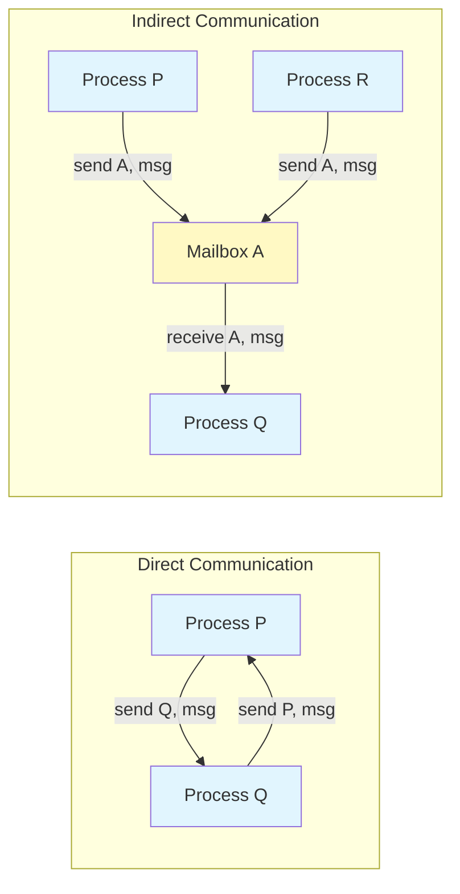
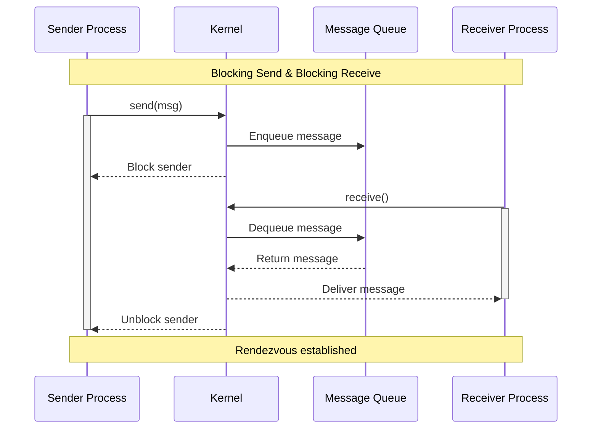
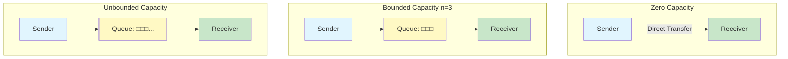

#operating-system #ipc #process #message-passing #distributed-systems

- Message passing provides a mechanism for processes to communicate and synchronize their actions without sharing the same address space.
- Processes communicate by exchanging messages through the operating system kernel.
# Definition
- Message passing is an IPC mechanism where processes exchange data by sending and receiving messages rather than sharing memory regions.
- The operating system provides two fundamental operations:
	- `send(message)` - Send a message to a destination
	- `receive(message)` - Receive a message from a source
# Communication Models
## Direct Communication
- Processes explicitly name each other in communication operations.
- <mark class="hltr-yellow">Each process must explicitly name the recipient or sender</mark>.
### Symmetric Addressing
- Both sender and receiver name each other.
- Primitives:
	- `send(P, message)` - Send message to process $P$
	- `receive(Q, message)` - Receive message from process $Q$
### Asymmetric Addressing
- Only sender names the recipient; receiver accepts from any process.
- Primitives:
	- `send(P, message)` - Send message to process $P$
	- `receive(id, message)` - Receive message from any process; `id` is set to sender's identifier
### Properties
- Links are established automatically between communicating processes.
- A link is associated with exactly one pair of processes.
- Between each pair, exactly one link exists.
- The link may be unidirectional or bidirectional.
## Indirect Communication
- Messages are sent to and received from mailboxes (also called ports).
- A mailbox is an object into which messages can be placed and removed.
- <mark class="hltr-yellow">Processes communicate indirectly through mailboxes</mark>.

### Primitives
- `send(A, message)` - Send message to mailbox $A$
- `receive(A, message)` - Receive message from mailbox $A$
### Properties
- A link is established only if both processes share a common mailbox.
- A link may be associated with more than two processes.
- Between each pair of processes, multiple links may exist, each corresponding to one mailbox.
### Mailbox Ownership
#### Process-Owned Mailbox
- The mailbox is part of the process address space.
- Only the owner can receive messages; other processes can only send.
- When the owner terminates, the mailbox disappears.
#### System-Owned Mailbox
- The mailbox is owned by the operating system.
- The OS provides mechanisms to:
	- Create a new mailbox
	- Send and receive messages through the mailbox
	- Delete a mailbox
## Comparison


# Synchronization
## Blocking (Synchronous)
- <mark class="hltr-yellow">Blocking send</mark>: The sending process is blocked until the message is received by the receiving process or mailbox.
- <mark class="hltr-yellow">Blocking receive</mark>: The receiving process is blocked until a message is available.
## Non-Blocking (Asynchronous)
- <mark class="hltr-yellow">Non-blocking send</mark>: The sending process sends the message and resumes operation immediately.
- <mark class="hltr-yellow">Non-blocking receive</mark>: The receiving process retrieves either a valid message or null.
## Message Passing Flow


# Buffering
- Messages exchanged between processes reside in a temporary queue.
- Three implementation strategies exist:
## Zero Capacity
- Queue has maximum length $0$.
- No messages can wait in the queue.
- <mark class="hltr-yellow">Sender must block until receiver receives the message</mark>.
- Also called message system with no buffering.
## Bounded Capacity
- Queue has finite length $n$.
- At most $n$ messages can reside in the queue.
- If queue is not full, sender places message and continues execution.
- If queue is full, sender must block until space becomes available.
## Unbounded Capacity
- Queue has potentially infinite length.
- Sender never blocks.
- Receiver blocks only if queue is empty.


# Message Structure
## Fixed-Size Messages
- System-level implementation is straightforward.
- Physical-level implementation is simple.
- Programming task is more difficult due to size constraints.
## Variable-Size Messages
- System-level implementation is complex.
- Physical-level implementation requires dynamic buffer management.
- Programming task is simpler and more natural.
# Implementation
## Message Structure
```c title='Message structure definition'
#include <sys/types.h>

#define MAX_MESSAGE_SIZE 256

/* Message structure */
struct message {
    pid_t sender_pid;           // Process ID of sender
    pid_t receiver_pid;         // Process ID of receiver
    int message_id;             // Unique message identifier
    size_t size;                // Size of message data
    char data[MAX_MESSAGE_SIZE]; // Message payload
};
```

## Message Queue Structure
```c title='Message queue structure'
#define QUEUE_CAPACITY 10

/* Message queue node */
struct queue_node {
    struct message msg;
    struct queue_node *next;
};

/* Message queue */
struct message_queue {
    struct queue_node *head;    // Front of queue
    struct queue_node *tail;    // Rear of queue
    int count;                  // Current number of messages
    int capacity;               // Maximum capacity
};
```

## Blocking Send
```c title='Blocking send implementation' hl=15-18
#include <stdio.h>
#include <stdlib.h>
#include <unistd.h>

/* Blocking send - waits until message is delivered */
int blocking_send(struct message_queue *queue, struct message *msg) {
    // Allocate new queue node
    struct queue_node *new_node =
        (struct queue_node *)malloc(sizeof(struct queue_node));

    if (new_node == NULL) {
        return -1; // Allocation failed
    }

    // Block while queue is full (bounded capacity)
    while (queue->count >= queue->capacity) {
        sleep(1); // Wait for space - simplified blocking
    }

    // Copy message to queue
    new_node->msg = *msg;
    new_node->next = NULL;

    // Insert at tail
    if (queue->tail == NULL) {
        queue->head = queue->tail = new_node;
    } else {
        queue->tail->next = new_node;
        queue->tail = new_node;
    }

    queue->count++;
    return 0; // Success
}
```

## Blocking Receive
```c title='Blocking receive implementation' hl=6-9
#include <stdio.h>
#include <stdlib.h>

/* Blocking receive - waits until message is available */
int blocking_receive(struct message_queue *queue, struct message *msg) {
    // Block while queue is empty
    while (queue->count == 0) {
        sleep(1); // Wait for message - simplified blocking
    }

    // Remove from head
    struct queue_node *node = queue->head;
    *msg = node->msg;

    queue->head = node->next;
    if (queue->head == NULL) {
        queue->tail = NULL;
    }

    free(node);
    queue->count--;
    return 0; // Success
}
```

## Non-Blocking Send
```c title='Non-blocking send implementation' hl=6-9
/* Non-blocking send - returns immediately */
int nonblocking_send(struct message_queue *queue, struct message *msg) {
    struct queue_node *new_node =
        (struct queue_node *)malloc(sizeof(struct queue_node));

    // Return error if queue is full
    if (queue->count >= queue->capacity) {
        return -1; // Queue full, message not sent
    }

    if (new_node == NULL) {
        return -1; // Allocation failed
    }

    // Copy message to queue
    new_node->msg = *msg;
    new_node->next = NULL;

    // Insert at tail
    if (queue->tail == NULL) {
        queue->head = queue->tail = new_node;
    } else {
        queue->tail->next = new_node;
        queue->tail = new_node;
    }

    queue->count++;
    return 0; // Success
}
```

## Non-Blocking Receive
```c title='Non-blocking receive implementation' hl=4-7
/* Non-blocking receive - returns immediately */
int nonblocking_receive(struct message_queue *queue, struct message *msg) {
    // Return error if queue is empty
    if (queue->count == 0) {
        return -1; // No message available
    }

    // Remove from head
    struct queue_node *node = queue->head;
    *msg = node->msg;

    queue->head = node->next;
    if (queue->head == NULL) {
        queue->tail = NULL;
    }

    free(node);
    queue->count--;
    return 0; // Success
}
```

## Producer-Consumer Example
```c title='Producer-Consumer using message passing'
#include <stdio.h>
#include <stdlib.h>
#include <unistd.h>
#include <sys/types.h>
#include <string.h>

void producer(struct message_queue *queue) {
    struct message msg;
    int i;

    for (i = 0; i < 5; i++) {
        // Prepare message
        msg.sender_pid = getpid();
        msg.message_id = i;
        msg.size = snprintf(msg.data, MAX_MESSAGE_SIZE,
                           "Item %d from producer", i);

        printf("Producer: Sending message %d\n", i);

        // Send message (blocking)
        blocking_send(queue, &msg);

        sleep(1); // Simulate production time
    }
}

void consumer(struct message_queue *queue) {
    struct message msg;
    int i;

    for (i = 0; i < 5; i++) {
        // Receive message (blocking)
        blocking_receive(queue, &msg);

        printf("Consumer: Received message %d: %s\n",
               msg.message_id, msg.data);

        sleep(2); // Simulate consumption time
    }
}
```

# Advantages
1. <mark class="hltr-yellow">No shared memory required</mark> - Suitable for distributed systems where processes do not share address space.
2. <mark class="hltr-yellow">Synchronization support</mark> - Blocking operations provide implicit synchronization.
3. <mark class="hltr-yellow">Portability</mark> - Easier to implement across different architectures and networks.
4. <mark class="hltr-yellow">Safety</mark> - Processes cannot interfere with each other's memory.
# Disadvantages
1. <mark class="hltr-yellow">Overhead</mark> - Message copying and kernel involvement introduce overhead.
2. <mark class="hltr-yellow">Complexity</mark> - Managing message queues and synchronization requires careful design.
3. <mark class="hltr-yellow">Performance</mark> - Slower than shared memory for local communication due to copying overhead.
# Use Cases
- **Distributed systems** where processes run on different machines.
- **Microservices architecture** for inter-service communication.
- **Client-server systems** for request-response patterns.
- **Real-time systems** requiring predictable communication patterns.
- **Systems requiring fault isolation** between processes.

***
# References
1. Operating System Concepts - Abraham Silberschatz - 10th - 2018 - Pearson Publisher.
	1. Chapter 3: Processes.
		1. Section 3.4: Interprocess Communication.
		2. Section 3.5: IPC in Message-Passing Systems.
2. Modern Operating Systems - Andrew S. Tanenbaum - 4th Edition - 2014 - Pearson.
	1. Chapter 2: Processes and Threads.
		1. Section 2.3: Interprocess Communication.
3. https://en.wikipedia.org/wiki/Message_passing
