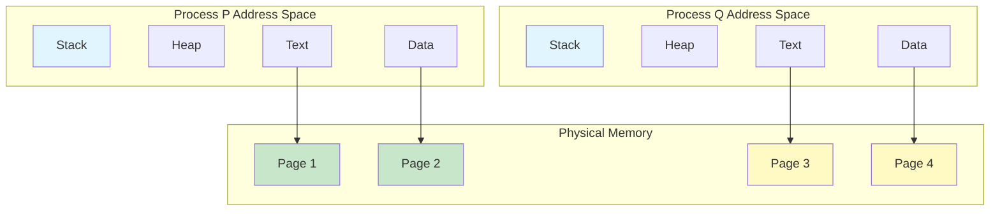
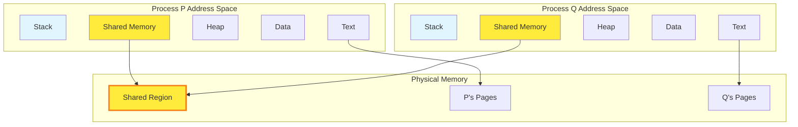
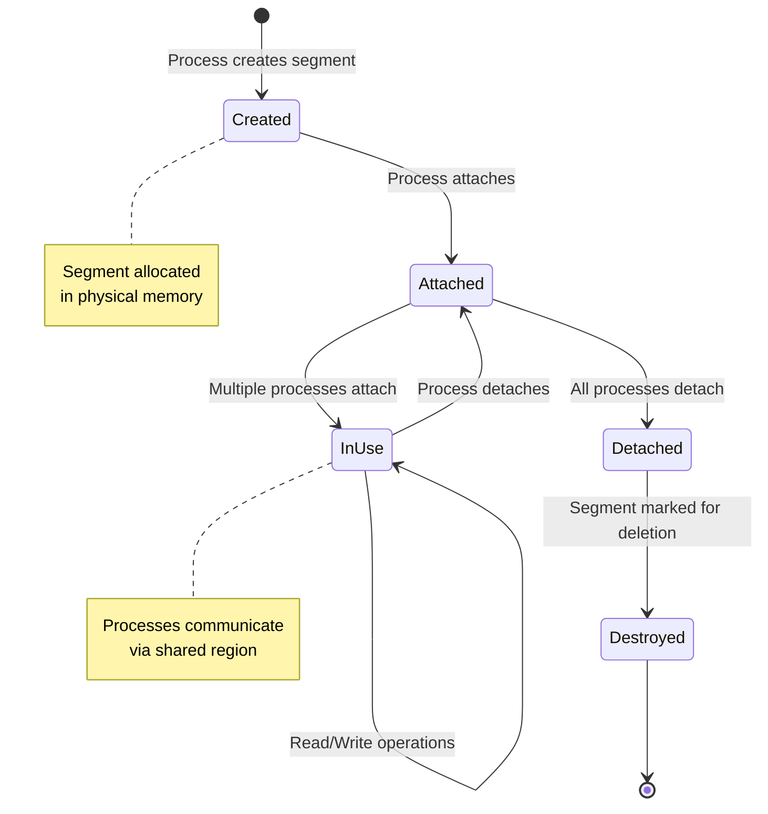
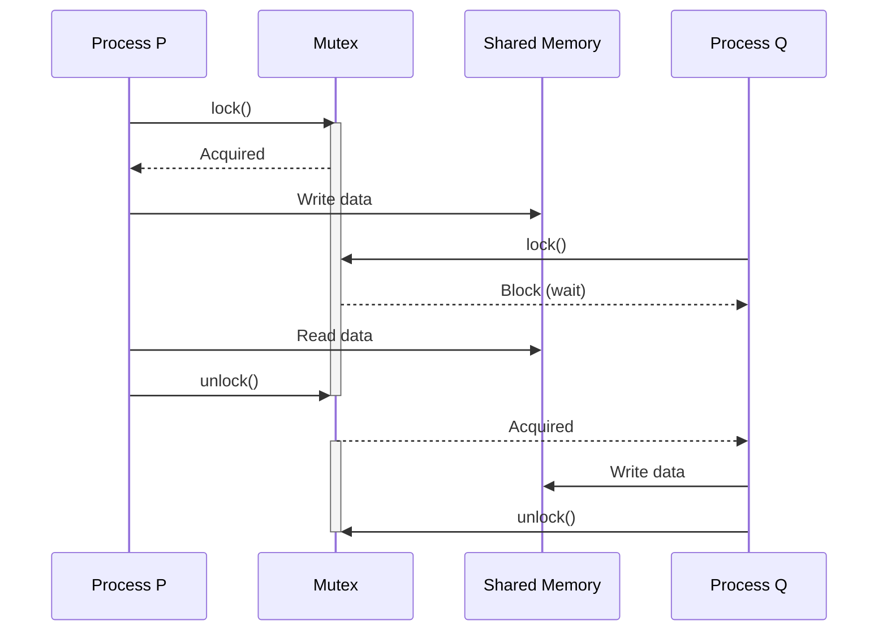

#operating-system #ipc #process #shared-memory #concurrent-programming

- Shared memory allows multiple processes to access the same region of memory.
- Processes exchange information by reading from and writing to the shared memory region.
# Definition
- Shared memory is an IPC mechanism where processes communicate by accessing a common memory region mapped into their address spaces.
- <mark class="hltr-yellow">The operating system establishes a shared memory segment that multiple processes can attach to their address space</mark>.
# Characteristics
## Memory Sharing
- Processes share a region of physical memory.
- Each process maps the shared region into its own virtual address space.
- <mark class="hltr-yellow">No kernel intervention required for data exchange after setup</mark>.
## Synchronization Requirement
- Shared memory itself provides no synchronization.
- <mark class="hltr-yellow">Processes must use synchronization primitives</mark> (semaphores, mutexes, monitors) to coordinate access.
- Without synchronization, race conditions and data inconsistency occur.
## Performance
- Fastest IPC mechanism for local communication.
- <mark class="hltr-yellow">No data copying between processes</mark> - processes read/write directly to shared region.
- Eliminates kernel overhead for each communication operation.
# Memory Models
## Process Address Space Without Sharing


## Process Address Space With Shared Memory


# Operations
## Create Shared Memory Segment
- Allocate a region of physical memory.
- Return a segment identifier for subsequent operations.
- Specify size and access permissions.
## Attach Shared Memory
- Map the shared segment into the process's address space.
- Return a pointer to the shared region.
- Multiple processes can attach the same segment.
## Detach Shared Memory
- Remove the shared segment from the process's address space.
- Does not destroy the segment; other processes can still access it.
## Destroy Shared Memory
- Remove the shared segment from the system.
- Segment becomes inaccessible to all processes.
- Usually performed by the last process using the segment.

## Shared Memory Lifecycle


# Synchronization Primitives
## Race Condition Problem
- Multiple processes accessing shared memory without coordination.
- Results in unpredictable behavior and data corruption.

### Example Scenario
Let shared variable $x = 5$ initially.

| Time | Process P | Process Q | $x$ Value |
|------|-----------|-----------|-----------|
| $t_0$ | Read $x$ (gets 5) | - | 5 |
| $t_1$ | - | Read $x$ (gets 5) | 5 |
| $t_2$ | Compute $x+1=6$ | - | 5 |
| $t_3$ | - | Compute $x \times 2 = 10$ | 5 |
| $t_4$ | Write $x=6$ | - | 6 |
| $t_5$ | - | Write $x=10$ | 10 |

Expected result if P executes first: $(5+1) \times 2 = 12$
Expected result if Q executes first: $(5 \times 2) + 1 = 11$
Actual result: $10$ (incorrect due to race condition)

## Mutex (Mutual Exclusion)
- Ensures only one process accesses shared memory at a time.
- Critical section protected by lock/unlock operations.

### Critical Section Flow


## Semaphore
- Generalized synchronization primitive.
- Allows counting access to shared resources.
- Binary semaphore (0 or 1) equivalent to mutex.
- Counting semaphore allows $n$ concurrent accesses.
# Implementation
## Shared Memory Structure
```c title='Shared memory segment structure'
#include <sys/types.h>
#include <sys/ipc.h>
#include <sys/shm.h>
#include <semaphore.h>

#define SHM_SIZE 1024  // Shared memory size in bytes

/* Shared data structure */
struct shared_data {
    sem_t mutex;        // Semaphore for synchronization
    int counter;        // Shared counter
    char buffer[256];   // Shared buffer
};
```
## Create and Attach Shared Memory
```c title='Create and attach shared memory' hl=6-9,16-19
#include <stdio.h>
#include <stdlib.h>
#include <sys/shm.h>

/* Create shared memory segment */
int create_shared_memory(key_t key, size_t size) {
    int shmid = shmget(key, size, IPC_CREAT | 0666);
    if (shmid < 0) {
        perror("shmget failed");
        return -1;
    }
    return shmid;
}

/* Attach shared memory to process address space */
void* attach_shared_memory(int shmid) {
    void *shm_ptr = shmat(shmid, NULL, 0);
    if (shm_ptr == (void *)-1) {
        perror("shmat failed");
        return NULL;
    }
    return shm_ptr;
}
```

## Detach and Destroy Shared Memory
```c title='Detach and destroy shared memory' hl=3-5,10-12
#include <sys/shm.h>

/* Detach shared memory from process */
int detach_shared_memory(void *shm_ptr) {
    return shmdt(shm_ptr);
}

/* Destroy shared memory segment */
int destroy_shared_memory(int shmid) {
    return shmctl(shmid, IPC_RMID, NULL);
}
```

## Producer-Consumer Without Synchronization
```c title='Producer-Consumer without synchronization (incorrect)'
#include <stdio.h>
#include <unistd.h>

/* UNSAFE: Race condition exists */
void producer(struct shared_data *shm) {
    int i;
    for (i = 0; i < 10; i++) {
        // Race condition: multiple producers may interfere
        shm->counter++;
        printf("Producer: counter = %d\n", shm->counter);
        sleep(1);
    }
}

void consumer(struct shared_data *shm) {
    int i;
    for (i = 0; i < 10; i++) {
        // Race condition: reading inconsistent data
        printf("Consumer: counter = %d\n", shm->counter);
        shm->counter--;
        sleep(1);
    }
}
```

## Producer-Consumer With Mutex
```c title='Producer-Consumer with mutex synchronization' hl=7-8,12-13,20-21,25-26
#include <stdio.h>
#include <semaphore.h>
#include <unistd.h>

/* SAFE: Mutex ensures mutual exclusion */
void producer_safe(struct shared_data *shm) {
    int i;
    for (i = 0; i < 10; i++) {
        // Acquire lock before accessing shared data
        sem_wait(&shm->mutex);

        shm->counter++;
        printf("Producer: counter = %d\n", shm->counter);

        // Release lock after modification
        sem_post(&shm->mutex);
        sleep(1);
    }
}

void consumer_safe(struct shared_data *shm) {
    int i;
    for (i = 0; i < 10; i++) {
        // Acquire lock
        sem_wait(&shm->mutex);

        printf("Consumer: counter = %d\n", shm->counter);
        shm->counter--;

        // Release lock
        sem_post(&shm->mutex);
        sleep(1);
    }
}
```

## Complete Example
```c title='Complete shared memory example with synchronization'
#include <stdio.h>
#include <stdlib.h>
#include <unistd.h>
#include <sys/types.h>
#include <sys/ipc.h>
#include <sys/shm.h>
#include <semaphore.h>
#include <string.h>

#define SHM_KEY 1234
#define SHM_SIZE sizeof(struct shared_data)

struct shared_data {
    sem_t mutex;
    int counter;
    char message[256];
};

int main() {
    int shmid;
    struct shared_data *shm;
    pid_t pid;

    // Create shared memory segment
    shmid = shmget(SHM_KEY, SHM_SIZE, IPC_CREAT | 0666);
    if (shmid < 0) {
        perror("shmget failed");
        exit(1);
    }

    // Attach shared memory
    shm = (struct shared_data *)shmat(shmid, NULL, 0);
    if (shm == (void *)-1) {
        perror("shmat failed");
        exit(1);
    }

    // Initialize semaphore (must be in shared memory)
    sem_init(&shm->mutex, 1, 1);  // 1 = shared between processes
    shm->counter = 0;

    // Fork child process
    pid = fork();

    if (pid == 0) {
        // Child process - consumer
        int i;
        for (i = 0; i < 5; i++) {
            sem_wait(&shm->mutex);
            printf("Child reads: %d\n", shm->counter);
            sem_post(&shm->mutex);
            sleep(1);
        }
        shmdt(shm);
        exit(0);
    } else {
        // Parent process - producer
        int i;
        for (i = 0; i < 5; i++) {
            sem_wait(&shm->mutex);
            shm->counter++;
            printf("Parent writes: %d\n", shm->counter);
            sem_post(&shm->mutex);
            sleep(1);
        }

        // Wait for child
        wait(NULL);

        // Cleanup
        sem_destroy(&shm->mutex);
        shmdt(shm);
        shmctl(shmid, IPC_RMID, NULL);
    }

    return 0;
}
```

# Advantages
1. <mark class="hltr-yellow">High performance</mark> - Fastest IPC mechanism due to direct memory access without copying.
2. <mark class="hltr-yellow">Low overhead</mark> - No kernel involvement after initial setup for read/write operations.
3. <mark class="hltr-yellow">Large data transfer</mark> - Efficient for transferring large amounts of data between processes.
4. <mark class="hltr-yellow">Bidirectional communication</mark> - All processes can read and write to shared region.

# Disadvantages
1. <mark class="hltr-yellow">Complex synchronization</mark> - Requires explicit synchronization mechanisms to prevent race conditions.
2. <mark class="hltr-yellow">Limited to local systems</mark> - Cannot be used for distributed systems across different machines.
3. <mark class="hltr-yellow">Lack of built-in protection</mark> - Processes can corrupt shared data without proper synchronization.
4. <mark class="hltr-yellow">Difficult debugging</mark> - Race conditions and synchronization bugs are hard to reproduce and debug.

# Comparison with Message Passing
| Aspect | Shared Memory | Message Passing |
|--------|---------------|-----------------|
| Performance | Fast - direct access | Slower - copying overhead |
| Synchronization | Explicit (mutex, semaphore) | Implicit (blocking operations) |
| Complexity | Higher - manual sync required | Lower - OS handles details |
| Scope | Local processes only | Local and distributed |
| Data Size | Efficient for large data | Better for small messages |
| Safety | Risk of corruption | Safer - isolated buffers |

# Use Cases
- **High-performance computing** requiring frequent data exchange between processes.
- **Database systems** sharing buffer pools and cache between server processes.
- **Graphics rendering** where multiple processes access frame buffers.
- **Scientific simulations** with parallel computations on shared datasets.
- **Real-time systems** requiring deterministic low-latency communication.

***
# References
1. Operating System Concepts - Abraham Silberschatz - 10th - 2018 - Pearson Publisher.
	1. Chapter 3: Processes.
		1. Section 3.4: Interprocess Communication.
		2. Section 3.5: IPC in Shared-Memory Systems.
2. Modern Operating Systems - Andrew S. Tanenbaum - 4th Edition - 2014 - Pearson.
	1. Chapter 2: Processes and Threads.
		1. Section 2.3: Interprocess Communication.
3. https://en.wikipedia.org/wiki/Shared_memory
