#concurrency-control #operating-system #thread #process #process-synchronization #parallel-programming
#asynchronous-programming

- Concurrency control models provide architectural patterns for managing concurrent execution.
- Different models suit different types of problems and workloads.
# Task-Based Models
## Thread Pool (Parallel Workers)
- <mark class="hltr-yellow">Fixed pool of worker threads process tasks from a shared queue</mark>.
- Tasks are independent units of work.
- Workers continuously fetch and execute tasks until queue is empty.
### Architecture
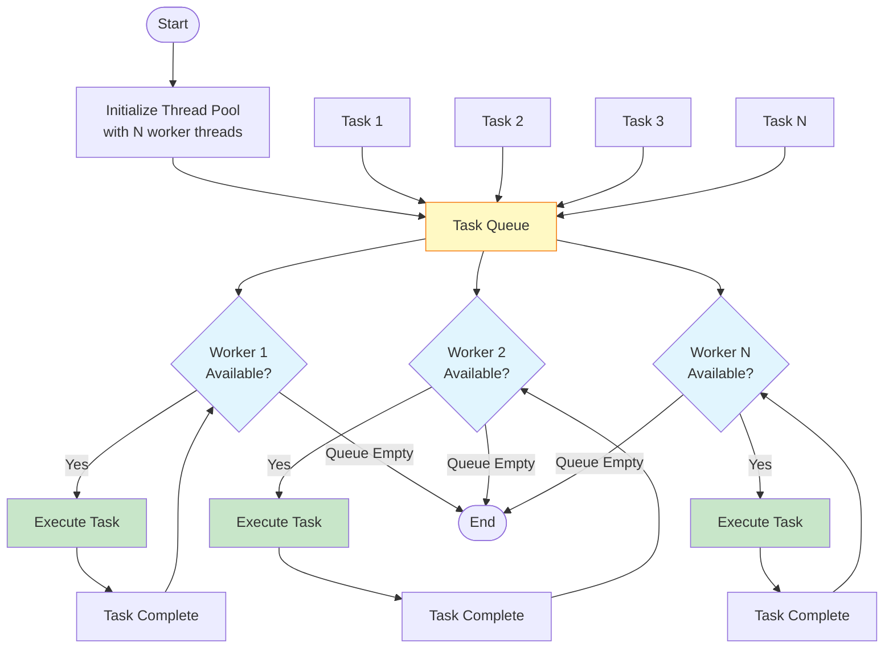

### Characteristics
- **Advantages**: Limits resource usage; reduces thread creation overhead; load balancing.
- **Disadvantages**: Queue contention; worker starvation; difficult to size pool correctly.
- **Use Cases**: Web servers, database connection pools, background job processing.
## Fork-Join
- <mark class="hltr-yellow">Divide problem into smaller subproblems recursively, solve in parallel, then combine results</mark>.
- Based on divide-and-conquer strategy.
- Work-stealing algorithm balances load among threads.
### Architecture
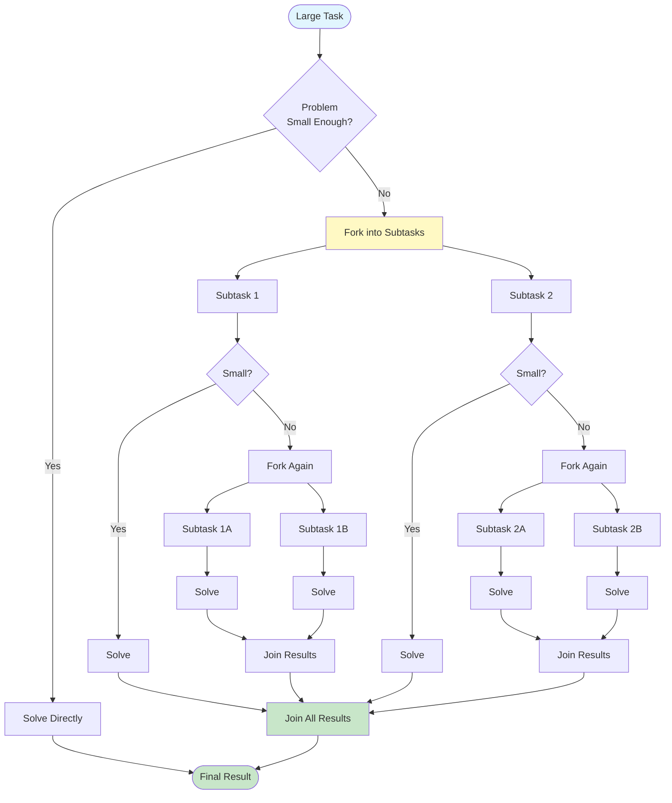

### Characteristics
- **Advantages**: Automatic load balancing; scales with available cores; recursive decomposition natural for some problems.
- **Disadvantages**: Overhead for small tasks; recursive overhead; requires problem decomposability.
- **Use Cases**: Sorting algorithms (merge sort, quick sort), tree traversal, parallel aggregation.
## Pipeline (Assembly Line)
- <mark class="hltr-yellow">Data flows through stages; each stage performs specific operation</mark>.
- Multiple data items processed simultaneously at different stages.
- Each stage typically has dedicated thread or thread pool.
### Architecture
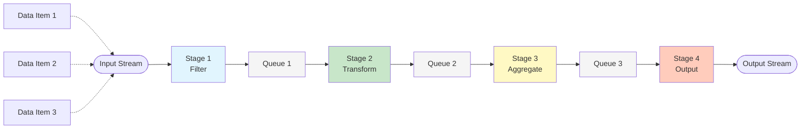

### Characteristics
- **Advantages**: Throughput optimization; natural for stream processing; stages can run at different speeds.
- **Disadvantages**: Pipeline stalls; backpressure handling; complex error handling.
- **Use Cases**: Data processing pipelines, video encoding, network packet processing.

# Message-Passing Models
## Actor Model
- <mark class="hltr-yellow">Actors are independent entities that communicate only via asynchronous messages</mark>.
- Each actor has private state and mailbox.
- Actors process one message at a time from their mailbox.

### Architecture
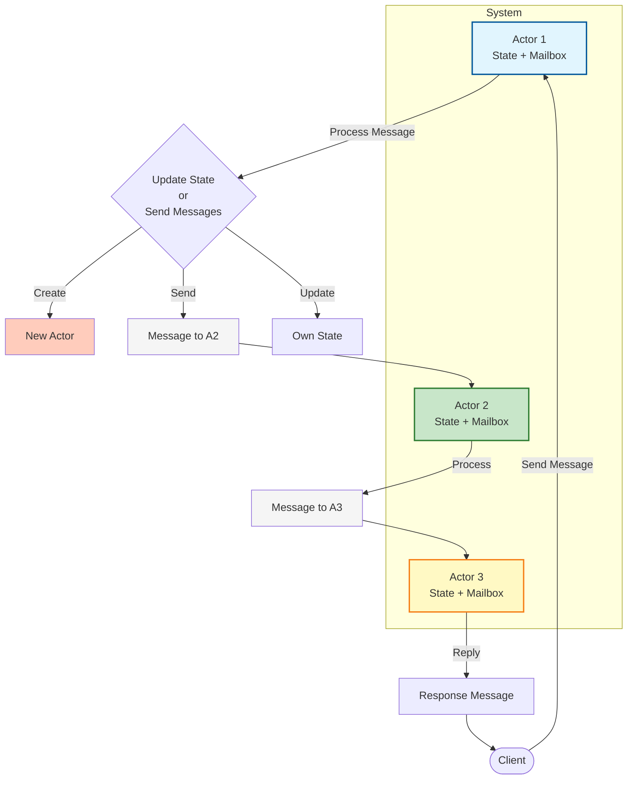

### Processing Flow
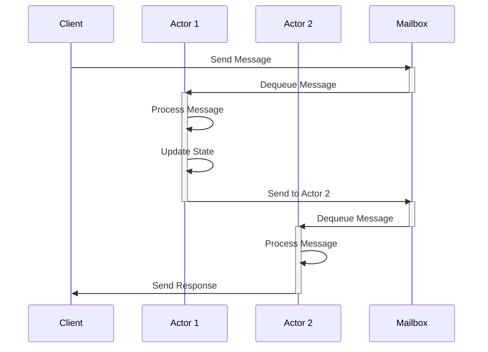

### Characteristics
- **Advantages**: No shared state; natural distribution; fault isolation; location transparency.
- **Disadvantages**: Message overhead; debugging difficulty; potential deadlocks with request-response.
- **Use Cases**: Distributed systems (Akka, Erlang), reactive applications, microservices.

## Communicating Sequential Processes (CSP)
- <mark class="hltr-yellow">Processes communicate through typed channels with synchronous or buffered message passing</mark>.
- Channels are first-class citizens.
- Focus on communication primitives rather than processes.
### Architecture
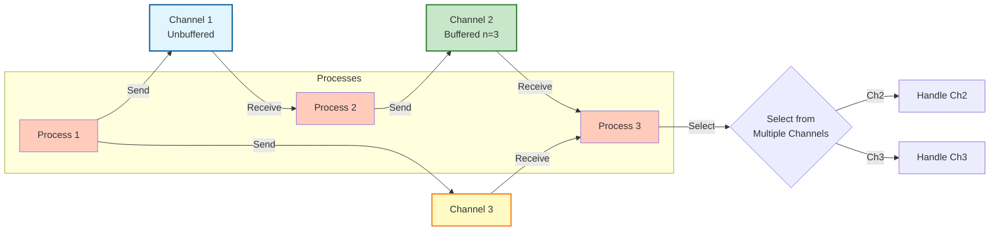

### Characteristics
- **Advantages**: Composable; type-safe; explicit communication; supports select operation.
- **Disadvantages**: Potential deadlocks; channel management overhead; memory for buffered channels.
- **Use Cases**: Go goroutines, concurrent pipelines, coordinating concurrent operations.
# Data-Oriented Models
## Data Parallelism
- <mark class="hltr-yellow">Same operation applied to multiple data elements simultaneously</mark>.
- Data divided among processing units.
- SIMD (Single Instruction, Multiple Data) style parallelism.
### Architecture
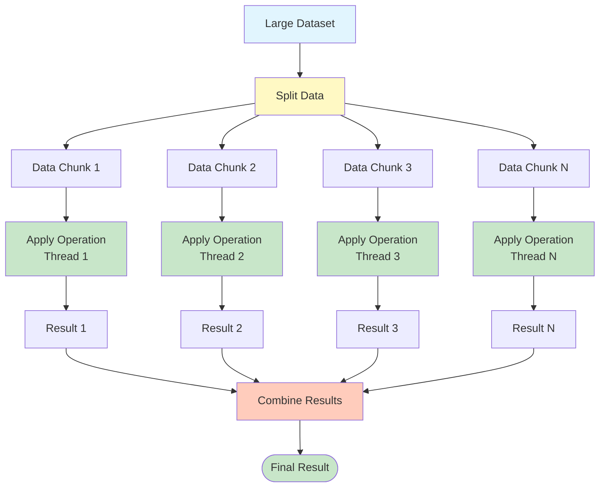

### Characteristics
- **Advantages**: Simple model; high performance for homogeneous operations; GPU-friendly.
- **Disadvantages**: Requires uniform operations; load imbalance if operations vary; limited applicability.
- **Use Cases**: Image processing, matrix operations, scientific computing, GPGPU.

## MapReduce
- <mark class="hltr-yellow">Map phase applies function to data partitions; Reduce phase aggregates results</mark>.
- Designed for distributed data processing.
- Framework handles distribution, fault tolerance, load balancing.
### Architecture
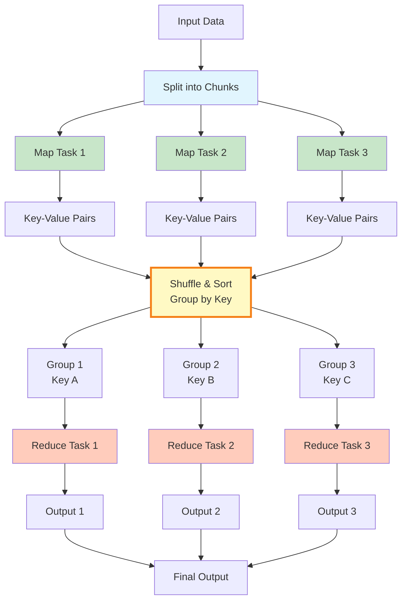

### Characteristics
- **Advantages**: Scalable to massive datasets; automatic fault tolerance; hides distribution complexity.
- **Disadvantages**: High latency; not suitable for iterative algorithms; shuffle overhead.
- **Use Cases**: Log analysis, web indexing, large-scale data processing (Hadoop, Spark).
# Asynchronous Models
## Event-Driven (Reactor/Proactor)
- <mark class="hltr-yellow">Single-threaded event loop handles I/O events asynchronously</mark>.
- Non-blocking I/O operations registered with event loop.
- Callbacks or handlers invoked when events occur.
### Reactor Pattern
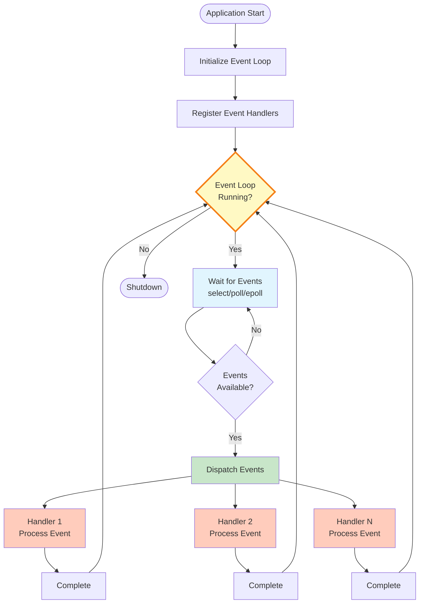

### Characteristics
- **Advantages**: High concurrency with single thread; low memory overhead; no thread synchronization.
- **Disadvantages**: Callback hell; CPU-bound tasks block event loop; complex error handling.
- **Use Cases**: Node.js, Redis, Nginx, GUI applications.
## Reactive Streams
- <mark class="hltr-yellow">Asynchronous stream processing with backpressure support</mark>.
- Publisher produces data; Subscriber consumes data.
- Backpressure prevents overwhelming slow consumers.
### Architecture
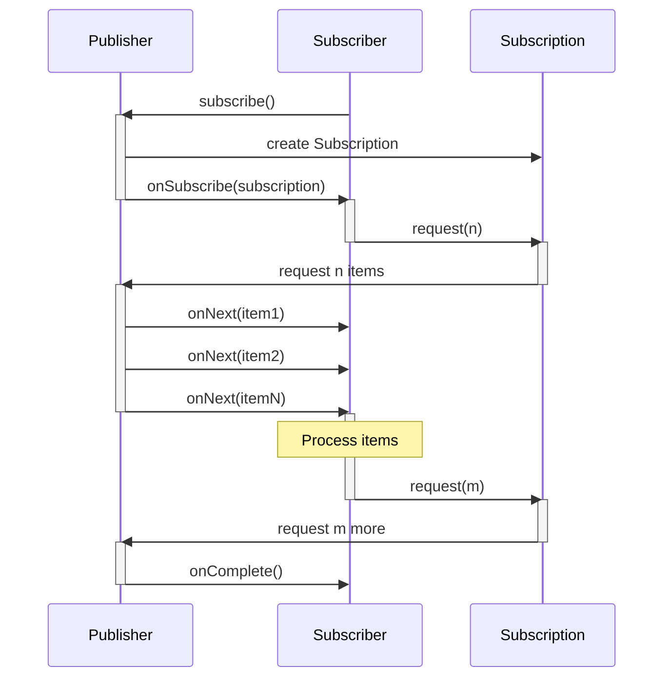

### Characteristics
- **Advantages**: Backpressure handling; composable operators; async by default; resource-efficient.
- **Disadvantages**: Steep learning curve; complex debugging; operator overhead.
- **Use Cases**: RxJava, Project Reactor, Akka Streams, real-time data processing.
## Coroutines (Structured Concurrency)
- <mark class="hltr-yellow">Lightweight threads that can suspend and resume execution</mark>.
- Cooperative multitasking within single OS thread.
- Structured concurrency ensures proper lifecycle management.
### Architecture
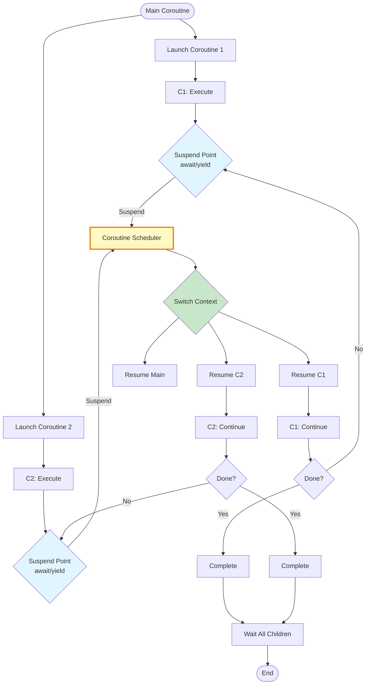

### Characteristics
- **Advantages**: Lightweight; sequential code style; structured concurrency; no callback hell.
- **Disadvantages**: Language support required; debugging can be tricky; learning curve.
- **Use Cases**: Kotlin coroutines, Python asyncio, JavaScript async/await, Go goroutines.
# Memory Models
## Software Transactional Memory (STM)
- <mark class="hltr-yellow">Transactions on memory operations; atomic, consistent, isolated</mark>.
- Similar to database transactions but for memory.
- Optimistic concurrency - assume no conflicts, retry if conflict occurs.

### Architecture
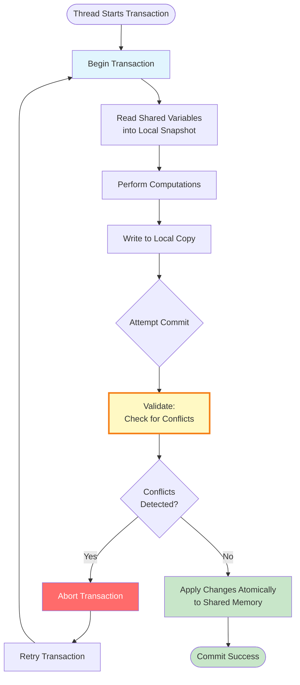

### Characteristics
- **Advantages**: Composable; no deadlocks; automatic conflict resolution; simpler than locks.
- **Disadvantages**: Retry overhead; not suitable for I/O operations; performance unpredictable under high contention.
- **Use Cases**: Haskell STM, Clojure atoms/refs, concurrent data structures.
# Model Comparison
| Model            | Paradigm        | Communication  | State       | Best For               |
| ---------------- | --------------- | -------------- | ----------- | ---------------------- |
| Thread Pool      | Shared Memory   | Task Queue     | Shared      | Independent tasks      |
| Fork-Join        | Shared Memory   | Parent-Child   | Shared      | Divide-and-conquer     |
| Pipeline         | Shared Memory   | Queues         | Shared      | Stream processing      |
| Actor            | Message Passing | Async Messages | Private     | Distributed systems    |
| CSP              | Message Passing | Channels       | Private     | Coordinated processes  |
| Data Parallel    | Shared Memory   | None           | Shared      | Homogeneous operations |
| MapReduce        | Distributed     | Shuffle        | Partitioned | Big data processing    |
| Event-Driven     | Async           | Event Loop     | Shared      | I/O-bound operations   |
| Reactive Streams | Async           | Backpressure   | Shared      | Async data streams     |
| Coroutines       | Async           | Structured     | Shared      | Sequential async code  |
| STM              | Shared Memory   | Transactions   | Versioned   | Complex state updates  |

***
# References
1. Operating System Concepts - Abraham Silberschatz - 10th - 2018 - Pearson Publisher.
	1. Chapter 4: Threads.
	2. Chapter 6: Synchronization Tools.
2. [[programming/javascript/node.js/architecture/Event loop|Event loop]] for Node.js event loop.
3. https://en.wikipedia.org/wiki/Concurrency_pattern
4. Java Concurrency in Practice - Brian Goetz - 2006 - Addison-Wesley.
5. Seven Concurrency Models in Seven Weeks - Paul Butcher - 2014 - Pragmatic Bookshelf.
