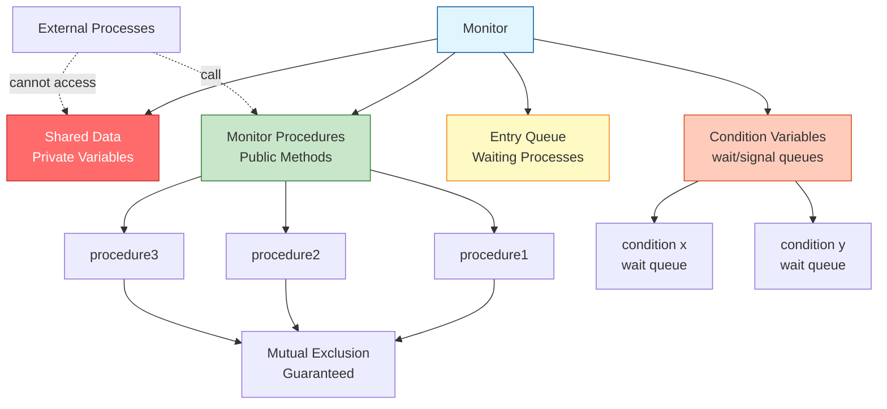
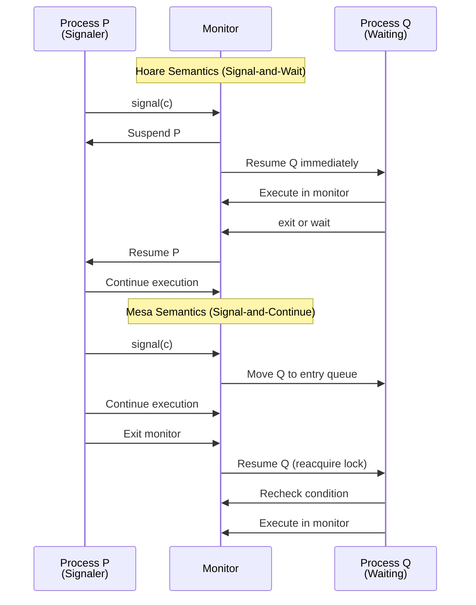
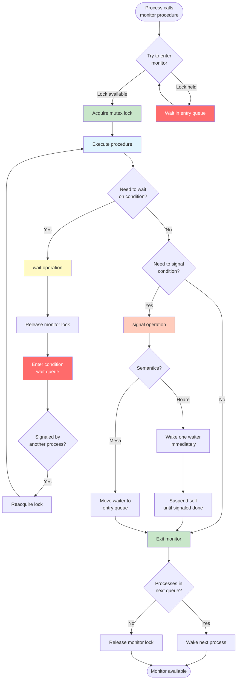
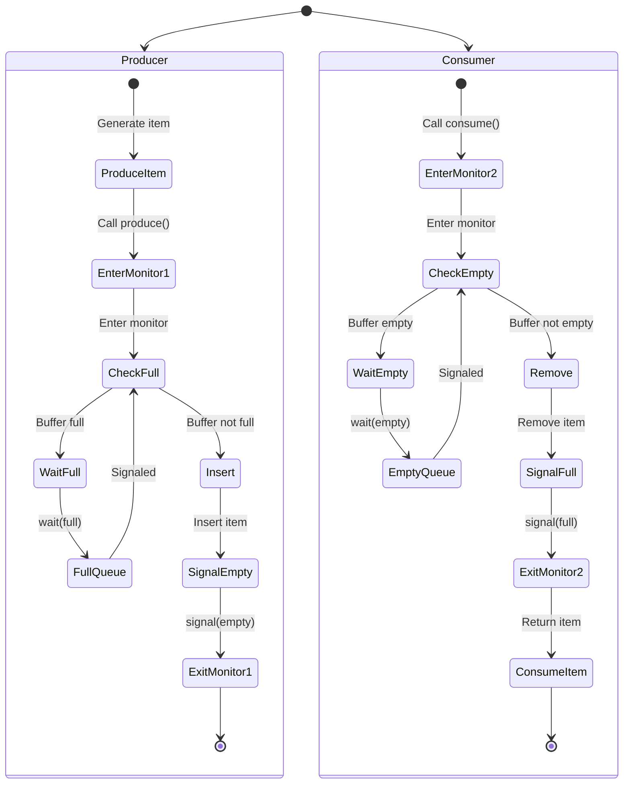
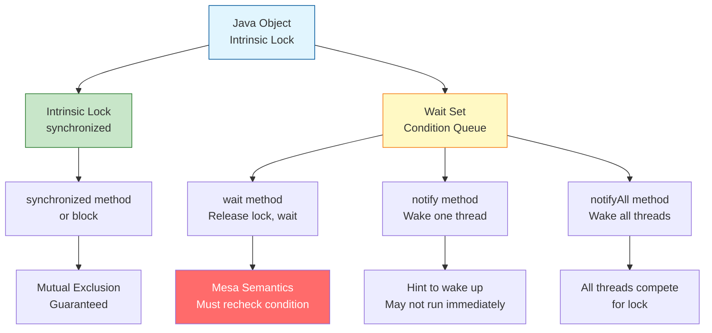

#operating-system #process-synchronization #concurrency #mutex #condition-variable #monitor
#linux #unix

- A monitor is a high-level synchronization construct that encapsulates shared data and procedures operating on that data.
- <mark class="hltr-yellow">Monitors provide mutual exclusion and condition synchronization in a structured way</mark>.
- Only one process can be active within the monitor at any time.
# Monitor Characteristics
## Encapsulation
- <mark class="hltr-yellow">Monitor encapsulates shared variables and procedures that operate on them</mark>.
- Shared data is accessible only through monitor procedures.
- Direct access to internal data from outside the monitor is prohibited.
## Mutual Exclusion
- <mark class="hltr-yellow">Only one process can execute within the monitor at a time</mark>.
- Mutual exclusion is enforced automatically by the monitor.
- No explicit locking/unlocking required by programmer.
## Condition Synchronization
- Provides condition variables for waiting and signaling.
- Allows processes to wait for specific conditions to become true.
- Other processes can signal when conditions change.
## Monitor Structure


# Monitor Components
## Shared Variables
- Private data accessible only within monitor.
- Protected by mutual exclusion automatically.
- State of the monitor.
## Monitor Procedures
- <mark class="hltr-yellow">Public interface to access shared data</mark>.
- Execute with mutual exclusion guarantee.
- Can call `wait()` and `signal() `on condition variables.
## Condition Variables
- <mark class="hltr-yellow">Synchronization mechanism for processes to wait and signal</mark>.
- Not counters (unlike semaphores).
- Each condition variable has an associated wait queue.
### Condition Variable Operations
#### wait(condition c)
- <mark class="hltr-yellow">Suspends the calling process and releases monitor lock</mark>.
- Process is placed in the wait queue of condition `c`.
- Another process can enter the monitor.
- Process remains suspended until another process calls signal() on `c`.
#### signal(condition c)
- <mark class="hltr-yellow">Wakes up one process waiting on condition `c`</mark>.
- If no process is waiting, signal has no effect (not saved).
- Two semantics:
	- **Signal-and-Wait**: Signaler waits until signaled process exits or waits.
	- **Signal-and-Continue**: Signaler continues execution, signaled process waits.
## Entry Queue
- Queue of processes waiting to enter the monitor.
- Managed automatically by monitor implementation.
# Monitor Semantics

## Signal-and-Wait (Hoare Semantics)
- When process P signals condition variable:
	1. Process P is suspended.
	2. One process Q waiting on condition is resumed.
	3. Q executes immediately.
	4. When Q exits or waits, P resumes.
- <mark class="hltr-yellow">Signaled process runs immediately</mark>.
- Condition guaranteed to be true when signaled process resumes.
## Signal-and-Continue (Mesa Semantics)
- When process P signals condition variable:
	1. Process P continues execution.
	2. Signaled process Q is moved to entry queue.
	3. Q must re-acquire monitor lock.
	4. Q must recheck condition (may no longer be true).
- <mark class="hltr-yellow">Signaler continues, signaled process waits</mark>.
- More efficient but requires condition rechecking.
- Used in most practical implementations (Java, POSIX).
## Semantics Comparison


# Condition Variable Usage Pattern
## Hoare Semantics (Signal-and-Wait)
```c
// Waiting
if (!condition) {
    wait(c);
}
// Condition guaranteed to be true here

// Signaling
condition = true;
signal(c);  // Signaled process runs immediately
```
## Mesa Semantics (Signal-and-Continue)
```c
// Waiting - MUST use while loop
while (!condition) {
    wait(c);  // May be spurious wakeup
}
// Recheck condition after wake up

// Signaling
condition = true;
signal(c);  // Hint to waiting processes
```

# Monitor vs Semaphores

| Aspect | Monitor | Semaphore |
|--------|---------|-----------|
| Level | High-level language construct | Low-level primitive |
| Mutual Exclusion | Automatic | Manual (P/V operations) |
| Data Encapsulation | Yes (structured) | No |
| Condition Variables | wait/signal (no memory) | P/V (has counter) |
| Error Prone | Less (compiler enforced) | More (programmer responsibility) |
| Flexibility | Less flexible | More flexible |
| Typical Use | Language support (Java, C#) | System programming (POSIX) |

# Monitor Implementation
## Using Semaphores
### Basic Implementation
```c title='Implementation of Monitor'
typedef struct {
    // Shared data
    int shared_variable;

    // Mutual exclusion semaphore
    semaphore mutex;

    // Condition variable implementation
    struct condition {
        semaphore sem;    // Semaphore for waiting
        int waiting;      // Count of waiting processes
    } conditions[NUM_CONDITIONS];

    // Next semaphore for signal-and-wait
    semaphore next;
    int next_count;
} Monitor;

// Initialize monitor
void monitor_init(Monitor *mon) {
    mon->shared_variable = 0;
    sem_init(&mon->mutex, 0, 1);  // Binary semaphore
    sem_init(&mon->next, 0, 0);
    mon->next_count = 0;

    for (int i = 0; i < NUM_CONDITIONS; i++) {
        sem_init(&mon->conditions[i].sem, 0, 0);
        mon->conditions[i].waiting = 0;
    }
}

// Monitor entry
void monitor_enter(Monitor *mon) {
    sem_wait(&mon->mutex);
}

// Monitor exit
void monitor_exit(Monitor *mon) {
    if (mon->next_count > 0) {
        sem_post(&mon->next);  // Wake up signaler
    } else {
        sem_post(&mon->mutex); // Release monitor
    }
}

// Wait on condition (Hoare semantics)
void monitor_wait(Monitor *mon, int condition_id) {
    struct condition *c = &mon->conditions[condition_id];
    c->waiting++;

    if (mon->next_count > 0) {
        sem_post(&mon->next);  // Wake up signaler
    } else {
        sem_post(&mon->mutex); // Release monitor
    }

    sem_wait(&c->sem);         // Wait on condition
    c->waiting--;
}

// Signal condition (Hoare semantics)
void monitor_signal(Monitor *mon, int condition_id) {
    struct condition *c = &mon->conditions[condition_id];

    if (c->waiting > 0) {
        mon->next_count++;
        sem_post(&c->sem);     // Wake up one waiting process
        sem_wait(&mon->next);  // Wait until signaled process done
        mon->next_count--;
    }
}
```
## Monitor Operation Flow

# Producer-Consumer with Monitor

## Monitor Definition
```c title='Producer-consumer problem with Monitor'
// Monitor for bounded buffer
typedef struct {
    int buffer[BUFFER_SIZE];
    int count;        // Number of items in buffer
    int in;           // Index for next insertion
    int out;          // Index for next removal

    // Semaphores for monitor implementation
    semaphore mutex;
    semaphore next;
    int next_count;

    // Condition variables
    struct condition {
        semaphore sem;
        int waiting;
    } full, empty;
} BoundedBuffer;

void buffer_init(BoundedBuffer *bb) {
    bb->count = 0;
    bb->in = 0;
    bb->out = 0;
    sem_init(&bb->mutex, 0, 1);
    sem_init(&bb->next, 0, 0);
    bb->next_count = 0;

    bb->full.waiting = 0;
    bb->empty.waiting = 0;
    sem_init(&bb->full.sem, 0, 0);
    sem_init(&bb->empty.sem, 0, 0);
}

// Produce item
void produce(BoundedBuffer *bb, int item) {
    // Enter monitor
    sem_wait(&bb->mutex);

    // Wait while buffer is full
    while (bb->count == BUFFER_SIZE) {
        bb->full.waiting++;
        if (bb->next_count > 0)
            sem_post(&bb->next);
        else
            sem_post(&bb->mutex);

        sem_wait(&bb->full.sem);
        bb->full.waiting--;
    }

    // Add item to buffer
    bb->buffer[bb->in] = item;
    bb->in = (bb->in + 1) % BUFFER_SIZE;
    bb->count++;

    // Signal that buffer is not empty
    if (bb->empty.waiting > 0) {
        bb->next_count++;
        sem_post(&bb->empty.sem);
        sem_wait(&bb->next);
        bb->next_count--;
    }

    // Exit monitor
    if (bb->next_count > 0)
        sem_post(&bb->next);
    else
        sem_post(&bb->mutex);
}

// Consume item
int consume(BoundedBuffer *bb) {
    // Enter monitor
    sem_wait(&bb->mutex);

    // Wait while buffer is empty
    while (bb->count == 0) {
        bb->empty.waiting++;
        if (bb->next_count > 0)
            sem_post(&bb->next);
        else
            sem_post(&bb->mutex);

        sem_wait(&bb->empty.sem);
        bb->empty.waiting--;
    }

    // Remove item from buffer
    int item = bb->buffer[bb->out];
    bb->out = (bb->out + 1) % BUFFER_SIZE;
    bb->count--;

    // Signal that buffer is not full
    if (bb->full.waiting > 0) {
        bb->next_count++;
        sem_post(&bb->full.sem);
        sem_wait(&bb->next);
        bb->next_count--;
    }

    // Exit monitor
    if (bb->next_count > 0)
        sem_post(&bb->next);
    else
        sem_post(&bb->mutex);

    return item;
}
```

## Producer-Consumer Flow


# Readers-Writers with Monitor

## Monitor Definition
```c title='Readers-Writers implementation with Monitor'
// Monitor for readers-writers problem
typedef struct {
    int readers;          // Number of active readers
    int writers;          // Number of active writers (0 or 1)
    int waiting_writers;  // Number of waiting writers

    // Semaphores for monitor
    semaphore mutex;
    semaphore next;
    int next_count;

    // Condition variables
    struct condition {
        semaphore sem;
        int waiting;
    } ok_to_read, ok_to_write;
} ReadersWriters;

void rw_init(ReadersWriters *rw) {
    rw->readers = 0;
    rw->writers = 0;
    rw->waiting_writers = 0;

    sem_init(&rw->mutex, 0, 1);
    sem_init(&rw->next, 0, 0);
    rw->next_count = 0;

    rw->ok_to_read.waiting = 0;
    rw->ok_to_write.waiting = 0;
    sem_init(&rw->ok_to_read.sem, 0, 0);
    sem_init(&rw->ok_to_write.sem, 0, 0);
}

// Start reading
void start_read(ReadersWriters *rw) {
    sem_wait(&rw->mutex);

    // Wait while writer is active or writers are waiting
    while (rw->writers > 0 || rw->waiting_writers > 0) {
        rw->ok_to_read.waiting++;
        if (rw->next_count > 0)
            sem_post(&rw->next);
        else
            sem_post(&rw->mutex);

        sem_wait(&rw->ok_to_read.sem);
        rw->ok_to_read.waiting--;
    }

    rw->readers++;

    // Signal other waiting readers
    if (rw->ok_to_read.waiting > 0) {
        rw->next_count++;
        sem_post(&rw->ok_to_read.sem);
        sem_wait(&rw->next);
        rw->next_count--;
    }

    if (rw->next_count > 0)
        sem_post(&rw->next);
    else
        sem_post(&rw->mutex);
}

// End reading
void end_read(ReadersWriters *rw) {
    sem_wait(&rw->mutex);

    rw->readers--;

    // If last reader, signal waiting writer
    if (rw->readers == 0 && rw->ok_to_write.waiting > 0) {
        rw->next_count++;
        sem_post(&rw->ok_to_write.sem);
        sem_wait(&rw->next);
        rw->next_count--;
    }

    if (rw->next_count > 0)
        sem_post(&rw->next);
    else
        sem_post(&rw->mutex);
}

// Start writing
void start_write(ReadersWriters *rw) {
    sem_wait(&rw->mutex);

    rw->waiting_writers++;

    // Wait while readers or writer is active
    while (rw->readers > 0 || rw->writers > 0) {
        rw->ok_to_write.waiting++;
        if (rw->next_count > 0)
            sem_post(&rw->next);
        else
            sem_post(&rw->mutex);

        sem_wait(&rw->ok_to_write.sem);
        rw->ok_to_write.waiting--;
    }

    rw->waiting_writers--;
    rw->writers = 1;

    if (rw->next_count > 0)
        sem_post(&rw->next);
    else
        sem_post(&rw->mutex);
}

// End writing
void end_write(ReadersWriters *rw) {
    sem_wait(&rw->mutex);

    rw->writers = 0;

    // Prefer waiting writers over readers
    if (rw->ok_to_write.waiting > 0) {
        rw->next_count++;
        sem_post(&rw->ok_to_write.sem);
        sem_wait(&rw->next);
        rw->next_count--;
    }
    // Wake all waiting readers
    else if (rw->ok_to_read.waiting > 0) {
        rw->next_count++;
        sem_post(&rw->ok_to_read.sem);
        sem_wait(&rw->next);
        rw->next_count--;
    }

    if (rw->next_count > 0)
        sem_post(&rw->next);
    else
        sem_post(&rw->mutex);
}
```

# Monitor in Java

## Java Monitor Implementation
```java
// Java uses built-in monitor support
// Every object has an intrinsic lock and condition variable

class BoundedBuffer {
    private int[] buffer;
    private int count, in, out;
    private final int size;

    public BoundedBuffer(int size) {
        this.size = size;
        buffer = new int[size];
        count = in = out = 0;
    }

    // synchronized keyword provides mutual exclusion
    public synchronized void produce(int item) throws InterruptedException {
        // wait() releases lock and waits
        while (count == size) {
            wait();  // Wait until buffer not full
        }

        buffer[in] = item;
        in = (in + 1) % size;
        count++;

        // notifyAll() wakes all waiting threads
        notifyAll();  // Signal that buffer not empty
    }

    public synchronized int consume() throws InterruptedException {
        // Mesa semantics - must use while loop
        while (count == 0) {
            wait();  // Wait until buffer not empty
        }

        int item = buffer[out];
        out = (out + 1) % size;
        count--;

        notifyAll();  // Signal that buffer not full
        return item;
    }
}

// Usage
class Producer extends Thread {
    private BoundedBuffer buffer;

    public Producer(BoundedBuffer buffer) {
        this.buffer = buffer;
    }

    public void run() {
        try {
            for (int i = 0; i < 100; i++) {
                buffer.produce(i);
                System.out.println("Produced: " + i);
            }
        } catch (InterruptedException e) {
            e.printStackTrace();
        }
    }
}

class Consumer extends Thread {
    private BoundedBuffer buffer;

    public Consumer(BoundedBuffer buffer) {
        this.buffer = buffer;
    }

    public void run() {
        try {
            for (int i = 0; i < 100; i++) {
                int item = buffer.consume();
                System.out.println("Consumed: " + item);
            }
        } catch (InterruptedException e) {
            e.printStackTrace();
        }
    }
}

public class Main {
    public static void main(String[] args) {
        BoundedBuffer buffer = new BoundedBuffer(10);
        Producer p = new Producer(buffer);
        Consumer c = new Consumer(buffer);

        p.start();
        c.start();
    }
}
```

## Java Monitor Operations


# Monitor Advantages and Disadvantages

## Advantages
1. **Automatic Mutual Exclusion**
	- No explicit lock/unlock operations.
	- Compiler enforces mutual exclusion.
	- Less error-prone than semaphores.

2. **Structured Synchronization**
	- Encapsulation of shared data and operations.
	- Clear interface and implementation separation.
	- Easier to understand and maintain.

3. **Compiler Support**
	- Compile-time checking of monitor usage.
	- Language-level construct (Java, C#, Mesa).
	- Integrated with language type system.

4. **Deadlock Prevention**
	- Nested monitor calls can be detected.
	- Less likely to create circular wait.

## Disadvantages
1. **Language Dependency**
	- Requires language support.
	- Not available in all programming languages.
	- Cannot be implemented as library in some languages.

2. **Flexibility**
	- Less flexible than semaphores.
	- Difficult to implement some synchronization patterns.
	- Entry queue management is implicit.

3. **Performance**
	- May have overhead for monitor entry/exit.
	- Signal-and-wait semantics require context switches.

4. **Condition Variables**
	- No memory (unlike semaphore counters).
	- Signal with no waiters has no effect.
	- Requires careful design of conditions.

# Monitor Best Practices

## Use Mesa Semantics with While Loops
```c
// WRONG - if statement (Hoare semantics)
if (!condition) {
    wait(c);
}

// CORRECT - while loop (Mesa semantics)
while (!condition) {
    wait(c);  // Recheck after wake up
}
```

## Signal After State Change
```c
// WRONG - signal before state change
signal(c);
state = new_state;

// CORRECT - signal after state change
state = new_state;
signal(c);
```
## Use `notifyAll` for Multiple Waiters
```java
// Use notify() only if one waiter can proceed
notify();

// Use notifyAll() if multiple waiters might proceed
// or if different conditions share the same monitor
notifyAll();
```
## Minimize Work Inside Monitor
```java
synchronized void process() {
    // Keep critical section small
    updateSharedState();
    notifyAll();
}
// Do expensive work outside monitor
```
***
# References
1. Operating System Concepts - Abraham Silberschatz - 10th - 2018 - Pearson Publisher.
	1. Chapter 6: Synchronization Tools.
		1. Section 6.7: Monitors.
2. Operating Systems: Three Easy Pieces - Remzi H. Arpaci-Dusseau - 1st - 2018 - Arpaci-Dusseau Books.
	1. Chapter 30: Condition Variables.
3. Modern Operating Systems - Andrew S. Tanenbaum - 4th - 2014 - Pearson.
	1. Chapter 2: Processes and Threads.
		1. Section 2.3.6: Monitors.
4. The Art of Multiprocessor Programming - Maurice Herlihy - 2nd - 2020 - Morgan Kaufmann.
	1. Chapter 8: Monitors and Blocking Synchronization.
5. Concurrent Programming in Java - Doug Lea - 2nd - 1999 - Addison-Wesley.
6. https://docs.oracle.com/javase/tutorial/essential/concurrency/
7. https://en.wikipedia.org/wiki/Monitor_(synchronization)
