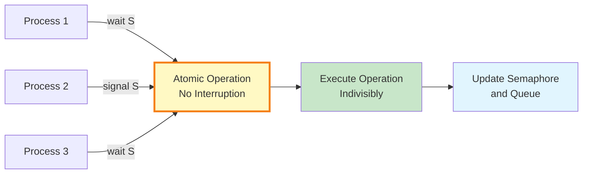
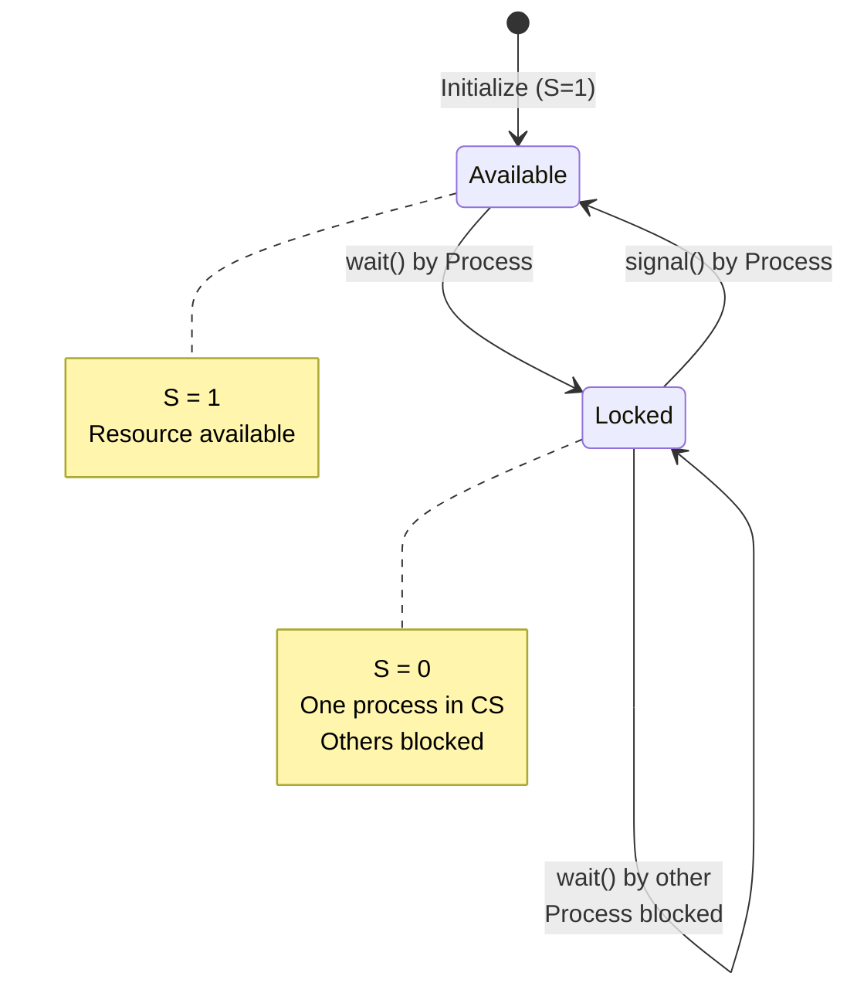
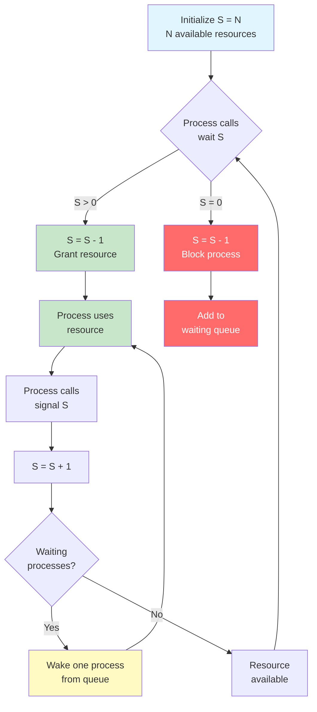
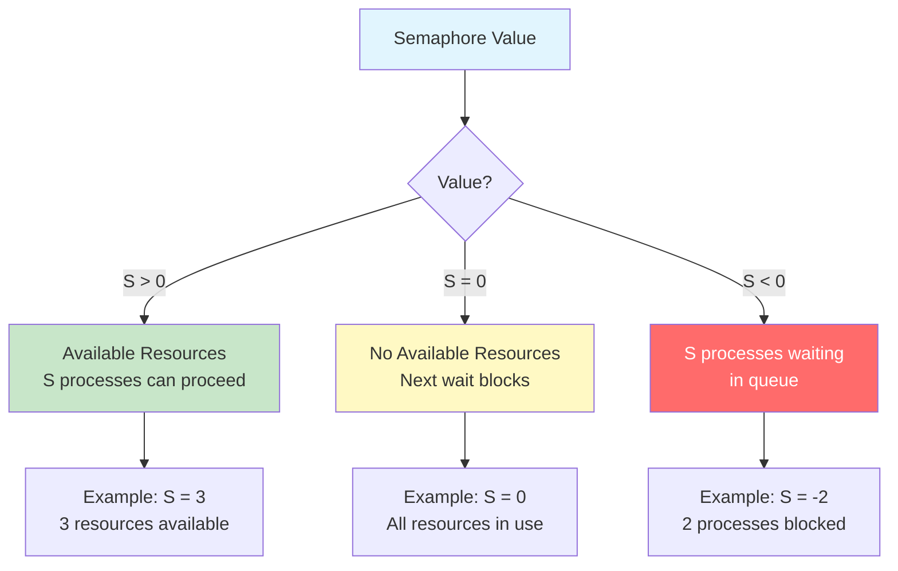
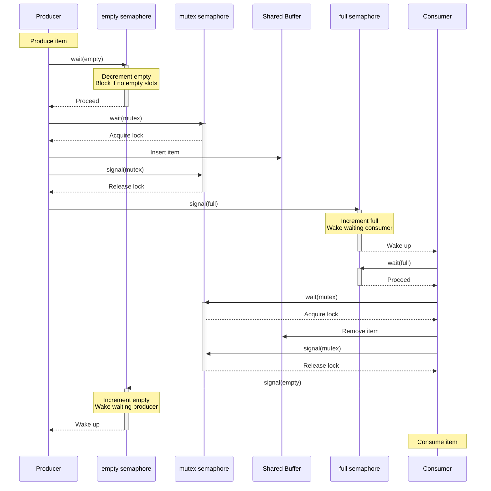
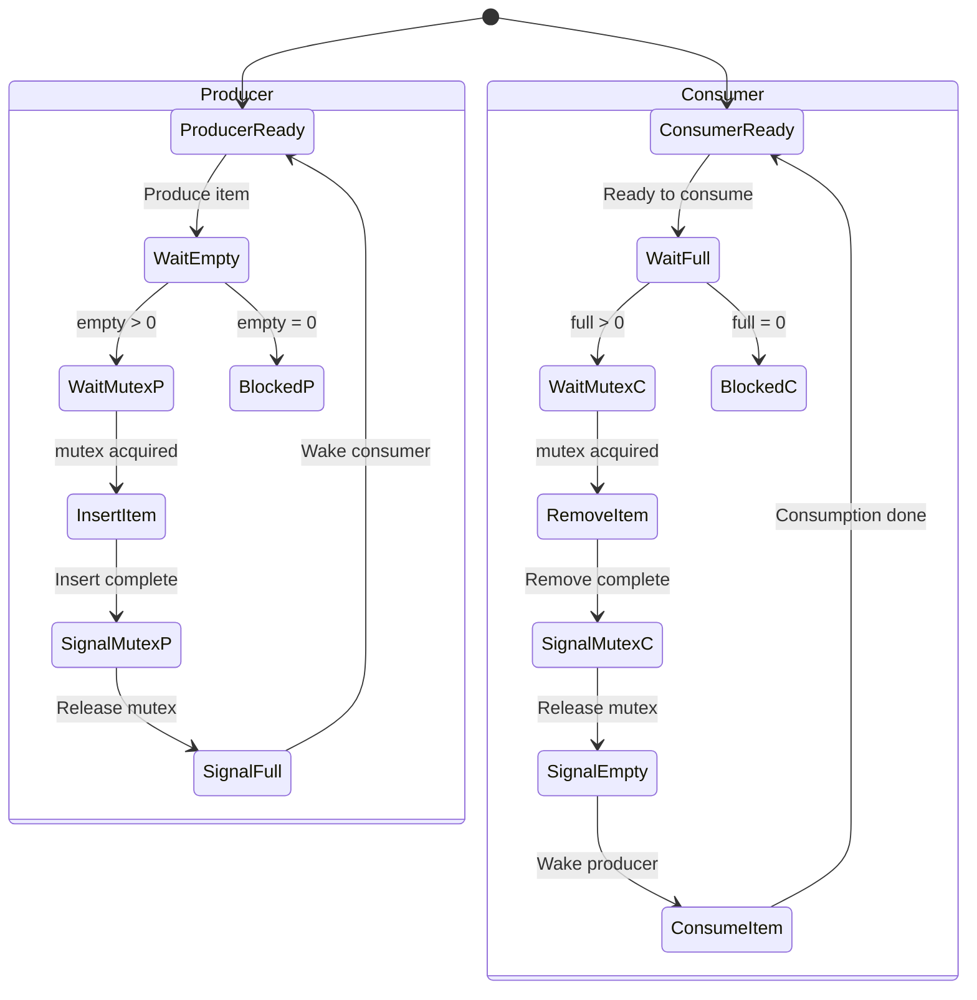
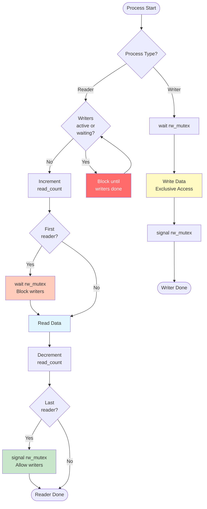
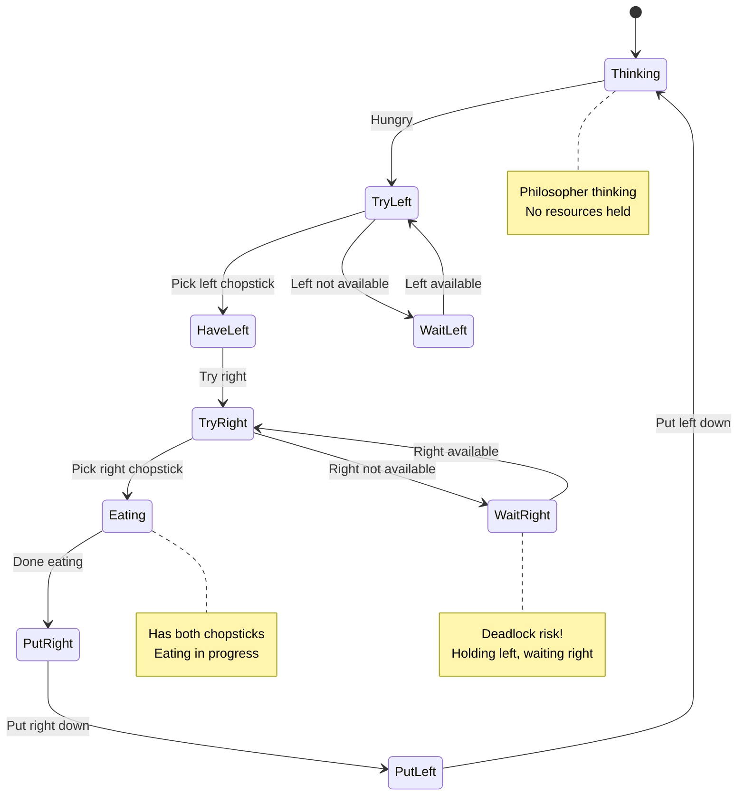
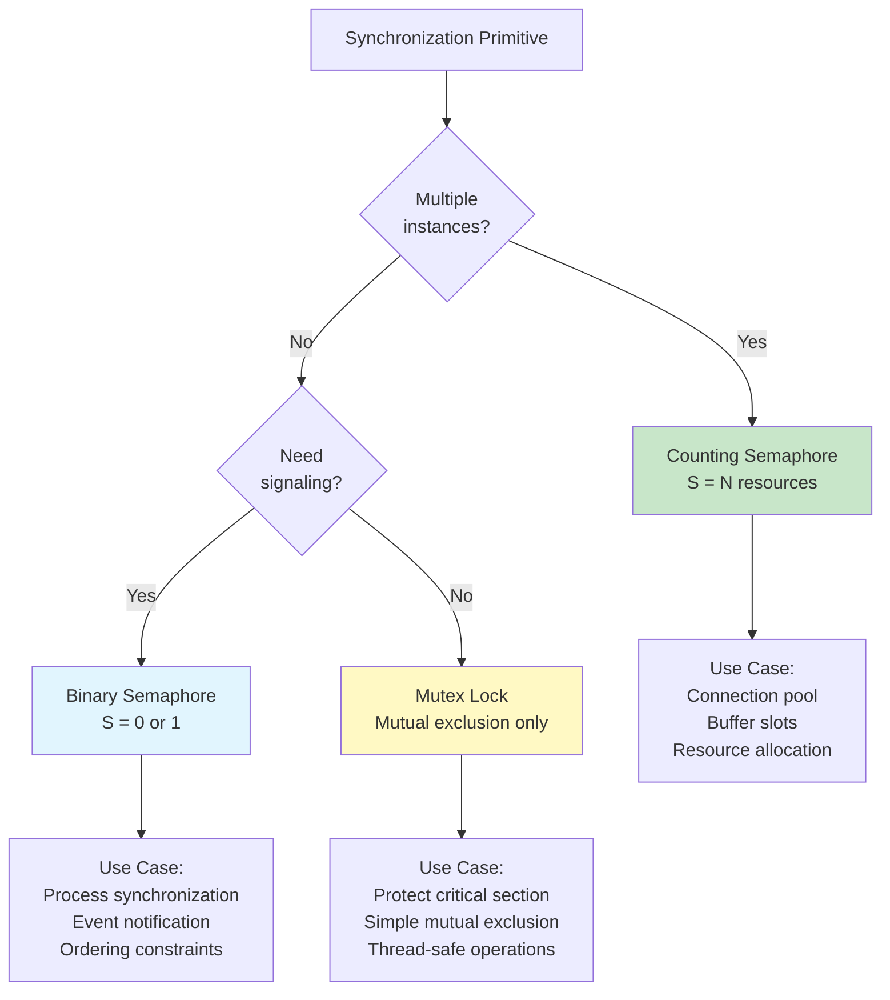

#operating-system #process #process-synchronization #semaphore #parallel-programming
#critical-section #thread #concurrency-control

- A semaphore is a synchronization primitive that provides a more robust solution than mutex locks.
- <mark class="hltr-yellow">Semaphore is an integer variable accessed through two atomic operations: wait() and signal()</mark>.
- Semaphores can be used to control access to shared resources and synchronize process execution.

# Semaphore Operations

## wait() Operation
- Also known as **P()** operation (from Dutch "proberen" - to test).
- Also called **down()** or **acquire()** in some implementations.
- <mark class="hltr-yellow">Decrements semaphore value; blocks if value becomes negative</mark>.

```c title='wait() pseudo-code'
wait(S) {
    S--;
    if (S < 0) {
        /* add this process to waiting queue */
        /* block the process */
    }
}
```

## signal() Operation
- Also known as **V()** operation (from Dutch "verhogen" - to increment).
- Also called **up()** or **release()** in some implementations.
- <mark class="hltr-yellow">Increments semaphore value; wakes one waiting process if any</mark>.

```c title='signal() pseudo-code'
signal(S) {
    S++;
    if (S <= 0) {
        /* remove one process from waiting queue */
        /* wake up that process */
    }
}
```

## Atomicity Requirement
- <mark class="hltr-yellow">Both wait() and signal() must execute atomically</mark>.
- No two processes can execute wait() and signal() on the same semaphore simultaneously.
- Operating system ensures atomicity through hardware support or software techniques.



# Types of Semaphores

## Binary Semaphore
- <mark class="hltr-yellow">Semaphore value can only be 0 or 1</mark>.
- Similar to mutex lock but with different semantics.
- Used for mutual exclusion.

```c title='Binary semaphore example'
semaphore mutex = 1;  // Initialize to 1

/* Process execution */
while (true) {
    wait(mutex);        // Decrement: 1 -> 0

    /* critical section */

    signal(mutex);      // Increment: 0 -> 1

    /* remainder section */
}
```

### Binary Semaphore States


## Counting Semaphore
- <mark class="hltr-yellow">Semaphore value can range over an unrestricted domain</mark>.
- Used to control access to resources with multiple instances.
- Value represents number of available resources.

```c title='Counting semaphore example'
#define NUM_RESOURCES 5
semaphore resources = 5;  // 5 identical resources

/* Process wants to use resource */
wait(resources);    // Decrement available count
/* use resource */
signal(resources);  // Increment available count
```

### Counting Semaphore Flow


# Semaphore Implementation

## Implementation with Busy Waiting (Spinlock)
```c title='Spinlock semaphore'
typedef struct {
    int value;
} semaphore;

void wait(semaphore *S) {
    /* Busy waiting - wastes CPU cycles */
    while (S->value <= 0)
        ; /* spin */
    S->value--;
}

void signal(semaphore *S) {
    S->value++;
}
```

### Disadvantages
- **Busy waiting**: Process continuously checks condition, wasting CPU cycles.
- **Priority inversion**: Low-priority process holds resource needed by high-priority process.
- Only practical for very short critical sections.

## Implementation without Busy Waiting (Blocking)
```c title='Blocking semaphore implementation'
typedef struct {
    int value;
    struct process *list;  // Waiting queue
} semaphore;

void wait(semaphore *S) {
    S->value--;
    if (S->value < 0) {
        /* Add this process to S->list */
        add_to_queue(&S->list, current_process);
        /* Block this process */
        block();
    }
}

void signal(semaphore *S) {
    S->value++;
    if (S->value <= 0) {
        /* Remove one process P from S->list */
        process *P = remove_from_queue(&S->list);
        /* Wake up process P */
        wakeup(P);
    }
}
```

### Semaphore Value Interpretation
- **S->value ≥ 0**: Number of processes that can execute wait() without blocking.
- **S->value < 0**: Absolute value is number of processes waiting in queue.



## POSIX Semaphore Implementation
```c title='POSIX semaphore API'
#include <semaphore.h>

/* Initialize semaphore */
sem_t sem;
sem_init(&sem, 0, 1);  // 0 = shared between threads, 1 = initial value

/* Wait operation */
sem_wait(&sem);
/* critical section */
sem_post(&sem);

/* Destroy semaphore */
sem_destroy(&sem);
```

### POSIX Functions
| Function | Description |
|----------|-------------|
| `sem_init(sem, pshared, value)` | Initialize semaphore with initial value |
| `sem_wait(sem)` | Decrement (block if zero) |
| `sem_trywait(sem)` | Non-blocking decrement (returns error if zero) |
| `sem_timedwait(sem, timeout)` | Decrement with timeout |
| `sem_post(sem)` | Increment semaphore |
| `sem_getvalue(sem, val)` | Get current semaphore value |
| `sem_destroy(sem)` | Destroy semaphore |

# Classical Synchronization Problems

## Producer-Consumer Problem (Bounded Buffer)

### Problem Description
- Multiple producers generate items and place in bounded buffer.
- Multiple consumers remove items from buffer.
- Buffer has limited size $N$.
- Synchronization requirements:
	1. Producer must wait if buffer is full.
	2. Consumer must wait if buffer is empty.
	3. Access to buffer must be mutually exclusive.

### Semaphore Solution
```c title='Producer-consumer with semaphores'
#define BUFFER_SIZE 10

int buffer[BUFFER_SIZE];
int in = 0;   // Index for next insertion
int out = 0;  // Index for next removal

semaphore mutex = 1;        // Binary: mutual exclusion for buffer
semaphore empty = BUFFER_SIZE;  // Counting: empty slots
semaphore full = 0;         // Counting: full slots

/* Producer process */
void producer() {
    int item;

    while (true) {
        /* produce item */
        item = produce_item();

        wait(empty);        // Wait for empty slot
        wait(mutex);        // Enter critical section

        /* add item to buffer */
        buffer[in] = item;
        in = (in + 1) % BUFFER_SIZE;

        signal(mutex);      // Exit critical section
        signal(full);       // Signal full slot available
    }
}

/* Consumer process */
void consumer() {
    int item;

    while (true) {
        wait(full);         // Wait for full slot
        wait(mutex);        // Enter critical section

        /* remove item from buffer */
        item = buffer[out];
        out = (out + 1) % BUFFER_SIZE;

        signal(mutex);      // Exit critical section
        signal(empty);      // Signal empty slot available

        /* consume item */
        consume_item(item);
    }
}
```

### Producer-Consumer Flow


### State Diagram


## Readers-Writers Problem

### Problem Description
- Multiple readers can read simultaneously.
- Only one writer can write at a time.
- No reader can read while writer is writing.
- No writer can write while readers are reading.

### First Readers-Writers Problem
- **Readers priority**: No reader should wait unless writer has already obtained permission.
- **Problem**: Writers may starve.

```c title='First readers-writers problem'
int read_count = 0;     // Number of readers currently reading
semaphore mutex = 1;    // Protects read_count
semaphore rw_mutex = 1; // Controls reading/writing access

/* Reader process */
void reader() {
    while (true) {
        wait(mutex);
        read_count++;
        if (read_count == 1)
            wait(rw_mutex);  // First reader locks writers
        signal(mutex);

        /* reading performed */

        wait(mutex);
        read_count--;
        if (read_count == 0)
            signal(rw_mutex); // Last reader unlocks writers
        signal(mutex);
    }
}

/* Writer process */
void writer() {
    while (true) {
        wait(rw_mutex);      // Acquire exclusive access

        /* writing performed */

        signal(rw_mutex);    // Release exclusive access
    }
}
```

### Second Readers-Writers Problem
- **Writers priority**: Once writer is ready, no new readers start reading.
- **Problem**: Readers may starve.

```c title='Second readers-writers problem'
int read_count = 0;
int write_count = 0;
semaphore mutex = 1;        // Protects read_count
semaphore write_mutex = 1;  // Protects write_count
semaphore rw_mutex = 1;     // Controls reading/writing
semaphore read_try = 1;     // Prevents new readers when writer waiting

/* Reader process */
void reader() {
    while (true) {
        wait(read_try);     // Check if writer is waiting
        wait(mutex);
        read_count++;
        if (read_count == 1)
            wait(rw_mutex);
        signal(mutex);
        signal(read_try);

        /* reading performed */

        wait(mutex);
        read_count--;
        if (read_count == 0)
            signal(rw_mutex);
        signal(mutex);
    }
}

/* Writer process */
void writer() {
    while (true) {
        wait(write_mutex);
        write_count++;
        if (write_count == 1)
            wait(read_try);  // Block new readers
        signal(write_mutex);

        wait(rw_mutex);

        /* writing performed */

        signal(rw_mutex);

        wait(write_mutex);
        write_count--;
        if (write_count == 0)
            signal(read_try); // Allow readers again
        signal(write_mutex);
    }
}
```

### Readers-Writers Visualization


## Dining Philosophers Problem

### Problem Description
- $N$ philosophers sit at round table.
- Each philosopher alternates between thinking and eating.
- $N$ chopsticks (forks) placed between philosophers.
- Philosopher needs two chopsticks to eat (left and right).
- Deadlock can occur if all philosophers pick up left chopstick simultaneously.

### Semaphore Solution (Deadlock-Free)
```c title='Dining philosophers with asymmetric solution'
#define N 5
#define LEFT (i + N - 1) % N
#define RIGHT (i + 1) % N

semaphore chopstick[N];  // Initialize all to 1

void philosopher(int i) {
    while (true) {
        /* thinking */

        /* Asymmetric solution: odd picks left first, even picks right first */
        if (i % 2 == 0) {
            wait(chopstick[LEFT]);
            wait(chopstick[RIGHT]);
        } else {
            wait(chopstick[RIGHT]);
            wait(chopstick[LEFT]);
        }

        /* eating */

        signal(chopstick[LEFT]);
        signal(chopstick[RIGHT]);
    }
}
```

### Alternative Solution with Resource Limit
```c title='Dining philosophers with maximum eaters limit'
#define N 5
semaphore chopstick[N];  // Initialize all to 1
semaphore max_eaters = N - 1;  // At most N-1 can try to eat

void philosopher(int i) {
    while (true) {
        /* thinking */

        wait(max_eaters);        // Limit concurrent eaters
        wait(chopstick[LEFT]);
        wait(chopstick[RIGHT]);

        /* eating */

        signal(chopstick[RIGHT]);
        signal(chopstick[LEFT]);
        signal(max_eaters);
    }
}
```

### Dining Philosophers State Diagram


# Semaphore vs Mutex Lock

| Aspect | Semaphore | Mutex Lock |
|--------|-----------|------------|
| **Value** | Integer (0, 1, 2, ...) | Boolean (available/unavailable) |
| **Purpose** | Signaling mechanism | Locking mechanism |
| **Ownership** | No ownership concept | Owned by thread that acquires |
| **Release** | Any process can signal() | Only owner can release |
| **Types** | Binary and Counting | Only binary |
| **Use Case** | Resource counting, synchronization | Mutual exclusion only |
| **Flexibility** | More flexible | Simpler, less error-prone |
| **Signaling** | Can signal without waiting | Must acquire before release |



# Advantages and Disadvantages

## Advantages
1. **Flexible Synchronization**
	- Can implement both mutual exclusion and condition synchronization.
	- Supports counting resources with multiple instances.
	- More expressive than simple locks.

2. **No Busy Waiting** (with blocking implementation)
	- Blocked processes do not consume CPU cycles.
	- Efficient use of system resources.
	- Better performance than spinlocks for long waits.

3. **Ordering Constraints**
	- Can enforce execution order between processes.
	- Useful for event notification and signaling.
	- Supports complex synchronization patterns.

4. **Portable**
	- POSIX standard implementation available.
	- Widely supported across operating systems.
	- Can be implemented in user space or kernel space.

## Disadvantages
1. **Error-Prone**
	- <mark class="hltr-yellow">Easy to make mistakes: forget wait(), forget signal(), wrong order</mark>.
	- Difficult to debug synchronization errors.
	- No compiler checking for correct usage.

2. **Deadlock Risk**
	- Improper use can lead to deadlock.
	- Example: Two processes each wait for semaphore held by other.
	- Requires careful design to avoid circular dependencies.

3. **No Encapsulation**
	- Semaphore operations scattered throughout code.
	- Difficult to ensure proper pairing of wait() and signal().
	- No automatic cleanup on errors.

4. **Priority Inversion**
	- Low-priority process holding semaphore blocks high-priority process.
	- Can be mitigated with priority inheritance.
	- Requires operating system support.

# Common Pitfalls

## Incorrect Order
```c
/* WRONG - deadlock potential */
Process P1:                Process P2:
wait(S);                   wait(Q);
wait(Q);                   wait(S);
/* critical section */     /* critical section */
signal(S);                 signal(Q);
signal(Q);                 signal(S);
```

## Missing signal()
```c
/* WRONG - processes will block forever */
wait(mutex);
/* critical section */
if (error)
    return;  // Forgot signal(mutex)!
signal(mutex);
```

## Signal without Wait
```c
/* WRONG - semaphore value grows unbounded */
while (true) {
    signal(sem);  // Never wait()
}
```

## Correct Pattern
```c
/* CORRECT - proper semaphore usage */
wait(semaphore);
/* critical section - always execute this atomically */
/* Always signal on all exit paths */
if (error) {
    signal(semaphore);
    return ERROR;
}
signal(semaphore);
return SUCCESS;
```

# Semaphore Implementation Details

## Linux Kernel Semaphore
```c title='Linux kernel semaphore structure'
struct semaphore {
    raw_spinlock_t lock;      // Protects count and wait_list
    unsigned int count;        // Semaphore value
    struct list_head wait_list; // Queue of waiting tasks
};

/* Initialize semaphore */
static inline void sema_init(struct semaphore *sem, int val) {
    *sem = (struct semaphore) {
        .lock = __RAW_SPIN_LOCK_UNLOCKED(sem->lock),
        .count = val,
        .wait_list = LIST_HEAD_INIT(sem->wait_list),
    };
}

/* Down operation (wait) */
void down(struct semaphore *sem);

/* Up operation (signal) */
void up(struct semaphore *sem);
```

## Hardware Support
- <mark class="hltr-yellow">Semaphore operations require atomic test-and-set or compare-and-swap instructions</mark>.
- Modern processors provide atomic instructions:
	- **x86**: `LOCK` prefix, `CMPXCHG`, `XCHG`
	- **ARM**: `LDREX/STREX` (Load/Store Exclusive)
	- **RISC-V**: `LR/SC` (Load-Reserved/Store-Conditional)

```c title='Atomic compare-and-swap for semaphore'
bool compare_and_swap(int *value, int expected, int new_value) {
    /* Atomic operation supported by hardware */
    if (*value == expected) {
        *value = new_value;
        return true;
    }
    return false;
}

void wait_spinlock(semaphore *S) {
    int old_value;
    do {
        old_value = S->value;
        while (old_value <= 0)
            old_value = S->value;  // Spin
    } while (!compare_and_swap(&S->value, old_value, old_value - 1));
}
```

# Semaphore Best Practices

## Use Meaningful Names
```c
/* GOOD - descriptive names */
semaphore buffer_empty_slots = BUFFER_SIZE;
semaphore buffer_full_slots = 0;
semaphore buffer_mutex = 1;

/* BAD - unclear names */
semaphore s1 = 10;
semaphore s2 = 0;
semaphore s3 = 1;
```

## Document Semaphore Invariants
```c
/* Invariant: empty_slots + full_slots = BUFFER_SIZE */
/* Invariant: 0 <= read_count <= MAX_READERS */
/* Invariant: mutex value is always 0 or 1 */
```

## Avoid Nested Semaphores When Possible
```c
/* Risky - potential for deadlock */
wait(sem1);
wait(sem2);
/* critical section */
signal(sem2);
signal(sem1);

/* Better - use single semaphore if possible */
wait(combined_sem);
/* critical section */
signal(combined_sem);
```

## Always Use Same Ordering
```c
/* CORRECT - consistent ordering prevents deadlock */
All processes acquire in order: wait(A); wait(B); wait(C);
All processes release in order: signal(C); signal(B); signal(A);
```

***
# References
1. Operating System Concepts - Abraham Silberschatz - 10th - 2018 - Pearson Publisher.
	1. Chapter 6: Synchronization Tools.
		1. Section 6.4: Semaphores.
		2. Section 6.6: Classic Problems of Synchronization.
2. Operating Systems: Three Easy Pieces - Remzi H. Arpaci-Dusseau - 1st - 2018 - Arpaci-Dusseau Books.
	1. Chapter 31: Semaphores.
3. Modern Operating Systems - Andrew S. Tanenbaum - 4th - 2014 - Pearson.
	1. Chapter 2: Processes and Threads.
		1. Section 2.3: Interprocess Communication.
4. [[Critical section problem|Critical section problem]] for requirements of synchronization.
5. [[Mutex lock|Mutex lock]] for comparison with binary semaphores.
6. [[Monitor|Monitor]] for higher-level synchronization construct.
7. https://en.wikipedia.org/wiki/Semaphore_(programming)
8. POSIX Semaphores: https://man7.org/linux/man-pages/man7/sem_overview.7.html
