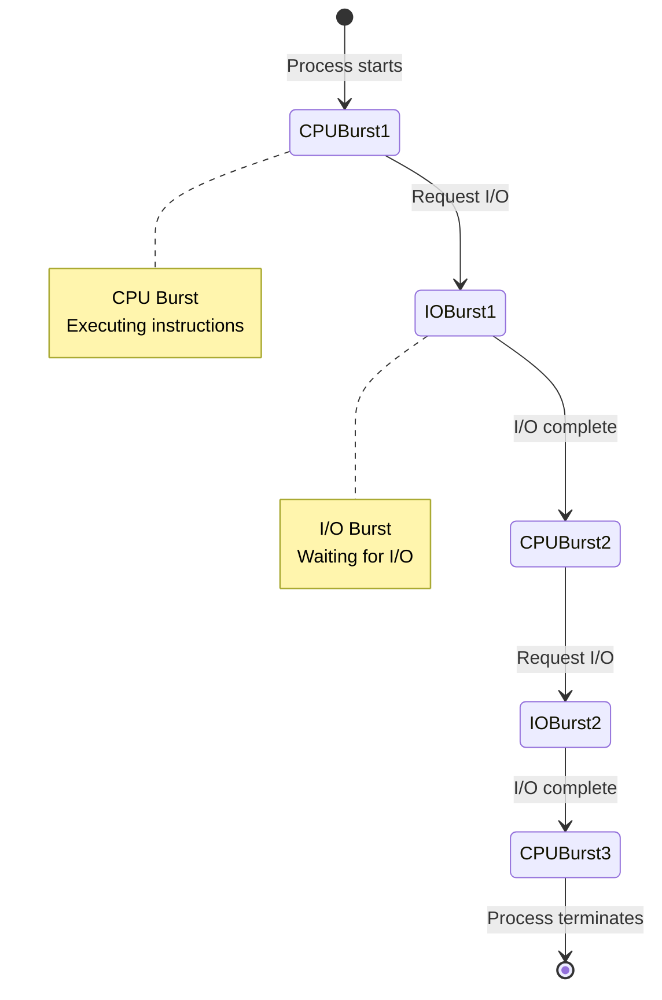
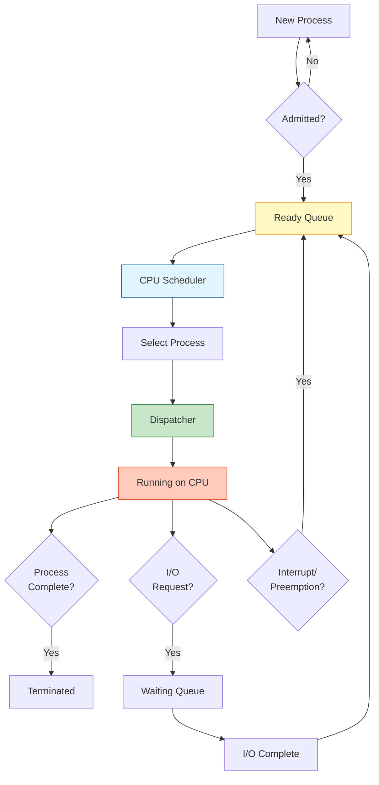
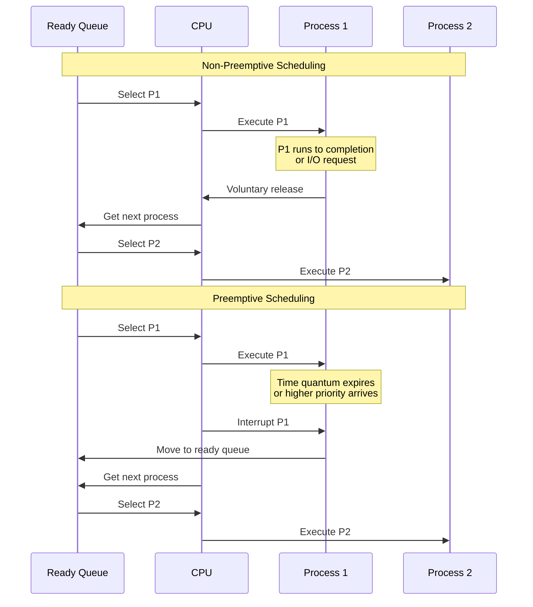
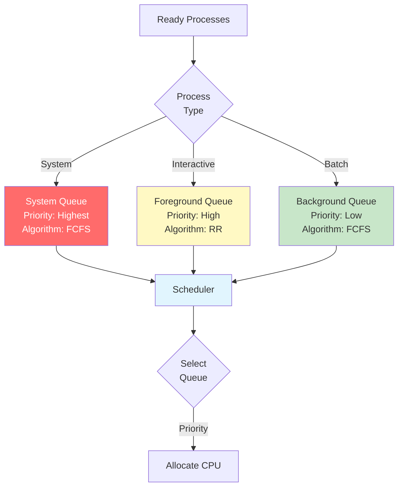
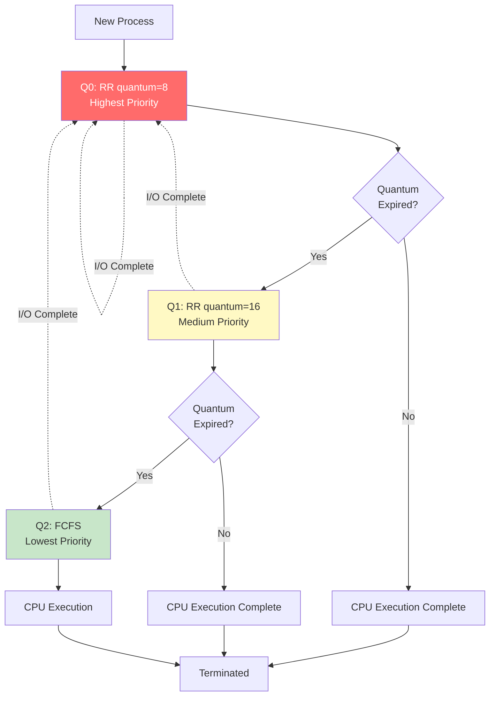
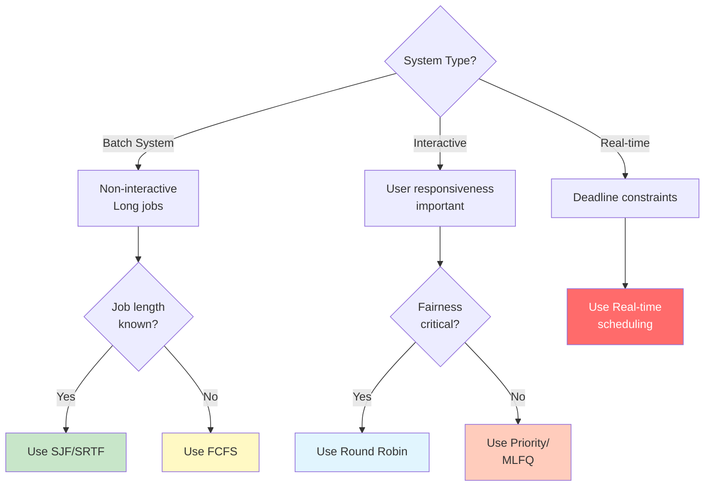
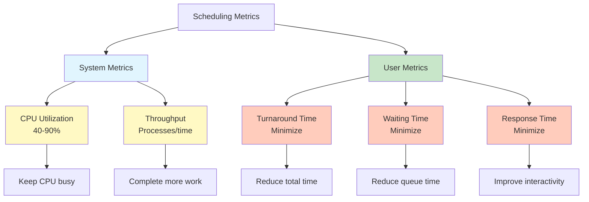

#operating-system #process-scheduling #cpu-scheduling #scheduling-algorithm #dispatcher
#linux #unix

- CPU scheduling determines which process runs on the CPU when multiple processes are ready.
- <mark class="hltr-yellow">Scheduler selects processes from the ready queue based on scheduling algorithm</mark>.
- Goal is to maximize CPU utilization and system throughput while minimizing response time.
# CPU Scheduling Concepts
## CPU-I/O Burst Cycle
- <mark class="hltr-yellow">Process execution alternates between CPU burst and I/O burst</mark>.
- CPU burst: Period of computation.
- I/O burst: Period waiting for I/O operation.
- Process terminates after final CPU burst.
### Burst Cycle


## CPU Scheduler
- <mark class="hltr-yellow">Selects a process from ready queue and allocates CPU</mark>.
- Invoked when:
	1. Process switches from running to waiting state (I/O request).
	2. Process switches from running to ready state (interrupt, time quantum expires).
	3. Process switches from waiting to ready state (I/O completion).
	4. Process terminates.
- Scheduling decisions at points 1 and 4 are non-preemptive.
- Scheduling decisions at points 2 and 3 are preemptive.

## Dispatcher
- <mark class="hltr-yellow">Module that gives control of CPU to the selected process</mark>.
- Functions:
	- Context switching between processes.
	- Switching to user mode.
	- Jumping to proper location in user program.
- Dispatch latency: Time taken to stop one process and start another.

## Scheduling Flow


# Scheduling Criteria

## CPU Utilization
- <mark class="hltr-yellow">Percentage of time CPU is executing processes</mark>.
- Goal: Maximize (keep CPU as busy as possible).
- Range: 0% to 100%.
- Typical: 40% (lightly loaded) to 90% (heavily loaded).

## Throughput
- <mark class="hltr-yellow">Number of processes completed per unit time</mark>.
- Goal: Maximize (complete more processes).
- Measured in processes per second/minute/hour.
- Depends on process length and scheduling algorithm.

## Turnaround Time
- <mark class="hltr-yellow">Time from process submission to completion</mark>.
- Goal: Minimize (reduce total time).
- Formula: `Turnaround Time = Completion Time - Arrival Time`
- Includes: Waiting time + Burst time + I/O time.

## Waiting Time
- <mark class="hltr-yellow">Time process spends in ready queue</mark>.
- Goal: Minimize (reduce waiting).
- Formula: `Waiting Time = Turnaround Time - Burst Time`
- Affected by scheduling algorithm.

## Response Time
- <mark class="hltr-yellow">Time from request submission to first response</mark>.
- Goal: Minimize (improve user experience).
- Formula: `Response Time = First Execution Time - Arrival Time`
- Important for interactive systems.

## Fairness
- <mark class="hltr-yellow">All processes get fair share of CPU time</mark>.
- Goal: Ensure no starvation.
- Balance between performance and equity.

# Preemptive vs Non-Preemptive Scheduling

## Non-Preemptive Scheduling
- <mark class="hltr-yellow">Process keeps CPU until it terminates or waits for I/O</mark>.
- No forced interruption of running process.
- Simpler implementation.
- Lower overhead (fewer context switches).
- May cause poor response time for short processes.

### Examples
- First-Come, First-Served (FCFS).
- Shortest Job First (SJF) non-preemptive.
- Priority (non-preemptive).

## Preemptive Scheduling
- <mark class="hltr-yellow">Process can be interrupted and moved to ready queue</mark>.
- CPU can be taken away from running process.
- Better response time for interactive systems.
- Higher overhead (more context switches).
- Requires synchronization mechanisms.

### Examples
- Shortest Remaining Time First (SRTF).
- Round Robin (RR).
- Priority (preemptive).
- Multilevel Feedback Queue.

## Comparison


# Scheduling Algorithms

## First-Come, First-Served (FCFS)

### Characteristics
- <mark class="hltr-yellow">Processes executed in order of arrival</mark>.
- Non-preemptive scheduling.
- Simple FIFO queue implementation.
- Easy to understand and implement.

### Advantages
- Simple and fair (arrival order).
- No starvation.
- Low scheduling overhead.

### Disadvantages
- Convoy effect (short processes wait for long ones).
- Poor average waiting time.
- Not suitable for time-sharing systems.

### Example

#### Process Information
```
Process | Arrival Time | Burst Time
--------|-------------|------------
P1      | 0           | 24
P2      | 0           | 3
P3      | 0           | 3
```

#### Gantt Chart


```mermaid
gantt
    title FCFS Scheduling
    dateFormat X
    axisFormat %s ms

    section Execution
    P1 (24ms) :crit, p1, 0, 24
    P2 (3ms)  :active, p2, 24, 3
    P3 (3ms)  :p3, 27, 3
```

#### Execution Timeline
- **0-24ms**: P1 executes (arrived first)
- **24-27ms**: P2 executes (next in queue)
- **27-30ms**: P3 executes (last in queue)

#### Waiting Time Calculation
<mark class="hltr-yellow">Waiting Time = Start Time - Arrival Time</mark>

- **P1**: `0 - 0 = 0 ms`
	- Arrives at 0, starts immediately
- **P2**: `24 - 0 = 24 ms`
	- Arrives at 0, waits for P1 to complete (24ms)
- **P3**: `27 - 0 = 27 ms`
	- Arrives at 0, waits for P1 (24ms) + P2 (3ms) = 27ms

**Average Waiting Time**: `(0 + 24 + 27) / 3 = 51 / 3 = 17 ms`

#### Turnaround Time Calculation
<mark class="hltr-yellow">Turnaround Time = Completion Time - Arrival Time</mark>

- **P1**: `24 - 0 = 24 ms`
	- Completes at 24ms
- **P2**: `27 - 0 = 27 ms`
	- Completes at 27ms
- **P3**: `30 - 0 = 30 ms`
	- Completes at 30ms

**Average Turnaround Time**: `(24 + 27 + 30) / 3 = 81 / 3 = 27 ms`

#### Analysis
- **Convoy Effect**: P2 and P3 (short processes) wait for P1 (long process)
- Poor average waiting time due to long process executing first
- If order were $P2→P3→P1$. Average waiting time $WT = \frac{0 + 3 + 6}{3} = 3 \text{ms}$ (much better!)
 
## Shortest Job First (SJF)

### Characteristics
- <mark class="hltr-yellow">Selects process with shortest burst time</mark>.
- Optimal for minimizing average waiting time.
- Can be preemptive (SRTF) or non-preemptive.
- Requires knowledge of future CPU burst length.
### Burst Time Estimation
- Cannot know exact burst time.
- Use exponential average of previous bursts.
- Formula: $τ(n+1) = α·t(n) + (1-α)·τ(n)$
	- $τ(n+1)$: Predicted next burst
	- $t(n)$: Actual length of nth burst
	- $τ(n)$: Predicted nth burst
	- $α$: Weighting factor ($0 ≤ α ≤ 1$)
### Advantages
- Optimal average waiting time.
- Good throughput for short processes.
- Efficient CPU utilization.
### Disadvantages
- Starvation of long processes.
- Difficult to predict burst time.
- Not practical without prediction.

### Example (Non-Preemptive)

#### Process Information
```
Process | Arrival Time | Burst Time
--------|-------------|------------
P1      | 0           | 6
P2      | 2           | 8
P3      | 4           | 7
P4      | 5           | 3
```

#### Gantt Chart


```mermaid
gantt
    title SJF Scheduling (Non-Preemptive)
    dateFormat X
    axisFormat %s ms

    section Execution
    P1 (6ms)  :crit, p1, 0, 6
    P4 (3ms)  :active, p4, 6, 3
    P3 (7ms)  :p3, 9, 7
    P2 (8ms)  :done, p2, 16, 8
```

#### Execution Timeline with Decision Points
- **Time 0**: Only P1 available → Select P1 (burst=6)
- **0-6ms**: P1 executes
- **Time 6**: P1 completes. Available: P2 (burst=8), P3 (burst=7), P4 (burst=3)
	- Select P4 (shortest: 3ms)
- **6-9ms**: P4 executes
- **Time 9**: P4 completes. Available: P2 (burst=8), P3 (burst=7)
	- Select P3 (shorter: 7ms)
- **9-16ms**: P3 executes
- **Time 16**: P3 completes. Available: P2 (burst=8)
	- Select P2 (only one remaining)
- **16-24ms**: P2 executes

#### Waiting Time Calculation
<mark class="hltr-yellow">Waiting Time = Start Time - Arrival Time</mark>

- **P1**: `0 - 0 = 0 ms`
	- Arrives at 0, starts immediately
- **P2**: `16 - 2 = 14 ms`
	- Arrives at 2, starts at 16
	- Waits because P4 and P3 have shorter bursts
- **P3**: `9 - 4 = 5 ms`
	- Arrives at 4, starts at 9
	- Waits for P1 to finish, then selected over P2
- **P4**: `6 - 5 = 1 ms`
	- Arrives at 5, starts at 6
	- Waits briefly for P1 to finish, then selected (shortest)

**Average Waiting Time**: `(0 + 14 + 5 + 1) / 4 = 20 / 4 = 5 ms`

#### Turnaround Time Calculation
<mark class="hltr-yellow">Turnaround Time = Completion Time - Arrival Time</mark>

- **P1**: `6 - 0 = 6 ms`
- **P2**: `24 - 2 = 22 ms`
- **P3**: `16 - 4 = 12 ms`
- **P4**: `9 - 5 = 4 ms`

**Average Turnaround Time**: `(6 + 22 + 12 + 4) / 4 = 44 / 4 = 11 ms`

#### Analysis
- Optimal average waiting time for non-preemptive scheduling
- P2 (longest job) suffers from starvation effect
- Much better than FCFS: If FCFS order (P1→P2→P3→P4): Average WT = `(0 + 4 + 10 + 15) / 4 = 7.25 ms`

## Shortest Remaining Time First (SRTF)

### Characteristics
- <mark class="hltr-yellow">Preemptive version of SJF</mark>.
- Selects process with shortest remaining burst time.
- Preempts if new process has shorter remaining time.
- Optimal for minimizing average waiting time (preemptive).

### Example
```
Processes:
P1: Arrival=0, Burst=8
P2: Arrival=1, Burst=4
P3: Arrival=2, Burst=9
P4: Arrival=3, Burst=5

Execution:
0-1: P1 (remaining: 7)
1-5: P2 (remaining: 0) - preempts P1
5-10: P4 (remaining: 0) - shortest remaining
10-17: P1 (remaining: 0)
17-26: P3 (remaining: 0)

Gantt Chart:
|P1|  P2  |  P4  |  P1   |    P3     |
0  1      5     10     17         26

Waiting Time:
P1: (1-0) + (10-1) = 10
P2: 1-1 = 0
P3: 17-2 = 15
P4: 5-3 = 2
Average: (10+0+15+2)/4 = 6.75 ms
```

## Priority Scheduling

### Characteristics
- <mark class="hltr-yellow">Each process assigned a priority number</mark>.
- Highest priority process gets CPU first.
- Can be preemptive or non-preemptive.
- Priority can be internal (time limits, memory, I/O) or external (importance, cost).

### Priority Assignment
- Lower number = Higher priority (Unix convention).
- Or Higher number = Higher priority (depends on system).
- Static priority: Fixed at process creation.
- Dynamic priority: Changes during execution.

### Problem: Starvation
- Low-priority processes may never execute.
- Solution: **Aging**
	- Gradually increase priority of waiting processes.
	- Ensures eventual execution.
### Example
```
Processes:
P1: Burst=10, Priority=3
P2: Burst=1, Priority=1
P3: Burst=2, Priority=4
P4: Burst=1, Priority=5
P5: Burst=5, Priority=2

Priority Order (1=highest):
P2 → P5 → P1 → P3 → P4

Gantt Chart:
|P2|  P5  | P1   |P3|P4|
0  1      6     16  18 19

Waiting Time:
P1: 6
P2: 0
P3: 16
P4: 18
P5: 1
Average: (6+0+16+18+1)/5 = 8.2 ms
```

## Round Robin (RR)

### Characteristics
- <mark class="hltr-yellow">Each process gets small time quantum (time slice)</mark>.
- Preemptive scheduling.
- Ready queue is circular FIFO.
- Process runs for quantum or until completion/blocking.
- Designed for time-sharing systems.

### Time Quantum Selection
- Too large: Degenerates to FCFS.
- Too small: Too many context switches (high overhead).
- Typical: 10-100 milliseconds.
- Rule of thumb: 80% of CPU bursts should be shorter than quantum.

### Advantages
- Fair allocation of CPU time.
- Good response time for interactive systems.
- No starvation.

### Disadvantages
- Higher average turnaround time than SJF.
- Context switch overhead.
- Performance depends on quantum size.

### Example (Quantum = 4)
```
Processes:
P1: Burst=24
P2: Burst=3
P3: Burst=3

Execution:
0-4: P1 (remaining: 20)
4-7: P2 (remaining: 0) - complete
7-10: P3 (remaining: 0) - complete
10-14: P1 (remaining: 16)
14-18: P1 (remaining: 12)
18-22: P1 (remaining: 8)
22-26: P1 (remaining: 4)
26-30: P1 (remaining: 0) - complete

Gantt Chart:
| P1 |P2|P3| P1 | P1 | P1 | P1 | P1 |
0    4  7 10   14   18   22   26   30

Waiting Time:
P1: (0) + (10-4) + (14-10) + (18-14) + (22-18) + (26-22) = 24
P2: 4
P3: 7
Average: (24+4+7)/3 = 11.67 ms

Turnaround Time:
P1: 30
P2: 7
P3: 10
Average: (30+7+10)/3 = 15.67 ms
```

## Multilevel Queue Scheduling

### Characteristics
- <mark class="hltr-yellow">Ready queue divided into multiple separate queues</mark>.
- Processes permanently assigned to one queue.
- Each queue has its own scheduling algorithm.
- Scheduling between queues (fixed priority or time slicing).

### Queue Classification
- **Foreground (interactive)**: Round Robin.
- **Background (batch)**: FCFS.
- **System processes**: Highest priority.
- **User processes**: Lower priority.

### Queue Structure


### Scheduling Between Queues

#### Fixed Priority Preemptive
- Serve higher priority queue first.
- Lower priority queue runs only when higher queues empty.
- Risk: Starvation of lower priority queues.

#### Time Slicing
- Each queue gets certain CPU time.
- Example: 80% foreground (RR), 20% background (FCFS).
- Prevents starvation.

### Example
```
Queues:
Q1 (System): RR with quantum=2
Q2 (Interactive): RR with quantum=4
Q3 (Batch): FCFS

Processes:
P1: Type=System, Burst=4
P2: Type=Interactive, Burst=5
P3: Type=Batch, Burst=8

Execution (Fixed Priority):
Q1: P1 (0-4)
Q2: P2 (4-9)
Q3: P3 (9-17)
```

## Multilevel Feedback Queue Scheduling

### Characteristics
- <mark class="hltr-yellow">Processes can move between queues</mark>.
- Adapts to process behavior.
- Separates processes by CPU burst characteristics.
- Most general and complex scheduling algorithm.

### Key Parameters
1. Number of queues.
2. Scheduling algorithm for each queue.
3. Method to determine when to upgrade process.
4. Method to determine when to demote process.
5. Method to determine which queue process enters.

### Typical Configuration
- Multiple queues with decreasing priority.
- Higher priority queues have smaller time quantum.
- Process starts in highest priority queue.
- If quantum expires, move to lower priority queue.
- If process blocks for I/O, stays in same or higher queue.

### Structure


### Advantages
- Flexible and adaptive.
- Favors short processes (good response time).
- Favors I/O-bound processes.
- No starvation with proper aging.

### Disadvantages
- Complex implementation.
- Difficult to tune parameters.
- Higher overhead.

### Example
```
Configuration:
Q0: RR quantum=8
Q1: RR quantum=16
Q2: FCFS

Process P1: Burst=100
Execution:
0-8: Q0 (remaining: 92) → demote to Q1
8-24: Q1 (remaining: 76) → demote to Q2
24-100: Q2 (remaining: 0) → complete

Process P2: Burst=20, I/O at 10
Execution:
0-8: Q0 (remaining: 12) → demote to Q1
Wait for P1 in Q1
After P1's Q1: 8-18 in Q1 (remaining: 10)
I/O occurs, returns to Q0
Continue in Q0: 18-28 (remaining: 2)
28-30: Complete
```

# Scheduling Algorithm Comparison

## Performance Comparison

| Algorithm | Preemptive | Avg Waiting Time | Response Time | Throughput | Starvation | Overhead |
|-----------|------------|------------------|---------------|------------|------------|----------|
| FCFS | No | Poor | Poor | Poor | No | Low |
| SJF | No | Optimal (NP) | Poor | Good | Yes | Low |
| SRTF | Yes | Optimal (P) | Good | Good | Yes | Medium |
| Priority | Both | Varies | Varies | Good | Yes | Low-Medium |
| RR | Yes | Fair | Good | Fair | No | Medium |
| MLQ | Yes | Good | Good | Good | Possible | Medium |
| MLFQ | Yes | Very Good | Very Good | Very Good | No | High |

## Selection Criteria


# Real-Time Scheduling

## Real-Time Systems
- <mark class="hltr-yellow">Correctness depends on both result and time</mark>.
- Deadlines must be met.
- Two types: Hard real-time and Soft real-time.

## Hard Real-Time Systems
- <mark class="hltr-yellow">Missing deadline is catastrophic failure</mark>.
- Guaranteed completion within time constraint.
- Examples: Aircraft control, medical devices, nuclear reactors.
- Requires: Deterministic behavior, predictable execution time.

## Soft Real-Time Systems
- <mark class="hltr-yellow">Missing deadline degrades performance but acceptable</mark>.
- High priority for critical processes.
- Examples: Video streaming, online gaming, VoIP.
- More flexible than hard real-time.

## Real-Time Scheduling Algorithms

### Rate Monotonic Scheduling (RMS)
- Static priority algorithm.
- <mark class="hltr-yellow">Priority inversely proportional to period</mark>.
- Shorter period = Higher priority.
- Optimal for static priority algorithms.

### Earliest Deadline First (EDF)
- Dynamic priority algorithm.
- <mark class="hltr-yellow">Priority based on deadline (earliest deadline = highest priority)</mark>.
- Preemptive.
- Optimal for single processor.

### Example (EDF)
```
Tasks:
T1: Period=50, Execution=25
T2: Period=80, Execution=35

Timeline (showing deadlines):
T1 deadlines: 50, 100, 150
T2 deadlines: 80, 160

Execution order:
0-25: T1 (deadline 50)
25-60: T2 (deadline 80)
60-85: T1 (deadline 100)
85-100: T2 (deadline 160)
```

# Thread Scheduling

## User-Level Threads
- Kernel unaware of threads.
- Thread library schedules threads to available LWPs.
- Fast context switch (no kernel involvement).
- Cannot use multiple processors effectively.

## Kernel-Level Threads
- Kernel schedules threads directly.
- Can schedule threads on different processors.
- Slower context switch (kernel mode required).
- Better multiprocessor utilization.

## Scheduling Contention Scope

### Process-Contention Scope (PCS)
- Competition among threads in same process.
- User-level thread scheduling.
- Scheduled onto available LWPs.

### System-Contention Scope (SCS)
- Competition among all threads in system.
- Kernel-level thread scheduling.
- Scheduled onto available CPUs.

# Multiprocessor Scheduling

## Symmetric Multiprocessing (SMP)
- <mark class="hltr-yellow">Each processor is self-scheduling</mark>.
- Common ready queue or per-processor ready queues.
- Requires synchronization for queue access.

## Processor Affinity
- <mark class="hltr-yellow">Process tends to run on same processor</mark>.
- Soft affinity: OS attempts to keep process on same processor.
- Hard affinity: Process explicitly bound to processor.
- Reason: Cache warm-up avoidance.

## Load Balancing
- <mark class="hltr-yellow">Distribute work evenly across processors</mark>.
- Push migration: Periodic check and move processes.
- Pull migration: Idle processor pulls waiting task.
- Conflicts with processor affinity.

## Multicore Processors
- Multiple cores on single chip.
- Memory stall: Processor waits for memory access.
- Solution: Hardware threads (hyperthreading).
- Each core has multiple hardware threads.
- While one thread stalls, another executes.

# Linux CPU Scheduling

## Completely Fair Scheduler (CFS)
- Default scheduler since Linux 2.6.23.
- <mark class="hltr-yellow">Gives each process fair share of CPU time</mark>.
- Uses red-black tree for ready queue.
- Selects task with smallest virtual runtime.

## Virtual Runtime
- Track how long process has run.
- Formula: `vruntime = actual_runtime × (NICE_0_LOAD / weight)`
- Lower weight (higher priority) → slower vruntime increase.
- Process with smallest vruntime selected next.

## Nice Values
- Range: -20 (highest priority) to +19 (lowest priority).
- Default: 0.
- Affects weight calculation.
- Root can decrease nice value, users can only increase.

## Real-Time Scheduling
- SCHED_FIFO: First-In, First-Out real-time.
- SCHED_RR: Round-Robin real-time.
- SCHED_DEADLINE: Deadline-based real-time (Linux 3.14+).
- Higher priority than CFS.

# Scheduling in Practice

## Unix/Linux Scheduling Example
```bash
# View process priorities
ps -el

# Change process nice value
nice -n 10 ./myprogram     # Start with nice=10
renice -n 5 -p 1234        # Change running process

# Set CPU affinity
taskset -c 0,1 ./myprogram # Run on CPUs 0 and 1
```

## Windows Scheduling
- Priority-based preemptive scheduling.
- 32 priority levels (0-31).
- Real-time priorities: 16-31.
- Variable priorities: 0-15.
- Dynamic priority adjustment.
- Priority boost for I/O completion, foreground processes.

## macOS Scheduling
- Mach kernel with multilevel feedback queue.
- 128 priority levels.
- Time-sharing and real-time classes.
- Automatic priority adjustment.

# Scheduling Performance Analysis

## Gantt Chart
- Visual representation of process execution timeline.
- Shows: Process execution order, start time, completion time.
- Useful for analyzing scheduling algorithms.
## Example Analysis (Comparison)

```mermaid
gantt
    title CPU Scheduling Comparison (P1=10ms, P2=5ms, P3=8ms | Arrival=0)
    dateFormat X
    axisFormat %s ms

    %% --- FCFS ---
    section FCFS (Wait: 8.33, TA: 16)
    P1 (10) :crit, p1f, 0, 10
    P2 (5)  :active, p2f, after p1f, 5
    P3 (8)  :p3f, after p2f, 8

    %% --- SJF ---
    section SJF (Wait: 6, TA: 13.67)
    P2 (5)  :active, p2s, 0, 5
    P3 (8)  :p3s, after p2s, 8
    P1 (10) :crit, p1s, after p3s, 10

    %% --- Round Robin ---
    section RR Q=2 (Wait: 9.67, TA: 17.33)
    P1 :crit, r1a, 0, 2
    P2 :active, r2a, after r1a, 2
    P3 :r3a, after r2a, 2
    P1 :crit, r1b, after r3a, 2
    P2 :active, r2b, after r1b, 2
    P3 :r3b, after r2b, 2
    P1 :crit, r1c, after r3b, 2
    P2 (Done) :active, r2c, after r1c, 1
    P3 :r3c, after r2c, 2
    P1 :crit, r1d, after r3c, 2
    P3 (Done) :r3d, after r1d, 2
    P1 (Done) :crit, r1e, after r3d, 2
```


```
Processes:
P1: Arrival=0, Burst=10
P2: Arrival=0, Burst=5
P3: Arrival=0, Burst=8

FCFS:
|    P1    | P2  |   P3   |
0         10    15       23
Avg Waiting: (0+10+15)/3 = 8.33 ms
Avg Turnaround: (10+15+23)/3 = 16 ms

SJF:
| P2  |   P3   |    P1    |
0     5       13         23
Avg Waiting: (5+0+13)/3 = 6 ms
Avg Turnaround: (5+13+23)/3 = 13.67 ms

RR (Quantum=2):
|P1|P2|P3|P1|P2|P3|P1|P2|P3|P1|P3|P1|
0  2  4  6  8 10 12 14 15 17 19 21 23
Avg Waiting: (13+6+10)/3 = 9.67 ms
Avg Turnaround: (23+11+18)/3 = 17.33 ms
```

## Performance Metrics Summary


***
# References
1. Operating System Concepts - Abraham Silberschatz - 10th - 2018 - Pearson Publisher.
	1. Chapter 5: CPU Scheduling.
		1. Section 5.1: Basic Concepts.
		2. Section 5.2: Scheduling Criteria.
		3. Section 5.3: Scheduling Algorithms.
		4. Section 5.4: Thread Scheduling.
		5. Section 5.5: Multi-Processor Scheduling.
		6. Section 5.6: Real-Time CPU Scheduling.
2. Modern Operating Systems - Andrew S. Tanenbaum - 4th - 2014 - Pearson.
	1. Chapter 2: Processes and Threads.
		1. Section 2.4: Scheduling.
3. Operating Systems: Internals and Design Principles - William Stallings - 9th - 2018 - Pearson.
	1. Chapter 9: Uniprocessor Scheduling.
	2. Chapter 10: Multiprocessor and Real-Time Scheduling.
4. Operating Systems: Three Easy Pieces - Remzi H. Arpaci-Dusseau - 1st - 2018 - Arpaci-Dusseau Books.
	1. Chapter 7: Scheduling: Introduction.
	2. Chapter 8: Scheduling: The Multi-Level Feedback Queue.
5. Linux Kernel Documentation - CPU Scheduling.
	1. https://www.kernel.org/doc/html/latest/scheduler/
6. https://en.wikipedia.org/wiki/Scheduling_(computing)
