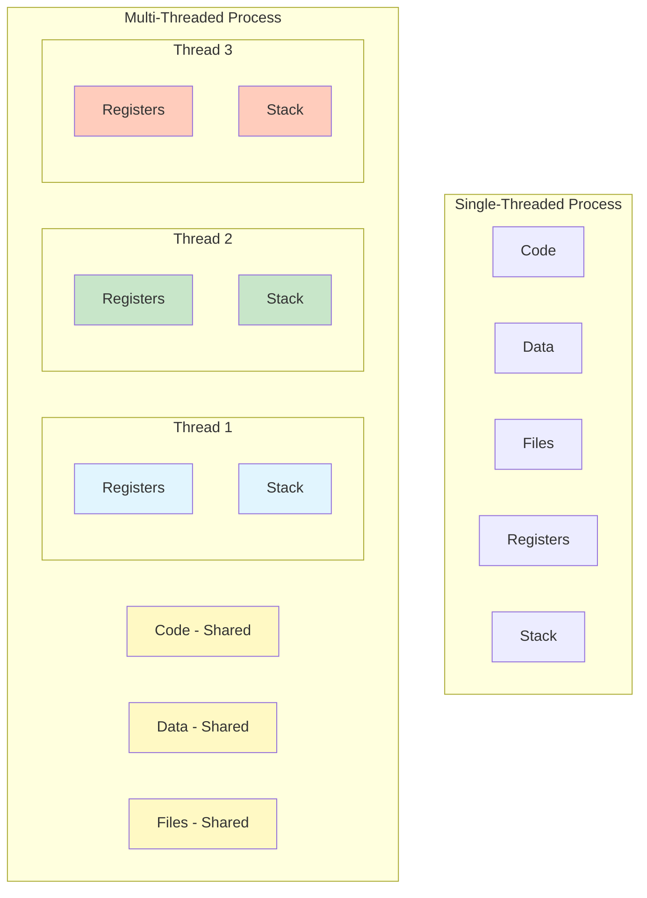
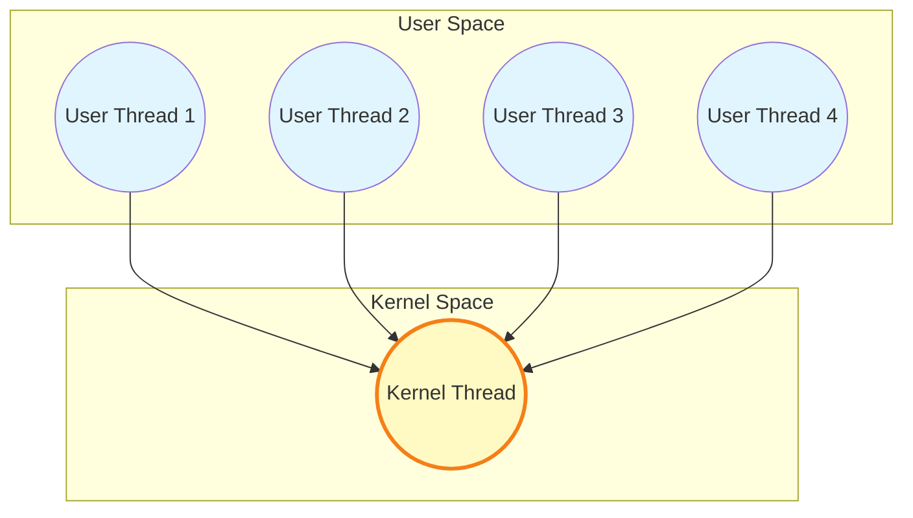
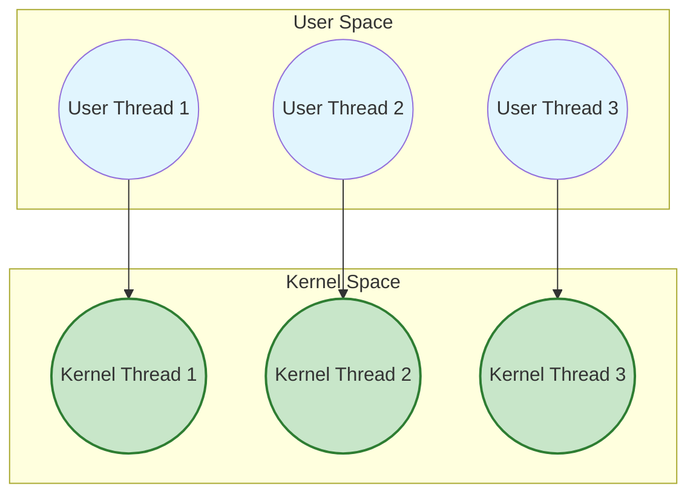
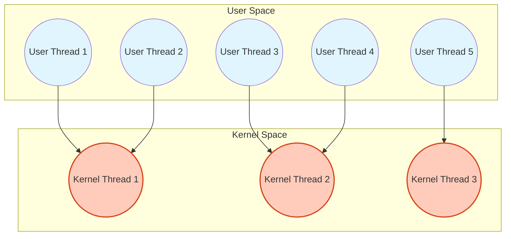
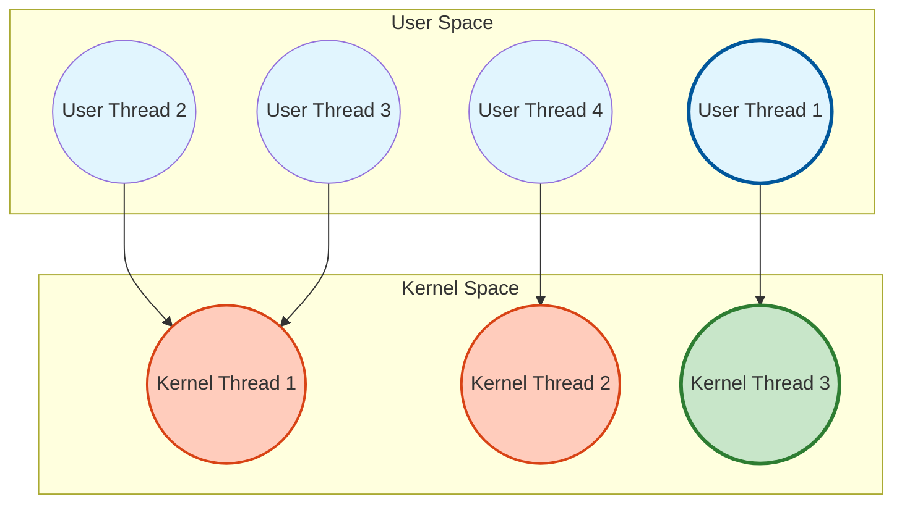

#process #operating-system #thread #parallel-programming #concurrency

# Concepts
- Each CPU core can run <mark class="hltr-yellow">only one thread at a time</mark>.
- <mark class="hltr-yellow">Basic unit</mark> of CPU utilization.
- A lightweight process: multiple threads can <mark class="hltr-yellow">share a process's code section, data section and executable file</mark>, but each thread has its <mark class="hltr-yellow">own register, program counter and stack section</mark>.

## Thread Components
- **Thread ID** - Unique identifier for the thread.
- **Program Counter (PC)** - Points to the next instruction to execute.
- **Register Set** - Current working variables and CPU state.
- **Stack** - Execution history containing local variables and function call frames.

## Shared Resources
Threads within the same process share:
- **Code section** - Executable instructions.
- **Data section** - Global and static variables.
- **Heap** - Dynamically allocated memory.
- **Operating system resources** - Open files, signals, process ID.

## Single-Threaded vs Multi-Threaded Process


## Benefits of Multi-Threading
1. **Responsiveness** - Program continues running even if part is blocked.
2. **Resource sharing** - Threads share memory and resources; more efficient than process creation.
3. **Economy** - Thread creation and context switching cheaper than processes.
4. **Scalability** - Utilizes multi-core architectures effectively.
## Challenges
1. **Dividing activities** - Identifying tasks that can run in parallel.
2. **Balance** - Ensuring tasks perform equal work of equal value.
3. **Data splitting** - Dividing data to run on separate cores.
4. **Data dependency** - Ensuring tasks are synchronized when they depend on data from other tasks.
5. **Testing and debugging** - More difficult due to non-deterministic execution.

# Multi-threading Models
- Relationship between user threads and kernel threads.
- User threads managed by user-level thread library.
- Kernel threads supported and managed by the operating system kernel.

## Many-to-One Model


- Many user threads are mapped to <mark class="hltr-yellow">only one kernel thread</mark>.
- One thread is blocked $\Rightarrow$ <mark class="hltr-yellow">all threads will be blocked</mark>.
- Cannot run in parallel on multiple cores.
- Thread management done in user space; efficient.
- Not common in modern systems.
- Example: Green threads in old Java versions.

### Characteristics
- **Advantages**: Efficient thread management; minimal kernel overhead.
- **Disadvantages**: No parallelism; blocking system call blocks all threads.

## One-to-One Model


- Each user thread mapped to <mark class="hltr-yellow">one kernel thread</mark>.
- <mark class="hltr-yellow">Most popular</mark> model in modern systems.
- Too many threads $\Rightarrow$ <mark class="hltr-yellow">poor performance</mark> (kernel overhead).
- Provides concurrency and parallelism.
- Examples: Linux, Windows.

### Characteristics
- **Advantages**: True parallelism on multicore; one blocking thread doesn't affect others.
- **Disadvantages**: Creating kernel thread overhead; systems may limit number of threads.

## Many-to-Many Model


- Many user threads are mapped to <mark class="hltr-yellow">many kernel threads</mark>.
- Allows operating system to create sufficient number of kernel threads.
- Not common in modern systems.
- Provides both concurrency and parallelism.
- Example: Solaris prior to version 9.

### Characteristics
- **Advantages**: Flexibility; can have more user threads than kernel threads; good balance.
- **Disadvantages**: Complex implementation; difficult to implement efficiently.

## Two-Level Model


- Variation of many-to-many model.
- Allows user thread to be bound to specific kernel thread.
- Example: IRIX, HP-UX, Tru64 UNIX.

# Thread Libraries
- Provides API for creating and managing threads.
- Two primary implementation approaches:
	1. **User-level library** - Code and data structures in user space.
	2. **Kernel-level library** - Code and data structures in kernel space.

## POSIX Pthreads
- May be provided as user-level or kernel-level library.
- Standard API for thread creation and synchronization.
- Common in UNIX-like systems.

## Windows Threads
- Kernel-level library.
- One-to-one model implementation.

## Java Threads
- Managed by JVM.
- Implementation depends on underlying OS.

# Preemptive vs Non-Preemptive Threads
## Non-Preemptive (Cooperative) Threading
- Thread runs until it <mark class="hltr-yellow">voluntarily yields control</mark>.
- Thread decides when to give up CPU.
- Simpler to implement; no need for complex synchronization.
- Risk: One thread can monopolize CPU.

### Characteristics
- Thread must explicitly call yield() or block on I/O.
- No timer interrupts force context switch.
- More predictable behavior.
- Example: User-level thread libraries with cooperative scheduling.

## Preemptive Threading
- Operating system can <mark class="hltr-yellow">forcibly interrupt thread execution</mark>.
- <mark class="hltr-yellow">Timer interrupt triggers context switch</mark>.
- Ensures fair CPU time distribution.
- Requires synchronization primitives to prevent race conditions.

### Characteristics
- OS scheduler decides when to switch threads.
- Uses timer interrupts for time slicing.
- More responsive system.
- Example: Modern operating systems (Linux, Windows).

## Comparison
| Aspect | Non-Preemptive | Preemptive |
|--------|----------------|------------|
| Control | Thread voluntarily yields | OS forcibly interrupts |
| Fairness | Depends on thread cooperation | OS ensures fairness |
| Synchronization | Simpler | More complex |
| Responsiveness | Lower | Higher |
| Implementation | Simpler | More complex |

# Thread Cancellation
- Terminating a thread before it completes.
- Two general approaches:

## Asynchronous Cancellation
- Thread terminates target thread immediately.
- May leave resources in inconsistent state.
- Difficult to clean up properly.

## Deferred Cancellation
- Target thread periodically checks if it should terminate.
- Thread can clean up resources properly.
- <mark class="hltr-yellow">Safer approach</mark>.

# Thread-Local Storage (TLS)
- Allows each thread to have its own copy of data.
- Different from local variables:
	- Local variables visible only during function invocation.
	- TLS visible across entire function invocations.
- Useful when you don't have control over thread creation process.

# Implementation
## Thread Creation with Pthreads
```c title='Basic pthread creation and joining' hl=17-18,24-25
#include <pthread.h>
#include <stdio.h>
#include <stdlib.h>

/* Thread function */
void* thread_function(void* arg) {
    int thread_num = *((int*)arg);
    printf("Thread %d: Running\n", thread_num);

    // Simulate work
    int sum = 0;
    for (int i = 0; i < 1000000; i++) {
        sum += i;
    }

    printf("Thread %d: Completed, sum=%d\n", thread_num, sum);
    pthread_exit(NULL);
}

int main() {
    pthread_t threads[3];
    int thread_args[3];

    // Create threads
    for (int i = 0; i < 3; i++) {
        thread_args[i] = i;
        if (pthread_create(&threads[i], NULL, thread_function,
                          &thread_args[i]) != 0) {
            perror("pthread_create failed");
            exit(1);
        }
        printf("Main: Created thread %d\n", i);
    }

    // Wait for threads to complete
    for (int i = 0; i < 3; i++) {
        pthread_join(threads[i], NULL);
        printf("Main: Thread %d joined\n", i);
    }

    printf("Main: All threads completed\n");
    return 0;
}
```

## Thread Synchronization with Mutex
```c title='Thread synchronization using mutex' hl=13-14,18-19
#include <pthread.h>
#include <stdio.h>

int shared_counter = 0;
pthread_mutex_t mutex = PTHREAD_MUTEX_INITIALIZER;

void* increment_counter(void* arg) {
    for (int i = 0; i < 100000; i++) {
        // Critical section - must be protected
        pthread_mutex_lock(&mutex);
        shared_counter++;
        pthread_mutex_unlock(&mutex);
    }
    return NULL;
}

int main() {
    pthread_t t1, t2;

    // Create two threads
    pthread_create(&t1, NULL, increment_counter, NULL);
    pthread_create(&t2, NULL, increment_counter, NULL);

    // Wait for completion
    pthread_join(t1, NULL);
    pthread_join(t2, NULL);

    printf("Final counter value: %d\n", shared_counter);
    pthread_mutex_destroy(&mutex);

    return 0;
}
```

## Thread with Return Value
```c title='Returning value from thread' hl=8-9,25-27
#include <pthread.h>
#include <stdio.h>
#include <stdlib.h>

void* calculate_sum(void* arg) {
    int n = *((int*)arg);
    int* result = malloc(sizeof(int));

    *result = 0;
    for (int i = 1; i <= n; i++) {
        *result += i;
    }

    pthread_exit((void*)result);
}

int main() {
    pthread_t thread;
    int n = 100;
    int* result;

    pthread_create(&thread, NULL, calculate_sum, &n);

    // Wait and get return value
    pthread_join(thread, (void**)&result);

    printf("Sum of 1 to %d = %d\n", n, *result);
    free(result);

    return 0;
}
```

***
# References
1. Operating System Concepts - Abraham Silberschatz - Wiley Publisher - 10th - 2018.
	1. Chapter 4. Threads & Concurrency.
		1. Section 4.1: Overview.
		2. Section 4.2: Multicore Programming.
		3. Section 4.3: Multithreading Models.
		4. Section 4.4: Thread Libraries.
		5. Section 4.5: Implicit Threading.
		6. Section 4.6: Threading Issues.
2. Modern Operating Systems - Andrew S. Tanenbaum - 4th Edition - 2014 - Pearson.
	1. Chapter 2: Processes and Threads.
		1. Section 2.2: Threads.
3. https://en.wikipedia.org/wiki/Thread_(computing)
