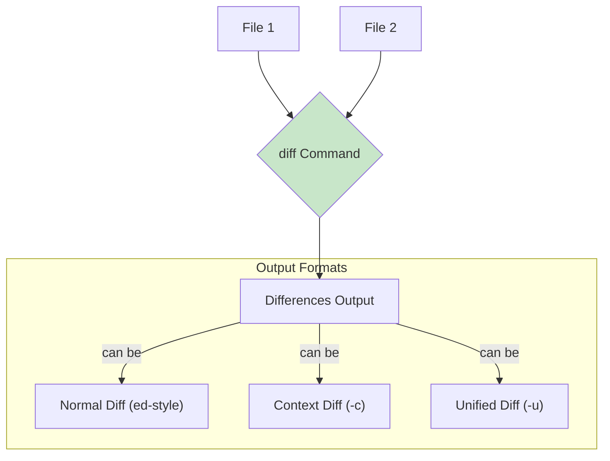

#linux #shell #unix #ubuntu #operating-system #fedora #centos-stream #rhel
# Basic Concepts
- The `diff` command is a standard Unix utility used to determine the differences between two files, or between two directories containing files. It analyzes files line by line and outputs the changes required to transform the first file into the second.
- Formally, `diff` performs a line-by-line comparison, highlighting lines that have been added, deleted, or changed. Its output is often used in version control systems, for code reviews, or to create patch files that can be applied to update one file to match another.

### Execution Model



# Basic Syntax
```Shell title="diff command structure"
diff [OPTION]... FILES
```

**Common Options**:
- `-u`, `--unified`: Output in unified format (default in many modern contexts). Shows differing lines with a few lines of context.
- `-c`, `--context`: Output in context format. Shows differing lines with several lines of context.
- `-y`, `--side-by-side`: Output in two columns.
- `-r`, `--recursive`: Compare any subdirectories found.
- `-N`, `--new-file`: Treat absent files as empty. Useful when comparing directories where one might have files the other doesn't.
- `-q`, `--brief`: Report only whether files differ, not the details of the differences.
- `-i`, `--ignore-case`: Ignore changes in case; consider 'A' and 'a' as identical.
- `-w`, `--ignore-all-space`: Ignore all whitespace when comparing lines.
- `-b`, `--ignore-space-change`: Ignore changes in the amount of whitespace (e.g., 'a b' vs 'a   b').
- `-a`, `--text`: Treat all files as text files, even if they appear binary.

## Default Output (Normal Diff)
- The default output format uses `a` (add), `d` (delete), and `c` (change) markers to indicate differences.

```Shell title="Normal diff output"
# file1.txt:
# apple
# banana
# cherry

# file2.txt:
# apple
# orange
# cherry
# grape

diff file1.txt file2.txt
# Output:
# 2c2,3
# < banana
# ---
# > orange
# > grape
```
- `2c2,3`: Line 2 in file1 changed to lines 2 and 3 in file2.
- `<`: Line from file1.
- `>`: Line from file2.

# Practical Use Cases

## Unified Diff (`-u`)
- This is generally the most readable format. It shows differences in a compact way, with changed lines marked by `+` (added) or `-` (deleted) and context lines starting with a space.

```Shell title="Unified diff output"
# file1.txt:
# apple
# banana
# cherry

# file2.txt:
# apple
# orange
# cherry
# grape

diff -u file1.txt file2.txt
# Output:
# --- file1.txt	2023-01-01 10:00:00.000000000 +0000
# +++ file2.txt	2023-01-01 10:05:00.000000000 +0000
# @@ -1,3 +1,4 @@
#  apple
# -banana
# +orange
#  cherry
# +grape
```

## Comparing Directories (`-r`)
- Use `diff -r` to find differences between two directories.

```Shell title="Comparing contents of directories"
# dir1/file.txt
# dir2/file.txt (modified)
# dir2/new_file.txt

diff -r dir1 dir2
# Output will show differences for file.txt and report new_file.txt in dir2
```

## Ignoring Whitespace Changes (`-w`, `-b`)
- Often, changes in leading/trailing spaces or the amount of internal whitespace are not significant.

```Shell title="Ignoring whitespace"
# file_a.txt:
# hello world
#  another line

# file_b.txt:
# hello   world
# another line

diff file_a.txt file_b.txt
# Output shows differences

diff -w file_a.txt file_b.txt
# No output, as -w ignores all whitespace differences
```

## Creating a Patch File (`-u > patchfile`)
- The unified diff output can directly serve as a patch file, which can then be applied using the `patch` command.

```Shell title="Generate and apply a patch"
# Create a patch from file1.txt to file2.txt
diff -u file1.txt file2.txt > mychanges.patch

# To revert file2.txt to file1.txt state:
# patch -R file2.txt < mychanges.patch

# To apply changes to file1.txt to make it like file2.txt:
# cp file1.txt file1_original.txt
# patch file1.txt < mychanges.patch
```

## Handling Common Issues

### Binary Files
- `diff` is designed for text files. When comparing binary files, it typically reports "Binary files X and Y differ".
- **Solution**: For a simple yes/no check, use `diff -q` (brief). For a byte-by-byte comparison, use `cmp`.

### Large Differences
- When files have undergone extensive changes, `diff` output can be very long and difficult to parse. 
- **Solution**: Consider using visual diff tools (like `meld`, `kdiff3`, or IDE integrations) or focus on smaller, incremental changes.

### Line Endings
- Differences in line endings (e.g., Windows CR LF vs. Unix LF) can cause `diff` to report every line as changed.
- **Solution**: Convert line endings before comparison using tools like `dos2unix` or `sed 's/\r$//'`).

***
# References
1. GNU `diff` Manual: https://www.gnu.org/software/diffutils/manual/html_node/diff-invocation.html
2. POSIX `diff` Specification.

