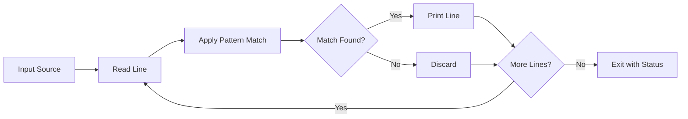

#linux #unix #shell #text-viewer #pager #file-system #windows #wsl #fedora #ubuntu #centos-stream #rhel
# Basic Concepts
- `grep` (Global Regular Expression Print) searches text using patterns and prints matching lines. It processes input line-by-line, applying pattern matching algorithms to identify lines containing specified patterns.
### Execution Model

- **Pattern**: Regular expression or fixed string to search for
- **Input Source**: Files, standard input, or command output
- **Matching Engine**: Implements pattern matching algorithms (Boyer-Moore, Aho-Corasick)
- **Exit Status**: Returns $0$ if matches found, $1$ if no matches, $2$ on error
# Basic Syntax
```Shell title="grep command structure"
grep [OPTIONS] PATTERN [FILE...]           # Search for pattern in files
grep [OPTIONS] -e PATTERN1 -e PATTERN2 FILE  # Multiple patterns
grep [OPTIONS] -f pattern_file FILE        # Patterns from file
COMMAND | grep [OPTIONS] PATTERN           # Filter command output
```
**Core Options**:
- `-i` - Case-insensitive search
- `-v` - Invert match (non-matching lines)
- `-n` - Show line numbers
- `-c` - Count matching lines
- `-l` - List filenames with matches
- `-L` - List filenames without matches
- `-w` - Match whole words only
- `-x` - Match whole lines only
- `-r` or `-R` - Recursive directory search
## Pattern Types
### Fixed Strings
- Use `-F` (or `fgrep`) for literal string matching without regex interpretation.
```Shell title="Fixed string search"
grep -F 'literal.text' file.txt          # Dot is literal, not regex
grep -F '$100.00' prices.txt              # Dollar sign is literal
fgrep 'string' file.txt                   # Alias for grep -F
```
### Basic Regular Expressions (BRE)
- Default pattern type in standard `grep`.
```Shell title="Basic regex patterns"
grep '^start' file.txt                    # Lines starting with "start"
grep 'end$' file.txt                      # Lines ending with "end"
grep '^$' file.txt                        # Empty lines
grep '[0-9]' file.txt                     # Lines containing digits
grep 'a\.b' file.txt                      # Literal dot (escaped)
grep '\<word\>' file.txt                  # Whole word match
```
### Extended Regular Expressions (ERE)
- Use `-E` (or `egrep`) for extended regex without escaping special characters.
```Shell title="Extended regex patterns"
grep -E 'pattern1|pattern2' file.txt      # Alternation
grep -E '[0-9]{3}-[0-9]{4}' file.txt      # Repetition (no escaping)
grep -E '(ab)+' file.txt                  # Group repetition
grep -E '^(https?|ftp)://' urls.txt       # Protocol matching
egrep 'pattern' file.txt                  # Alias for grep -E
```
### Perl-Compatible Regular Expressions (PCRE)
- Use `-P` for advanced regex features (GNU grep only).
```Shell title="PCRE patterns"
grep -P '\d{3}-\d{4}' file.txt            # Digit shorthand
grep -P '(?<=@)\w+' emails.txt            # Positive lookbehind
grep -P '^\w+(?=:)' config.txt            # Positive lookahead
grep -P '\w+(?<!s)' file.txt              # Negative lookbehind
```
# Pattern Matching
## Character Classes
```Shell title="Character class patterns"
grep '[aeiou]' file.txt                   # Any vowel
grep '[^aeiou]' file.txt                  # Non-vowels
grep '[a-z]' file.txt                     # Lowercase letters
grep '[A-Z]' file.txt                     # Uppercase letters
grep '[0-9]' file.txt                     # Digits
grep '[a-zA-Z0-9]' file.txt              # Alphanumeric
grep '[[:digit:]]' file.txt               # POSIX digit class
grep '[[:alpha:]]' file.txt               # POSIX alpha class
grep '[[:alnum:]]' file.txt               # POSIX alphanumeric
grep '[[:space:]]' file.txt               # Whitespace characters
grep '[[:punct:]]' file.txt               # Punctuation
```
## Quantifiers
```Shell title="Repetition patterns"
grep 'a*' file.txt                        # Zero or more 'a'
grep 'a\+' file.txt                       # One or more 'a' (BRE)
grep -E 'a+' file.txt                     # One or more 'a' (ERE)
grep 'a\?' file.txt                       # Zero or one 'a' (BRE)
grep -E 'a?' file.txt                     # Zero or one 'a' (ERE)
grep -E 'a{3}' file.txt                   # Exactly 3 'a'
grep -E 'a{3,}' file.txt                  # 3 or more 'a'
grep -E 'a{3,5}' file.txt                 # Between 3 and 5 'a'
```
## Anchors and Boundaries
```Shell title="Position matching"
grep '^start' file.txt                    # Line start
grep 'end$' file.txt                      # Line end
grep '^exact line$' file.txt              # Exact line match
grep '\<word' file.txt                    # Word boundary (start)
grep 'word\>' file.txt                    # Word boundary (end)
grep '\<word\>' file.txt                  # Whole word
grep -E '\bword\b' file.txt               # Word boundary (ERE)
grep -P '^(?=.*word1)(?=.*word2)' file.txt  # Multiple words (any order, PCRE)
```
## Groups and Backreferences
```Shell title="Capture groups"
grep '\(pattern\)' file.txt               # Group (BRE)
grep -E '(pattern)' file.txt              # Group (ERE)
grep '\(.\)\1' file.txt                   # Repeated character (BRE)
grep -E '(.)\1' file.txt                  # Repeated character (ERE)
grep -E '^(.*):\1$' file.txt              # Line with repeated pattern
grep -E '(red|blue|green)' file.txt       # Alternation
```
# Common Options
## Output Control
```Shell title="Control output format"
grep -n 'pattern' file.txt                # Show line numbers
grep -H 'pattern' *.txt                   # Show filename (default with multiple files)
grep -h 'pattern' *.txt                   # Hide filename
grep -c 'pattern' file.txt                # Count matching lines
grep -o 'pattern' file.txt                # Show only matched part
grep -q 'pattern' file.txt                # Quiet mode (exit status only)
grep -s 'pattern' file.txt                # Suppress error messages
grep --color=always 'pattern' file.txt    # Force color output
grep --color=auto 'pattern' file.txt      # Color when outputting to terminal
```
## Context Lines
```Shell title="Display surrounding lines"
grep -A 3 'pattern' file.txt              # Show 3 lines after match
grep -B 3 'pattern' file.txt              # Show 3 lines before match
grep -C 3 'pattern' file.txt              # Show 3 lines before and after
grep -A 2 -B 2 'pattern' file.txt         # 2 lines before and after
grep -C 5 --color 'ERROR' app.log         # Context with highlighting
```
## File Selection
```Shell title="Filter files to search"
grep -l 'pattern' *.txt                   # List files with matches
grep -L 'pattern' *.txt                   # List files without matches
grep --include="*.log" -r 'ERROR' /var/log  # Search only .log files
grep --exclude="*.bak" -r 'pattern' dir   # Exclude .bak files
grep --exclude-dir="node_modules" -r 'pattern' .  # Exclude directories
grep -r --exclude-from=exclude.txt 'pattern' dir  # Exclude from file
```
## Recursive Search
```Shell title="Search directory trees"
grep -r 'pattern' /path/to/dir            # Recursive search
grep -R 'pattern' /path/to/dir            # Recursive (follow symlinks)
grep -r -n 'pattern' .                    # Recursive with line numbers
grep -r -l 'pattern' src/                 # List matching files
grep -r --include="*.js" 'function' src/  # Search only JavaScript files
grep -rn --color 'TODO' project/          # Recursive with colors and line numbers
```
## Matching Control
```Shell title="Refine matching behavior"
grep -i 'pattern' file.txt                # Case-insensitive
grep -v 'pattern' file.txt                # Invert match (exclude)
grep -w 'word' file.txt                   # Match whole words only
grep -x 'exact line' file.txt             # Match whole lines only
grep -m 5 'pattern' file.txt              # Stop after 5 matches
grep -f patterns.txt file.txt             # Patterns from file (one per line)
grep -e 'pat1' -e 'pat2' file.txt         # Multiple patterns (OR logic)
```
# Advanced Features
## Multiple Patterns
```Shell title="Combine multiple patterns"
grep -e 'ERROR' -e 'WARN' app.log         # Lines with ERROR or WARN
grep 'pattern1' file | grep 'pattern2'    # Lines with both (AND logic)
grep -E 'ERROR|WARN|FATAL' app.log        # Alternation (ERE)
grep -f pattern_list.txt file.txt         # Patterns from file

# Complex AND logic
grep 'pattern1' file | grep 'pattern2' | grep 'pattern3'

# OR with different options
grep -E '^(ERROR|WARN)' app.log
```
## Binary Files
```Shell title="Handle binary files"
grep -a 'text' binary_file                # Treat as text
grep -I 'pattern' *                       # Skip binary files
grep --binary-files=text 'pattern' file   # Process binary as text
grep --binary-files=without-match 'pattern' *  # Skip binary
```
## Performance Optimization
```Shell title="Optimize grep operations"
grep -F 'fixed_string' large_file         # Faster for literal strings
grep -f patterns.txt file                 # Multiple patterns in one pass
grep -m 1 'pattern' file                  # Stop after first match
LC_ALL=C grep 'pattern' file              # Faster (disable locale)
grep --line-buffered 'pattern'            # For real-time pipe filtering

# Parallel processing for large directory
find . -name "*.log" | xargs -P 4 grep 'ERROR'
```
## Compressed Files
```Shell title="Search compressed files"
zgrep 'pattern' file.gz                   # Search gzip files
zcat file.gz | grep 'pattern'             # Alternative
bzgrep 'pattern' file.bz2                 # Search bzip2 files
xzgrep 'pattern' file.xz                  # Search xz files
```
# Practical Use Cases
## Log Analysis
```Shell title="Filter and analyze logs"
# Find errors
grep 'ERROR' /var/log/application.log

# Errors with timestamp context
grep -C 2 'ERROR' app.log

# Count errors by type
grep -o 'ERROR: [A-Z_]*' app.log | sort | uniq -c

# Find errors in last hour (assuming ISO timestamp)
grep "$(date -d '1 hour ago' '+%Y-%m-%d %H')" app.log | grep ERROR

# Exclude known non-critical errors
grep 'ERROR' app.log | grep -v 'IgnorableError'

# Multi-level severity
grep -E '(FATAL|ERROR|WARN)' app.log

# Extract IP addresses from access log
grep -Eo '[0-9]{1,3}\.[0-9]{1,3}\.[0-9]{1,3}\.[0-9]{1,3}' access.log

# Failed login attempts
grep 'Failed password' /var/log/auth.log | grep -Eo '[0-9]{1,3}\.[0-9]{1,3}\.[0-9]{1,3}\.[0-9]{1,3}' | sort | uniq -c
```
## Source Code Search
```Shell title="Search codebases"
# Find function definitions
grep -rn 'function myFunc' src/

# Find all TODO comments
grep -rn 'TODO\|FIXME' .

# Find import statements
grep -r '^import' --include="*.py" .

# Find API endpoints
grep -rn '@app\.route\|@router\.' --include="*.py" backend/

# Find security issues
grep -rn 'eval\|exec\|system(' --include="*.py" .

# Find unused variables (simple check)
grep -rn 'var.*=' src/ | grep -v '//'

# Find deprecated API usage
grep -rn '@Deprecated' --include="*.java" src/

# Search excluding test files
grep -r 'pattern' --exclude='*test*' --exclude-dir=tests src/
```
## Configuration Management
```Shell title="Verify configurations"
# Find active configurations (non-commented)
grep -v '^#' /etc/ssh/sshd_config | grep -v '^$'

# Check if feature is enabled
grep -q 'feature_enabled=true' config.ini && echo "Enabled" || echo "Disabled"

# Find all listening ports
grep 'LISTEN' /etc/services

# Extract database connection strings
grep -E 'jdbc:|mongodb:|postgres:' application.properties

# Find environment-specific configs
grep 'production' config/*.yml

# Validate configuration syntax (find malformed entries)
grep -n '[^=]*=[^=]*=' config.ini  # Should have exactly one '='
```
## System Administration
```Shell title="System monitoring and troubleshooting"
# Check if process is running
ps aux | grep '[a]pache2'  # Brackets prevent grep from matching itself

# Find large files in find output
find / -type f -size +100M 2>/dev/null | grep -v '/proc\|/sys'

# Active network connections
netstat -an | grep 'ESTABLISHED'

# Find users with sudo access
grep -E '^sudo:' /etc/group

# Check for failed services
systemctl list-units --failed | grep -v '^$'

# Find recently modified configuration files
find /etc -name "*.conf" -mtime -7 | xargs grep -l 'pattern'

# Disk usage over threshold
df -h | grep -E '([8-9][0-9]|100)%'

# Memory usage
free -h | grep 'Mem:' | awk '{print $3}'
```
## Data Extraction
```Shell title="Extract structured data"
# Extract email addresses
grep -Eo '\b[A-Za-z0-9._%+-]+@[A-Za-z0-9.-]+\.[A-Z|a-z]{2,}\b' file.txt

# Extract URLs
grep -Eo 'https?://[^ ]+' file.txt

# Extract phone numbers
grep -Eo '\b[0-9]{3}[-.]?[0-9]{3}[-.]?[0-9]{4}\b' contacts.txt

# Extract IPv4 addresses
grep -Eo '([0-9]{1,3}\.){3}[0-9]{1,3}' log.txt

# Extract MAC addresses
grep -Eo '([0-9A-Fa-f]{2}:){5}[0-9A-Fa-f]{2}' network.log

# Extract dates (YYYY-MM-DD)
grep -Eo '[0-9]{4}-[0-9]{2}-[0-9]{2}' file.txt

# Extract credit card patterns (for testing/masking)
grep -Eo '\b[0-9]{4}[- ]?[0-9]{4}[- ]?[0-9]{4}[- ]?[0-9]{4}\b' data.txt
```
## Security Auditing
```Shell title="Security analysis"
# Find world-writable files
find / -type f -perm -002 2>/dev/null | grep -v '/proc\|/sys'

# Search for hardcoded secrets
grep -rn 'password\s*=\s*["\047]' --include="*.py" --include="*.js" .

# Find SQL injection vulnerabilities
grep -rn 'execute.*%s\|query.*%s' --include="*.py" src/

# Check for insecure functions
grep -rn 'eval\|exec\|system\|shell_exec' --include="*.php" .

# Find exposed API keys
grep -rEn '[A-Za-z0-9]{32,}' --include="*.env*" .

# Audit sudo usage
grep 'sudo' /var/log/auth.log | grep -v 'session opened'

# Find SUID/SGID files
find / -perm -4000 -o -perm -2000 2>/dev/null | grep -v '/proc\|/sys'
```
## Text Processing Pipelines
```Shell title="Combine with other commands"
# Most common errors
grep 'ERROR' app.log | cut -d: -f3 | sort | uniq -c | sort -rn

# Extract and sort unique values
grep -oE 'user_id=[0-9]+' access.log | cut -d= -f2 | sort -u

# Find and replace in files
grep -rl 'old_pattern' . | xargs sed -i 's/old_pattern/new_pattern/g'

# Count lines per file
grep -c 'pattern' *.txt | sort -t: -k2 -rn

# Filter and format
grep 'ERROR' app.log | awk '{print $1, $5}' | column -t

# Find duplicates
grep -v '^#' config.txt | sort | uniq -d

# Exclude comments and empty lines
grep -v '^#' file | grep -v '^$'
```
# Advanced Techniques
## Lookahead and Lookbehind (PCRE)
```Shell title="Advanced PCRE patterns"
# Positive lookahead
grep -P 'word(?= pattern)' file.txt       # 'word' followed by ' pattern'

# Negative lookahead
grep -P 'word(?! pattern)' file.txt       # 'word' not followed by ' pattern'

# Positive lookbehind
grep -P '(?<=pattern )word' file.txt      # 'word' preceded by 'pattern '

# Negative lookbehind
grep -P '(?<!pattern )word' file.txt      # 'word' not preceded by 'pattern '

# Complex: extract domain from email
grep -Po '(?<=@)[a-z0-9.-]+' emails.txt

# Find numbers not followed by percent
grep -P '\d+(?!%)' file.txt
```
## Conditional Patterns
```Shell title="Complex conditional matching"
# Lines with word1 AND word2 (any order)
grep -E '.*word1.*word2|.*word2.*word1' file.txt
grep -P '^(?=.*word1)(?=.*word2)' file.txt  # PCRE alternative

# Lines with word1 but NOT word2
grep 'word1' file.txt | grep -v 'word2'

# Lines with word1 OR word2 but NOT both
grep -E 'word1|word2' file.txt | grep -vE 'word1.*word2|word2.*word1'

# Lines matching pattern1 within 5 lines of pattern2
grep -P 'pattern1' -A 5 file.txt | grep 'pattern2'
```
## Zero-Width Assertions
```Shell title="Match without consuming characters"
# Word boundaries
grep -P '\bword\b' file.txt               # Whole word only

# Match between specific characters
grep -P '(?<=\[)[^\]]+(?=\])' file.txt    # Extract text between brackets

# Match lines starting with word (efficient)
grep -P '^(?=word)' file.txt

# Email validation
grep -P '^\w+@\w+\.\w+$' emails.txt
```
## Performance Patterns
```Shell title="Optimize for speed"
# Fixed string search (fastest)
grep -F 'literal string' large_file.txt

# Limit matches
grep -m 100 'pattern' huge_file.txt       # Stop after 100 matches

# Parallel search
find . -name "*.log" -print0 | xargs -0 -P 4 grep 'ERROR'

# Use file list for multiple patterns
grep -f patterns.txt -F large_file.txt    # -F makes it much faster

# Disable locale for ASCII
LC_ALL=C grep 'pattern' file.txt          # 2-3x faster

# Memory-mapped I/O (for very large files)
grep --mmap 'pattern' huge_file.txt
```
## Script Integration
```Shell title="Use grep in shell scripts"
#!/bin/bash

# Check if pattern exists
if grep -q 'pattern' file.txt; then
    echo "Pattern found"
fi

# Store matches in variable
matches=$(grep -c 'ERROR' app.log)
echo "Found $matches errors"

# Process each match
grep -n 'ERROR' app.log | while IFS=: read -r line_num content; do
    echo "Line $line_num: $content"
done

# Exit on pattern found
grep -q 'FATAL' app.log && exit 1

# Function for colored output
search_highlight() {
    grep --color=always "$1" "$2" | less -R
}
```
# Common Pitfalls
## Regex Confusion
```Shell title="Avoid regex mistakes"
# Problem: Dot matches any character
grep 'file.txt' directory/              # Matches file1txt, file_txt

# Solution: Escape the dot
grep 'file\.txt' directory/

# Problem: Asterisk means "zero or more"
grep 'test*' file                       # Matches tes, test, testt

# Solution: Use .* for "anything"
grep 'test.*' file                      # Matches test followed by anything
```
## Grep Matching Itself
```Shell title="Prevent grep in ps output"
# Problem: grep appears in its own results
ps aux | grep 'apache'                  # Shows grep apache too

# Solution: Use character class to prevent match
ps aux | grep '[a]pache'                # grep searches for [a]pache, but ps shows apache

# Alternative: use pgrep
pgrep apache
```
## Special Characters in Patterns
```Shell title="Handle special characters"
# Problem: Shell interprets special characters
grep '$100' file.txt                    # $ has special meaning

# Solution: Use single quotes
grep '$100' file.txt                    # Correct

# Problem: Searching for literal brackets
grep '[test]' file                      # Treats as character class

# Solution: Escape brackets
grep '\[test\]' file                    # Literal brackets
```
## Case Sensitivity
```Shell title="Handle case differences"
# Problem: Case mismatch
grep 'error' file.txt                   # Misses ERROR, Error

# Solution: Case-insensitive search
grep -i 'error' file.txt                # Matches all cases

# Alternative: Pattern with classes
grep -E '[Ee][Rr][Rr][Oo][Rr]' file.txt
```
## Binary File Issues
```Shell title="Binary file handling"
# Problem: "Binary file matches" without content
grep 'pattern' binary_file
# Output: Binary file binary_file matches

# Solution: Force text mode
grep -a 'pattern' binary_file           # Show matches

# Or skip binary files
grep -I 'pattern' *                     # Skip binary files entirely
```
## Exit Status Misunderstanding
```Shell title="Understand exit codes"
# grep returns 0 if match found, 1 if no match

# Problem: Script fails when no match
set -e
grep 'pattern' file                     # Exits script if no match

# Solution: Handle exit status explicitly
if grep -q 'pattern' file; then
    echo "Found"
else
    echo "Not found"
fi

# Or disable exit on error for specific command
set -e
grep 'pattern' file || true
```
## Performance Issues
```Shell title="Optimize slow searches"
# Problem: Slow recursive search
grep -r 'pattern' /                     # Searches entire filesystem

# Solution: Limit scope and exclude unnecessary directories
grep -r 'pattern' /var/log \
    --exclude-dir=node_modules \
    --exclude-dir=.git \
    --include="*.log"

# Use ripgrep for large codebases
rg 'pattern'                            # Faster alternative
```
***
# References
1. GNU `grep` Manual: https://www.gnu.org/software/grep/manual/
2. POSIX `grep` Specification: https://pubs.opengroup.org/onlinepubs/9699919799/utilities/grep.html
3. Regular Expressions by Jeffrey E.F. Friedl (O'Reilly)
4. Related commands: [[sed command]], [[find command]], [[cut command]], [[uniq command]]
