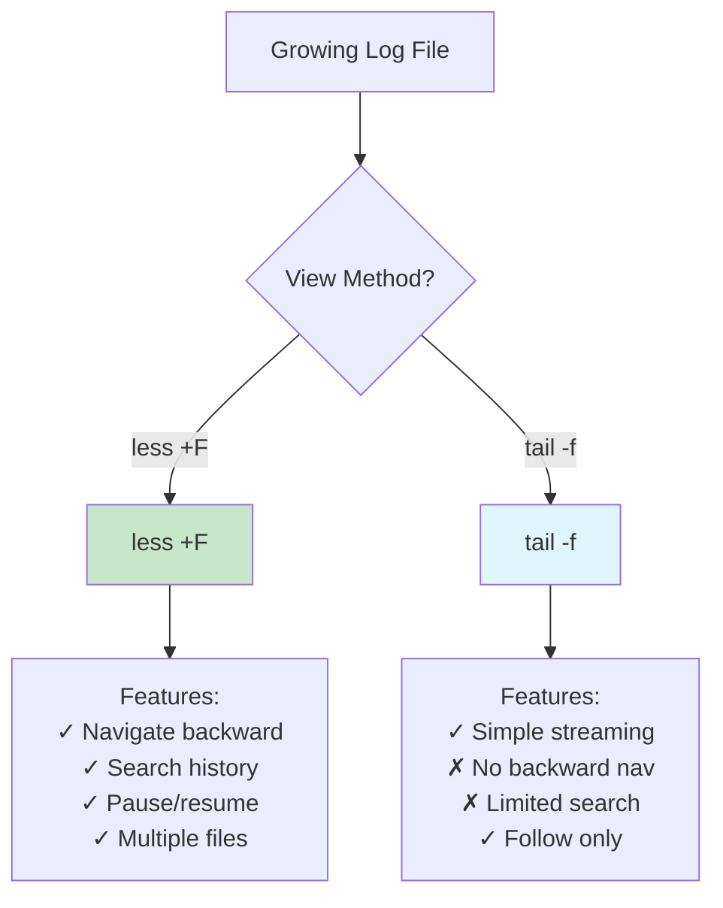
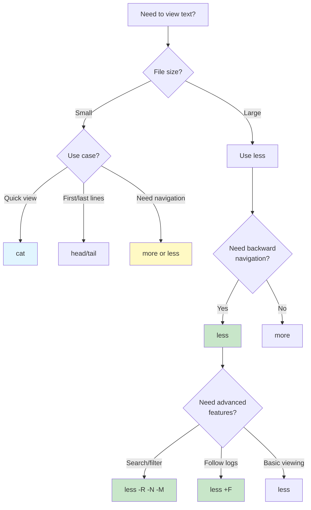

#linux #unix #shell #text-viewer #pager #file-system #windows #wsl #fedora #ubuntu #centos-stream #rhel

- `less` is a terminal pager program for viewing file contents one screen at a time.
- <mark class="hltr-yellow">Allows backward and forward navigation, search, and real-time file monitoring</mark>.
- More feature-rich than `more`, less resource-intensive than opening files in text editors.

# Basic Syntax

```Shell title='Less command syntax'
less [options] [file...]
```

## Key Concepts
- **Pager**: Program that displays text one screenful at a time.
- **Non-destructive**: Does not modify the original file.
- **Interactive**: Provides navigation and search within the terminal.
- **Efficient**: Does not load entire file into memory at once.

# Basic Navigation

## Scrolling Commands

```Shell title='View file with less'
less /var/log/syslog
```

### Navigation Keys

| Key | Action |
|-----|--------|
| `Space` or `f` | Forward one screen |
| `b` | Backward one screen |
| `d` | Forward half screen |
| `u` | Backward half screen |
| `Enter` or `e` or `j` | Forward one line |
| `y` or `k` | Backward one line |
| `g` or `<` | Go to first line |
| `G` or `>` | Go to last line |
| `10g` or `10G` | Go to line 10 |
| `50p` or `50%` | Go to 50% of file |
| `q` | Quit |

### Practical Navigation Example

```Shell title='Navigate large log file'
# Open system log
less /var/log/syslog

# Inside less:
# Press 'g' to go to beginning
# Press 'G' to go to end
# Press '50%' to jump to middle
# Press 'q' to quit
```

## Screen Management

```Shell title='Screen commands in less'
# While viewing file:
Ctrl+L              # Repaint screen
Ctrl+F              # Forward one window
Ctrl+B              # Backward one window
R                   # Repaint screen (redraw)
F                   # Follow mode (like tail -f)
```

# Search Functionality

## Forward Search

```Shell title='Search forward in file'
# Inside less, press /
/pattern            # Search forward for pattern
n                   # Next match
N                   # Previous match
```

### Search Examples

```Shell title='Common search patterns'
# View file
less application.log

# Inside less:
/ERROR              # Find first "ERROR"
/^ERROR             # Find lines starting with "ERROR"
/error\|warning     # Find "error" OR "warning"
/\d\{3\}-\d\{3\}    # Find pattern like "123-456"
```

## Backward Search

```Shell title='Search backward in file'
# Inside less:
?pattern            # Search backward for pattern
n                   # Previous match (searches backward)
N                   # Next match (searches forward)
```

## Search Options

| Command | Description |
|---------|-------------|
| `/pattern` | Search forward |
| `?pattern` | Search backward |
| `n` | Repeat search (same direction) |
| `N` | Repeat search (opposite direction) |
| `&pattern` | Display only lines matching pattern |
| `Esc-u` | Toggle search highlighting |

## Case-Sensitive Search

```Shell title='Control search case sensitivity'
# Inside less:
-i                  # Toggle case-insensitive search
-I                  # Permanently case-insensitive
/\cPATTERN          # Case-insensitive for this search
/\CPATTERN          # Case-sensitive for this search
```

# Command-Line Options

## Display Options

```Shell title='Common less options'
# Basic viewing
less filename.txt

# Ignore case in searches
less -i filename.txt

# Force colors and formatting
less -R colored-output.txt

# Display line numbers
less -N filename.txt

# Chop long lines (don't wrap)
less -S wide-file.txt

# Squeeze blank lines
less -s filename.txt

# Show status column
less -J filename.txt
```

## Important Options

| Option | Description | Example |
|--------|-------------|---------|
| `-N` | Show line numbers | `less -N file.txt` |
| `-S` | Chop long lines (no wrap) | `less -S wide.log` |
| `-i` | Case-insensitive search | `less -i file.txt` |
| `-I` | Ignore case always | `less -I file.txt` |
| `-R` | Display ANSI colors | `less -R colored.txt` |
| `-s` | Squeeze consecutive blank lines | `less -s file.txt` |
| `-M` | Verbose prompt (show position) | `less -M file.txt` |
| `-X` | No screen clear on exit | `less -X file.txt` |
| `-F` | Quit if one screen | `less -F short.txt` |
| `+F` | Follow mode (like tail -f) | `less +F growing.log` |
| `+G` | Start at end of file | `less +G file.txt` |
| `+/pattern` | Start at first match | `less +/ERROR log.txt` |

## Practical Use Case: Colored Logs

```Shell title='View colored command output'
# View colored git log with less
git log --color=always | less -R

# View colored grep results
grep --color=always "pattern" file.txt | less -R

# View colored diff
diff -u --color=always file1.txt file2.txt | less -R
```

# Follow Mode (Real-time Monitoring)

## Static Follow

```Shell title='Monitor growing files'
# Start less in follow mode (like tail -f)
less +F /var/log/syslog

# Inside less follow mode:
Ctrl+C              # Stop following (enter normal mode)
F                   # Resume following
q                   # Quit
```

## Dynamic File Watching

```Shell title='Watch log file in real-time'
# Follow log file
less +F /var/log/apache2/access.log

# Features in follow mode:
# - Auto-scrolls as new content appears
# - Press Ctrl+C to pause and navigate
# - Press F to resume following
# - Search works even while following
```

## Comparison: less +F vs tail -f



# Multiple File Handling

## Viewing Multiple Files

```Shell title='Open multiple files'
# Open multiple files
less file1.txt file2.txt file3.txt

# Navigate between files:
:n                  # Next file
:p                  # Previous file
:e filename         # Examine (open) another file
:d                  # Delete current file from list
v                   # Edit current file in $EDITOR
```

## File Examination Commands

```Shell title='Manage files within less'
# Inside less:
:n                  # Next file
:p                  # Previous file
:x                  # Examine first file
:e newfile          # Open new file
:d                  # Remove current file from list
=                   # Show current file name and position
Ctrl+G              # Show file info (name, lines, position)
```

## Practical Use Case: Compare Log Files

```Shell title='Switch between related log files'
# Open application and error logs
less app.log error.log debug.log

# Inside less:
:n                  # Check error.log
/CRITICAL           # Search for critical errors
:n                  # Check debug.log
:p                  # Back to error.log
```

# Marks and Navigation

## Setting Marks

```Shell title='Mark positions in file'
# Inside less:
ma                  # Set mark 'a' at current position
mb                  # Set mark 'b' at current position
'a                  # Jump to mark 'a'
'b                  # Jump to mark 'b'
```

## Navigation Between Marks

```Shell title='Use marks for quick navigation'
# View large configuration file
less /etc/apache2/apache2.conf

# Inside less:
/ServerRoot         # Find ServerRoot directive
ma                  # Mark this location as 'a'
/DocumentRoot       # Find DocumentRoot
mb                  # Mark as 'b'
'a                  # Jump back to ServerRoot
'b                  # Jump to DocumentRoot
```

# Filtering and Display

## Filter Lines

```Shell title='Display only matching lines'
# Inside less:
&pattern            # Show only lines matching pattern
&                   # Show all lines again (remove filter)
```

### Filtering Example

```Shell title='Filter log file to show errors'
less /var/log/syslog

# Inside less:
&ERROR              # Show only lines containing "ERROR"
# Now only ERROR lines are visible
&                   # Show all lines again
```

## Column Navigation (Wide Files)

```Shell title='Navigate wide files'
# View CSV or wide log file
less -S wide-data.csv

# Inside less (with -S option):
→ (Right arrow)     # Scroll right
← (Left arrow)      # Scroll left
ESC-)               # Shift right half screen
ESC-(               # Shift left half screen
```

# Piping and Input Handling

## Pipe to Less

```Shell title='Use less as output pager'
# View command output
ls -la /usr/bin | less

# View manual pages
man bash | less

# View process list
ps aux | less

# Search through command output
grep -r "error" /var/log | less
```

## Standard Input

```Shell title='Read from stdin'
# Less reads from stdin if no file specified
cat file1.txt file2.txt | less

# Process and view
find /var/log -name "*.log" | less

# View compressed files
zcat file.gz | less
gunzip -c file.gz | less
```

## Viewing Compressed Files

```Shell title='View compressed files directly'
# Less automatically handles compression
less file.txt.gz        # Automatically decompresses .gz
less file.txt.bz2       # Automatically decompresses .bz2
less file.txt.xz        # Automatically decompresses .xz

# Works with:
# - .gz (gzip)
# - .bz2 (bzip2)
# - .xz (xz)
# - .Z (compress)
```

# Advanced Features

## Preprocessing Files

```Shell title='Preprocess files before viewing'
# Set LESSOPEN environment variable
export LESSOPEN="| /usr/bin/lesspipe %s"

# Now less can view:
less archive.tar.gz     # Shows tar contents
less document.pdf       # Shows PDF text (if pdftotext installed)
less image.jpg          # Shows image info (if exiftool installed)
```

## Custom Prompts

```Shell title='Configure less prompt'
# Environment variables
export LESS="-M -i -R"
export LESS="-N -S -i"  # Line numbers, chop, case-insensitive

# Prompt customization
export LESS="-PM?f%f:stdin. ?m(%i/%m) .?ltLine %lt:?pt%pt\%:?btByte %bt:-..."
```

## Environment Variables

| Variable | Purpose | Example |
|----------|---------|---------|
| `LESS` | Default options | `export LESS="-R -i -M"` |
| `LESSOPEN` | Preprocessor | `export LESSOPEN="\| lesspipe %s"` |
| `LESSCLOSE` | Post-processor | `export LESSCLOSE="lesspipe %s %s"` |
| `LESSCHARSET` | Character set | `export LESSCHARSET=utf-8` |
| `EDITOR` | Editor for 'v' command | `export EDITOR=vim` |

# Practical Use Cases

## Use Case 1: System Log Analysis

```Shell title='Analyze system logs'
# View system log with line numbers
less -N /var/log/syslog

# Inside less:
/failed             # Search for failures
n                   # Next failure
ma                  # Mark interesting location
G                   # Go to end
?started            # Search backward for service start
'a                  # Return to marked failure
```

## Use Case 2: Code Review

```Shell title='Review source code'
# View code with line numbers and no wrap
less -N -S application.py

# Inside less:
/def main           # Find main function
ma                  # Mark main function
/class.*Error       # Find error classes
:e tests.py         # Switch to test file
```

## Use Case 3: Monitor Active Log

```Shell title='Real-time log monitoring with search'
# Follow log and watch for errors
less +F /var/log/nginx/error.log

# Inside follow mode:
Ctrl+C              # Pause following
/timeout            # Search for timeout errors
n                   # Find all timeout occurrences
F                   # Resume following
```

## Use Case 4: Compare Configuration Files

```Shell title='Review multiple config files'
# Open all Apache config files
less /etc/apache2/apache2.conf /etc/apache2/sites-available/*.conf

# Inside less:
/Listen             # Find Listen directive
:n                  # Check next config
/VirtualHost        # Find VirtualHost blocks
:p                  # Go back to previous
```

## Use Case 5: Process Large CSV Data

```Shell title='Navigate wide CSV file'
# View CSV without line wrapping
less -S -N large-data.csv

# Inside less:
→→→                 # Scroll right to see more columns
/,USD,              # Search for USD entries
&,2024-             # Filter to show only 2024 entries
```

## Use Case 6: View Command Output

```Shell title='Page through command results'
# View large directory listing
find /usr -type f | less

# Search file output
dpkg -l | less
/python             # Find Python packages

# View formatted output
ps aux --sort=-%mem | head -20 | less -S
```

## Use Case 7: Binary File Inspection

```Shell title='View binary files'
# View binary file (shows as hex/readable chars)
less /usr/bin/ls

# Inside less:
# Less displays printable characters and hex for binary
# Useful for quick inspection without hex editor
```

# Less vs Other Pagers

## Comparison Table

| Feature | less | more | cat | head/tail |
|---------|------|------|-----|-----------|
| Backward navigation | ✓ | ✗ | ✗ | ✗ |
| Forward navigation | ✓ | ✓ | ✗ | ✗ |
| Search | ✓ (both) | ✓ (forward) | ✗ | ✗ |
| Follow mode | ✓ | ✗ | ✗ | ✓ (tail -f) |
| Memory efficient | ✓ | ✓ | ✗ | ✓ |
| Multiple files | ✓ | ✓ | ✓ | ✗ |
| Line numbers | ✓ | ✗ | ✗ | ✗ |
| Filtering | ✓ | ✗ | ✗ | ✗ |
| ANSI colors | ✓ (-R) | ✗ | ✓ | ✓ |

## When to Use Each



# Interactive Commands Reference

## Essential Commands

```Shell title='Quick reference for less commands'
# Navigation
Space, f            # Forward one screen
b                   # Backward one screen
d                   # Forward half screen
u                   # Backward half screen
g                   # Go to start
G                   # Go to end
50%                 # Go to 50% of file

# Search
/pattern            # Search forward
?pattern            # Search backward
n                   # Next match
N                   # Previous match
&pattern            # Show only matching lines

# Files
:n                  # Next file
:p                  # Previous file
:e file             # Examine file
v                   # Edit in $EDITOR

# Display
-N                  # Toggle line numbers
-S                  # Toggle line chopping
-i                  # Toggle case-insensitive search
R                   # Repaint screen
F                   # Follow mode

# Marks
ma                  # Set mark a
'a                  # Go to mark a

# Misc
h                   # Help
q                   # Quit
=                   # File info
Ctrl+G              # File info
```

## Help System

```Shell title='Get help in less'
# Inside less:
h                   # Display help screen
# Shows all available commands and options
```

# Configuration Files

## User Configuration

```Shell title='Configure less via .bashrc or .zshrc'
# Add to ~/.bashrc or ~/.zshrc

# Default options for less
export LESS='-R -i -M -S -x4'
# -R: Display colors
# -i: Case-insensitive search
# -M: Verbose prompt
# -S: Chop long lines
# -x4: Tab stops every 4 spaces

# Preprocessor for archives and special files
export LESSOPEN='| /usr/bin/lesspipe %s 2>&-'

# Color customization for less
export LESS_TERMCAP_mb=$'\e[1;32m'      # Begin blinking
export LESS_TERMCAP_md=$'\e[1;34m'      # Begin bold
export LESS_TERMCAP_me=$'\e[0m'         # End mode
export LESS_TERMCAP_so=$'\e[01;44;33m'  # Begin standout
export LESS_TERMCAP_se=$'\e[0m'         # End standout
export LESS_TERMCAP_us=$'\e[1;4;31m'    # Begin underline
export LESS_TERMCAP_ue=$'\e[0m'         # End underline
```

## System-wide Configuration

```Shell title='System configuration'
# Location: /etc/environment or /etc/profile.d/less.sh

# Default less options for all users
LESS="-R -M -i"
LESSOPEN="| /usr/bin/lesspipe %s"

export LESS LESSOPEN
```

# Performance and Best Practices

## Performance Tips

```Shell title='Optimize less performance'
# For very large files (> 1GB)
less -n large-file.log          # Disable line numbers for speed

# For network/slow filesystems
less -B large-file.txt          # Disable buffering

# For continuous monitoring
less +F -n /var/log/syslog     # Follow without line numbers
```

## Best Practices

```Shell title='Recommended usage patterns'
# Always use -R for colored output
git log --color=always | less -R

# Use -S for wide data
less -S /var/log/apache2/access.log

# Combine useful options
alias ll='less -N -i -M -R'
alias lf='less +F'              # Quick follow

# For code viewing
alias lessc='less -N -S -i'     # Line numbers, no wrap, case-insensitive

# Quick file inspection
less +G file.log                # Start at end
less +/ERROR file.log           # Start at first ERROR
```

## Common Aliases

```Shell title='Useful less aliases'
# Add to ~/.bashrc or ~/.zshrc

alias less='less -R -i -M'              # Default enhanced less
alias lless='less -N -S'                # Less with line numbers, no wrap
alias tailf='less +F'                   # Follow file like tail -f
alias tless='less +F'                   # Same as tailf

# View logs with enhanced less
alias lesslog='less -N -S +G'           # Start at end with line numbers
alias followlog='less +F -N'            # Follow with line numbers

# Colored man pages
export MANPAGER='less -R'
```

# Troubleshooting

## Problem: Binary Content Displayed

```Shell title='Handle binary files gracefully'
# Less tries to display binary files
# To avoid garbled output:

# Check if file is binary first
file suspicious.dat

# If binary, use hexdump or strings
hexdump -C binary-file | less
strings binary-file | less
```

## Problem: ANSI Escape Sequences

```Shell title='Fix color/escape sequence issues'
# Raw ANSI codes showing as ^[[0m
# Solution: Use -R option
less -R colored-output.txt

# If colors still not working:
less -r colored-output.txt      # Raw mode
```

## Problem: File Not Updating in Follow Mode

```Shell title='Debug follow mode issues'
# File not updating in follow mode
# Possible causes:

# 1. File was truncated (rotated)
# Solution: Reopen file
:e                              # Re-examine current file

# 2. File was renamed
# Solution: Watch correct file
less +F /var/log/app.log

# 3. Use F repeatedly to refresh
F                               # Resume follow if stopped
```

## Problem: Search Not Working

```Shell title='Fix search issues'
# Case sensitivity problem
# Toggle case-insensitive search:
-i                              # Inside less

# Pattern not found
# Try regex pattern:
/pattern.*                      # Use regex
/\cpattern                      # Case-insensitive search
```

***
# References
1. GNU less Documentation - https://www.greenwoodsoftware.com/less/
2. `man less` - Linux manual page
3. `less --help` - Built-in help
4. The Linux Command Line - William Shotts - 2nd Edition - 2019 - No Starch Press
	1. Chapter 3: Exploring the System
5. Unix and Linux System Administration Handbook - Evi Nemeth - 5th Edition - 2017 - Addison-Wesley
	1. Chapter 2: Basic Scripting and File Management
6. Learning the vi and Vim Editors - Arnold Robbins - 7th Edition - 2008 - O'Reilly
	1. Appendix C: vi and the Internet (less as alternative to more)
7. https://www.greenwoodsoftware.com/less/faq.html
8. `man lesskey` - Customize less key bindings
