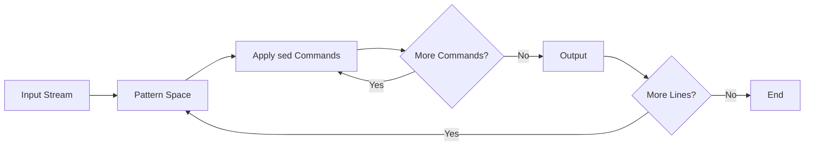

#linux #shell #unix #ubuntu #operating-system #fedora #centos-stream #rhel 
# Basic Concepts
- `sed` (Stream EDitor) is a powerful text processing tool that performs <mark class="hltr-yellow">text transformations</mark> on input streams (files or pipelines). It processes text line-by-line, applying specified editing commands without modifying the original file unless explicitly instructed.
### Execution Model



- **Pattern Space**: Buffer holding the current line being processed
- **Hold Space**: Auxiliary buffer for temporary storage
- **Address**: Specifies which lines to process (line numbers, patterns, ranges)
- **Command**: Action to perform on matching lines
# Basic Syntax
```Shell title="sed command structure"
sed [OPTIONS] 'command' file              # Apply command to file
sed [OPTIONS] -e 'cmd1' -e 'cmd2' file   # Multiple commands
sed [OPTIONS] -f script.sed file          # Commands from file
```

**Common Options**:
- `-n` - Suppress automatic output (quiet mode)
- `-i` - Edit files in-place
- `-i.bak` - Edit in-place with backup
- `-e` - Add script command
- `-f` - Read script from file
- `-r` or `-E` - Use extended regular expressions
## Substitution
### Basic Substitution
- The substitute command `s/pattern/replacement/flags` is the most common operation.
```Shell title="Substitution syntax"
sed 's/old/new/' file                    # Replace first occurrence per line
sed 's/old/new/g' file                   # Replace all occurrences (global)
sed 's/old/new/2' file                   # Replace second occurrence
sed 's/old/new/p' file                   # Print lines where substitution occurred
sed -n 's/old/new/p' file                # Print only substituted lines
sed 's/old/new/i' file                   # Case-insensitive replacement
sed 's/old/new/w output.txt' file        # Write changed lines to file
```
- **Flags**:
    - `g` - Global (all occurrences on line)
    - `p` - Print substituted lines
    - `w file` - Write to file
    - `i` - Case-insensitive (GNU sed), ignore case.
    - `1`, `2`, ... - Replace nth occurrence
### Delimiters
- Any character can be used as delimiter, useful when pattern contains slashes.
```Shell title="Alternative delimiters"
sed 's/\/usr\/local\/bin/\/usr\/bin/' file       # Hard to read
sed 's|/usr/local/bin|/usr/bin|' file            # Using |
sed 's#/usr/local/bin#/usr/bin#' file            # Using #
sed 's@/usr/local/bin@/usr/bin@' file            # Using @
```
### Backreferences
```Shell title="Capture groups and backreferences"
# Swap first two words
sed 's/\([^ ]*\) \([^ ]*\)/\2 \1/' file

# Quote each line
sed 's/\(.*\)/"\1"/' file

# Extract domain from URL
sed 's|https\?://\([^/]*\).*|\1|' file

# Add parentheses around numbers
sed 's/\([0-9]\+\)/(\1)/g' file

# Reformat date from YYYY-MM-DD to DD/MM/YYYY
sed 's/\([0-9]\{4\}\)-\([0-9]\{2\}\)-\([0-9]\{2\}\)/\3\/\2\/\1/' file
```

**Special Characters in Replacement**:
- `&` - Entire matched pattern
- `\1`, `\2`, ... - Backreferences to capture groups
- `\L` - Convert to lowercase (GNU sed)
- `\U` - Convert to uppercase (GNU sed)
- `\n` - Newline
```Shell title="Using & for matched text"
# Add quotes around matched pattern
sed 's/error/"\0"/' file                 # Using \0 (same as &)
sed 's/error/"&"/' file                   # Using &

# Duplicate words
sed 's/[a-z]\+/& &/g' file

# Add prefix to numbers
sed 's/[0-9]\+/ID-&/g' file
```
# Addressing
## Line Numbers
```Shell title="Specific line addressing"
sed -n '5p' file                          # Print line 5
sed '5d' file                             # Delete line 5
sed '5s/old/new/' file                    # Substitute on line 5
sed '5a\New line' file                    # Append after line 5
sed '5i\New line' file                    # Insert before line 5
sed '5c\Replacement line' file            # Change line 5
```
## Line Ranges
```Shell title="Range addressing"
sed -n '10,20p' file                      # Print lines 10-20
sed '10,20d' file                         # Delete lines 10-20
sed '10,20s/old/new/g' file              # Substitute in range
sed '1,5s/old/new/' file                 # First 5 lines
sed '10,$s/old/new/' file                # Line 10 to end ($)
sed '1~2p' file                           # Every 2nd line starting from 1 (GNU sed)
sed '0~5p' file                           # Every 5th line (GNU sed)
```
## Pattern Matching
```Shell title="Pattern-based addressing"
sed -n '/pattern/p' file                  # Print lines matching pattern
sed '/pattern/d' file                     # Delete matching lines
sed '/pattern/s/old/new/' file           # Substitute in matching lines
sed '/start/,/end/p' file                # Range from start to end pattern
sed '/pattern/,+5p' file                 # Match and 5 lines after (GNU sed)
sed '/pattern/,~3p' file                 # Match to next line divisible by 3
```
## Negation
```Shell title="Negated addressing"
sed -n '/pattern/!p' file                 # Print non-matching lines
sed '5,10!d' file                         # Delete all except lines 5-10
sed '/^#/!s/old/new/' file               # Substitute in non-comment lines
```
## Multiple Addresses
```Shell title="Combining addresses"
sed -n -e '1p' -e '5p' -e '10p' file     # Print lines 1, 5, and 10
sed '1d;5d;10d' file                      # Delete lines 1, 5, and 10
sed '/start/,/end/d; /other/d' file      # Multiple delete operations
```
# Common Operations
## Print
```Shell title="Print commands"
sed -n 'p' file                           # Print all lines (equivalent to cat)
sed -n '1,10p' file                       # Print first 10 lines (like head)
sed -n '$p' file                          # Print last line (like tail -n 1)
sed -n '/pattern/p' file                  # Print matching lines (like grep)
sed -n '/pattern/=' file                  # Print line numbers of matches
sed -n '/pattern/{=;p}' file             # Print line numbers and content
```
## Delete
```Shell title="Delete commands"
sed 'd' file                              # Delete all lines (output empty)
sed '1d' file                             # Delete first line
sed '$d' file                             # Delete last line
sed '/^$/d' file                          # Delete empty lines
sed '/^\s*$/d' file                       # Delete blank lines (spaces/tabs)
sed '/^#/d' file                          # Delete comment lines
sed '1,10d' file                          # Delete first 10 lines
sed '/start/,/end/d' file                 # Delete range between patterns
```
## Insert and Append
```Shell title="Insert and append text"
sed '5i\New line' file                    # Insert before line 5
sed '5a\New line' file                    # Append after line 5
sed '$a\Footer line' file                 # Append at end of file
sed '/pattern/i\Inserted text' file       # Insert before matching lines
sed '/pattern/a\Appended text' file       # Append after matching lines

# Multiple lines (GNU sed)
sed '1i\Line 1\nLine 2\nLine 3' file

# Multiple lines (POSIX compatible)
sed '1i\
Line 1\
Line 2\
Line 3' file
```
## Change
```Shell title="Change lines"
sed '5c\Replacement line' file            # Replace line 5
sed '/pattern/c\New content' file         # Replace matching lines
sed '10,20c\Single replacement' file      # Replace range with single line
```
## Transform
```Shell title="Character translation (y command)"
sed 'y/abc/ABC/' file                     # Translate a→A, b→B, c→C
sed 'y/abcdefghijklmnopqrstuvwxyz/ABCDEFGHIJKLMNOPQRSTUVWXYZ/' file  # Uppercase
sed 'y/ABCDEFGHIJKLMNOPQRSTUVWXYZ/abcdefghijklmnopqrstuvwxyz/' file  # Lowercase
```

- The `y` command performs character-by-character translation (like `tr` command).
# Advanced Patterns
## Regular Expressions
### Basic Regular Expressions (BRE)
```Shell title="BRE patterns"
sed -n '/^start/p' file                   # Lines starting with "start"
sed -n '/end$/p' file                     # Lines ending with "end"
sed -n '/^$/p' file                       # Empty lines
sed -n '/[0-9]\{3\}-[0-9]\{4\}/p' file   # Phone pattern (BRE)
sed -n '/\<word\>/p' file                 # Whole word match
sed -n '/\(pattern\)\1/p' file           # Repeated pattern
```
### Extended Regular Expressions (ERE)
```Shell title="ERE patterns"
sed -E '/^(https?|ftp):\/\//p' file      # URL protocol
sed -E '/[0-9]{3}-[0-9]{4}/p' file       # Phone pattern (ERE, no escaping)
sed -E '/(red|blue|green)/p' file        # Alternatives
sed -E '/\w+@\w+\.\w+/p' file            # Simple email pattern
sed -E '/(pattern)+/p' file               # One or more repetitions
```
## Multiple Commands
```Shell title="Combining commands"
# Using semicolon
sed 's/old/new/; s/foo/bar/' file

# Using -e option
sed -e 's/old/new/' -e 's/foo/bar/' file

# Using newlines
sed '
s/old/new/
s/foo/bar/
' file

# Grouped commands
sed '/pattern/{s/old/new/; s/foo/bar/}' file
```
## Conditional Execution
```Shell title="Branching and flow control"
# If substitution succeeds, perform additional command
sed '/pattern/{s/old/new/; s/foo/bar/}' file

# Branch (b) and label (:)
sed '/pattern/b skip; s/old/new/; :skip' file

# Test (t) - branch if last substitution succeeded
sed 's/pattern/replacement/; t end; s/fallback/value/; :end' file

# Conditional delete
sed '/start/,/end/{/exclude/!d}' file
```
## Hold Space Operations
- Hold space is an auxiliary buffer for temporary storage.
```Shell title="Hold space commands"
# h - Copy pattern space to hold space
# H - Append pattern space to hold space
# g - Copy hold space to pattern space
# G - Append hold space to pattern space
# x - Exchange pattern and hold spaces
```
## Practical Examples
```Shell title="Reverse file (tac alternative)"
sed '1!G;h;$!d' file

# Explanation:
# 1!G  - On lines 2+, append hold space to pattern space
# h    - Copy pattern space to hold space
# $!d  - Delete all but last line from output
```

```Shell title="Print previous line"
sed -n '/pattern/{x;p;d}; x' file

# Explanation:
# /pattern/{x;p;d} - On match, exchange spaces, print, delete
# x                - Exchange on every line (save current for next)
```

```Shell title="Join consecutive lines"
sed 'N;s/\n/ /' file                      # Join pairs of lines

# Join all lines
sed ':a;N;$!ba;s/\n/ /g' file
```

```Shell title="Print line before and after match"
sed -n '/pattern/{x;p;x;p;n;p}' file
```
## In-Place Editing
```Shell title="Modify files directly"
sed -i 's/old/new/g' file                 # Edit in-place (GNU sed)
sed -i '' 's/old/new/g' file             # Edit in-place (BSD/macOS sed)
sed -i.bak 's/old/new/g' file            # Create backup with .bak extension
sed -i.orig 's/old/new/g' *.txt          # Edit multiple files with backup

# Safe in-place editing (test first)
sed 's/old/new/g' file > file.tmp && mv file.tmp file
```
# Practical Use Cases
## Configuration File Management
```Shell title="Update configuration values"
# Change port number
sed -i 's/^port=.*/port=8080/' config.ini

# Update database host
sed -i 's/^DB_HOST=.*/DB_HOST=localhost/' .env

# Enable a commented option
sed -i 's/^#\(enable_feature=true\)/\1/' config.conf

# Add configuration if not exists
sed -i '/^max_connections=/!s/$/\nmax_connections=100/' config.conf

# Update multiple values
sed -i -e 's/^DEBUG=.*/DEBUG=false/' \
       -e 's/^LOG_LEVEL=.*/LOG_LEVEL=error/' \
       settings.conf
```
## Log Processing and Analysis
```Shell title="Filter and transform logs"
# Extract error messages
sed -n '/ERROR/p' application.log

# Remove timestamps
sed 's/^\[.*\] //' log.txt

# Extract IP addresses
sed -n 's/.*IP: \([0-9.]*\).*/\1/p' access.log

# Filter date range
sed -n '/2024-01-01/,/2024-01-31/p' logs.txt

# Remove ANSI color codes
sed 's/\x1b\[[0-9;]*m//g' colored.log

# Anonymize IP addresses
sed 's/\([0-9]\{1,3\}\.\)\{3\}[0-9]\{1,3\}/XXX.XXX.XXX.XXX/g' access.log

# Count error types
sed -n 's/.*ERROR: \([A-Z_]*\).*/\1/p' app.log | sort | uniq -c
```
## Source Code Refactoring
```Shell title="Modify source code"
# Update function name across files
sed -i 's/\boldFunctionName\b/newFunctionName/g' *.js

# Add file header to all Python files
sed -i '1i\#!/usr/bin/env python3\n# -*- coding: utf-8 -*-' *.py

# Remove trailing whitespace
sed -i 's/[[:space:]]*$//' *.java

# Convert tabs to spaces
sed -i 's/\t/    /g' *.py

# Update import statements
sed -i 's/from old_module/from new_module/' *.py

# Add missing semicolons in JavaScript
sed -i '/[^;{]$/s/$/;/' script.js

# Remove console.log statements
sed -i '/console\.log/d' *.js
```
## Data Format Conversion
```Shell title="Transform data formats"
# CSV to pipe-delimited
sed 's/,/|/g' data.csv

# Convert DOS to Unix line endings
sed -i 's/\r$//' file.txt

# Convert Unix to DOS line endings
sed -i 's/$/\r/' file.txt

# Extract column from CSV
sed 's/^[^,]*,\([^,]*\),.*/\1/' data.csv

# Add quotes to CSV fields
sed 's/\([^,]*\)/"\1"/g' data.csv

# JSON to CSV (simple key-value pairs)
sed 's/[{}":]//g; s/,/\n/g' data.json

# XML to text (remove tags)
sed 's/<[^>]*>//g' data.xml
```
## Text Processing and Formatting
```Shell title="Format text documents"
# Remove HTML tags
sed 's/<[^>]*>//g' document.html

# Double-space text
sed 'G' file.txt

# Remove duplicate blank lines
sed '/^$/N;/^\n$/D' file.txt

# Number non-empty lines
sed '/./=' file.txt | sed 'N;s/\n/ /'

# Wrap lines at 80 characters (simple version)
sed 's/\(.\{80\}\)/\1\n/g' file.txt

# Convert Markdown to plain text (remove formatting)
sed -e 's/^\#+\s*//' -e 's/\*\*\(.*\)\*\*/\1/' -e 's/\*\(.*\)\*/\1/' file.md

# Add line numbers
sed = file.txt | sed 'N;s/\n/\t/'
```
## System Administration
```Shell title="System configuration tasks"
# Add user to sudoers
echo "username ALL=(ALL) NOPASSWD:ALL" | sudo sed -i '$a\' /etc/sudoers

# Update /etc/hosts
sudo sed -i '/oldhost/c\192.168.1.100 newhost' /etc/hosts

# Enable service in systemd unit file
sudo sed -i 's/^#\(WantedBy=multi-user.target\)/\1/' service.service

# Rotate log files
sed -i '1000,$d' large.log

# Extract package versions from requirements.txt
sed -n 's/.*==\(.*\)/\1/p' requirements.txt

# Clean up crontab entries
sed -i '/^#/d; /^$/d' /etc/crontab

# Update kernel parameter
sudo sed -i 's/^GRUB_TIMEOUT=.*/GRUB_TIMEOUT=3/' /etc/default/grub
```
## Batch Text Replacement
```Shell title="Complex multi-file operations"
# Replace across multiple files with validation
find . -name "*.txt" -exec sed -i.bak 's/old/new/g' {} \;

# Preview changes before applying
find . -name "*.conf" -exec sh -c 'echo "=== {} ==="; sed -n "s/old/new/gp" "$1"' _ {} \;

# Conditional replacement based on file content
for file in *.txt; do
    if grep -q "condition" "$file"; then
        sed -i 's/pattern/replacement/' "$file"
    fi
done

# Apply different sed scripts to different file types
find . -name "*.py" -exec sed -i -f python.sed {} \;
find . -name "*.js" -exec sed -i -f javascript.sed {} \;

# Backup and replace with verification
for file in *.conf; do
    cp "$file" "$file.backup"
    sed -i 's/old/new/g' "$file"
    if ! validate_config "$file"; then
        mv "$file.backup" "$file"
        echo "Rollback: $file"
    fi
done
```
# Advanced Techniques
## Multiline Processing
```Shell title="Process multiple lines together"
# Read next line into pattern space (N)
sed 'N;s/\n/ /' file                      # Join consecutive lines

# Join lines ending with backslash
sed ':a;/\\$/N;s/\\\n//;ta' file

# Delete line and next line
sed '/pattern/{N;d}' file

# Print paragraph (blank-line separated)
sed -n '/start/,/^$/p' file

# Process blocks between markers
sed -n '/BEGIN/,/END/{/BEGIN/d;/END/d;p}' file
```
## Using `sed` as a Filter
```Shell title="Pipeline integration"
# Count pattern occurrences
cat file | sed -n '/pattern/p' | wc -l

# Extract and sort unique values
sed -n 's/.*key=\([^;]*\).*/\1/p' file | sort -u

# Chain sed commands
sed 's/old/new/' file | sed 's/foo/bar/' | sed '/pattern/d'

# Combine with other tools
sed -n '/ERROR/p' app.log | awk '{print $1, $5}' | sort | uniq -c
```
## `sed` Scripts
```Shell title="Create reusable sed scripts"
# Create script file: cleanup.sed
#!/bin/sed -f
# Remove comments
/^#/d
# Remove empty lines
/^$/d
# Trim whitespace
s/^[[:space:]]*//
s/[[:space:]]*$//
# Lowercase
s/.*/\L&/

# Execute script
sed -f cleanup.sed input.txt

# Make executable
chmod +x cleanup.sed
./cleanup.sed input.txt
```
## Performance Optimization
```Shell title="Optimize sed operations"
# Exit after first match (faster for large files)
sed '/pattern/q' file

# Use most specific address
sed '/specific pattern/s/old/new/' file  # Better than:
sed 's/old/new/' file                     # Less specific

# Combine operations
sed 's/old/new/g; s/foo/bar/g' file      # Better than:
sed 's/old/new/g' file | sed 's/foo/bar/g' file

# Use quick exit
sed '/pattern/{p;q;}' file                # Print first match and quit
```
## Debugging
```Shell title="Debug sed commands"
# Verbose output (GNU sed)
sed --debug 's/pattern/replacement/' file

# Print pattern space after each command
sed -n 'l' file                           # Show invisible characters

# Test with echo
echo "test string" | sed 's/test/result/'

# Use multiple steps for clarity
sed -e '1,5d' -e 's/old/new/' file       # Clear intention

# Add comments in scripts
sed '
    # Remove comments
    /^#/d
    # Replace pattern
    s/old/new/g
' file
```
# Common Pitfalls
## Greedy matching
```Shell title="Handle greedy regex"
# Problem: Remove HTML tags (fails with multiple tags)
echo "<p>text</p> <span>more</span>" | sed 's/<.*>//'
# Output: (empty - removed everything)

# Solution: Non-greedy match
echo "<p>text</p> <span>more</span>" | sed 's/<[^>]*>//g'
# Output: text more
```
## In-place editing
```Shell title="BSD vs GNU sed"
# GNU sed (Linux)
sed -i 's/old/new/' file

# BSD sed (macOS)
sed -i '' 's/old/new/' file

# Portable solution
sed 's/old/new/' file > tmpfile && mv tmpfile file
```
## Special characters
```Shell title="Escape special characters"
# Problem: Replace literal dots
sed 's/./X/' file                         # Replaces any character!

# Solution: Escape the dot
sed 's/\./X/' file                        # Replaces literal dots

# Quote variables properly
pattern="some/path"
sed "s|old|$pattern|" file                # Use double quotes for variable expansion
```
***
# References
1. GNU `sed` Manual: https://www.gnu.org/software/sed/manual/
2. `sed` & `awk` by Dale Dougherty and Arnold Robbins (O'Reilly)
3. POSIX `sed` Specification.
