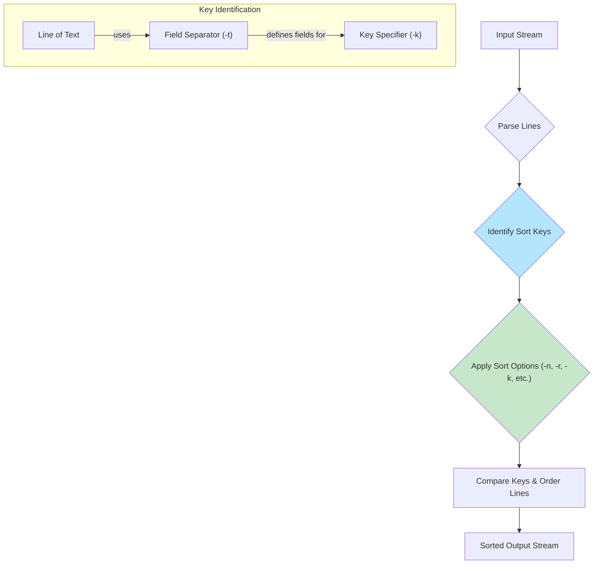

#linux #shell #unix #ubuntu #operating-system #fedora #centos-stream #rhel
# Basic Concepts
- The `sort` command is a command-line utility for sorting lines of text. It reads from files or standard input, arranges the data based on specified criteria, and writes the result to standard output.
- Formally, `sort` operates by processing input into a set of lines, identifying a sorting key for each line, and then ordering the lines based on a comparison of these keys. By default, the key is the entire line, and the comparison is lexicographical according to the current locale's collating sequence. This behavior can be extensively modified with options to specify different keys, comparison rules, and field separators.
### Execution Model



# Basic Syntax
```Shell title="sort command structure"
sort [OPTION]... [FILE]...
```

**Common Options**:
- `-r`, `--reverse`: Reverse the result of comparisons.
- `-n`, `--numeric-sort`: Compare according to string numerical value.
- `-h`, `--human-numeric-sort`: Compare human-readable numbers (e.g., 2K, 1G).
- `-k POS1[,POS2]`, `--key=POS1[,POS2]`: Specify a sort field (key). `POS1` is the start, `POS2` is the end (optional). Fields are 1-indexed.
- `-t CHAR`, `--field-separator=CHAR`: Use `CHAR` as the field separator.
- `-u`, `--unique`: With `-c`, check for strict ordering. Without `-c`, output only the first of an equal run.
- `-o FILE`, `--output=FILE`: Write result to `FILE` instead of standard output.
- `-C`, `--check`: Check if the input is already sorted; do not sort.
- `-f`, `--ignore-case`: Fold lower case to upper case characters.

## Default Sort
- Without options, `sort` performs a lexicographical (alphabetical) sort.
```Shell title="Default alphabetical sort"
# Create a file
printf "cherry\napple\nbanana\n" > fruits.txt

# Sort the file
sort fruits.txt
# Output:
# apple
# banana
# cherry
```
## Reverse Sort (`-r`)
- The `-r` flag reverses the sort order.
```Shell title="Reverse sort"
sort -r fruits.txt
# Output:
# cherry
# banana
# apple
```
# Practical Use Cases

## Numeric Sort (`-n`)
- The `-n` option is essential for sorting numbers. Without it, numbers are sorted alphabetically ("10" comes before "2").
```Shell title="Sorting numbers"
printf "10\n2\n100\n1\n" > numbers.txt

# Incorrect alphabetical sort
sort numbers.txt
# Output:
# 1
# 10
# 100
# 2

# Correct numeric sort
sort -n numbers.txt
# Output:
# 1
# 2
# 10
# 100
```

## Sorting by a Specific Field (`-k` and `-t`)
- This is a powerful feature for column-based data. `-t` sets the delimiter and `-k` specifies which field to sort by.

```Shell title="Sort /etc/passwd by User ID (field 3)"
# -t ':' sets the delimiter to a colon
# -k 3,3 specifies sorting only on the 3rd field
# -n ensures numeric sorting for the user ID
sort -t ':' -k 3,3n /etc/passwd | head -n 5
```
## Human-Numeric Sort (`-h`)
- Use `-h` when sorting file sizes from commands like `ls -lh` or `du -h`.
```Shell title="Sort file sizes in a human-readable way"
# Generate some files of different sizes
touch file1 && dd if=/dev/zero of=file2 bs=1K count=10 &> /dev/null
ls -lh file*
# -rw-r--r-- 1 user user    0 Jan  1 12:00 file1
# -rw-r--r-- 1 user user  10K Jan  1 12:01 file2

# Sort by the 5th field (size) using -h
ls -lh file* | sort -h -k 5
# -rw-r--r-- 1 user user    0 Jan  1 12:00 file1
# -rw-r--r-- 1 user user  10K Jan  1 12:01 file2
```
## Unique Sort (`-u`)
- The `-u` flag is a convenient way to discard duplicate lines, equivalent to `sort file | uniq`.
```Shell title="Sorting with unique output"
printf "apple\ncherry\napple\n" > unsorted_fruits.txt

sort -u unsorted_fruits.txt
# Output:
# apple
# cherry
```

## Sorting and Counting
- The canonical way to count items is to `sort` them first, then pipe to `uniq -c`.

```Shell title="Counting unique lines"
# This combination is a very common pattern in shell scripting
cut -d: -f7 /etc/passwd | sort | uniq -c
```

# Common Pitfalls

## Alphabetical vs. Numeric Sorting
- The most frequent mistake is forgetting to use `-n` when sorting lines that start with numbers. The default behavior is alphabetical, which leads to incorrect ordering.

```Shell title="Pitfall: Forgetting -n"
# Lines are sorted based on the first character, not numeric value
printf "user-10\nuser-2\n" | sort
# Output:
# user-10
# user-2

# Correct way using key and numeric sort
printf "user-10\nuser-2\n" | sort -t '-' -k 2,2n
# Output:
# user-2
# user-10
```

## Field Separators
- The default field separator is a transition from a non-blank to a blank character. This can cause confusion if fields are separated by variable amounts of whitespace.
- For predictable results with columnar data, always specify the delimiter explicitly with `-t` if it's a single character (like `,` or `:`) or use tools like `awk` if the delimiter is complex.

***
# References
1. GNU `sort` Manual: https://www.gnu.org/software/coreutils/manual/html_node/sort-invocation.html
2. POSIX `sort` Specification.

```