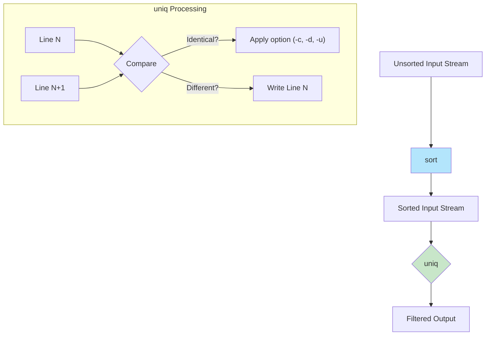

#linux #shell #unix #ubuntu #operating-system #fedora #centos-stream #rhel
# Basic Concepts
- The `uniq` command is a text processing utility that filters and reports on repeated lines in a file. Formally, `uniq` reads from a standard input or a file, compares adjacent lines, and writes a filtered version to standard output.
- A foundational prerequisite for `uniq` to function correctly across a whole file is that the input data must be sorted. The command only merges and counts identical *adjacent* lines. If duplicate lines are not next to each other in the input stream, they will not be considered duplicates. Therefore, `uniq` is almost always used in a pipeline with `sort`
### Execution Model


# Basic Syntax
```Shell title="uniq command structure"
uniq [OPTION]... [INPUT [OUTPUT]]
```

**Common Options**:
- `-c`, `--count`: Prefix lines by the number of occurrences.
- `-d`, `--repeated`: Only print duplicate lines, one for each group.
- `-u`, `--unique`: Only print lines that are not repeated.
- `-i`, `--ignore-case`: Ignore differences in case when comparing.
- `-f N`, `--skip-fields=N`: Avoid comparing the first N fields. A field is a string of non-space, non-tab characters separated by tabs and spaces.
- `-s N`, `--skip-chars=N`: Avoid comparing the first N characters.
- `-w N`, `--check-chars=N`: Compare no more than N characters in lines.

## Default Behavior
- Without any options, `uniq` will read from a sorted input and remove duplicate adjacent lines, printing only one copy.

```Shell title="Default uniq usage"
# Create a sorted file with duplicates
printf "apple\napple\nbanana\ncherry\ncherry\ncherry\n" > fruits.txt

# Remove duplicates
uniq fruits.txt
# Output:
# apple
# banana
# cherry
```

# Practical Use Cases
## Counting Occurrences (`-c`)
- This is one of the most common uses of `uniq`. It counts how many times each line appears in the sorted input.

```Shell title="Counting sorted lines"
# Count the occurrences of each fruit
sort fruits.txt | uniq -c
# Output:
#       2 apple
#       1 banana
#       3 cherry
```
## Finding Most Frequent Lines
- By combining `sort`, `uniq -c`, and another `sort`, you can find the most frequent entries in a file.

```Shell title="Find most used shells by users"
# 1. Get user shells (field 7) from /etc/passwd
# 2. Sort them alphabetically
# 3. Count unique shells
# 4. Sort numerically in reverse order to find the most common
cut -d: -f7 /etc/passwd | sort | uniq -c | sort -nr
```
## Showing Only Duplicates (`-d`)
- This option is useful for identifying which values appear more than once.

```Shell title="List only lines that are duplicated"
# List which fruits appear more than once
sort fruits.txt | uniq -d
# Output:
# apple
# cherry
```
## Showing Only Unique Lines (`-u`)
- This prints only the lines that appear exactly once.

```Shell title="List only lines that are not duplicated"
# List fruits that appear only one time
sort fruits.txt | uniq -u
# Output:
# banana
```
## Ignoring Case (`-i`)
- Use the `-i` flag to treat uppercase and lowercase letters as the same.

```Shell title="Case-insensitive uniq"
printf "Apple\napple\nBanana\n" | sort | uniq -i
# Output:
# Apple
# Banana
```

# Common Pitfalls

## Forgetting to Sort
- The most common error is using `uniq` on unsorted data. `uniq` only checks adjacent lines, so it will fail to unify duplicates that are not next to each other.

```Shell title="Incorrect: uniq on unsorted data"
# Create an unsorted file
printf "apple\ncherry\napple\n" > unsorted_fruits.txt

uniq unsorted_fruits.txt
# Output (Incorrect):
# apple
# cherry
# apple
```

```Shell title="Correct: sort before uniq"
sort unsorted_fruits.txt | uniq
# Output (Correct):
# apple
# cherry
```

***
# References
1. GNU `uniq` Manual: https://www.gnu.org/software/coreutils/manual/html_node/uniq-invocation.html
2. POSIX `uniq` Specification.

```