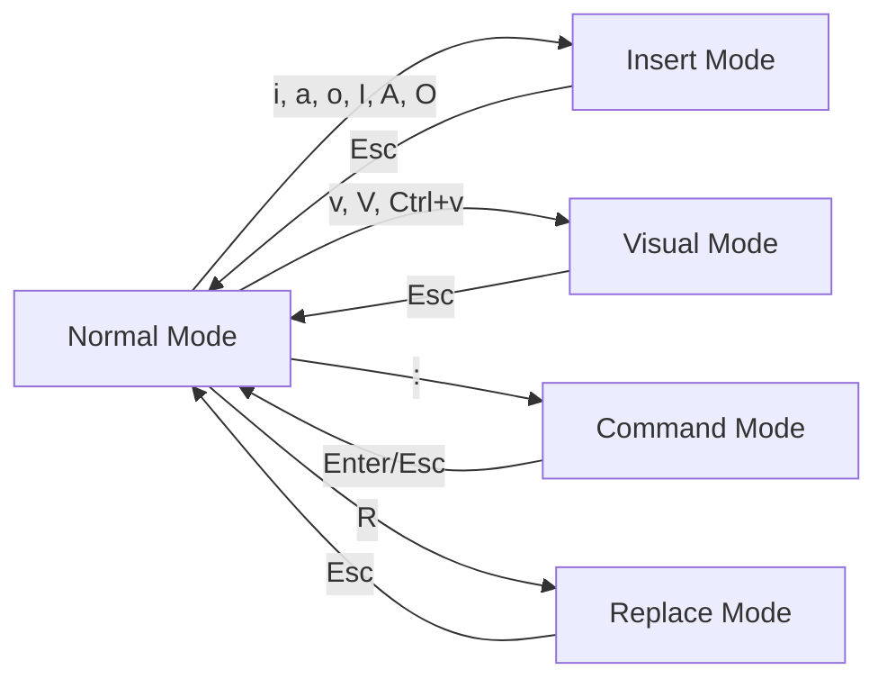

#linux #shell  #text-editor
# Basic Concepts
### Modal Editing
- Vim operates in different <mark class="hltr-yellow">modes</mark>, each optimized for specific tasks. Understanding modes is fundamental to efficient Vim usage.



**Mode Descriptions**:
- **Normal Mode**: Default mode for navigation and command execution
- **Insert Mode**: For inserting text
- **Visual Mode**: For selecting text
- **Command Mode**: For executing Ex commands (save, quit, search/replace)
- **Replace Mode**: For overwriting existing text
### File Operations
#### Open files
```Shell title="Open file with Vim"
vim filename.txt                # Open or create file
vim +10 filename.txt           # Open at line 10
vim +/pattern filename.txt     # Open at first pattern match
vim -R filename.txt            # Open in read-only mode
vim -o file1 file2            # Open with horizontal split
vim -O file1 file2            # Open with vertical split
```
#### Manage file
```vim title="File management commands"
:e filename                    # Edit new file
:w                            # Save current file
:w filename                   # Save as filename
:wa                           # Save all open files
:q                            # Quit (fails if unsaved changes)
:q!                           # Quit without saving
:wq                           # Save and quit
:x                            # Save and quit (only if changes)
:saveas filename              # Save as and continue editing new file
```
## Navigation Commands
### Character and Line Navigation
```vim title="Basic movement"
h                             # Move left
j                             # Move down
k                             # Move up
l                             # Move right
0                             # Move to beginning of line
^                             # Move to first non-blank character
$                             # Move to end of line
gg                            # Move to first line of file
G                             # Move to last line of file
10G                           # Move to line 10
:10                           # Move to line 10
```
### Word Navigation
```vim title="Word movement"
w                             # Move forward to beginning of next word
W                             # Move forward to beginning of next WORD (space-separated)
b                             # Move backward to beginning of previous word
B                             # Move backward to beginning of previous WORD
e                             # Move forward to end of word
E                             # Move forward to end of WORD
ge                            # Move backward to end of previous word
```
- word: Delimited by non-alphanumeric characters (e.g., "hello-world" is two words)
- WORD: Delimited by whitespace only (e.g., "hello-world" is one WORD)
### Screen Navigation
```vim title="Screen movement"
H                             # Move to top of screen
M                             # Move to middle of screen
L                             # Move to bottom of screen
Ctrl+f                        # Page down
Ctrl+b                        # Page up
Ctrl+d                        # Half page down
Ctrl+u                        # Half page up
Ctrl+e                        # Scroll down one line
Ctrl+y                        # Scroll up one line
zz                            # Center cursor line on screen
zt                            # Move cursor line to top
zb                            # Move cursor line to bottom
```
### Search Navigation
```vim title="Search and jump"
/pattern                      # Search forward for pattern
?pattern                      # Search backward for pattern
n                             # Repeat search forward
N                             # Repeat search backward
*                             # Search forward for word under cursor
#                             # Search backward for word under cursor
f{char}                       # Jump forward to next occurrence of {char}
F{char}                       # Jump backward to previous occurrence of {char}
t{char}                       # Jump forward to before next {char}
T{char}                       # Jump backward to after previous {char}
;                             # Repeat last f, F, t, or T command
,                             # Repeat last f, F, t, or T command in opposite direction
%                             # Jump to matching bracket/parenthesis
```
## Editing Operations
### Insert Text
```vim title="Enter insert mode"
i                             # Insert before cursor
I                             # Insert at beginning of line
a                             # Append after cursor
A                             # Append at end of line
o                             # Open new line below
O                             # Open new line above
s                             # Substitute character (delete char and enter insert mode)
S                             # Substitute line (delete line and enter insert mode)
C                             # Change to end of line
```
### Delete, Yank, and Put
- Vim uses registers to store deleted and yanked text. The unnamed register `"` stores the last delete/yank operation.
```vim title="Delete operations"
x                             # Delete character under cursor
X                             # Delete character before cursor
dd                            # Delete current line
D                             # Delete from cursor to end of line
dw                            # Delete word
d$                            # Delete to end of line
d0                            # Delete to beginning of line
dG                            # Delete to end of file
dgg                           # Delete to beginning of file
J                             # Join current line with next line
```

```vim title="Yank (copy) operations"
yy                            # Yank current line
Y                             # Yank current line (same as yy)
yw                            # Yank word
y$                            # Yank to end of line
yG                            # Yank to end of file
```

```vim title="Put (paste) operations"
p                             # Put after cursor/below line
P                             # Put before cursor/above line
]p                            # Put and adjust indentation
```

```vim title="Using named registers"
"ayy                          # Yank line into register a
"ap                           # Put from register a
"bdd                          # Delete line into register b
:reg                          # Show all registers
:reg a                        # Show register a
```
### Undo and Redo
```vim title="Undo operations"
u                             # Undo last change
U                             # Undo all changes on current line
Ctrl+r                        # Redo
:earlier 5m                   # Go back 5 minutes in time
:later 10s                    # Go forward 10 seconds in time
```

### Visual Mode Operations

```vim title="Visual mode selection"
v                             # Character-wise visual mode
V                             # Line-wise visual mode
Ctrl+v                        # Block-wise visual mode
gv                            # Reselect last visual selection
o                             # Move to other end of selection
```
- In visual mode, most normal mode commands work on the selection.
```vim title="Visual mode commands"
# After selecting text with v, V, or Ctrl+v:
d                             # Delete selection
y                             # Yank selection
c                             # Change selection (delete and enter insert mode)
>                             # Indent selection
<                             # Un-indent selection
=                             # Auto-indent selection
~                             # Toggle case
u                             # Convert to lowercase
U                             # Convert to uppercase
```
### Text Objects
- Text objects allow operations on semantic units like words, sentences, paragraphs, or delimited blocks.
```vim title="Text object commands"
# Format: <operator><a/i><object>
# operator: d (delete), c (change), y (yank), v (visual select)
# a (around - includes delimiter), i (inner - excludes delimiter)

diw                           # Delete inner word
daw                           # Delete around word (includes trailing space)
ci"                           # Change inner quoted string
ca"                           # Change around quoted string (includes quotes)
di(                           # Delete inner parentheses
da(                           # Delete around parentheses (includes parentheses)
dit                           # Delete inner tag (HTML/XML)
dat                           # Delete around tag
dip                           # Delete inner paragraph
das                           # Delete around sentence
```
- `w` - word
- `s` - sentence
- `p` - paragraph
- `"` `'` `` ` `` - quoted strings
- `(` `)` `b` - parentheses block
- `{` `}` `B` - curly brace block
- `[` `]` - square bracket block
- `<` `>` - angle bracket block
- `t` - HTML/XML tag
## Search and Replace
### Basic Search
```vim title="Search configuration"
/pattern                      # Search forward
?pattern                      # Search backward
/\cpattern                    # Case-insensitive search
/\Cpattern                    # Case-sensitive search
/pattern\c                    # Case-insensitive (flag at end)
:set ignorecase               # Ignore case in searches
:set smartcase                # Case-sensitive if uppercase in pattern
:set hlsearch                 # Highlight search results
:nohlsearch                   # Clear search highlighting (or :noh)
:set incsearch                # Incremental search (show matches while typing)
```
### Search and Replace
- Vim uses Ex commands for search and replace with syntax `:s/pattern/replacement/flags`.
```vim title="Substitute command"
:s/old/new                    # Replace first occurrence on current line
:s/old/new/g                  # Replace all occurrences on current line
:s/old/new/gc                 # Replace all with confirmation
:%s/old/new/g                 # Replace all in entire file
:10,20s/old/new/g            # Replace all in lines 10-20
:.,$s/old/new/g              # Replace from current line to end
:'<,'>s/old/new/g            # Replace in visual selection
:g/pattern/s/old/new/g       # Replace in lines matching pattern
```
**Flags**:
- `g` - Global (all occurrences on line)
- `c` - Confirm each substitution
- `i` - Case-insensitive
- `I` - Case-sensitive
**Special Characters**:
```vim title="Regular expressions in search"
.                             # Any single character
*                             # Zero or more of previous
\+                            # One or more of previous
\?                            # Zero or one of previous
^                             # Start of line
$                             # End of line
\<                            # Start of word
\>                            # End of word
[abc]                         # Any character in set
[^abc]                        # Any character not in set
\(pattern\)                   # Capture group
\1, \2, ...                   # Backreference to capture group
```
**Examples**:
```vim title="Practical substitution examples"
:%s/\s\+$//                   # Remove trailing whitespace
:%s/^/# /                     # Comment all lines (add # at start)
:%s/\<old\>/new/g            # Replace whole word only
:%s/\(.*\)/"\1"/             # Quote each line
:g/^$/d                       # Delete all empty lines
```
## Windows and Buffers
### Window Management
- Vim supports multiple windows (splits) viewing same or different buffers.
```vim title="Window commands"
:split filename               # Horizontal split
:vsplit filename              # Vertical split
Ctrl+w s                      # Split window horizontally
Ctrl+w v                      # Split window vertically
Ctrl+w q                      # Close current window
Ctrl+w o                      # Close all windows except current
Ctrl+w h/j/k/l               # Navigate between windows
Ctrl+w H/J/K/L               # Move window to far left/bottom/top/right
Ctrl+w =                      # Equalize window sizes
Ctrl+w _                      # Maximize window height
Ctrl+w |                      # Maximize window width
Ctrl+w +/-                    # Increase/decrease window height
Ctrl+w >/<                    # Increase/decrease window width
```
### Buffer Management

- Buffers are in-memory text files. Multiple buffers can be open with one or more visible in windows.

```vim title="Buffer commands"
:ls                           # List all buffers
:bnext                        # Next buffer (or :bn)
:bprevious                    # Previous buffer (or :bp)
:buffer 3                     # Go to buffer 3 (or :b3)
:bfirst                       # First buffer
:blast                        # Last buffer
:badd filename                # Add file to buffer list
:bdelete                      # Delete current buffer (or :bd)
:bdelete 3                    # Delete buffer 3
:bufdo %s/old/new/g          # Execute command on all buffers
```
### Tabs
```vim title="Tab management"
:tabnew filename              # Open file in new tab
:tabnext                      # Next tab (or gt)
:tabprevious                  # Previous tab (or gT)
:tabclose                     # Close current tab
:tabonly                      # Close all tabs except current
:tabs                         # List all tabs
```
## Configuration and Customization
### Basic Settings

- Vim configuration is stored in `~/.vimrc` (Unix/Linux) or `_vimrc` (Windows).

```vim title="Common .vimrc settings"
" General settings
set number                    " Show line numbers
set relativenumber            " Show relative line numbers
set ruler                     " Show cursor position
set showcmd                   " Show command in bottom bar
set cursorline                " Highlight current line
set wildmenu                  " Visual autocomplete for command menu
set showmatch                 " Highlight matching brackets

" Indentation
set tabstop=4                 " Number of spaces for tab
set shiftwidth=4              " Number of spaces for indentation
set expandtab                 " Convert tabs to spaces
set autoindent                " Copy indent from current line
set smartindent               " Smart autoindenting

" Search
set ignorecase                " Ignore case in search
set smartcase                 " Case-sensitive if uppercase present
set incsearch                 " Incremental search
set hlsearch                  " Highlight search results

" Performance
set lazyredraw                " Redraw only when needed
set ttyfast                   " Faster redrawing

" Backup and swap
set nobackup                  " Disable backup files
set noswapfile                " Disable swap files
set undofile                  " Enable persistent undo
set undodir=~/.vim/undodir    " Undo directory

" Interface
set scrolloff=8               " Keep 8 lines above/below cursor
set sidescrolloff=8           " Keep 8 columns left/right of cursor
set nowrap                    " Don't wrap lines
set splitbelow                " Horizontal splits below
set splitright                " Vertical splits to right
syntax enable                 " Enable syntax highlighting
filetype plugin indent on     " Enable filetype detection
```
### Key Mappings
- Custom key mappings enhance productivity by creating shortcuts.
```vim title="Mapping examples"
" Leader key (default is \)
let mapleader = " "           " Set leader to space

" Normal mode mappings
nnoremap <leader>w :w<CR>     " Quick save
nnoremap <leader>q :q<CR>     " Quick quit
nnoremap <C-h> <C-w>h         " Navigate windows with Ctrl+hjkl
nnoremap <C-j> <C-w>j
nnoremap <C-k> <C-w>k
nnoremap <C-l> <C-w>l
nnoremap <leader>n :noh<CR>   " Clear search highlight

" Insert mode mappings
inoremap jk <Esc>             " Exit insert mode with jk

" Visual mode mappings
vnoremap < <gv                " Stay in visual mode after indent
vnoremap > >gv

" Command mode mappings
cnoremap w!! w !sudo tee % > /dev/null  " Save with sudo
```

- `map` - Map for normal, visual, and operator-pending modes
- `nmap` - Map for normal mode
- `imap` - Map for insert mode
- `vmap` - Map for visual mode
- `cmap` - Map for command mode
- Use `noremap` variants (`nnoremap`, `inoremap`, etc.) to prevent recursive mapping.
### Plugin Management

```Shell title="Install vim-plug"
curl -fLo ~/.vim/autoload/plug.vim --create-dirs \
    https://raw.githubusercontent.com/junegunn/vim-plug/master/plug.vim
```

```vim title=".vimrc plugin configuration"
call plug#begin('~/.vim/plugged')

" File explorer
Plug 'preservim/nerdtree'

" Fuzzy finder
Plug 'junegunn/fzf', { 'do': { -> fzf#install() } }
Plug 'junegunn/fzf.vim'

" Status line
Plug 'vim-airline/vim-airline'

" Git integration
Plug 'tpope/vim-fugitive'

" Auto-completion
Plug 'neoclide/coc.nvim', {'branch': 'release'}

" Syntax highlighting
Plug 'sheerun/vim-polyglot'

" Color schemes
Plug 'morhetz/gruvbox'

call plug#end()

" Plugin settings
colorscheme gruvbox
let g:airline_powerline_fonts = 1
```

```vim title="Plugin commands"
:PlugInstall                  # Install plugins
:PlugUpdate                   # Update plugins
:PlugClean                    # Remove unlisted plugins
:PlugUpgrade                  # Upgrade vim-plug itself
```
## Macros and Automation
### Recording Macros
- Macros record and replay sequences of commands.
```vim title="Macro commands"
qa                            # Start recording macro in register a
# ... perform operations ...
q                             # Stop recording
@a                            # Play macro from register a
@@                            # Replay last executed macro
10@a                          # Execute macro 10 times
:reg a                        # View macro content
```

```vim title="Format CSV to Markdown table"
# Convert: name,age,city
# To: | name | age | city |

qa                            # Start recording
I| <Esc>                      # Add | at beginning
:s/,/ | /g<CR>                # Replace commas with |
A |<Esc>                      # Add | at end
j                             # Move to next line
q                             # Stop recording

# Then run on remaining lines:
10@a                          # Execute on next 10 lines
```
### Command-line Editing
```vim title="Ex command history"
:                             # Enter command mode
<Up>/<Down>                   # Navigate command history
Ctrl+r "                      # Insert from unnamed register
Ctrl+r /                      # Insert last search pattern
q:                            # Open command-line window (editable history)
```
## Practical Use Cases
### Bulk Code Refactoring
```bash title="Multi-file search and replace"
# Using vim arguments
vim *.js

# In vim:
:argdo %s/oldFunctionName/newFunctionName/ge | update
```
- `:argdo` - Execute command on all argument files
- `%s/old/new/ge` - Substitute globally, suppress errors
- `| update` - Save each file if modified
### Code Block Manipulation
```vim title="Indent multiple lines"
# Method 1: Visual mode
V10j                          # Select 10 lines
>                             # Indent once
4>                            # Indent 4 more times

# Method 2: Normal mode with count
>10j                          # Indent from current line down 10 lines
=i{                           # Auto-indent inner block
```
### Column Editing
- Visual block mode enables editing multiple lines simultaneously:
```vim title="Add semicolons to multiple lines"
# Original:
# let x = 1
# let y = 2
# let z = 3

Ctrl+v                        # Enter visual block mode
3j                            # Select 3 lines
$                             # Move to end of lines
A;                            # Append semicolon
Esc                           # Apply to all selected lines

# Result:
# let x = 1;
# let y = 2;
# let z = 3;
```
### Quick Documentation Navigation
```vim title="Navigate code documentation"
# In source code with ctags
Ctrl+]                        # Jump to tag definition
Ctrl+t                        # Jump back
:tag functionName             # Jump to tag
:tags                         # Show tag stack
:tnext                        # Next matching tag
:tprev                        # Previous matching tag

# Generate ctags
# From shell:
ctags -R .                    # Generate tags for current directory
```
### Log File Analysis
```vim title="Filter and analyze logs"
# View only ERROR lines
:g!/ERROR/d                   # Delete all non-ERROR lines
# Or
:v/ERROR/d                    # Same as above (:v is inverse of :g)

# Extract timestamps
:%s/^\(\d\{4}-\d\{2}-\d\{2} \d\{2}:\d\{2}:\d\{2}\).*$/\1/

# Count occurrences
:%s/ERROR//gn                 # Count without replacing (n flag)

# Sort lines
:%!sort                       # Sort entire file
:10,50!sort                   # Sort lines 10-50
```
### Text Transformation Pipeline
```vim title="Convert JSON to CSV"
# Original JSON:
# {"name": "Alice", "age": 30}
# {"name": "Bob", "age": 25}

# Remove braces
:%s/[{}]//g

# Remove quotes
:%s/"//g

# Replace colons and commas
:%s/:\s*/=/g
:%s/,\s*/,/g

# Extract values
:%s/name=\(.*\),age=\(.*\)/\1,\2/
```
### Diff and Merge
```Shell title="Compare files"
vim -d file1.txt file2.txt    # Open in diff mode
# Or from within vim:
:diffsplit file2.txt          # Split with diff
```

```vim title="Diff commands"
]c                            # Jump to next change
[c                            # Jump to previous change
do                            # Diff obtain (pull change from other file)
dp                            # Diff put (push change to other file)
:diffupdate                   # Update diff
:diffget                      # Get changes from other buffer
:diffput                      # Put changes to other buffer
```

## Advanced Features
### Marks
- Marks are bookmarks within files.
```vim title="Mark commands"
ma                            # Set mark 'a' at current position
'a                            # Jump to line of mark a
`a                            # Jump to exact position of mark a
:marks                        # List all marks
:delmarks a                   # Delete mark a
:delmarks!                    # Delete all lowercase marks

# Automatic marks:
'.                            # Jump to last change
''                            # Jump to previous position
'[                            # Jump to start of last change/yank
']                            # Jump to end of last change/yank
```
### Folding
```vim title="Code folding"
:set foldmethod=indent        # Fold based on indentation
:set foldmethod=syntax        # Fold based on syntax
:set foldmethod=marker        # Fold based on markers {{{ }}}

zf                            # Create fold (in visual mode)
zo                            # Open fold
zc                            # Close fold
za                            # Toggle fold
zR                            # Open all folds
zM                            # Close all folds
zd                            # Delete fold
```

### Quickfix and Location Lists
- Quickfix lists store locations for compiler errors or search results.
```vim title="Quickfix commands"
:make                         # Run make and populate quickfix
:vimgrep /pattern/ **/*.js    # Search and populate quickfix
:copen                        # Open quickfix window
:cclose                       # Close quickfix window
:cnext                        # Next item (or :cn)
:cprevious                    # Previous item (or :cp)
:cfirst                       # First item
:clast                        # Last item
:cdo %s/old/new/g            # Execute command on each quickfix entry
```
### Spell Checking
```vim title="Spell check"
:set spell                    # Enable spell checking
:set spelllang=en_us          # Set language
]s                            # Next misspelling
[s                            # Previous misspelling
z=                            # Suggest corrections
zg                            # Add word to dictionary
zw                            # Mark word as misspelling
:set nospell                  # Disable spell checking
```
## Performance and Troubleshooting
### Performance Optimization
```vim title="Performance commands"
:syntime on                   # Start syntax timing
:syntime report               # Show syntax timing report
:profile start profile.log    # Start profiling
:profile func *               # Profile all functions
:profile file *               # Profile all files
:set lazyredraw               # Reduce redraws
:set regexpengine=1           # Use old regex engine (sometimes faster)
```
### Debugging

```vim title="Debug configuration"
:verbose set option?          # Show where option was last set
:scriptnames                  # List all sourced scripts
:messages                     # Show message history
:echo &runtimepath            # Show runtime path
:checkhealth                  # Check configuration (Neovim)
```
### Recovery
```vim title="Recover from crashes"
# From command line:
vim -r filename               # Recover from swap file

# In vim:
:recover                      # Recover from swap file
:swapname                     # Show swap file name
:set noswapfile               # Disable swap file creation
```
***
# References
1. 
