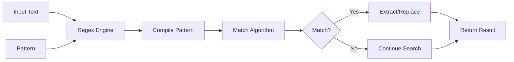

#linux #unix #shell #regular-expression 
# Basic Concepts
- Regular expressions (regex) are patterns used to match character combinations in text. They provide a powerful and flexible way to search, match, and manipulate text data.
- Regular expressions are fundamental to Unix text processing tools including `grep`, `sed`, `awk`, `vim`, and scripting languages.
### Pattern Matching Process

- **Pattern**: Sequence of characters defining a search pattern
- **Matching Engine**: Algorithm that applies pattern to text (backtracking, NFA, DFA)
- **Metacharacters**: Special characters with specific meanings (`.`, `*`, `+`, `?`, `[]`, `()`, `{}`, `^`, `$`, `|`, `\`)
- **Literals**: Characters that match themselves (alphanumeric characters)
## Regex Flavors
### Basic Regular Expressions (BRE)
- Used by default in `grep`, `sed`, and `ed`
- Requires backslashes to enable special meaning for `(`, `)`, `{`, `}`, `+`, `?`, `|`
- More verbose but maintains backward compatibility with older Unix tools
```Shell title="BRE examples"
# Parentheses need escaping for grouping
grep '\(pattern\)' file.txt

# Quantifiers need escaping
grep 'a\+' file.txt                     # One or more 'a'
grep 'a\{3,5\}' file.txt                # Between 3 and 5 'a'
```
### Extended Regular Expressions (ERE)
- Used with `grep -E` (or `egrep`), `sed -E`, `awk`
- Metacharacters `(`, `)`, `{`, `}`, `+`, `?`, `|` are special without backslashes
- More intuitive and readable for complex patterns
```Shell title="ERE examples"
# No escaping needed for grouping
grep -E '(pattern)' file.txt

# Clean quantifier syntax
grep -E 'a+' file.txt                   # One or more 'a'
grep -E 'a{3,5}' file.txt               # Between 3 and 5 'a'
```
### Perl-Compatible Regular Expressions (PCRE)
- Used with `grep -P`, Perl, Python, PHP, JavaScript (with variations)
- Supports advanced features: lookahead, lookbehind, non-capturing groups, atomic groups
- Provides shorthand character classes: `\d`, `\w`, `\s`
```Shell title="PCRE examples"
# Shorthand character classes
grep -P '\d{3}-\d{4}' file.txt          # Digit shorthand

# Lookahead and lookbehind
grep -P '(?<=@)\w+\.\w+' emails.txt     # Domain after @
grep -P '\w+(?=@)' emails.txt           # Username before @
```
# Character Classes
## Basic Character Classes
- Character classes match any single character from a set of characters enclosed in square brackets.
```Shell title="Character class syntax"
[abc]                                    # Matches a, b, or c
[^abc]                                   # Matches any character except a, b, c
[a-z]                                    # Matches any lowercase letter
[A-Z]                                    # Matches any uppercase letter
[0-9]                                    # Matches any digit
[a-zA-Z0-9]                              # Matches any alphanumeric character
```
### Practical Example: Validate Hexadecimal
```Shell title="Match hexadecimal color codes"
# Pattern explanation: # followed by 6 hex digits
echo "#FF5733" | grep -E '^#[0-9A-Fa-f]{6}$'
# ^           - Start of line
# #           - Literal hash character
# [0-9A-Fa-f] - Any hex digit (0-9, A-F, a-f)
# {6}         - Exactly 6 times
# $           - End of line

# Test cases
echo "#FF5733" | grep -E '^#[0-9A-Fa-f]{6}$'  # Match
echo "#GG5733" | grep -E '^#[0-9A-Fa-f]{6}$'  # No match (G invalid)
echo "#FF57"   | grep -E '^#[0-9A-Fa-f]{6}$'  # No match (too short)
```
## POSIX Character Classes
- POSIX classes provide locale-aware character matching using `[[:class:]]` syntax.
```Shell title="POSIX character classes"
[[:alnum:]]                              # Alphanumeric characters [A-Za-z0-9]
[[:alpha:]]                              # Alphabetic characters [A-Za-z]
[[:digit:]]                              # Digits [0-9]
[[:lower:]]                              # Lowercase letters [a-z]
[[:upper:]]                              # Uppercase letters [A-Z]
[[:space:]]                              # Whitespace characters (space, tab, newline)
[[:punct:]]                              # Punctuation characters
[[:xdigit:]]                             # Hexadecimal digits [0-9A-Fa-f]
[[:blank:]]                              # Space and tab only
[[:print:]]                              # Printable characters
[[:graph:]]                              # Visible characters (non-space printable)
```
### Practical Example: Extract Valid Usernames
```Shell title="Find valid Linux usernames"
# Pattern: alphanumeric and underscore, 3-16 characters
grep -E '^[[:alnum:]_]{3,16}$' usernames.txt
# ^            - Start of line
# [[:alnum:]_] - Letters, digits, underscore
# {3,16}       - Between 3 and 16 characters
# $            - End of line

# Test cases
echo "john_doe" | grep -E '^[[:alnum:]_]{3,16}$'    # Match
echo "a"        | grep -E '^[[:alnum:]_]{3,16}$'    # No match (too short)
echo "user-name" | grep -E '^[[:alnum:]_]{3,16}$'   # No match (hyphen invalid)
```
## Shorthand Character Classes (PCRE)
- PCRE provides concise notation for common character classes.
```Shell title="PCRE shorthand classes"
\d                                       # Digit [0-9]
\D                                       # Non-digit [^0-9]
\w                                       # Word character [A-Za-z0-9_]
\W                                       # Non-word character [^A-Za-z0-9_]
\s                                       # Whitespace [ \t\n\r\f\v]
\S                                       # Non-whitespace [^ \t\n\r\f\v]
```
### Practical Example: Parse Log Timestamps
```Shell title="Extract timestamps from logs"
# Pattern: YYYY-MM-DD HH:MM:SS
grep -Po '\d{4}-\d{2}-\d{2} \d{2}:\d{2}:\d{2}' app.log
# \d{4}    - Four digits (year)
# -        - Literal hyphen
# \d{2}    - Two digits (month)
# -        - Literal hyphen
# \d{2}    - Two digits (day)
# (space)  - Literal space
# \d{2}    - Two digits (hour)
# :        - Literal colon
# \d{2}    - Two digits (minute)
# :        - Literal colon
# \d{2}    - Two digits (second)

# Example log line:
# 2024-01-18 14:23:45 INFO User logged in
# Extracted: 2024-01-18 14:23:45
```
# Metacharacters
## Dot Metacharacter
- The dot `.` matches any single character except newline (in most contexts).
```Shell title="Dot metacharacter"
# Match any three-letter word
echo "cat bat mat" | grep -Eo '\b...\b'
# Output: cat bat mat

# Match file extensions
ls | grep '.*\.txt$'
# .     - Any characters
# *     - Zero or more times
# \.    - Literal dot (escaped)
# txt   - Literal "txt"
# $     - End of line
```
### Practical Example: Mask Credit Card Numbers
```Shell title="Replace credit card middle digits"
# Pattern: keep first 4 and last 4 digits, mask middle
echo "4532-1234-5678-9010" | sed -E 's/([0-9]{4}-)([0-9]{4}-[0-9]{4}-)([0-9]{4})/\1****-****-\3/'
# ([0-9]{4}-)           - Group 1: First 4 digits + hyphen
# ([0-9]{4}-[0-9]{4}-)  - Group 2: Middle 8 digits (to be masked)
# ([0-9]{4})            - Group 3: Last 4 digits
# \1****-****-\3        - Replace with group 1, asterisks, group 3

# Output: 4532-****-****-9010
```
## Escape Character
- Backslash `\` escapes metacharacters to match them literally.
```Shell title="Escaping special characters"
# Match literal dot
echo "file.txt" | grep 'file\.txt'

# Match literal asterisk
echo "2 * 3 = 6" | grep '\*'

# Match literal dollar sign
echo "Price: $50" | grep '\$50'

# Match literal brackets
echo "array[0]" | grep 'array\[0\]'
```
### Practical Example: Find IP Addresses
```Shell title="Extract IPv4 addresses"
# Pattern: four octets separated by dots
grep -Eo '([0-9]{1,3}\.){3}[0-9]{1,3}' network.log
# [0-9]{1,3}  - 1 to 3 digits
# \.          - Literal dot (escaped)
# {3}         - Repeat "digit.digit.digit" three times
# [0-9]{1,3}  - Final octet (1 to 3 digits)

# Example matches:
# 192.168.1.1
# 10.0.0.255
# 172.16.254.1

# More precise pattern (valid IP ranges 0-255)
grep -Eo '((25[0-5]|2[0-4][0-9]|[01]?[0-9][0-9]?)\.){3}(25[0-5]|2[0-4][0-9]|[01]?[0-9][0-9]?)' network.log
# 25[0-5]           - 250-255
# 2[0-4][0-9]       - 200-249
# [01]?[0-9][0-9]?  - 0-199
```
# Quantifiers
- Quantifiers specify how many times a pattern element should occur.
## Basic Quantifiers
```Shell title="Quantifier syntax"
*                                        # Zero or more times
+                                        # One or more times (ERE/PCRE)
\+                                       # One or more times (BRE)
?                                        # Zero or one time (ERE/PCRE)
\?                                       # Zero or one time (BRE)
{n}                                      # Exactly n times
{n,}                                     # At least n times
{n,m}                                    # Between n and m times
```
### Practical Example: Validate Phone Numbers
```Shell title="Match US phone number formats"
# Pattern: (123) 456-7890 or 123-456-7890
grep -E '(\([0-9]{3}\) |[0-9]{3}-)[0-9]{3}-[0-9]{4}' phones.txt
# \(         - Literal opening parenthesis (escaped)
# [0-9]{3}   - Exactly 3 digits
# \)         - Literal closing parenthesis (escaped)
# (space)    - Literal space
# |          - OR
# [0-9]{3}-  - 3 digits followed by hyphen
# [0-9]{3}   - Exactly 3 digits
# -          - Literal hyphen
# [0-9]{4}   - Exactly 4 digits

# Test cases
echo "(555) 123-4567" | grep -E '(\([0-9]{3}\) |[0-9]{3}-)[0-9]{3}-[0-9]{4}'  # Match
echo "555-123-4567"   | grep -E '(\([0-9]{3}\) |[0-9]{3}-)[0-9]{3}-[0-9]{4}'  # Match
echo "555 123 4567"   | grep -E '(\([0-9]{3}\) |[0-9]{3}-)[0-9]{3}-[0-9]{4}'  # No match
```
## Greedy vs Non-Greedy
- By default, quantifiers are greedy (match as much as possible).
- Adding `?` after a quantifier makes it non-greedy (match as little as possible) in PCRE.
```Shell title="Greedy vs non-greedy matching"
# Greedy (matches longest possible string)
echo "<p>text</p> <span>more</span>" | grep -oE '<.*>'
# Output: <p>text</p> <span>more</span>
# (matches from first < to last >)

# Non-greedy (PCRE only)
echo "<p>text</p> <span>more</span>" | grep -oP '<.*?>'
# Output: <p>
#         </p>
#         <span>
#         </span>
# (matches shortest string between < and >)

# Better solution for HTML: character class
echo "<p>text</p> <span>more</span>" | grep -oE '<[^>]*>'
# [^>]* - Any character except >, zero or more times
# Output: <p>
#         </p>
#         <span>
#         </span>
```
### Practical Example: Extract URLs from HTML
```Shell title="Extract href attributes from HTML"
# Greedy approach (can fail with multiple links on one line)
echo '<a href="link1.html">Text</a> <a href="link2.html">More</a>' | grep -oE 'href=".*"'
# Output: href="link1.html">Text</a> <a href="link2.html"
# (Greedy .* matches too much)

# Non-greedy approach (PCRE)
echo '<a href="link1.html">Text</a> <a href="link2.html">More</a>' | grep -oP 'href=".*?"'
# Output: href="link1.html"
#         href="link2.html"

# Character class approach (works with BRE/ERE)
echo '<a href="link1.html">Text</a> <a href="link2.html">More</a>' | grep -oE 'href="[^"]*"'
# [^"]* - Any character except quote, zero or more times
# Output: href="link1.html"
#         href="link2.html"

# Extract just the URL
echo '<a href="link1.html">Text</a> <a href="link2.html">More</a>' | grep -oP '(?<=href=")[^"]*'
# (?<=href=") - Positive lookbehind for href="
# [^"]*       - Any non-quote characters
# Output: link1.html
#         link2.html
```
# Anchors and Boundaries
## Line Anchors
- Anchors match positions rather than characters.
```Shell title="Line anchor syntax"
^                                        # Start of line -> caret
$                                        # End of line -> dollar
```
### Practical Example: Find Configuration Lines
```Shell title="Extract active configurations"
# Find non-comment, non-empty lines
grep -v '^#' /etc/ssh/sshd_config | grep -v '^$'
# ^#  - Lines starting with #
# -v  - Invert match (exclude)
# ^$  - Empty lines (start immediately followed by end)

# Combined pattern
grep -E '^[^#]' /etc/ssh/sshd_config | grep -v '^$'
# ^[^#] - Lines not starting with #

# Single pattern for active config
grep -E '^[[:space:]]*[^#[:space:]]' /etc/ssh/sshd_config
# ^[[:space:]]* - Start of line, optional whitespace
# [^#[:space:]] - First non-whitespace, non-comment character
```
### Practical Example: Validate Email Format
```Shell title="Basic email validation"
# Pattern: username@domain.tld
echo "user@example.com" | grep -E '^[A-Za-z0-9._%+-]+@[A-Za-z0-9.-]+\.[A-Z|a-z]{2,}$'
# ^                    - Start of line
# [A-Za-z0-9._%+-]+    - Username (alphanumeric and special chars)
# @                    - Literal @ symbol
# [A-Za-z0-9.-]+       - Domain name
# \.                   - Literal dot (escaped)
# [A-Z|a-z]{2,}        - TLD (at least 2 letters)
# $                    - End of line

# Test cases
echo "user@example.com"      | grep -E '^[A-Za-z0-9._%+-]+@[A-Za-z0-9.-]+\.[A-Z|a-z]{2,}$'  # Match
echo "user.name@sub.domain.com" | grep -E '^[A-Za-z0-9._%+-]+@[A-Za-z0-9.-]+\.[A-Z|a-z]{2,}$'  # Match
echo "invalid@"              | grep -E '^[A-Za-z0-9._%+-]+@[A-Za-z0-9.-]+\.[A-Z|a-z]{2,}$'  # No match
echo "@example.com"          | grep -E '^[A-Za-z0-9._%+-]+@[A-Za-z0-9.-]+\.[A-Z|a-z]{2,}$'  # No match
```
## Word Boundaries
- Word boundaries match positions between word and non-word characters.
```Shell title="Word boundary syntax"
\<                                       # Start of word (BRE/ERE)
\>                                       # End of word (BRE/ERE)
\b                                       # Word boundary (PCRE/ERE -E)
\B                                       # Non-word boundary (PCRE)
```
### Practical Example: Find Whole Words
```Shell title="Search for whole word matches"
# Problem: searching for "cat" also matches "category", "concatenate"
echo "The cat sat on the category mat" | grep 'cat'
# Output: The cat sat on the category mat
# (highlights both "cat" and "cat" in "category")

# Solution: use word boundaries
echo "The cat sat on the category mat" | grep '\<cat\>'
# Output: The cat sat on the category mat
# (only highlights standalone "cat")

# PCRE word boundary
echo "The cat sat on the category mat" | grep -P '\bcat\b'

# Practical use: find variable usage in code
grep -rn '\<userName\>' src/
# Finds: userName, but not userNamespace or getUserName
```
### Practical Example: Replace Whole Words Only
```Shell title="Replace variable names safely"
# Problem: replacing "id" might affect "valid", "iden", etc.
echo "The id is valid andiden matches" | sed 's/id/ID/g'
# Output: The ID is valID and IDen matches
# (incorrect - replaced partial matches)

# Solution: use word boundaries
echo "The id is valid and iden matches" | sed 's/\<id\>/ID/g'
# Output: The ID is valid and iden matches
# (correct - only replaced whole word "id")

# Replace variable in source code
sed -i 's/\<oldVar\>/newVar/g' script.js
# Only replaces complete "oldVar", not "oldVariable" or "myOldVar"
```
# Groups and Backreferences
## Capturing Groups
- Parentheses create capturing groups that store matched text for later use.
```Shell title="Capturing group syntax"
(pattern)                                # Capturing group (ERE/PCRE)
\(pattern\)                              # Capturing group (BRE)
\1, \2, ...                              # Backreference to captured groups
```
### Practical Example: Swap Fields
```Shell title="Reorder date format"
# Convert YYYY-MM-DD to DD/MM/YYYY
echo "2024-01-18" | sed -E 's/([0-9]{4})-([0-9]{2})-([0-9]{2})/\3\/\2\/\1/'
# ([0-9]{4})  - Group 1: Year (4 digits)
# -           - Literal hyphen
# ([0-9]{2})  - Group 2: Month (2 digits)
# -           - Literal hyphen
# ([0-9]{2})  - Group 3: Day (2 digits)
# \3\/\2\/\1  - Replacement: day/month/year

# Output: 18/01/2024

# BRE version (sed without -E)
echo "2024-01-18" | sed 's/\([0-9]\{4\}\)-\([0-9]\{2\}\)-\([0-9]\{2\}\)/\3\/\2\/\1/'
```
### Practical Example: Extract Domain from Email
```Shell title="Extract email components"
# Extract username and domain separately
echo "john.doe@example.com" | sed -E 's/(.*)@(.*)/Username: \1\nDomain: \2/'
# (.*)  - Group 1: Everything before @ (username)
# @     - Literal @
# (.*)  - Group 2: Everything after @ (domain)

# Output:
# Username: john.doe
# Domain: example.com

# Extract just domain using PCRE lookbehind
echo "john.doe@example.com" | grep -oP '(?<=@).*'
# (?<=@)  - Positive lookbehind: preceded by @
# .*      - Match everything after @
# Output: example.com
```
## Backreferences
- Backreferences match the same text that was matched by a capturing group.
```Shell title="Backreference examples"
# Find repeated words
grep -E '\b(\w+)\s+\1\b' document.txt
# \b        - Word boundary
# (\w+)     - Group 1: One or more word characters
# \s+       - One or more whitespace
# \1        - Same text as group 1 (repeated word)
# \b        - Word boundary

# Matches: "the the", "is is", "test test"
```
### Practical Example: Find Duplicate Lines
```Shell title="Detect repeated content"
# Find lines with repeated patterns
echo "This is is a test" | grep -E '(\w+) \1'
# Output: This is is a test
# (detects "is is")

# Find lines with same word at start and end
echo "error in processing error" | grep -E '^(\w+).*\1$'
# ^       - Start of line
# (\w+)   - Group 1: First word
# .*      - Any characters in between
# \1      - Same as first word
# $       - End of line

# Output: error in processing error
```
### Practical Example: Validate Repeated Patterns
```Shell title="Check password complexity"
# Reject passwords with consecutive repeated characters
echo "password" | grep -E '(.)\1{2,}'
# (.)     - Group 1: Any character
# \1{2,}  - Same character repeated 2 or more times

# Matches: "aaa", "111", "..." (3+ consecutive identical chars)
# password - No match (no 3+ consecutive identical)
# passswword - Match (has "sss")
```
## Non-Capturing Groups
- Non-capturing groups group patterns without storing the match for backreferences.
```Shell title="Non-capturing group syntax (PCRE)"
(?:pattern)                              # Non-capturing group

# Use when you need grouping but not backreference
echo "file.txt" | grep -P '(?:file|document)\.txt'
# (?:file|document) - Match "file" or "document" without capturing
# \.txt             - Literal .txt
```
### Practical Example: Optimize Complex Patterns
```Shell title="Group without capturing"
# Match URLs without capturing protocol
grep -P '(?:https?|ftp)://[^\s]+' urls.txt
# (?:https?|ftp)  - Match http, https, or ftp (don't capture)
# ://             - Literal ://
# [^\s]+          - One or more non-whitespace

# Saves memory and improves performance vs capturing group (https?|ftp)
```
# Alternation
- The pipe `|` operator matches either the pattern before or after it.
```Shell title="Alternation syntax"
pattern1|pattern2                        # Match pattern1 OR pattern2 (ERE/PCRE)
\(pattern1\|pattern2\)                   # Alternation in group (BRE)
```
### Practical Example: Filter Log Levels
```Shell title="Match multiple severity levels"
# Find ERROR, WARN, or FATAL messages
grep -E '(ERROR|WARN|FATAL)' application.log
# Matches any line containing ERROR, WARN, or FATAL

# More specific: match at word boundaries
grep -E '\b(ERROR|WARN|FATAL)\b' application.log

# Match with specific format
grep -E '^\[.*\] (ERROR|WARN|FATAL):' application.log
# ^\[.*\]              - Start with [timestamp]
# (space)              - Literal space
# (ERROR|WARN|FATAL)   - One of these levels
# :                    - Literal colon

# Example matches:
# [2024-01-18 14:23:45] ERROR: Connection failed
# [2024-01-18 14:23:46] WARN: Retry attempt 1
# [2024-01-18 14:23:47] FATAL: Unable to recover
```
### Practical Example: Match File Extensions
```Shell title="Find multiple file types"
# Find Python, JavaScript, or Java files
find . -type f | grep -E '\.(py|js|java)$'
# \.           - Literal dot (escaped)
# (py|js|java) - One of these extensions
# $            - End of line

# More robust with word boundary
find . -type f | grep -E '\.(py|js|java)\b'

# Case-insensitive for Windows compatibility
find . -type f | grep -iE '\.(txt|pdf|doc|docx)$'
```
# Lookahead and Lookbehind (PCRE)
- Assertions that match a position without consuming characters.
## Positive Lookahead
- Matches if pattern ahead exists, but doesn't include it in match.
```Shell title="Positive lookahead syntax"
(?=pattern)                              # Pattern must follow

# Match digits followed by "px"
echo "font: 14px" | grep -oP '\d+(?=px)'
# \d+      - One or more digits
# (?=px)   - Must be followed by "px"
# Output: 14 (px not included)
```
### Practical Example: Password Validation
```Shell title="Require multiple character types"
# Password must contain at least one digit
grep -P '^(?=.*\d).{8,}$' passwords.txt
# ^           - Start
# (?=.*\d)    - Lookahead: must contain a digit somewhere
# .{8,}       - At least 8 characters
# $           - End

# Password must contain digit AND uppercase AND lowercase
grep -P '^(?=.*\d)(?=.*[a-z])(?=.*[A-Z]).{8,}$' passwords.txt
# (?=.*\d)       - Must contain digit
# (?=.*[a-z])    - Must contain lowercase
# (?=.*[A-Z])    - Must contain uppercase
# .{8,}          - At least 8 characters total

# Test cases
echo "password"     # No match (no digit, no uppercase)
echo "Password"     # No match (no digit)
echo "Password1"    # Match (has all requirements)
```
## Negative Lookahead
- Matches if pattern ahead does NOT exist.
```Shell title="Negative lookahead syntax"
(?!pattern)                              # Pattern must NOT follow

# Match numbers not followed by %
echo "Discount: 50 Price: 100%" | grep -oP '\d+(?!%)'
# \d+    - One or more digits
# (?!%)  - NOT followed by %
# Output: 50 100 (but not the 0 in 100%)
```
### Practical Example: Exclude Specific Patterns
```Shell title="Find words not followed by specific suffix"
# Find "file" not followed by "name"
echo "file system filename file" | grep -oP '\bfile(?!name)\b'
# \bfile    - Word "file"
# (?!name)  - NOT followed by "name"
# \b        - Word boundary
# Output: file (first and third occurrence, not "filename")
```
## Positive Lookbehind
- Matches if pattern behind exists, but doesn't include it in match.
```Shell title="Positive lookbehind syntax"
(?<=pattern)                             # Pattern must precede

# Extract domain from email
echo "Contact: user@example.com" | grep -oP '(?<=@)[a-z0-9.-]+'
# (?<=@)         - Must be preceded by @
# [a-z0-9.-]+    - Domain characters
# Output: example.com
```
### Practical Example: Extract Values After Keywords
```Shell title="Parse configuration values"
# Extract value after "port="
echo "server.port=8080" | grep -oP '(?<=port=)\d+'
# (?<=port=)  - Must be preceded by "port="
# \d+         - One or more digits
# Output: 8080

# Extract multiple config values
cat config.properties | grep -oP '(?<=database\.url=).*'
# Extracts everything after "database.url="

# Extract JSON values
echo '{"name":"John","age":30}' | grep -oP '(?<="age":)\d+'
# (?<="age":)  - Must be preceded by "age":
# \d+          - One or more digits
# Output: 30
```
## Negative Lookbehind
- Matches if pattern behind does NOT exist.
```Shell title="Negative lookbehind syntax"
(?<!pattern)                             # Pattern must NOT precede

# Match prices not preceded by dollar sign
echo "Price: $50 or 50 euros" | grep -oP '(?<!\$)\b\d+\b'
# (?<!\$)  - NOT preceded by $
# \b\d+\b  - Digits with word boundaries
# Output: 50 (second occurrence)
```
### Practical Example: Find Standalone Numbers
```Shell title="Numbers not part of identifier"
# Find numbers not preceded by letter (not part of variable name)
echo "var1=10 total=20 result 30" | grep -oP '(?<![a-zA-Z])\d+'
# (?<![a-zA-Z])  - NOT preceded by letter
# \d+            - One or more digits
# Output: 10 20 30
```
# Practical Use Cases
## Log File Analysis
### Extract Error Messages with Context
```Shell title="Parse application logs"
# Find errors with timestamp and message
grep -E '^\[([0-9-]+ [0-9:]+)\].*ERROR: (.*)$' app.log
# ^\[                   - Start with [
# ([0-9-]+ [0-9:]+)     - Timestamp pattern
# \]                    - Closing bracket
# .*                    - Any characters
# ERROR:                - Literal "ERROR:"
# (space)               - Space
# (.*)$                 - Capture rest of line

# Extract just the error messages
grep -oP '(?<=ERROR: ).*' app.log
# (?<=ERROR: )  - Preceded by "ERROR: "
# .*            - Rest of line

# Count errors by type
grep -oP 'ERROR: \K[A-Z_]+' app.log | sort | uniq -c
# ERROR: \K     - Match "ERROR: " but don't include in output
# [A-Z_]+       - Error type (uppercase and underscore)
```
### Filter by Time Range
```Shell title="Extract logs from specific time period"
# Logs between 14:00 and 15:00
grep -E '\[(2024-01-18 14:[0-5][0-9]:[0-9]{2})\]' app.log
# 14:[0-5][0-9]:[0-9]{2}  - Hour 14, minutes 00-59, any seconds

# Logs from specific date range
sed -n '/2024-01-15/,/2024-01-18/p' app.log

# Extract specific fields from structured logs
awk '/ERROR/ {match($0, /user_id=([0-9]+)/, arr); print arr[1]}' app.log
```
## Data Validation
### Validate Input Formats
```Shell title="Common validation patterns"
# Email validation (comprehensive)
grep -P '^[a-zA-Z0-9._%+-]+@[a-zA-Z0-9.-]+\.[a-zA-Z]{2,}$' emails.txt

# URL validation
grep -P '^https?://[a-zA-Z0-9.-]+\.[a-zA-Z]{2,}(/[^\s]*)?$' urls.txt
# ^https?://           - Protocol (http or https)
# [a-zA-Z0-9.-]+       - Domain name
# \.[a-zA-Z]{2,}       - TLD
# (/[^\s]*)?           - Optional path (starts with /)
# $                    - End

# IPv4 address validation (precise)
grep -P '^((25[0-5]|2[0-4][0-9]|[01]?[0-9][0-9]?)\.){3}(25[0-5]|2[0-4][0-9]|[01]?[0-9][0-9]?)$' ips.txt

# MAC address validation
grep -P '^([0-9A-Fa-f]{2}:){5}[0-9A-Fa-f]{2}$' macs.txt
# ([0-9A-Fa-f]{2}:){5}  - 5 pairs of hex digits with colons
# [0-9A-Fa-f]{2}        - Last pair without colon

# Credit card format (not validation, just format)
grep -P '^\d{4}[- ]?\d{4}[- ]?\d{4}[- ]?\d{4}$' cards.txt
```
### Sanitize Input
```Shell title="Remove or validate dangerous input"
# Remove SQL injection attempts
sed -E 's/(\bOR\b|\bAND\b|--|;|\/\*|\*\/)//gi' user_input.txt

# Validate safe filenames (alphanumeric, dash, underscore, dot)
grep -E '^[a-zA-Z0-9._-]+$' filenames.txt

# Remove HTML tags
sed 's/<[^>]*>//g' input.html

# Escape special characters for shell
echo "user input; rm -rf /" | sed 's/[;&|><$()]/\\&/g'
```
## Text Transformation
### Case Conversion
```Shell title="Convert text case with regex"
# Convert email to lowercase (in sed)
echo "User@EXAMPLE.COM" | sed 's/.*/\L&/'
# .*   - Match entire line
# \L&  - Lowercase the matched text (GNU sed)

# Capitalize first letter of each word
echo "hello world" | sed 's/\b\(.\)/\u\1/g'
# \b\(.\)  - First character of each word
# \u\1     - Uppercase the captured character (GNU sed)
```
### Format Phone Numbers
```Shell title="Standardize phone number format"
# Convert various formats to (XXX) XXX-XXXX
sed -E 's/([0-9]{3})[^0-9]*([0-9]{3})[^0-9]*([0-9]{4})/(\1) \2-\3/' phones.txt
# ([0-9]{3})   - Group 1: First 3 digits
# [^0-9]*      - Any non-digit characters (separators)
# ([0-9]{3})   - Group 2: Next 3 digits
# [^0-9]*      - Any non-digit characters
# ([0-9]{4})   - Group 3: Last 4 digits
# (\1) \2-\3   - Formatted output

# Test cases:
# 5551234567     -> (555) 123-4567
# 555-123-4567   -> (555) 123-4567
# (555) 123-4567 -> (555) 123-4567
# 555.123.4567   -> (555) 123-4567
```
### Extract and Reformat Data
```Shell title="Parse and transform CSV data"
# Convert CSV to pipe-delimited
sed 's/,/|/g' data.csv

# Extract specific CSV column (3rd column)
awk -F',' '{print $3}' data.csv

# Swap first and last columns
sed -E 's/^([^,]*),(.*),"([^"]*)"/"\3",\2,\1/' data.csv

# Add quotes to all fields
sed 's/\([^,]*\)/"\1"/g' data.csv
```
## Source Code Processing
### Find Function Definitions
```Shell title="Extract function declarations"
# Find JavaScript function definitions
grep -nP '^\s*(function\s+\w+|const\s+\w+\s*=\s*(?:async\s+)?\([^)]*\)\s*=>)' src/**/*.js
# ^\s*                                  - Start with optional whitespace
# function\s+\w+                        - "function name"
# |                                     - OR
# const\s+\w+\s*=\s*(?:async\s+)?\(    - "const name = async ("
# [^)]*\)\s*=>                          - Parameters and arrow

# Find Python function definitions
grep -nP '^\s*def\s+\w+\s*\(' src/**/*.py
# ^\s*           - Start with optional whitespace
# def\s+\w+      - "def function_name"
# \s*\(          - Opening parenthesis

# Find Java method definitions
grep -nP '^\s*(public|private|protected)\s+.*\s+\w+\s*\(' src/**/*.java
```
### Find TODO Comments
```Shell title="Extract TODO and FIXME comments"
# Find all TODO/FIXME comments
grep -rnE '(TODO|FIXME|XXX|HACK):' src/
# -r  - Recursive
# -n  - Line numbers
# (TODO|FIXME|XXX|HACK):  - Common comment markers

# Extract with context
grep -rn 'TODO:' src/ | sed 's/.*TODO: //'
# Removes file path and "TODO: ", leaving just the message

# Group by file
grep -rn 'TODO:' src/ | awk -F: '{print $1}' | sort | uniq -c
```
### Refactor Code
```Shell title="Automated code refactoring"
# Rename function across codebase
find src/ -name "*.js" -exec sed -i 's/\boldFunctionName\b/newFunctionName/g' {} \;

# Update import statements
sed -i 's/from "old-package"/from "new-package"/g' src/**/*.js

# Remove console.log statements
sed -i '/console\.log/d' src/**/*.js

# Add missing semicolons (simple cases)
sed -i '/[^;{]$/s/$/;/' script.js
```
## Configuration File Management
### Parse Configuration Files
```Shell title="Extract configuration values"
# Get value for specific key
grep -oP '(?<=^database\.host=).*' application.properties
# (?<=^database\.host=)  - After "database.host=" at line start
# .*                     - Rest of line

# Extract all key-value pairs
grep -E '^[^#][^=]+=' config.ini
# ^[^#]    - Not starting with #
# [^=]+=   - Characters before =

# Get nested JSON value
grep -oP '(?<="api_key": ")[^"]*' config.json
```
### Update Configuration Values
```Shell title="Modify configuration files"
# Update port number
sed -i 's/^port=.*/port=8080/' config.ini
# ^port=.*  - Line starting with "port=" followed by anything
# port=8080 - Replacement

# Enable commented option
sed -i 's/^#\(enable_feature=true\)/\1/' config.conf
# ^#\(...\)  - Line starting with # (capture rest)
# \1         - Replace with captured group (removes #)

# Update multiple related values
sed -i -e 's/^DB_HOST=.*/DB_HOST=localhost/' \
       -e 's/^DB_PORT=.*/DB_PORT=5432/' \
       -e 's/^DB_NAME=.*/DB_NAME=production/' \
       .env
```
## Network and Security
### Extract Network Information
```Shell title="Parse network data"
# Extract IP addresses from log
grep -Eo '([0-9]{1,3}\.){3}[0-9]{1,3}' access.log | sort -u

# Extract email addresses
grep -Eo '\b[A-Za-z0-9._%+-]+@[A-Za-z0-9.-]+\.[A-Z|a-z]{2,}\b' data.txt

# Extract URLs
grep -Eo 'https?://[a-zA-Z0-9./?=_-]+' webpage.html

# Parse MAC addresses
grep -Eo '([0-9A-Fa-f]{2}:){5}[0-9A-Fa-f]{2}' network_info.txt
```
### Security Pattern Detection
```Shell title="Find potential security issues"
# Find hardcoded passwords
grep -rn 'password\s*=\s*["\047][^"\047]+["\047]' src/
# password\s*=\s*  - "password" with = and whitespace
# ["\047]          - Quote or apostrophe
# [^"\047]+        - One or more non-quote characters
# ["\047]          - Closing quote

# Find SQL injection vulnerabilities
grep -rn 'query.*%s\|execute.*%s' src/
# String formatting in SQL queries (potential injection)

# Find eval usage
grep -rn '\beval\s*(' src/
# \beval\s*\(  - "eval" function call

# Find exposed API keys (basic pattern)
grep -rEn '(api_key|apikey|api-key).{0,5}["\047][A-Za-z0-9]{20,}["\047]' src/
```
# Common Pitfalls
## Greedy Quantifiers
```Shell title="Avoid over-matching"
# Problem: Greedy quantifier matches too much
echo "<tag>content</tag><tag>more</tag>" | sed 's/<tag>.*<\/tag>/REPLACED/'
# Output: REPLACED
# (Replaces everything from first <tag> to last </tag>)

# Solution: Use non-greedy quantifier (PCRE)
echo "<tag>content</tag><tag>more</tag>" | sed -E 's/<tag>.*?<\/tag>/REPLACED/g'

# Solution: Use character class (works everywhere)
echo "<tag>content</tag><tag>more</tag>" | sed 's/<tag>[^<]*<\/tag>/REPLACED/g'
# Output: REPLACED REPLACED
# [^<]*  - Any character except <
```
## Unescaped Special Characters
```Shell title="Remember to escape metacharacters"
# Problem: Dot matches any character
echo "file.txt" | grep 'file.txt'
# Matches: file.txt, filetxt, file_txt, etc.

# Solution: Escape the dot
echo "file.txt" | grep 'file\.txt'
# Matches: only file.txt

# Problem: Using regex in shell without proper quoting
file="test.txt"
grep $file directory/
# Shell expands $file before grep sees it
# If $file contains spaces or special chars, command fails

# Solution: Quote variables
grep "$file" directory/
grep 'file\.txt' directory/
```
## Forgetting Anchors
```Shell title="Use anchors for exact matching"
# Problem: Partial matches
echo "testing" | grep 'test'
# Matches (but you wanted exact word "test")

# Solution: Use word boundaries
echo "testing" | grep '\<test\>'
# No match

echo "test" | grep '\<test\>'
# Match

# Problem: Validating input without anchors
echo "valid@email.com extra junk" | grep -E '[a-z]+@[a-z]+\.[a-z]+'
# Matches (but input has extra content)

# Solution: Use line anchors
echo "valid@email.com extra junk" | grep -E '^[a-z]+@[a-z]+\.[a-z]+$'
# No match (extra content detected)
```
## Case Sensitivity
```Shell title="Handle case differences"
# Problem: Missing matches due to case
echo "ERROR: Connection failed" | grep 'error'
# No match

# Solution: Case-insensitive search
echo "ERROR: Connection failed" | grep -i 'error'
# Match

# Alternative: Pattern with both cases
echo "ERROR: Connection failed" | grep -E '[Ee][Rr][Rr][Oo][Rr]'
```
## Regex Flavor Differences
```Shell title="Account for BRE vs ERE vs PCRE"
# BRE requires escaping for special meaning
grep 'a\+' file.txt                     # One or more 'a'
grep 'a\{3,5\}' file.txt                # 3 to 5 'a'
grep '\(group\)' file.txt               # Capturing group

# ERE has special meaning without escaping
grep -E 'a+' file.txt                   # One or more 'a'
grep -E 'a{3,5}' file.txt               # 3 to 5 'a'
grep -E '(group)' file.txt              # Capturing group

# PCRE has additional features
grep -P '\d+' file.txt                  # Shorthand for digits
grep -P '(?<=@)\w+' file.txt            # Lookbehind

# Portable approach: use ERE when possible
grep -E 'pattern' file.txt              # Works on most systems
```
## Catastrophic Backtracking
```Shell title="Avoid exponential time complexity"
# Problem: Nested quantifiers cause exponential backtracking
echo "aaaaaaaaaaaaaaaaaaaaaaab" | grep -E '(a+)+'
# Can take very long time or hang

# Solution: Use possessive quantifier or atomic group (PCRE)
echo "aaaaaaaaaaaaaaaaaaaaaaab" | grep -P '(a++)+'

# Solution: Simplify pattern
echo "aaaaaaaaaaaaaaaaaaaaaaab" | grep -E 'a+'

# Problem: Overlapping alternation with quantifiers
grep -E '(.*,)*' file.txt               # Dangerous pattern

# Solution: Be more specific
grep -E '([^,]*,)*' file.txt            # Better: use negated class
```
## Word Boundary Issues
```Shell title="Understand word boundary behavior"
# Problem: Underscore is word character
echo "user_name" | grep '\<user\>'
# No match (underscore is part of word)

# Solution: Be explicit about boundaries
echo "user_name" | grep 'user[^a-zA-Z0-9_]'
# Or accept that underscore is word character

# Problem: Word boundary doesn't match at string boundaries
echo "test" | grep '\btest\b'
# Matches (boundaries at start and end of string)

# But in some contexts:
echo "test" | grep -o '\btest\b'
# Might behave differently depending on implementation
```
***
# References
1. Regular Expressions by Jeffrey E.F. Friedl (O'Reilly) - Comprehensive guide to regex theory and practice
2. POSIX Regular Expression Specification: https://pubs.opengroup.org/onlinepubs/9699919799/basedefs/V1_chap09.html
3. PCRE Documentation: https://www.pcre.org/current/doc/html/
4. GNU `grep` Manual: https://www.gnu.org/software/grep/manual/html_node/Regular-Expressions.html
5. Related commands: [[grep command]], [[sed command]], [[find command]]
