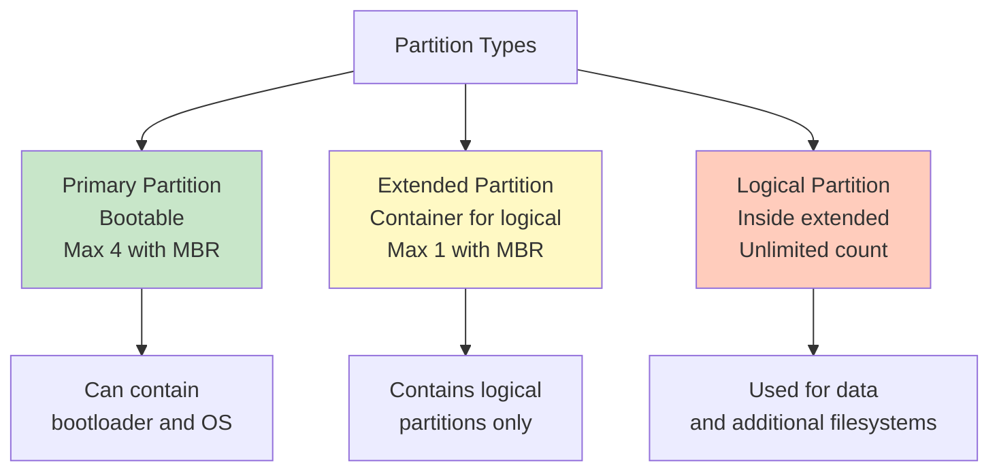
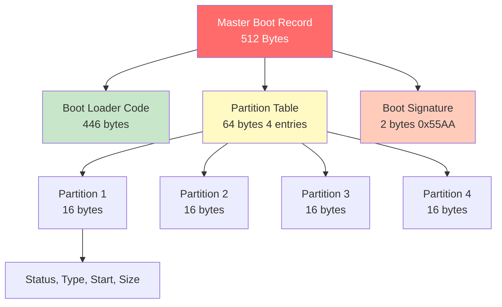
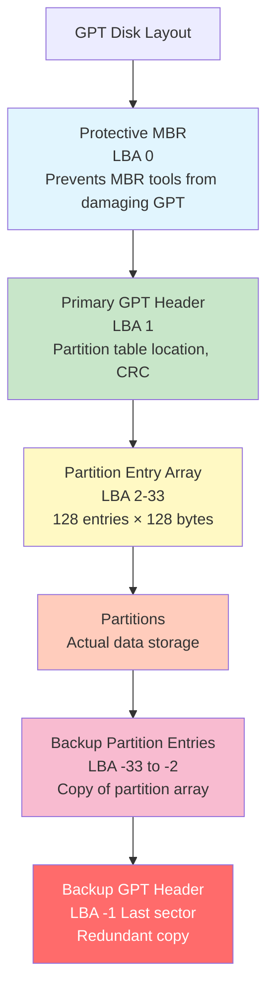
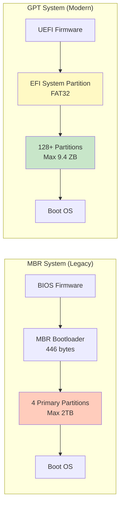
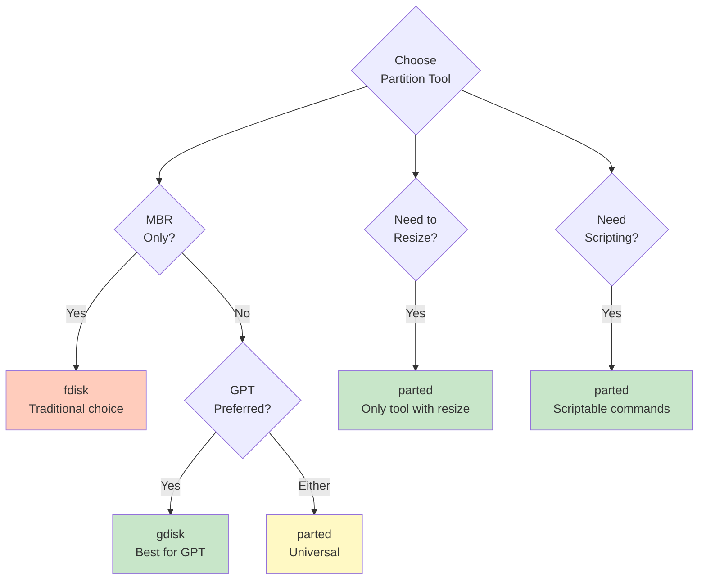
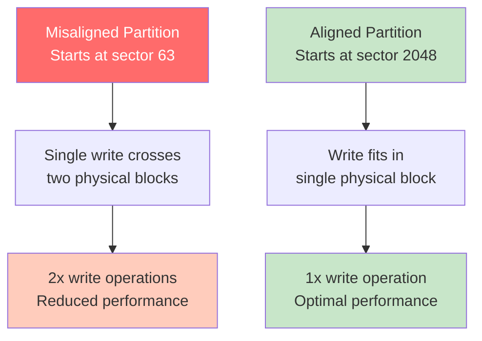

#operating-system #linux #unix #storage #partitioning #gpt #mbr #fdisk #parted #gdisk #fedora #ubuntu #debian #rhel

- Disk partitioning divides physical storage into logical sections called partitions.
- <mark class="hltr-yellow">Each partition acts as an independent disk with its own filesystem</mark>.
- Enables multi-boot systems, data organization, and isolation of OS from user data.

# Partition Concepts

## Why Partitioning?
### Benefits
1. **Separation of Concerns**
	- Separate OS from user data.
	- Isolate critical system files.
	- Prevent log files from filling root partition.

2. **Multi-Boot Systems**
	- Install multiple operating systems.
	- Each OS in separate partition.

3. **Performance Optimization**
	- Place frequently accessed data on faster partitions.
	- Optimize filesystem parameters per partition.

4. **Data Protection**
	- Corruption in one partition doesn't affect others.
	- Easier backup and recovery.

5. **Security and Quota Management**
	- Apply different security policies per partition.
	- Set disk quotas independently.

## Partition Types


### Primary Partition
- <mark class="hltr-yellow">Standard partition that can be bootable</mark>.
- MBR allows maximum 4 primary partitions.
- GPT has no such limitation (128 partitions typical).

### Extended Partition
- Special partition type (MBR only).
- Container for logical partitions.
- Cannot store data directly.
- Workaround for 4-partition MBR limit.

### Logical Partition
- Partition within extended partition.
- Can create many logical partitions.
- Cannot be used for booting (with traditional BIOS).

# Partition Table Formats

## MBR (Master Boot Record)
### Characteristics
- Legacy partition scheme (1983).
- Located in first 512 bytes of disk.
- <mark class="hltr-yellow">Supports maximum 4 primary partitions and 2TB disk size</mark>.
- Uses 32-bit addressing (2³² sectors × 512 bytes = 2TB).

### MBR Structure


### MBR Limitations
```
Limitation          | Description
--------------------|---------------------------------------------
Disk Size           | Maximum 2TB (2³² × 512 bytes)
Partitions          | Maximum 4 primary (or 3 primary + 1 extended)
Partition Size      | Maximum 2TB per partition
Data Protection     | No redundancy, single point of failure
Partition ID        | Limited partition type codes
Compatibility       | BIOS-based systems
```

## GPT (GUID Partition Table)
### Characteristics
- <mark class="hltr-yellow">Modern partition scheme supporting disks larger than 2TB</mark>.
- Part of UEFI specification.
- Uses 64-bit addressing (supports 9.4ZB disk size).
- Stores multiple copies of partition table for redundancy.

### GPT Structure


### GPT Advantages
```
Feature             | GPT                    | MBR
--------------------|------------------------|------------------
Maximum Disk Size   | 9.4 ZB (zettabytes)    | 2 TB
Maximum Partitions  | 128 (typical)          | 4 primary
Partition Size      | 9.4 ZB                 | 2 TB
Redundancy          | Backup header & table  | None
CRC Protection      | Yes (data integrity)   | No
Partition Names     | Yes (36 characters)    | No
Unique IDs          | GUID for each partition| No
Boot Mode           | UEFI (and BIOS-GPT)    | BIOS
```

## MBR vs GPT Comparison


# Partition Tools

## fdisk (MBR and GPT)
- <mark class="hltr-yellow">Interactive partition table manipulator for MBR and GPT</mark>.
- Traditional tool, now supports both schemes.
- Text-based interface.

### fdisk Basic Usage
```Shell title='fdisk disk management'
# List all partitions
sudo fdisk -l

# Output example:
# Disk /dev/sda: 500 GB
# Device      Boot  Start      End     Sectors  Size  Id  Type
# /dev/sda1   *     2048       1050623 1048576  512M  ef  EFI System
# /dev/sda2         1050624    34605055 33554432 16G  82  Linux swap
# /dev/sda3         34605056   976773119 942168064 449G 83 Linux

# Interactive mode
sudo fdisk /dev/sdb

# fdisk commands:
# m - print menu
# p - print partition table
# n - new partition
# d - delete partition
# t - change partition type
# w - write changes and exit
# q - quit without saving
```

### Creating Partition with fdisk
```Shell title='Create new partition interactively'
sudo fdisk /dev/sdb

# Interactive session:
# Command (m for help): n
# Partition type
#    p   primary (0 primary, 0 extended, 4 free)
#    e   extended (container for logical partitions)
# Select (default p): p
# Partition number (1-4, default 1): 1
# First sector (2048-209715199, default 2048): <Enter>
# Last sector, +sectors or +size{K,M,G,T,P} (2048-209715199, default 209715199): +50G
#
# Created a new partition 1 of type 'Linux' and of size 50 GiB.
#
# Command (m for help): p
# Disk /dev/sdb: 100 GiB
#    Device     Boot Start      End      Sectors Size Id Type
#    /dev/sdb1        2048    104859647 104857600 50G  83 Linux
#
# Command (m for help): w
# The partition table has been altered.
# Calling ioctl() to re-read partition table.
# Syncing disks.
```

## gdisk (GPT Disk)
- GPT-specific partitioning tool.
- Similar interface to fdisk.
- Better GPT support than fdisk.

```Shell title='gdisk GPT management'
# List GPT partitions
sudo gdisk -l /dev/sda

# Interactive mode
sudo gdisk /dev/sdb

# gdisk commands:
# p - print partition table
# n - new partition
# d - delete partition
# t - change partition type (GUID)
# w - write and exit
# q - quit without saving
# i - show detailed information
# x - extra functionality (experts)
```

## parted (Universal Tool)
- <mark class="hltr-yellow">Supports both MBR and GPT partition tables</mark>.
- Can resize partitions.
- Scriptable (non-interactive mode).
- More powerful than fdisk.

### parted Usage
```Shell title='parted partition management'
# Interactive mode
sudo parted /dev/sdb

# Non-interactive commands
sudo parted /dev/sdb print

# Output:
# Model: ATA Samsung SSD 850 (scsi)
# Disk /dev/sdb: 500GB
# Sector size (logical/physical): 512B/512B
# Partition Table: gpt
# Disk Flags:
#
# Number  Start   End     Size    File system  Name     Flags
#  1      1049kB  538MB   537MB   fat32        EFI      boot, esp
#  2      538MB   17.2GB  16.7GB  linux-swap   swap
#  3      17.2GB  500GB   483GB   ext4         root

# Create GPT partition table
sudo parted /dev/sdb mklabel gpt

# Create partition
sudo parted /dev/sdb mkpart primary ext4 0% 50%

# Delete partition
sudo parted /dev/sdb rm 1

# Resize partition (if filesystem supports)
sudo parted /dev/sdb resizepart 1 100GB

# Set partition flag
sudo parted /dev/sdb set 1 boot on
```

## Partition Tool Comparison


# Standard Partition Layouts

## Traditional Linux Layout (MBR)
```mermaid
graph LR
    Disk[Disk /dev/sda<br/>500 GB] --> Boot[/dev/sda1<br/>512 MB<br/>/boot<br/>ext4]
    Disk --> Swap[/dev/sda2<br/>16 GB<br/>swap<br/>linux-swap]
    Disk --> Root[/dev/sda3<br/>483.5 GB<br/>/<br/>ext4]

    style Boot fill:#c8e6c9
    style Swap fill:#fff9c4
    style Root fill:#ffccbc
```

## UEFI/GPT Linux Layout
```mermaid
graph LR
    Disk[Disk /dev/sda<br/>500 GB] --> ESP[/dev/sda1<br/>512 MB<br/>/boot/efi<br/>FAT32<br/>EFI System]
    Disk --> Boot[/dev/sda2<br/>1 GB<br/>/boot<br/>ext4]
    Disk --> Swap[/dev/sda3<br/>16 GB<br/>swap<br/>linux-swap]
    Disk --> Root[/dev/sda4<br/>482.5 GB<br/>/<br/>ext4]

    style ESP fill:#e1f5fe
    style Boot fill:#c8e6c9
    style Swap fill:#fff9c4
    style Root fill:#ffccbc
```

## Server Layout with Separate Partitions
```mermaid
graph TD
    Server[Server Disk<br/>2 TB] --> ESP[EFI System<br/>512 MB<br/>/boot/efi]
    Server --> Boot[/boot<br/>1 GB<br/>Kernel images]
    Server --> Swap[swap<br/>32 GB<br/>Swap space]
    Server --> Root[/<br/>50 GB<br/>System files]
    Server --> Var[/var<br/>100 GB<br/>Logs, cache]
    Server --> Tmp[/tmp<br/>10 GB<br/>Temporary files]
    Server --> Home[/home<br/>100 GB<br/>User data]
    Server --> Data[/data<br/>1.7 TB<br/>Application data]

    style ESP fill:#e1f5fe
    style Boot fill:#c8e6c9
    style Swap fill:#fff9c4
    style Root fill:#ffccbc
    style Var fill:#f8bbd0
    style Data fill:#c8e6c9
```

# Partition Alignment

## Sector Alignment
- <mark class="hltr-yellow">Proper alignment improves performance, especially for SSDs</mark>.
- Modern tools align to 1MB (2048 sectors) by default.
- Misalignment causes performance degradation.

### Why Alignment Matters


### Check Partition Alignment
```Shell title='Verify partition alignment'
# Check alignment for all partitions
sudo parted /dev/sda align-check optimal 1
# Output: 1 aligned

# Check all partitions
for part in /dev/sda?; do
    num=${part##*/sda}
    echo -n "$part: "
    sudo parted /dev/sda align-check optimal $num
done

# Manually calculate alignment
sudo fdisk -l /dev/sda
# Start sector 2048 should be divisible by 2048 (1 MB alignment)

# Check physical sector size
sudo fdisk -l /dev/sda | grep "Sector size"
# Sector size (logical/physical): 512 bytes / 4096 bytes

# Modern SSDs typically use 4096-byte physical sectors
# Alignment should be multiple of physical sector size
```

# EFI System Partition (ESP)

## ESP Characteristics
- <mark class="hltr-yellow">Required partition for UEFI boot containing bootloaders and boot files</mark>.
- Must be FAT32 filesystem.
- Typically 512MB size (recommended).
- Mounted at `/boot/efi` on Linux.

## Creating ESP
```Shell title='Create EFI System Partition'
# Using parted
sudo parted /dev/sda mkpart primary fat32 1MiB 513MiB
sudo parted /dev/sda set 1 esp on

# Using gdisk
sudo gdisk /dev/sda
# Command: n (new partition)
# Partition number: 1
# First sector: <Enter> (default)
# Last sector: +512M
# Hex code or GUID: EF00 (EFI System)
# Command: w (write)

# Format as FAT32
sudo mkfs.fat -F32 /dev/sda1

# Mount ESP
sudo mkdir -p /boot/efi
sudo mount /dev/sda1 /boot/efi

# Add to /etc/fstab
echo "UUID=$(blkid -s UUID -o value /dev/sda1) /boot/efi vfat defaults 0 2" | sudo tee -a /etc/fstab
```

# Partition Management Workflow

## Complete Partitioning Example
```Shell title='Full disk partitioning workflow'
# 1. Identify the disk
lsblk

# 2. Backup existing partition table (if any)
sudo sfdisk -d /dev/sdb > partition-backup.txt

# 3. Create GPT partition table
sudo parted /dev/sdb mklabel gpt

# 4. Create partitions
# EFI System Partition (512 MB)
sudo parted /dev/sdb mkpart primary fat32 1MiB 513MiB
sudo parted /dev/sdb set 1 esp on

# Boot partition (1 GB)
sudo parted /dev/sdb mkpart primary ext4 513MiB 1537MiB

# Swap partition (16 GB)
sudo parted /dev/sdb mkpart primary linux-swap 1537MiB 17921MiB

# Root partition (remaining space)
sudo parted /dev/sdb mkpart primary ext4 17921MiB 100%

# 5. Verify partition table
sudo parted /dev/sdb print

# 6. Inform kernel of partition changes
sudo partprobe /dev/sdb
# or
sudo blockdev --rereadpt /dev/sdb

# 7. Create filesystems
sudo mkfs.fat -F32 /dev/sdb1             # EFI
sudo mkfs.ext4 -L boot /dev/sdb2         # Boot
sudo mkswap -L swap /dev/sdb3            # Swap
sudo mkfs.ext4 -L root /dev/sdb4         # Root

# 8. Enable swap
sudo swapon /dev/sdb3

# 9. Mount filesystems
sudo mount /dev/sdb4 /mnt
sudo mkdir -p /mnt/boot
sudo mount /dev/sdb2 /mnt/boot
sudo mkdir -p /mnt/boot/efi
sudo mount /dev/sdb1 /mnt/boot/efi

# 10. Verify
lsblk -f /dev/sdb
```

# Partition Type Codes

## Common MBR Partition Types
```
Code | Type
-----|---------------------------
00   | Empty
83   | Linux filesystem
82   | Linux swap
8e   | Linux LVM
ef   | EFI System (FAT)
fd   | Linux RAID auto-detect
05   | Extended partition
0c   | FAT32 with LBA
07   | NTFS (Windows)
```

## Common GPT Partition Types (GUID)
```
Code | GUID                                   | Type
-----|----------------------------------------|-------------------
0700 | Microsoft basic data                   | Windows/Linux data
0c01 | Microsoft reserved                     | Windows reserved
8200 | 0657FD6D-A4AB-43C4-84E5-0933C84B4F4F  | Linux swap
8300 | 0FC63DAF-8483-4772-8E79-3D69D8477DE4  | Linux filesystem
8e00 | E6D6D379-F507-44C2-A23C-238F2A3DF928  | Linux LVM
fd00 | A19D880F-05FC-4D3B-A006-743F0F84911E  | Linux RAID
ef00 | C12A7328-F81F-11D2-BA4B-00A0C93EC93B  | EFI System
```

# Practical Examples

## Example 1: Convert MBR to GPT (Non-Destructive)
```Shell title='Convert partition table format'
# Install gdisk
sudo dnf install gdisk  # Fedora
sudo apt install gdisk  # Ubuntu

# Backup important data first!

# Convert MBR to GPT
sudo gdisk /dev/sdb
# Command: w (write GPT and exit)
# This preserves existing partitions

# Verify conversion
sudo gdisk -l /dev/sdb

# Note: System must support UEFI boot for converted disk to be bootable
# May need to recreate EFI System Partition
```

## Example 2: Clone Partition Table
```Shell title='Copy partition layout to another disk'
# Method 1: Using sfdisk (MBR and GPT)
sudo sfdisk -d /dev/sda > partition-layout.txt
sudo sfdisk /dev/sdb < partition-layout.txt

# Method 2: Using dd (exact copy)
sudo dd if=/dev/sda of=/dev/sdb bs=512 count=1
# Warning: destination disk must be same size or larger

# Method 3: Using sgdisk (GPT only)
sudo sgdisk -R=/dev/sdb /dev/sda
sudo sgdisk -G /dev/sdb  # Randomize GUIDs
```

## Example 3: Resize Partition
```Shell title='Expand or shrink partition'
# Resize partition (requires filesystem support)
# 1. Unmount partition
sudo umount /dev/sdb3

# 2. Check filesystem
sudo e2fsck -f /dev/sdb3

# 3. Shrink filesystem first (if shrinking partition)
sudo resize2fs /dev/sdb3 50G

# 4. Resize partition
sudo parted /dev/sdb resizepart 3 100GB

# 5. Expand filesystem to fill partition (if expanding)
sudo resize2fs /dev/sdb3

# 6. Verify
df -h /dev/sdb3
```

## Example 4: Recover Deleted Partition Table
```Shell title='Restore partition table from backup'
# If you backed up partition table with sfdisk
sudo sfdisk /dev/sdb < partition-backup.txt

# If no backup, use testdisk to recover
sudo dnf install testdisk  # Fedora
sudo apt install testdisk  # Ubuntu

sudo testdisk /dev/sdb
# Follow interactive prompts to analyze and recover partitions
```

## Example 5: Create Partitions for Specific Use Cases
```Shell title='Specialized partition layouts'
# Database server layout
sudo parted /dev/sdb mklabel gpt
sudo parted /dev/sdb mkpart primary fat32 1MiB 513MiB     # EFI
sudo parted /dev/sdb set 1 esp on
sudo parted /dev/sdb mkpart primary ext4 513MiB 50GiB     # OS
sudo parted /dev/sdb mkpart primary linux-swap 50GiB 82GiB  # Swap
sudo parted /dev/sdb mkpart primary ext4 82GiB 100%       # Database data

# Format
sudo mkfs.fat -F32 /dev/sdb1
sudo mkfs.ext4 -L system /dev/sdb2
sudo mkswap -L swap /dev/sdb3
# Database partition with specific options
sudo mkfs.ext4 -L database -m 1 -E lazy_itable_init=0,lazy_journal_init=0 /dev/sdb4
```

***
# References
1. Operating System Concepts - Abraham Silberschatz - 10th - 2018 - Pearson.
	1. Chapter 11: Mass-Storage Structure.
		1. Section 11.2: Disk Structure.
2. `man fdisk`, `man gdisk`, `man parted`, `man sfdisk`
3. GPT Specification - UEFI Forum.
	1. https://uefi.org/specifications
4. Red Hat Storage Administration Guide.
	1. https://access.redhat.com/documentation/en-us/red_hat_enterprise_linux/9/html/managing_storage_devices/
5. Arch Linux Wiki - Partitioning.
	1. https://wiki.archlinux.org/title/Partitioning
6. GNU Parted User Manual.
	1. https://www.gnu.org/software/parted/manual/
7. Rod Smith - GPT fdisk Tutorial.
	1. https://www.rodsbooks.com/gdisk/
