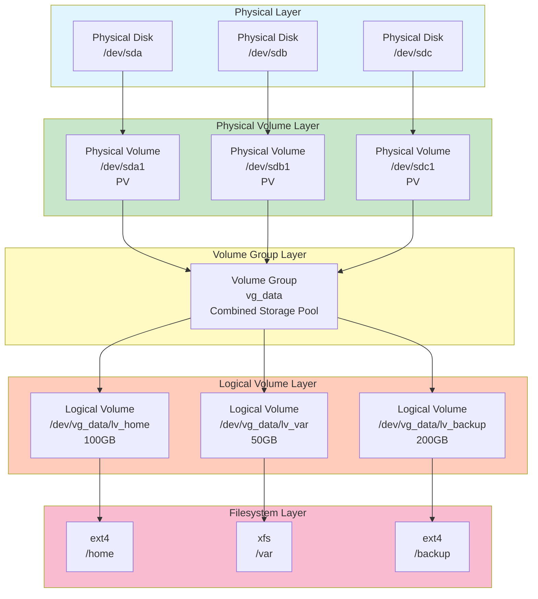
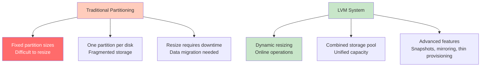
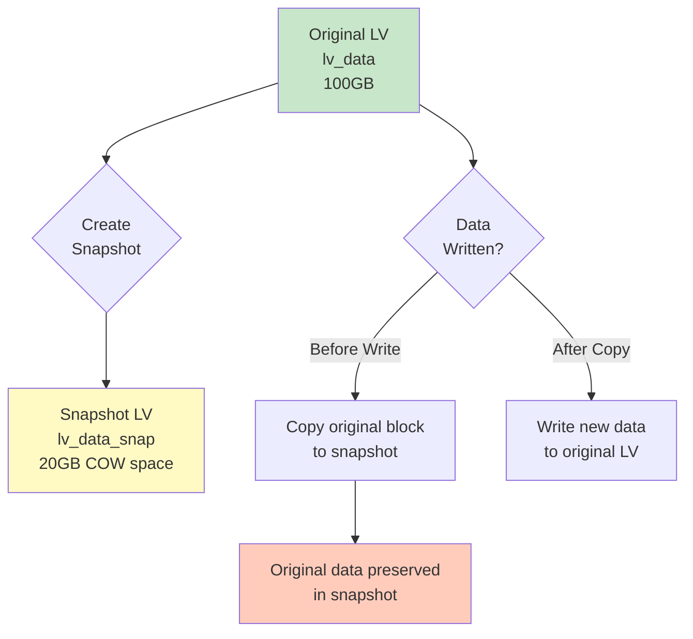
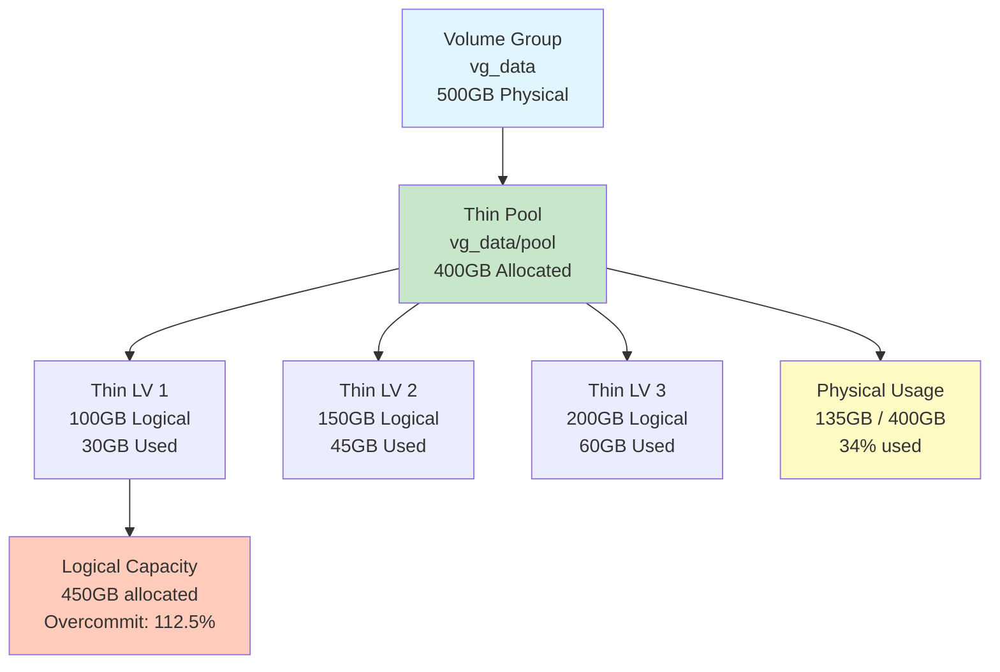
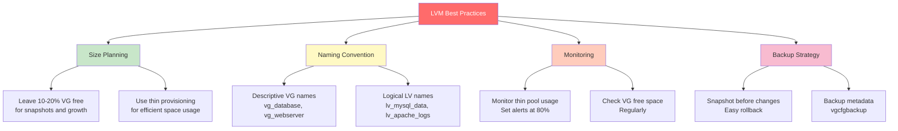

#operating-system #linux #unix #storage #lvm #volume-management #pv #vg #lv #rhel #centos-stream #fedora #ubuntu #debian

- Logical Volume Manager (LVM) provides flexible disk management through abstraction layers.
- <mark class="hltr-yellow">Enables dynamic volume resizing, snapshots, and pooling of multiple disks without downtime</mark>.
- Separates logical storage layout from physical disk constraints.

# LVM Architecture

## LVM Layer Hierarchy


## LVM Components

### Physical Volume (PV)
- <mark class="hltr-yellow">Physical storage device or partition initialized for LVM use</mark>.
- Can be entire disk or partition.
- Divided into Physical Extents (PE) - typically 4MB chunks.

### Volume Group (VG)
- <mark class="hltr-yellow">Pool of storage combining one or more physical volumes</mark>.
- Provides unified storage pool.
- Can span multiple disks.

### Logical Volume (LV)
- <mark class="hltr-yellow">Virtual partition created from volume group space</mark>.
- Appears as block device to filesystem.
- Can be resized, snapshotted, and mirrored.

### Physical Extent (PE)
- Smallest allocatable unit in LVM (default 4MB).
- VG divided into PEs.
- LVs allocated in PE units.

### Logical Extent (LE)
- Mapped to Physical Extents.
- LV size = number of LEs × PE size.

## LVM Abstraction Benefits


# LVM Installation and Setup

## Installing LVM Tools
```Shell title='Install LVM packages'
# Fedora/RHEL/CentOS
sudo dnf install lvm2

# Ubuntu/Debian
sudo apt install lvm2

# Verify installation
lvm version
# Output: LVM version: 2.03.XX

# Check available LVM commands
lvm help
```

## LVM Service
```Shell title='Manage LVM service'
# Enable LVM monitoring
sudo systemctl enable lvm2-monitor
sudo systemctl start lvm2-monitor

# Check service status
sudo systemctl status lvm2-monitor
```

# Creating LVM Volumes

## Step 1: Create Physical Volumes
```Shell title='Initialize physical volumes'
# Create partition with type Linux LVM (8e00 for GPT, 8e for MBR)
sudo gdisk /dev/sdb
# n (new), partition number, size, type: 8e00

sudo gdisk /dev/sdc
# n (new), partition number, size, type: 8e00

# Initialize physical volumes
sudo pvcreate /dev/sdb1
# Physical volume "/dev/sdb1" successfully created.

sudo pvcreate /dev/sdc1
# Physical volume "/dev/sdc1" successfully created.

# Or create on entire disk (no partition)
sudo pvcreate /dev/sdd

# View physical volumes
sudo pvs
# Output:
#   PV         VG     Fmt  Attr PSize   PFree
#   /dev/sdb1         lvm2 ---  100.00g 100.00g
#   /dev/sdc1         lvm2 ---  200.00g 200.00g

# Detailed PV information
sudo pvdisplay /dev/sdb1
```

## Step 2: Create Volume Group
```Shell title='Create and manage volume groups'
# Create volume group from physical volumes
sudo vgcreate vg_data /dev/sdb1 /dev/sdc1
# Volume group "vg_data" successfully created

# View volume groups
sudo vgs
# Output:
#   VG      #PV #LV #SN Attr   VSize   VFree
#   vg_data   2   0   0 wz--n- 299.99g 299.99g

# Detailed VG information
sudo vgdisplay vg_data

# Output:
#   --- Volume group ---
#   VG Name               vg_data
#   System ID
#   Format                lvm2
#   VG Size               299.99 GiB
#   PE Size               4.00 MiB
#   Total PE              76797
#   Alloc PE / Size       0 / 0
#   Free  PE / Size       76797 / 299.99 GiB
```

## Step 3: Create Logical Volumes
```Shell title='Create logical volumes from VG'
# Create logical volume with specific size
sudo lvcreate -L 50G -n lv_home vg_data
# Logical volume "lv_home" created.

# Create LV using percentage of VG
sudo lvcreate -l 25%VG -n lv_var vg_data

# Create LV using all remaining space
sudo lvcreate -l 100%FREE -n lv_backup vg_data

# View logical volumes
sudo lvs
# Output:
#   LV        VG      Attr       LSize   Pool Origin
#   lv_backup vg_data -wi-a----- 225.00g
#   lv_home   vg_data -wi-a-----  50.00g
#   lv_var    vg_data -wi-a-----  75.00g

# Detailed LV information
sudo lvdisplay /dev/vg_data/lv_home

# LV device paths:
# /dev/vg_data/lv_home
# /dev/mapper/vg_data-lv_home  (alternative path)
```

## Step 4: Create Filesystem and Mount
```Shell title='Format and mount logical volumes'
# Create filesystems
sudo mkfs.ext4 /dev/vg_data/lv_home
sudo mkfs.xfs /dev/vg_data/lv_var
sudo mkfs.ext4 /dev/vg_data/lv_backup

# Create mount points
sudo mkdir -p /mnt/home /mnt/var /mnt/backup

# Mount logical volumes
sudo mount /dev/vg_data/lv_home /mnt/home
sudo mount /dev/vg_data/lv_var /mnt/var
sudo mount /dev/vg_data/lv_backup /mnt/backup

# Verify
df -h | grep vg_data

# Add to /etc/fstab for persistent mounting
cat << 'EOF' | sudo tee -a /etc/fstab
/dev/mapper/vg_data-lv_home   /home     ext4  defaults  0  2
/dev/mapper/vg_data-lv_var    /var      xfs   defaults  0  2
/dev/mapper/vg_data-lv_backup /backup   ext4  defaults  0  2
EOF
```

# LVM Operations

## Extending Logical Volumes
```Shell title='Expand logical volume size'
# Method 1: Extend by specific size
sudo lvextend -L +20G /dev/vg_data/lv_home
# Size of logical volume vg_data/lv_home changed from 50.00 GiB to 70.00 GiB.

# Method 2: Extend to specific total size
sudo lvextend -L 100G /dev/vg_data/lv_home

# Method 3: Use all available space in VG
sudo lvextend -l +100%FREE /dev/vg_data/lv_home

# Resize filesystem to use new space
# For ext4:
sudo resize2fs /dev/vg_data/lv_home

# For XFS (must be mounted):
sudo xfs_growfs /mnt/var

# Combined operation (extend LV and resize filesystem in one command)
sudo lvextend -r -L +20G /dev/vg_data/lv_home
# -r flag automatically resizes filesystem

# Verify
df -h /mnt/home
```

## Shrinking Logical Volumes
```Shell title='Reduce logical volume size'
# WARNING: Shrinking can cause data loss if not careful!
# XFS does NOT support shrinking!

# 1. Unmount filesystem
sudo umount /mnt/home

# 2. Check filesystem
sudo e2fsck -f /dev/vg_data/lv_home

# 3. Shrink filesystem first
sudo resize2fs /dev/vg_data/lv_home 30G

# 4. Shrink logical volume
sudo lvreduce -L 30G /dev/vg_data/lv_home
# WARNING: Reducing active logical volume to 30.00 GiB.
# THIS MAY DESTROY YOUR DATA (filesystem etc.)
# Do you really want to reduce vg_data/lv_home? [y/n]: y

# 5. Remount
sudo mount /dev/vg_data/lv_home /mnt/home

# Combined operation (not recommended for production)
sudo lvreduce -r -L 30G /dev/vg_data/lv_home
```

## Extending Volume Groups
```Shell title='Add physical volumes to VG'
# Create new physical volume
sudo pvcreate /dev/sdd1

# Extend volume group
sudo vgextend vg_data /dev/sdd1
# Volume group "vg_data" successfully extended

# Verify
sudo vgs vg_data
#   VG      #PV #LV #SN Attr   VSize   VFree
#   vg_data   3   3   0 wz--n- 399.99g 100.00g

# Now you can extend logical volumes with new space
sudo lvextend -L +50G /dev/vg_data/lv_backup
sudo resize2fs /dev/vg_data/lv_backup
```

## Reducing Volume Groups
```Shell title='Remove physical volumes from VG'
# Move data off physical volume (if in use)
sudo pvmove /dev/sdd1
# This moves extents to other PVs in the VG

# Reduce volume group
sudo vgreduce vg_data /dev/sdd1
# Removed "/dev/sdd1" from volume group "vg_data"

# Remove physical volume
sudo pvremove /dev/sdd1
# Labels on physical volume "/dev/sdd1" successfully wiped.
```

# LVM Snapshots

## Snapshot Concepts
- <mark class="hltr-yellow">Point-in-time copy of logical volume for backup or testing</mark>.
- Uses copy-on-write (COW) mechanism.
- Only stores changed data, not full copy.
- Useful for consistent backups of active systems.

## Snapshot Operation


## Creating and Using Snapshots
```Shell title='LVM snapshot management'
# Create snapshot (allocate 20% of original size for changes)
sudo lvcreate -L 20G -s -n lv_home_snap /dev/vg_data/lv_home
# Logical volume "lv_home_snap" created.

# View snapshots
sudo lvs -a
#   LV            VG      Attr       LSize   Pool Origin  Data%
#   lv_home       vg_data owi-aos---  50.00g
#   lv_home_snap  vg_data swi-a-s---  20.00g      lv_home 0.01

# Mount snapshot for backup
sudo mkdir /mnt/home_snapshot
sudo mount -o ro /dev/vg_data/lv_home_snap /mnt/home_snapshot

# Backup from snapshot (consistent point-in-time backup)
sudo tar czf /backup/home-backup-$(date +%F).tar.gz -C /mnt/home_snapshot .

# Unmount snapshot
sudo umount /mnt/home_snapshot

# Remove snapshot after backup
sudo lvremove /dev/vg_data/lv_home_snap
# Do you really want to remove active logical volume vg_data/lv_home_snap? [y/n]: y

# Monitor snapshot usage (if full, snapshot becomes invalid)
sudo lvs -a
# Check Data% column - if approaching 100%, extend snapshot
sudo lvextend -L +10G /dev/vg_data/lv_home_snap
```

## Reverting from Snapshot
```Shell title='Restore from snapshot'
# Merge snapshot back to original (reverts changes)
# WARNING: This discards all changes made after snapshot creation!

# Unmount original volume
sudo umount /mnt/home

# Merge snapshot
sudo lvconvert --merge /dev/vg_data/lv_home_snap
# Merging of snapshot vg_data/lv_home_snap will occur on next activation.

# Reactivate logical volume
sudo lvchange -an /dev/vg_data/lv_home
sudo lvchange -ay /dev/vg_data/lv_home

# Remount
sudo mount /dev/vg_data/lv_home /mnt/home

# Snapshot automatically removed after merge
```

# Thin Provisioning

## Thin Provisioning Concepts
- <mark class="hltr-yellow">Allocate storage on-demand rather than pre-allocating full space</mark>.
- Overcommit storage (allocate more logical space than physical).
- Efficient for virtual machines and sparse files.

## Thin Pool Architecture


## Creating Thin Pools and Volumes
```Shell title='Thin provisioning setup'
# Create thin pool (80% of VG size)
sudo lvcreate -L 400G -T vg_data/thin_pool
# Thin pool volume with chunk size 64.00 KiB created.

# Create thin volumes (can overcommit)
sudo lvcreate -V 100G -T vg_data/thin_pool -n thin_lv1
sudo lvcreate -V 150G -T vg_data/thin_pool -n thin_lv2
sudo lvcreate -V 200G -T vg_data/thin_pool -n thin_lv3
# Total: 450GB logical from 400GB physical pool (overcommit)

# View thin pool and volumes
sudo lvs -a
#   LV                VG      Attr       LSize   Pool      Origin Data%
#   thin_lv1          vg_data Vwi-a-tz-- 100.00g thin_pool        30.00
#   thin_lv2          vg_data Vwi-a-tz-- 150.00g thin_pool        30.00
#   thin_lv3          vg_data Vwi-a-tz-- 200.00g thin_pool        30.00
#   thin_pool         vg_data twi-aotz-- 400.00g                  33.75

# Create filesystems
sudo mkfs.ext4 /dev/vg_data/thin_lv1
sudo mkfs.ext4 /dev/vg_data/thin_lv2
sudo mkfs.ext4 /dev/vg_data/thin_lv3

# Monitor thin pool usage
watch -n 5 'sudo lvs -a | grep thin'
```

## Thin Snapshots
```Shell title='Efficient snapshots with thin provisioning'
# Thin snapshots are much more efficient than traditional snapshots
# Create thin snapshot
sudo lvcreate -s -n thin_lv1_snap /dev/vg_data/thin_lv1
# Logical volume "thin_lv1_snap" created.

# Thin snapshot uses NO additional space initially
# Only changed blocks consume space

# View thin snapshot
sudo lvs -a
#   LV             VG      Attr       LSize   Pool      Origin   Data%
#   thin_lv1       vg_data Vwi-aotz-- 100.00g thin_pool          30.00
#   thin_lv1_snap  vg_data Vwi-a-tz-- 100.00g thin_pool thin_lv1 0.00
```

# LVM Mirroring and RAID

## LVM RAID Levels
- <mark class="hltr-yellow">LVM supports software RAID for redundancy and performance</mark>.
- RAID levels: linear, striped, mirror, raid1, raid5, raid6, raid10.

## Creating Mirrored Volume
```Shell title='LVM RAID mirror'
# Create mirrored logical volume (RAID1)
sudo lvcreate -L 50G -m1 -n lv_mirror vg_data
# Logical volume "lv_mirror" created.
# Mirror has 2 copies

# View mirror status
sudo lvs -a -o +devices
#   LV              VG      Devices
#   lv_mirror       vg_data lv_mirror_rimage_0(0),lv_mirror_rimage_1(0)
#   lv_mirror_rimage_0 vg_data /dev/sdb1(0)
#   lv_mirror_rimage_1 vg_data /dev/sdc1(0)

# Convert existing LV to mirror
sudo lvconvert -m1 /dev/vg_data/lv_home
```

## Creating Striped Volume (RAID0)
```Shell title='LVM striping for performance'
# Create striped LV across 2 disks
sudo lvcreate -L 100G -i2 -I64 -n lv_stripe vg_data
# -i2: stripe across 2 devices
# -I64: 64KB stripe size

# Better read/write performance through parallelism
```

# LVM Information and Monitoring

## Display Commands
```Shell title='View LVM information'
# Physical Volumes
sudo pvs        # Summary
sudo pvdisplay  # Detailed
sudo pvscan     # Scan for PVs

# Volume Groups
sudo vgs        # Summary
sudo vgdisplay  # Detailed
sudo vgscan     # Scan for VGs

# Logical Volumes
sudo lvs        # Summary
sudo lvdisplay  # Detailed
sudo lvscan     # Scan for LVs

# All LVM components
sudo lvm fullreport

# Specific attributes
sudo lvs -o +devices,seg_pe_ranges
sudo pvs -o +pv_used,pv_free
sudo vgs -o +vg_size,vg_free
```

## LVM Monitoring
```Shell title='Monitor LVM usage and health'
# Monitor VG free space
sudo vgs -o vg_name,vg_free,vg_size

# Monitor LV data usage (for thin pools)
sudo lvs -a -o lv_name,data_percent,pool_lv

# Check PV allocation
sudo pvs -o pv_name,pv_used,pv_free,vg_name

# Alert if thin pool > 80% full
USAGE=$(sudo lvs --noheadings -o data_percent vg_data/thin_pool | tr -d ' ')
if (( ${USAGE%.*} > 80 )); then
    echo "WARNING: Thin pool usage at ${USAGE}%"
fi
```

# LVM Backup and Recovery

## Metadata Backup
```Shell title='Backup LVM configuration'
# LVM automatically backs up metadata to /etc/lvm/backup/
ls -l /etc/lvm/backup/

# Manual backup of VG metadata
sudo vgcfgbackup vg_data
# Volume group "vg_data" successfully backed up.

# Backup saved to /etc/lvm/backup/vg_data

# Backup all VGs
sudo vgcfgbackup

# Archive old metadata (automatic)
ls -l /etc/lvm/archive/
```

## Metadata Restore
```Shell title='Restore LVM configuration'
# Restore VG metadata from backup
sudo vgcfgrestore vg_data

# Restore from specific file
sudo vgcfgrestore -f /etc/lvm/backup/vg_data vg_data

# List available backup archives
sudo vgcfgrestore --list vg_data
```

# Best Practices

## LVM Design Recommendations


## Performance Optimization
```Shell title='Optimize LVM performance'
# Use larger PE size for large volumes
sudo vgcreate -s 32M vg_large /dev/sdb1
# Default is 4MB, larger PE reduces metadata overhead

# Enable read-ahead for sequential workloads
sudo blockdev --setra 8192 /dev/vg_data/lv_home

# Use striping for performance
sudo lvcreate -L 100G -i2 -I128 -n lv_fast vg_data

# Disable zeroing for faster LV creation (less secure)
sudo lvcreate -L 50G -Zy n -n lv_quick vg_data
```

# Troubleshooting

## Common Issues and Solutions
```Shell title='LVM troubleshooting'
# Issue: LV not visible after reboot
# Solution: Activate volume group
sudo vgchange -ay vg_data

# Issue: Cannot extend LV (insufficient space)
# Check VG free space
sudo vgs vg_data
# Add more PVs or reduce other LVs

# Issue: Snapshot full (becomes invalid)
# Solution: Extend snapshot or remove it
sudo lvextend -L +10G /dev/vg_data/lv_home_snap
# or
sudo lvremove /dev/vg_data/lv_home_snap

# Issue: PV shows as missing
# Solution: Scan for PVs
sudo pvscan
sudo vgscan
sudo vgchange -ay

# Issue: Thin pool approaching full
# Solution: Extend thin pool
sudo lvextend -L +50G /dev/vg_data/thin_pool

# Repair VG metadata
sudo vgck vg_data
```

***
# References
1. Red Hat LVM Administrator Guide.
	1. https://access.redhat.com/documentation/en-us/red_hat_enterprise_linux/9/html/configuring_and_managing_logical_volumes/
2. LVM2 Resource Page.
	1. https://sourceware.org/lvm2/
3. `man lvm`, `man pvcreate`, `man vgcreate`, `man lvcreate`
4. `man lvextend`, `man lvreduce`, `man lvcreate`
5. Linux System Administrator's Guide - LVM HOWTO.
	1. https://tldp.org/HOWTO/LVM-HOWTO/
6. Arch Linux Wiki - LVM.
	1. https://wiki.archlinux.org/title/LVM
7. Ubuntu LVM Guide.
	1. https://ubuntu.com/server/docs/logical-volume-manager-lvm
