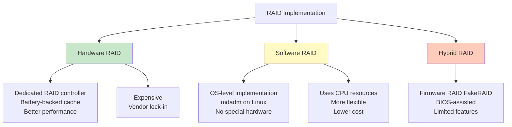
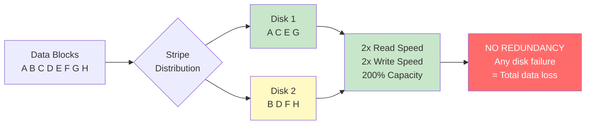
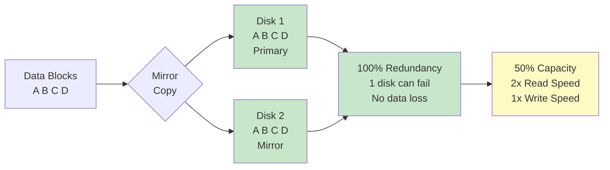
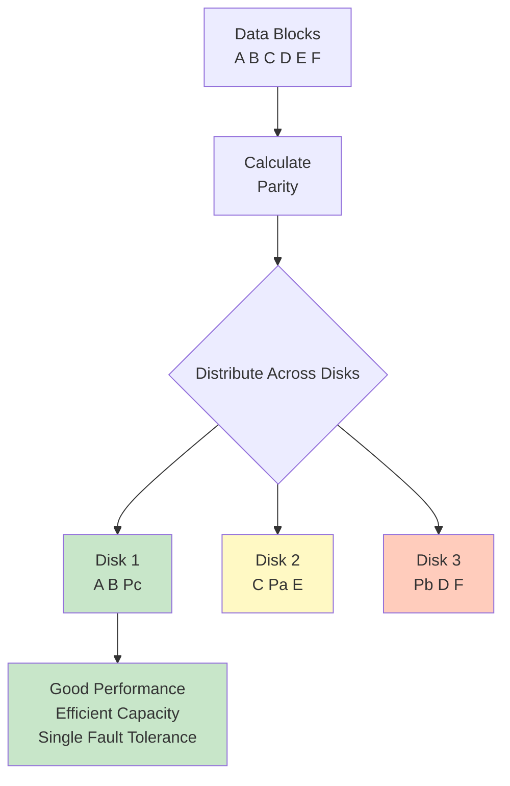
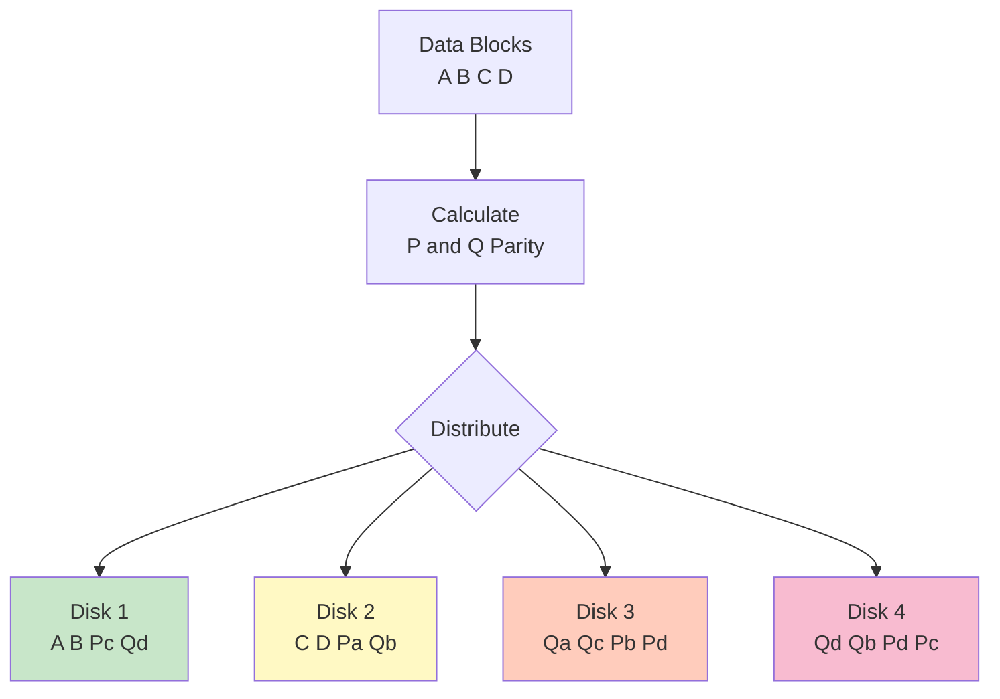
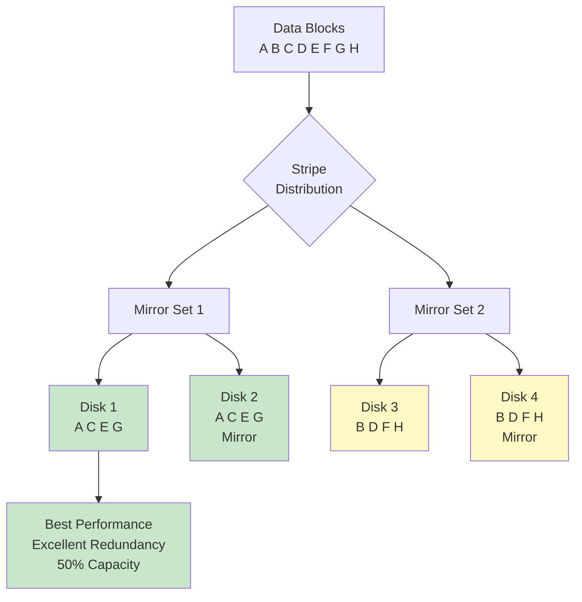
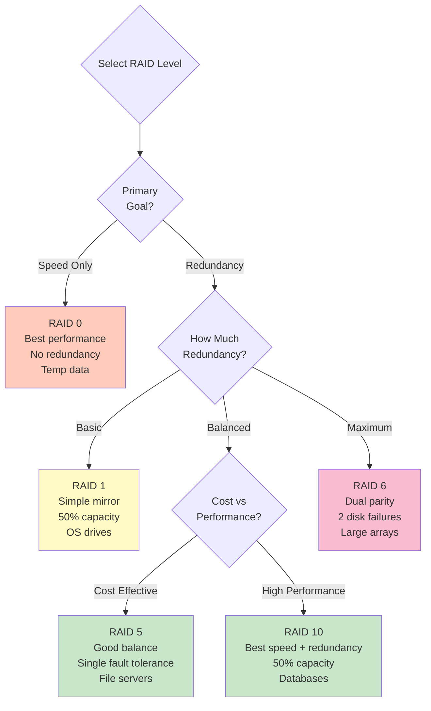
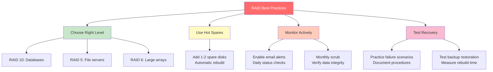

#operating-system #linux #unix #storage #raid #mdadm #redundancy #hardware-raid #software-raid #fedora #ubuntu #debian #rhel #centos-stream

- RAID (Redundant Array of Independent Disks) combines multiple physical disks into single logical unit.
- <mark class="hltr-yellow">Provides data redundancy, improved performance, or both through various RAID levels</mark>.
- Protects against disk failures and optimizes I/O performance for different workloads.

# RAID Fundamentals

## RAID Objectives
### Primary Goals
1. **Redundancy**
	- Data survives disk failures.
	- No data loss when drive fails.
	- Business continuity.

2. **Performance**
	- Parallel I/O operations.
	- Improved read/write speeds.
	- Better throughput.

3. **Capacity**
	- Combine multiple disks into larger volume.
	- Efficient space utilization.

## RAID Types


# RAID Levels

## RAID 0 (Striping)
### Characteristics
- <mark class="hltr-yellow">Data striped across multiple disks for performance, no redundancy</mark>.
- Capacity: Sum of all disks.
- Minimum disks: 2.
- No fault tolerance (any disk failure = total data loss).

### RAID 0 Structure


### RAID 0 Characteristics
```
Metric                  | Value
------------------------|----------------------------------
Minimum Disks           | 2
Usable Capacity         | 100% (n × disk size)
Read Performance        | Excellent (n × single disk)
Write Performance       | Excellent (n × single disk)
Fault Tolerance         | None (0 disk failures)
Typical Use Case        | Temporary storage, video editing
Rebuild Time            | N/A (cannot rebuild)
```

## RAID 1 (Mirroring)
### Characteristics
- <mark class="hltr-yellow">Complete copy of data on each disk for redundancy</mark>.
- Capacity: Size of smallest disk.
- Minimum disks: 2.
- Survives failure of all but one disk.

### RAID 1 Structure


### RAID 1 Characteristics
```
Metric                  | Value
------------------------|----------------------------------
Minimum Disks           | 2
Usable Capacity         | 50% (size of 1 disk)
Read Performance        | Good (can read from any disk)
Write Performance       | Same as single disk
Fault Tolerance         | n-1 disk failures
Typical Use Case        | OS drives, critical data
Rebuild Time            | Medium (copy full disk)
```

## RAID 5 (Striping with Parity)
### Characteristics
- <mark class="hltr-yellow">Data and parity information striped across all disks</mark>.
- Capacity: (n-1) × disk size.
- Minimum disks: 3.
- Survives single disk failure.

### RAID 5 Structure


### RAID 5 Parity Calculation
```
Example with 3 disks:
Disk 1: A1 B1 P(C)     P(C) = A1 XOR B1 XOR C1
Disk 2: A2 P(B) C2     P(B) = A2 XOR B2 XOR C2
Disk 3: P(A) B3 C3     P(A) = A3 XOR B3 XOR C3

If Disk 2 fails:
A2 = A1 XOR B3 XOR P(A)
C2 = C1 XOR P(C) XOR B1
Data reconstructed from parity
```

### RAID 5 Characteristics
```
Metric                  | Value
------------------------|----------------------------------
Minimum Disks           | 3
Usable Capacity         | (n-1)/n × total (67% for 3 disks)
Read Performance        | Excellent (parallel reads)
Write Performance       | Moderate (parity overhead)
Fault Tolerance         | 1 disk failure
Typical Use Case        | File servers, databases
Rebuild Time            | Long (parity recalculation)
Write Penalty           | 4 I/O operations per write
```

## RAID 6 (Dual Parity)
### Characteristics
- <mark class="hltr-yellow">Like RAID 5 but with two independent parity blocks</mark>.
- Capacity: (n-2) × disk size.
- Minimum disks: 4.
- Survives two simultaneous disk failures.

### RAID 6 Structure


### RAID 6 Characteristics
```
Metric                  | Value
------------------------|----------------------------------
Minimum Disks           | 4
Usable Capacity         | (n-2)/n × total (50% for 4 disks)
Read Performance        | Excellent (parallel reads)
Write Performance       | Poor (dual parity calculation)
Fault Tolerance         | 2 disk failures
Typical Use Case        | Mission-critical data, large arrays
Rebuild Time            | Very long (complex calculations)
Write Penalty           | 6 I/O operations per write
```

## RAID 10 (1+0, Mirrored Stripes)
### Characteristics
- <mark class="hltr-yellow">RAID 1 mirrors striped together (RAID 0 of RAID 1 pairs)</mark>.
- Capacity: (n/2) × disk size.
- Minimum disks: 4.
- Excellent performance and redundancy.

### RAID 10 Structure


### RAID 10 Characteristics
```
Metric                  | Value
------------------------|----------------------------------
Minimum Disks           | 4
Usable Capacity         | 50% (n/2 × disk size)
Read Performance        | Excellent (stripe + mirror)
Write Performance       | Excellent (only mirror penalty)
Fault Tolerance         | 1 disk per mirror pair
Typical Use Case        | Databases, high-performance apps
Rebuild Time            | Fast (copy from mirror)
```

## RAID Level Comparison


# Software RAID with mdadm

## Installing mdadm
```Shell title='Install RAID management tools'
# Fedora/RHEL/CentOS
sudo dnf install mdadm

# Ubuntu/Debian
sudo apt install mdadm

# Verify installation
mdadm --version
```

## Creating RAID Arrays

### RAID 0 Creation
```Shell title='Create RAID 0 stripe'
# Prepare disks (optional: partition first)
sudo parted /dev/sdb mklabel gpt
sudo parted /dev/sdb mkpart primary 0% 100%
sudo parted /dev/sdc mklabel gpt
sudo parted /dev/sdc mkpart primary 0% 100%

# Create RAID 0 array
sudo mdadm --create --verbose /dev/md0 \
    --level=0 \
    --raid-devices=2 \
    /dev/sdb1 /dev/sdc1

# Output:
# mdadm: chunk size defaults to 512K
# mdadm: array /dev/md0 started.

# Verify array
cat /proc/mdstat
# Output:
# md0 : active raid0 sdc1[1] sdb1[0]
#       209584128 blocks super 1.2 512k chunks

# View detailed information
sudo mdadm --detail /dev/md0
```

### RAID 1 Creation
```Shell title='Create RAID 1 mirror'
# Create RAID 1 array
sudo mdadm --create --verbose /dev/md1 \
    --level=1 \
    --raid-devices=2 \
    /dev/sdd1 /dev/sde1

# Monitor initial sync
watch cat /proc/mdstat
# Output shows resync progress:
# md1 : active raid1 sde1[1] sdd1[0]
#       104792064 blocks super 1.2 [2/2] [UU]
#       [=>...................]  resync = 8.5% (8912896/104792064)

# Wait for sync to complete
sudo mdadm --wait /dev/md1
```

### RAID 5 Creation
```Shell title='Create RAID 5 array'
# Create RAID 5 with 3 disks
sudo mdadm --create --verbose /dev/md5 \
    --level=5 \
    --raid-devices=3 \
    /dev/sdf1 /dev/sdg1 /dev/sdh1

# With spare disk
sudo mdadm --create --verbose /dev/md5 \
    --level=5 \
    --raid-devices=3 \
    --spare-devices=1 \
    /dev/sdf1 /dev/sdg1 /dev/sdh1 /dev/sdi1

# Spare disk automatically used if one fails

# Check array details
sudo mdadm --detail /dev/md5
```

### RAID 6 Creation
```Shell title='Create RAID 6 array'
# Create RAID 6 with 4 disks
sudo mdadm --create --verbose /dev/md6 \
    --level=6 \
    --raid-devices=4 \
    /dev/sdj1 /dev/sdk1 /dev/sdl1 /dev/sdm1

# RAID 6 requires minimum 4 disks
```

### RAID 10 Creation
```Shell title='Create RAID 10 array'
# Create RAID 10 with 4 disks
sudo mdadm --create --verbose /dev/md10 \
    --level=10 \
    --raid-devices=4 \
    /dev/sdn1 /dev/sdo1 /dev/sdp1 /dev/sdq1

# mdadm handles mirror+stripe configuration automatically
```

## Filesystem and Mounting
```Shell title='Create filesystem on RAID'
# Create ext4 filesystem
sudo mkfs.ext4 -L raid_data /dev/md0

# Create XFS filesystem
sudo mkfs.xfs -L raid_xfs /dev/md5

# Mount RAID array
sudo mkdir -p /mnt/raid
sudo mount /dev/md0 /mnt/raid

# Add to /etc/fstab for persistent mount
echo "/dev/md0 /mnt/raid ext4 defaults 0 2" | sudo tee -a /etc/fstab

# Or use UUID (preferred)
UUID=$(blkid -s UUID -o value /dev/md0)
echo "UUID=$UUID /mnt/raid ext4 defaults 0 2" | sudo tee -a /etc/fstab
```

## RAID Configuration Persistence
```Shell title='Save RAID configuration'
# Save RAID configuration to /etc/mdadm.conf
sudo mdadm --detail --scan | sudo tee -a /etc/mdadm.conf

# Example output in /etc/mdadm.conf:
# ARRAY /dev/md0 metadata=1.2 name=server:0 UUID=12345678:abcdef...

# Update initramfs to include RAID config
sudo update-initramfs -u  # Ubuntu/Debian
sudo dracut --force       # Fedora/RHEL
```

# RAID Management

## Monitoring RAID Arrays
```Shell title='Monitor RAID status'
# Check all RAID arrays
cat /proc/mdstat
# Output:
# Personalities : [raid0] [raid1] [raid5]
# md0 : active raid5 sdc1[2] sdb1[1] sda1[0]
#       209584128 blocks super 1.2 level 5, 512k chunk, algorithm 2 [3/3] [UUU]

# Detailed array information
sudo mdadm --detail /dev/md0

# Monitor RAID status continuously
watch -n 1 cat /proc/mdstat

# Check for errors
sudo mdadm --detail /dev/md0 | grep -i error
```

## Managing Array Members
```Shell title='Add and remove disks'
# Add spare disk to array
sudo mdadm --add /dev/md5 /dev/sdi1
# mdadm: added /dev/sdi1

# Mark disk as failed (for testing or replacement)
sudo mdadm --fail /dev/md5 /dev/sdh1
# mdadm: set /dev/sdh1 faulty in /dev/md5

# Remove failed disk from array
sudo mdadm --remove /dev/md5 /dev/sdh1
# mdadm: hot removed /dev/sdh1 from /dev/md5

# Replace failed disk
# 1. Physical: Replace hardware
# 2. Add new disk to array
sudo mdadm --add /dev/md5 /dev/sdj1
# Rebuild starts automatically
```

## Growing and Reshaping Arrays
```Shell title='Modify RAID arrays'
# Add disk to existing RAID 5 (reshape)
sudo mdadm --add /dev/md5 /dev/sdk1
sudo mdadm --grow /dev/md5 --raid-devices=4
# Reshape begins automatically

# Monitor reshape progress
watch cat /proc/mdstat

# Convert RAID level (RAID 1 to RAID 5)
sudo mdadm --grow /dev/md1 --level=5 --raid-devices=3 --add /dev/sdf1

# Grow filesystem after array expansion
sudo resize2fs /dev/md5  # ext4
sudo xfs_growfs /mnt/raid5  # XFS (must be mounted)
```

## RAID Scrubbing (Data Verification)
```Shell title='Verify RAID integrity'
# Initiate array check (scrub)
echo check | sudo tee /sys/block/md0/md/sync_action

# Monitor check progress
cat /proc/mdstat
# Shows: check = X.X% (123456/234567) finish=1.2min speed=12345K/sec

# Check for mismatches
cat /sys/block/md0/md/mismatch_cnt
# Should be 0 for healthy array

# Repair mismatches (usually automatic)
echo repair | sudo tee /sys/block/md0/md/sync_action
```

# RAID Recovery

## Handling Disk Failures
```Shell title='Recover from disk failure'
# Scenario: Disk /dev/sdc1 failed in RAID 5

# 1. Check array status
sudo mdadm --detail /dev/md5
# Output shows: State : clean, degraded

# 2. Physically replace failed disk

# 3. Partition new disk identically
sudo sfdisk -d /dev/sdb | sudo sfdisk /dev/sdc

# 4. Add new disk to array
sudo mdadm --add /dev/md5 /dev/sdc1
# mdadm: added /dev/sdc1

# 5. Monitor rebuild
watch cat /proc/mdstat
# md5 : active raid5 sdc1[3] sdb1[1] sda1[0]
#       [=>...................]  recovery = 8.5% (1234/5678) finish=12.3min

# 6. Verify after rebuild
sudo mdadm --detail /dev/md5
# State : clean
```

## Rebuilding Degraded Arrays
```Shell title='Force rebuild of RAID'
# Stop degraded array
sudo umount /mnt/raid5
sudo mdadm --stop /dev/md5

# Reassemble array (may auto-rebuild)
sudo mdadm --assemble /dev/md5 /dev/sda1 /dev/sdb1 /dev/sdc1

# Force assembly if needed
sudo mdadm --assemble --force /dev/md5 /dev/sda1 /dev/sdb1

# Start array
sudo mdadm --run /dev/md5
```

## Recovering from Multiple Failures (RAID 6)
```Shell title='Recover RAID 6 with dual failures'
# RAID 6 can survive 2 disk failures
# Replace both failed disks

# Add first replacement
sudo mdadm --add /dev/md6 /dev/sdn1
# Wait for rebuild to complete

# Add second replacement
sudo mdadm --add /dev/md6 /dev/sdo1
# Second rebuild starts after first completes
```

# Performance Optimization

## RAID Performance Tuning
```Shell title='Optimize RAID performance'
# Set read-ahead (improves sequential reads)
sudo blockdev --setra 8192 /dev/md0

# Adjust stripe cache size (RAID 5/6)
echo 8192 | sudo tee /sys/block/md5/md/stripe_cache_size

# Set optimal I/O scheduler
echo deadline | sudo tee /sys/block/md0/queue/scheduler

# Disable barriers for better performance (less safe)
# Add 'nobarrier' to mount options in /etc/fstab
# /dev/md0 /mnt/raid ext4 defaults,nobarrier 0 2

# Enable TRIM for SSDs in RAID
# Add 'discard' to mount options
# /dev/md0 /mnt/raid ext4 defaults,discard 0 2
```

## Bitmap for Faster Rebuild
```Shell title='Use write-intent bitmap'
# Add bitmap to array (speeds up rebuild)
sudo mdadm --grow /dev/md5 --bitmap=internal

# Bitmap tracks which blocks changed during failure
# Only changed blocks need rebuilding (much faster)

# Check bitmap status
sudo mdadm --detail /dev/md5 | grep Bitmap
# Intent Bitmap : Internal

# Remove bitmap
sudo mdadm --grow /dev/md5 --bitmap=none
```

# Monitoring and Alerts

## Automated RAID Monitoring
```Shell title='Setup RAID monitoring daemon'
# Configure mdadm monitoring
sudo nano /etc/mdadm.conf
# Add:
# MAILADDR admin@example.com

# Start monitoring daemon
sudo systemctl enable mdmonitor
sudo systemctl start mdmonitor

# Test email notification
sudo mdadm --monitor --scan --test --oneshot
```

## RAID Health Checks
```Shell title='Regular health monitoring'
# Create monitoring script
cat > /usr/local/bin/check-raid.sh << 'EOF'
#!/bin/bash
ARRAYS=$(cat /proc/mdstat | grep ^md | cut -d' ' -f1)

for array in $ARRAYS; do
    STATE=$(mdadm --detail /dev/$array | grep "State :" | cut -d: -f2)
    if [[ ! "$STATE" =~ "clean" ]]; then
        echo "WARNING: /dev/$array state: $STATE" | \
        mail -s "RAID Alert: $array degraded" admin@example.com
    fi
done
EOF

sudo chmod +x /usr/local/bin/check-raid.sh

# Add to cron (check every hour)
echo "0 * * * * /usr/local/bin/check-raid.sh" | sudo crontab -
```

# Best Practices

## RAID Design Recommendations


## RAID vs Backup
```
RAID is NOT a backup!

RAID protects against:     | RAID does NOT protect against:
----------------------------|--------------------------------
Hardware failure            | Accidental deletion
Disk failure                | Filesystem corruption
Read errors                 | Malware/ransomware
                            | Natural disasters
                            | Theft

Always maintain separate backups!
```

***
# References
1. Operating System Concepts - Abraham Silberschatz - 10th - 2018 - Pearson.
	1. Chapter 11: Mass-Storage Structure.
		1. Section 11.6: RAID Structure.
2. `man mdadm`, `man md`, `man mdadm.conf`
3. Linux RAID Wiki.
	1. https://raid.wiki.kernel.org/
4. Red Hat Storage Administration - RAID.
	1. https://access.redhat.com/documentation/en-us/red_hat_enterprise_linux/9/html/managing_storage_devices/managing-raid_managing-storage-devices
5. Arch Linux Wiki - RAID.
	1. https://wiki.archlinux.org/title/RAID
6. Software RAID HOWTO.
	1. https://www.tldp.org/HOWTO/Software-RAID-HOWTO.html
7. mdadm GitHub Repository.
	1. https://github.com/neilbrown/mdadm
