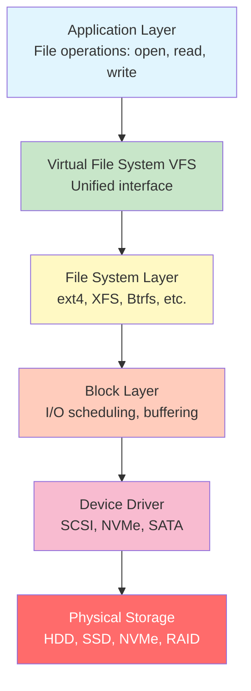
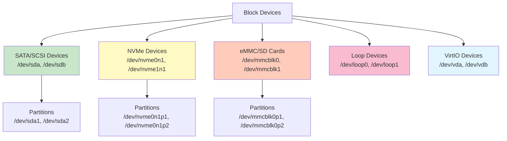
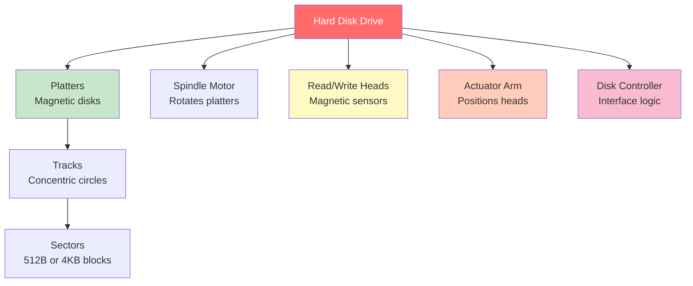
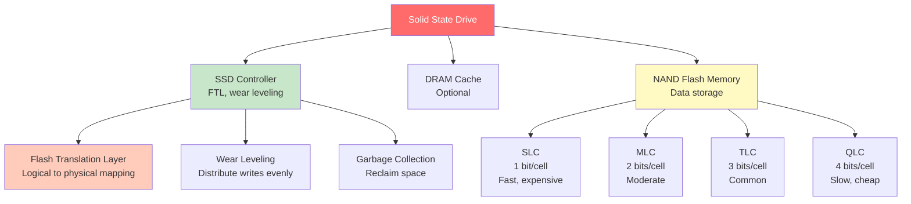
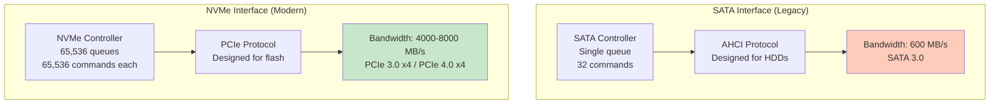
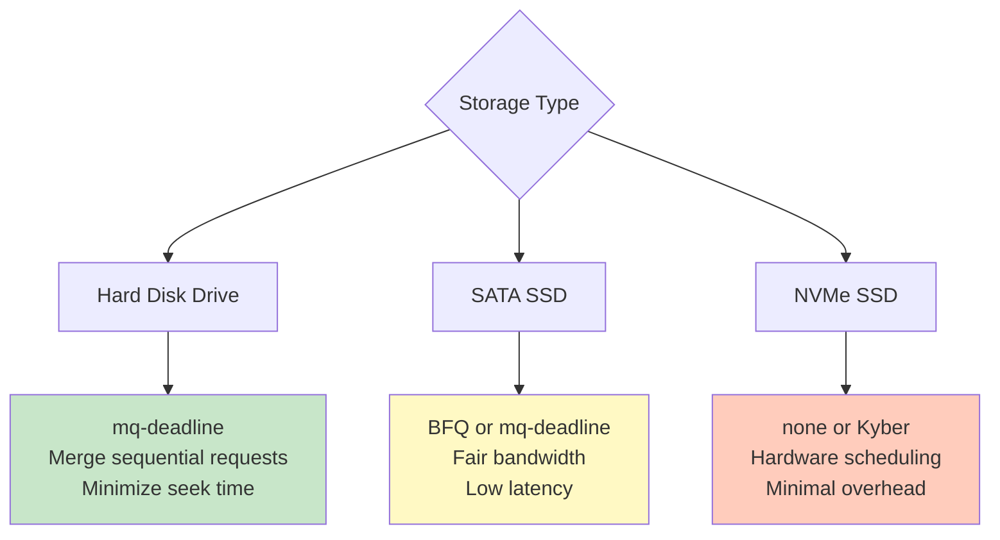

#operating-system #linux #unix #storage #block-device #storage-hierarchy #hardware #fedora #ubuntu #debian #rhel #centos-stream

- Storage architecture defines how data is organized, accessed, and managed in Linux systems.
- <mark class="hltr-yellow">Linux treats all storage devices as files in /dev directory using block device abstraction</mark>.
- Provides unified interface for diverse storage technologies from HDDs to SSDs and network storage.

# Storage Hierarchy

## Storage Stack Overview


## Storage Abstraction Layers
### Application Layer
- User programs interact with files and directories.
- System calls: `open()`, `read()`, `write()`, `close()`, `lseek()`.
- No knowledge of underlying storage hardware.

### Virtual File System (VFS)
- <mark class="hltr-yellow">Provides common interface for different filesystem types</mark>.
- Abstracts filesystem-specific operations.
- Allows mounting multiple filesystem types simultaneously.

### File System Layer
- Manages file organization, metadata, directories.
- Handles inode allocation, block mapping.
- Common types: ext4, XFS, Btrfs, F2FS.

### Block Layer
- <mark class="hltr-yellow">Handles block-level I/O requests and scheduling</mark>.
- Implements I/O schedulers (mq-deadline, BFQ, Kyber).
- Performs request merging and sorting.

### Device Driver Layer
- Hardware-specific device drivers.
- Translates block operations to hardware commands.
- Protocols: SCSI, SATA, NVMe, IDE (legacy).

### Physical Storage
- Actual storage hardware.
- Types: HDD, SSD, NVMe, eMMC, SD cards.

# Block Devices

## Block Device Concept
- <mark class="hltr-yellow">Device that stores data in fixed-size blocks (typically 512 bytes or 4KB)</mark>.
- Supports random access to any block.
- Buffered I/O through kernel buffer cache.

## Block Device Naming
### Traditional Naming (/dev/sdX)


### Device Naming Conventions
```
Device Type     | Pattern           | Example
----------------|-------------------|------------------------
SATA/SCSI Disk  | /dev/sdX          | /dev/sda (1st disk)
SATA Partition  | /dev/sdXN         | /dev/sda1 (1st partition)
NVMe Disk       | /dev/nvmeXnY      | /dev/nvme0n1 (controller 0, namespace 1)
NVMe Partition  | /dev/nvmeXnYpZ    | /dev/nvme0n1p1 (partition 1)
eMMC/SD Card    | /dev/mmcblkX      | /dev/mmcblk0
eMMC Partition  | /dev/mmcblkXpY    | /dev/mmcblk0p1
VirtIO Disk     | /dev/vdX          | /dev/vda (virtual disk)
Loop Device     | /dev/loopX        | /dev/loop0 (virtual block device)
```

## Block Device Information
```Shell title='View block devices'
# List all block devices with tree structure
lsblk

# Output example:
# NAME   MAJ:MIN RM   SIZE RO TYPE MOUNTPOINT
# sda      8:0    0   500G  0 disk
# ├─sda1   8:1    0   512M  0 part /boot/efi
# ├─sda2   8:2    0    16G  0 part [SWAP]
# └─sda3   8:3    0 483.5G  0 part /

# Detailed device information
lsblk -f  # Show filesystem type and UUID

# Show device size in bytes
lsblk -b

# List device by path
ls -l /dev/disk/by-*
# /dev/disk/by-id/       - Hardware IDs
# /dev/disk/by-uuid/     - Filesystem UUIDs
# /dev/disk/by-label/    - Filesystem labels
# /dev/disk/by-path/     - Physical connection path
# /dev/disk/by-partuuid/ - Partition UUIDs
```

### Major and Minor Numbers
- <mark class="hltr-yellow">Major number identifies device driver, minor number identifies specific device</mark>.
- Kernel uses these to route I/O requests.

```Shell title='View device numbers'
ls -l /dev/sda*

# Output:
# brw-rw---- 1 root disk 8, 0 Jan  8 10:00 /dev/sda
# brw-rw---- 1 root disk 8, 1 Jan  8 10:00 /dev/sda1
# brw-rw---- 1 root disk 8, 2 Jan  8 10:00 /dev/sda2
#                        ↑  ↑
#                     Major Minor
```

# Storage Device Types

## Hard Disk Drive (HDD)
### Characteristics
- Mechanical storage with rotating platters.
- Magnetic read/write heads.
- Sequential access faster than random access.
- Typical speeds: 5400 RPM, 7200 RPM, 10000 RPM, 15000 RPM.

### HDD Components


### Performance Characteristics
```
Metric              | Typical HDD (7200 RPM)
--------------------|------------------------
Capacity            | 1TB - 20TB
Sequential Read     | 120-200 MB/s
Sequential Write    | 120-200 MB/s
Random Read IOPS    | 75-100 IOPS
Random Write IOPS   | 75-100 IOPS
Seek Time           | 8-15 ms
Rotational Latency  | 4.2 ms (7200 RPM)
Power Consumption   | 6-10W active
Lifespan            | 3-5 years typical
```

## Solid State Drive (SSD)
### Characteristics
- <mark class="hltr-yellow">Flash memory-based storage with no moving parts</mark>.
- Much faster random access than HDD.
- Limited write endurance (wear leveling required).
- Two interfaces: SATA (slower) and NVMe (faster).

### SSD Architecture


### Performance Characteristics
```
Metric              | SATA SSD        | NVMe SSD
--------------------|-----------------|------------------
Capacity            | 128GB - 4TB     | 256GB - 8TB
Sequential Read     | 500-550 MB/s    | 3000-7000 MB/s
Sequential Write    | 450-520 MB/s    | 2000-5000 MB/s
Random Read IOPS    | 90K-100K IOPS   | 300K-1M IOPS
Random Write IOPS   | 80K-90K IOPS    | 200K-800K IOPS
Latency             | 50-100 μs       | 10-25 μs
Power Consumption   | 2-4W active     | 5-8W active
Lifespan (TBW)      | 150-600 TBW     | 300-3000 TBW
```

## NVMe (Non-Volatile Memory Express)
### Characteristics
- <mark class="hltr-yellow">PCIe-based protocol designed specifically for SSDs</mark>.
- Much lower latency than SATA.
- Higher parallelism (65K queues vs 1 queue for SATA).
- Direct CPU-to-storage communication via PCIe.

### NVMe vs SATA Comparison


# Storage Access Patterns

## Sequential Access
- <mark class="hltr-yellow">Reading/writing data in contiguous blocks</mark>.
- Optimal for HDDs (minimizes seek time).
- Good for: large file transfers, streaming, backups.

## Random Access
- Reading/writing data at non-contiguous locations.
- Poor performance on HDDs (requires seeking).
- SSDs excel at random access.
- Common in: databases, virtual machines, OS operations.

## Access Pattern Comparison

```mermaid
gantt
    title Storage Access Patterns
    dateFormat X
    axisFormat %s

    section Sequential (HDD)
    Read Block 0-7 :crit, s1, 0, 8

    section Random (HDD)
    Read Block 0 :r1, 0, 1
    Seek to 5 :active, seek1, 1, 2
    Read Block 5 :r2, 3, 1
    Seek to 2 :active, seek2, 4, 2
    Read Block 2 :r3, 6, 1
    Seek to 7 :active, seek3, 7, 2
    Read Block 7 :r4, 9, 1
```


# I/O Schedulers

## Linux I/O Scheduler Types
- <mark class="hltr-yellow">I/O scheduler optimizes order of block I/O requests to storage devices</mark>.
- Different schedulers suited for different workloads and storage types.

## Scheduler Algorithms
### mq-deadline (Multi-Queue Deadline)
- Default for most systems.
- Separate read and write queues.
- Prevents request starvation.
- Good for: HDDs, general purpose workloads.

### BFQ (Budget Fair Queueing)
- Provides fair bandwidth distribution.
- Low latency for interactive workloads.
- Good for: desktops, interactive systems.

### Kyber
- Designed for fast SSDs.
- Uses target latencies to adjust queue depth.
- Good for: NVMe drives, low-latency requirements.

### none (No-op)
- No reordering of I/O requests.
- Minimal CPU overhead.
- Good for: NVMe with internal scheduling, virtual machines.

## Scheduler Comparison


## Viewing and Changing Schedulers
```Shell title='I/O scheduler management'
# View current scheduler (in brackets)
cat /sys/block/sda/queue/scheduler
# Output: [mq-deadline] kyber bfq none

# View scheduler for NVMe
cat /sys/block/nvme0n1/queue/scheduler
# Output: [none] mq-deadline

# Change scheduler temporarily
echo bfq | sudo tee /sys/block/sda/queue/scheduler

# Change scheduler permanently (add to kernel parameters)
# Edit /etc/default/grub:
# GRUB_CMDLINE_LINUX="elevator=bfq"
sudo grub2-mkconfig -o /boot/grub2/grub.cfg

# Or use udev rule for specific devices
cat > /etc/udev/rules.d/60-ioschedulers.rules << 'EOF'
# HDD: use mq-deadline
ACTION=="add|change", KERNEL=="sd[a-z]", ATTR{queue/rotational}=="1", ATTR{queue/scheduler}="mq-deadline"

# SSD: use bfq
ACTION=="add|change", KERNEL=="sd[a-z]", ATTR{queue/rotational}=="0", ATTR{queue/scheduler}="bfq"

# NVMe: use none
ACTION=="add|change", KERNEL=="nvme[0-9]n[0-9]", ATTR{queue/scheduler}="none"
EOF

sudo udevadm control --reload-rules
```

# Storage Performance Metrics

## Key Performance Indicators

### IOPS (Input/Output Operations Per Second)
- <mark class="hltr-yellow">Number of read/write operations completed per second</mark>.
- Critical for random access workloads.
- Higher IOPS = better database/VM performance.

### Throughput (Bandwidth)
- Amount of data transferred per second (MB/s, GB/s).
- Important for sequential workloads.
- Higher throughput = faster large file operations.

### Latency
- Time between I/O request and completion.
- Measured in microseconds (μs) or milliseconds (ms).
- Lower latency = better responsiveness.

### Performance Metrics Table
```
Metric      | HDD (7200 RPM) | SATA SSD  | NVMe SSD
------------|----------------|-----------|-------------
Random IOPS | 100 IOPS       | 90K IOPS  | 500K IOPS
Throughput  | 150 MB/s       | 550 MB/s  | 3500 MB/s
Latency     | 8-15 ms        | 100 μs    | 20 μs
Queue Depth | 32             | 32        | 256+
```

# Device Identification

## UUID (Universally Unique Identifier)
- <mark class="hltr-yellow">Unique identifier for filesystems, persistent across reboots</mark>.
- Preferred for /etc/fstab entries.
- Does not change when device name changes.

## Device Identification Methods
```Shell title='View device identifiers'
# View all device UUIDs
lsblk -f
# or
blkid

# Output:
# /dev/sda1: UUID="A1B2-C3D4" TYPE="vfat" PARTUUID="12345678-01"
# /dev/sda2: UUID="a1b2c3d4-e5f6-..." TYPE="ext4" PARTUUID="12345678-02"

# Find device by UUID
ls -l /dev/disk/by-uuid/
# lrwxrwxrwx 1 root root 10 Jan  8 10:00 a1b2c3d4-... -> ../../sda2

# Find device by label
ls -l /dev/disk/by-label/
# lrwxrwxrwx 1 root root 10 Jan  8 10:00 MyData -> ../../sda3

# Find device by hardware ID
ls -l /dev/disk/by-id/
# lrwxrwxrwx 1 root root 9 Jan  8 10:00 ata-Samsung_SSD_850... -> ../../sda

# Get UUID of specific device
blkid /dev/sda1
# /dev/sda1: UUID="A1B2-C3D4" TYPE="vfat"

# Get specific field
blkid -s UUID -o value /dev/sda1
# A1B2-C3D4
```

# Storage Device Information Commands

## Essential Commands
```Shell title='Storage device information'
# List block devices with details
lsblk -o NAME,SIZE,TYPE,FSTYPE,MOUNTPOINT,UUID

# Show all partitions
cat /proc/partitions

# Detailed device information
fdisk -l

# Disk usage by filesystem
df -h

# Detailed filesystem statistics
df -Th  # Include filesystem type

# Show inode usage
df -i

# SMART health information (requires smartmontools)
sudo smartctl -a /dev/sda

# Device statistics
iostat -x 1

# Disk information with hdparm
sudo hdparm -I /dev/sda

# NVMe specific information
sudo nvme list
sudo nvme smart-log /dev/nvme0n1
```

# Practical Examples

## Example 1: Identify All Storage Devices
```Shell title='Enumerate storage devices'
# List all block devices with filesystem info
lsblk -f

# Output:
# NAME   FSTYPE LABEL UUID                                 MOUNTPOINT
# sda
# ├─sda1 vfat         A1B2-C3D4                            /boot/efi
# ├─sda2 swap         e5f6-g7h8                            [SWAP]
# └─sda3 ext4   root  a1b2c3d4-e5f6-7890-abcd-ef1234567890 /
# nvme0n1
# └─nvme0n1p1 xfs data f1e2d3c4-b5a6-7890-1234-567890abcdef /data

# Get detailed device information
for dev in /dev/sd? /dev/nvme?n?; do
    if [ -b "$dev" ]; then
        echo "=== $dev ==="
        lsblk -o NAME,SIZE,TYPE,ROTA,DISC-GRAN,PHY-SEC $dev
        echo
    fi
done

# ROTA: 1=rotating (HDD), 0=non-rotating (SSD)
# DISC-GRAN: discard granularity (TRIM support)
# PHY-SEC: physical sector size
```

## Example 2: Check Device Performance Characteristics
```Shell title='Analyze device capabilities'
# Check if device supports TRIM (SSD optimization)
lsblk -D /dev/sda
# If DISC-GRAN and DISC-MAX > 0, TRIM is supported

# Check rotational status (HDD vs SSD)
cat /sys/block/sda/queue/rotational
# 0 = SSD, 1 = HDD

# Check queue depth
cat /sys/block/sda/queue/nr_requests

# Check read-ahead size
cat /sys/block/sda/queue/read_ahead_kb

# Check maximum request size
cat /sys/block/sda/queue/max_sectors_kb

# For NVMe, get detailed controller info
sudo nvme id-ctrl /dev/nvme0n1

# View NVMe namespace information
sudo nvme id-ns /dev/nvme0n1
```

## Example 3: Monitor I/O Performance
```Shell title='Real-time I/O monitoring'
# Install sysstat package first
sudo dnf install sysstat  # Fedora
sudo apt install sysstat  # Ubuntu

# Monitor I/O statistics every 2 seconds
iostat -x 2

# Output:
# Device   r/s  w/s  rkB/s  wkB/s  await  util%
# sda      5.2  1.3  234.1   56.7   2.3    1.2%
# nvme0n1 45.6 12.8 1234.5  456.2   0.4    8.5%

# Monitor specific device
iostat -x sda 1

# Detailed I/O monitoring with iotop
sudo iotop -o  # Show only processes doing I/O

# Block device I/O with bcc tools (if available)
sudo biolatency    # I/O latency histogram
sudo biosnoop      # Trace block I/O operations
```

## Example 4: Compare Storage Technologies
```Shell title='Benchmark storage devices'
# Sequential write test (WARNING: destroys data!)
sudo dd if=/dev/zero of=/dev/sdb bs=1M count=1000 oflag=direct
# 1048576000 bytes (1.0 GB) copied, 5.2 s, 201 MB/s

# Sequential read test
sudo dd if=/dev/sdb of=/dev/null bs=1M count=1000 iflag=direct
# 1048576000 bytes (1.0 GB) copied, 4.8 s, 218 MB/s

# Better benchmarking with fio
sudo fio --name=random-read --ioengine=libaio --iodepth=32 \
  --rw=randread --bs=4k --direct=1 --size=1G --numjobs=4 \
  --runtime=60 --group_reporting --filename=/dev/sdb

# Test on mounted filesystem (safer)
fio --name=seq-write --rw=write --bs=1M --size=1G \
  --numjobs=1 --runtime=60 --group_reporting \
  --filename=/data/testfile

# HDPARM read benchmark
sudo hdparm -t /dev/sda  # Cached reads
sudo hdparm -T /dev/sda  # Direct reads
```

## Example 5: Device Symbolic Links
```Shell title='Use persistent device names'
# View all symbolic link types
ls -l /dev/disk/by-*

# Use UUID in mount command
sudo mount UUID=a1b2c3d4-e5f6-7890-abcd-ef1234567890 /mnt/data

# Use UUID in /etc/fstab (recommended)
cat >> /etc/fstab << 'EOF'
UUID=a1b2c3d4-e5f6-7890-abcd-ef1234567890  /data  ext4  defaults  0  2
EOF

# Use label instead (must set label first)
sudo e2label /dev/sda3 MyData
sudo mount LABEL=MyData /mnt/data

# /etc/fstab with label
cat >> /etc/fstab << 'EOF'
LABEL=MyData  /data  ext4  defaults  0  2
EOF
```

***
# References
1. Operating System Concepts - Abraham Silberschatz - 10th - 2018 - Pearson.
	1. Chapter 11: Mass-Storage Structure.
		1. Section 11.1: Overview of Mass-Storage Structure.
		2. Section 11.4: Disk Scheduling.
2. Modern Operating Systems - Andrew Tanenbaum - 4th - 2014 - Pearson.
	1. Chapter 5: Input/Output.
		1. Section 5.4: Disks.
3. Operating Systems: Three Easy Pieces - Remzi Arpaci-Dusseau - 2018.
	1. Chapter 37: Hard Disk Drives.
	2. Chapter 44: Flash-based SSDs.
4. Linux Kernel Documentation - Block Layer.
	1. https://www.kernel.org/doc/html/latest/block/
5. NVMe Specification.
	1. https://nvmexpress.org/specifications/
6. `man lsblk`, `man blkid`, `man iostat`, `man hdparm`
7. Red Hat Storage Administration Guide.
	1. https://access.redhat.com/documentation/en-us/red_hat_enterprise_linux/9/html/managing_storage_devices/
8. Arch Linux Wiki - Storage.
	1. https://wiki.archlinux.org/title/Persistent_block_device_naming
