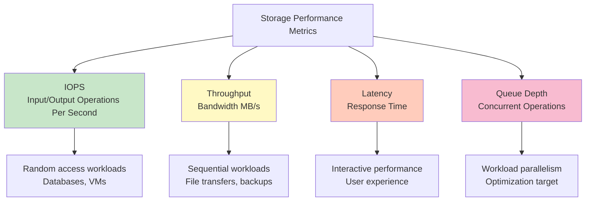
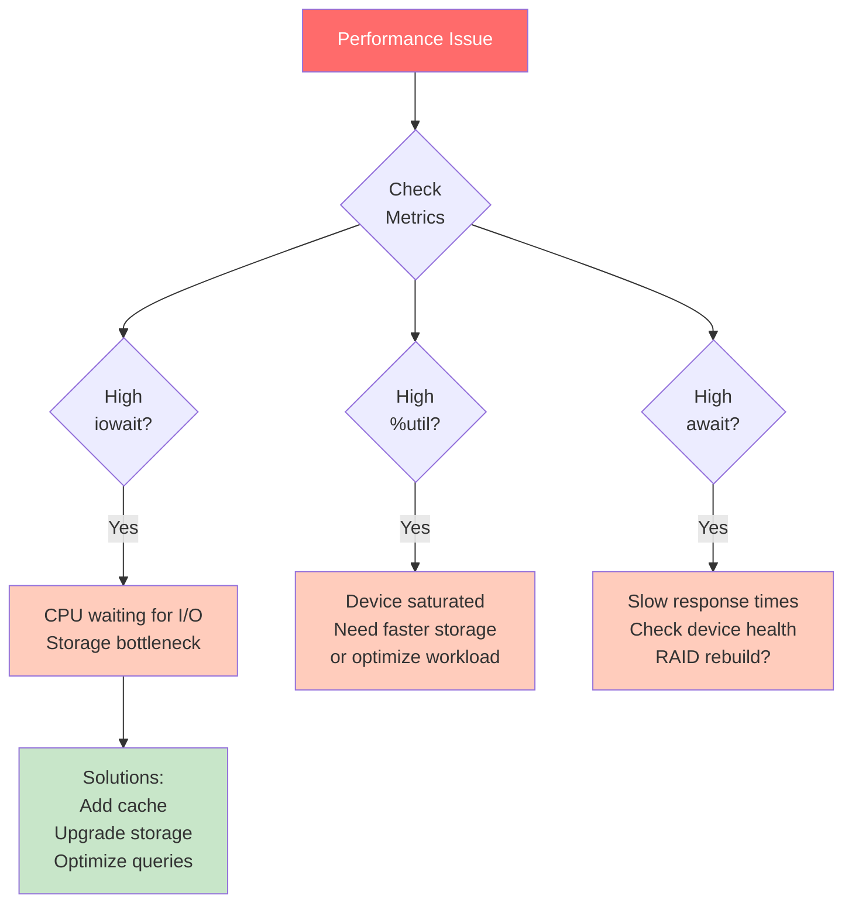
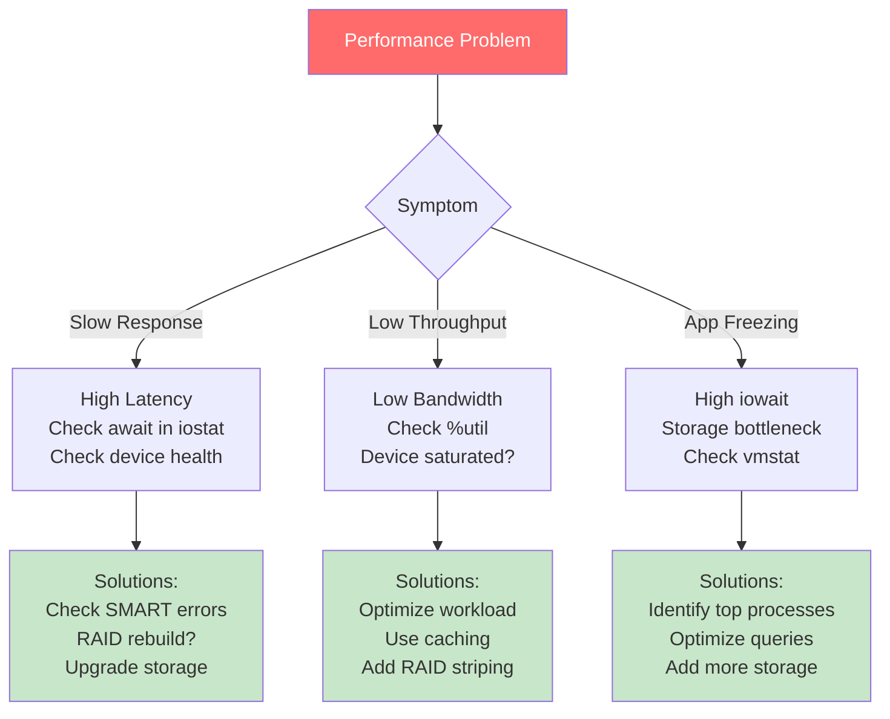

#operating-system #linux #unix #storage #performance #monitoring #iostat #iotop #benchmarking #fio #tuning #fedora #ubuntu #debian #rhel

- Storage performance monitoring identifies bottlenecks and optimizes I/O operations.
- <mark class="hltr-yellow">Measuring IOPS, throughput, and latency helps tune storage configuration for workload requirements</mark>.
- Proactive monitoring prevents performance degradation and capacity issues.

# Storage Performance Metrics

## Key Performance Indicators


## IOPS (Input/Output Operations Per Second)
- <mark class="hltr-yellow">Number of read/write operations completed per second</mark>.
- Critical metric for random access patterns.
- Varies by block size (smaller blocks = higher IOPS).

```
Device Type       | Random Read IOPS | Random Write IOPS
------------------|------------------|-------------------
HDD 7200 RPM      | 80-100           | 80-100
SATA SSD          | 80,000-100,000   | 70,000-90,000
NVMe SSD          | 300,000-1,000,000| 200,000-800,000
Enterprise NVMe   | 1,000,000+       | 800,000+
```

## Throughput (Bandwidth)
- Amount of data transferred per unit time (MB/s, GB/s).
- Important for sequential workloads.
- Affected by block size (larger blocks = higher throughput).

```
Device Type       | Sequential Read  | Sequential Write
------------------|------------------|-------------------
HDD 7200 RPM      | 150-200 MB/s     | 150-200 MB/s
SATA SSD          | 500-550 MB/s     | 450-520 MB/s
NVMe SSD Gen3     | 3,000-3,500 MB/s | 2,000-3,000 MB/s
NVMe SSD Gen4     | 5,000-7,000 MB/s | 4,000-5,000 MB/s
```

## Latency
- Time between I/O request and completion.
- Lower is better for responsiveness.
- Measured in microseconds (μs) or milliseconds (ms).

```
Device Type       | Average Latency
------------------|------------------
HDD 7200 RPM      | 8-15 ms
SATA SSD          | 50-100 μs
NVMe SSD          | 10-25 μs
RAM Disk          | < 1 μs
```

## Queue Depth
- <mark class="hltr-yellow">Number of outstanding I/O requests at a time</mark>.
- Higher queue depth can improve throughput.
- Optimal value depends on workload and device.

# Performance Monitoring Tools

## iostat - I/O Statistics
```Shell title='Monitor I/O performance with iostat'
# Install sysstat package
sudo dnf install sysstat  # Fedora/RHEL
sudo apt install sysstat  # Ubuntu/Debian

# Basic I/O statistics
iostat

# Output:
# avg-cpu:  %user   %nice %system %iowait  %steal   %idle
#            2.50    0.00    1.20    0.80    0.00   95.50
#
# Device    tps    kB_read/s    kB_wrtn/s    kB_read    kB_wrtn
# sda      5.23       123.45        67.89    1234567     678901

# Extended statistics
iostat -x 1
# Updates every 1 second

# Output:
# Device  r/s  w/s  rkB/s  wkB/s  await  svctm  %util
# sda    10.2  3.4  512.3  128.7   2.3    1.2    5.2
# nvme0n1 45.6 12.8 1823.4  512.1   0.4    0.3   15.7

# Monitor specific device
iostat -x sda 2 10
# Device sda, update every 2 seconds, 10 iterations

# Human-readable format
iostat -xm 1
# Shows values in MB instead of KB
```

### iostat Key Metrics
```
Metric      | Description                          | Good Value
------------|--------------------------------------|-------------
r/s, w/s    | Reads/writes per second              | Depends on workload
rkB/s, wkB/s| Read/write throughput                | Close to device max
await       | Average wait time (ms)               | < 10ms for SSD, < 20ms HDD
svctm       | Service time (deprecated)            | N/A
%util       | Device utilization percentage        | < 80%
avgqu-sz    | Average queue length                 | 1-4 typical
```

## iotop - Per-Process I/O Monitoring
```Shell title='Monitor I/O by process'
# Install iotop
sudo dnf install iotop  # Fedora/RHEL
sudo apt install iotop  # Ubuntu/Debian

# Run iotop (requires root)
sudo iotop

# Output:
# Total DISK READ: 12.45 M/s | Total DISK WRITE: 3.67 M/s
# TID  PRIO  USER     DISK READ  DISK WRITE  SWAPIN    IO    COMMAND
# 1234 be/4  mysql    10.23 M/s   1.45 M/s    0.00%  15.23% mysqld
# 5678 be/4  postgres  2.12 M/s   2.12 M/s    0.00%   8.45% postgres

# Show only processes doing I/O
sudo iotop -o

# Show accumulated I/O instead of bandwidth
sudo iotop -a

# Batch mode (for logging)
sudo iotop -b -n 10 > iotop.log
```

## vmstat - Virtual Memory Statistics
```Shell title='Monitor system-wide I/O'
# Monitor I/O and memory
vmstat 1

# Output:
# procs -----------memory---------- ---swap-- -----io---- -system-- ------cpu-----
#  r  b   swpd   free   buff  cache   si   so    bi    bo   in   cs us sy id wa st
#  1  0      0 2048M   256M  1024M    0    0   100   50  500 1000  5  2 92  1  0
#          ↑    ↑                    ↑    ↑     ↑    ↑
#          |    |                    |    |     |    |
#    Blocked   Free                Swap  Swap  Block Block
#    on I/O    RAM                  in   out    in   out

# Key I/O columns:
# bi: Blocks received from block device (read)
# bo: Blocks sent to block device (write)
# wa: CPU time waiting for I/O
```

## sar - System Activity Reporter
```Shell title='Historical I/O data with sar'
# Enable sysstat data collection
sudo systemctl enable sysstat
sudo systemctl start sysstat

# View I/O statistics for today
sar -b

# View device-specific I/O
sar -d

# Output:
# 10:00:01 AM  DEV      tps  rd_sec/s  wr_sec/s  avgrq-sz  avgqu-sz  await  svctm  %util
# 10:10:01 AM  dev8-0  12.3    456.7     123.4      47.2       0.8    6.5    3.2   3.9

# Historical data (yesterday)
sar -d -f /var/log/sysstat/sa$(date -d yesterday +%d)

# I/O statistics every 5 minutes for last 24 hours
sar -b -s 00:00:00 -e 23:59:59 -i 300
```

## ioping - Disk Latency Testing
```Shell title='Measure I/O latency'
# Install ioping
sudo dnf install ioping  # Fedora/RHEL
sudo apt install ioping  # Ubuntu/Debian

# Test latency on mounted filesystem
ioping /data

# Output:
# 4 KiB <<< /data (ext4 /dev/sda1): request=1 time=156.3 us
# 4 KiB <<< /data (ext4 /dev/sda1): request=2 time=178.2 us
# 4 KiB <<< /data (ext4 /dev/sda1): request=3 time=165.8 us

# Test with specific count and interval
ioping -c 100 -i 0.1 /data

# Test on block device (requires unmount)
sudo ioping /dev/sda

# Continuous latency monitoring
ioping -w 60 /data
# Runs for 60 seconds
```

# Storage Benchmarking

## fio - Flexible I/O Tester
### Basic fio Usage
```Shell title='Benchmark storage with fio'
# Install fio
sudo dnf install fio  # Fedora/RHEL
sudo apt install fio  # Ubuntu/Debian

# Random read test (4K blocks)
fio --name=random-read --ioengine=libaio --iodepth=32 \
    --rw=randread --bs=4k --direct=1 --size=1G \
    --numjobs=4 --runtime=60 --group_reporting \
    --filename=/data/testfile

# Output:
# random-read: (g=0): rw=randread, bs=4K-4K/4K-4K/4K-4K, ioengine=libaio, iodepth=32
# ...
# read: IOPS=45.6k, BW=178MiB/s (187MB/s)(10.4GiB/60001msec)
#   lat (usec): min=42, max=15234, avg=280.5, stdev=156.3

# Sequential write test (1M blocks)
fio --name=seq-write --ioengine=libaio --iodepth=16 \
    --rw=write --bs=1M --direct=1 --size=4G \
    --numjobs=1 --runtime=60 --group_reporting \
    --filename=/data/testfile

# Mixed workload (70% read, 30% write)
fio --name=mixed-rw --ioengine=libaio --iodepth=16 \
    --rw=randrw --rwmixread=70 --bs=4k --direct=1 \
    --size=2G --numjobs=4 --runtime=60 --group_reporting \
    --filename=/data/testfile
```

### Advanced fio Tests
```Shell title='Comprehensive storage benchmarking'
# Create fio job file for multiple tests
cat > storage-bench.fio << 'EOF'
[global]
ioengine=libaio
direct=1
size=4G
runtime=60
time_based
group_reporting
filename=/data/fio-test

[random-read-4k]
bs=4k
iodepth=32
numjobs=4
rw=randread

[random-write-4k]
bs=4k
iodepth=32
numjobs=4
rw=randwrite

[seq-read-1m]
bs=1M
iodepth=16
numjobs=1
rw=read

[seq-write-1m]
bs=1M
iodepth=16
numjobs=1
rw=write

[mixed-rw-4k]
bs=4k
iodepth=16
numjobs=4
rw=randrw
rwmixread=70
EOF

# Run all tests
fio storage-bench.fio

# Output results to JSON
fio storage-bench.fio --output-format=json > results.json
```

### fio Parameters Explained
```
Parameter       | Description                           | Recommended Values
----------------|---------------------------------------|--------------------
--ioengine      | I/O engine (libaio, sync, mmap)      | libaio (async)
--iodepth       | Queue depth for async I/O            | 32-64 for SSD, 4-8 HDD
--rw            | Read/write pattern                   | randread, randwrite, read, write
--bs            | Block size                           | 4k (IOPS), 1M (throughput)
--direct        | Bypass OS cache (O_DIRECT)           | 1 for device testing
--size          | Total I/O size per job               | 1G-10G depending on test
--numjobs       | Number of parallel jobs              | 1-8 depending on cores
--runtime       | Test duration in seconds             | 60-300 for consistency
```

## dd - Simple Throughput Test
```Shell title='Basic throughput benchmarking'
# Sequential write test (WARNING: destructive on raw devices!)
# Test on file in mounted filesystem (safe)
dd if=/dev/zero of=/data/testfile bs=1M count=1024 oflag=direct
# 1073741824 bytes (1.1 GB) copied, 3.2 s, 335 MB/s

# Sequential read test
dd if=/data/testfile of=/dev/null bs=1M count=1024 iflag=direct
# 1073741824 bytes (1.1 GB) copied, 2.8 s, 383 MB/s

# Note: dd is less accurate than fio, use for quick checks only
```

## hdparm - Disk Performance
```Shell title='Test drive performance with hdparm'
# Test cached reads
sudo hdparm -t /dev/sda
# Timing buffered disk reads: 450 MB in 3.00 seconds = 150.00 MB/sec

# Test cache/buffer reads
sudo hdparm -T /dev/sda
# Timing cached reads: 12000 MB in 2.00 seconds = 6000.00 MB/sec

# Get drive information
sudo hdparm -I /dev/sda
```

# Performance Analysis

## Identifying I/O Bottlenecks


## Analyzing iostat Output
```Shell title='Interpret iostat metrics'
# Example problematic output:
# Device  r/s   w/s  rkB/s  wkB/s  await  svctm  %util
# sda    150.2  45.8  6008   1832   85.3   4.2   95.8
#                                   ↑           ↑
#                               High await   High util

# Analysis:
# - %util = 95.8% → Device near saturation
# - await = 85.3ms → Very high latency (HDD should be < 20ms)
# - High r/s + w/s → Heavy workload

# Solutions:
# 1. Identify processes with iotop
# 2. Optimize application queries
# 3. Add caching layer (Redis, Memcached)
# 4. Upgrade to faster storage (SSD)
# 5. Distribute load (RAID 0, RAID 10)
```

# Performance Tuning

## I/O Scheduler Optimization
```Shell title='Tune I/O scheduler'
# Check current scheduler
cat /sys/block/sda/queue/scheduler
# [mq-deadline] kyber bfq none

# For SSDs: use none or kyber
echo none | sudo tee /sys/block/nvme0n1/queue/scheduler

# For HDDs: use mq-deadline or bfq
echo mq-deadline | sudo tee /sys/block/sda/queue/scheduler

# For interactive workloads: use bfq
echo bfq | sudo tee /sys/block/sda/queue/scheduler

# Persistent configuration (udev rule)
cat > /etc/udev/rules.d/60-ioschedulers.rules << 'EOF'
# Set deadline for rotational disks
ACTION=="add|change", KERNEL=="sd[a-z]|vd[a-z]", \
  ATTR{queue/rotational}=="1", ATTR{queue/scheduler}="mq-deadline"

# Set none for NVMe
ACTION=="add|change", KERNEL=="nvme[0-9]n[0-9]", \
  ATTR{queue/scheduler}="none"
EOF

sudo udevadm control --reload-rules
```

## Read-Ahead Configuration
```Shell title='Optimize read-ahead buffer'
# Check current read-ahead size (in 512-byte sectors)
sudo blockdev --getra /dev/sda
# 256 (= 128 KB)

# Increase read-ahead for sequential workloads
sudo blockdev --setra 8192 /dev/sda
# 8192 sectors = 4 MB

# Decrease for random workloads
sudo blockdev --setra 256 /dev/sda
# 256 sectors = 128 KB

# Make persistent (add to /etc/rc.local or systemd service)
cat > /etc/systemd/system/tune-readahead.service << 'EOF'
[Unit]
Description=Tune block device read-ahead
After=local-fs.target

[Service]
Type=oneshot
ExecStart=/sbin/blockdev --setra 8192 /dev/sda

[Install]
WantedBy=multi-user.target
EOF

sudo systemctl enable tune-readahead.service
```

## Filesystem Mount Options
```Shell title='Performance-oriented mount options'
# /etc/fstab optimizations

# For ext4 (performance over safety)
# UUID=xxx /data ext4 noatime,nodiratime,data=writeback,barrier=0 0 2

# For XFS (default is already optimized)
# UUID=xxx /data xfs noatime,nodiratime,logbsize=256k,largeio 0 2

# For databases (disable barriers cautiously)
# UUID=xxx /var/lib/mysql ext4 noatime,data=writeback,barrier=0,nobh 0 2

# Mount options explained:
# noatime       - Don't update access time (reduces writes)
# nodiratime    - Don't update directory access time
# data=writeback- Write data before metadata (faster but risky)
# barrier=0     - Disable write barriers (faster but risk on power loss)
# discard       - Enable TRIM for SSDs (wear leveling)
# commit=60     - Sync every 60 sec instead of default 5 (reduces writes)

# Remount with new options (testing)
sudo mount -o remount,noatime,nodiratime /data
```

## vm.dirty_ratio Tuning
```Shell title='Optimize dirty page writeback'
# View current settings
sysctl vm.dirty_ratio
sysctl vm.dirty_background_ratio
sysctl vm.dirty_writeback_centisecs

# Default values:
# vm.dirty_ratio = 20 (20% of RAM)
# vm.dirty_background_ratio = 10 (10% of RAM)
# vm.dirty_writeback_centisecs = 500 (5 seconds)

# For systems with large RAM and fast storage:
sudo sysctl -w vm.dirty_ratio=40
sudo sysctl -w vm.dirty_background_ratio=5
sudo sysctl -w vm.dirty_writeback_centisecs=300

# For databases (more aggressive flushing):
sudo sysctl -w vm.dirty_ratio=10
sudo sysctl -w vm.dirty_background_ratio=5
sudo sysctl -w vm.dirty_writeback_centisecs=100

# Make persistent
cat >> /etc/sysctl.conf << 'EOF'
vm.dirty_ratio = 40
vm.dirty_background_ratio = 5
vm.dirty_writeback_centisecs = 300
EOF

sudo sysctl -p
```

## RAID Stripe Size Optimization
```Shell title='Optimize RAID stripe size'
# For sequential workloads: larger stripe size
sudo mdadm --create /dev/md0 --level=0 --raid-devices=2 \
    --chunk=512 /dev/sdb /dev/sdc
# 512 KB chunks

# For random workloads: smaller stripe size
sudo mdadm --create /dev/md0 --level=0 --raid-devices=2 \
    --chunk=64 /dev/sdb /dev/sdc
# 64 KB chunks

# Typical recommendations:
# Random IOPS: 64-128 KB
# Sequential throughput: 256-512 KB
# Database: 64-128 KB
# Video streaming: 512 KB - 1 MB
```

# Capacity Monitoring

## Disk Space Monitoring
```Shell title='Monitor filesystem capacity'
# Check disk usage
df -h

# Check disk usage with filesystem type
df -Th

# Check inode usage (can fill up before space)
df -i

# Find large files
find /var -type f -size +100M -exec ls -lh {} \;

# Disk usage by directory (sorted)
du -sh /* 2>/dev/null | sort -hr | head -10

# Monitor specific directory tree
du -h --max-depth=2 /var | sort -hr | head -20
```

## Automated Space Monitoring
```Shell title='Alert on low disk space'
# Create monitoring script
cat > /usr/local/bin/check-disk-space.sh << 'EOF'
#!/bin/bash
THRESHOLD=90
EMAIL="admin@example.com"

df -H | grep -vE '^Filesystem|tmpfs|cdrom|loop' | \
while read line; do
    USAGE=$(echo "$line" | awk '{print $5}' | tr -d '%')
    PARTITION=$(echo "$line" | awk '{print $6}')

    if [ "$USAGE" -ge "$THRESHOLD" ]; then
        echo "WARNING: Disk usage on $PARTITION is ${USAGE}%" | \
        mail -s "Disk Space Alert: $PARTITION" $EMAIL
    fi
done
EOF

sudo chmod +x /usr/local/bin/check-disk-space.sh

# Run every hour via cron
echo "0 * * * * /usr/local/bin/check-disk-space.sh" | sudo crontab -
```

## Inode Monitoring
```Shell title='Monitor inode usage'
# Check inode usage
df -i

# Output:
# Filesystem      Inodes  IUsed   IFree IUse% Mounted on
# /dev/sda1      6553600 524288 6029312   8% /

# Find directories with many files
for dir in /*; do
    echo "$dir: $(find "$dir" -type f 2>/dev/null | wc -l) files"
done | sort -t: -k2 -nr | head -10

# Inode exhaustion can occur before disk is full!
# Common causes: Many small files (logs, cache, mail queues)
```

# Performance Baselines

## Establishing Baselines
```Shell title='Create performance baseline'
# Collect baseline data during normal operations
cat > /usr/local/bin/collect-io-baseline.sh << 'EOF'
#!/bin/bash
LOGDIR=/var/log/io-baseline
mkdir -p $LOGDIR
DATE=$(date +%Y%m%d-%H%M%S)

# Collect iostat data
iostat -x 5 12 > $LOGDIR/iostat-$DATE.log

# Collect sar data
sar -d 5 12 > $LOGDIR/sar-$DATE.log

# Collect process I/O
iotop -b -n 12 -d 5 > $LOGDIR/iotop-$DATE.log
EOF

sudo chmod +x /usr/local/bin/collect-io-baseline.sh

# Run during peak and off-peak hours
# Analyze for normal behavior patterns
```

## Performance Regression Detection
```Shell title='Detect performance degradation'
# Compare current performance to baseline
# Example: Compare average await time

BASELINE_AWAIT=5.2  # From baseline measurements
CURRENT_AWAIT=$(iostat -x 1 10 | grep sda | \
    awk '{sum+=$10; count++} END {print sum/count}')

if (( $(echo "$CURRENT_AWAIT > $BASELINE_AWAIT * 1.5" | bc -l) )); then
    echo "WARNING: I/O latency degraded by 50%"
    echo "Baseline: ${BASELINE_AWAIT}ms, Current: ${CURRENT_AWAIT}ms"
fi
```

# Troubleshooting Performance Issues

## Common Performance Problems


## Diagnostic Workflow
```Shell title='Systematic performance diagnosis'
# Step 1: Check system-wide I/O wait
vmstat 1 10
# Look at 'wa' column - should be < 10%

# Step 2: Identify bottlenecked devices
iostat -x 1 10
# Look for high %util (> 80%) and high await (> 20ms for HDD, > 1ms for SSD)

# Step 3: Find processes causing I/O
sudo iotop -o
# Identify top I/O consumers

# Step 4: Check for hardware issues
sudo smartctl -a /dev/sda | grep -i error
# Look for reallocated sectors, errors

# Step 5: Analyze access patterns
sudo blktrace /dev/sda -o - | blkparse -i -
# See actual I/O patterns (requires blktrace package)

# Step 6: Check filesystem fragmentation (ext4)
sudo e4defrag -c /dev/sda1
# Fragmentation can slow performance
```

***
# References
1. Operating System Concepts - Abraham Silberschatz - 10th - 2018 - Pearson.
	1. Chapter 11: Mass-Storage Structure.
		1. Section 11.5: Performance.
2. Systems Performance: Enterprise and the Cloud - Brendan Gregg - 2nd - 2020 - Pearson.
	1. Chapter 9: Disks.
3. `man iostat`, `man iotop`, `man vmstat`, `man sar`, `man fio`
4. Linux Performance Tuning - Sandra K. Johnson - 2005 - Prentice Hall.
5. Red Hat Performance Tuning Guide.
	1. https://access.redhat.com/documentation/en-us/red_hat_enterprise_linux/9/html/monitoring_and_managing_system_status_and_performance/
6. Brendan Gregg's Blog - Linux Performance.
	1. https://www.brendangregg.com/linuxperf.html
7. fio Documentation.
	1. https://fio.readthedocs.io/
8. Linux I/O Performance Tools.
	1. https://www.kernel.org/doc/html/latest/admin-guide/iostats.html
