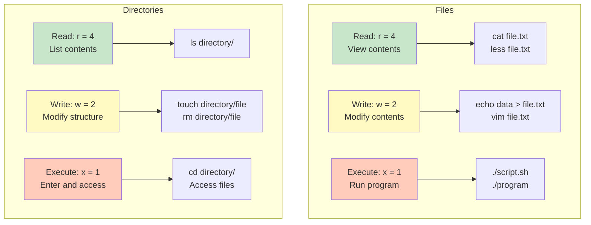
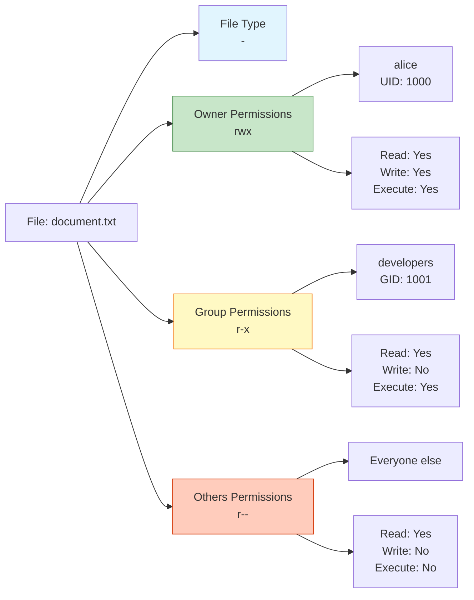
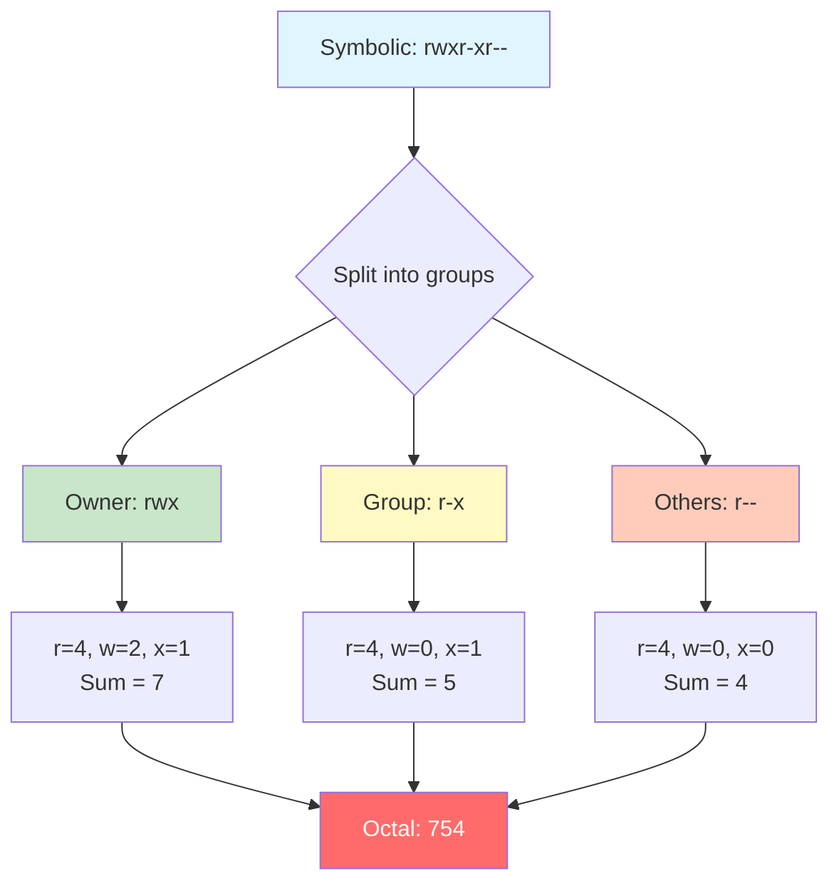
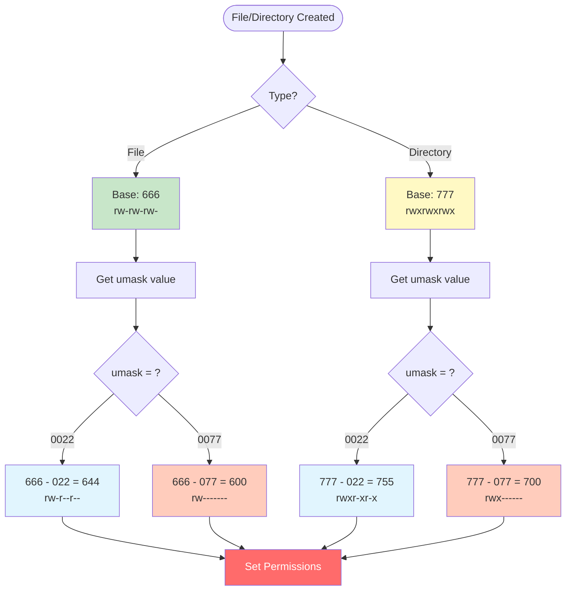
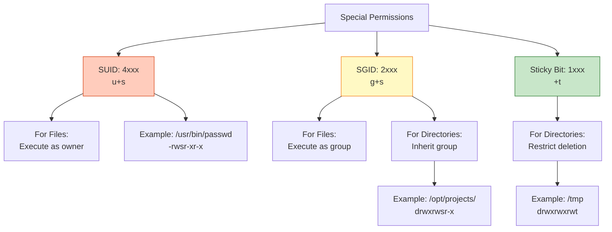
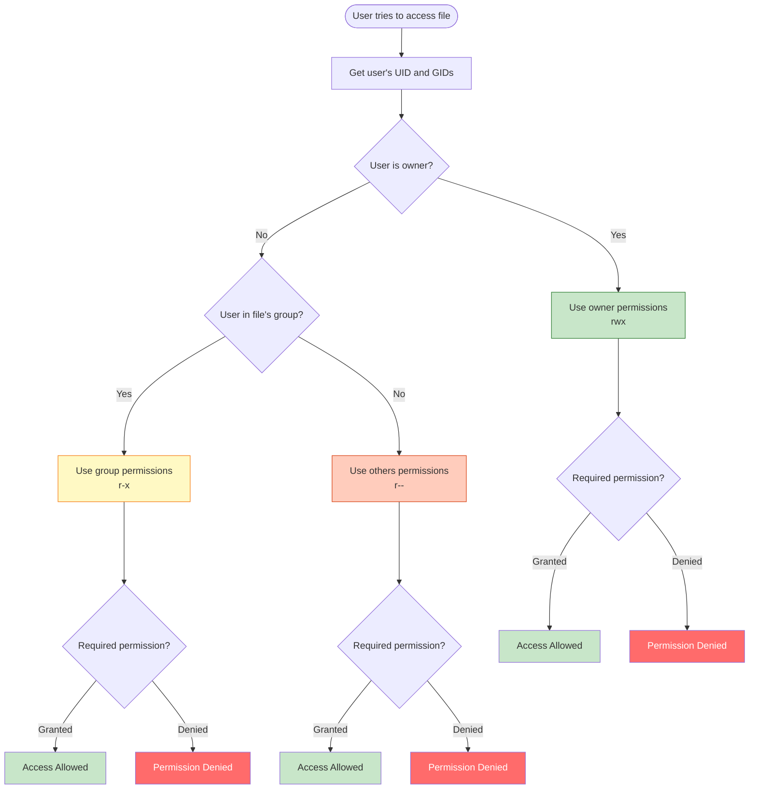

#linux #operating-system #security #access-control #file-system #ubuntu #debian #fedora
#rhel #centos-stream #unix
- File permissions control who can read, write, or execute files and directories.
- <mark class="hltr-yellow">Permissions form the foundation of Unix security model</mark>.
- Every file and directory has an owner, group, and permission set.
# Permission Types
## Read (r)
### For Files
- <mark class="hltr-yellow">Allows viewing file contents</mark>.
- Can read data from the file.
- Symbolic: `r`, Octal: `4`
### For Directories
- <mark class="hltr-yellow">Allows listing directory contents</mark>.
- Can view names of files in the directory.
- Requires execute permission to access file metadata.
## Write (w)
### For Files
- <mark class="hltr-yellow">Allows modifying file contents</mark>.
- Can write, append, or truncate the file.
- Symbolic: `w`, Octal: `2`
### For Directories
- <mark class="hltr-yellow">Allows creating, deleting, and renaming files</mark>.
- Can modify directory structure.
- Requires execute permission to be effective.
## Execute (x)
### For Files
- <mark class="hltr-yellow">Allows running file as a program</mark>.
- Can execute the file if it's a binary or script.
- Symbolic: `x`, Octal: `1`
### For Directories
- <mark class="hltr-yellow">Allows entering the directory and accessing files</mark>.
- Can `cd` into the directory.
- Can access file metadata (size, permissions, timestamps).
- Required to access files even if you have read permission.

## Permission Comparison


# Permission Sets
- Every file has three permission sets for three categories of users.
## Owner (User)
- <mark class="hltr-yellow">Permissions for the file owner</mark>.
- Identified by UID.
- Represented by first three permission bits.
- Symbol: `u` (user)
## Group
- <mark class="hltr-yellow">Permissions for users in the file's group</mark>.
- Identified by GID.
- Represented by second three permission bits.
- Symbol: `g` (group)
## Others (World)
- <mark class="hltr-yellow">Permissions for all other users</mark>.
- Users who are not owner and not in the group.
- Represented by third three permission bits.
- Symbol: `o` (others)
## Permission Structure


# Permission Representation
## Symbolic Notation
- Uses letters: `r` (read), `w` (write), `x` (execute), `-` (no permission).
- Format: `rwxrwxrwx`
- Three groups of three characters each.
### Structure
```Shell title='Permission structure'
- rwx rwx rwx
│ │   │   │
│ │   │   └── Others permissions
│ │   └────── Group permissions
│ └────────── Owner permissions
└──────────── File type
```
### File Type Symbols
- `-` - Regular file
- `d` - Directory
- `l` - Symbolic link
- `c` - Character device
- `b` - Block device
- `s` - Socket
- `p` - Named pipe (FIFO)
### Examples
```Shell title='Symbolic permission examples'
-rw-r--r--  # File: owner (rw-), group (r--), others (r--)
drwxr-xr-x  # Directory: owner (rwx), group (r-x), others (r-x)
-rwxr-xr-x  # Executable: owner (rwx), group (r-x), others (r-x)
-rw-------  # Private file: owner (rw-), group (---), others (---)
lrwxrwxrwx  # Symbolic link: all permissions (links inherit target permissions)
```
## Octal Notation
- Uses numbers: `0-7` representing combination of permissions.
- <mark class="hltr-yellow">Each permission type has a numeric value</mark>:
	- Read (`r`) = `4`
	- Write (`w`) = `2`
	- Execute (`x`) = `1`
- Sum values to get permission digit.
### Permission Values
| Octal | Binary | Symbolic | Permissions |
|-------|--------|----------|-------------|
| 0 | 000 | --- | No permissions |
| 1 | 001 | --x | Execute only |
| 2 | 010 | -w- | Write only |
| 3 | 011 | -wx | Write + Execute |
| 4 | 100 | r-- | Read only |
| 5 | 101 | r-x | Read + Execute |
| 6 | 110 | rw- | Read + Write |
| 7 | 111 | rwx | Read + Write + Execute |
### Common Permission Modes
| Octal | Symbolic   | Description                                         |
| ----- | ---------- | --------------------------------------------------- |
| 644   | -rw-r--r-- | Regular file (owner: rw, group: r, others: r)       |
| 755   | -rwxr-xr-x | Executable file (owner: rwx, group: rx, others: rx) |
| 700   | -rwx------ | Private file (owner: rwx, no access for others)     |
| 666   | -rw-rw-rw- | World-writable file (all: rw)                       |
| 777   | -rwxrwxrwx | World-writable executable (all: rwx)                |
| 600   | -rw------- | Private file (owner: rw only)                       |
### Calculation Example
```
Symbolic: rwxr-xr--
Owner:  rwx = 4 + 2 + 1 = 7
Group:  r-x = 4 + 0 + 1 = 5
Others: r-- = 4 + 0 + 0 = 4
Octal: 754
```
## Permission Conversion


# Viewing Permissions
## List Files with Permissions
```Shell title='View file permissions'
ls -l
# Output:
# -rw-r--r-- 1 alice developers 1024 Jan 03 10:00 document.txt
# drwxr-xr-x 2 alice developers 4096 Jan 03 10:00 projects/
```
## Output Format
```
-rw-r--r-- 1 alice developers 1024 Jan 03 10:00 document.txt
│          │ │     │          │    │           │
│          │ │     │          │    │           └── Filename
│          │ │     │          │    └────────────── Modification time
│          │ │     │          └─────────────────── Size (bytes)
│          │ │     └────────────────────────────── Group owner
│          │ └──────────────────────────────────── User owner
│          └─────────────────────────────────────── Link count
└────────────────────────────────────────────────── Permissions
```
## View Specific File Permissions
```Shell title='Check specific file'
ls -l /etc/passwd
# Output: -rw-r--r-- 1 root root 2847 Jan 03 10:00 /etc/passwd

# View directory itself (not contents)
ls -ld /home/alice
# Output: drwxr-xr-x 15 alice alice 4096 Jan 03 10:00 /home/alice
```
## View Octal Permissions
```Shell title='Display octal permissions'
stat -c '%a %n' file.txt
# Output: 644 file.txt

# Detailed information
stat file.txt
```
# Changing Permissions
## Modify Permissions
### Syntax
```Shell title='Change permissions'
chmod [options] mode file
```
### Octal Mode
```Shell title='Change permissions with octal mode example'
# Set permissions using octal notation
chmod 644 file.txt         # rw-r--r--
chmod 755 script.sh        # rwxr-xr-x
chmod 700 private.txt      # rwx------
chmod 600 secret.txt       # rw-------

# Apply to directory and contents recursively
chmod -R 755 /var/www/html
```
### Symbolic Mode
- Syntax: `[ugoa][+-=][rwx]`
	- `u` - user (owner)
	- `g` - group
	- `o` - others
	- `a` - all (ugo)
	- `+` - add permission
	- `-` - remove permission
	- `=` - set exact permission
```Shell title='Modify permissions'
# Add execute permission for owner
chmod u+x script.sh

# Remove write permission for group and others
chmod go-w file.txt

# Set read and write for owner, read-only for others
chmod u=rw,go=r file.txt

# set permissions for some_directory to rwxr-xr-x
chmod u=rwx,g=rx,o=rx some_directory

# Add execute permission for all
chmod a+x script.sh
# Or equivalently:
chmod +x script.sh

# Remove all permissions for others
chmod o-rwx private.txt
# Or equivalently:
chmod o= private.txt
```
### Common Options
- `-R` - Recursive (apply to directories and contents).
- `-v` - Verbose (show changes).
- `--reference=file` - Use permissions from reference file.
### Examples
```Shell title='Permission modification examples'
# Make script executable for owner
chmod u+x script.sh

# Set standard file permissions
chmod 644 document.txt

# Set standard directory permissions
chmod 755 directory/

# Remove write permission for group and others
chmod go-w file.txt

# Copy permissions from another file
chmod --reference=template.txt newfile.txt

# Recursively set directory permissions
chmod -R 755 /var/www/html
```
# Changing Ownership
## Change Owner
### Syntax
```Shell title='Change file owner'
chown [options] owner[:group] file
```
### Examples
```Shell title='Change file owner examples'
# Change owner to alice
sudo chown alice file.txt

# Change owner and group
sudo chown alice:developers file.txt

# Change owner recursively
sudo chown -R alice:developers /opt/project/

# Change owner only (keep group)
sudo chown alice file.txt

# Change using UID:GID
sudo chown 1000:1001 file.txt
```
### Common Options
- `-R` - Recursive.
- `-v` - Verbose.
- `--reference=file` - Use ownership from reference file.
## Change Group
### Syntax
```Shell title='Change file group'
chgrp [options] group file
```
### Examples
```Shell title='Change group examples'
# Change group to developers
sudo chgrp developers file.txt

# Change group recursively
sudo chgrp -R developers /opt/project/

# Copy group from another file
sudo chgrp --reference=template.txt newfile.txt
```
# Default Permissions (umask)
## umask Value
- <mark class="hltr-yellow">Determines default permissions for newly created files and directories</mark>.
- Subtracts permissions from the base permissions.
- Base permissions:
	- Files: `666` (`rw-rw-rw-`)
	- Directories: `777` (`rwxrwxrwx`)
- Final permissions = Base permissions - umask
## View umask
```Shell title='Display current umask'
umask
# Output: 0022

# Display in symbolic notation
umask -S
# Output: u=rwx,g=rx,o=rx
```
## Set umask
```Shell title='Set umask value'
# Set umask to 0022 (default)
umask 0022

# Set umask to 0077 (private files)
umask 0077

# Set permanently in ~/.bashrc or ~/.profile
echo "umask 0022" >> ~/.bashrc
```
## umask Calculation
### Example 1: umask 0022
```
Files:
  Base:   666 (rw-rw-rw-)
  umask:  022 (----w--w-)
  Result: 644 (rw-r--r--)

Directories:
  Base:   777 (rwxrwxrwx)
  umask:  022 (----w--w-)
  Result: 755 (rwxr-xr-x)
```
### Example 2: umask 0077
```
Files:
  Base:   666 (rw-rw-rw-)
  umask:  077 (---rwxrwx)
  Result: 600 (rw-------)

Directories:
  Base:   777 (rwxrwxrwx)
  umask:  077 (---rwxrwx)
  Result: 700 (rwx------)
```
## Common umask Values
| umask | Files           | Directories     | Description               |
| ----- | --------------- | --------------- | ------------------------- |
| 0022  | 644 (rw-r--r--) | 755 (rwxr-xr-x) | Default (readable by all) |
| 0002  | 664 (rw-rw-r--) | 775 (rwxrwxr-x) | Group-writable            |
| 0027  | 640 (rw-r-----) | 750 (rwxr-x---) | Group-readable only       |
| 0077  | 600 (rw-------) | 700 (rwx------) | Private (owner only)      |
## umask Flow


# Special Permissions
## Set User ID (SUID)
- <mark class="hltr-yellow">Executes file with owner's privileges instead of executor's</mark>.
- Applies only to *executable* files.
- Symbolic: `s` in owner's execute position.
- Octal: `4xxx` (e.g., `4755`)
- Poses a security risk if applied to shell scripts or insecure programs.
### Example
```Shell title='SUID example'
# /usr/bin/passwd has SUID set
ls -l /usr/bin/passwd
# Output: -rwsr-xr-x 1 root root 68208 Jan 03 10:00 /usr/bin/passwd

# The system temporarily elevates you to root permissions
passwd


# Set SUID
sudo chmod u+s program
sudo chmod 4755 program

# Remove SUID
sudo chmod u-s program
```
### Behavior
- When user executes  a file, for example`/usr/bin/passwd`, it runs with root privileges.
- Allows users to run the program with the owner's privileges.
## Set Group ID (SGID)
### For Files
- <mark class="hltr-yellow">Executes file with group's privileges</mark>.
- Symbolic: `s` in group's execute position.
- Octal: `2xxx` (e.g., `2755`)
### For Directories
- <mark class="hltr-yellow">New files inherit directory's group instead of creator's primary group</mark>.
- Useful for shared project directories.
### Examples
```Shell title='SGID examples'
# Set SGID on directory
sudo chmod g+s /opt/projects/
sudo chmod 2775 /opt/projects/

# Verify
ls -ld /opt/projects/
# Output: drwxrwsr-x 2 alice developers 4096 Jan 03 10:00 /opt/projects/

# Files created in this directory inherit 'developers' group
touch /opt/projects/newfile.txt
ls -l /opt/projects/newfile.txt
# Output: -rw-r--r-- 1 alice developers 0 Jan 03 10:00 newfile.txt

# Remove SGID
sudo chmod g-s /opt/projects/
```
## Sticky Bit
- <mark class="hltr-yellow">Applied to directories to restrict deletion</mark>.
- Only file owner, directory owner, or root can delete/rename files.
- Other users cannot delete files they don't own, even with write permission.
- Symbolic: `t` in others' execute position.
- Octal: `1xxx` (e.g., `1777`)
### Example
```Shell title='Sticky bit example'
# /tmp has sticky bit set
ls -ld /tmp
# Output: drwxrwxrwt 20 root root 4096 Jan 03 10:00 /tmp

# Set sticky bit
sudo chmod +t /shared/
sudo chmod 1777 /shared/

# Remove sticky bit
sudo chmod -t /shared/
```
### Sticky Bit Behavior
- In `/tmp`, any user can create files.
- Users can only delete their own files.
- Prevents users from deleting other users' files.
## Special Permission Symbols
| Position | Normal | Special | Meaning |
|----------|--------|---------|---------|
| Owner execute | x | s | SUID set, executable |
| Owner execute | - | S | SUID set, not executable |
| Group execute | x | s | SGID set, executable |
| Group execute | - | S | SGID set, not executable |
| Others execute | x | t | Sticky bit set, executable |
| Others execute | - | T | Sticky bit set, not executable |

## Special Permissions Summary


# Permission Checking Process


# Practical Examples
## Example 1: Create Executable Script
```bash
# Create script
cat > script.sh << 'EOF'
#!/bin/bash
echo "Hello, World!"
EOF

# Check permissions (not executable)
ls -l script.sh
# Output: -rw-r--r-- 1 alice alice 32 Jan 03 10:00 script.sh

# Make executable for owner
chmod u+x script.sh

# Verify
ls -l script.sh
# Output: -rwxr--r-- 1 alice alice 32 Jan 03 10:00 script.sh

# Run script
./script.sh
# Output: Hello, World!
```
## Example 2: Create Shared Project Directory
```bash
# Create directory
sudo mkdir /opt/shared-project

# Set group ownership
sudo chgrp developers /opt/shared-project

# Set permissions: rwx for owner and group, no access for others
sudo chmod 770 /opt/shared-project

# Set SGID so new files inherit group
sudo chmod g+s /opt/shared-project

# Verify
ls -ld /opt/shared-project
# Output: drwxrwsr-- 2 root developers 4096 Jan 03 10:00 /opt/shared-project

# Test: create file as user alice
touch /opt/shared-project/test.txt

# Verify group inheritance
ls -l /opt/shared-project/test.txt
# Output: -rw-r--r-- 1 alice developers 0 Jan 03 10:00 test.txt
```
## Example 3: Secure Private Files
```bash
# Create private directory
mkdir ~/private

# Remove all permissions for group and others
chmod 700 ~/private

# Create private file
touch ~/private/secret.txt

# Set restrictive permissions
chmod 600 ~/private/secret.txt

# Verify
ls -ld ~/private
# Output: drwx------ 2 alice alice 4096 Jan 03 10:00 /home/alice/private

ls -l ~/private/secret.txt
# Output: -rw------- 1 alice alice 0 Jan 03 10:00 secret.txt
```
## Example 4: Web Server Permissions
```bash
# Create web directory
sudo mkdir -p /var/www/html/mysite

# Set ownership to web server user
sudo chown -R www-data:www-data /var/www/html/mysite

# Set directory permissions (755)
sudo find /var/www/html/mysite -type d -exec chmod 755 {} \;

# Set file permissions (644)
sudo find /var/www/html/mysite -type f -exec chmod 644 {} \;

# Verify
ls -l /var/www/html/
# Output: drwxr-xr-x 2 www-data www-data 4096 Jan 03 10:00 mysite
```
## Example 5: Temporary Shared Directory
```bash
# Create shared temp directory
sudo mkdir /shared-temp

# Set world-writable with sticky bit
sudo chmod 1777 /shared-temp

# Verify
ls -ld /shared-temp
# Output: drwxrwxrwt 2 root root 4096 Jan 03 10:00 /shared-temp

# Test: user alice creates file
touch /shared-temp/alice-file.txt

# Test: user bob tries to delete alice's file (fails)
# rm /shared-temp/alice-file.txt
# Output: rm: cannot remove 'alice-file.txt': Operation not permitted

# Bob can only delete his own files
touch /shared-temp/bob-file.txt
rm /shared-temp/bob-file.txt  # Success
```
## Example 6: Copy Permissions from Template
```bash
# Create template file with desired permissions
touch template.txt
chmod 644 template.txt

# Create new files
touch file1.txt file2.txt file3.txt

# Copy permissions from template
chmod --reference=template.txt file1.txt
chmod --reference=template.txt file2.txt
chmod --reference=template.txt file3.txt

# Verify
ls -l
# All files have same permissions as template
```
## Example 7: Recursive Permission Fix
```bash
# Fix permissions for web directory
# Directories: 755, Files: 644

cd /var/www/html

# Set all directories to 755
sudo find . -type d -exec chmod 755 {} \;

# Set all files to 644
sudo find . -type f -exec chmod 644 {} \;

# Set executable scripts to 755
sudo find . -type f -name "*.sh" -exec chmod 755 {} \;
```

# Common Permission Patterns
## Standard File Permissions
```Shell title='Common file permission patterns'
644  # -rw-r--r--  Regular files (readable by all)
640  # -rw-r-----  Readable by owner and group only
600  # -rw-------  Private files (owner only)
755  # -rwxr-xr-x  Executable files (runnable by all)
750  # -rwxr-x---  Executable by owner and group
700  # -rwx------  Private executables (owner only)
```
## Standard Directory Permissions
```Shell title='Common directory permission patterns'
755  # drwxr-xr-x  Standard directories (accessible by all)
750  # drwxr-x---  Accessible by owner and group
700  # drwx------  Private directories (owner only)
775  # drwxrwxr-x  Group-writable directories
770  # drwxrwx---  Shared group directories (no public access)
1777 # drwxrwxrwt  Temporary directories with sticky bit
2775 # drwxrwsr-x  Group-collaborative directories with SGID
```
## System File Permissions
```Shell title='Critical system file permissions'
# Password files
-rw-r--r--  /etc/passwd      # 644 (world-readable)
-rw-------  /etc/shadow      # 600 (root only)

# System binaries
-rwxr-xr-x  /bin/bash        # 755 (executable by all)
-rwsr-xr-x  /usr/bin/passwd  # 4755 (SUID, executable by all)
-rwsr-xr-x  /usr/bin/sudo    # 4755 (SUID, executable by all)

# Directories
drwxr-xr-x  /etc             # 755 (standard)
drwx------  /root            # 700 (root private)
drwxrwxrwt  /tmp             # 1777 (world-writable, sticky bit)
```
# Troubleshooting Permissions
## Permission Denied Errors
```Shell title='Debug permission issues'
# Check file permissions
ls -l /path/to/file

# Check directory permissions (need x on all parent directories)
ls -ld /path
ls -ld /path/to
ls -ld /path/to/file

# Check ownership
stat /path/to/file

# Check your user and groups
id

# Check effective permissions
namei -l /path/to/file
```
## Common Issues
### Cannot Execute Script
```Shell title='Fix cannot execute script'
# Problem: Permission denied
./script.sh
# Error: bash: ./script.sh: Permission denied

# Solution: Add execute permission
chmod +x script.sh
```
### Cannot Access Directory
```Shell title='Fix cannot access directory'
# Problem: Cannot cd into directory
cd /opt/project
# Error: bash: cd: /opt/project: Permission denied

# Check permissions
ls -ld /opt/project
# Output: drw-r--r-- 2 alice developers 4096 Jan 03 10:00 /opt/project

# Solution: Add execute permission
sudo chmod 755 /opt/project
```
### Cannot List Directory Contents
```Shell title='Fix cannot list directory contents'
# Problem: Can cd but cannot ls
cd /opt/project  # Success
ls
# Error: ls: cannot open directory '.': Permission denied

# Check permissions
ls -ld .
# Output: d--xr-xr-x 2 alice developers 4096 Jan 03 10:00 .

# Solution: Add read permission
sudo chmod 755 .
```
### Cannot Delete File in Directory
```Shell title='Fix cannot delete file in directory'
# Problem: Cannot delete file even with write permission on file
rm /shared/file.txt
# Error: rm: cannot remove 'file.txt': Permission denied

# Check directory permissions (need write on directory)
ls -ld /shared
# Output: dr-xr-xr-x 2 root root 4096 Jan 03 10:00 /shared

# Solution: Add write permission to directory
sudo chmod 775 /shared
```
***
# References
1. Operating System Concepts - Abraham Silberschatz - 10th - 2018 - Pearson Publisher.
	1. Chapter 17: Protection.
		1. Section 17.5: Access Control.
		2. Section 17.6: Capability-Based Systems.
2. The Linux Command Line - William Shotts - 2nd Edition - 2019 - No Starch Press.
	1. Chapter 9: Permissions.
	2. Chapter 10: Processes.
3. Unix and Linux System Administration Handbook - Evi Nemeth - 5th Edition - 2017 - Addison-Wesley.
	1. Chapter 5: Access Control and Rootly Powers.
4. `man chmod`, `man chown`, `man chgrp`, `man umask`, `man stat`
5. https://www.redhat.com/sysadmin/linux-file-permissions-explained
6. https://wiki.archlinux.org/title/File_permissions_and_attributes
