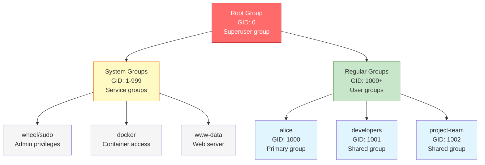
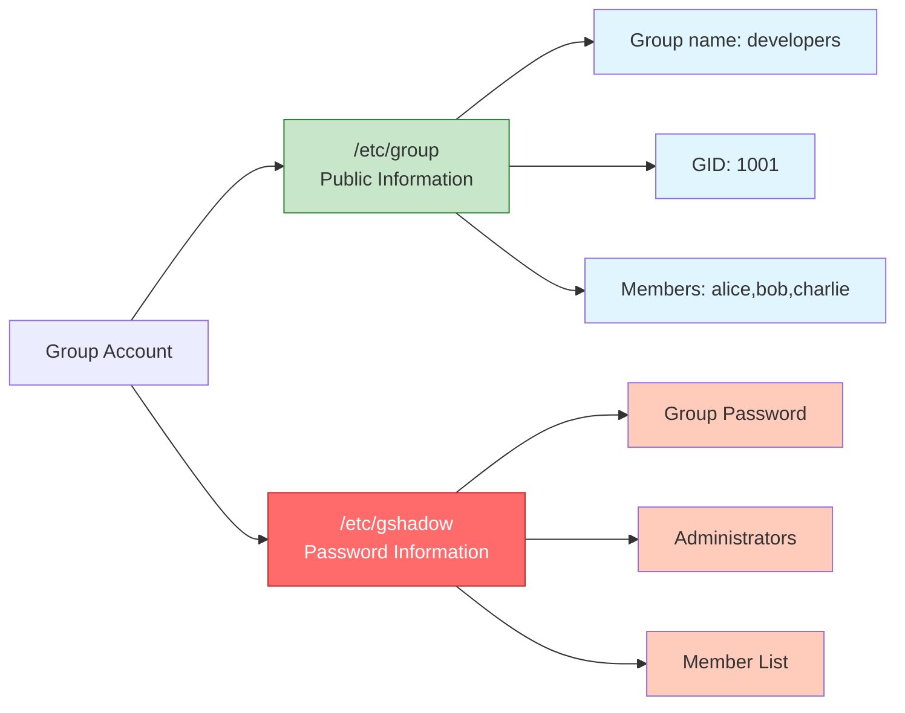
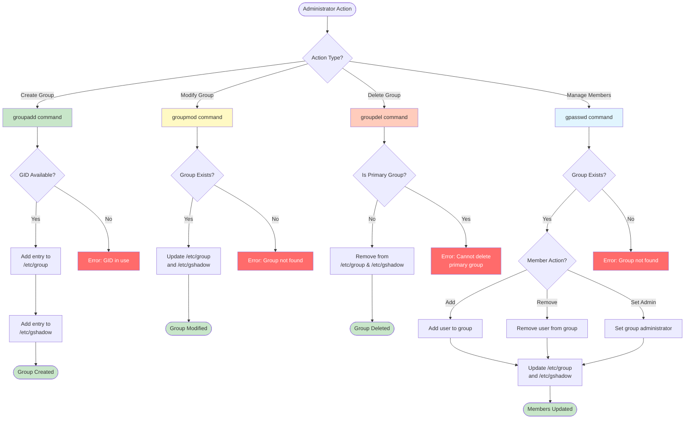
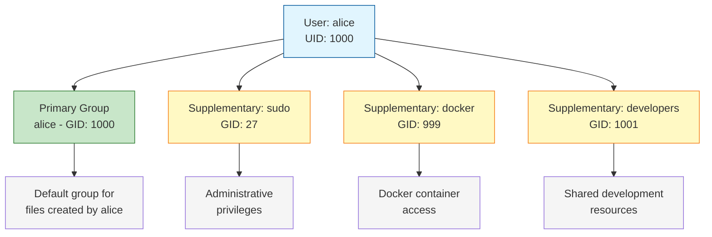

#linux #operating-system #security #access-control #ubuntu #debian #fedora #rhel
#centos-stream #unix
- A group is a collection of users that share common permissions and access rights.
- Groups provide the basis for collaborative access control and resource sharing in Unix-like systems.
# Group Types
## Primary Group
- <mark class="hltr-yellow">Every user must have exactly one primary group</mark>.
- Specified in `/etc/passwd` file (GID field).
- Files created by the user are owned by their primary group.
- Typically has the same name as the username for regular users.
## Supplementary Groups (Secondary Groups)
- <mark class="hltr-yellow">Additional groups a user can belong to</mark>.
- User can be member of up to 16 supplementary groups (system-dependent).
- Provides additional permissions beyond primary group.
- Specified in `/etc/group` file.
## System Groups
- GID range: `0-999` (system-dependent).
- <mark class="hltr-yellow">Used by system services and daemons</mark>.
- Examples: `root`, `daemon`, `sys`, `adm`, `wheel`, `sudo`, `docker`.
## Group Hierarchy


# Group Identification
## Group ID (GID)
- Numeric identifier assigned to each group.
- <mark class="hltr-yellow">Operating system uses GID, not group name, for access control</mark>.
- Must be unique within the system.
- Range:
	- `0` - Root group
	- `1-999` - System groups
	- `1000-60000` - Regular groups (default range)
## Group Name
- Human-readable identifier.
- <mark class="hltr-yellow">Mapped to GID by the system</mark>.
- Must be unique.
- Conventions:
	- Lowercase letters
	- May include numbers, hyphens, underscores
	- Maximum length: 32 characters (typically)
# Group Account Files
## `/etc/group`
- Stores group account information.
- <mark class="hltr-yellow">World-readable file containing group database</mark>.
- Each line represents one group.
### Format
```
groupname:x:GID:member1,member2,member3
```
### Fields
- **groupname** - Group name.
- **x** - Password placeholder (actual password in `/etc/gshadow`).
- **GID** - Group ID number.
- **members** - Comma-separated list of supplementary group members.
	- <mark class="hltr-yellow">Does not include users whose primary group is this group</mark>.
### Example Entry
```Shell title='Group information entry example'
developers:x:1001:alice,bob,charlie
```
## `/etc/gshadow`
- Stores encrypted group password and administrator information.
- <mark class="hltr-yellow">Readable only by root for security</mark>.
- Each line corresponds to a group in `/etc/group`.
### Format
```
groupname:password:administrators:members
```
### Fields
- **groupname** - Group name.
- **password** - Encrypted group password hash.
	- `!` or `*` - No password set.
	- Empty - No password required.
- **administrators** - Comma-separated list of group administrators.
	- Can add/remove members using `gpasswd`.
- **members** - Comma-separated list of group members.
### Example Entry
```Shell title='Group with administrators entry'
developers:!:alice:alice,bob,charlie
```
## File Structure


# Group Management Commands
## Create Group
### Syntax
```Shell title='Create group'
groupadd [options] groupname
```
### Common Options
- `-g GID` - Specify group ID.
- `-r` - Create system group.
- `-f` - Force creation (exit successfully if group exists).
### Examples
```bash
# Create group with default settings
sudo groupadd developers

# Create group with specific GID
sudo groupadd -g 1500 project-team

# Create system group
sudo groupadd -r nginx
```
## Modify Group
### Syntax
```Shell title='Modify group'
groupmod [options] groupname
```
### Common Options
- `-g GID` - Change group ID.
- `-n newname` - Rename group.
### Examples
```bash
# Change group GID
sudo groupmod -g 1600 developers

# Rename group
sudo groupmod -n dev-team developers
```
## Delete Group
### Syntax
```Shell title='Delete group'
groupdel groupname
```
### Examples
```bash
# Delete group
sudo groupdel developers

# Note: Cannot delete primary group of existing user
```
## Manage Group Members
### Syntax
```Shell title='Manage group members'
gpasswd [options] groupname
```
### Common Options
- `-a user` - Add user to group.
- `-d user` - Remove user from group.
- `-A user` - Set group administrator.
- `-M user1,user2` - Set group members (replaces existing).
### Examples
```bash
# Add user to group
sudo gpasswd -a alice developers

# Remove user from group
sudo gpasswd -d bob developers

# Set multiple members at once
sudo gpasswd -M alice,bob,charlie developers

# Set group administrator
sudo gpasswd -A alice developers
```
## Alternative: Add User to Group
### Syntax
```Shell title='Add user to supplementary group'
usermod -aG groupname username
```
### Examples
```bash
# Add user to supplementary group
sudo usermod -aG docker alice

# Add user to multiple groups
sudo usermod -aG docker,wheel,sudo alice
```
# Group Management Flow


# Group Information Commands
## Display User's Groups
```Shell title='User groups'
# Show current user's groups
groups

# Show specific user's groups
groups alice
# Output: alice : alice sudo docker developers
```
## Display Group Information
```Shell title='Group information'
# Show group details
getent group developers
# Output: developers:x:1001:alice,bob,charlie

# Show all groups
getent group
```
## Display Group ID
```Shell title='Group ID'
# Show user's group IDs
id alice
# Output: uid=1000(alice) gid=1000(alice) groups=1000(alice),27(sudo),999(docker),1001(developers)
```
## Display Group Members
```Shell title='Group members'
# Show members of a group
getent group developers | cut -d: -f4
# Output: alice,bob,charlie
```
# Practical Examples
## Example 1: Create Development Team Group
```bash
# Create developers group
sudo groupadd developers

# Add multiple users to group
sudo gpasswd -M alice,bob,charlie developers

# Verify group creation
getent group developers
# Output: developers:x:1001:alice,bob,charlie

# Add another user later
sudo gpasswd -a dave developers
```
## Example 2: Create Shared Project Directory
```bash
# Create project group
sudo groupadd project-team

# Add users to group
sudo usermod -aG project-team alice
sudo usermod -aG project-team bob

# Create shared directory
sudo mkdir /opt/projects

# Set group ownership
sudo chgrp project-team /opt/projects

# Set permissions (read, write, execute for group)
sudo chmod 2775 /opt/projects

# Verify permissions
ls -ld /opt/projects
# Output: drwxrwsr-x 2 root project-team 4096 Jan 03 10:00 /opt/projects
```
## Example 3: Grant Docker Access
```bash
# Add user to docker group
sudo usermod -aG docker alice

# Verify group membership
groups alice
# Output: alice : alice sudo docker

# User needs to log out and back in for changes to take effect
# Or use: newgrp docker
```
## Example 4: Create System Service Group
```bash
# Create system group for nginx
sudo groupadd -r nginx

# Create system user and assign to group
sudo useradd -r -g nginx -s /usr/sbin/nologin nginx

# Verify
id nginx
# Output: uid=995(nginx) gid=995(nginx) groups=995(nginx)
```
## Example 5: Group Administration
```bash
# Create group with administrator
sudo groupadd developers

# Set alice as group administrator
sudo gpasswd -A alice developers

# Alice can now add/remove members (without sudo)
gpasswd -a bob developers
gpasswd -d charlie developers

# Verify administrators in /etc/gshadow
sudo grep developers /etc/gshadow
# Output: developers:!:alice:bob
```
# Primary vs Supplementary Groups
## Primary Group
- Specified in `/etc/passwd` file.
- Used as default group for files created by user.
- Cannot be changed with `gpasswd` or `usermod -aG`.
- Must use `usermod -g` to change primary group.
### Example
```Shell title='Change primary group'
# Change alice's primary group to developers
sudo usermod -g developers alice

# Verify
id alice
# Output: uid=1000(alice) gid=1001(developers) groups=1001(developers),...
```
## Supplementary Groups
- Listed in `/etc/group` file.
- Provides additional permissions.
- Can be modified with `gpasswd` or `usermod -aG`.
### Example
```Shell title='Add supplementary groups'
# Add alice to multiple supplementary groups
sudo usermod -aG docker,sudo,developers alice

# Verify
id alice
# Output: uid=1000(alice) gid=1000(alice) groups=1000(alice),27(sudo),999(docker),1001(developers)
```
## Group Membership Visualization


# Special Administrative Groups
## sudo/wheel Group
- <mark class="hltr-yellow">Grants administrative privileges</mark>.
- Members can execute commands with `sudo`.
- Group name varies by distribution:
	- Debian/Ubuntu: `sudo`
	- RHEL/Fedora/CentOS: `wheel`
### Example
```Shell title='Grant sudo privileges'
# Add user to sudo group (Debian/Ubuntu)
sudo usermod -aG sudo alice

# Add user to wheel group (RHEL/Fedora)
sudo usermod -aG wheel alice
```
## docker Group
- <mark class="hltr-yellow">Grants Docker daemon access</mark>.
- Members can run Docker commands without `sudo`.
- Security consideration: Equivalent to root access.
### Example
```Shell title='Grant Docker access'
# Add user to docker group
sudo usermod -aG docker alice

# User must log out and back in
```
## www-data Group
- <mark class="hltr-yellow">Used by web servers (Apache, Nginx)</mark>.
- Grants access to web content directories.
### Example
```Shell title='Grant web server access'
# Add user to www-data group
sudo usermod -aG www-data alice

# Set group ownership on web directory
sudo chgrp -R www-data /var/www/html
```
***
# References
1. Operating System Concepts - Abraham Silberschatz - 10th - 2018 - Pearson Publisher.
	1. Chapter 17: Protection.
		1. Section 17.3: Access Matrix.
2. The Linux Command Line - William Shotts - 2nd Edition - 2019 - No Starch Press.
	1. Chapter 9: Permissions.
3. `man groupadd`, `man groupmod`, `man groupdel`, `man gpasswd`
4. https://www.redhat.com/sysadmin/linux-user-group-management
5. https://wiki.archlinux.org/title/Users_and_groups
